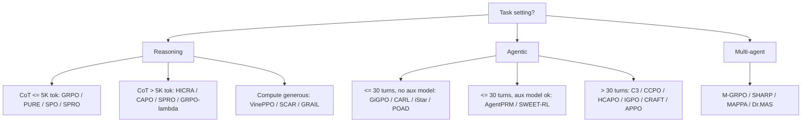

# From Reasoning to Agentic: Credit Assignment in Reinforcement Learning for Large Language Models

- arXiv: https://arxiv.org/abs/2604.09459
- Source: https://arxiv.org/abs/2604.09459
- Project: 
- Local PDF: `papers/rl/agentic-algo/ReasoningToAgentic_2604.09459.pdf`
- Year: 2026
- Category: rl
- Priority: high

## 一句话总结

独立作者的分析型综述（50 页，arXiv v3 2026-08，单作者、无同行评审信息）：把 credit assignment（CA）设为审视 LLM RL 的中心透镜，冻结 2026-07-31 的语料——92 条去重筛选记录中纳入 69 篇（56 核心 CA 方法 + 13 邻近/边界使能器），其中固定 42 篇核心子集（15 reasoning + 23 agentic/mixed + 4 multi-agent）做全文诊断审计；保留 granularity × methodology 二维分类，新增六诊断框架（转移非闭合、部分可观测、受限重放、异构动作、弱局部可验证、智能体耦合）和两个识别命题（restored-state 对照在什么条件下可识别；text-only 历史连 credit 的符号都不可识别），并提出 CA-ID Card 声明契约与四层证据分级。核心论点：从 reasoning 到 agentic 的迁移不是"任务变难"，而是可识别的 credit 声明集合本身变了。

## 核心技术

1. **可审计的语料工程**：筛选台账（92 条，23 条排除但保留排除理由）、69 篇统一清单、42 篇固定全文子集。两名算法研究者冻结评分细则后独立盲编 6 个诊断 + 1 个排他主家族，共 252 个二元诊断格，一致 223 格（88.5%），各诊断 Cohen's $\kappa$ 介于 .543–.909，主家族判定 42/42 全一致（$\kappa = 1.000$）；29 处诊断分歧分布在 18 篇论文，保留原样不做事后调和。
2. **四阶段叙事主线**：RLHF（2022–23，稠密 RM 奖励，单轮 ~500 token，CA 隐式由 PPO critic 承担）→ Reasoning RL（2023–25，0/1 结果奖励，单次生成 0.5K–30K token，CA 显式化为 token/step 级，催生 PRM）→ Agentic RL（2024–，稀疏终端奖励，10–100+ 轮、10^5–10^6 token，CA 转向 turn 级与 hindsight）→ Multi-Agent（2026+，团队奖励、100+ 轮、跨智能体 credit）。半年度分布 3/6/10/18/31/1 篇（2024H1 至 2026H2-partial），增速可见。
3. **双抽象与多粒度层级**：reasoning RL 建模为 token 级 MDP（可见前缀转移在固定模型/分词器/解码配置下闭合），agentic RL 建模为 turn 级 POMDP（环境随机转移 + 部分可观测）；credit 分解因此是双层级联的——先问哪一轮关键，再问轮内哪些 token 重要。动作层级为 Episode → Turn → Segment → Token。
4. **六诊断镜头**：每个正向编码表示论文声明的机制显式回应了对应的 break。42 篇子集中的共识正计数为：转移非闭合 T 24/42、部分可观测 O 10/42、受限重放 R 19/42、异构动作 H 20/42、弱局部可验证 V 32/42、智能体耦合 C 7/42。每个诊断配一条识别障碍与最低评估控制（如 T 要求恢复环境与隐藏执行状态，R 要求声明重放来源并测 replica noise floor）。
5. **识别结果与 CA-ID Card**：定义协议特定对照 $\Delta_u(q_u;\rho)$ 并证明 restored-state 采样均值是其无偏估计（Proposition 1）；构造 text-only witness 证明无恢复/无观测假设时连因果 credit 的符号都不可识别（Proposition 2）。据此把方法证据分四层：restored-interventional、observational-causal（需可交换性+positivity）、model-relative counterfactual、predictive/proxy，并给出 CA-ID Card 六字段（unit 与 estimand、有效状态、干预来源、下游协议、支撑与不确定性、优化接口）。
6. **方法地图**（granularity × methodology）：reasoning 侧 token 级（VinePPO、RED、T-REG、From r to Q*）、segment 级（SPO、SCAR、TEMPO）、step 级（PURE、SPRO、CAPO、HICRA、PRL、InT）；agentic 侧 turn 级 PRM（AgentPRM、SWEET-RL、Turn-PPO、SORL、TARL、ITPO）、hindsight/反事实（HCAPO、C3、CCPO、CriticSearch）、critic-free step 级（GiGPO、POAD、CARL、iStar、IGPO）、层次化（ArCHer、PilotRL）；multi-agent 侧 M-GRPO、SHARP、MAPPA、Dr. MAS，以及 LLM-MCA/QLLM 两个边界使能器。关键概念澄清：PRM 本身就是 CA 机制——给每步打分的 PRM 就是在做 step 级 credit 分解。
7. **决策辅助**：按任务设定/CoT 长度/horizon/算力/辅助模型五谓词路由方法选型（Figure 4 + Table 9），用 6 个已知 (task, method) 对做回溯验证 6/6 全命中；但论文明确树中 token/turn 阈值只是粗路由启发式，叶节点是"设计属性候选"而非跨论文性能排名。

方法选型决策树的骨架：

## 底层原理与数学推导

Reasoning RL 的 token 级 MDP：状态 $s_t = (x, y_1, \ldots, y_{t-1})$，动作 $a_t = y_t$，终端奖励 $R(\tau)$。episode 级方法（GRPO）对同组 $G$ 条轨迹计算组比较基线：

$$\hat{A}^{GRPO}_i = R(\tau_i) - \frac{1}{G}\sum_{j=1}^{G} R(\tau_j)$$

$\tau_i$ 中每个 token 拿到完全相同的 advantage。论文的方差论证：REINFORCE 型估计器中单动作梯度方差正比于 $(R(\tau)-b)^2$，同一基线用于 $T$ 个动作时总方差按 $O(T \cdot \text{Var}[R])$ 缩放；$T = 100$ 轮 + 二值奖励下，每动作信噪比比单轮 reasoning 设定差约 100 倍——这是 "echo trap"（梯度噪声无法区分有效探索与冗余重复，模型收敛到重复行为）的定量解释。

经典工具的映射基底是 GAE：

$$\hat{A}^{GAE(\gamma,\lambda)}_t = \sum_{l=0}^{\infty} (\gamma\lambda)^l \delta_{t+l}, \qquad \delta_t = r_t + \gamma V(s_{t+1}) - V(s_t)$$

TD/GAE → AgentPRM/ArCHer（学习型 critic）、RUDDER 回报分解 → RED/SPA-RL、hindsight → HCAPO、反事实基线 → C3/SCAR 的映射由此展开。

论文自己的理论贡献是识别框架。设 $u$ 为一个 credit 单位（token/segment/turn/tool call/memory 操作/message），$z^-_u$ 为有效前状态，$a' \sim q_u$ 为声明的参照动作，$\rho$ 为完整下游协议（续写策略、horizon、verifier、噪声耦合），定义协议特定对照：

$$\Delta_u(q_u; \rho) = \mathbb{E}\left[\, R(\tau^{u \leftarrow a}) - R(\tau^{u \leftarrow a'}) \;\middle|\; z^-_u \text{ matched},\; a' \sim q_u,\; \rho \,\right]$$

Proposition 1：若评估在执行 $a$ 与 $a'$ 前都恢复同一有效前状态、两分支共享 $\rho$，则配对样本均值差是 $\Delta_u(q_u;\rho)$ 的无偏估计；common random numbers 只改变方差。Proposition 2 给出不可识别的构造性 witness：隐藏变量 $Z \sim \text{Bernoulli}(1/2)$，观测文本恒定、$A = Z$、奖励恒为 1，两个因果世界可在整个观测分布上完全一致而 $\mathbb{E}[R_1 - R_0]$ 分别为 $+1/2$ 与 $-1/2$——只用 (text, action, outcome) 的任何估计器都无法区分。推论：部分可观测与无支撑重放是识别失败，不只是标签更噪。

四条数学线索串起方法家族。其一，DPO 的隐式 credit（From r to Q*）：

$$Q^*(s_t, a_t) = \beta \log \frac{\pi_\theta(a_t|s_t)}{\pi_{ref}(a_t|s_t)} + \beta \log Z(s_t)$$

即偏好训练后的 log-ratio 就是软 Q 值，iStar/ITPO 据此免训练提取 step/turn 级 credit。其二，PURE 的 min-form PRM：把 $V(s_t) = \mathbb{E}[\sum_{t' \ge t} r_{t'}]$ 换成

$$V(s_t) = \mathbb{E}\left[\min_{t' \ge t} r_{t'}\right]$$

以堵住"高分开头掩护隐藏错误"的 reward hacking。其三，IGPO 的信息增益 credit：$c_t = \log P(\text{success}|h_{1:t}) - \log P(\text{success}|h_{1:t-1})$。其四，C3 的留一反事实：$c_t = R(\tau) - b\, R(\tau \setminus t)$（$b$ 为声明的默认替换）。此外 SPA-RL 用 MLP 进度估计器取增量 $c_t = p_t - p_{t-1}$；SCAR 的精确 Shapley 值需要评估 $2^n$ 个联盟，只能采样近似。全文的识别立场统一：这些量在缺恢复/缺观测假设时都只是 model-relative 或 proxy 估计，四层证据分级决定能声称什么。

## 物理直觉解释

**Episode-level credit 像给整节车厢所有乘客发同一张成绩单。** GRPO 把组内比较得出的一个标量广播到轨迹的每个 token，于是一次关键的"选对 API"和几十次机械的"格式化输出"拿到的学习信号一模一样。在 500 token 的数学题里这还能忍——关键决策占比较高的那段车厢里总有人该被表扬；但在 10 万–50 万 token、几十轮工具调用的 agentic 轨迹里，成绩单的信息密度被稀释到接近零，梯度噪声盖过信号，RAGEN 观察到的 echo trap（agent 反复用同样参数调同一个工具）就是这种稀释的行为学后果：既然"做对"和"做无用功"的分数一样，重复最安全的行为就是最优策略。

**Bifurcation point 像高速公路的匝道口——罕见，但走错一个就到了另一座城市。** 综述对 agentic 轨迹的结构判断是：绝大多数决策是"例行公事"（照着 obviously next step 走），少数分叉点决定了成败的大头，且分叉点的重要性往往事后才显形。episode 级 credit 对匝道口和直道一视同仁，等于把导航系统的全部警告音量调到一样。两类对策直接从类比推出：事前找匝口（CARL 用动作熵当拥堵预测器，HICRA 区分 planning 与 procedural token），或事后复盘哪次变道致命（HCAPO 的 hindsight、C3 的留一对照）。熵只是拥堵的相关量不是因果量——论文特意标注这只是 within-study 效率发现。

**Restored-state 像游戏存档与录像回放的区别。** 想知道"如果第 3 轮换一种工具调用会怎样"，有三种代价递增的还原方式：把文本前缀重新喂给模型（录像回放——台词一样但播放器的内部状态不同，KV cache 与采样器状态都没复原）；精确恢复解码器状态（读档——模型侧严格，但外部世界没动）；恢复环境检查点（时光机——成本秒到分钟级，因为要重拉 Docker、浏览器会话、代码库）。VinePPO 式的 vine 分支在 reasoning 里好用，正是因为数学题只需第一种且答案可验证；到了 agentic 环境，API 会限流、网页会变、代码执行会非确定，论文引入 replica noise floor 的概念：重复跑名义上相同的分支，量出的噪声底就是你的"回放失真率"，不报这个数，任何反事实声明都缺一条腿。

**CA-ID Card 像药品说明书里的适应症与禁忌栏。** 综述最反直觉的主张是：credit 方法的实证收益和它"能声称什么"是两回事——一个 hindsight 方法在 benchmark 上涨 6 分，涨分是真的，但"这 6 分来自因果归因准确"未必是。CA-ID Card 强迫每篇工作声明六件事：credit 单位与目标估计量、有效状态内容、干预是真实重跑/解码恢复/环境恢复/日志匹配/模型代理中的哪一种、下游协议 ρ、支撑与不确定性、credit 进入损失的接口。配套的四层证据分级（restored-interventional > observational-causal > model-relative > predictive）把"有用"和"可识别"解耦：任何一层都可能有用，但声明不得超出证据层级——就像非处方药也可能有效，但说明书不写它治不了的病。

## 工程细节与实操指南

**按场景选型**（Table 9 浓缩，候选名单是设计属性推荐而非性能排名）：数学推理（GSM8K/MATH，短 CoT、可验证）→ GRPO 基线 + PURE/SPO/SPRO，注意声明 verifier 与分支协议；竞赛数学（AIME/IMO，10K–30K token）→ VinePPO/HICRA/CAPO，算力随 CoT 长度走；工具使用（WebShop/ALFWorld，5–20 轮、部分可验证）→ GiGPO/AgentPRM/Turn-PPO，critic-free 优先省算力；网页导航（WebArena，10–30 轮、POMDP）→ SWEET-RL/HCAPO/IGPO，特权 critic 利用训练期信息；软件工程（SWE-bench，50–100+ 轮、不可验证中间态）→ CARL/HCAPO/C3/CCPO/ArCHer，稀疏 credit + hindsight；多智能体 → M-GRPO/C3/LLM-MCA。

**reasoning CA 方法迁移的三个前提**，缺一则 estimand 必须改：(1) 前缀/有效状态闭合——记录的前缀与声明的解码状态足以支撑要估计的续写目标；(2) 可分支与可检查点——能从受控前缀或恢复状态续采样，且重放来源已知、replica noise 可测；(3) 结果可验证——最终答案（最好连同中间步）能在声明的 verifier 下检查。把 vine 估计器搬到 agentic turn 必须指定环境恢复或 model-relative 分支协议；PRM 搬过去要么有局部有意义的 verifier，要么标注为 proxy。

**基础设施四件事**（agentic 独有，直接约束 CA 选型）：环境 reset 代价秒到分钟级（Docker、浏览器会话、代码库加载），压死需要从中间态重执行的 MC 方法；工具/API 调用破坏计算图，梯度归因不可用，只剩值估计、hindsight、LLM 评估；训练 rollout 有真实世界副作用（真实 API 请求、改文件、发帖），安全约束与探索需求冲突；异步训练（AReaL、Laminar）引入 policy lag——credit 算出来时策略已经变了，偏向 off-policy 兼容的设计（ArCHer 的 off-policy critic、重要性采样修正）。

**报告规范**（Table 13 + 附录 C 清单）：必报 base model 与版本、训练数据来源与过滤、credit 粒度、方法学家族、至少一个同 base model 的 episode 级基线（GRPO 或 PPO）、同算力预算或显式算力对比、benchmark 名与 split、指标定义、总 GPU-hours、平均轨迹长度；建议报 ≥3 seeds 方差、CA 组件消融、CA 专属开销（额外 forward/环境 reset/LLM 调用）、轨迹长度分布。审计发现现状：42 篇里 matched comparator 40/42、CA 专属消融 39/42，但完整 model/data/budget parity 只有 19/42，21 篇不报不确定性。

**benchmark 地形**：reasoning 侧集中（GSM8K 8.5K 测试题、MATH 5K 题 5 档难度、AIME、CodeContests），agentic 侧碎片化（WebArena/Mind2Web/WebShop、ToolBench/API-Bank/Gorilla、SWE-bench/HumanEval+/MBPP+、ALFWorld/ScienceWorld/Minecraft、ChatDev/MetaGPT），很少有论文共用同一 benchmark——综述认为这种碎片化本身就是进展的主要阻碍。

**复现入口**：companion repository（github.com/xxzcc/Awesome-Credit-Assignment-in-LLM-RL）承载活目录与决策辅助；42 篇子集的冻结审计包（评分细则、双盲台账、CA-ID Card 空模板）标注为"计划中的 dated release"，截至 v3 尚未发布。待确认：42 篇全文子集的逐篇名单与源定位诊断标签的完整机器可读版本在论文写作时未公开，正文只能复核汇总统计（88.5%、各 κ 值、Table 8 覆盖率），无法逐格独立对账。

## 消融实验与分析

论文不做自己的训练消融，其"数据表"由两部分构成：代表性方法的自报 within-study 结果（Table 11 的 Ev 标签为 S 的条目，数字均引自各原文在本文中的转述），以及 42 篇子集的报告质量审计（Table 8/14）。

代表性方法的已报告量化结果（均为 within-study，不可跨论文比较）：

| 方法 | 粒度 | 自报结果（原文数字） | 基准 | Ev 标签 |
|------|------|---------------------|------|---------|
| SPRO | Step | 训练效率 3.4x vs 标准 GRPO | MATH-500, AMC | S |
| AgentPRM | Step/Turn | 样本效率 8x vs MC 标注 PRM | WebShop, TextCraft | S |
| CARL | Step | 梯度更新次数 -72% 追平全更新基线 | HotpotQA, 2WikiMQA | S |
| TARL | Turn | tau-bench 通过率 +6%+ | tau-bench | S |
| SHARP | Multi-agent | vs 单智能体基线 +23.7%，vs 多智能体基线 +14.1% | 多智能体任务 | S |
| Dr. MAS | Multi-agent | 数学任务 avg@16 +5.6%，标准多智能体 GRPO 发散处稳定收敛 | 数学任务 | S |
| VinePPO | Token | 超过同研究内 PPO 基线（无统一数字） | GSM8K, MATH | S |
| GiGPO | Step | 超过匹配 GRPO 基线（无统一数字） | ALFWorld, WebShop | S |

报告质量审计（Table 8，42 篇固定子集，每格有源定位；NR = 查过全文但未报告）：

| 审计字段 | 覆盖分布 |
|----------|----------|
| 匹配的 episode/轨迹对照 | 40/42 有；2 无 |
| 完整 model/data/budget 对齐 | 19/42 完整；21/42 部分；2 不适用 |
| CA 专属消融 | 39/42 有；3 无 |
| CA 专属开销 | 21 数值；2 数值代理；12 定性；6 NR；1 不适用 |
| 不确定性证据 | 10 重复训练；7 仅重复评估；1 评估 bootstrap；1 显著性检验；2 不清；21 NR |

诊断编码的信度（Table 14，两名编码者盲编）：

| 诊断 | 一致 | 百分比 | Cohen's kappa |
|------|------|--------|---------------|
| 转移非闭合 T | 39/42 | 92.9% | .856 |
| 部分可观测 O | 33/42 | 78.6% | .557 |
| 受限重放 R | 37/42 | 88.1% | .762 |
| 异构动作 H | 37/42 | 88.1% | .759 |
| 弱局部可验证 V | 36/42 | 85.7% | .543 |
| 智能体耦合 C | 41/42 | 97.6% | .909 |
| 排他主家族 | 42/42 | 100.0% | 1.000 |

**核心结论：** 综述给出的分类洞见有三层。第一，领域证据质量与热度不匹配：半年度新增 31 篇（2026H1）的同时，只有 19/42 做到完整预算对齐、21/42 报告任何不确定性，且跨论文 leaderboard 被刻意拒绝构建——异构的 base model/数据/预算/verifier 使分数不可比，audit 只支持"报告覆盖率"类声明。第二，六诊断的正计数（V 32/42 最高、C 7/42 最低）刻画了方法创新的重心：弱局部可验证是 agentic CA 的主要驱动（hindsight、特权 critic、隐式 credit 都是对它的回应），而智能体耦合尚属前沿；信度最弱的恰是 O（.557）与 V（.543），说明这两个概念边界本身还模糊。第三，方法家族的"数字"全部是 within-study 的：SPRO 的 3.4x、AgentPRM 的 8x、CARL 的 -72% 都在各自对照组内成立，综述把它们标为 S（strong empirical）的同时明确拒绝据此排名——可迁移性取决于 replay 保真、checkpoint 可行性与预算匹配，这正是 CA-ID Card 存在的理由。

## 技术权衡（Trade-off）

| 优势 | 劣势与工程代价 |
|------|---------------|
| 首个把 reasoning 与 agentic LLM RL 的 CA 放在同一个识别框架下处理的综述，69 篇语料 + 42 篇审计全部有源定位与分母声明 | 单作者、非系统性检索（自认 query 选择与引用追踪有 recall 缺口），语料冻结于 2026-07-31，预印本快速迭代造成覆盖时滞 |
| 两个识别命题 + 四层证据分级 + CA-ID Card 给了可操作的声明契约，能直接用于审稿与实验设计 | CA-ID Card 是未经前瞻性验证的模板（作者自认），尚无独立作者/评审采用记录；Proposition 只保证"假设成立时可识别"，不保证任何被综述的方法满足假设 |
| 盲编码信度透明（252 格、88.5%、分歧保留），主家族判定 42/42 | 42 篇子集非随机抽样，所有审计统计不得外推到 69 篇全集；两个诊断的信度上限 .543/.557 暴露分类边界模糊 |
| 决策树 + 推荐表 + 6/6 回溯验证提供了立即可用的选型入口 | 决策树阈值（5K token、30 turns）是未经验证的粗路由启发式，Memory-R2 这类记忆操作方法甚至无法被现有谓词表达 |
| 把"计算 vs 信号"的 CA efficiency frontier、credit-探索耦合、memory credit 等开放问题明确化 | 不做任何跨论文性能综合，读者拿到的是地图而非答案；方法数字全部 within-study |

## 技术价值与演进定位

这篇综述的真正贡献不是"又一份方法清单"，而是一次问题重述：把 LLM RL 的中心瓶颈从"设计更好的奖励"改写为"声明并识别协议特定的 credit 对照"。它区别于两篇最近邻——Pignatelli et al. 2023 的经典深 RL CA 综述（完全先于 LLM 时代）与 Zhang et al. 2025a 的 500+ 篇 agentic RL 全景（CA 只是其中一个子话题）——之处在于聚焦深度与识别理论的结合：Proposition 2 这种"连符号都不可识别"的否定性结果，把因果推断的严格性第一次带进 LLM RL 的方法讨论。对领域走向的三个判断值得记录：其一，LLM-as-Critic（CAPO/SWEET-RL/LaRe/HCAPO/CriticSearch）是经典 RL 没有对应物的方法轴，其有效性是开放经验问题；其二，层次方法（ArCHer/HICRA/PilotRL）被点名为 ultra-long horizon 最有希望的方向，但现有 2 层结构太浅；其三，CA 与探索的耦合（credit 不确定性驱动探索）被标为最被低估的机会。对本研究库而言，它是 rl/ 目录里训练系统线（polar、arlarena、harness-1、lite-researcher）与应用线（dataprm、tool-r0）共同的"分类学上游"——那些系统做的工程决策（turn 级优势、特权信息、状态外化）都能在这张地图上找到坐标，而它给出的 CA-ID Card 也为库里每篇方法笔记的"声明边界"提供了模板。

## 与其他论文的关系

- **库内 `notes/rl/ragen-2.md`（RAGEN/StarPO）** — 本综述引用 RAGEN 的 echo trap 作为 episode-level credit 在 agentic 设定失效的核心 within-study 证据（~64 轮、~131K token 的 SWE-bench 设定即出自该文），StarPO 的不确定性过滤被归入邻近使能器（E 类）；本篇笔记可与 ragen-2 笔记对照读"现象—解释—处方"三层。
- **库内 `notes/rl/g2po.md`（G2PO）** — G2PO 属于本综述分类里 agentic/critic-free step 级家族（GiGPO 的组内相对优势一支），其长 horizon 的分组策略正是综述所说"turn 级单位"与"锚状态分组"路线的变体。
- **Pignatelli et al. 2023（经典 CA 综述）与 Zhang et al. 2025a（agentic RL 全景综述）** — 本文的两面定位靶：前者提供了 GAE/RUDDER/HCA/反事实基线等被映射到 LLM 的经典基底但无 LLM 内容；后者覆盖广度更大但把 CA 当子话题，本文以"专深 + 识别理论"错位竞争。
- **DeepSeek-R1 / GRPO（DeepSeekMath）** — 全文的反面基线：episode 级 credit 的代表，方差论证（T=100 轮时每动作信噪比差 100 倍）与 echo trap 都以它为靶；库内 `notes/rl/rl-token.md` 讨论的 token 级 RL 是对其的直接修正。
- **ArCHer / AgentPRM / SWEET-RL / GiGPO / HCAPO** — 方法地图的五个锚点：层次化先驱（ICML 2024）、TD+GAE 迁移 PRM（8x 样本效率）、特权 critic（训练/推理信息不对称）、组内组优势（NeurIPS 2025）、hindsight 后验分析（2026-03），分别代表综述划分的四个 agentic 家族。
- **库内训练系统线 `notes/rl/polar.md`、`notes/rl/arlarena.md`、`notes/rl/harness-1.md`、`notes/rl/lite-researcher.md`** — 综述第 9 章的"CA × 基础设施"（异步 policy lag、环境 reset 代价、off-policy 兼容性偏好）正是这批训练框架要解决的问题；综述提供算法侧的分类语言，这些论文提供系统侧的实现。
- **库内应用/奖励线 `notes/rl/dataprm.md`、`notes/rl/tool-r0.md`** — 综述"PRM 就是 CA"的澄清直接连接 dataprm 的 process-level reward modeling（同一问题的奖励建模视角）；tool-r0 的工具学习 reward 设计落在其"CA × 奖励设计"互动节讨论的边界上。
- **库内机器人对照 `notes/rl/harbor.md`、`notes/rl/enpire.md`** — 同样的稀疏终端奖励 + 长 horizon credit 问题在机器人侧由 harness 化 gate 检查与真机闭环自改进处理；HARBOR 的阶段 gate 与综述的"最低评估控制"（恢复状态、测 replica noise）在精神上同构，只是载体从 reward 信号换成了工程产物。
- **Matteson 2026（Re-feeding is not replaying，arXiv 2606.15621）** — v3 新增的引文：证明文本前缀重喂会给 token-level credit 估计引入 replica noise，是综述"重放保真属于 estimand 本身"论点的实验支撑。

## 精读问题

1. 六诊断中编码者信度最弱的是部分可观测（kappa = .557）与弱局部可验证（kappa = .543），而这两个恰是 agentic 设定最普遍的 break——信度上限是编码规则可以修的操作问题，还是"局部可验证"这类概念在开放环境里本就没有锐利边界？如果是后者，四层证据分级的第 2/3 层分界还站得住吗？
2. Proposition 2 证明 text-only 历史下连 credit 符号都不可识别，但 HCAPO/C3/CCPO 等 2026 年 3 月的同期工作仍以 text-only 事后分析为核心机制且报告了实证收益——这些收益应当被解释为 model-relative 估计碰巧有用、优化接口的隐式正则化效应，还是别的什么？综述的框架能否设计一个实验把这三种解释分开？
3. CA efficiency frontier（固定预算下"更多 rollout + 粗 credit"对"更少 rollout + 细 credit"）被点名无系统答案——若要构造受控实验，controlled bifurcation task 需要哪些最小属性（分叉点的频率、可恢复性、结果方差占比）才能让两条曲线可比较？
4. 综述判断层次方法是最有希望的 ultra-long horizon 方向但现有层次只有 2 层——当层次加深时（plan-of-plans-of-actions），上层 credit 的估计方差与下层 verifier 的误差会如何复合，ArCHer 的 off-policy critic 在三层结构下是否还收敛？
5. Memory credit 的例子（turn 5 存的信息 turn 25 才变得关键）超出了现有 CA 的 look-ahead——经典 eligibility trace 定义在时间邻近性上，扩展到语义记忆时 trace 应该定义在什么单位上（存储动作、被检索的信息条目、还是检索与使用的因果链），Memory-R2 被排除在决策树之外是否正暗示现有谓词体系需要这类新单位？
