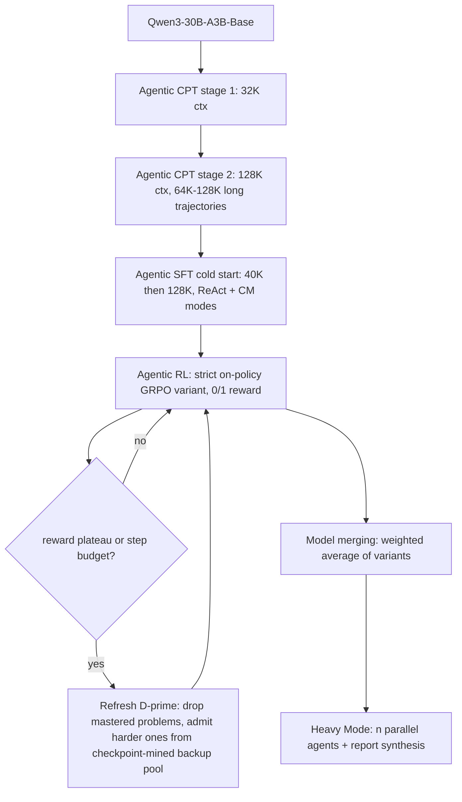

# Tongyi DeepResearch Technical Report

- arXiv: https://arxiv.org/abs/2510.24701
- Source: https://arxiv.org/abs/2510.24701
- Project: 
- Local PDF: `papers/rl/agentic-app/TongyiDeepResearch_2510.24701.pdf`
- Year: 2025
- Category: rl
- Priority: medium

## 一句话总结

技术报告，无同行评审，数字为自报。阿里通义实验室（Tongyi Lab）开源 deep research agent：30.5B 总参数、每 token 仅激活 3.3B 的 MoE（基于 Qwen3-30B-A3B-Base），通过"agentic mid-training（两阶段 Agentic CPT，32K→128K 上下文）+ agentic post-training（SFT 冷启动 + 严格 on-policy 的 GRPO 变体强化学习）"端到端管线训练，全程使用无人工标注的自动合成数据，并按训练阶段定制三类环境（prior world / simulated / real-world）。7 个 deep research benchmark 中 5 个标准模式第一（HLE 32.9、GAIA 70.9、xbench-DeepSearch 75.0、WebWalkerQA 72.2、FRAMES 90.6），BrowseComp 43.4/BrowseComp-ZH 46.7 落后于 OpenAI DeepResearch 51.5 与 o3 58.1，靠 Heavy Mode（并行探索 + 报告综合的 test-time scaling）反超到 58.3/58.1；评测全部于 2025-09-16 完成（xbench-2510 为 10-28）。

## 核心技术

1. **三条设计原则**：(a) 把 agent 训练拆成 mid-training + post-training——通用基座模型缺乏 agentic inductive bias，若在 post-training 阶段同时学 agentic 能力与对齐会互相冲突，mid-training 用大规模 agentic 数据先注入"行为先验"；(b) 合成数据中心化扩展——research 级问题天然稀缺、人工标注昂贵，而合成数据易扩展、易验证、可定向针对元能力（planning、信息综合、memory 管理），且形成数据飞轮（训练后的模型回头生成更强的合成数据）；(c) 环境被主动设计而非被动接受——按稳定性/保真度/成本三角分为 prior world（无真实反馈、零成本、无限扩展）、simulated（本地可控副本）、real-world（真实分布、昂贵且非平稳）三级，mid-training 主要用前两级，post-training 先在 simulated 验证再上 real。
2. **rollout 形式化：ReAct + Context Management 双模式**。架构刻意选了 vanilla ReAct（引用 The Bitter Lesson，拒绝复杂 hand-engineered 框架）；针对长 horizon 上下文溢出，加入 Markovian 状态重建的 context management：agent 每步不看全历史，只看"问题 $q$ + 不断更新的报告摘要 $S_t$（压缩记忆）+ 最近一轮交互 $(a_t, o_t)$"。工具集固定 5 个：Search（Google 搜索，每 query 返回 top-10）、Visit（Jina 解析网页 + 按目标摘要）、Python Interpreter、Google Scholar、File Parser（PDF/DOCX/MP4 等）。
3. **Agentic mid-training（两阶段 CPT）**：标准 next-token prediction 损失；Stage 1 用 32K 上下文，Stage 2 扩到 128K 并引入 64K–128K 长序列 agentic 行为数据；两阶段都穿插少量通用预训练数据防遗忘。合成数据覆盖 agent 工作流全生命周期四类动作：Question Synthesis（基于实体锚定的开放世界记忆库，按行为模式生成多跳推理/数值计算题）、Planning Action（开源模型分解问题并预测首步动作，用构题时的实体知识做 rejection sampling）、Reasoning Action（两阶段生成推理链，按长度 + 答案一致性双重过滤）、Decision-Making Action（显式枚举每步可行动作空间，把原轨迹重构成多步决策序列）；另通过"环境即读写数据库"的框架自动扩展 function-calling 数据。
4. **Post-training 数据合成**：图构造（random walk + 网页搜索获取知识 + 真实网站同构表）→ 子图/子表采样生成初始 QA → 不确定性注入（把 QA 难度形式化为实体关系上的可控"原子操作"，如合并属性相似的实体）；配合基于集合论的信息寻求问题形式化（同组 WebShaper 工作）以减少推理捷径、并支持自动验证 QA 正确性；另有自动化数据引擎生成 PhD 级研究问题（种子 QA 经 question-crafting agent 迭代升级复杂度）。
5. **SFT 冷启动**：合成 QA 上用高性能开源模型生成含完整 thought 与工具响应的轨迹，严格 rejection sampling 过滤；混合训练两种模式样本（ReAct 模式输入历史 $H_t$、Context Management 模式输入 $(S_{t-1}, a_{i-1}, o_{i-1})$ 输出当前步摘要 + thought + 工具调用）；按上下文长度两阶段训练（40K：短于 40K 的 ReAct 样本 + 全部 CM 样本 → 128K：40K–128K ReAct 样本 + 少量 40K 样本保稳）。
6. **Agentic RL**：GRPO 定制变体 + 严格 on-policy（轨迹始终用最新策略采样，重要性采样比恒为 1.0）；奖励为纯 0/1 答案正确性，**不加格式奖励**（SFT 冷启动已保证格式）；采用 DAPO 的 token 级策略梯度损失与 clip-higher 鼓励探索，leave-one-out 降低优势估计方差；关键工程决策——直接优化未过滤的负样本（如超出长度上限没产出答案的）会显著破坏稳定性甚至策略崩溃，因此把这类负样本从损失中剔除。作者自陈：这些改动"不是算法新颖性，而是对更高效稳定训练的务实追求"。
7. **基础设施三件套**：(a) 统一 sandbox——中心调度层编排所有工具调用，配主动 QPS 限速、结果缓存、超时重试、非关键失败优雅降级、备份源故障转移（如备用搜索 API），把工具调用抽象成确定性接口，隔离外部随机性对训练轨迹的污染；(b) 模拟环境——基于 2024 年 Wikipedia 离线库 + 本地 RAG 工具模拟 web 环境，用数据合成管线为它生成专属 QA，充当"风洞实验室"加速算法迭代；(c) 异步 rollout 框架——基于 rLLM 框架的 step 级异步 RL 训练环，两个独立异步在线服务器（一个模型推理、一个工具调用）+ 中心交互 handler 统一格式化反馈，多 agent 实例并行 rollout。
8. **自动数据策划**：先用 SFT 模型对全量问题 $D$ 采样，剔除"全对/全错"的无信号问题得 $D'$；RL 中持续监测 $D'$ 内问题是否对变强的策略变得太容易；并行地用中间 checkpoint 回采全量 $D$，收集对当前模型"难度适中"的新问题进备选池；在固定步数或 reward 平台期刷新 $D'$（移除已掌握、纳入更难的新题），整个管线独立于主训练循环运行、从不中断训练。
9. **模型合并收尾**：对同一 base 派生、能力偏好不同的变体做参数加权平均 $\theta_{merged} = \sum_k \alpha_k \theta^{(k)}$，实证上合并模型在需要综合能力的场景接近最强源模型且不增加优化成本。
10. **Heavy Mode（test-time scaling）**：部署 $n$ 个并行 agent 各自走 context management 但探索不同路径，每个产出压缩报告 $S^u_T$ 与答案；综合模型只消费这些压缩报告（而非完整轨迹）合成最终答案——2–3 个完整轨迹就会撑爆上下文，而压缩报告让 $n$ 个策略可被同窗评估。

整条训练管线与数据策划闭环：

## 底层原理与数学推导

**ReAct 形式化**。轨迹是 thought-action-observation 三元组序列：

$$H_T = (\tau_0, a_0, o_0, \ldots, \tau_i, a_i, o_i, \ldots, \tau_T, a_T)$$

任意步 $t \le T$ 由策略基于全部历史采样：$\tau_t, a_t \sim \pi(\cdot | H_{t-1})$，其中中间步 $t < T$ 的 $a_t$ 是工具调用、终端 $a_T$ 是给用户的深度报告。

**Context management 的 Markovian 重构**。核心假设：任务状态可被压缩进一个结构化 workspace 而不损失后续决策所需信息，即存在足够统计量 $S_t$ 使更新过程闭合：

$$S_t, \tau_{t+1}, a_{t+1} \sim \pi(\cdot \mid S_{t-1}, a_t, o_t)$$

这与标准 POMDP 的信念状态思想同构——$S_t$ 就是学出来的信念摘要；它同时解决两件事：上下文不随探索深度线性膨胀（防 context suffocation），且强迫 agent 每步显式综合与排序信息（论文称这与人做研究时定期综合反思的模式一致）。

**RL 目标函数**（论文式 4–5）。定制版 GRPO，token 级损失 + 非对称裁剪：

$$J(\theta) = \mathbb{E}_{(q,y) \sim D,\; \{H_i\}_{i=1}^{G} \sim \pi_{\theta_{old}}}\left[ \frac{1}{\sum_{i=1}^{G} |H_i|} \sum_{i=1}^{G} \sum_{j=1}^{|H_i|} \min\left( r_{i,j}(\theta)\, \hat{A}_{i,j},\; \text{clip}\big(r_{i,j}(\theta),\, 1-\epsilon_{low},\, 1+\epsilon_{high}\big)\, \hat{A}_{i,j} \right) \right]$$

其中重要性采样比与组内 leave-one-out 优势为：

$$r_{i,j}(\theta) = \frac{\pi_\theta(H_{i,j} \mid \text{context})}{\pi_{\theta_{old}}(H_{i,j} \mid \text{context})}, \qquad \hat{A}_{i,j} = R_i - \text{mean}(\{R_i\}_{i=1}^{G})$$

四个设计选择的理由都可从公式读出：严格 on-policy 使 $r_{i,j} \equiv 1.0$（学习信号永远对应当前能力，规避 off-policy 偏差）；$1+\epsilon_{high}$ 的非对称上界是 DAPO 的 clip-higher（低概率 token 的优势不被裁剪压死，保探索）；$\hat{A}_{i,j}$ 的组均值基线 + leave-one-out 去掉同轨迹自身的自相关降低方差；奖励 $R_i \in \{0, 1\}$ 且无格式项——因为格式已由 SFT 阶段固化，加格式奖励反而引入可被 hack 的稠密信号。负样本过滤则是对该目标函数的一个隐式修改：被长度上限截断的轨迹其 $R_i = 0$ 但并非策略"错误"，将其计入梯度会把环境约束误归因为策略缺陷。

**模型合并**。$K$ 个变体的参数插值：

$$\theta_{merged} = \sum_{k} \alpha_k \cdot \theta^{(k)}, \qquad \text{s.t.} \quad \sum_k \alpha_k = 1,\; \alpha_k \ge 0$$

其成立前提是各变体共享同一预训练初值（loss landscape 的线性连通性），这正是"同 base 多变体"管线提供的条件。

**Heavy Mode 的 test-time scaling**。$n$ 个并行 agent 独立求解后综合：

$$(S^u_T, \text{answer}_u) = \text{Agent}_u(q), \quad u \in [1, n]; \qquad \text{answer}_{final} = \text{Synthesis}\big(\{(S^u_T, \text{answer}_u)\}_{u=1}^{n}\big)$$

可扩展性的关键在 $S^u_T$ 的压缩性：综合模型的输入长度是 $O(n \cdot |S_T|)$ 而非 $O(n \cdot |H_T|)$——完整轨迹聚合 2–3 个 agent 就超上下文，压缩报告让 $n$ 可以放大。

## 物理直觉解释

**Agentic mid-training 像岗前培训，而不是指望新员工边干活边学会一切。** 通用基座模型的预训练语料是纯网页文本，指令微调数据里没有 research 级问题与 agentic 行为，于是在 post-training 阶段模型要同时学两件相互干扰的事：怎么调用工具、规划多步研究（能力），以及怎么对齐人类偏好（行为）。论文把这称为固有的优化冲突。mid-training 的角色是先用大量合成 agentic 轨迹把"看到问题→想分解→调工具→读结果"的统计模式烙进模型，让 post-training 的 RL 站在一个"已经会走"的起点上只学"走得好"——这与 SFT 冷启动加 RL 的分工一脉相承：SFT 建立稳定行为基线（模仿），RL 关闭环境回路（超越模仿去探索）。

**Context management 像研究员的活页笔记本，而不是全程录音带。** 一个做三天文献调研的人不会逐字记住每个网页，而是不断把"已确认的事实、当前假设、下一步要查什么"重写进笔记本，每次行动只带笔记本出门。$S_t$ 就是这本笔记本：每步重建的 workspace 里只有问题、滚动摘要和上一轮交互。这个设计的妙处在于它把"记忆管理"从外部工程（截断、RAG 检索）变成模型内化的行为——SFT 阶段专门训练 CM 模式样本，论文说这种"被迫每步综合"的训练让推理比纯 ReAct 更深思熟虑，也正因如此 Heavy Mode 里 $n$ 个 agent 的产出才能被压缩到可综合的长度。代价是 Markov 假设本身：$S_t$ 压缩丢掉的信息（比如某个后来才显得相关的细节）就永久丢失了，这正是论文把 128K 上下文不足列为第一条局限的原因。

**三级环境像风洞、模拟舱与实飞的分级验证体系。** 真实 web 环境有两大训练杀手：非平稳性（页面变了、API 限流了，训练分布持续漂移）和交互成本（每次 API 调用都是真金白银）。通义的做法是不在"用不用真环境"上二选一，而是把每级环境用在刀刃上：prior world（模型凭预训练知识自挖轨迹，零成本）和 simulated（2024 年 Wikipedia 离线库 + 本地 RAG）承载 mid-training 与算法迭代的全部高频试错——论文直接把模拟环境称为"wind tunnel laboratory"，在模拟里调好的 GRPO 变体，reward 曲线形状与真实环境一致后才部署到真实 web 做最终训练。这个"先风洞后试飞"的流程把最贵的真实交互次数压到最低，也是 9.2 节那些 harness 类论文（统一 sandbox、故障转移）存在的理由：风洞的价值取决于气流可控。

**动态数据策划像教练不断调整训练强度。** RL 训练最怕两件事：题全做对了（无梯度信号）和题全做错（梯度是噪声）。通义的方案是让课程跟着学生走——始终把训练集维持在"当前模型能力边界上"的题目带：初始用 SFT 模型筛掉全对/全错题；训练中持续监测哪些题已被"mastered"要及时移出；同时用中间 checkpoint 回采原始题库，找出对变强后的模型"难度刚好"的新题进备选池；reward 平台期一到就换血。这个机制解释了 reward 曲线能持续上升不撞墙（论文归因于持续提供有挑战的材料），也解释了后面 32k 上下文实验的"被迫简洁"现象——课程是按 64k 模型的能力出的题，小上下文模型解不动长题，零奖励信号逼它去找更短的有效解。

## 工程细节与实操指南

**工具与 sandbox**：5 个工具的接口契约——Search 接受 query 列表并发执行、每条返回 top-10（标题+摘要+URL）；Visit 先用 Jina 解析全页再用摘要模型按 goal 抽取相关信息；Python Interpreter 要求 arguments 为空 JSON、代码放 `<code>` 标签内、结果必须 `print()` 到 stdout；Google Scholar 支持多 query；File Parser 把 PDF/DOCX/PPTX/TXT/CSV/XLSX/DOC/ZIP/MP4/MP3 统一转文本后由摘要模型作答。sandbox 侧五招保证确定性：主动 QPS 限速、结果缓存、自动超时重试、非关键失败优雅降级、备份源故障转移。论文脚注承认官方实现依赖内部 API，开源仓库提供了已验证可复现结果的替代开源实现。

**评测协议**（复现时全部可对齐）：固定推理参数 temperature = 0.85、repetition penalty = 1.1、top-p = 0.95；每任务最多 128 次工具调用；上下文 128K；每 benchmark 独立跑 3 次取均值报 Avg@3。裁判模型按 benchmark 指定：GAIA（全验证集 166 例）与 WebWalkerQA（680 例）用 Qwen2.5-72B-Instruct；xbench-DeepSearch 与 2510（各 100 例）用 Gemini-2.0-Flash-001；BrowseComp（1,266 例）与 BrowseComp-ZH（289 例）用 GPT-4o-2024-08-06；HLE 取 2,154 道纯文本题、o3-mini 按官方协议评；AIME25/HMMT25（各 30 例）因输出为长报告采用人工评；SimpleQA（4,326 例）用官方脚本。系统提示词、工具 schema、评测 prompt 全部在 GitHub 开源。

**SFT 数据画像**：超过 20% 样本超 32k token、涉及 10 次以上工具调用——冷启动数据本身就按长 horizon 高交互设计，这是 RL 阶段模型"敢"做几十轮搜索的先验来源。

**上下文长度的 RL 消融设置**：三个 32k/48k/64k 上下文限制的变体，注意数据策划统一由 64k 模型完成（控制变量），故结论是"固定课程下上下文上限的作用"而非"各自最优课程的比较"。

**开源资产**：模型权重（HuggingFace/ModelScope 的 Alibaba-NLP/Tongyi-DeepResearch-30B-A3B）、框架与完整方案（github.com/Alibaba-NLP/DeepResearch）、官方复现脚本含全部工具实现与 prompt 配置、各 benchmark 评测 prompt；项目页 tongyi-agent.github.io/blog。

**未披露项**：Heavy Mode 的并行 agent 数 $n$ 与 synthesis 模型身份未给出；各阶段数据量（token 数/轨迹条数）与训练 compute（GPU-hours）未披露；模型合并的变体数量与权重 $\alpha_k$ 取值未披露；mid-training 的通用/agentic 数据配比只说"small proportion"，无数字。以上均计 4 条待确认。

## 消融实验与分析

主结果（Table 1，Avg@3；Tongyi 评测于 2025-09-16）：

| Benchmark | Tongyi 30B-A3B | 最强闭源系统 | 最强开源 ReAct agent |
|-----------|---------------|--------------|---------------------|
| Humanity's Last Exam | **32.9** | Gemini DR 26.9 / OpenAI DR 26.6 | DeepSeek-V3.1 29.8 |
| BrowseComp | 43.4 | OpenAI DR **51.5**（o3 49.7） | DeepSeek-V3.1 30.0 |
| BrowseComp-ZH | 46.7 | o3 **58.1** | DeepSeek-V3.1 49.2 |
| GAIA | **70.9** | Claude-4-Sonnet 68.3 / OpenAI DR 67.4 | DeepSeek-V3.1 63.1 |
| xbench-DeepSearch | **75.0** | o3 67.0 | DeepSeek-V3.1 71.0 |
| WebWalkerQA | **72.2** | o3 71.7 | GLM-4.5 65.6 |
| FRAMES | **90.6** | o3 84.0 | DeepSeek-V3.1 83.7 |

Heavy Mode 与评估方差、上下文消融：

| 分析 | 数字与方向 |
|------|-----------|
| Heavy Mode（test-time scaling） | HLE 32.9 → 38.3；BrowseComp 43.4 → 58.3（反超 OpenAI DR 51.5）；BrowseComp-ZH 46.7 → 58.1（追平 o3 58.1） |
| Pass@1（3 次最佳） | HLE 33.4、BrowseComp 44.2、ZH 48.4——与 Avg@3 一致，说明评估环境动态下结果稳健 |
| Pass@3 | HLE 45.9、BrowseComp 59.64、ZH 63.67 |
| RL 上下文上限（课程固定由 64k 模型策划） | reward 天花板 64k > 48k > 32k；平均响应长度 64k 持续上升、48k 稳定均衡、32k 明确下降（被零奖励逼出更简洁解） |
| 交互 test-time scaling | 上下文/交互次数从 8K 扩到 128K，BrowseComp 准确率单调上升 |
| 泛化 benchmark | AIME25 100.0、HMMT25 100.0、SimpleQA 98.6；对照无工具的 Qwen3-30B-A3B-Thinking-2507 为 85.0/71.4/19.2，235B-Thinking 为 92.3/83.9/47.1 |

**核心结论：** 消融证据支持三个判断。第一，"5/7 第一但 2/7 落后"的格局是真实的：标准模式在 HLE/GAIA/xbench/WebWalkerQA/FRAMES 领先，但 BrowseComp（43.4 vs OpenAI DR 51.5）和 BrowseComp-ZH（46.7 vs o3 58.1、DeepSeek-V3.1 49.2）落后，报告的"sota on nearly all"只有在加上 Heavy Mode 的 test-time scaling 后才在 BrowseComp 上成立（ZH 上 58.1 也只是追平 o3）——3.3B 激活参数换取的效率优势没有覆盖最难的英文浏览任务，推理时并行与综合是被用来补这个缺口的。第二，能力主要来自管线而非底座：同一 Qwen3-30B-A3B 家族的 Thinking 模型无工具时 SimpleQA 19.2，本系统 98.6（+79.4，来自搜索），AIME25 85.0 → 100.0（来自 Python 解释器），说明对知识密集与可计算任务，工具调用管线的增益压倒参数与推理模板差异。第三，训练稳定性的功臣是环境与数据而非算法：reward 在约 500 步内持续上升、策略熵短暂上升后收敛稳定（论文视其为环境设计 + 算法修改共同奏效的证据），且 32k 上下文模型在被 64k 策划的课程训练时响应长度主动变短——数据分布本身就是可操纵的训练杠杆。

## 技术权衡（Trade-off）

| 优势 | 劣势与工程代价 |
|------|---------------|
| 3.3B 激活参数达到闭源系统级别表现，边缘部署与交互成本优势明确，模型/框架/数据管线全开源 | BrowseComp/BrowseComp-ZH 标准模式落后 OpenAI DR 与 o3，需要 Heavy Mode 的成倍推理时计算才反超，"单 agent 效率"叙事有边界 |
| 全自动合成数据管线无人工标注，可验证、可扩展、成飞轮 | 合成 QA 的正确性靠集合论形式化验证而非人工抽检，生成器偏差会进入训练分布；"super-human 难度"与"真实 web 分布"之间的 gap 未被单独度量 |
| 三级环境分级 + 风洞式迭代把真实交互压到最低，统一 sandbox 隔离外部随机性 | 模拟环境锚定 2024 年 Wikipedia 快照，知识时效与真实 web 有 sim-to-real gap（论文自认）；真实环境训练的成本与规模未量化 |
| 严格 on-policy + 纯 0/1 奖励 + 负样本过滤换来 500 步稳定上升不崩溃 | 只能串行完整 rollout，partial rollout / off-policy 复用被列为未来工作；上下文 128K 对最复杂长任务不够（论文自认第一条局限） |
| ReAct + 5 工具的极简动作空间便于复现与扩展 | 动作空间窄：prompt 与工具集绑定特定指令格式，向通用 agentic 工具使用的泛化是待做项（论文自认）；未发布更大规模模型（进行中） |
| Heavy Mode 的压缩报告综合使并行度可扩展 | $n$、synthesis 模型、n-accuracy scaling 曲线均未披露，test-time scaling 的成本-收益关系无法从报告复算 |

## 技术价值与演进定位

这份报告的价值在于它是第一个完整开源的 deep research agent 端到端配方，且每一段都有明确的方法论主张：训练阶段上，它把"agentic mid-training"立为一等公民（与同组 Su et al. 2025 的 agent 持续预训练工作互为表里），反驳了"post-training 就够"的默认做法；数据上，它给出合成数据中心的完整论证链——research 级问题天然稀缺、人工标注不可扩展、合成数据易验证且能定向攻击元能力——并展示了从"合成 QA"到"PhD 级研究问题"的难度升级机制；环境上，它提出稳定性/保真度/成本三角并给出分级使用策略，把"环境是被设计的系统"从口号落成 sandbox + 模拟 wiki + 真实 web 的三级实现；算法上，它最诚实的结论反而是减法——agentic RL 的成败更多取决于数据质量与环境稳定性而非算法新颖性，这点与库内 polar、arlarena 等训练系统线的经验互相印证。它的"interaction scaling"（扩展环境交互次数而非输出 token 数）为 test-time scaling 提供了正交于 reasoning 模型的第二根轴。局限也同样清晰：评测冻结在 2025-09、自报数字无外部复核、Heavy Mode 关键参数未披露、以及 128K 上下文与窄动作空间的硬边界。对本库而言，它是 deep research agent 线（lite-researcher、harness-1）的坐标系原点——后续工作要么在其管线上改某一段，要么在它的"环境比算法重要"结论上做系统化验证。

## 与其他论文的关系

- **库内 `notes/rl/lite-researcher.md`（LiteResearcher）** — 同为 deep research agent 的可扩展 agentic RL 训练框架，可视作对 Tongyi 管线某一层（数据合成/训练循环）的重做与效率化对比；Tongyi 提供 30B-A3B 的基准配方与数字，LiteResearcher 主打训练侧扩展性。
- **库内 `notes/rl/harness-1.md`（Harness-1）** — Harness-1 用状态外化 harness 训练 search agent，与 Tongyi 的 context management（把状态压缩进滚动报告 $S_t$）是同一问题（长 horizon 状态管理）的两个实现层次：一个做成训练时外部结构，一个内化为模型行为。
- **库内 `notes/rl/polar.md`、`notes/rl/arlarena.md`** — 训练系统线的两个框架（任意 harness 上的 agentic RL、稳定性优先的统一框架），与 Tongyi 的 rLLM 异步 rollout + 统一 sandbox + "环境稳定性比算法重要"结论同题；Tongyi 是"自建全家桶"路线，两者是"通用 harness"路线。
- **库内 `notes/rl/dataprm.md`** — Tongyi 在 RL 阶段刻意只用纯 0/1 结果奖励、不加格式奖励也不上 process reward，dataprm 的 process-level reward modeling 正是其反面选项；两篇对读可看清"结果奖励 + 数据策划"与"过程奖励"两条路线的边界条件。
- **库内 `notes/rl/ragen-2.md`（RAGEN-2）** — RAGEN 线揭示的 agentic RL 训练崩溃/回声陷阱类不稳定现象，是 Tongyi 用数据策划（剔除无信号与超长负样本）、负样本过滤和严格 on-policy 所针对的同一类病灶的工程化解法。
- **库内 `notes/rl/tool-r0.md`、`notes/rl/openclaw-rl.md`、`notes/rl/coskill.md`** — 工具学习与 agent 能力线：tool-r0 的零数据工具学习、openclaw-rl 的对话式训练、coskill 的数字域（ALFWorld/WebShop）技能库 RL，与 Tongyi 分别占据"工具数据合成"与"开放 web deep research"两端，Tongyi 的 function-calling 环境扩展法是工具数据合成的工业化版本。
- **库内机器人对照 `notes/rl/harbor.md`、`notes/rl/enpire.md`** — 同一套"模拟先行、真实验证"哲学的机器人版：HARBOR 的仿真 gate 检查与 ENPIRE 的真机闭环对应 Tongyi 的风洞模拟与 real-world 终训；差异在奖励结构（机器人有 dense 物理信号，deep research 只有 0/1 答案正确性），因此 Tongyi 把宝押在数据策划而非奖励塑形上。
- **同组组件论文**（WebSailor/WebSailor-V2、WebShaper、WebResearcher、WebWeaver、ReSum、WebWalker/WebDancer、AgentCPT "Scaling agents via continual pre-training"）— 本报告是这些零件的整机集成：集合论 QA 形式化出自 WebShaper，context management 谱系出自 ReSum/WebResearcher，mid-training 出自 AgentCPT，Heavy Mode 的综合框架与 IterResearch（ICLR 2026）的 interaction scaling 一脉相承。
- **DeepSeek-R1/GRPO、DAPO、From r to Q\* 之外的算法供给** — RL 目标是 GRPO（Shao et al. 2024）的定制版，token 级损失与 clip-higher 取自 DAPO（Yu et al. 2025），leave-one-out 基线取自 Chen et al. 2025，训练框架基于 rLLM（Tan et al. 2025）——算法上全盘组合现成件，无新算法，与其自述"务实优先"一致。
- **闭源对照**（OpenAI DeepResearch、Gemini DeepResearch、Kimi Researcher、ChatGPT-5-Pro）与 **ReAct（Yao et al. 2023）+ The Bitter Lesson** — 前者是 benchmark 上的对标物（BrowseComp 上 OpenAI DR 51.5 仍是标准模式天花板）；后者是架构选择的哲学依据：拒绝复杂 hand-engineered 框架，赌模型内化能力会淘汰 prompt 工程。

## 精读问题

1. RL 阶段剔除"超长未产出答案"的负样本避免了策略崩溃，但这同时意味着模型从不为"预算管理失败"付代价——当部署时真实环境强制 128 工具调用上限，训练中从未被惩罚的规划失误会在哪里显形，Heavy Mode 的并行化是否正是对这一盲区的补丁？
2. 32k 上下文模型在 64k 策划的课程上被零奖励逼出"更短的有效解"（响应长度下降），这个"被迫简洁"效应能否反转为一种刻意的效率训练手段——用低上下文模型在长课程上训练再把能力迁回大上下文模型，还是说简洁解与完整解在策略空间里根本不是同一模式？
3. BrowseComp 上标准模式 43.4 对 OpenAI DR 51.5 的差距，有多少来自合成数据分布与真实 web 的偏差、多少来自 3.3B 激活参数的容量上限、多少来自 128K 上下文限制——报告未提供能把三者分离的消融，若要复现并改进，应该先动哪一维？
4. 合成 QA 的正确性由集合论形式化 + 原子操作难度升级保证，但"信息结构一致"不等于"答案在开放 web 上可唯一验证"——当这类数据占了 RL 奖励信号的来源，模型会不会学到针对合成器推理习惯的捷径而非真实信息寻求策略？
5. 报告宣称 interaction scaling（8K→128K 上下文上 BrowseComp 单调上升）是与 token scaling 正交的 test-time 维度，但该曲线用的是同一个静态模型还是不同上下文限制训练的变体、每档的交互次数分布如何、n-agent 的 Heavy Mode scaling 曲线在哪——这些决定该结论能否被当作 scaling law 引用的细节均未给出？
