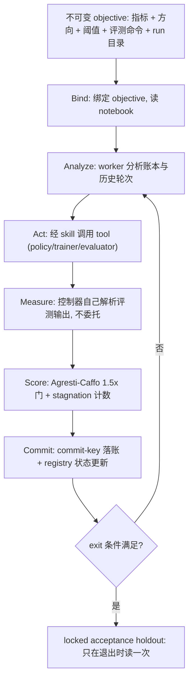

# You Don't Need To Stay in The Loop: An Agentic Robotics Loop for Robot-Policy Improvement

- arXiv: https://arxiv.org/abs/2608.07555
- Source: https://arxiv.org/abs/2608.07555
- Project: 
- Local PDF: `papers/rl/agentic-robot/AgenticRoboticsLoop_2608.07555.pdf`
- Year: 2026
- Category: rl
- Priority: high

## 一句话总结

AgenticRobotics 把 Claude Code/Codex 式的"主 agent 管环 + 子 agent 执行 + 工具干活"架构搬到机器人策略改进的外层研究循环上，核心差异只有一条：机器人工具（训好的策略、训练流水线、数据采集） routinely 失败，所以工具质量必须每次调用都测量、记录、并在其背后的 artifact 变化时自动过期。系统是一个 backend 无关的控制平面，用不可变 objective + 控制器自持测量 + commit-keyed 崩溃恢复 + 证据分级技能库跑 durable 的 train-evaluate-improve 事务。标题是一个操作声明而非能力声明：人可以离开是因为晋升被证据门控、状态可恢复、能力信任可过期——而不是因为循环挑检查点比人挑得好；在作者实测的唯一一条 lineage 上，直接取最后一个 checkpoint 胜过包括自家方法在内的所有测量驱动选择器。

## 核心技术

1. **五条设计承诺**：(i) 主 agent 管循环、子 agent 分析与执行——控制器的有限上下文只花在决策上；(ii) 任何在世界里执行的东西都是工具而非知识——训好的策略、训练流水线、planner、数据采集台都打包在工具边界后面，控制器从不触碰机器人物理；(iii) 打包工作流给每个 artifact 一个统一的 input-to-tool-to-output 调用面（MCP 之上）并注册，另一个独立验证工作流测量它实际能做什么；(iv) 每次调用都留记录，运营可靠性从记录推导而得，从不靠声明；(v) 技能是有知识的可编辑工作流。
2. **agent-to-skill-to-tool 分解**：agent 决定做什么，skill 决定怎么做，tool 是后端真正能做的事。技能是 Agent Skills 格式的可编辑 Markdown（审计快照时有 29 个 loop skills + 1 个 vendored authoring tool，其中 4 个是构建/打包/验证/改进工具的工具生命周期技能）；调用契约写在 tool descriptor 而非技能文字里，所以技能可以重参数化、重排、fork 出候选变体而不碰执行代码。
3. **能力注册表与质量五态梯**：每个工具有 unvalidated / effective / ineffective / stale / deprecated 五态，且只能由控制器解析过的测量设定（worker 给出的数字只是 provenance，工具保持 unvalidated）；质量按 benchmark 分 key，避免并发 run 互相覆盖；staleness 是推导出来的——每次测量记录产生它的 artifact，一旦工具当前 artifact 引用变化（重训练正是如此），工具自动变 stale 并报告"重训练后未再验证，此前成功率 X"；候选按 Wilson 下界排序，使 2/2 的侥幸排不过 46/100 的充分测量。unvalidated 或 stale 的工具不能进入无人值守的动作集合。作者声明这个"测量质量绑定到 artifact 版本、重训练即作废"的约定没有先例。
4. **轮次事务 Bind → Analyze → Act → Measure → Score → Commit**：不可变 objective 规定 metric、方向、阈值、评测命令、run 目录、可选验收 holdout；控制器只存一份 in-flight 记录，通过 commit-keyed 阶段 + 原子替换 + sidecar 锁推进副作用，恢复时补齐第一个缺失阶段而不是重放已提交副作用。十一不变式定义成功语义（objective 不可变、仅 exit 终止、控制器自持测量、先记账再推进、技能与工具开放菜单、运行时不自我修改、generation 限定唤醒、commit-keyed 副作用、位置无关、转移只来自已验证工作、能力质量被测量而非声明且不过期于其 artifact）。
5. **证据门控晋升**：对二项成功计数用 Agresti–Caffo 半宽估计，只有 $\Delta \ge 1.5w$ 才直接晋升；正但更小的差值触发确认（配对 episode 上的 McNemar 或配对 bootstrap）；无改进递增 stagnation，强制切换策略类但从不终止 run；可选的锁定验收评测只在退出时读一次（reusable holdout 思路）。
6. **调用面**：argv 模板 + JSON-Schema 参数 + 必需超时的调用契约；校验参数、渲染 argv、可执行 allowlist、无 shell，结果信封把启动失败与超时作为结果而非异常返回；同一管线支撑 CLI 与无依赖的 MCP stdio server（2025-11-25 协议修订版，只暴露可调用工具）。三类工具刻意不可调用：逐字评测命令（控制器自持测量禁止委托指标）、分离的数小时级 trainer、人在台旁的采集。
7. **跨 run 记忆**：共享 notebook 每个已提交轮次一行 did/learned/source，bind 时读、从不读回控制状态；反复出现的教训蒸馏进所属的 skill 或 tool。每行都是数据而非指令——命令形状的条目会被本轮 gate 当作待检验声明。

一轮实验事务的完整闭环如下——每个危险决策（晋升、中断、能力信任、测量）都由一个独立机制治理：

## 底层原理与数学推导

晋升门的统计核心是两样本 Agresti–Caffo 半宽。对挑战者与当前最优的成功计数 $k_i / n_i$（$i = 1, 2$）：

$$\tilde{p}_i = \frac{k_i + 1}{n_i + 2}, \qquad w = 1.96\,\sqrt{\sum_{i=1}^{2} \frac{\tilde{p}_i\,(1 - \tilde{p}_i)}{n_i + 2}}$$

（分子加 1、分母加 2 是 Agresti–Caffo 连续性修正，避免小样本下区间坍缩到 0。）改进当且仅当

$$\Delta = m_{\text{new}} - m_{\text{best}} \ge 1.5\,w$$

（最小化任务符号取反）才直接晋升。$1.5\times$ 这个系数不是装饰：SmolVLA 战役当年正是在一个 8 个点的带宽上、未做确认就晋升了 63% 的"冠军"，后来 1,200 episodes 的重测 pooled 到 56.5%，那次 +8 点的晋升（McNemar $p \approx 0.25$）按现在的 12 点 outright 阈值根本过不了。

候选工具排序用 Wilson 下界。论文引用 Wilson (1927)，其标准形式为（$z$ 为正态分位数，$\hat{p} = k/n$）：

$$\mathrm{WLB}(k, n) = \frac{\hat{p} + \dfrac{z^2}{2n} - z\sqrt{\dfrac{\hat{p}(1-\hat{p})}{n} + \dfrac{z^2}{4n^2}}}{1 + \dfrac{z^2}{n}}$$

样本越小、下界越被拉低，这正是"让幸运的小样本排不过充分测量的平庸者"的机制。同一公式也用于从 append-only 调用日志推导"工具跑不跑得起来"的运营可靠性——它与"artifact 在任务上成不成功"的 benchmark 质量是两个刻意分开的量。

anytime-valid 升级路径的理论来源是 Ville 不等式：对非负鞅（e-process）$E_t$，$P(\sup_t E_t \ge 1/\alpha) \le \alpha$，因此可以在任意时刻停止、任意次数查看而 Type-I 不膨胀。论文的 Monte-Carlo 显示闭式门安全但欠功效（Agresti–Caffo 1.5× 的 Type-I 只有 0.002，在 +8 点真实效应下功效不达标），而 testing-by-betting e-process 与 mixture-SPRT 靠 Ville 不等式按构造守住 $\alpha$，功效分别到 0.61 与 0.86。有效性边界也被划清：这套保证依赖配对评测（同一初始状态配对带来的共享潜效应）；当潜效应是 arm-specific 时逐 episode 鞅被打破，包括 e-process 在内的所有逐 episode 规则都膨胀到 0.118–0.505。另修正了一个实现缺陷：betting fraction 必须满足 $\lambda < 2$，才能让 $[0,1]$ 上结果的财富过程保持非负鞅。

崩溃恢复的语义由复合键 $(\text{round\_id}, \text{effect\_type}, \text{generation})$ 给出：bookkeeping 层面的 exactly-once 已被 14,000 次注入验证，但记账正确不等于后端幂等——训练二进制本身不带 key、会重跑物理副作用，所以真正的契约要求后端按键去重（后端幂等 API 把 key 扩为 $(\text{run\_id}, \text{round\_id}, \text{effect\_type}, \text{generation})$，配合 IETF 式 replay/conflict 语义与 saga 补偿）。论文诚实地标注：实际 LeRobot 二进制尚未实现这一点。

## 物理直觉解释

**能力注册表像医院药房，不像车库工具墙。** 车库工具墙只回答"这里有什么锤子"，药房回答的是"这个批次的药、在这个适应症上、做过几例试验、结论到哪天过期"。机器人工具需要后者：一个成功率 46% 的 VLA 策略、一个会崩的 trainer、一个今天不在线的遥操作台，在这套语义里是同一类对象——一个"当前标签不被记录证据支持"的工具。staleness 规则是最有操作价值的一条：重训练之后，旧的成功率记录自动作废并显示"重训练后未再验证，此前 46%"，逼循环去重跑一次验证，而不是让一次陈旧的评测继续给后续决策背书。这正是论文反复强调的"标注是循环的持续义务，不是注册时的一次性动作"。

**1.5× 门像海关的合理怀疑线，而不是精密仪器。** 为什么不直接用 p 值？因为外层循环的看数方式和论文审稿不同——它会在训练过程中反复偷看（optional stopping），而 McNemar 这类固定样本检验在这种偷看下 Type-I 膨胀到 0.161，是名义 $\alpha$ 的 3 倍。闭式、无状态的 Agresti–Caffo 半宽牺牲了功效（+8 点效应下功效不达标），换来"控制器不需要持久化累积状态"——上下文有限的 LLM 控制器算得动它。而 anytime-valid 的 e-process/SPRT 用 Ville 不等式把偷看下的 $\alpha$ 按构造锁死，在更少 episodes 内拿到 0.61–0.86 的功效。整条线的关键洞察是：**门的正确性来自配对评测**，不来自结果分布——同一初始状态配对使潜效应共享，一旦比较变成 arm-specific 的非配对多 seed，所有保证都作废。

**"取最后一个 checkpoint"赢过一切选择器，是这篇论文最值钱也最反直觉的结果。** 在 1,600 个真实 LIBERO-10 episodes 的决策质量实验里，oracle（该 lineage 的最终 checkpoint）拿到 60.00% 的 held-out 成功率、零 regret，而所有测量驱动策略——随机搜索 54.40%、TPE 54.33%、Thompson 54.16%、甚至人类"挑最好观测值"54.04%、作者自己的 e-process 门 53.94%——全部输掉约 6 个点。机制看得见：selection 任务集和 holdout 任务集排名最高的 checkpoint 不同，于是"按测量分数选"在主动误导；预算加大也几乎无济于事。多 seed 复查更直接：记录 48% 的冠军与记录 53% 的"最好观测"检查点，在两个新 seed 上都量出 46.0%（McNemar $p = 1.0$）——5 个点的领先纯属选择噪声；连相同权重、相同 seed 都能读出 53% 和 49%，固定 seed 只复现初始状态、不复现结果。这就是为什么门控买到的不是"更好的选择"，而是"更少的错误晋升"：加固后的 12 点阈值把每次运行的假晋升率压到 0.001，而 argmax 选择器在概念上无法表达这个量。

**Commit key 像数据库的幂等键，救的是"崩溃后不知道做没做过"。** 长跑实验一定会被 kill：进程挂了、机器重启、超时被杀。没有幂等键，恢复逻辑只有两个坏选项——重放（重复扣款式的重复训练）或跳过（丢一轮已付费的结果）。把每个副作用绑定到 $(\text{round\_id}, \text{effect\_type}, \text{generation})$，恢复时只需补齐第一个缺失阶段。14,000 次在账本写入边界的 kill 注入、78 个字节偏移的部分多字节追加注入，全部零丢失零重复，恢复幂等且只花 0.15–0.25 ms。配套的 HMAC 签名验证器（从逐 episode 结果重算指标，非 LLM 解析）在 27 个真实 artifact 上抓出 6/6 类篡改，而现有的解析路径抓出 0/6。

## 工程细节与实操指南

**控制平面与后端的边界要显式写下来。** 协议是可执行 Markdown 的控制器循环（十一不变式、委托规则、评分、阶段顺序、退出校验）；参考代码只实现确定性工具（objective 与命令预检校验、JSONL 账本、纯重放校验、工具注册表与调用面），从不执行训练。论文特别指出一个常见歧义：一份详细协议不等于一个已实现的调度器，一个工具函数也不等于"每条不变式在每次 run 都成立"的证据。

**audit 快照下的具体配置**：6 个 seeded descriptor 覆盖 policy / trainer / evaluator / recorder / dataset editor / calibrator；29 个 loop skills + 1 个 vendored authoring tool；注册表、调用管线、MCP server 已实现并通过 106 个单元测试，但**从未在带日志的轮次中执行过**——六个 descriptor 的质量是从本文报告的评测转写来的，尚无 artifact 引用移动过（staleness 规则从未在真实 trace 上触发），调用日志里没有 live-round 调用，复合收益未测。复用这套设计时要清楚哪些部分是"已验证的操作系统特性"、哪些是"已实现未实战的约定"。

**两个战役的可复现实操**：战役一在 Quadro RTX 8000 上筛 π0.5 / MolmoAct2 / GR00T N1.7 / X-VLA 系列在 LIBERO-10 Task-5（把书放进 caddy）上的检查点与推理配置，任务由 $n=10$ 探针选出的最高 baseline 任务，因此结论是任务条件性的、不能外推为 suite 级 SOTA；10 个保留配置（$n = 30$，固定 seed）中 7 个测得 100%、全部过 90% 门，最快的是大 action chunk + 更少 flow-matching 函数评估的组合（12.8 vs 基线 π0.5 的 29.0 s/episode）。战役二以 SmolVLA 从报告的 55% checkpoint 热启动，目标 10 个 LIBERO-10 任务均值 ≥70%，每评测 100 episodes；轮次 0–26 在五个日历天提交（约 3 天活跃 GPU 时间），操作者停掉了未完成的第 27 轮，因此循环从未满足自己的退出条件——最终的锁定验收 holdout 返回 ACCEPTANCE_FAILED（53.9% vs 70% 目标），且机制上拒绝验收阶段之外的读取（3 次模拟未授权读取被拒绝并记录）。

** instrumentation 的教训**：controller token 成本没有保留——论文自评为设计缺陷，因为没有它，效率声明不可证伪。100 个 held-out episodes 给出 ±9.5 点的区间，而 min_delta 只有 8 点，所以验收判定的仪器宽度本身就是瓶颈。成本读数：全项目 121.6 GPU-hours、5,475 个真实 episodes，其中 9.9 小时属于第 5 节的验证实验。

**可复用性边界**：复现基 revision af89f02d8f88；外部 LeRobot checkout 为 e40b58a8dfa9，但历史日志未 pin 它。一个已知未修缺陷：缺少可选依赖 hypothesis 时 `tests/test_replay_properties.py` 在 collection 阶段失败，尽管文档声称自动跳过；objective schema 是承重的——删掉该文件会重新引入 9 个测试失败。待确认：论文以"working-tree addition over base revision af89f02d8f88"描述复现范围并列出仓库内路径（`tools/`、`agentic_robot/tools.py`、`agentic_robot/invocation.py`、`agentic_robot/mcp.py`、`NOTEBOOK.md`），但全文未给出对外代码仓库地址，无法核实这些 artifact 是否公开可取。

## 消融实验与分析

**门规则在 optional stopping 下的表现**（Table 2：$2 \times 10^5$ 次 Monte-Carlo，LIBERO 噪声——同一 champion 十二次重复读取 56.5%、SD 3.6 点；null $p = 0.565$，每次看 $n = 100$，最多决策到 1,200 episodes）：

| 晋升规则 | Type-I（假晋升率） | 功效 @ +8 点 | 平均决策 episodes (ESS) |
|---------|------------------|-------------|------------------------|
| Agresti–Caffo 1.5×（固定） | 0.002 | — | 100 |
| Min-delta 1.5×，12 点（固定） | 0.049 | 0.31 | 100 |
| McNemar，偷看 | 0.161 | — | — |
| e-process（anytime-valid） | 0.003 | 0.61 | 920 |
| Mixture-SPRT（anytime-valid） | 0.007 | 0.86 | 700 |

**决策质量**（Table 3：budget 1,600 episodes，2,000 次 bootstrap，oracle 60.0%；"False prom." 仅对 sequential gate 有定义）：

| 策略 | Holdout 成功率 | Regret | False prom. |
|------|--------------|--------|-------------|
| 人类，取最后 checkpoint | 60.00 | 0.00 | — |
| 随机搜索 | 54.40 | 5.60 | — |
| Vizier 风格 TPE | 54.33 | 5.67 | — |
| Thompson sampling | 54.16 | 5.84 | — |
| 人类，取最好观测 | 54.04 | 5.96 | — |
| Ours，e-process | 53.94 | 6.06 | 0.067 |
| Ours，固定 8 点 | 51.84 | 8.15 | 0.005 |
| Ours，加固 12 点 | 50.00 | 10.00 | 0.001 |

**系统层验证**（第 5 节其余实验）：崩溃恢复在 14,000 次账本写入边界 kill 注入、78 个字节偏移的部分追加注入、以及每个 commit 阶段附近的注入下，零丢失零重复副作用，恢复成本 0.15–0.25 ms；后端幂等 conformance harness 的 8 条性质中，5 个故意写坏的后端各自挂在不同性质上，4,000 次物理副作用与持久回执之间的崩溃注入零重复零丢失（但实际 LeRobot 二进制不带 key、会重跑工作）；HMAC 完整性验证器在 27 个真实 artifact 上检出 6/6 类篡改、现有解析路径检出 0/6；fenced fan-out 在 2,000 个随机调度下无损坏，而未加 fence 的聚合器在 99.6% 的 straggler 试验中被污染。

**核心结论：** 这套 gate 的收益必须分开读成两个不相干的量——(1) 作为"错误晋升控制器"，它有效且可量化：加固 1.5× 阈值把每 run 假晋升率压到 0.001（shipped 规则是 0.005–0.021），崩溃注入与篡改注入下零丢失、零重复、6/6 检出；(2) 作为"更好的检查点选择器"，它是失败的：在唯一实测的 lineage 上，所有测量驱动策略（包括自家 e-process 门）比"直接取最后 checkpoint"低约 6 个点，且 8 点规则的重放精确复现了那次 63% vs 真实 56.5% 的冠军错觉（选择乐观偏差 +9.8 点 @ $K=27$，12 点阈值把它压到 +5.2 点）。因此标题的操作含义是"人可以离开，因为危险决策被治理了"，而不是"机器选得更准"。论文同时给出反例条件：单调改进的 lineage 是"取最后"最容易的对手，晚期回退的 lineage（如战役二）会反转比较——一条 lineage 分不开这两种 regime。

## 技术权衡（Trade-off）

| 优势 | 劣势与工程代价 |
|------|---------------|
| 假晋升率、崩溃恢复、测量完整性、并发安全都有可复现的量化证据（0.001/run、0 丢失、6/6、99.6% 污染规避） | 决策质量上是输家：比"取最后 checkpoint"低约 6 个点，预算增大也追不回 |
| Backend 无关：换仿真器/换机器人只改 descriptor 与测量，不改事务、gate、协议一行 | 注册表、调用面、staleness 规则均"已实现未实战"：106 个单测通过，但从未在带日志的轮次中跑过 |
| 闭式无状态的门让上下文受限的 LLM 控制器可执行，不需持久累积状态 | 闭式门欠功效（+8 点效应下无功效）；anytime-valid 升级平均要 700–920 episodes 才决策 |
| 工具质量绑定 artifact 版本 + 重训练即 stale，堵住"陈旧评测背书新权重"的漏洞 | 三类关键工具（评测命令、长 trainer、人在台旁采集）被刻意排除在可调用面之外，循环必须绕道 |
| Title 声明被证据明确限定范围，所有不体面结果（如选择器输给基线）如实上报 | Proof of concept：两个单 seed、小 n 战役、单一 benchmark 套件；campaign 1 早于部分当前事务记录，证据包不均匀 |
| 无界迭代 ≠ 无界行动：objective 必须约束可执行体、路径、预算、硬件访问与人工审批点 | 统计保证只在配对评测下成立；非配对多 seed 比较不得复用这些保证（Type-I 可膨胀到 0.118–0.505） |

## 技术价值与演进定位

这篇论文的价值在于它把"agentic robotics"这个词从"机器人在世界里自主行动"拉回到"AI agent 主持机器人策略改进研究"这个更窄、但可以严格验证的定义上，并且用一套系统实验把两个常被混为一谈的贡献拆开：外层循环作为**错误控制装置**有效（假晋升率 0.001/run，anytime-valid 门在 optional stopping 下守住 $\alpha$，崩溃与篡改注入零事故），作为**更好的策略选择器**无效（输给"取最后 checkpoint"约 6 个点）。这个拆分本身就是对当前"autonomous research agent"叙事的一次校准——PLD 在 LIBERO 上已近饱和的 99% 被作者用作论据：控制平面的价值不能从后端已经打满的 benchmark 数字里读出来。技术沉淀上有三条可复用的约定：把能力质量当作推导态而非声明态（测量绑定 artifact 版本、重训练即 stale，作者声明无先例）、把每次工具调用记为 append-only 记录并从记录推导运营可靠性、把一轮实验当作带 commit-key 的 durable 事务处理。它也诚实地标出了自己的空档：skill/tool 复合收益的消融、跨战役的决策质量、能区分"晚期回退"regime 的多 lineage 实验、带 token 计量的控制器，全部列为未做。作为一个独立研究者的 preprint，它的说服力来自"报告了对自己论点不利的结果"，而不是规模。

## 与其他论文的关系

- **HARBOR（`notes/rl/harbor.md`）** — 同一条 harness 线的构建侧对偶：HARBOR 自动化"把任务建成可训练环境"（依赖、任务、奖励、DR、调参），本篇自动化"改进一个已有策略"的外层循环（训练-评测-改进事务与晋升门）。两篇都把"gate + 持久 artifact + 可复用经验/技能"当骨架，但 HARBOR 的 gate 是工程接口检查，本篇的 gate 是统计假设检验。
- **LEGO-RL（`notes/rl/lego-rl.md`）** — 内层训练基建的对应物：LEGO-RL 解决"原生 harness 的 rollout 如何忠实进入策略梯度更新"（token 捕获、R3 路由重放、奖励完整性），本篇假设内层工具存在且会失败，转而治理"该不该相信并晋升一次改进"。合读正好覆盖 harness 线的三层：构建（HARBOR）、训练（LEGO-RL）、决策（本篇）。
- **ENPIRE（`notes/rl/enpire.md`）** — 被列为同期外层循环系统之一，本篇 Table 1 判定其优化单元是"物理试验"且未披露 durable 证据账本、崩溃可恢复事务、测量的 artifact 绑定工具质量三项中的任何一项。用它对照能看清本篇的差异化主张到底压在哪几列。
- **CaP-X / EvoTrainer / ASPIRE / LearningFlow / RoboRouter / RHO** — 同期 agent 驱动的机器人改进系统（Table 1 的其余六行）：CaP-X 有开源实现且被作者认定为最可行的决策质量比较对象，EvoTrainer 从训练配方侧达到晋升有效性（演化诊断阻止无效高分分支晋升），ASPIRE 累积 code-as-policy 技能库但未披露账本或测量的工具质量。
- **库内 VLA 后训练与 sim-to-real 内环：`notes/rl/simplevla-rl.md`、`notes/rl/rl-100.md`、`notes/rl/z-1.md`、`notes/rl/vlac.md`** — 这些是循环里"工具"一侧的典型后端：一次 RL 后训练或一次 sim-to-real 精调就是一个被注册、被测量、重训练即 stale 的 artifact。本篇的注册表语义正是为这类"随时会被重训、随时会崩"的内环设计的。
- **VLA 后端文献（π0、π0.5、SmolVLA、OpenVLA、GR00T N1、RT-2、Octo、X-VLA）** — 战役一筛选的检查点来自 π0.5 / MolmoAct2 / GR00T N1.7 / X-VLA 四个家族；库内 `notes/architecture/pi05.md`、`notes/reasoning/gr00t-n1.md` 对应其中的后端，本篇对它们的态度是纯黑箱工具。
- **评测统计文献（Agarwal et al. 2021、N-SCORE、optimal-policy identification、betting-based sim-to-real certificates、prediction-powered 估计）** — 本篇的晋升门是这一 anytime-valid 家族在机器人外层循环上的特化；同时引用 LIBERO-Plus / LIBERO-PRO / LIBERO-X / REALM 等鲁棒性套件说明"标准 split 分数掩盖脆弱性"，这正是它坚持锁定验收 holdout 的理由。
- **分布式系统文献（Beldi、ExoFlow 的 exactly-once 模式、Kleppmann 的 fencing、saga 补偿）** — 崩溃恢复与 fenced fan-out 的设计直接移植自这套工程传统，作者明确声明这不是 exactly-once 执行的证明，只是账本层的正确性。

## 精读问题

1. 决策质量实验只覆盖一条"单调改进"的 lineage，而作者自己指出晚期回退的 lineage（如战役二）会反转"取最后 checkpoint"的优势——需要一个什么样的最小实验设计，才能把这两种 regime 干净地分开并给出选择器的适用边界？
2. 能力注册表的 staleness 规则在真实 trace 上从未触发过（六个 seeded descriptor 的 artifact 引用从未移动），那么当它真的在高频重训练循环里触发时，"强制重验证"的额外评测开销会不会把循环的样本预算吃穿？
3. 门的有效性完全依赖配对评测（共享潜效应），但很多真实后端（非确定性仿真器、真实机器人、多 seed）不提供可配对的初始状态；此时应该退回到哪一层保证——是接受 Type-I 膨胀，还是改用任务级配对？
4. 106 个单测通过但零次 live-round 执行，那么 skill/tool 复合收益的消融（库与注册表开 vs 关）在设计上如何避免作者自己指出的循环论证——"便宜的 hand-coded prior 版本"是不是一个公平的对照组？
5. 验收判定的仪器宽度（100 episodes 给 ±9.5 点）大于 min_delta（8 点），这意味着即使一切机制正常，验收结论也天然欠定；把 holdout 扩到多少 episodes 才能让 ACCEPTANCE_FAILED/ACCEPTED 这类二值结论有足够的统计效力，成本曲线是否可接受？
