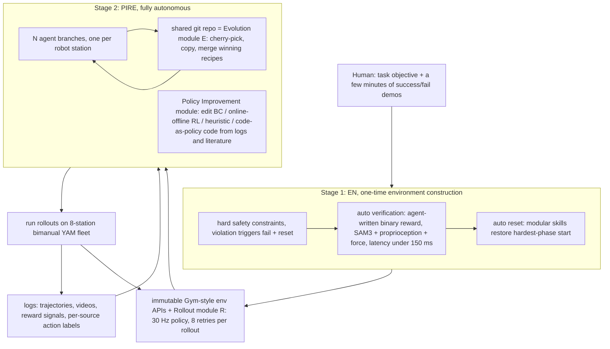

# ENPIRE: Agentic Robot Policy Self-Improvement in the Real World

- arXiv: https://arxiv.org/abs/2606.19980
- Source: https://arxiv.org/abs/2606.19980
- Project: 
- Local PDF: `papers/rl/agentic-robot/ENPIRE_2606.19980.pdf`
- Year: 2026
- Category: rl
- Priority: high

## 一句话总结

NVIDIA + CMU + UC Berkeley 把「reset → execute → verify → refine」做成 coding agent 可直接调用的真机闭环 harness：Stage 1 由人少量介入、agent 用程序化 tool call 搭好硬安全约束 / 自动重置 / 自动验证（EN 模块），Stage 2 让 agent 完全自主地改训练代码，在 8 台双臂 YAM 真机站上通过 Git 去中心化协作 hill-climb 策略成功率（PIRE 模块）——在 Push-T、4mm 针插入、GPU 插入、扎带剪断四个接触丰富的灵巧任务上自主做出 99% 真机成功率的策略，pin insertion 收敛到 100% 的速度快于 frontier human-in-the-loop RL 方法，并提出 MRU / MTU 两个度量「物理 autoresearch 资源利用率」的新指标。

## 核心技术

1. **两阶段问题分解（Sec 2）**：把真机灵巧技能获取拆成 (a) **EN**——人引导的 autoresearch，一次性搭好环境接口，离线验证后固化为不可变 API；(b) **PIRE**——之后完全无人的 autoresearch，agent 只凭自动验证信号改策略。人的工作量是一次性成本，被后续所有机器人、所有实现摊薄。
2. **EN 三件套**：
   - **硬安全约束**：限制工作空间与运动学行为，越界即触发任务失败 + 自动重置——既是无人值守的安全兜底，也是 episode 终止/截断信号来源。
   - **自动验证**：agent 从少量（几分钟）成功/失败演示出发，用程序化 tool call 合成二值奖励函数，在沙盒 held-out 集上最大化预测精度、同时压推理延迟。zip-tie 插入的奖励由「裁剪 + 分割判断绑带是否穿过卡扣头部」构成，用双相机视角几何测试防单视角假阳性，延迟优化到 **150 ms 以内**（论文类比人类视觉系统反应速度）。
   - **自动重置**：沿用 CaP-X 的 modular manipulation skills 思路，把场景直接复位到最难阶段的起点（针尖对准孔口、GPU 悬停在插槽上方、剪刀在手）——把学习系统的火力集中在精度瓶颈段。
3. **R（Rollout）模块**：安全约束 + 验证 + 重置封装成不可变 Gym API；策略吃视觉-本体感知输入、向控制器提交动作。成功率度量是「给定 8 次重试内完成一次 rollout 的概率」，重试发生在目击前次失败之后，因此同时度量精度与 in-context recovery。
4. **PI（Policy Improvement）模块**：agent 拿到可写权限的精简训练代码库（支持端到端策略训练 + code-based policy synthesis），自由选择并组合 BC、iterative BC + 在线 rollout 数据聚合、online RL、offline RL、offline-to-online RL（带 BC 正则项）、heuristic learning、code-as-policy 等范式，还可调 batch size、actor-critic 更新率、BC 项超参。
5. **E（Evolution）模块 = fleet 化的多 agent 协作**：$N$ 个 agent 配 $N$ 台真机异步测试 $N$ 个假设，全部协作经由 Git——agent 自发 cherry-pick、copy、merge 队友的成功训练配方；station 之间不流式传输状态，Git 历史就是「谁试过什么」的单一事实来源。经验还能跨任务迁移：pin insertion 结束后 agent 写下配方演化总结，把这份 markdown 摘要注入 GPU insertion 的新一轮 autoresearch，即可快速达到高成功率。
6. **MRU / MTU 度量**：Mean Robot Utilization = 研究墙钟时间内机器人真正在执行实验的比例；Mean Token Utilization = autoresearch 期间的 token 消耗（论文另按每分钟计），并配 token-to-success 比值。这是本文给「物理 autoresearch」这个新问题立的第一组基准指标。

## 底层原理与数学推导

论文本身是 systems 论文、几乎不写公式；本节把正文文字定义整理成形式化表达（凡论文未给出式子的地方均已标注）。

**(1) 带 in-context recovery 的成功率**。设一次 rollout 内第 $k$ 次尝试的环境状态为 $x_k$，且第 $k$ 次尝试以之前所有失败尝试为条件（这就是与 i.i.d. best-of-8 的本质区别）：

$$\mathrm{SR} = \Pr\Big(\exists\, k \le 8:\ \mathrm{verify}(x_k)=1\ \Big|\ x_1,\dots,x_{k-1}\ \text{all failed}\Big)$$

验证器 $\mathrm{verify}$ 是 agent 合成的二值奖励，论文以文字要求「maximize prediction accuracy while minimizing processing latency」，整理成约束优化：

$$r^* = \arg\max_{r \in \mathcal{R}_{\mathrm{tools}}} \Big[\alpha\,\mathrm{precision}(r) + (1-\alpha)\,\mathrm{recall}(r)\Big]\quad \text{s.t.}\quad \mathrm{latency}(r) \le 150\ \text{ms}$$

其中 $\mathcal{R}_{\mathrm{tools}}$ 是 agent 可用 perception/proprioception tool call 能写出的奖励函数空间（待确认：论文未给出该形式化与 $\alpha$，此处为按 Sec 2.1 文字的整理）。

**(2) 资源利用率指标**。$N$ 个 station、研究墙钟总时长 $T_{wall}$ 的 fleet：

$$\mathrm{MRU} = \frac{1}{N}\sum_{i=1}^{N} \frac{T_i^{\mathrm{robot\text{-}active}}}{T_{wall}}, \qquad \mathrm{MTU} = \frac{1}{N}\sum_{i=1}^{N} \frac{\mathrm{tokens}_i}{T_{wall}}\ \ \text{(每分钟 token 数, Sec 3.6 定义)}$$

论文在 Sec 2.2 又把 MTU 定义为「fleet 的平均 token 消耗」——两处口径不一致，Fig 7b 的纵轴（量级 $10^4$–$10^5$）与每分钟定义吻合；token-to-success 比值则刻画拿到一个成功策略的 token 预算。论文的实证结论是：任何一个 frontier coding agent 都无法把 MRU 或 GPU 利用率推到 $1$。

**(3) fleet hill-climbing 的收益来源**。idea tree 是配方空间 $\mathcal{R}$ 上的并行随机爬山：每个 agent 从同一 baseline 代码分支出发，评估一个改动 $\Delta_k$ 并保留满足 $\Delta \mathrm{SR} > 0$ 的改动，同时通过 Git 读取其他分支的评估结果、复制他人已验证的正增益改动。这把单点爬山变成 $N$ 个采样点的 ensemble，其收益体现在墙钟时间而非总计算量上——论文的数据是 pin insertion 从 1 agent 的 1.5 小时以上缩到 8 agent 的约 40 分钟，Push-T 从约 5 小时缩到约 2 小时；代价是 token 消耗超线性增长（Fig 13：Codex 在简化 Push-T 上 1/2/4 agent 的总 token 为 80M/118M/209M，其中 cached input 占 77M/114M/201M，uncached work 仅 2.6M/4.6M/7.9M）。

**(4) 为什么 EN 必须先于 PIRE 固化**。真机 autoresearch 的每个 trial 都要花机器人和人的时间，所以闭环的「反馈通道」必须先做到无人在环且低方差：安全约束给出截断信号、验证器给出标量反馈、重置把状态分布拉回初值——三者合起来才把物理世界拟合进 Gym 抽象（论文引用 OpenAI Gym），之后的 PIRE 才能套用数字世界里成熟的「改代码 → 跑实验 → 读日志」循环。

## 物理直觉解释

**第一段｜把博士生换成了带自动复位实验台的实验室**。传统真机 RL 之所以贵，不是训练贵，而是**每一集之间都需要人把世界摆回去**——针掉了要捡、GPU 飞了要重插、剪刀要放回原位。ENPIRE 的关键动作是先花一次性成本把「摆回去」和「判定成没成」这两件事做成代码：**这相当于把手工小作坊改造成带传送带和质检仪的流水线**。流水线建好之后，「试一个新想法」的边际成本从「一个研究生的一下午」降到「一个 agent 的一次 tool call」，而 autoresearch 的全部收益都来自这个边际成本的坍缩。反过来，流水线的质检仪（奖励函数）如果本身不可靠，整条线就会把假货当良品——所以论文才让 agent 在沙盒 held-out 集上先证明验证器的精度，再去优化策略。

**第二段｜自动重置是「把球摆在点球点上」**。接触式任务的成功率瓶颈集中在最后几厘米：针插入 4mm 孔、GPU 落进薄插槽、剪刀剪断扎带。如果每次重置都从「随机桌面状态」开始，大部分 rollout 都耗在前面已经解决的抓取段。ENPIRE 的 reset 用 modular skills 把场景直接复位到**最难阶段的起跑线**——**像足球训练不每次都从中场开球，而是把球一次次摆回点球点上专门练射门**。这等价于对状态分布做了一个课程式偏置，把采样预算集中到 credit assignment 最困难的接触瞬间。

**第三段｜Git 是 fleet 的组会**。8 个 agent 各占一台真机试各自的想法，如果靠中央调度器汇总，就要写一套昂贵的协调协议；ENPIRE 让它们**像同一个 repo 上的协作者一样互相 cherry-pick**：某个分支发现 BC 正则带来 +10.8 pp，其他分支直接把这个 commit 拉进自己的代码继续往上叠。**这模拟的正是科研组会的真实机制——每人讲自己这周试了什么，有效的做法被全场吸收，无效的路线被集体放弃**——只不过这里没有讲者，Git log 就是讲稿。去中心化还带来容错：单站挂了不影响其他分支，失败实验留在历史里而不是污染主分支。

**第四段｜为什么真机 Push-T 比仿真难倒了一片 agent**。仿真里的 Push-T 是确定性物理：同一个动作序列永远得到同一个结果，agent 试错三次就能归纳出规律。真机的接触摩擦、动力学漂移、物体位移每次都在变，同一个启发式控制器这次成功下次失败——**这就像在冰面和地毯上练同一套推箱子动作，肌肉记忆直接失灵**。论文的应对有两层：让 agent 混合启发式与梯度学习去补 corner case；以及用 fleet 的多台真机同时采样不同的物理扰动，把「非确定性」本身变成可以并行统计的对象，而不是需要被消灭的噪声。

## 工程细节与实操指南

- **硬件（8 站同构，Sec B.1–B.2）**：每站 2× YAM 臂（I2RT），单臂 6-DoF + 1-DoF 平行爪 = 每臂 7 关节、双臂 14 关节，无刷执行器走 CAN bus；臂关节 PD 控制 + 重力补偿，爪为力矩受限的柔顺抓取（力限模式既提升抓取鲁棒性，也是无人值守的安全前提——失误接触变成安全堵转而非硬件损伤）。每站一台工作站：1× RTX 5090 32GB、Intel Core Ultra 9 285K（24 核）、128GB RAM、Ubuntu 22.04、driver 595.58.03 / CUDA 13.2，**无跨站共享算力**。
- **控制与感知频率**：策略 30 Hz 出动作目标，低层关节控制器 100 Hz 跟踪；感知默认 3× Intel RealSense D405（1 顶视 + 2 腕部），GPU insertion 额外加 1 个侧装 D435i 看插槽；Viser 做浏览器端实时 3D 可视化用于监控无人运行。
- **Fleet 架构**：站内 agent 的硬件请求走本地 FastAPI；跨站协调完全经 Git。控制端点：`/start`（开始 rollout）、`/restart`（分配新 rollout buffer 目录，保证不同假设的数据不混）、`/home`（回 home 位）；Push-T 额外有 `/avoid` / `/resume`（手臂退出/回到顶视相机视野以消除遮挡）。
- **Agent sandbox**：单 autoresearch repo 作用域内免 action 级权限提示 + 不限外网；普通新会话会剪掉旧 rollout 数据、checkpoint 与瞬态日志；**迁移实验（pin → GPU insertion）只传一份人工提示的 markdown 经验摘要**，原始轨迹与 checkpoint 仍被剪除——迁移走「文字总结」通道而非无界的状态继承。
- **真机 RL 基础设施**：集成 PLD-RL pipeline（residual RL 工作 [48]）作为算法 autoresearch 的沙盒，按 SERL 的异步三层设计（deployment / learner / actor，Portal+ZMQ msgpack 协议）；deployment 层与 learner 之间用**松散的磁盘契约**——episode 写成逐步观测张量 + mp4 相机流 + 逐动作来源标签，`DiskBufferIngestor` 线程轮询解析并按 RLPD 式协议分流：RL 来源进 online replay buffer，human 来源进独立 demonstration buffer 按 batch 混入。
- **奖励合成的工程手法（Sec A.2）**：zip-tie 验证 = SAM3 API prompt 搜索 + 裁剪/深度阈值调参抑背景噪声 + 转 ONNX 编译计算图做多目标并发前向以挤进 150 ms 延迟预算 + 双视角几何测试防假阳性；pin insertion 用混合奖励——视觉对齐（针尖 vs 孔心）+ 本体感知插入深度 + 末端力估计三信号合取。
- **重置管线（Sec A.1）**：SAM3 开放词表检测 + BundleSDF 连续 6-DoF 跟踪 + cuRobo 无碰轨迹优化，GPU insertion 示例串起「SAM3 定位主板与槽 → 力矩校验抓取拔出 GPU → cuRobo 无碰 handover 到 parking pose」；爪力矩信号充当触觉替代，用于打滑检测与握力控制。
- **RoboCasa365 仿真评测协议（Sec D）**：40 个 episode 用 generator seed 42 一次性生成的固定 `(seed, layout_id, style_id)` 三元组列表，所有方法共享；与 GR00T 对比时任务名、种子、初始状态、相机配置、成功谓词全对齐，且屏蔽 `get_task_info` / `reset_env` / oracle target 等特权 API。

## 消融实验与分析

**(1) pin insertion 的 hill-climb 里程碑（Fig 2 时间线 + 附录 B.6 idea tree）**——团队平均最佳成功率的增量贡献：

| 顺序 | agent 改动 | 成功率增益 |
|------|-----------|-----------|
| 早期 | Online RL 混合 demo 数据 | +3.8 pp |
| I37 | BC regularization（加 BC 正则项） | +10.8 pp |
| 后期 | Tweak BC term weight（微调 BC 项权重） | +0.4 pp |
| I66 | batch size 1024→512 | +0.9 pp |
| I76 | Compensate controller（补偿控制器） | +1.3 pp |

**核心结论：** 少数高冲击想法贡献了绝大部分进展（BC 正则一项 +10.8 pp），越接近 100% 后续改动越退化为 +1 pp 量级的精修——典型的爬山曲线尾部，也说明「改算法代码」的价值大头在早期方法选择而非后期调参。

**(2) 视觉接入方式对真机 autoresearch 的影响（附录 C.3/C.4，简化 Push-T，Codex）**：

| 配置 | 首次移动 | 首次成功 | 对照：模型/harness 横评 |
|------|---------|---------|------------------------|
| Codex w/ native vision | 25.23 | 54.67 | Codex (GPT-5.5) 54.41 |
| 无直接视觉（仅日志信号推断） | 13.23 | 72.32 | Claude Code (Opus 4.7) 62.01 |
| VLM 作为视觉工具函数调用 | 13.32 | 99.18 | Codex + Claude API 105.00 |

（时间单位均为 min。）**核心结论：** native vision 最快（54.67 min），但反直觉的是「完全无视觉、只读文本日志」的基线（72.32 min）反而快过「每次视觉都要调一次 VLM 函数」的配置（99.18 min）——重复图像调用引入的开销盖过了它带来的信息量；harness 的工程开销同样可观：同一模型（Opus 4.7）换到 Codex harness 反而是最慢配置（105.00 min vs Claude Code 的 62.01 min）。

**(3) fleet 规模与 token 超线性（Fig 7/13 + Sec 3.3/4）**：

| 指标 | 1 agent | 2 agents | 4 agents | 8 agents |
|------|---------|----------|----------|----------|
| 总 token（Codex, 简化 Push-T） | 80M | 118M | 209M | 待确认（该图仅到 4） |
| 其中 cached input | 77M | 114M | 201M | 待确认 |
| 其中 uncached work | 2.6M | 4.6M | 7.9M | 待确认 |
| 到目标性能墙钟时间（Push-T, 1.0 归一化分） | 约 5 h | — | — | 约 2 h |
| 到接近满成功率墙钟时间（pin insertion） | >1.5 h | — | — | 约 40 min |

**核心结论：** 加机器人确实买回了墙钟时间（pin insertion 从 >1.5 h 到约 40 min，提速至少 2.25×；Push-T 从约 5 h 到约 2 h），但 token 预算超线性上涨——8 agent 时 MTU 明显偏离线性投影，总 token 增速远超墙钟缩短的幅度；**fleet 扩张本质是「用 token 效率换时间」**。同时 MRU 随规模下降、GPU 利用率上升：agent 团队要花更多时间读同伴分支、更少时间真正开机器人。

**(4) 仿真侧感知瓶颈（附录 D，RoboCasa counter-to-cabinet，20 个目标查询）**：原任务 prompt 的正确检测率从 256×256 的 10/20 提到高分辨率的 14/20 后饱和；允许 agent 改写物体 prompt 后进一步提升到 17/20。**说明生成脚本的上限不只由规划与控制决定，也由暴露给 agent 的 perception API 可靠性决定，prompt 搜索与分辨率选择因此是 agent 的正当工具集的一部分。**

## 技术权衡（Trade-off）

| 优势 | 劣势与工程代价 |
|------|---------------|
| 闭环全部落在真机：奖励来自物理世界验证器，不依赖仿真 gap 或人工奖励设计 | EN 阶段仍需人：任务目标、几分钟成功/失败演示、对环境实现的人工评估都是一次性但不可省的输入 |
| 一次性环境接口投入被整个 fleet、所有后续实现摊薄 | 接口一旦固化（immutable APIs）就冻结了感知/重置方案的上限；任务变化需重走 EN 流程 |
| fleet 并行显著压缩墙钟时间（pin insertion >1.5 h → 约 40 min） | token 成本超线性（80M→118M→209M 仅 1→4 agent），MRU 随规模下降；大 fleet 是拿 token 效率换时间 |
| 支持 heuristic / BC / online / offline / offline-to-online RL 多范式自由组合 | 真机启发式学习在 Push-T 上让三个 coding agent 中的两个直接失败，agent 必须被鼓励跨范式混搭才能扛住物理非确定性 |
| 迁移靠 markdown 经验摘要，避免了 checkpoint/数据的无界继承 | 摘要是人提示产出的有损压缩；跨任务迁移只在「相似灵巧任务」（pin→GPU insertion）上验证过 |
| MRU/MTU 给物理 autoresearch 提供了第一个可比较的效率标尺 | 论文自述没有任何 frontier agent 能把 MRU 或 GPU 利用率推到 1；MTU 在正文两处定义口径不一致（平均消耗 vs 每分钟） |
| 重试制成功率（8 次）同时度量精度与 in-context recovery | 该度量比 i.i.d. best-of-N 宽松，跨论文比较时不可直接对齐 |

## 技术价值与演进定位

ENPIRE 的定位是「把 autoresearch 从数字环境搬进物理世界的 harness」：此前的 AI Scientist / MLE-bench / SWE-bench 一系工作里实验介质是便宜且可并行的（GPU 秒级迭代、合成任务近乎免费），Voyager、DreamCoder 的技能库之所以成立，也是因为 Minecraft rollout 与程序执行不花钱；而机器人领域此前的 LLM 自改进工作（Eureka 式奖励设计、DrEureka 域随机化、RoboGen 生成任务）虽然由 LLM 驱动，闭环仍关在仿真里，真机只当 sim-to-real 的出口。ENPIRE 把稀缺资源从算力换成了 robot-access budget，并据此提出两个新问题维度：如何让 agent 在硬件预算内做假设检验（reset/verify 的接口化答案），以及如何度量物理资源的利用率（MRU/MTU——此前的基准只度量能力或成本-per-paper）。它与 human-in-the-loop 真机 RL（residual RL / PLD、HARBOR 一类 harness 化工作）的关系是「接着往上游退一步」：后者把「人给的成功标签」变成训练信号，前者进一步把「人给标签」这件事也交给 agent 合成的验证器，并让 agent 自己改算法代码；在 pin insertion 上它的收敛速度快于这个 human-in-the-loop 基线，说明自动验证在精度任务上已经能顶替人肉反馈。对本研究库的意义：它把 rl/ 赛道里分散的真机 RL 算法（RL-100、RL Token、VLAC、simplevla-rl）统一成 agent 的「可选菜单项」，并把 agentic 闭环线（HARBOR、agentic-robotics-loop）推到 8 站 fleet 与跨任务经验迁移的规模；「物理 autoresearch + 资源利用率指标」大概率会成为后续真机 agent 工作绕不开的比较框架。

## 与其他论文的关系

- **HARBOR（notes/rl/harbor.md）**：同为「agentic robot RL 的 harness」，但 HARBOR 聚焦把单站 RL 训练循环本身 harness 化，ENPIRE 把 harness 的对象换成 autoresearch——agent 写的不仅是策略，还有奖励函数、重置程序和训练算法代码，并扩展到 8 站 fleet 与 MRU/MTU 度量。
- **agentic-robotics-loop（You Don't Need To Stay in The Loop，notes/rl/agentic-robotics-loop.md）**：同一动机（把人移出真机改进闭环）的不同切口；ENPIRE 给出的接口化答案是 reset-execute-verify-refine 四件套 + Git 协作，可作为该方向「闭环抽象」的代表实现来对读。
- **PLD / residual RL（Xiao et al. 2025，即 ENPIRE 引用 [48]）**：ENPIRE 直接集成其 PLD-RL pipeline 作为 RL 沙盒（SERL 式异步三层 + RLPD 式数据混合），并在 pin insertion 上以更快收敛超过这个人机协同基线——说明「人给二值反馈」这一环可以被 agent 合成的验证器顶替。
- **RL-100（notes/rl/rl-100.md）、RL Token（notes/rl/rl-token.md）、VLAC（notes/rl/vlac.md）、SimpleVLA-RL（notes/rl/simplevla-rl.md）**：真机/后训练 RL 算法线；在 ENPIRE 的框架里它们退居为 agent 可自由挑选、组合与调参的「算法菜单项」，框架本身不与任何单一算法绑定。
- **RoboCat（notes/data/robocat.md）**：自改进循环的早期数据侧形态——经验积累表现为数据量与任务数增长；ENPIRE 的循环变量是训练配方与代码，且把「经验跨任务传递」压缩成一份 markdown 摘要而非数据集迁移。
- **CaP-X（Fu et al. 2026）**：ENPIRE 的 reset tool call 风格直接来自 CaP-X，RoboCasa365 上的 zero-shot agentic 对照基线也是它；两文同社区（NVIDIA/CMU/Berkeley 重叠作者），构成「单任务 coding agent 能力」到「多任务自主科研循环」的递进。
- **Voyager / DreamCoder / Eureka / DrEureka / RoboGen**：ENPIRE 相关工作一节对这条线的论断很锋利——它们的闭环都关在「便宜基底」上（Minecraft 免费试错、Isaac Gym 每分钟数千 rollout、仿真内迭代），真机从不是迭代的介质；ENPIRE 保留其技能积累与奖励生成机制，把循环直接搬上硬件。
- **HumanVid self-improve（notes/rl/humanvid-selfimprove.md）**：同为降低真机自改进的人力/机器人时间成本，但走「从人类视频学动力学、少花机器人时间」的路线；ENPIRE 反向操作——坦然消耗大量真机时间，靠无人化把人力成本归零，两条路线对「物理交互数据从哪来」给出了相反的回答。

## 精读问题

1. 自动验证器是整个闭环的信任根基：论文用沙盒 held-out 集（几分钟成功/失败样本）约束它，但精度/召回指标具体是多少、双视角几何测试在 8 站长期运行中的假阳性漂移如何被监控与修正，正文与附录均未量化——若验证器在训练中途系统性失准，agent 的整个 hill-climb 会朝错误方向收敛，这套框架需要什么样的「验证器漂移检测」？
2. token 超线性增长的机制是什么：论文归因于「团队要花更多时间总结同伴分支」，但 Fig 13 显示 80M→209M 的增量几乎全部是 cached input（77M→201M），uncached work 只从 2.6M 涨到 7.9M——超线性究竟来自被重复读取的 repo/日志上下文膨胀，还是来自 agent 行为本身的改变？用 cache 计价还是用 uncached 计价评估 fleet 扩张的性价比会得出完全不同的结论，那么物理 autoresearch 的成本基准到底应该按哪个口径计？
3. 重试制成功率（8 次重试）把 in-context recovery 计入指标，但论文没有拆分「一次成功」与「重试后成功」的比例——99% 里有多少是靠 in-context 修正救回来的？不做这个分解，ENPIRE 的数字还能与 i.i.d. best-of-N 口径的 RL-100 / PLD 等工作公平比较吗？
4. 经验迁移通道是「上一任务 agent 写的 markdown 摘要」：这个摘要的内容、长度、结构由谁控制（人给提示模板还是 agent 自由发挥），以及摘要质量差时 GPU insertion 的收敛受多大影响，论文只在附录给了定性分析——这种自然语言介质的经验传递能否像 checkpoint 一样被版本化与消融？
5. MRU 随 fleet 规模下降、GPU 利用率上升，意味着瓶颈从机器人侧转移到 agent 的思考侧；如果给每个 station 配更强（更贵）的模型，MRU/MTU/token-to-success 三者会如何联合移动？论文只测了三个 coding agent，从这点数据能外推出「资源利用率—模型能力」的标度关系吗？
