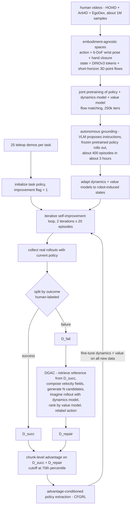

# Robot Self-Improvement via Human-Video Dynamics Models

- arXiv: https://arxiv.org/abs/2606.21406
- Source: https://arxiv.org/abs/2606.21406
- Project: 
- Local PDF: `papers/rl/agentic-robot/HumanVid-SelfImprove_2606.21406.pdf`
- Year: 2026
- Category: rl
- Priority: high

## 一句话总结

把人类视频的用途从"策略初始化燃料"升级为"自我改进的预测基座"：在 HOI4D/Arti4D/EgoDex 约 100 万条人类视频样本上联合预训练三个具身无关模型——policy（动作 = 6-DoF 腕部位姿 + 手部闭合标量）、dynamics（世界状态 = DINO-v3 语义 token + 短时程 3D 点流）与 value（稀疏终局奖励的折扣回报）——再用 VLM 提指令、冻结的人类预训练 policy 自主滚动约 400 回合（约 3 小时）把后两者接地到机器人本体；推理期的 DGAC（Dynamics-Guided Action Correction）模块免训练地把失败状态变成"检索成功参考 → 速度场组合生成候选 → 动力学模型想象 rollout → value 模型排序择优"的修复查询。Hello Robot Stretch 3 上 5 个长程任务的平均成功率从 Expert BC 的 41.3% 提到 85.3%，超过最强基线 RISE（76.0%）9.3 个百分点；DGAC 作为即插即用后训练模块把 π0.5 从 SFT 后的 62.7% 推到 88.0%（比无人工纠正的 RECAP 高 20.0 个百分点）；同一套流程迁移到 Franka Panda 上把平均成功率从 36.7% 提到 70.0%。

## 核心技术

**三个具身无关表征（transferable representations）。** 论文的立论是：要在人类视频上预训练出"能预测、能评估、能纠错"的模型，动作与状态空间必须先剥离本体特异细节。

- **动作** $a_t = [\xi_t, c_t]$：$\xi_t \in SE(3)$ 是绝对 6-DoF 腕部位姿，$c_t \in [0,1]$ 是从人类手指构型估计的标量手部闭合量。人类视频里的双手 20 维格式（2 × (3 平移 + 6 旋转 + 1 闭合)，旋转用连续 6D 表示）在单臂机器人上复制到空置手位作为占位。
- **世界状态** $o_t = [z_t, P_t]$：$z_t$ 是当前帧 DINO-v3 视觉 token（语义上下文，短时程内变化慢），$P_t$ 是终止于 $t$ 时刻的短时程 3D 点流（TAPIP3D 跟踪得到，承载细粒度几何与接触动力学）。这是一个刻意的**非对称时间设计**：语义给"发生了什么"，点流给"东西怎么动"。
- **价值**：用稀疏终局奖励的折扣回报定义，$V_t = \gamma^{T-t} r_T$，$r_T \in \{1, -1\}$ 表示成败，中间奖励全为 0。

**三个模型的联合预训练。** policy $\pi_\theta$（encoder-decoder transformer，Diffusion Policy 式动作分块，flow matching 目标）从腕部状态历史与视觉 token 历史预测动作块；dynamics model $f_\phi$（CDiT 架构）从状态历史 + 候选动作块预测未来世界状态 $\hat o_{t+H-1}$；value model $V_\psi$（transformer + 可学习 value token）从 $o_t$ 回归标量价值。人类视频侧约 100 万样本来自 HOI4D、Arti4D、EgoDex，监督信号由现成感知模型自动提取（见工程细节）。

**自主机器人接地（autonomous grounding）。** 直接迁移受限于残余本体差异、人类视频偏成功执行的偏差、以及只在机器人部署时才出现的失败。论文不用遥操作，而是让 VLM（GPT-4o）提出原子交互指令（如"close the drawer"），由冻结的人类预训练 policy 在真机上执行——配合 VidBot 预训练 affordance 模型做开环接触点选择，约 3 小时自主收集约 400 回合，专门让 dynamics/value 模型见到机器人自己的状态分布与自然失败。

**DGAC：免训练的失败修复（核心贡献）。** 对每个失败状态 $o_t$：

1. **两阶段检索**：先用 value 相似度从 $\mathcal D_{succ}$ 里取进度对齐的 top-$K$ 成功状态，再用状态相似度选出最兼容的参考 $\tilde o_t$；门控条件 $|V_\psi(\tilde o_t) - V_\psi(o_t)| \le \delta_v$ 且 $\mathrm{sim}(o_t, \tilde o_t) \ge \delta_s$ 不满足则放弃修复（承认该失败不可恢复）。
2. **速度场组合生成候选**：在 flow matching 的速度场上把当前上下文 $h_t$ 与参考上下文 $\tilde h_t$ 按权重 $w_n \sim \mathcal U(0.1, 1)$ 插值，从噪声积分出 $N$ 个候选动作块——锚定在当前观测、导向检索到的成功、同时保留多样性。
3. **想象 rollout + 排序**：每个候选经 $f_\phi$ 预测未来状态，再经 $V_\psi$ 打分，取 $\arg\max_n V^{(n)}_{t+H-1}$ 作为修正动作。
4. **重标记**：选中的修正写回失败转移，形成修复数据集 $\mathcal D_{repair}$。

注意 DGAC 本身免训练（不更新任何参数），但整个自改进循环里 $f_\phi$ 和 $V_\psi$ 每轮还会在最新收集的数据上继续微调，以跟上策略诱导的状态分布。

**优势条件化策略更新。** 在 $\mathcal D_{succ} \cup \mathcal D_{repair}$ 上估计块级优势（Eq. 1），按 CFGRL 的 policy-extraction 视角做优势条件化提取，改进阈值 $\epsilon$ 取经验优势分布的 70 分位。这是全流程里唯一的策略梯度式更新，且明确不求解正则化 RL 目标。

## 底层原理与数学推导

**Flow matching 与 x-prediction 参数化。** 给定干净数据 $x$ 与高斯噪声 $\epsilon \sim \mathcal N(0, I)$，时刻 $\tau \in [0,1]$ 的插值样本与速度场为

$$x_\tau = \tau x + (1-\tau)\epsilon, \qquad v = \frac{dx_\tau}{d\tau} = x - \epsilon$$

论文遵循"让去噪模型去噪"的建议采用 x-prediction：网络直接预测干净目标 $\hat x_\theta(x_\tau, \tau)$，速度场按 $\tau$ 恢复：

$$v_\theta(x_\tau, \tau) = \frac{\hat x_\theta(x_\tau, \tau) - x_\tau}{1 - \tau}$$

动作模型与动力学模型共用这套目标，损失是对干净目标的回归：

$$\mathcal L_\pi = \|\hat a^\tau_{t:t+H-1} - a_{t:t+H-1}\|_2^2, \quad \mathcal L_f = \|\hat o^\tau_{t+H-1} - o_{t+H-1}\|_2^2, \quad \mathcal L_V = \|\hat V_t - V_t\|_2^2$$

**稀疏终局奖励下的价值定义。** 中间奖励全 0、只有终局 $r_T \in \{1, -1\}$，于是折扣回报塌缩为单项：

$$V_t = \sum_{t'=t}^{T} \gamma^{t'-t} r_{t'} = \gamma^{T-t} r_T$$

机器人部署阶段额外加 TD 项（权重 10，沿用 RISE）细化价值估计：

$$\mathcal L_{TD} = \|\hat V_t - (r_t + \gamma \hat V_{t+1})\|_2^2$$

**块级优势 bootstrap。** 评估一个候选动作块用"块内真实奖励 + 块尾价值差"：

$$\hat A(o_t, a_{t:t+H-1}) = \sum_{t'=t}^{t+H-1} r_{t'} + V_\psi(o_{t+H}) - V_\psi(o_t)$$

改进事件取 $\hat A$ 是否超过任务相关阈值：$I_t = \mathbb 1(\hat A(o_t, a_{t:t+H-1}) > \epsilon)$，实验中 $\epsilon$ 取经验优势分布的 70 分位。

**Policy extraction 而非正则化 RL。** 不解正则化 RL 目标，而是从参考策略构造改进后的目标策略，$\beta$ 控制提取的锐度：

$$\hat\pi(a_{t:t+H-1} \mid o_t) \propto \pi_{ref}(a_{t:t+H-1} \mid o_t)\, p(I_t \mid \hat A(o_t, a_{t:t+H-1}))^\beta$$

对应 CFGRL 的实现方式：优势被转成条件嵌入，优势高于 cutoff 的样本用 optimal embedding 训练，其余用 non-optimal embedding。

**DGAC 的检索与组合数学。** 检索先按价值相似度过滤再按状态相似度精选：

$$\mathcal O_t^{(k)} = \mathrm{TopK}_{o' \in \mathcal D_{succ}}\left(-|V_\psi(o') - V_\psi(o_t)|\right), \qquad \tilde o_t = \arg\max_{o' \in \mathcal O_t^{(k)}} \mathrm{sim}(o_t, o')$$

候选动作块由两个策略上下文的条件速度场线性组合积分得到——这一步是 DGAC 区别于"直接抄参考"的数学本质：$h_t = [s_{t-H'+1:t}, z_{t-H'+1:t}, m^\pi_t, I]$ 与参考上下文 $\tilde h_t$ 在速度空间做凸组合，插值系数 $w_n$ 随机采样以保留多样性：

$$v^{(n)}_\theta = v_\theta(a^\tau_{t:t+H-1}, \tau; h_t) + w_n \left[ v_\theta(a^\tau_{t:t+H-1}, \tau; \tilde h_t) - v_\theta(a^\tau_{t:t+H-1}, \tau; h_t) \right], \quad w_n \sim \mathcal U(0.1, 1)$$

候选排序取想象未来状态的价值最大者：

$$a^\star_{t:t+H-1} = \arg\max_{n} V_\psi\left(f_\phi(o_{t-H'+1:t}, a^{(n)}_{t:t+H-1})\right)$$

值得注意的是 max-over-$N$ 选择有乐观偏差风险（挑中的候选 value 被高估），论文用优势分布图做了经验检查：修复样本的优势分布向成功分布移动、但没有系统性高于成功分布，说明该偏差在实践中有限。

## 物理直觉解释

**DGAC 把失败状态当成"棋局复盘问题"，而不是要扔掉的垃圾数据。** 一个刚下错的棋手不会把整盘棋扔掉：他盯着这个坏局面，在脑内棋盘上推演几个候选走法（dynamics model 的想象 rollout），再用盘面直觉判断哪个走法最接近赢棋（value model 打分）。论文的关键观察是大多数失败状态仍然**可恢复**——它们暴露了当前策略的边界，但离成功行为足够近，一个动作块的修正就能拉回来。所以失败转移的正确用法不是降权（AWR/RECAP 的做法）也不是删除，而是把它当作一个查询："在这个局面下，怎样的动作块能把轨迹拉回成功流形？"答案由检索到的成功经验引导、由学到的物理模型验证。

**人类视频提供的不是动作样本，而是一台"物理进度的温度计"。** value 模型从人类视频里学到的是"任务进行到什么程度了"的普适感知——看过千百次别人开微波炉、放袜子之后，即使自己一次都没成功过，也知道"饮料已经拿在手里、朝盘子移动"比"还站在原地"进度更高。这就是为什么动力学和价值模型可以在机器人一次成功都没有的阶段就具备排序能力，再由约 400 回合的自主机器人数据把这台温度计校准到机器人自己的状态分布上。类比：新手厨师看过大量做菜视频，手上的刀工还不行，但"锅里的菜到几成熟"的判断力已经先于手上功夫成形——判断力先于执行力，正是这篇论文能把观察数据变成自我改进燃料的原因。

**速度场组合解释了为什么不能直接抄答案。** 消融里直接复制最相似成功轨迹的 V2（58.7%）比完全不做修复的 V1（62.7%）还差：检索到的参考处于不同的场景构型，逐帧照抄会把适配当前场景的动作信息洗掉。DGAC 的组合式生成相当于爵士乐手模仿的是参照演奏的**句法**而不是**音符**——生成的候选被锚定在当前观测的条件速度场上，只朝参考方向被推了一把（$w_n \le 1$ 保证不会推过头），因此修正既"像成功行为"又"贴着当前失败场景"。这在几何上很干净：flow matching 的条件速度场对上下文近似线性，插值上下文近似等于插值生成的分布。

**非对称信息设计是"执行时轻装、复盘时全副武装"的分工。** 消融 V10/V11 显示：把点流加进策略输入几乎无增益（84.0% 对 85.3%），而把腕部相机加进动力学模型反而有害（78.7%）。直觉是：在线执行需要的是低延迟的语义判断（"现在该伸手还是该张手"），而离线修复需要的是细粒度几何（"手到底偏了几厘米、接触点滑没滑"）。让策略保持轻量、把几何当作动力学模型在离线修复时的特权信息（privileged information），既省了执行时的感知负担，又避免了腕部视角这种"人类视频里不存在、训练与部署分布不一致"的输入把动力学学习带偏。

## 工程细节与实操指南

- **人类数据流水线（可照抄的自动标注套路）**：HOI4D / Arti4D / EgoDex 三源；DINO-v3 提语义 token；TAPIP3D 提 3D 点流（需要相机内外参，Arti4D 用数据集自带 SLAM 位姿，EgoDex 缺稠密深度时用 DepthAnything-v3 补）；腕部轨迹有标注用标注，没有则 HaMeR 初始化第一帧腕部平移 + 用 TAPIP3D 点流前向传播跟踪 + HaMeR 估计旋转 + Savitzky–Golay 滤波平滑。合计约 100 万样本。
- **机器人侧数据预算**：任务无关自主交互约 400 回合 / 约 3 小时（VLM 指令 + 冻结人类预训练 policy + VidBot affordance 接触区域选择的开环控制；先规划无碰撞 pre-contact 轨迹，进入接触区后才交还给 policy 生成接触后交互）；每个下游任务 25 条遥操作演示做策略初始化；自改进共 2 轮、每轮 20 回合。
- **网络规模**：policy 与 dynamics 均为 16 层 transformer、12 头、latent 384；value 模型 8 层、8 头、384。动作块长度 $H = 30$；历史长度 $H'$ 人类预训练 15、机器人策略 1、dynamics/value 两侧均为 15。头相机 224×224 中心裁剪，腕部相机 240×320。
- **训练超参**：全程 AdamW、lr $1 \times 10^{-4}$。人类预训练 250k iters / batch 20 / 4 GPU，视觉动力学损失加权 100（点流与 token 分列两项）；机器人适配 80k iters / batch 20；策略初始化 30k iters / batch 32 / 2 GPU；自改进每轮微调 dynamics/value 8k iters / batch 12；TD 损失权重 10；优势 cutoff 取 70 分位。
- **公开信息缺口（复现前必须补的洞）**：候选数 $N$、检索 top-$K$ 的 $K$、门控阈值 $\delta_v$ 与 $\delta_s$、提取锐度 $\beta$、折扣因子 $\gamma$ 的数值论文均未给出。待确认：这些超参数在第 5-6 页方法描述与附录 A.2 中均未报告，复现只能自行网格搜索。
- **DGAC 每次修复的成本构成**：$N$ 次动力学前向 + $N$ 次价值前向 + 一次检索；论文强调其紧凑状态表示使 rollout 评估达到 4 Hz（RISE 的视频生成 rollout 是 0.6 Hz），但单次 DGAC 修复的墙钟时间未报告。待确认：论文未给出 DGAC 修复单个失败状态的耗时与 $N$ 的取值，无法估算修复环节的开销。
- **值得照抄的两个诊断实验**：(a) 失败 / 修复 / 成功三类 rollout 的优势分布对比图（Fig. A8）——同时检验 max-over-$N$ 乐观偏差与 value 分辨率两个失效模式；(b) 状态嵌入空间的 t-SNE（Fig. A7）——验证修正后的预测动力学确实从失败区域移向成功区域，并能对应到"抓取未对准、下探不足、碰撞、放错位置"等可解释修复类别。
- **失败判定目前是人工的**：每条 rollout 的成败由人标注（作者列为未来工作，拟换成 foundation model 自动反馈）。做实验时要预算这部分标注人力。

## 消融实验与分析

### A. DGAC 的生成与排序缺一不可（论文 Table 2，Stretch 3，5 任务平均成功率）

| 变体 | 机制 | 平均成功率 | 与完整方法差距 |
|------|------|-----------|---------------|
| V1 w/o DGAC | 完全不修复失败状态 | 62.7% | -22.6 pp |
| V2 Reference | 直接复制最相似成功轨迹的动作 | 58.7% | -26.6 pp |
| V3 Rand. Val. | 同一候选池，随机选 | 52.0% | -33.3 pp |
| V5 Min. Val. | 选 value 排名最低的候选 | 48.0% | -37.3 pp |
| V6 VLM Val. | 用现成 VLM（GPT-5）从候选池选 | 64.0% | -21.3 pp |
| Ours | 速度场组合生成 + 动力学/value 排序 | 85.3% | — |

**核心结论：** 生成与排序两端各自缺一不可——不做修复掉 22.6 pp，照抄参考反而比不修复更差（58.7% < 62.7%，说明跨场景直接复制会引入错误监督）；固定候选池后，物理接地的排序（dynamics + value）比 VLM 语义排序高 21.3 pp、比随机选择高 33.3 pp，说明细粒度动作修复必须靠"预测物理后果"而不是"看起来合理"。注意正文写"Ours improves over V2 by percentage points"处漏印了数值，-26.6 pp 是按表中数字计算的。

### B. 世界状态表示与模态选择（论文 Table A4 / Table A5）

| 变体 | 改动 | 平均成功率 | 相对完整方法 |
|------|------|-----------|-------------|
| V7 Points Only | 只用 3D 点流 | 68.0% | -17.3 pp |
| V8 Visual Only | 只用 DINO-v3 token | 72.0% | -13.3 pp |
| V9 Video Latent | 换成视频生成模型的 latent | 65.3% | -20.0 pp |
| V10 Policy + Points | 给策略输入加点流 | 84.0% | -1.3 pp |
| V11 Dynamics + Wrist Cam | 给动力学模型加腕部相机 | 78.7% | -6.6 pp |
| Ours | DINO-v3 token + 点流（非对称分工） | 85.3% | — |

**核心结论：** 双模态缺一即掉 13-20 pp，且把视频生成模型 latent 当状态表示（65.3%）反而比纯 DINO-v3（72.0%）更差——视频生成特征带时序先验但缺动作条件、本体感知的动力学信息；另外模态消融证明"几何是动力学模型的特权信息"这一分工是设计出来的而非巧合：点流加给策略几乎无效（84.0%），加给腕部视角反而有害（78.7%）。

### C. 主结果与迁移（论文 Table 1 / Table 3 / 第 8 页文字）

- 主基准（Stretch 3，5 任务 × 15 试）：Ours 85.3% > RISE† 76.0% > RISE 之外最强 AWR/LPB 60.0% > RECAP† 61.3% > SWIM 49.3% > Expert BC 41.3%；† 表示去掉了人工介入纠正的自主设置。评估吞吐 4 Hz 对 RISE 的 0.6 Hz。
- 换骨干（π0.5）：SFT 62.7% → +RECAP† 68.0%（仅 +5.3 pp）→ +DGAC 88.0%（+20.0 pp over RECAP），且 88.0% 与自建小策略的 85.3% 几乎持平——说明"人类视频先验 + 失败转监督"能追平大规模机器人预训练骨干。
- 跨本体（Franka Panda）：Box 46.7% → 73.3%，Sweep 26.7% → 66.7%，平均 36.7% → 70.0%。
- 人类数据规模（Fig. 6）：无人类预训练 52.0% → 50% 语料 58.7% → 全量 85.3%，单调上升；但去掉机器人适配会一致地降低性能。待确认：Fig. 6 中"w/o Adaptation"柱的具体数值无法从论文文本中提取，正文只说"consistently reduces"，未报数。

## 技术权衡（Trade-off）

| 优势 | 劣势与工程代价 |
|------|---------------|
| DGAC 免训练，即插即用：同一模块在自建策略（41.3% 起点）与 π0.5（62.7% 起点）上都奏效 | 要维护 policy / dynamics / value 三模型栈：预训练 250k iters + 适配 80k iters + 每轮 8k iters，推理时每个失败状态还要跑 $N$ 次动力学想象 |
| 人类视频承担了动力学与价值的学习，机器人侧只需约 3 小时 / 400 回合自主数据 | 人类视频预训练依赖一整条感知标注流水线（DINO-v3、TAPIP3D、HaMeR、DepthAnything-v3、SG 滤波），任一环节的系统误差都会写进先验 |
| 修复免遥操作、免在线人工介入（对照 RECAP/RISE 需要人工纠正的原始设定） | rollout 成败仍由人工标注；这一处人工监督没有被替换，是当前自主性的边界 |
| 紧凑状态表示使想象 rollout 达 4 Hz，比视频生成式世界模型（0.6 Hz）快约 6.7 倍 | 修复是短时程局部的：$H = 30$ 的动作块内一次修正，无法处理需要多段干预才能恢复的复合失败（作者自己列为局限） |
| 检索门控 $\delta_v / \delta_s$ 主动放弃不可恢复的失败，避免污染训练集 | 被门控拒绝的失败转移只剩"被 value 过滤降权"一条路——不可恢复失败携带的策略边界信息被浪费了 |
| 跨本体与跨骨干的两组迁移实验都做了（Panda 36.7%→70.0%；π0.5 62.7%→88.0%） | 迁移实验的规模有限：每任务 15 试、跨本体只有 2 个任务，置信区间没有报告 |

## 技术价值与演进定位

这篇论文在库里的三条演进线上都占了位置。**人类视频线**：从 R3M/VIP 式视觉表征预训练，到 VidBot / 点流式"可执行结构"提取，再到本文——人类视频第一次被用来训练**可预测、可评估**的三模型组合，用途从"让机器人模仿"变成"让机器人判断与纠错"。**世界模型线**：DINO-WM、V-JEPA 2-AC、LeWorldModel 这一脉的共识是动力学模型需要机器人交互数据才够准，本文的破解方式不是换架构而是换动作空间——把动作抽象成"6-DoF 腕部位姿 + 闭合标量"、状态抽象成"语义 token + 点流"之后，人类视频就能直接监督动力学学习，机器人数据退居"校准"角色（400 回合对 100 万样本，约 1:2500）。**自改进线**：RECAP/AWR 靠加权过滤失败、RISE 靠视频生成合成额外 rollout，本文指出这些方法都浪费了近失败状态里最有价值的边界信息，转而显式生成修正动作——从"被动筛选经验"到"主动修复经验"。同时要记下两个没解决的问题：成败判定仍靠人工、修复仍是短时程局部的，这两点分别是数据规模与失败复杂度上的天花板，也是后续工作最明确的切入点。

## 与其他论文的关系

- **V-JEPA 2（notes/world-model/v-jepa2.md）—** 同样走"互联网视频预训练 + 少量机器人数据接地"的路线，但 V-JEPA 2-AC 用冻结的视频编码器 + 62 小时机器人视频学动作条件预测器、服务 MPC 规划；本文用人类视频联合训练动作条件动力学与价值模型、服务失败修复——一个在线控制、一个离线纠错，且本文的动作空间显式剥离了本体细节而 V-JEPA 2 的动作是机器人本体动作。
- **LeWorldModel / DINO-WM（notes/world-model/leworldmodel.md）—** 同属"在预训练视觉特征上学动力学"的家族（本文直接引用 DINO-WM 的状态表示思想）；区别是本文的世界状态多了一路显式 3D 点流来承载接触几何，且 Table A4 显示只用 DINO token 掉到 72.0%，说明接触丰富操作任务里纯语义 latent 不够。
- **ENPIRE（notes/rl/enpire.md）—** 同为真机自我改进，ENPIRE 强调 agentic 的改进流程；本文把改进信号具体化为"失败状态 → 动力学修复 → 优势条件化提取"，并给出与 RECAP/RISE 的同台对照（85.3% 对 76.0%/61.3%），两者可作为"改进流程设计"与"改进信号来源"两个正交维度来读。
- **RECAP（π*0.6）与 CFGRL —** 本文的优势条件化更新直接沿用 CFGRL 的 policy-extraction 公式与 RECAP 的 70 分位 cutoff，但实验证明只靠 value 过滤（π0.5 + RECAP 68.0%）远不如显式修复（+DGAC 88.0%），等于给了"过滤式自改进"这一整类方法一个量化上限。
- **RISE —** 同样用世界模型自改进，但用视频生成模型合成 rollout（0.6 Hz、无检索引导）；本文用紧凑状态表示上的判别式动力学（4 Hz）+ 成功经验检索，9.3 pp 的差距与 6.7 倍的速度差一起构成了"生成式 rollout vs 判别式想象"的对照证据。
- **SWIM（Structured World Models from Human Videos）—** 最接近的先驱：也从人类视频学动力学用于机器人，但动作空间是像素级 affordance 度量；本文将其改造为基线（49.3%）并指出简化动作空间限制了它在长程任务上的表现。
- **π0.5（architecture 线）—** 在本文中作为"大规模机器人预训练骨干"的检验平台，DGAC 对它的 +25.3 pp（62.7%→88.0%）是"后训练模块可以跨骨干复用"这一主张的最强证据。

## 精读问题

1. 速度场组合的权重采样区间 $w_n \sim \mathcal U(0.1, 1)$ 的下界为什么不是 0？$w_n \to 0$ 意味着完全采纳参考上下文、$w_n = 1$ 退化为原策略——论文没有对这个区间做消融，如果由你设计，如何区分"组合生成的收益"与"仅仅加大了采样多样性的收益"？
2. 门控阈值 $\delta_v$ 与 $\delta_s$ 数值未公开。被门控拒绝的失败转移从 $\mathcal D_{repair}$ 中消失，只剩被 value 过滤降权一条出路——那些真正不可恢复的失败所暴露的"策略边界"信息是否被系统性浪费？能否把它们改造成"负向参考"用于约束策略分布？
3. 目前 rollout 成败由人工标注，若按作者设想换成 foundation model 自动判定，判定噪声会先进入 $\mathcal D_{succ}/\mathcal D_{fail}$ 的划分，进而同时污染 value 模型训练与检索门控——这两个消费端哪个对标签噪声更敏感，论文的稀疏终局奖励设计（$r_T \in \{1,-1\}$）是否放大了单点误标的影响？
4. 动力学模型只在离线修复时使用，部署时并没有用它判断"这次执行会不会失败"——如果在线运行一个轻量的失败预警（用 $V_\psi$ 监测价值轨迹下降），把 DGAC 从"事后修复"变成"事中触发"，需要付出什么额外代价，又能在多大程度上减少进入 $\mathcal D_{fail}$ 的轨迹数？
5. 人类视频的双手 20 维动作格式在单臂机器人上靠复制占位来兼容，这种占位维度在预训练表征中是否形成了系统性偏置（例如动力学模型对"第二只手"的位置赋予了虚假的预测权重）？Fig. 6 的跨本体结果能否区分"动作空间兼容"与"动力学表征对齐"这两种迁移？
