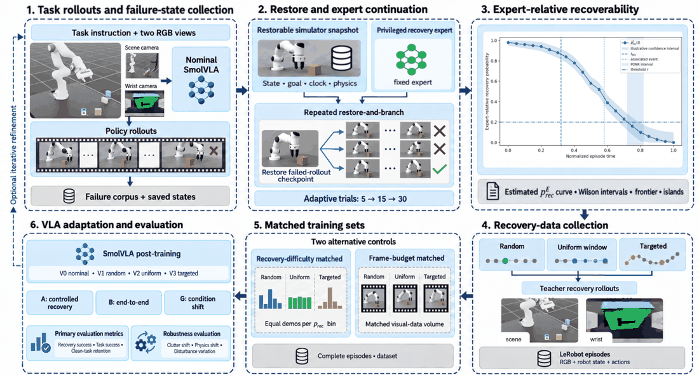
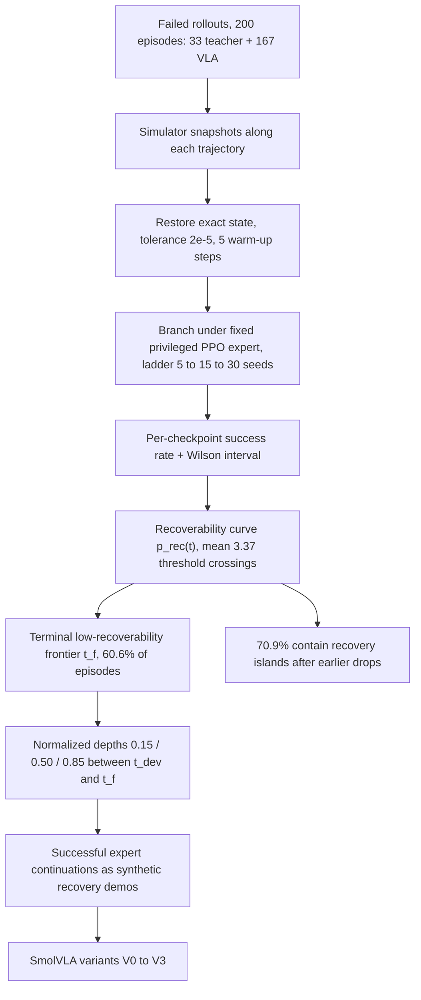

# Kintsugi-VLA: 用干预式可恢复性把失败 Rollout 转成恢复数据

- arXiv: https://arxiv.org/abs/2609.31048
- Source: https://arxiv.org/abs/2609.31048
- Project: 
- Local PDF: `/Users/luogu/physical_intelligence/papers/rl/agentic-robot/KintsugiVLA_2609.31048.pdf`
- Year: 2026
- Category: rl
- Priority: high

（待确认：论文未给出项目页或 GitHub；Skoltech 智能空间机器人实验室，8 页会议短文。）

## 一句话总结

利用仿真器的精确状态恢复与分支能力，对失败轨迹上的每个 checkpoint 反复交给固定特权专家续跑，用自适应蒙特卡洛阶梯（5→15→30 次 + 逐点 Wilson 区间）估计"干预式可恢复性" $p^{E}_{rec}$，定位末段低可恢复性边界（frontier），再在边界前的归一化深度 0.15/0.50/0.85 处采集专家成功续跑作为合成恢复演示；SmolVLA 在难度/帧预算匹配下恢复成功率 34.6%/38.4%，比同窗口均匀采样高 +5.8/+6.7 个点，扰动执行 +3.9 点、条件迁移 +3.8 点，代价是干净任务从 76.8% 掉到 74.7%；同时以 30.6% 更少的演示、33.7% 更少的同步帧达到同等恢复水平。

## 核心技术

*论文 Figure 2（p3）：Fig. 2. Kintsugi-VLA method overview. Saved simulator states are restored and branched und*

1. **专家相对可恢复性**：$p^{E}_{rec}(s_{e,i};c,H,R,\nu)$ = 把仿真器恢复到状态 $s_{e,i}$ 后、固定专家 $\pi^E$ 在预算 $H$ 与协议 $R$ 下完成原任务的概率。刻意强调这是**专家相对**量而非状态的物理内禀属性——教师审计显示三个同水平教师的逐状态排序 Spearman $\rho$ 低至 0.103。
2. **自适应 restore-and-branch 估计（Algorithm 1）**：预算阶梯 5→15→30；Wilson 区间 $[L_i,U_i]$ 相对阈值 $\tau$ 三分（低于/高于/未定），只对含未定失败槽的批次加种子细化；30 次全败时 $U_i\simeq0.1135$，因此该阶梯无法证明 $U_i<0.1$（$\tau=0.1$ 时 frontier 数为 0 是分辨率下限所致，不是真没有）。
3. **稳定边界与曲线结构**：$j^\ast=\min\{j: U_i<\tau,\ \forall i\ge j\}$ 定义观测到的终段低可恢复性后缀；三个互补摘要——阈值穿越次数（均值 3.37 次）、分离上升（$L_{i+1}>U_i$）的非单调标记、recovery islands（先跌破阈值再回到阈值上方的连续区间）。60.6% 的失败 episode 有稳定边界、75.6% 非单调、70.9% 含恢复岛屿——首次穿阈会漏掉后面的可恢复区。
4. **恢复深度与目标采样**：以偏离时刻 $t_{dev}$（离开名义进度走廊或进度平台，取早者）与边界 $t_f$ 归一 $d(t)=(t-t_{dev})/(t_f-t_{dev})$，目标采样深度固定 0.15/0.50/0.85；均匀对照 V2 在同一窗口均匀采样、随机对照 V1 只做合法状态扰动——V2 是"同数据同窗口、只变采样位置"的强对照。
5. **匹配协议**：难度匹配（跨共享可恢复性 bin 等演示数）与帧预算匹配（共同帧限额下按合并难度直方图选完整 episode）分别构成 Protocol A 的两个对照；导出观测 = 场景+腕 RGB、许可状态字段、指令，可恢复性估计与特权观测离线隔离。
6. **数据效率度量**：$R_q=B_{uniform}(q)/B_{targeted}(q)$，$B_v(q)=\inf\{B:S_v(B)\ge q\}$；34% 恢复水平下 $R_q=1.44$（演示轴）、37% 下 1.51（帧轴）。
7. **诊断条件化扩展**：oracle 失败诊断把难度匹配恢复从 34.6% 抬到 37.4%，预测诊断 34.3%——语义诊断是可选增强而非必需。

## 底层原理与数学推导

可恢复性的定义是概率陈述，随机性 $\nu$ 吸收专家随机性与恢复语义：

$$p^{E}_{rec}(s_{e,i};c,H,R,\nu)=\Pr_{\xi\sim\nu}\big[Y(s_{e,i},\pi^{E},c,H,R,\xi)=1\big]$$

逐 checkpoint 用 $x_i/n_i$ 估计 $\hat p_i$，Wilson 区间（$z=1.95996$）：

$$[L_i,U_i]=\frac{\hat p_i+\frac{z^2}{2n_i}\pm z\sqrt{\frac{\hat p_i(1-\hat p_i)}{n_i}+\frac{z^2}{4n_i^2}}}{1+\frac{z^2}{n_i}}$$

相对阈值的三分判定（$U_i<\tau$ 低于 / $L_i\ge\tau$ 高于 / 否则未定）驱动阶梯分配——额外的试验只花在未定的 checkpoint 上，且不预设单调性。终段边界

$$j^\ast=\min\big\{j:\ U_i<\tau\ \text{for every}\ i=j,\dots,m\big\}$$

是观测后缀性质（不是全程推断）；$j^\ast>0$ 时边界被定位在 $(t_{j^\ast-1},t_{j^\ast}]$ 的括号内，历史数据中中位归一化位置 0.856、5/95 分位 0.752/0.960、定位括号 10 个控制步。恢复深度 $d(t)=(t-t_{dev})/(t_f-t_{dev})$ 把"从哪救"变成一维设计变量。效率比

$$R_q=\frac{B_{uniform}(q)}{B_{targeted}(q)},\qquad B_v(q)=\inf\{B:S_v(B)\ge q\}$$

在 34% 恢复水平给出演示轴 $R_q=1.44$、37% 给出帧轴 1.51。论文的统计自省值得记录：Wilson 区间只是逐点操作性摘要，自适应停止后无 95% 保证覆盖、跨 checkpoint 无联立覆盖（时间一致推断需 confidence sequences，引 Howard et al.）；VLA 对比虽每变体至少 3 个训练种子，但**未报告逐种子离散度**，显著性与干净任务非劣性均未确立。

## 物理直觉解释

**金缮（Kintsugi）的隐喻**。日本金缮工艺不掩盖碗上的裂缝，而是用金粉把裂缝填成器物最醒目的纹路——损伤被转化为价值本身。Kintsugi-VLA 对失败 rollout 做同样的事：常规仿真数据管线把失败轨迹当碎瓷片扔掉（只留成功演示），本文却把每条失败轨迹沿着时间轴逐点"镀金"——恢复一次就镀一粒。更妙的是它不镀整条缝：靠近失败终点的状态往往已经病入膏肓（边界之后 $U_i<\tau$，专家也救不回），太早的状态又和正常演示没差别（重复名义行为）；只有 $t_{dev}$ 到 $t_f$ 之间那条窄缝值得填金。V3 相对 V2 的 +5.8/+6.7 个点，就是"金填对了位置"的度量。

**黄金抢救时间窗与回光返照**。急诊医学里心脏骤停有个黄金四分钟：四分钟内除颤大多能救回，之后存活率断崖式下跌——这就是终段低可恢复性边界的物理含义，中位位置在轨迹归一深度的 0.856 处。但失败轨迹不是单调恶化的：75.6% 的轨迹非单调、70.9% 有恢复岛屿，好比病人在重症过程中偶尔血压回升（曲线短暂穿回阈值上方）——只看第一次跌落（首次穿阈）的采集策略会错过这些岛屿。均值 3.37 次阈值穿越意味着一条失败轨迹平均要"病危-缓解"三个来回，恢复数据的正确采集点必须用整条曲线而不是单一拐点来定。

**铅锤测水深，而不是建水流模型**。想知道河哪里能蹚过，有两种做法：建一个水力学模型预测流速深度，或者直接拿铅锤去测。Kintsugi 选择后者——不训练任何"恢复难度预测器"（论文明确承认未与 VLM 失败定位/难度估计器做实验对比，区别是方法论而非实证优劣），而是用仿真器的可逆性特权直接干预式测量：恢复状态、跑专家、数成功。这个特权重到只在仿真里存在——真机上"把世界倒回三秒前重跑五次"不可实现，所以这套方法天然是 sim-数据-生成层的：测得的 $p^{E}_{rec}$ 用来指导生成数据，而部署的 VLA 只见许可的视觉与状态输入，特权观测被挡在导出边界之外。代价是测量本身不便宜：历史测量花了 2,825 次向量化分支、17,779 秒分支时间。

## 工程细节与实操指南

- **任务与教师**：仿真 Franka Panda + 平行夹爪，方块抬起-搬运任务；成功判据 = 方块中心高度 >0.06 m 且距目标 <0.05 m（瞬时判据，不要求释放或成功后保持）；控制周期 0.02 s（50 Hz）。特权教师 = Isaac Lab + rsl_rl 的 PPO、seed 42 检查点，可看 43 维特权仿真观测（对 SmolVLA 永不暴露）；名义评估 7 批×32 环境 = 224 episodes、250 步超时，教师 223/224（99.55%）。
- **下游策略**：SmolVLA；输入两路归一化 224×224 RGB + 指令 + 8 维状态（环境局部末端位置、四元数、上一夹爪动作），7 维动作接口；动作块队列在尝试间重置。训练超参（epoch/学习率等）未披露（待确认）。
- **数据构成**：失败源 200 条（33 教师 + 167 VLA）；历史轨迹研究用其中 127 条，$\tau=0.2$（敏感性 0.1/0.5）；历史测量成本 2,825 次分支、17,779 s，93/100 个保存批次到达 30 试阶段。
- **恢复语义**：恢复 = 恢复机器人+物体状态、目标指令、指令计时器、episode 时钟、先前动作、质量、惯量、材料；浮点恢复容差 $2\times10^{-5}$；保留原仿真槽位（诊断性重打包会改变材料值）；5 步 warm-up（补偿时钟推进）后最多 240 策略步；仅计每槽首个终止事件。
- **Protocol G（条件迁移）**：4 个 clutter 种子 × 2 物理档案（高摩擦：静摩擦 1.25–1.35、动摩擦 1.05–1.15、质量 1.00–1.20；重物：摩擦 0.70–0.90/0.55–0.75、质量 1.55–1.70），目标尺度 1.23；候选池 3,016 状态 ×15 次校准 = 45,240 次尝试；难度 bin 硬 [0.2,0.5) 169 / 中 [0.5,0.8) 198 / 易 [0.8,1] 2,199（<0.2 的 450 个排除在均衡集外）；冻结 90 状态（每 bin 30），评估每状态 5 次、状态选自校准种子之外。
- **评估量**：教师 Protocol G 恢复 310/450（68.89%）、成功尝试平均恢复时间 1.321 s、状态 bootstrap 95% 区间 62.22–75.33%（10,000 次重采样、每状态 5 试整组保留）；泄漏审计：训练/评估标识无重叠，但历史训练记录缺状态 ID/场景参数，无法排除标识之外的泄漏。
- **训练种子**：每变体至少 3 个；逐种子离散度未报告（论文自列局限）。算力总账（restore-and-branch + 训练 + 不成功续跑）未合并报告（待确认）。

## 消融实验与分析

主表：四个策略变体 × 三协议闭环成功率（V0 仅名义数据；V1 随机扰动状态；V2 同窗口均匀采样；V3 目标深度采样）：

| 变体 | A 难度匹配 | A 帧预算匹配 | B 扰动执行 | B 干净执行 | G 条件迁移恢复 |
|---|---|---|---|---|---|
| V0（仅名义） | 12.5 | 12.5 | 55.7 | 76.8 | 9.6 |
| V1（随机扰动） | 25.9 | 28.8 | 58.6 | 75.8 | 22.1 |
| V2（均匀窗口） | 28.8 | 31.7 | 59.5 | 75.8 | 25.0 |
| V3（目标深度） | **34.6** | **38.4** | **63.4** | 74.7 | **28.8** |

**核心结论：**
1. **窗口本身有近一半价值，深度定位有另一半**：V2 对 V0 的增益 +16.3/+19.2（难度/帧匹配），V3 对 V2 再 +5.8/+6.7——知道"从边界前的窗口里采"与知道"在窗口内的哪三个深度采"是两个独立可加的信号源。
2. **顺序跨协议保持**：扰动执行 V2→V3 +3.9 点、条件迁移 +3.8 点，同一排序在外观+物理双重迁移下不翻转；但 V3 的条件迁移恢复 28.8% 仍远低于特权教师同集合的 68.89%（310/450），残差约 40 个点留给视觉策略去追。
3. **干净任务付出代价**：V3 干净执行 74.7% 对 V0 的 76.8%（-2.1 点）、V2 的 75.8%；恢复适应与名义性能存在可测的权衡，且论文明确声明这些聚合差值既不establishing统计显著性、也不establishing干净任务非劣性。
4. **效率以数据轴计**：34% 恢复水平下目标采样省 30.6% 成功演示（$R_q=1.44$）、37% 水平省 33.7% 同步帧（$R_q=1.51$）——但不含测量算力，总成本节约未测。

历史轨迹结构（127 条失败 episode、$\tau=0.2$）：稳定边界 60.6%、非单调 75.6%、恢复岛屿 70.9%（三类重叠）；边界中位归一位置 0.856 [0.752, 0.960]、平均阈值穿越 3.37 次；边界计数在 $\tau=0.1/0.2/0.5$ 下为 0/77/126——$\tau=0.1$ 的 0 由 Wilson 分辨率下限（0/30 时 $U\simeq0.1135$）造成。

教师依赖审计（同 256 个冻结状态、各 5 试）：

| 教师种子 | 名义成功率 | 探针恢复 | 对 42 的 $\rho$ / 二元一致 / MAD |
|---|---|---|---|
| 42（主教师） | 200/200 | 630/1280（49.2%） | — |
| 1234 | 201/201 | 701/1280（54.8%） | 0.693 / 0.863 / 0.205 |
| 2026 | 201/201 | 689/1280（53.8%） | 0.210 / 0.789 / 0.366 |

名义能力几乎相同的教师，逐状态恢复排序相关可以低到 0.103（1234 对 2026），平均绝对概率差最大 0.388——粗阈值一致（约 0.79–0.86）掩盖了排序的大分歧，证实 $p^{E}_{rec}$ 是教师相对信号。Protocol G 教师分层恢复：硬 40.0%（60/150）、中 68.67%（103/150）、易 98.0%（147/150），bin 排序在独立评估续跑下保持。诊断扩展：oracle 诊断 37.4%（+2.8 对 V3）、预测诊断 34.3%（-0.3）。

## 技术权衡（Trade-off）

| 优势 | 劣势 |
|---|---|
| 失败 rollout 从丢弃品变成结构化数据源；恢复增益跨四种协议方向一致（+5.8/+6.7/+3.9/+3.8） | 单一仿真任务、单一目标族与尺度；任务/具身/教师训练法的外推均未建立 |
| 干预式测量直接给出状态级概率估计，绕开失败难度建模器的归纳偏置 | 测量成本不小（历史测量 2,825 次分支、17,779 s）且未计入效率结论；restore-and-branch 特权只在仿真存在 |
| Wilson 区间 + 自适应阶梯把测量预算集中在未定 checkpoint 上 | 逐点区间无自适应停止后覆盖保证、无跨 checkpoint 联立覆盖；$\tau=0.1$ 以下分辨率不可达 |
| 特权信息严格隔离：导出只含许可视觉/状态，43 维特权观测与可恢复性标签离线 | 可恢复性教师相对（$\rho$ 低至 0.103）：换专家可能改变 bin、选点与演示本身，跨专家稳健性未测 |
| 数据效率可量化（省 30.6% 演示 / 33.7% 帧） | 干净任务 -2.1 点的权衡未做显著性或非劣性检验；VLA 对比无逐种子离散度 |
| 目标深度只有 3 个固定值，实现与复现简单 | 选择器未用局部概率值与恢复岛屿信息（论文自列开放问题）；岛屿感知选点可能还有增量 |

## 技术价值与演进定位

这篇论文的位置在"恢复数据从哪来"这条链的上游：IntervenGen 用人机干预生成纠正数据、RaC 采集恢复-修正轨迹、RACER/B2FF/CoRe/FLARE 在推理时做检测与纠正，Kintsugi 把问题提前到采集前的状态选择，并给出一个可操作的判据——不是"失败终点"（常已经不可救），不是"任意扰动状态"（V1 对照），而是可恢复性曲线窗口内的目标深度。方法学上它示范了仿真器的一个未被充分开发的用法：不只生成成功演示（MimicGen/RoboCasa 一系），而是做干预式反事实实验（"如果从这里重来会怎样"）。诚实的统计自省（Wilson 覆盖、教师相对性、无显著性主张）在同类论文中少见。局限是验证域极窄（一个 Franka 抓放任务）与恢复增益的绝对量级有限（28.8% 对教师 68.89%），作为方法论提案的价值大于作为即插即用配方的价值。

## 与其他论文的关系

1. `notes/rl/vla/rove.md` — ROVE（小鹏）从真机不完美人类干预数据中用乐观价值估计抽高价值行为做人形 VLA 迭代 RL；Kintsugi 用仿真特权专家替代人类干预（零人工成本、可重复测量），两者的共同洞察是"干预/失败数据的价值需要被显式度量后再用"，分歧在干预者是真人还是可分支的仿真器。
2. `notes/rl/agentic-robot/enpire.md` — ENPIRE 在真实世界闭环收集失败经验做策略自改进；Kintsugi 与之互补：真机采集不可逆（一条失败轨迹只能续不能重来），仿真 restore-and-branch 可对同一状态重跑 30 次——$p^{E}_{rec}$ 的估计精度本质上是不可逆性的对偶。
3. `notes/rl/dexterous/facet0.md` — Facet-0 的恢复率 44%→81% 依赖"恢复帧保留正 credit"（regime 内排序保护稀缺恢复帧）；Kintsugi 显式构造恢复训练数据，把"恢复是稀缺高价值数据类别"从 RL 训练技巧升级为数据生成原则——两文可串联：Kintsugi 式选点生成数据，Facet-0 式 credit 保护其训练效果。
4. `notes/rl/dexterous/torl-vla.md` — TORL-VLA 的 intervention-censored critic 处理"干预后的成功不能归功于策略"；Kintsugi 的失败源语料（33 教师 + 167 VLA）同样混合了专家与策略轨迹，但用恢复语义而非归因删失来组织这些数据。
5. `notes/rl/vla/simplevla-rl.md` — SimpleVLA-RL 在仿真里用 RL 训练 VLA 再迁移；Kintsugi 不训 RL，只用仿真特权专家做测量与演示生成——是仿真 RL 路线的"数据层替身"，可与 RL 精调叠加。
6. `notes/rl/core/rl-100.md` — RL-100 的 IL→离线 RL→在线 RL 链条里，离线数据质量决定在线 RL 起跳点；Kintsugi 的窗口-深度选点正是离线侧的显式优化（+5.8/+6.7 点的数据侧收益，零算法改动）。
7. `notes/rl/agentic-robot/harbor.md` — HARBOR 把 RL 工程的周边任务 harness 化；Kintsugi 相当于给"恢复数据生成"这个特定周边任务提供了可复用的测量协议（阶梯预算 + Wilson 判定 + 边界定位），可作为 harness 里的一个标准命令实现。

## 精读问题

1. 恢复岛屿（70.9% 的轨迹含有）目前只被分析未被利用——岛屿感知的采样（如在岛屿质心深度加一个采样点）相对固定 0.15/0.50/0.85 能再拿多少个点，会不会挤压掉干净任务性能？
2. 教师相对性（$\rho$ 低至 0.103）暗示换专家会换选点——用三教师集成的多数投票边界做选点，VLA 恢复增益会更稳还是平均更低？
3. 240 策略步恢复预算与 $H$（续跑预算）的耦合有多大——把预算砍半，frontier 位置（中位 0.856）会不会显著前移，从而改变最优采样深度？
4. 干净任务 -2.1 点的权衡能否用课程（先恢复数据后名义数据回灌）或按 bin 加权消除——干净执行损失与恢复 bin 的演示占比之间有没有单调关系？
5. 干预式测量与 VLM 难度估计器的正面对比缺失：训一个以视觉+状态预测 $p^{E}_{rec}$ 的代理，其选点质量比直接测量差多少、省多少仿真算力——能否找到"测量预算 vs 代理保真度"的帕累托前沿？
6. 目标族与尺度固定（尺度 1.23）时 bins 的分层保持 40.0/68.67/98.0%——把尺度/摩擦再外推一档，bin 排序会不会坍塌，均衡评估集是否需要在线重校准？
7. SmolVLA 的 28.8% 对教师 68.89% 的 40 点残差里，多少来自视觉观测信息不足、多少来自模仿学习对恢复行为的欠拟合——在硬 bin 上做错误类型分解能否定位主因？
