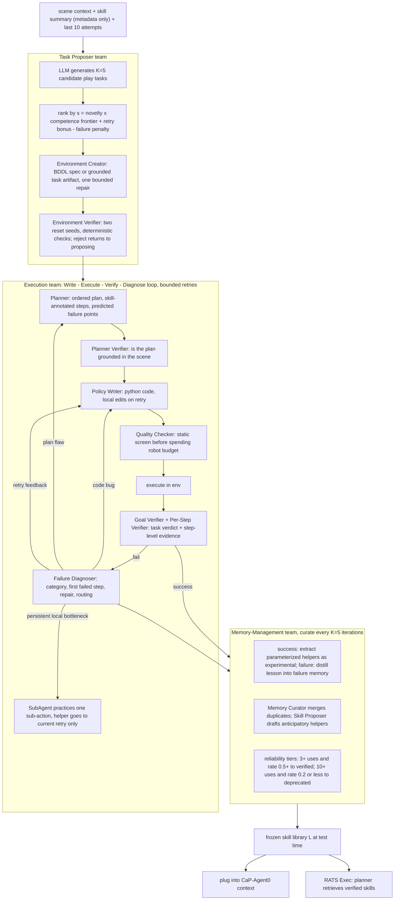

# Playful Agentic Robot Learning

- arXiv: https://arxiv.org/abs/2606.19419
- Source: https://arxiv.org/abs/2606.19419
- Project: 
- Local PDF: `papers/rl/agentic-robot/PlayfulAgentic_2606.19419.pdf`
- Year: 2026
- Category: rl
- Priority: high

## 一句话总结

UC Berkeley + Impossible Research 的 RATS（Robotics Agent Teams）把「游戏时间」变成一个显式的技能习得阶段：机器人团队在收到任何外部任务之前，自主提出「新颖但可学」的练习目标（Goldilocks 打分：object-skill 新颖度 × 竞争力边界），用 Code-as-Policy 团队以 Write-Execute-Verify-Diagnose 循环练习，把成功行为蒸馏进冻结的代码技能库、把失败蒸馏进错题本；测试时检索复用——LIBERO-PRO 上把 CaP-Agent0 从 23.2% 提到 43.8%（+20.6 pp），MolmoSpaces 从 21.0% 提到 38.0%（+17.0 pp），技能库可即插即用地跨环境迁移到 RoboSuite（+8.9 pp）和真机（+8.8 pp），且 compute-matched 对照证明增益来自「预先练习」而不是测试时多花推理预算。

## 核心技术

1. **Play-time 形式化（Sec 3.1）**：标准 Code-as-Policy 中 agent 由 $(c, f, l)$（环境上下文、原语函数、语言指令）合成程序 $\pi$；RATS 把外部指令 $l$ 整个拿掉，让 agent 在 play 环境 $E_{play}$ 里自提自练任务 $\tau_t$。技能库 $\mathcal{L} = \mathcal{L}_0 \cup \mathcal{L}_{learned}$（$\mathcal{L}_0$ 为初始原语），另有失败记忆 $\mathcal{M}$ 存压缩教训。优化目标是：$N$ 轮 play 之后，冻结的 $\mathcal{L}$ 在未见测试任务上优于只用 $\mathcal{L}_0$。
2. **Task Proposer 团队（两段式）**：LLM 以场景上下文 $c_t$、技能库摘要（只给名字/描述/可靠度/成功率元数据，不给源码）与近 10 条任务历史为条件，被显式要求「exploratory」（prompt 里的人设是 3-4 岁小孩：看见一个物体、做一件简单的事），生成候选池 $T_t$；再用 Goldilocks 打分选出 $\tau_t$（见数学节）。之后 Environment Creator 把提案编译成可执行任务实例（LIBERO 里生成 BDDL 规范并做语法/语义校验 + 一次有界修复），Environment Verifier 在两个 reset seed 上做确定性检查（实例化、渲染、目标谓词可求值、无严重初始穿透），不合格任务退回提案阶段、不消耗执行预算。
3. **Execution 团队（Write-Execute-Verify-Diagnose 循环）**：Planner 产出带技能标注的分步计划并预测失败点 → Planner Verifier 检查计划的物理落地性 → Policy Writer 写 Python 控制代码（retry 时只做局部修改，保留已工作的代码段）→ Quality Checker 静态筛查（语法错误、不可用 API、无界循环、危险模式），避免把机器人交互预算浪费在源码层面就能发现的错误 → 执行后 Goal Verifier（有结构化谓词用环境状态判，否则视觉判；**策略 crash 一律算失败**，哪怕最终视觉状态看起来对）与 Per-Step Verifier（逐步 pass/fail，能区分「抓取失败」和「抓成功但放错」）给出定位证据 → Failure Diagnoser 输出失败类别、首个失败步骤、具体修复建议与路由标志（代码级错误回 Policy Writer、计划级错误触发重规划、持续性局部物理瓶颈派 SubAgent 单独练该子动作——SubAgent 的成果只注入当前 retry 上下文，不自动进持久库，防止过拟合的局部补丁污染库）。
4. **Memory-Management 团队**：成功时从执行代码里抽取自包含、参数化的 helper（捕获可复用行为单元而非整个任务脚本），校验后以 experimental 身份入库；失败时把 episode 记入 $\mathcal{M}$ 并蒸馏成「出现某条件→避免某做法→改用某修正」的紧凑教训。每 $K=5$ 轮 play 做一次维护：Memory Curator 合并/重写近似重复技能与冗余教训；Skill Proposer 在重复失败暴露能力缺口时**前瞻性地**从原语草拟 helper——与「从已成功代码抽取」不同，它先入库后靠实际使用挣可靠度。
5. **技能可靠度生命周期（三档）**：experimental 起步；至少 3 次使用且经验成功率 $\ge 0.5$ 升为 verified；至少 10 次使用且成功率 $\le 0.2$ 标记 deprecated 并在检索中隐藏。检索按 Wilson 下界排序、verified 优先。
6. **测试时的两种用法**：(a) Plug-and-Play——冻结库直接插进标准单 agent 基线 CaP-Agent0 的 API 上下文与执行命名空间，不带 RATS 的重试/诊断回路，单独度量技能库本身的迁移价值；(b) RATS Exec——完整团队带着库上考場，Planner 优先检索 verified 技能。两种模式下 Task Proposer 与 Memory Curator 全部关闭。

## 底层原理与数学推导

**(1) Goldilocks 任务选择目标**。对每个候选任务 $\tau$，最大化解析分数（论文 Sec 3.2 / A.1.1）：

$$s(\tau) = N(\tau)\,F(\tau) + w_B\,B_{retry}(\tau) - w_P\,P_{fail}(\tau)$$

其中 $B_{retry}$ 是 retry bank 里可简化变体的衰减奖励，$P_{fail}$ 惩罚与近期失败高度相似的任务。两项主因子：

**(2) Object-Skill Novelty**——用历史尝试计数压低被练烂的组合：

$$N(\tau) = \frac{1}{|O(\tau)\times S(\tau)|}\sum_{(o,s)} \frac{1}{\sqrt{N(o,s)+1}}$$

$O(\tau)$、$S(\tau)$ 是任务涉及的物体与所需技能，$N(o,s)$ 是该组合的历史尝试次数。新组合的 $N(\tau)=1.0$（附录 trace 里 5 个候选全是新组合，因此 $N$ 项不构成区分度，决定权落在 $F$ 上）。

**(3) Competence Frontier**——在「太简单」与「不可能」之间取峰值：

$$F(\tau) = 4\,\bar{r}(\tau)\,\big(1-\bar{r}(\tau)\big), \qquad \bar{r}(\tau) = \frac{1}{|S(\tau)|}\sum_{s} \hat{r}(s)$$

$\hat{r}(s)$ 是技能 $s$ 的 Wilson 下界成功率。$F$ 在 $\bar{r}=0.5$ 处取最大值 $1$，$\bar{r}\to 1$（熟练）与 $\bar{r}\to 0$（无望）都趋零——这正是「跳一跳够得着」的可优化形式。关键细节是用 **Wilson 下界而非原始成功率**：一个只用过 1 次就成功的技能不应被当作可靠。论文未写 Wilson 公式，按标准 Wilson score 区间下界整理（$n$ 为使用次数，$\hat{p}$ 为经验成功率，$z$ 为置信分位数）：

$$\hat{r}(s) = \frac{\hat{p} + \frac{z^2}{2n} - z\sqrt{\frac{\hat{p}(1-\hat{p})}{n} + \frac{z^2}{4n^2}}}{1 + \frac{z^2}{n}}$$

**(4) 算例核对（附录 A.1.1 的 MolmoSpaces 第 15 轮 trace，可完整复算）**：library 中无 place_in 族 helper 时取缺省 $\bar{r}=0.05$，得 $F = 4\times 0.05 \times 0.95 = 0.19$；抽屉开合有 close_gripper / push_object_closed 支撑，$\bar{r}=0.9$，$F = 4\times 0.9 \times 0.1 = 0.36$；纸巾盒提升匹配 execute_top_down_grasp_and_lift（12 次用 5 次成功，raw $0.4167$，Wilson 下界 $\bar{r}=0.1933$），$F = 4\times 0.1933 \times 0.8067 = 0.6236$——最高分，被选中。注意提升任务 raw 率 $0.4167$ 高于缺省 $0.05$，但 Wilson 下界惩罚小样本后其 $F$ 反而最大：**打分器奖励的是「证据充分的半熟」而不是「碰巧成功过」**。

**(5) 知识的两条持久化通路**。技能库存储为可执行 Python 源码 + 前置条件/预期效果/依赖/出处/使用与成功计数 + 可靠度档位，插入前静态校验（定义了可调用函数、只用可用原语或已知依赖、不与现有技能重复），并提供两套视图：给 Task Proposer 的 metadata-only 视图（省上下文）与给 Planner/Writer 的 code-bearing 视图。失败记忆则把 episode（任务、物体、失败类别、失败步骤、诊断、已试方案、代码片段）蒸馏成可检索的教训，Planner 按任务与物体重叠检索——**等价于把稀疏的「任务成败」信号分解成 step 级诊断 + 语言化教训，这是没有梯度也能积累知识的替代通路**。

## 物理直觉解释

**第一段｜幼儿园不是预训练，是课程自选器**。小孩在被大人布置作业之前就已经会开门、抽屉、堆杯子——因为玩的过程天然在做**课程选择**：太熟的把戏不好玩，完全够不着的直接放弃，最迷人的是「差一点就会」的那些。RATS 的 $F(\tau)=4\bar r(1-\bar r)$ 就是把这个直觉写成了可以 argmax 的函数：它在 $\bar r=0.5$ 处最高，把「trivial」和「impossible」同时压到零分。而 Wilson 下界的引入相当于**不让小孩因为一次蒙对就认定自己会了**——纸巾盒提升任务 raw 成功率 0.4167，经下界校正掉到 0.1933，反而成为全场最值得练的目标。没有这一步，自选课程会退化成反复刷简单任务刷出漂亮数字。

**第二段｜错题本是这个系统里唯一免费的老师**。任务级成败信号太稀疏：一次失败无法回答「哪一步坏了、什么能留、什么该存」。RATS 用三层验证把一次失败拆解成可用信息——Per-Step Verifier 告诉你**哪个环节**坏了（抓取失败 vs 抓到了放错），Failure Diagnoser 告诉你**为什么**坏（0.025 m 的抓取 z_offset 让手指停在细管上方，建议改 0.0 或 −0.01 m），Memory 团队把它蒸馏成教训存进错题本。这就像**学生把一张考卷从「62 分」还原成「第 3 题第二步符号错了」**：下次考试前只需要翻错题本，不需要重考整张卷子。论文的 token 账单从反面印证了这套机制的代价——诊断与重写占了 play 阶段近七成开销，正是「从失败中榨信息」的价格。

**第三段｜技能库的转正制度**。入库的 helper 都从 experimental 干起，用满 3 次且成功率过半才转 verified、排到检索队列前排；用满 10 次还只有两成成功率就被 hide。**这相当于公司里的试用期制度**：一个从失败里由 Skill Proposer 前瞻性草拟出来的函数（比如 adjust_grasp_to_centroid），要靠后来真实调用中的表现挣编制，而不是靠提案时的说辞。这个设计直接回应了 Limitations 里承认的风险——「不当的技能复用会伤害下游表现」：RoboSuite 的 two-arm handover 就在插入技能后从 24.0% 掉到 20.0%，说明检索端仍需要更强的任务匹配判断。

**第四段｜先练后考，而不是考场上多给草稿纸**。附录 E.2 的 compute-matched 对照是这个系统最硬的辩护：50 轮 play 花掉约 30M token，摊到 60 个 LIBERO-PRO 任务上等于给基线每任务加约 0.5M token——正好够 CaP-Agent0 把 10 轮重试加到 15 轮。结果多给 50% 推理预算只把基线从 23.2% 抬到 26.0%，而把同样的预算花在 play 上再冻结成技能库，同样的 10 轮系统做到 32.3%。**这解释了 play 与 test-time scaling 的本质区别：考场上多要草稿纸只能把同一道题多算几遍，而提前刷过的题会变成考场上的「已知识忆」**。技能被检索进上下文的瞬间，policy writer 不再从像素和几何重新推导抓取位姿——391/400 的评测 trial 至少调了一个 play 学到的技能，就是这个机制在跑。

## 工程细节与实操指南

- **Play 配置**：LIBERO-PRO 与 MolmoSpaces 各玩 50 轮，模型 gemini-3.1pro-preview；附录 token 分析统一用 gpt-5.5。每次迭代最多 5 次尝试（retry budget）。50 轮 MolmoSpaces 产出 49 条保存的提案记录（1 轮因错误未存），分布为 pull 15 / lift 14 / open 8 / close 5 / push 3 / place on surface 2 / pick 2，覆盖 7 个交互族、30+ 物品类别。
- **库与记忆的增长（10 轮快照）**：学到的 helper 从第 10 轮的 6 个涨到第 50 轮的 27 个；失败记忆从 14 episodes / 8 lessons 涨到 70 episodes / 121 lessons。评测时 27 个 learned skills 中 14 个被实际调用，400 个 trial 里 391 个至少调用一个 learned skill，共 5,169 次调用；单技能最高频是 localize_and_verify_object_point_cloud（1,873 次），定位类合计 2,806 次。
- **评测协议**：LIBERO-PRO 60 个 held-out 任务（Object/Goal/Spatial × Pos/Task 各 10 个），每任务 10 个初始状态 = 600 rollouts（全量 50 初态/任务是 3,000，报告时截断且两方法同预算）；MolmoSpaces 取 40 个 test episodes（Open-v1 / Close-v1 / Pick-v2-classic / PnP-v2 各 10，跨 37 个房子）× 10 trials = 400 rollouts，成功由模拟器 judge_success() 谓词判定。RoboSuite 每任务 5 randomizations × 10 trials = 50；真机每任务 40 trials。
- **环境合成**：LIBERO 侧生成 BDDL 规范（language/objects/init/goal 四段），静态检查要求所有引用的 objects、fixtures、regions、predicates、assets 与提案匹配，失败允许一次有界修复后重验；MolmoSpaces 侧任务创建受 bridge catalog 约束，rebind 后验证目标仍可视落地。物体清单先做可达性过滤（MolmoSpaces trace 里可见但不可达的 toilet 被滤掉），防止 proposer 选到元数据里有、状态里够不着的物体。
- **Prompt 工程**：Task Proposer 的人设是 3-4 岁儿童（一次只做一件单步小事），输入含技能库摘要、任务历史（success 标志、retry 数、failure_reason 如 grasp_failure / collision / code_bug 及参数级修正建议）、已知环境限制清单（命中即浪费一整轮的必坑项）与 curriculum_hint；并被要求与前 10 次尝试变化、避免动宾完全重复、从成功做单变量扩展、失败后简化或换向。
- **失败也要归档**：失败 trace 会产出实验性 helper——第 2 轮开抽屉失败产出「轴向拉方向估计 + 抓取选择」两个 helper；第 15 轮纸巾盒失败提议「抓点向质心调整」；后续平刀与烤箱抽屉失败分别提议 top-down 对齐抓取与接近轴过滤。鞋滑（slide）在第 25 轮练成后，第 30 轮复用同一 helper 一次成功滑走蓝牙音箱——「练一个、白拿一个」的正向循环。
- **技能注入方式**：执行期由 runtime 把选中技能的定义与依赖注入 policy 命名空间（保留依赖兜底）；大库时可用轻量 selector 先取任务相关子集再拼 prompt。附录 E.3/E.4 给了 MolmoSpaces（27 个中选 3）与 LIBERO（47 个中选 3）的完整技能源码。

## 消融实验与分析

**(1) LIBERO-PRO 上「玩策略 × 测试系统」双因子消融（Table 4，全部 play 变体 50 轮；RATS Exec 行为每任务 5 trials）**：

| 测试系统 | Play 策略 | Object Pos | Object Task | Goal Pos | Goal Task | Spatial Pos | Spatial Task | Avg |
|----------|-----------|-----------|-------------|----------|-----------|-------------|--------------|-----|
| CaP-Agent0 | No Play | 27.0 | 31.0 | 29.0 | 16.0 | 13.0 | 23.0 | 23.2 |
| CaP-Agent0 | Random Play | 20.0 | 28.0 | 32.0 | 16.0 | 20.0 | 32.0 | 24.7 |
| CaP-Agent0 | Curious Play | 51.0 | 47.0 | 34.0 | 20.0 | 19.0 | 23.0 | 32.3 |
| RATS Exec. | No Play | 54.0 | 58.0 | 32.0 | 24.0 | 20.0 | 30.0 | 36.3 |
| RATS Exec. | Random Play | 54.0 | 46.0 | 34.0 | 44.0 | 24.0 | 28.0 | 38.3 |
| RATS Exec. | Curious Play | 60.0 | 60.0 | 48.0 | 38.0 | 30.0 | 30.0 | 44.3 |

**核心结论：** 好奇心是 play 有效的前提——同样 50 轮预算，随机玩在 CaP-Agent0 上只带来 23.2%→24.7% 的噪声级变化（Object Pos 甚至从 27.0 掉到 20.0），Curious Play 才拉到 32.3%；而 play 与执行系统近似可加：只改执行 23.2%→36.3%，只改 play→32.3%，两者叠加 44.3%，没有出现替代效应。

**(2) MolmoSpaces 上的同构消融（Table 12）**：

| 测试系统 | Play 策略 | Open | Close | Pick | Pick-and-Place | Avg |
|----------|-----------|------|-------|------|----------------|-----|
| CaP-Agent0 | No Play | 14.0 | 36.0 | 23.0 | 11.0 | 21.0 |
| CaP-Agent0 | Curious Play | 17.0 | 62.0 | 14.0 | 10.0 | 25.8 |
| RATS Exec. | No Play | 11.0 | 65.0 | 45.0 | 10.0 | 32.8 |
| RATS Exec. | Curious Play | 20.0 | 73.0 | 37.0 | 22.0 | 38.0 |

**核心结论：** 增益高度不均匀——Curious Play + CaP-Agent0 的收益几乎全部来自 Close（36.0→62.0），Pick 反而从 23.0 掉到 14.0，说明技能库的迁移价值取决于库内已有技能与目标任务族的覆盖关系，不是均匀加成。

**(3) Compute-matched 对照（Table 14，排除「多花推理钱」解释）**：

| 方法 | Object Pos | Goal Pos | Spatial Pos | Avg |
|------|-----------|----------|-------------|-----|
| CaP-Agent0（10 turns） | 27.0 | 29.0 | 13.0 | 23.2 |
| CaP-Agent0（15 turns，compute-matched） | 28.0 | 30.0 | 22.0 | 26.0 |
| CaP-Agent0（10 turns）+ RATS play 技能 | 51.0 | 34.0 | 19.0 | 32.3 |

**核心结论：** 把 play 的约 30M token 折成基线的 15 轮重试预算只换来 +2.8 pp（23.2%→26.0%），同样预算先玩后冻结成技能库换来 +9.1 pp（→32.3%）——增益来自「计算被蒸馏成了可复用抽象」，不是推理时堆预算。同节的组件账单显示 play 开销高度集中：Failure Diagnoser 40.5% + Policy Writer 28.8% + Failure Memory Distillation 19.4% ≈ 88.7%（10 轮合计 5,121,182 token），而 Task Proposer 只占 1.9%——「提任务便宜，从失败里学东西贵」。

## 技术权衡（Trade-off）

| 优势 | 劣势与工程代价 |
|------|---------------|
| 技能以可读可审计的 Python 代码存在，能即插即用进任何 Code-as-Policy 上下文，不动底座模型权重 | 库受限于原语级控制 API，论文自述这限制了灵巧操作的上限；技能粒度由 $\mathcal{L}_0$ 决定 |
| 测试时库被冻结，无持续学习带来的灾难性遗忘问题 | 冻结也意味着 play 之后的错误无法被纠正；two-arm handover 插入技能后 24.0%→20.0%，错误复用会反噬 |
| 失败被系统性转化为教训与前瞻性 helper，未成功轨迹也有监督价值 | 代价集中在诊断侧：Diagnoser + Writer + 蒸馏占 play token 的约 88.7%，每 10 轮 5.12M token |
| Curious Play 让 50 轮预算指向「半熟」目标，同样的轮数比随机玩多 +7.6 pp（CaP-Agent0 口径） | 依赖 VLM 验证器做 goal/step 判定，验证偏差会直接写进库；依赖大量 LLM 调用导致推理成本上升 |
| 跨环境与跨具身迁移有实证：单臂 LIBERO 技能让双臂 two-arm lifting +24.0 pp，真机 +8.8 pp 且零微调 | 主要证据仍在仿真；真机验证是 2 组任务（LIBERO 库）+2 组（Molmo 库）的小规模初步实验 |
| Goldilocks 打分是解析式，无需训练好奇心模型，可解释可复算（附录 trace 可逐步验算） | 打分只覆盖 object-skill 组合的新颖度与技能成功率，不建模动力学价值；环境无法支持的任务（如 unsupported 物体族）只能被 veto 而非学习到 |

## 技术价值与演进定位

RATS 的价值在于把内在动机这条老线（Oudeyer 的 IAC、goal babbling、learning progress）翻译成了 Code-as-Policy 时代的可执行系统：早期发展机器人必须在固定的感觉运动/目标/特征空间里手工设计好奇心信号，而现在 LLM 能用语言表达探索目标、用程序执行、用代码存储成果——**课程本身成了自主发现的对象**，而不再假设存在预定义的任务族、奖励函数或经验流。它填补的具体空位是：当前 agentic 机器人系统几乎全是 task-driven 的，技能只是解题的副产品在事后沉淀；RATS 把「机器人该练什么」变成一个独立于「解这道题」的前置问题，并给出 play-time → 冻结库 → test-time 检索的完整管线。在自改进谱系上，它与 RoboCat 的经验积累方向一致但介质不同（数据集 vs 代码库），与 ENPIRE 的真机闭环互为时间维度上的互补（先练 vs 边做边改），与 Voyager 的差距在于把「免费试错的 Minecraft」换成了物理约束的仿真并正面回答了「技能能否跨环境、跨具身、上真机」。对本研究库的意义：它给 rl/ 赛道的 agentic 闭环线补上了「任务到来之前」这一段，也给了 data/ 赛道的自改进循环一个非数据侧的实现样本；其 compute-matched 消融方法（把前置计算折算成基线的测试预算）值得作为评测范式记住。局限同样清晰：仿真为主、VLM 验证依赖、原语级 API 天花板、以及技能检索缺乏任务匹配判断——这四点恰好是后续工作的四个可下钻方向。

## 与其他论文的关系

- **ENPIRE（notes/rl/enpire.md）**：同一波 agentic 自改进浪潮里的孪生问题——ENPIRE 在真机上「边执行边改配方」，闭环变量是训练算法；RATS 在仿真里「任务到来之前先练」，产出是冻结代码技能库。两者的共同点是把「机器人该试什么」交给 agent 自己打分：ENPIRE 用真机成功率 hill-climb，RATS 用 Goldilocks 目标选练习题。
- **CaP-X（Fu et al. 2026，CaP-Agent0 即其单 agent 基线）**：RATS 的对照组与底盘——全部增益都相对 CaP-Agent0 度量，plug-and-play 模式就是把 RATS 技能库插进 CaP-Agent0 的 API 上下文；作者群高度重叠（Berkeley/NVIDIA 系），构成「单任务 coding agent」→「play-time 技能积累」的递进。
- **Voyager（Wang et al. 2023）**：技能库 + 自动课程 + 自校验的模板来源，但 Minecraft 的 rollout 免费且可无限重试；RATS 的贡献是在物理仿真里保留了这套机制，并证明库能跨仿真器（LIBERO→RoboSuite）与上真机。
- **RoboCat（notes/data/robocat.md）**：同为自改进一般主义 agent，RoboCat 把经验存进权重与数据（每加一个任务微调一次、能力随数据增长），RATS 把经验存进可检索的代码——两种介质分别对应「能力内化」与「能力外挂」，可对照理解 continual learning 的两条路线。
- **HumanVid self-improve（notes/rl/humanvid-selfimprove.md）**：同目标（不靠人工示教扩大经验）不同来源——它从人类视频学动力学模型来生成经验，RATS 让 agent 自己在仿真里玩出经验；两者都在回答「没有更多遥操数据时，练习材料从哪来」。
- **DIAYN / diversity-is-all-you-need（notes/rl/diayn.md、notes/architecture/diversity-is-all-you-need.md）**：经典无监督技能发现的潜空间版本——技能是 latent variable、判别器提供内在奖励、技能不可读；RATS 的技能是带 docstring 与前置条件的命名函数，内在奖励换成了 Goldilocks 解析分，可视为「技能发现」从 latent 空间到语言/代码空间的迁移。
- **CoSkill（notes/rl/coskill.md）**：同样做分层技能演化（推理 agent + 元技能 agent 联合 RL），但通过梯度训练技能策略；RATS 完全无梯度，技能增长靠验证-诊断-蒸馏循环，两者对「技能库如何长大」给出了学习式与构造式两个答案。
- **agentic-robotics-loop（notes/rl/agentic-robotics-loop.md）与 HARBOR（notes/rl/harbor.md）**：agentic 闭环线的另外两个实现——前者关注把人移出策略改进循环，后者是 agentic robot RL 的 harness 框架；RATS 补的是这条线的时间轴上游（任务之前），并共享同一套「写-执行-验证-诊断」的循环骨架。

## 精读问题

1. 失败记忆的教训以「条件→避免→修正」的自然语言形式检索，检索键是任务与物体重叠——当 play 阶段没见过测试任务的物体类别时（MolmoSpaces 到 RoboSuite、到真机），教训通路是否完全失效？Table 3 里 two-arm handover 的 −4.0 pp 回退是否正是「只有技能、没有教训匹配」时的过拟合复用？
2. Goldilocks 的 $F(\tau)$ 用技能级 Wilson 下界的平均值作为 $\bar r$，一个需要 1 个熟练技能 + 3 个生疏技能的任务与需要 4 个中等技能的任务得分可能相同——这种平均是否系统性低估了「组合型」任务（如 pick-and-place 需要 14.5 次调用/ trial 的长链），从而解释 Pick-and-Place 在消融里收益最弱（11.0→22.0）？
3. compute-matched 对照把 play 的 30M token 摊到 60 个任务上，但如果目标任务数是 600 或 6 个，摊销后的结论会反转吗？换句话说，play 的价值是否存在「任务数最小规模」的盈亏平衡点，论文没有讨论库复用的规模效应。
4. 技能可靠度阈值（3 次/0.5 升 verified，10 次/0.2 降 deprecated）是如何选定的？在 50 轮 play 的预算下，一个技能平均只有约 1–2 次被调用的机会（27 个技能共 5,169 次评测调用，但 play 期内调用更稀疏）——这套阈值在更长或更短的 play 预算下是否仍然成立？
5. Per-Step Verifier 依赖 VLM 对前后视觉证据给出 step 级判定，Goal Verifier 在无结构化谓词时也退回视觉判断——论文报告了技能调用统计，但没有报告验证器自身的错误率；如果 VLM 把一次失败的抓取判成成功，会被蒸馏进库里污染后续所有检索，这个错误如何被系统性检测？
