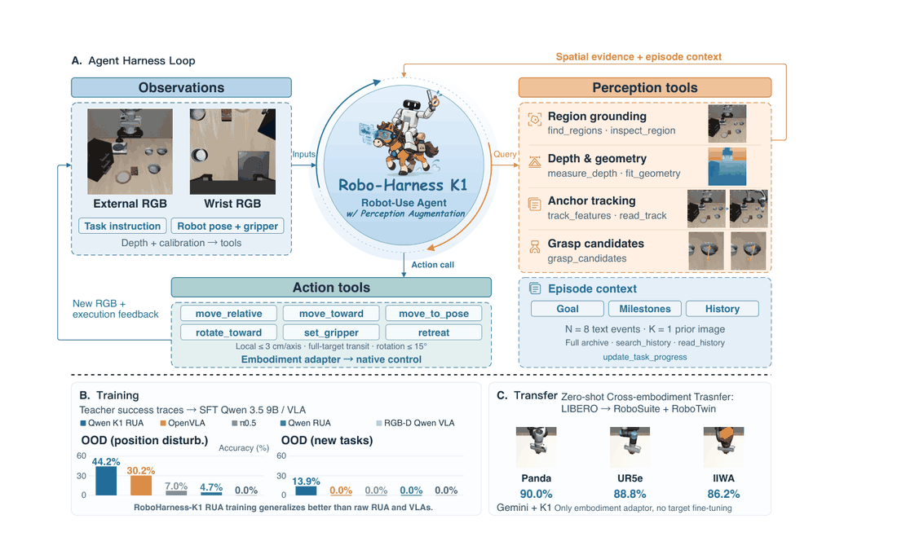
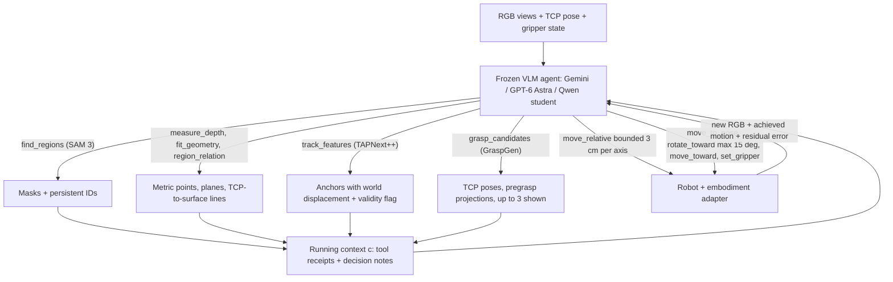

# Robo-Harness K1: 用感知工具增强 Robot-Use Agent

- arXiv: https://arxiv.org/abs/2609.29389
- Source: https://arxiv.org/abs/2609.29389
- Project:
- 本地 PDF：`/Users/luogu/physical_intelligence/papers/rl/agentic-robot/RoboHarnessK1_2609.29389.pdf`
- Year: 2026
- Category: rl
- Priority: high

（待确认：论文首页有 Project Page 与 GitHub 按钮，但 PDF 文本提取未包含具体 URL，Project 字段暂留空。）

## 一句话总结

不给 VLM 加动作头、也不重训深度编码器，而是把"标定深度反投影、持久视觉锚点、投影到 RGB 的抓取假设"做成 VLM 可调用的工具（SAM 3 分区 + TAPNext++ 点跟踪 + GraspGen 抓取提案），让冻结的 Gemini 3.7 Flash 在 LIBERO-PRO 匹配子集上拿到 77.8%、超过 RGB-only GPT-6 Astra 的 61.1%，并把 Astra 本身抬升 27.8 个点到 88.9%；零样本迁移到三种 RoboSuite 机械臂（共享四任务均值 90.0/88.8/86.2%），RoboTwin Easy 到 Hard 只掉 4.0 点（RDT 掉 28.4、$\pi_0$ 掉 38.8）；Qwen3.5-9B 只用 107 条 teacher episodes 做 SFT，在新状态/新任务 split 上达 44.2%/13.9%，而 OpenVLA 为 30.2%/0.0%、$\pi_0.5$ 为 7.0%/0.0%。

## 九问速览

1. **Problem**：VLM 从单张 RGB 猜米制几何（RGB-only 35.2% 评估因无效动作终止）；深度输入路线数据需求大。
2. **Bottleneck**：给模型装深度视觉要改架构对齐训练；动作回归在 107 条量级数据下全失效（VLA 0%）。
3. **Insight**：标定深度、持久锚点、抓取假设做成可调用工具——回执+参考线叠加，冻结 VLM 自己决策。
4. **Method**：四族感知工具 + 有界运动语法 + 记忆检索；工具调用轨迹本身作为 SFT 监督（107 episodes）。
5. **Evidence**：LIBERO-PRO 匹配子集 77.8% 超 RGB-only GPT-6 Astra 61.1%，并把 Astra 抬到 88.9%。
6. **Ablation**：同骨干去感知工具 51.2%→7.0%；RGB-D 直接回归 0.0%；旧图历史 K≥3 反而掉分。
7. **Assumption**：仿真完美标定深度与可恢复状态；VLM 冻结可多轮调用（约 35 次/episode）。
8. **Failure**：真机标定管线未验证；held-out 新任务仅 13.9%；配对 GPT 对比 McNemar p=0.125 未达显著。
9. **Opportunity**：感知预算优化、锚点漂移误差传播、工具蒸馏规模律、腕部力觉工具补接触均未做。

| 维度 | 论文答案 |
|---|---|
| Perception | 冻结 VLM 读多视角 RGB+TCP 位姿+夹爪状态；工具回执给米制坐标、掩码 ID、锚点位移、抓取候选 |
| Closed-loop | 感知证据可逐步复测；闭合夹爪不假设成功（回到仍躺在原处的螺母重新接地） |
| Correction | move_toward 停机上报原因；锚点丢失挂 lost_remeasure 旗等重测；无显式 retry 策略 |
| Deployment | 全仿真（LIBERO/RoboSuite 为 MuJoCo 栈，RoboTwin 为 SAPIEN）；真机未做 |

## 核心技术

*论文 Figure 2（p3）：Figure 2 Robo-Harness K1: perception-augmented Robot-Use Agents. (A) Agent harness loop. The VLM rec*

1. **感知即工具（perception as tools）四族**：(i) 区域接地 `find_regions`（文本查询 SAM 3，返回带持久标识符 S1/S2 的候选掩码）+ `inspect_region`（框提示精化）+ `check_region_view`（把测得的表面点投影进另一相机做深度一致性核验）；(ii) 深度与几何 `measure_depth`（像素经标定反投影到世界坐标 + TCP 相对位移）、`fit_geometry`（区域平面/主方向拟合）、`region_relation`；(iii) 锚点跟踪 `track_features/read_track`（TAPNext++ 图像点对应 + 深度提升到世界坐标，区分腕相机表观运动与真实表面位移，丢失时仅吊销实时测量、保留历史参考）；(iv) `grasp_candidates`（GraspGen 从区域点云提案平行爪位姿，最多呈现 3 个候选 + 示意投影）。深度与标定永远躲在工具接口后面——agent 收到的是回执文本与叠加了参考线的 RGB，不是深度数组或点云。
2. **MDP 形式化**：$\langle S, U, H, g\rangle$ 中动作空间分裂为 $U_{reason}$（推理步：查询感知证据，$s_{t+1}=s_t$，回执进上下文 $c\leftarrow M(c,r)$）与 $U_{act}$（动作步：提交物理命令，推进环境并返回新观测），只有动作步推进决策下标。
3. **有约束的运动语法**：`move_relative` 每轴上限 $\delta_{axis}=0.03$ m 模拟 delta 动作块；`rotate_toward` 每次至多 15 度；`move_to_pose` 创建/续用绝对目标；`move_toward` 单次直达长 transit（3 mm/2 度容差、停机上报原因、120 步预算）——细粒度有界步与直达长移之间自适应切换，后者减少模型调用、保持上下文干净。
4. **视觉参考线叠加**：绿轮廓（分割）、橙主轴、紫 TCP-表面连线、黄指垫中心/粉简化手指/青预抓取方向全部画回原视角 RGB，让度量关系对 VLM 直接可见。
5. **记忆结构**：最近 $N=8$ 条文本交换 + $K=1$ 帧先前决策图像自动入 prompt；完整交换归档，经 `search_history/read_history` 分页检索；每次调用附简短决策注记（证据、意图、预期结果），保证学生监督只用决策当时可见的信息。
6. **工具调用轨迹即监督**：学生的 SFT 目标就是 next tool call 预测（观测、测量请求、运动前证据都在同一 token 流里），与 VLM 原生 next-token 目标完全对齐——这是 107 条 episode 足以训出泛化能力的关键假设。
7. **抓取可见性打分**：沿接近路径取 5 个插值位置投影稀疏指爪探针，$s_{vis}=f_{free}-2f_{near}-0.25f_{unknown}$ 排序、1.5 cm/20 度内近重复抑制；后端分数对 agent 透明隐藏。

## 底层原理与数学推导

策略以指令、当前观测与累积回执为条件选工具调用：$(u,a)\sim\pi_\theta(\cdot\mid g,o_t,c)$。推理步与动作步的转移方程分别是

$$u\in U_{reason}:\quad r=H_{reason}(u,a;s_t),\quad s_{t+1}=s_t,\quad c\leftarrow M(c,r)$$

$$u\in U_{act}:\quad (r,o_{t+1})=H_{act}(u,a;s_t),\quad s_{t+1}\ne s_t,\quad c\leftarrow M(c,r,o_{t+1})$$

深度测量的核心是单点标定反投影（$D_c$ 为测得深度、$K_c$ 内参、$T^w_c$ 相机-世界变换）：

$$x_w=T^w_c\Big[D_c(u,v)\,(K_c)^{-1}(u,v,1)^\top;\;1\Big]$$

运动安全靠逐轴硬界 $|\Delta x_i|\le\delta_{axis}$（$i\in\{x,y,z\}$，$\delta_{axis}=0.03$ m）实现，类似 delta 动作块的连续版。抓取路径检查在预抓取点 $p_{pre}=p_g-0.07\,a_g$ 与目标之间取 5 个插值位置 $p(\lambda)=p_{pre}+\lambda(p_g-p_{pre})$，$\lambda\in\{0,0.25,0.5,0.75,1\}$，投影指爪探针得自由/近表面/未知比例后打分 $s_{vis}=f_{free}-2f_{near}-0.25f_{unknown}$（近表面罚 2 倍、未知罚 0.25 倍——碰擦风险重于信息缺失）。学生训练是对可执行 assistant 工具调用 token 的交叉熵：

$$\mathcal{L}_{agent}=-\sum_j\sum_{k\in y_j}\log\pi_\theta(y_{j,k}\mid c_j,y_{j,<k})$$

配对 RGB 基线的旋转映射 $R_{target}=R_z(\psi)R_y(\vartheta)R_x(\phi)R_{reset}$ 用于界定对照接口。值得注意的统计细节：配对 GPT 对比中 K1-only 成功 6 例、RGB-only 成功 1 例，精确双侧 McNemar 检验 $p=0.125$——18 例小样本下改进未达 0.05 显著水平，Gemini 全量 139/180（77.2%）与匹配子集 14/18（77.8%）相差 0.56 个点只构成方向性一致性检查（两估计相互依赖，Wilson 区间 70.6–82.7% 对 54.8–91.0%）。

## 物理直觉解释

**给盲人递卷尺，而不是给他换眼睛**。VLM 从单张 RGB 推米制距离，就像闭着眼的人靠听回声猜房间大小——语义上知道"那是个碗"，几何上不知道碗沿离夹爪还有 4 厘米还是 14 厘米。传统解法是给模型装深度视觉（改架构、对齐训练，昂贵且有知识擦除风险）；K1 的解法是把标定好的卷尺、直角尺递过去：agent 问一句 `measure_depth`，得到反投影的世界坐标和 TCP 相对位移，参考线直接画在它本来就在看的 RGB 上。工具只补证据、不做决策——选哪个物体、走哪条接近路径、失败怎么回收，仍是 VLM 自己的责任。这解释了为什么 RGB-only 的 Qwen RUA 有 35.2% 的评估因无效动作终止：它在猜一个它根本测不到的几何量。

**锚点是系在物体上的风筝线**。腕相机动一动，碗沿在像素坐标里可能跳几十个像素，但它在世界坐标里纹丝不动——论文的实测例子里锚点 P1 的像素从 (180,230) 漂到 (248,254)、估计世界位移只有 0.89 mm。点跟踪把像素对应关系 Continuity 下来、深度把提升到米制世界，两者合起来等于在物体表面系了一根看不见的风筝线：线还绷着（对应置信），位置读数就有效；线断了（对应漂移或深度表面变化），系统不撒谎而是挂出 `lost_remeasure` 旗、保留历史参考等 agent 重新落点。抓取检查同理——闭合夹爪不等于抓住了东西，RoboTwin 的失败轨迹里 agent 会回到仍躺在原处的螺母重新接地，而不是假设"闭上手就赢了"。

**每步三厘米的挪钢琴式移动**。搬钢琴的人不会一次把琴推到墙角，而是挪一点、看一眼、再挪。`move_relative` 的每轴 3 cm 上限与 15 度旋转上限把运动切成带视觉反馈的小步；确认了目标方位后再换 `move_toward` 高速直达。这种两档速度的语法同时服务三件事：精度（精细对齐时有闭环机会）、安全（单步有界意味着一次坏决策的物理代价有上界）、以及 token 经济（长 transit 不占决策轮次，上下文不被重复的移动回执淹没）。记忆消融里 K=3、K=4 反而掉分（61.1%/66.7% 对 K=0 的 83.3%）恰好说明：旧的图像是过期地图，看太多张旧地图比只看当前一张更容易走错路。

## 工程细节与实操指南

- **教师与学生**：教师 = Gemini 3.7 Flash（OpenRouter 端点 google/gemini-3.7-flash，temperature 0.2，单响应最多 1,800 输出 token）；学生 = Qwen3.5-9B + 语言侧 LoRA（$r=16$、$\alpha=32$、dropout 0.05、学习率 $10^{-4}$、冻结视觉编码器），可训练参数 43,278,336，5 个 epoch、每 epoch 2,482 个目标（占 2,564 个决策的 96.8%；剔除 12 个执行错误目标、16 个缺失/多调用响应、54 个被拒完成），确定性解码、1,024 token 生成上限。训练耗时：Qwen agent 约 26.6 小时、$\pi_0.5$ 5.7 小时、OpenVLA 19.1 小时。
- **对照训练配置**：$\pi_0.5$ 官方通用检查点 + 语言 LoRA + 全量动作专家/投影训练（449,710,112 可训练参数、学习率 $2.5\times10^{-5}$、8 步视野 10 flow 步、执行 4 步再重规划）；OpenVLA 原始权重 + 全线性 LoRA $r=32$（110,828,288 参数、$5\times10^{-4}$、40,808 控制帧）；Qwen VLA 基线 = 最后层隐状态 + 8 维本体嵌入 + 256 维深度特征（RGB-only 时置零）→ 两层有界 MLP 出 8×7 归一化动作。
- **数据规模**：139 条成功 Gemini episodes 中 32 条属留出条件 → 107 条训练（43 个条件）；原生动作数据 40,808 控制帧、stride-4 采样得 10,241 个 8 步窗口。评估 manifest：A/B 各 43 例、C 36 例（122 学生评估例）。
- **预算**：每 episode 1,200 原生控制步 @20 Hz + agentic 400 次调用上限；RoboTwin 任务级动作上限 400–1,700；观测、工具计算与 API 等待不推进仿真时间。延迟未以墙钟报告（只报调用数；待确认：单步端到端延迟与 API 成本未披露）。
- **执行细节**：小步工具每次最多 12 个原生伺服步；`move_toward` 停机条件 = 位置容差 3 mm/姿态容差 2 度/失速/120 步预算并上报原因；重复同帧感知在 3 次静止转移后触发提醒；replay 校验要求重放 TCP 偏差 $\le 10^{-6}$ m。
- **迁移适配层**：RoboSuite 适配器提供 384×384 标定 RGB-D（场景 + 原生腕相机），UR5e/IIWA 沿用 Panda 夹爪以隔离运动学变化；不提供任务物体位姿、实例分割或塑形奖励；dual-arm 用 `move_effectors` 多臂同时推进、未指定臂保位。
- **真机**：未做——全部结论限于仿真（LIBERO/RoboSuite 同为 MuJoCo 组件栈，跨环境不等于跨物理引擎；RoboTwin 为 SAPIEN）。待确认：真机深度-标定管线与工具延迟预算。

## 实验协议清单

| 项目 | 论文设置 | 来源与备注 |
|---|---|---|
| 观测 | 多视角 RGB（384²/224²）+ TCP 位姿 + 夹爪状态；工具回执文本 + 叠加参考线的 RGB | 第 3 节 |
| 动作空间 | 结构化运动命令：move_relative（每轴 ≤3cm）、rotate_toward（≤15°）、move_to_pose/toward、set_gripper | 第 3 节 |
| 控制频率 | 原生控制 20Hz、1,200 步/episode 上限；agentic 侧 400 次调用上限（不推进仿真时间） | 第 4 节 |
| 重规划频率 | 每次工具调用后重审；小步工具每次最多 12 个原生伺服步 | 第 3 节 |
| 动作 horizon | 每 episode ≤400 次模型调用（实测均值 34.9 次/条，共 6,282 次决策） | 第 5 节 |
| 数据 | 139 条 Gemini 成功 episodes（32 条留出 → 107 条训练/43 条件）；原生 40,808 控制帧 | 第 4 节 |
| 奖励 | 无 RL 奖励；SFT = next tool call 交叉熵；终局由仿真成功谓词判定 | 第 4 节 |
| Reset | 仿真 reset + replay 校验（重放 TCP 偏差 ≤10⁻⁶ m） | 附录 |
| 成功定义 | LIBERO-PRO 任务谓词成功率；学生按 A（in-domain）/B（新状态）/C（新任务）三 split 报告 | 第 5 节 |
| 评估次数 | 教师 180 条轨迹（全量 77.2%）；学生 122 例（A/B/C = 43/43/36）；记忆消融 18 例配对 | 第 5 节 |
| 随机种子 | 适配 seed 17；reset seeds 271828-271832（4 rollouts/配置 = 20 trials）；采样 seeds 1729+4c+r | 附录 D/E |
| 扰动测试 | RoboTwin Easy→Hard（K1 仅掉 4.0 点 vs RDT 28.4、π0 38.8）；LIBERO-PRO 本身为扰动基准 | 第 5 节 |
| 真机 | 无；全部结论限于仿真（MuJoCo/SAPIEN 组件栈） | 第 6 节 |
| 算力 | 学生训练时长：Qwen 26.6h / OpenVLA 19.1h / π0.5 5.7h；GPU 型号与数量未报告 | 第 4 节 |
| 特权信息 | 深度来自仿真完美标定；不提供任务物体位姿、实例分割或塑形奖励 | 第 4 节 |

**附录陷阱自查**：
- privileged 信息：仿真完美标定深度是最大隐藏特权（真机标定误差未量化）；成功由仿真谓词判定，非 LLM judge。
- reward shaping：无（纯 SFT 蒸馏）。
- reset 难度：仿真可恢复状态 + replay 校验保证确定性。
- eval budget：学生 122 例、配对子集仅 18 例（1 例 = 5.6 个点）；配对 GPT 对比 p=0.125 未达 0.05 显著。
- 底层控制栈：运动语法硬界（3cm/15°）兜底安全；embodiment adapter 隔离运动学差异。
- 数据优势：教师为 Gemini 3.7 Flash（强 VLM）；对比基线 VLA 用 OOX 级数据预训练——数据量级不同但方向相反（学生仅 107 条）。

## 消融实验与分析

主消融：三种评估 split 上的 epoch 曲线（同一批 107 条 episodes，只变输入与工具）：

| 方法（epoch 5） | A: in-domain | B: OOD 新状态 | C: OOD 新任务 |
|---|---|---|---|
| Qwen K1 RUA | 51.2%（1/3 epoch：16.3/32.6） | 44.2%（23.3/46.5/44.2） | 13.9%（8.3/13.9/13.9） |
| Qwen RUA（RGB-only 文本动作） | 7.0% | 4.7% | 0.0% |
| Qwen VLA（RGB-D 连续回归） | 0.0% | 0.0% | 0.0% |
| OpenVLA-7B | 20.9% | 30.2% | 0.0% |
| $\pi_0.5$ | 7.0% | 7.0% | 0.0% |

**核心结论：**
1. **感知工具是增益主源**：同一 Qwen 骨干，去掉感知工具只发 JSON 动作（Qwen RUA）从 51.2% 掉到 7.0%，且 35.2% 的评估因无效动作终止——格式稳健性只是次要因素，几何证据缺失才是主因。
2. **深度作为输入模态不如深度作为证据**：Qwen VLA 连 RGB-D 直接回归都是 0.0%（122 例全评完），说明在 107 条 episode 的极小数据量下，"测量-回执-叠加"的符号化证据比连续深度输入可学得多。
3. **泛化分层清楚**：新状态 split B 上 K1 RUA 44.2% 对 OpenVLA 30.2%（OpenVLA 在 Object 类反超 62.5% 对 43.8%，K1 在 Spatial 类 46.7% 对 6.7%——工具化训练强化可复用的空间推理）；新任务 split C 上 K1 RUA 13.9% 是唯一非零方法。
4. **教师上限未被学生触及**：Gemini+K1 全量 77.2%，9B 学生 51.2%——蒸馏上限还有 26 个点的空间。

记忆上下文消融（同一 18 例配对子集，每格 1 例变动 = 5.6 个点）：

| 配置 | K=0 | K=1 | K=2 | K=3 | K=4 | N=1 | N=2 | N=4 | N=8 | N=16 |
|---|---|---|---|---|---|---|---|---|---|---|
| 准确率 | 83.3% | 77.8% | 77.8% | 61.1% | 66.7% | 72.2% | 72.2% | 55.6% | 77.8% | 77.8% |
| 平均调用数 | 28.3 | 33.0 | 41.2 | 47.4 | 45.9 | 70.0 | 72.6 | 50.7 | 33.0 | 36.0 |

图像历史非单调（旧图引入陈旧位置/遮挡/冗余视角，与当前图竞争接地），文本历史太短则反复重查（N=1 要 70 次调用）。工具使用分布（180 条轨迹、6,282 次决策、均值 34.9 次/条）：运动 67.5%（4,238）、感知 25.5%（1,604）、记忆/进度 3.9%（245）、完成检查 2.3%（142）、输出上限 0.8%（53）；其中 1,036 次感知请求发生在首帧之后（159 条轨迹），证明工具使用贯穿执行而非只在开局。接口配对对比：RGB+GPT-6 Astra 61.1%（Spatial 33.3/Object 83.3/Goal 66.7）→ K1+Gemini 77.8%（66.7/100.0/66.7）→ K1+GPT-6 Astra 88.9%（83.3/100.0/83.3）。鲁棒性对照：RoboTwin Easy→Hard K1 掉 4.0 点（32.0%→28.0%），RDT 掉 28.4（47.6%→19.2%）、$\pi_0$ 掉 38.8（64.0%→25.2%）。

## 技术权衡（Trade-off）

| 优势 | 劣势 |
|---|---|
| VLM 完全冻结，零权重更新即可部署；弱模型 + K1（77.8%）胜强模型 RGB（61.1%），强模型 + K1 达 88.9% | 每 episode 约 35 次模型调用的交互开销与 API 成本；延迟未报告，实时性存疑 |
| 工具调用轨迹与 next-token 目标天然对齐，107 条 episodes 即可 SFT 出 13.9% 新任务泛化（所有 VLA 基线 0.0%） | held-out 绝对精度仍然很低（13.9%），作者自认"modest"；且配对 GPT 对比 McNemar p=0.125 未达显著 |
| 度量证据随目标接地后对外观变化鲁棒（Hard 条件只掉 4.0 点对基线 28.4–38.8 点） | 依赖仿真器的完美标定深度与可恢复状态；真机深度-标定管线未验证 |
| 决策与执行分离：换臂只改 embodiment adapter（Panda/UR5e/IIWA 均值 90.0/88.8/86.2%，展差仅 3.8 点） | 精确接触任务仍敏感于具身（nut assembly 60.0/55.0/45.0%）；handover 只 5.0%，协调释放-接收是硬短板 |
| 图 1 混排的基线是发表值（100 试次/列）而本地结果是 18 例子集——作者自己披露了这一比较范围限制 | 同上：图形化对比的宣传性与严格性之间有张力，引用时须回到 Table 7 的配对数据 |

## 技术价值与演进定位

K1 把 robot-use agent（RUA）研究从"harness 该暴露什么动作接口"（VIA 的视觉交互、Show-Harness 的语义运动单元、Inspect Robots 的位姿命令）推进到"harness 该暴露什么感知证据"：标定深度、持久锚点、抓取假设。它与 RoboHarness/Harness-VLA 的策略编排层（记忆驱动调度异构策略）正交——K1 增强单个 RUA 模型做自己决策时的逐步证据。对学生训练而言，"工具调用即 token"的观察把 RUA 蒸馏从动作回归问题变回语言建模问题，在小数据区间的样本效率优势（107 episodes vs VLA 的 OOX 级数据需求）是本文最可迁移的发现。边界也很诚实：仿真限定、held-out 精度有限、显著性不足。下一步自然是感知证据采集本身成为机器人后训练的目标（作者结语原话），以及真机标定深度管线的落地。

## 与其他论文的关系

1. `notes/rl/agentic-robot/harbor.md` — HARBOR 是"编排层 harness"：用记忆驱动规划调度异构任务策略，六阶段 gate 化工作流跑通仿真 RL；K1 是"证据层 harness"：增强单一 RUA 的逐步感知。论文明确引用 RoboHarness 并划界（per-step perception gap vs policy-selection）。两者可叠：HARBOR 选出的策略若本身是 RUA，可用 K1 喂证据。
2. `notes/rl/agentic-robot/agentic-robotics-loop.md` — RUA/agentic loop 线的 9 月延续：该文主张人不必留在环内，K1 给出了"留在环内的应该是什么"的答案——不是人类而是感知工具（模型决策 25.5% 花在感知上）。
3. `notes/rl/agentic-robot/playful-agentic.md` — RATs（同库 Playful Agentic 线）是 Table 1 最强基线 43.8%（100 试次/列发表值），K1+Gemini 77.2%（180 试次自评）；两者协议不同，论文已注明 RATs 行是外部参考非重跑。
4. `notes/architecture/openvla.md` — OpenVLA 在 LIBERO-PRO 六条件下发表值为全 0.0%；本文学生设定下 OpenVLA 20.9%（A）/30.2%（B）/0.0%（C）——动作 token 化路线在该基准的记忆化问题上系统性失效，是 K1 主张"VLA 轨迹记忆化"的对照证据。
5. `notes/architecture/pi05.md` — $\pi_0.5$ 发表均值 12.8%，本文学生设定 7.0/7.0/0.0%（449.7M 可训练参数对 Qwen K1 的 43.3M）——flow-matching 动作专家在小数据区间同样不敌工具调用蒸馏。
6. `notes/rl/agentic-robot/enpire.md` — ENPIRE 在真实世界做 agentic 自改进（经验收集与策略更新闭环）；K1 是仿真内的 frozen-model 部署 + 蒸馏，两者分别占据 RUA 训练谱系的两端（在线真机 vs 离线仿真蒸馏）。
7. `notes/rl/agentic-robot/humanvid-selfimprove.md` — 人类视频自改进线提供语义/行为先验；K1 的感知工具补的是度量先验——两类先验在 RUA 栈中互补而非替代。
8. `notes/rl/dexterous/facet0.md` — Facet-0 用腕部 F/T 补接触度量证据（82% vs 15%），K1 用标定视觉工具补空间度量证据（77.8% vs 61.1%）——同一"把不可观测的量变成可查询的证据"设计哲学在力觉与视觉两个模态上的平行实例。

## 精读问题

1. 感知工具的 25.5% 调用占比中，多少是冗余重测（记忆消融显示 N=1 时调用数翻倍到 70 次）——能否用一个"何时值得再测一次"的值函数把感知预算压掉一半而不掉点？
2. 锚点跟踪的世界位移估计（如 0.89 mm）误差随深度噪声与标定误差如何传播——抓放任务里多大的锚点漂移会开始产生错误决策，有没有实测的错误率-漂移曲线？
3. 工具调用蒸馏的规模律是什么——107 条到 1,000 条 teacher episodes，split C 的 13.9% 会以什么斜率上升，能否追上教师 77.2% 的一半？
4. K1+Gemini 在 RoboTwin Hard 上的 28.0% 与训练过的 $\pi_0$ 25.2% 几乎持平但绝对值都低——精确接触类的失败中多少归因于无力觉反馈，加一个腕部 F/T 工具（类似 Facet-0 的做法）能挽回多少？
5. `move_toward` 的 3 mm 位置容差对 nut assembly（45–60%）够不够——把容差按任务自适应化（接触任务收紧到亚毫米）会不会放大与 $\pi_0$/RDT 的差距？
6. 真机上 SAM 3 分割与 TAPNext++ 跟踪在光照/纹理变化下的失效模式会怎样传导到决策层——锚点 `lost_remeasure` 的频率是否可预测、可预算？
7. 结构化推理步不推进物理时间，但 400 次调用上限把它们与动作步一视同仁——按"物理时间预算"而非"调用数预算"重新设计上限，会在哪些任务上改变成功率排名？
