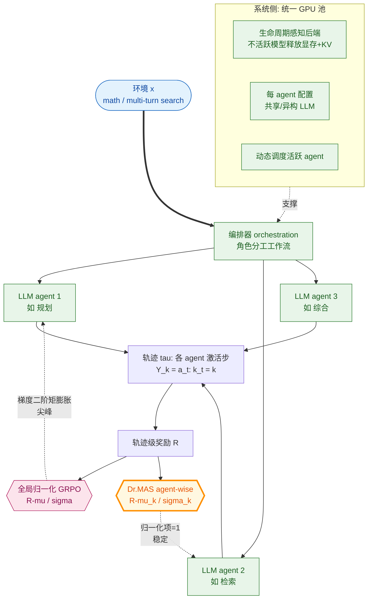

# Dr. MAS: Stable Reinforcement Learning for Multi-Agent LLM Systems

- arXiv: https://arxiv.org/abs/2602.08847
- Source: https://arxiv.org/abs/2602.08847
- Project: https://github.com/langfengQ/DrMAS
- 本地 PDF：`papers/rl/agentic-training/DrMAS_2602.08847.pdf`
- Year: 2026 (NeurIPS 2026)
- Category: rl
- Priority: high

## 一句话总结

NTU（Bo An 组，Lang Feng 一作）对"多智能体 LLM 系统的 RL 后训练为什么不稳定"给出理论定位：**GRPO 式组归一化的全局基线 (μ,σ) 在异构 agent 上失配——不同 agent 被调用频率不同、奖励分布不同，全局基线造成每 agent 优势的确定性偏移，二阶矩至少线性膨胀引发梯度范数爆炸**（Proposition 4.3）；药方简单到一行：按每个 agent 自己激活时刻的奖励统计做 agent-wise 归一化 (R−μ_k)/σ_k，把膨胀项精确归一。系统侧给出第一个原生多 LLM 共训框架（veRL/ROLL/AReaL 都围绕单 actor 设计）：统一 GPU 池 + 生命周期感知的 actor 后端管理（不活跃模型释放显存与 KV cache、活跃 agent 动态调度）。效果：数学 +5.6% avg@16/+4.6% pass@16、搜索 +15.2%/+13.1%（vs vanilla GRPO，Qwen2.5/Qwen3，math 与 multi-turn search），梯度尖峰基本消失，异构 agent-模型分配下依然有效。NeurIPS 2026，与库内 arlarena（单智能体稳定性四维度分解）正好构成"单智能体→多智能体"的稳定性研究对。

## 九问速览

1. **Problem**：角色分工型多智能体 LLM 系统（检索/综合、规划/执行）的 RL 后训练不稳定且缺框架——RLVR 时代单智能体配方直接搬过来会炸。
2. **Bottleneck**：GRPO 的全局基线假设同分布组内奖励；多智能体里各 agent 的奖励分布天然异构（调用频率、角色难度都不同），(μ_k−μ)/σ 偏差逐 agent 常数级偏移优势。
3. **Insight**：把"梯度二阶矩"按 agent 分解，膨胀项恰好是 (σ_k²+(μ_k−μ)²)/σ²——按 agent 自己的 (μ_k,σ_k) 归一化使该项恒等于 1，理论与工程一箭双雕。
4. **Method**：算法 = agent-wise 优势归一化（对 agent k 的激活步集合 Y_k 计算 action-weighted 统计）；系统 = 可插拔编排 + 每 agent LLM 服务/优化配置 + 共享 GPU 池与生命周期调度。
5. **Evidence**：math 六基准（AIME'24/25、AMC'23、MATH500、Minerva、OlympiadBench）平均 +5.6% avg@16（Qwen3-8B sharing 设置 57.8→62.3，AIME'24 单项 +12.1）；search +15.2% avg@16；训练曲线梯度尖峰消失。
6. **Ablation**：LLM sharing vs non-sharing、同构 vs 异构模型分配、GRPO/Dr.MAS/GiGPO/DAPO/RLOO/PPO 多算法插入——agent-wise 归一化在各组合下一致正向。
7. **Assumption**：轨迹级奖励传播到各 agent 激活步（action-weighted）；低维奖励与 token 级 score function 近似不相关（Δ_k 残差项小）。
8. **Failure**：vanilla GRPO 在多智能体下增益不稳定、部分难分片（AIME'25）不升反降；全局归一化下任何单个分布离群 agent 都能拖垮全组梯度。
9. **Opportunity**：只处理协作式（合作奖励同源）系统，零和/混合动机多智能体未碰；归一化只动一阶统计，二阶相关项 Δ_k 留着；与过程奖励（PRM）的结合未测。

| 维度 | 论文答案 |
|---|---|
| Perception | 编排器把工作流状态路由给各 agent；agent 各自条件于自己的上下文 |
| Closed-loop | multi-turn search：检索→综合→再检索的闭环轨迹，轨迹级奖励回传 |
| Correction | 每条轨迹一个 verifier 奖励，无显式纠错机制（靠 RL 压力涌现） |
| Deployment | 部署即编排好的多 LLM 工作流；训练框架开源（verl-agent 基座，Apache-2.0） |

## 核心技术

*架构速览：算法侧一行改动（全局基线→逐 agent 基线）消除多智能体 GRPO 的梯度膨胀；系统侧统一 GPU 池 + 生命周期调度让多个异构 LLM 能被一条 RL 管线端到端共训*

1. **失稳机理（Lemma 4.2 + Prop 4.3）**：unclipped GRPO 梯度 g̃_k = (R−μ)/σ · z^(k)，其二阶矩 = E[‖z‖²]·(σ_k²+(μ_k−μ)²)/σ² + Δ_k。前一项是主导：agent k 的奖励分布只要偏离全局分布（均值偏移或方差比大），该项至少线性放大；存在迭代序列使比值发散时梯度二阶矩发散。多智能体里这**不是**罕见 corner case——角色分工必然带来奖励分布异构（低层执行 agent 频繁被调、奖励稀疏；高层 agent 少而关键）。
2. **agent-wise 归一化**：A_k = (R−μ_k)/σ_k，其中 μ_k/σ_k 在 agent k 的激活步集合 Y_k 上做 action-weighted 统计（同一条轨迹被 agent k 激活 m 次则其 R 计 m 次——与目标函数的期望口径一致）。归一化后膨胀因子恒为 1；训练曲线的梯度尖峰消失。这是 GRPO→multi-agent 的最小正确扩展。
3. **多 LLM 共训框架**：veRL/ROLL/AReaL 围绕单 LLM actor；Dr. MAS 支持 LLM sharing（多 agent 共享一个模型，按角色分 system prompt / 上下文）与 non-sharing（异构模型各自权重、各自 per-agent 优化配置——学习率/KL 系数独立）。资源侧：全部 LLM worker group 放统一 GPU 池（Ray placement group 风格 resource-bundle），生命周期感知后端管理——inactive 模型卸载权重与 KV cache，active agent 动态调度，避免"一 agent 一 GPU 池"的浪费。
4. **多算法插槽**：框架内 GRPO、Dr.MAS、GiGPO、DAPO、RLOO、PPO 即插即换——agent-wise 归一化与 GiGPO 的组内分组、DAPO 的 clip-higher 等正交，可组合。
5. **评测设定**：角色分工 MAS（非 MAPoRL 那种对称辩论）——math（规划/求解分工）与 multi-turn search（检索/综合），rollout 组大小 8，avg@16 与 pass@16 双指标，Qwen2.5 与 Qwen3 双系列、4B/8B 双规模。

## 底层原理与数学推导

**全局基线的偏移分解**。对 agent k，vanilla GRPO 优势 A^global = (R−μ)/σ 传播到 Y_k 中所有动作。取激活步上的均匀采样视角：

$$\mathbb{E}\|\tilde{g}_k^{global}\|^2 = \mathbb{E}\|z^{(k)}\|^2 \cdot \underbrace{\frac{\sigma_k^2 + (\mu_k - \mu)^2}{\sigma^2}}_{\text{膨胀因子}} + \Delta_k$$

μ_k, σ_k 是 agent k 激活时刻的奖励均值/方差，Δ_k 是 score-reward 协方差残差（LLM 场景低维奖励 vs token 级随机性，经验上小）。三项启发全部来自膨胀因子：均值偏移 |μ_k−μ|/σ（某 agent 恒在高分区）、方差比 σ_k²/σ²（某 agent 奖励近乎确定性 0/1 而全局方差大）、以及二者任一发散则梯度发散。**agent-wise 替换后 (σ_k²+(μ_k−μ_k)²)/σ_k² = 1**——不是近似而是恒等式，这是它比"梯度裁剪/损失平滑"这类症状治疗干净的地方。

**action-weighted 统计的口径一致性**。agent k 的策略梯度目标本身就是对其激活步取平均 J_k = (1/|Y_k|)Σ_{Y_k} min(ρA, clip(ρ)A)——归一化统计用同一权重（轨迹计次按激活次数）保证优势的零均值单位方差在"该 agent 看到的动作分布"上成立，而不是在轨迹分布上——错口径会把高频 agent 的信号稀释给低频 agent。

**与 GiGPO 的关系**：GiGPO 在单智能体多步任务里按"同状态分组"细分基线；Dr. MAS 的分组键是 agent 身份。两者可以嵌套（agent 内再按步分组），论文实验里 GiGPO 插槽 + agent-wise 归一化组合有效。

## 物理直觉解释

一个班级统一按全班平均分改卷（全局基线）：学霸永远"低于平均"被扣分、学渣永远"高于平均"得虚高奖励——两人的学习信号都被系统性扭曲，且学渣的微小波动会被全班方差的分母放大成巨大优势摆动。正确做法是每人按自己的历史均值定位进步/退步（agent-wise 基线）。系统侧的直觉是旅馆房态管理：不是给每个住客（agent）永久包一间房（GPU 池），而是统一房态池 + 按入住/退房（激活/闲置）动态分房——多模型共训的显存账才算得过来。

## 工程细节与实操指南

- 代码：github.com/langfengQ/DrMAS（verl-agent/verl 基座，Apache-2.0，168+ stars；README 给出 3B search 配置 4×H100 约 12 小时的量级）。
- 接入现有 MAS：编排层可插拔——把工作流写成 agent 调用图即可，框架接管 rollout 收集（按 (i,t)→k 记录激活）、奖励传播与逐 agent 归一化。
- per-agent 配置是实战要点：异构模型下各 agent 的学习率/KL 系数/clip 范围独立设置；LLM sharing 模式省显存但牺牲角色分化，non-sharing 反之。
- 换算法不用换框架：GRPO/GiGPO/DAPO/RLOO/PPO 均已接好；把 Dr.MAS 当"归一化开关"叠加在任一算法上。
- 监控：盯每个 agent 的梯度范数曲线（论文的 Figure 展示 vanilla GRPO 尖峰 vs Dr.MAS 平滑）——如果某个 agent 尖峰先出现，先查它的奖励分布是否离群。

## 实验协议清单

- 任务：math（GSM8K/MATH 混合训练源，AIME'24/25、AMC'23、MATH500、Minerva、OlympiadBench 六基准评测）+ multi-turn search（工具调用检索，multi-turn 环境）。
- 模型：Qwen3-4B/8B（主表）、Qwen2.5 系列；LLM sharing 与 non-sharing 双设定；异构 agent-模型分配实验。
- 对照：single-agent GRPO / multi-agent vanilla GRPO / multi-agent Dr.MAS 三列对比，Δ 逐基准标注；rollout 组 8，avg@16 与 pass@16。
- 稳定性证据：训练全程梯度范数曲线（vanilla 尖峰 vs Dr.MAS 平滑）。
- 效率：统一 GPU 池 vs 独立分配的显存/吞吐对比；4×H100 的 wall-clock 量级报告。
- 开放性：代码/项目页齐全，NeurIPS 2026 接收（v2 2026-09-27 更新）。

## 消融实验与分析

- **主表（math, Qwen3-8B, sharing）**：single GRPO 56.6 → multi GRPO 57.8 → Dr.MAS 62.3 avg@16（+4.5 over vanilla）；non-sharing 58.1→60.7。Qwen3-4B：57.5→61.1（non-sharing avg@16 +3.6，pass@16 74.4→77.7）。
- **难分片收益放大**：AIME'24 (8B sharing) +12.1 avg@16 / +13.3 pass@16——基线方法在难样本上最不稳，归一化修正收益最大；AIME'25 (8B) +8.0/+16.7。
- **soft 项**：MATH500（简单饱和基准）基本持平（+1.7/−0.2）——归一化不损害已收敛能力。
- **search 场景增幅更大**（+15.2% avg@16）：multi-turn 下 agent 调用频率差异更大（检索 agent 高频），分布异构更严重 → 失稳项主导 → 修正收益更大，与理论预测同构。
- **异构分配**：小模型跑低层决策 + 大模型跑高层，Dr.MAS 下组合效率与效果双赢（vanilla 下异构更不稳）。

## 技术权衡（Trade-off）

- **只动归一化 vs 信用分配**：agent-wise 归一化解决"尺度失配"，不解决"谁的贡献"（都拿轨迹级 R）——与 DAT/COMA 类差异化信用分配正交但未组合；库内 vict（verifier 内结构化信用）是单智能体方向的补法。
- **action-weighted 口径的边界**：高频 agent 的同一轨迹奖励被重复计入，若轨迹奖励有系统性偏置会被该 agent 放大记忆。
- **系统复杂度**：生命周期管理（加载/卸载权重与 KV）引入调度延迟；agent 切换频繁的工作流会抖动，论文没给切换开销的细化数字。
- **协作式假设**：奖励同源（合作博弈）；竞争性多智能体（辩论式零和成分）下 agent-wise 归一化的理论不再直接适用。

## 技术价值与演进定位

多智能体 LLM RL 的"DAPO 时刻"：一个理论定位清晰的病根（全局基线在异构 agent 上失配）+ 一个一行代码的修法（按 agent 归一化）+ 一个让修法可用的系统（统一 GPU 池多 LLM 共训）。演化线：MAPoRL（'25 ACL，证明共训有效但用 multi-agent PPO，重）→ GiGPO/DAPO 单智能体分组与裁剪改进 → **Dr. MAS（'26 NeurIPS，多智能体归一化理论 + 框架）**。对本库主线的意义：机器人 fleet 的多策略共训（不同本体/任务 agent 共享环境奖励）会先在 LLM 侧遇到并解决这类分布异构问题——它就是"多机器人联合 RL 的第一个稳定性课"。

## 与其他论文的关系

- **arlarena**（库内）：把单智能体 RL 不稳定分解为损失聚合/IS 裁剪/轨迹过滤/优势设计四维度；Dr. MAS 相当于把"优势设计"维度推广到多智能体，并证明该维度在 MAS 里是失稳主因之一。两文合读 = 完整的 agentic RL 稳定性地图。
- **maporl**（库内，同期拉取）：MAPoRL 证明共训的必要性与激励设计，Dr. MAS 解决共训的实现稳定性——理想路线是 MAPoRL 的奖励塑形 + Dr. MAS 的归一化与框架。
- **g2po / dataprm**（库内）：单智能体侧的分组/信用改进，与 agent-wise 归一化同属"分组建基线"家族，可互相移植。
- **tongyi-deepresearch / lite-researcher**（库内）：严格 on-policy GRPO 的单智能体配方，迁移到多智能体时的第一处要改的代码就是优势归一化——Dr. MAS 给出直接答案。
- **veRL/ROLL/AReaL**：被批评为单 actor 框架；Dr. MAS 是第一个原生多 LLM actor 的开源 RL 框架（verl-agent 基座）。

## 精读问题

1. 膨胀因子的 Δ_k 残差（score-reward 协方差）什么时候不可忽略——过程奖励（PRM）密集信号下它会变大吗？届时 agent-wise 归一化还够吗？
2. agent 频率极度倾斜（执行 agent 100 步 vs 规划 agent 2 步）时，action-weighted 统计的样本量不足会不会让 σ_k 估计噪声大——需要跨 batch 的统计平滑吗？
3. LLM sharing 模式下不同角色的梯度混进同一份权重，归一化能防尺度失配，但能防"角色串味"（role collapse）吗？
4. 与 MAPoRL 的过程激励组合：β0（错而有用来）信号怎么在 agent-wise 口径下定义——按"被影响者的改善"记账时，统计该算谁的？
5. 多机器人场景迁移：不同本体的任务成功率天然异构（移动底座 vs 灵巧手），agent-wise 归一化是否就是 multi-embodiment RLVR 的直接前驱？
