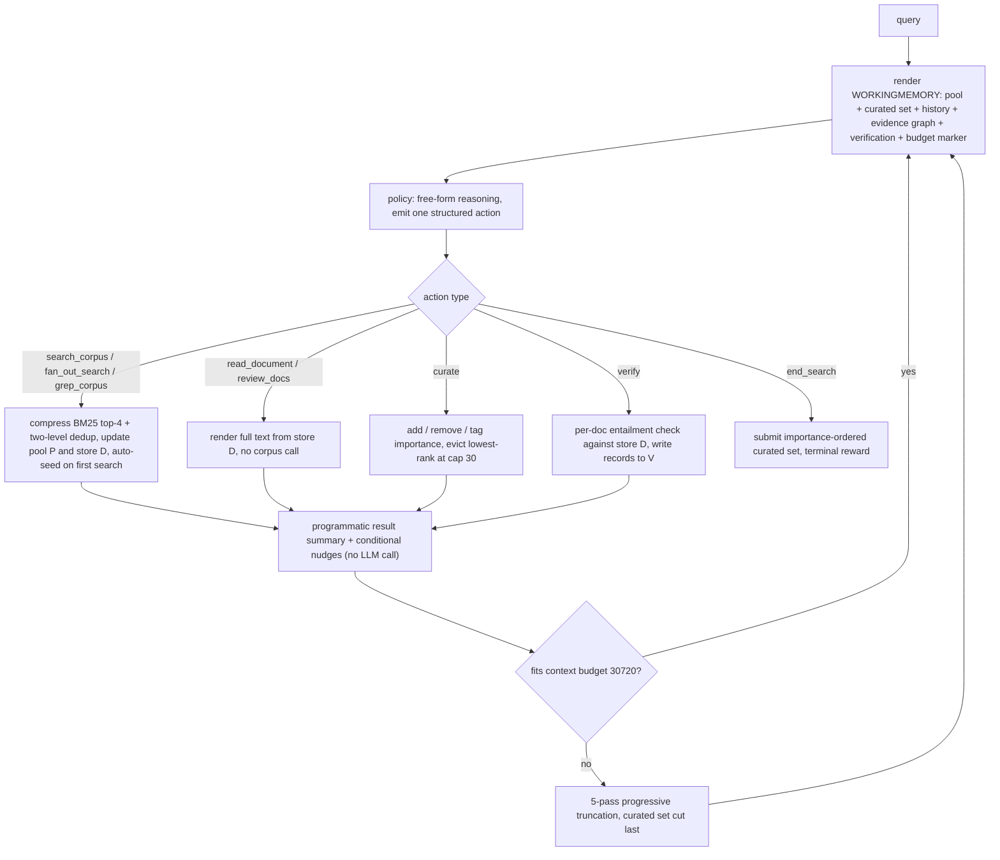

# Harness-1: Reinforcement Learning for Search Agents with State-Externalizing Harnesses

- arXiv: https://arxiv.org/abs/2606.02373
- Source: https://arxiv.org/abs/2606.02373
- Project: https://github.com/pat-jj/harness-1
- Local PDF: `papers/rl/agentic-training/Harness-1_2606.02373.pdf`
- Year: 2026
- Category: rl
- Priority: high

## 一句话总结

把多轮搜索 agent 里"可恢复的记账"从策略上下文搬进环境侧：Harness-1 是基于 gpt-oss-20b 的 20B 检索 subagent（UIUC + UC Berkeley + Chroma），在一个 stateful 状态机 harness 里维护候选池、重要性标注 curated set（容量 30、四级标签）、证据图、验证缓存、全文库、BM25 句级压缩与两级去重、预算感知渲染；策略只保留语义决策——搜什么、留什么、验证什么、何时停。训练上用 GPT-5.4 教师在同一 harness 内跑出 899 条轨迹（约 26K turn 级样本）做 SFT 教接口操作，再用 on-policy CISPO 只在 SEC 单域 3,453 条查询上做 80 步 RL：8 个检索基准平均 curated recall 0.730，超最强开源 subagent（Tongyi DeepResearch 30B，0.616）+11.4 分，frontier 模型中仅 Opus-4.6（0.764）平均分在其之上；在 4 个 SFT/RL 均未涉及的迁移基准上增益（均值 +17.0 分）反而比源域（+7.9 分）大 2.2 倍；推理期逐机制消融显示全部 harness 关闭后 recall 从 0.584 掉到 0.513（-12.2%）。

## 核心技术

1. **Stateful cognitive offloading（核心原则）**：搜索 episode 所需的状态分两类——语义决策（policy 负责）与可恢复记账（harness 负责）。传统 formulation 把两者都压进不断增长的 transcript，RL 被迫同时优化"搜什么"和"从 append-only 观测流里重建状态"，导致难查询 rollout 奖励几乎全为空集、工具词表塌缩成重复 search、跨文档结构散落在上下文里无法可靠调用。
2. **WORKINGMEMORY 两层记忆 + 7 个状态槽位**：prompt 面层渲染紧凑状态 $s_t = (P_t, C_t, I_t, G_t, V_t, H_t, B_t)$（候选池 / curated set / 重要性图 / 证据图 / 验证缓存 / 搜索历史 / 预算标记），外层 $D_t$ 保存所有取回 chunk 的全文，通过 `review_docs`/`read_document` 回看而不占 prompt。每次动作施加转移 $(s_t, a_t) \mapsto (s_{t+1}, o_{t+1})$——工具输出不只是拼进 prompt 的文本，而是更新持久检索状态。
3. **动作即状态编辑**：8 个工具分五类——检索（`fan_out_search` 最多 5 路并行混合检索 + RRF + rerank、`search_corpus` 单路 BM25+dense、`grep_corpus` 正则精确匹配）、记忆检查（`read_document` 全文、`review_docs` 重渲染已见文档）、curation（`curate` 增加/删除/打四级重要性标签）、验证（`verify` 对 policy 写的 claim 做逐文档 LLM 蕴含判断并写入 $V_t$）、终止（`end_search` 提交按重要性排序的 curated set）。
4. **Auto-seeding（warm-start）**：首次成功检索自动把 rerank top-$k=8$ 结果以 fair 标签植入 curated set，把学习问题从"从零构造"变成"对初稿做精修"——避免困难查询上大量 rollout 以相同空集告终、奖励不可区分。
5. **重要性感知淘汰**：curated set 容量 $M=30$，满员时比较新文档与集合内最低重要性文档的 rank（very_high=0 < high=1 < fair=2 < low=3），劣则驱逐、否则拒绝并报 `[CAPACITY]` 标记；对已入集文档重新 `curate` 可原位改标签（支持 verify 后升格）。
6. **派生状态渲染**：证据图 $G_t$ 用轻量正则抽取三类实体（多词大写专有名词、四位年份/年代、数字日期），维护 entity-to-docs 与 doc-to-entities 两张映射，渲染高频实体（最多 8 个）、桥文档（含 2+ 高频实体，是 verify/升格候选）与单例实体（潜在跳转线索）；搜索观测过 sentence-BM25 压缩（每 chunk 保留 top $K=4$ 句、保持原序）+ 两级去重（chunk-ID + MinHash-LSH 内容指纹，5-gram、64 置换、Jaccard 阈值 0.85，无 datasketch 时退化为前 4,000 字符 SHA-1）。
7. **三条可训练性要求**：论文明确一个"富 harness"不自动等于"可训练环境"，需要 (a) warm-started curation（auto-seed）、(b) 紧凑派生状态渲染（标签/证据图/验证记录）、(c) 保持多样性的奖励塑形（否则 RL 走最易奖励通路塌缩成 search-only）。
8. **训练管线与统一接口**：GPT-5.4 作为 live teacher 在完整 harness 内生成轨迹（turn 级引导 search→curate 节奏、verify-before-promote、回溯与提前终止；recall $\ge 0.10$ 过滤后余 899 条），逐 turn 展开为约 26K 样本；gpt-oss-20b LoRA rank 32 训 3 epoch 取 step-550；RL 用 on-policy CISPO（clip [0,5]）+ 组内优势归一化，SEC 单域、仅终局奖励、40 turn 上限、无 KL 锚、恒奖励组丢弃梯度。teacher/SFT replay/RL rollout/评测四个阶段用同一个状态渲染器与预算构造器，无 train-test 接口漂移。

## 底层原理与数学推导

**接口形式化**（附录 A）：设 agent 接口为 $I = (A, O, T, r)$——动作、观测渲染器、环境转移、奖励。工具编排（tool orchestration）路线固定接口 $I_0$、在内部学策略：

$$\max_{\theta} \; \mathbb{E}\left[ R(\pi_\theta; I_0) \right]$$

Stateful harnessing 则改接口本身：把可编辑检索状态加进转移，$(s_t, a_t) \mapsto (s_{t+1}, o_{t+1})$ 而非 $a_t \mapsto o_{t+1}$：

$$\max_{\theta} \; \mathbb{E}\left[ R(\pi_\theta; I_{\text{Harness-1}}) \right], \qquad s_t = (P_t, C_t, I_t, D_t, G_t, V_t, H_t, B_t)$$

策略仍学工具使用，但学的是"harness 维护的状态表示之上"的工具使用——这把训练问题从"在贫瘠接口上挤能力"变成"在富状态接口上学语义决策"。

**终局奖励**：空 curated set 终局短路到 $\pi_\varnothing = -0.2$；其余情形

$$R = \underbrace{w_F F_\beta}_{\text{set quality}} + \underbrace{w_\tau \rho_\tau + w_A \rho_A + w_{\tau A} \rho_{\tau A}}_{\text{trajectory coverage + answer evidence}} + \underbrace{B_A \mathbb{1}[\rho_A > 0]}_{\text{answer bonus}} + \underbrace{w_{div} \min(\nu/\nu_0, 1)}_{\text{tool diversity}} - \underbrace{w_{miss}(\rho_{\tau A} - \rho_A)^+}_{\text{answer miss}} - \underbrace{\pi_{turn}(t)}_{\text{turn penalty}}$$

部署权重：$w_F = 0.7$、$w_\tau = 0.3$、$w_A = 0.8$、$w_{\tau A} = 0.4$、$B_A = 1.0$、$w_{miss} = 0.35$、$w_{div} = 0.15$、多样性目标 $\nu_0 = 6$、turn 罚从第 20 turn 起算（上限 0.02）、格式奖励下限 $10^{-3}$、KL 系数 0。设计要点是把**发现**与**选择**分开记账：$\rho_\tau$（trajectory recall）给"池子里出现过"的证据记分，$\rho_A$（curated final-answer recall）只给"选进最终输出"的证据记分，answer-miss 罚项 $(\rho_{\tau A} - \rho_A)^+$ 专罚"找到了答案证据却没升格"的轨迹——这正是无 harness 训练时奖励无法归因的失败模式。$F_\beta$ 取 $\beta = 2$：

$$F_2 = \frac{5 P R}{4P + R}$$

即 recall 的权重是 precision 的 4 倍，与"检索 subagent 负责凑齐证据、集合大小是接口参数"的定位一致。

**评测指标**：对查询 $q$，$\mathcal{R}_q$ 为全部标注相关文档、$\mathcal{A}_q$ 为含答案文档、$\mathcal{C}_q$ 为最终 curated set、$\mathcal{P}_q$ 为轨迹池：

$$\text{Recall}(q) = \frac{|\mathcal{C}_q \cap \mathcal{R}_q|}{|\mathcal{R}_q|}, \quad \text{FA-Recall}(q) = \frac{|\mathcal{C}_q \cap \mathcal{A}_q|}{|\mathcal{A}_q|}, \quad \text{Traj-Recall}(q) = \frac{|\mathcal{P}_q \cap \mathcal{R}_q|}{|\mathcal{R}_q|}$$

三个量在数学上互不支配（分母不同），Traj-Recall 是"发现上界"诊断量：Traj-Recall 高而 Recall 低 = 看到了但没留住 = 选择问题。

**淘汰规则**：重要性 rank 定义 $\text{rank}(\text{very\_high})=0 < 1 < 2 < 3$；容量 $M=30$ 满时，新文档以 rank $j$ 进入，找到集合内最劣 rank $w = \arg\max_{c \in C}\text{rank}(I(c))$，仅当 $\text{rank}(j) < \text{rank}(I(w))$ 才驱逐插入，否则拒绝——机械容量约束完全由 harness 承担，策略只表达置信与优先级。

## 物理直觉解释

**Transcript 记忆像让主厨凭记忆复述一整天的备料流水，外化状态像给厨房装一台 mise en place 台面。** 旧 formulation 里，模型每一步都要从只增不减的对话记录里"重新想起"哪些文档看过、哪些线索没查完、哪条 claim 验证过——这相当于让主厨同时掌勺并背诵库存清单。清单背诵本身不难，但它吃掉的是最贵的资源：上下文注意力和 RL 的优化预算。Harness-1 把库存清单做成环境侧的实体（池、集合、图、验证缓存），每轮以固定格式渲染回来，策略的注意力预算全部花在"下一刀切哪里"上。消融里最能说明问题的是行为签名：抽掉任一状态机制后，失败查询上 `search_corpus` 占比升到 93-94%、`read_document`/`verify` 掉 2-7 倍——policy 不是"丢了信息"，而是退化成广撒网不深读的浅搜模式，因为再也没有一个可编辑的 substrate 让"深读后升格"这个动作有意义。

**Auto-seed 像老师先给一版有错的初稿再让学生改，而不是发白纸。** 强化学习的早期梯度靠 rollout 之间的奖励对比；如果 curated set 从空集开始，难查询上大量 rollout 终局都是同一个空集——奖励全同、梯度为零。首搜自动植入 top-8 fair 候选后，任何 rollout 的终局状态都不同：有的升格了真证据、有的留错了候选，奖励差异立刻出现。注意它没有替模型做相关性判断——它改变的是初始状态分布（从"构造"到"精修"），而"精修"恰好是 SFT 后模型立刻能做出可区分动作的空间。这与纯 RL 搜索 agent（如 Search-R1 只给 4-5 轮 search-and-answer）的结构性差异：Harness-1 的探索预算花在状态空间里，不是从零试错里。

**工具多样性奖励像交叉训练，防止 RL 走"最容易的奖励通路"把动作分布练畸形。** 训练动态实验是最干净的证据：关掉 $w_{div}$，agent 发现刷 `fan_out_search` 就能抬高 trajectory recall 项，于是工具多样性从约 6 掉到约 3.5、curated recall 卡在约 0.53——文档找到了，但从不升格、从不验证。打开 $w_{div}$ 后多样性稳定在约 4.30、终局 recall 到约 0.60，前期爬升慢（因为要花 turn 编辑候选集）但终点更高。这条要求的深层含义是：**富 harness 只是给 RL 提供了可学的东西，奖励塑形才决定 RL 是否真的去学**——没有它，RL 会把一个精心设计的接口塌缩回最小 search-only harness。

**证据图像给一堆散落病历建了一张"谁和谁共现"的索引卡。** 多跳查询的瓶颈常是"我该顺着哪个实体追下去"。正则抽取的三类实体（专名/年份/日期）构成 entity-to-docs 映射后，"哪个文档横跨多个高频实体"（桥文档）直接变成工作记忆里的一行渲染，把"我看过什么关于 X 的内容"从全上下文重读变成一次查表；单例实体则被显式标成潜在 hop。这个组件便宜到只有每 chunk 一遍正则加渲染时一次 top-k 扫描，但消融显示抽掉它 FA recall 相对掉 5.4%——因为失去结构锚点后，策略只能靠自由文本猜测串起跨文档链条（案例 Q754 里它到第 39 turn 才盲猜人名、从未连上"绰号-辖区-前任"链）。

## 工程细节与实操指南

**工具签名与执行侧**（Table 4）：`fan_out_search(queries)` 5 路并行混合检索 RRF+rerank；`search_corpus(query)` BM25+dense、RRF、rerank（Qwen3-Reranker-8B，Baseten 托管）；`grep_corpus(pattern)` 全库正则；`read_document(doc_id)` 全文按预算截断；`review_docs(doc_ids)` 最多 5 个 ID、零 corpus 调用；`curate(add, remove, importance)`；`verify(doc_ids, claim)` 逐文档严格 yes/no + 20 词以内 rationale（保守判 no）；`end_search(reasoning)`。另注册一个向后兼容的 no-op `prune_chunks`（返回"由 working memory 管理，无需剪枝"）。

**渲染布局**（附录 F/G）：WORKINGMEMORY 按序渲染 header+query、按重要性分组的 curated set（每条 doc ID + 120 字符摘要）、最近 50 条未入集文档（更旧的压成 ID 列表、30 个截断）、最近 12 条搜索历史（更旧压成省略行）、证据图块（仅当存在多文档桥实体）、去重通知；每轮观测 = WORKINGMEMORY + 最近 $K=5$ 个 (action, result) 对（旧 turn 推理截到 300 字符）+ 最新工具结果。**每轮还注入程序化 nudge**（无 LLM 调用）：`[STATUS]` 事实行恒开；`[ACTION REQUIRED]`（搜后超过 1 turn 未 curate）、`[WARN]`（连续非 curate turn / 池有候选但集为空）、`[TIP]`（检测到截断建议 read_document、到 turn 3 只用过一种工具、到 turn 4/6 未用 grep/read）、`[NEXT]` 下一动作建议。`HARNESS_PRESCRIPTIVE=1` 在所有报告的 run 中开启，且这些 nudge 计入"全 harness 关闭"消融行——即论文把提示工程也算作 harness 质量的一部分，透明披露。

**上下文预算**：prompt 预算 30,720 token + 生成 2,048 = 32,768 上限；超限时 5-pass 渐进降级——(1) 正常渲染 (2) 截断文档池段（保 curated set/历史/证据图）(3) 旧 turn 分析截到 100 字符且 WORKINGMEMORY 上限 2,000 字符 (4) 逐个丢弃最旧 (action, result) 对 (5) 最小上下文（system + 工具描述 + query）。curated set 与近期工作记忆是最后被裁的，保证没有 rollout 因上下文溢出失败。观测提示 `[Context: X/Y]`，系统提示要求 75% 以上开始收尾、90% 以上必须 end_search。

**SFT 配方**（附录 J）：教师 GPT-5.4（tool_choice=required，4,096 completion tokens）在同一 harness 内 native 运行，turn 级引导注入：search→curate 节奏强制、多约束查询在 $\ge 6$ turn 且 $\ge 3$ curated docs 后 nudge verify、最近 3 次搜索合计 $\le 1$ 新文档触发回溯、4 turn 未用 grep/read 触发多样性提示、临近 turn 上限注入紧迫性。原始配额 BC+/300、SEC/250、Patents/150、Web/150、Web-simple/75、SEC-simple/75（约 1K），recall $\ge 0.10$ 门过滤后 899 条，turn 级展开约 26K 样本；LoRA rank 32、LR $5\times10^{-6}$、batch 128、3 epoch、seq 32,768、取 step-550。训练平台为 Tinker。

**RL 配置**：CISPO（clip [0,5]）、LoRA rank 32、LR $1\times10^{-5}$、每步 128 query $\times$ 8 rollout = 1,024 条、4 substeps、共 80 步、约 82K rollouts、rollout 温度 1.0、无 KL、恒奖励组丢弃、单域 SEC（train split 3,453 条）。

**评测协议要点**：所有方法共用同一检索原语、web 后端（Chroma 语料 + Serper+Jina）、Qwen3-Reranker-8B、终局 30 文档预算（跟随 Context-1）；Harness-1 温度 1.0、40 turn，Context-1 与 frontier LLM 在 Context-1 harness 下 64 turn。Search-R1 与 Tongyi DeepResearch 用各自 released harness，因其不天然产出 30 文档 curated set，统一对轨迹池 rerank 取 top-30。三个 recall 指标 3 次运行取平均。附录 P 的 harness 混淆对照：同一 GPT-5.4 依次放进 naive search-add / Context-1 harness / Harness-1 harness，curated recall 0.511 → 0.807 → 0.849（FA 0.612 → 0.821 → 0.876）——不训练、只换 harness 白拿 +4.2 分 recall。

**复现入口**：代码在 `github.com/pat-jj/harness-1`，论文声明将放出权重、harness 代码、数据生成管线与 RL recipe。

## 消融实验与分析

推理期组件消融（Table 3：同一训练好的 checkpoint，100 条成对 BC+ 测试查询，逐机制关闭、不重训；$\Delta$ 为相对 full 的百分比变化）：

| 配置 | Recall | $\Delta$Recall (%) | FA Recall | $\Delta$FA (%) | 硬失败数 |
|------|--------|--------------------|-----------|----------------|----------|
| Full Harness-1（全机制开） | 0.584 | — | 0.667 | — | — |
| −重要性标签（二值 curate + FIFO 驱逐） | 0.560 | -4.1 | 0.614 | -7.9 | 15 |
| −Sentence-BM25 压缩（原始 chunk） | 0.585 | +0.2 | 0.620 | -7.0 | 13 |
| −首搜 auto-seed | 0.582 | -0.3 | 0.624 | -6.4 | 12 |
| −证据图（观测中隐藏） | 0.569 | -2.6 | 0.631 | -5.4 | 10 |
| −verify（返回 unavailable） | 0.566 | -3.1 | 0.641 | -3.9 | 12 |
| −review_docs（返回 unavailable） | 0.598 | +2.4 | 0.641 | -3.9 | 9 |
| −内容指纹去重（保留 chunk-ID 去重） | 0.611 | +4.6 | 0.678 | +1.6 | 0 |
| 全部 harness 机制关闭 | 0.513 | -12.2 | 0.624 | -6.4 | §M.2 |

训练动态对照（Figure 5，仅差 $w_{div}$ 是否激活）：无 $w_{div}$ 时工具多样性约 6 → 3.5、curated recall 平台期约 0.53；有 $w_{div}$ 时多样性稳定约 4.30、终局约 0.60。RL 前后对照（Figure 3）：对 Context-1 的增益源域四基准 +6.2/+9.8/+3.3/+12.2（均值 +7.9），held-out 四基准 +32.8/+18.4/+7.2/+9.5（均值 +17.0，2.2 倍）。数据规模对照（Figure 4）：Harness-1 共 4,352 个唯一训练项（899 SFT + 3,453 RL），Context-1 超 8K SFT 任务 + 9,159 RL 查询（17.2K），Search-R1 直接在 221,328 行 NQ+HotpotQA 合集上 RL。

**核心结论：** (1) 七个机制里六个产生干净的 FA-recall 相对下降（-3.9% 到 -7.9%），且失败模式一致——配对失败查询上 `search_corpus` 占比升 3-7 个百分点、`read_document`/`verify` 掉 2-6 倍，说明抽掉状态机制不是"丢信息"而是让已训练策略退回广浅搜模式（如重要性标签消融后 Q893 上 read 从 4.7% 掉到 0.7%、verify 归零、search 升到 94.1%，同一 40 turn 预算下 curated recall 从 1.0 跌到 0.12）。(2) 全部机制同时关闭时 recall 掉到 0.513（-12.2%），超过任何单机制降幅——各机制是组合起效的：策略保持搜索带宽，但失去了把带宽转成有判别力 curated set 的决策基底，这是"harness 而非底座能力"贡献收益的最干净证据。(3) 两个名义上升的行各有明确机理：去重关闭 +4.6% recall 是因为 BC+ qrels 偶含近重复 gold 文档、MinHash-LSH（$\theta_{\text{Jaccard}}=0.85$）有时把两个 gold 变体折叠成一个——去重是 token 预算机制不是 recall 机制（附录 O 中下游答案准确率在多数配对查询上仍偏好去重版）；review_docs 关闭 +2.4% recall 是策略用逐 turn 重读替代了批量回扫，但 FA 仍掉 3.9%。(4) 与绝对性能相比，迁移结构更有诊断力：held-out 增益（+17.0）是源域（+7.9）的 2.2 倍，且用约 1/4 于 Context-1、1/50 于 Search-R1 的训练项达成——策略学到的是域无关的搜索状态操作（精修 auto-seed 集、读桥实体、升格前 verify、提交紧凑集合），这些操作比存在权重里的域特定模式更易迁移。

## 技术权衡（Trade-off）

| 优势 | 劣势与工程代价 |
|------|---------------|
| RL 优化界面稳定：语义决策与记账分离后，小规模 SFT（899 条）+ 单域 RL（3,453 查询）即可迁移，held-out 增益反超源域 2.2 倍 | Harness 复杂度本身成为新的工程债：5-pass 截断、淘汰规则、nudge 规则、正则实体抽取全是手工设计，换域可能需要重调 |
| 同一状态渲染器贯穿 teacher/SFT/RL/评测，杜绝 train-test 接口漂移；curated set + 验证记录让输出可审计 | 程序化 nudge（`[ACTION REQUIRED]` 等）是 harness 的一部分而非策略内化能力——它们计入消融是诚实的，但也意味着部分收益依赖持续注入提示 |
| 发现/选择分离的奖励（trajectory vs curated 项 + answer-miss 罚）让失败可归因，训练动态可控（多样性奖励防塌缩） | 轻量组件各有精度上限：正则证据图不含实体链接与关系抽取；verify 是 LLM 蕴含代理、歧义/高技术性 claim 会误判；BM25 句压缩在相关性依赖语篇结构时丢上下文 |
| 20B 开源模型达到 0.730 平均 curated recall，压过 GPT-5.4/Sonnet-4.6/Kimi-K2.5/GPT-OSS-120B，仅 Opus-4.6 领先 | 与 Opus-4.6 的差距主要在 BC+ 选择端（FA 0.658 vs 0.736，trajectory recall 相近）——发现已近饱和，选择质量受 curated 容量与标签体系约束 |
| 范围聚焦带来可复现性：40 turn 上限、30 文档预算、共享 reranker 的严格对协议 | 定位是证据收集型检索 subagent：不覆盖开放式报告生成、证据缺失时的弃答、对抗性 web 环境（附录 B 自述局限） |

## 技术价值与演进定位

Harness-1 的问题重述是：把"harness 设计"从检索 agent RL 的实现细节提升为中心问题，并给出一个可操作的分配原则——stateful cognitive offloading（可恢复状态归环境，语义决策归策略）。它上承两条线：一是 SWE-agent 的 agent-computer interface 结论（同一模型换接口可差几十分），把它第一次系统地带进检索 RL；二是 Context-1（Chroma 的 self-editing search agent，本论文的直接对照与协议基座），把"上下文管理"从策略内动作变成环境侧状态。它的增量贡献有三层可迁移的设计知识：(a) 三条可训练性要求（warm-start、紧凑派生渲染、多样性激励）指出富 harness 与可训练环境之间的空隙——训练动态实验证明缺了第三条，RL 会把接口塌缩回 search-only；(b) 发现/选择分离的奖励结构，把无 harness 训练中无法归因的失败（搜到了没留住）变成显式惩罚项；(c) harness 混淆对照（同模型换 harness +4.2 分）给"接口本身是方法的一部分"提供了量化证据。对检索 RL 这条线，它暗示下一步竞争从"更大模型/更多 RL 数据"移向"更好的可训练接口"；待确认的是其评测均基于 recall 导向指标与 needle/multi-hop 型任务，开放式研究任务上的结论未验证。注意命名区分：本工作与库内 `notes/rl/harbor.md`（HARBOR 机器人 RL harness 框架，2606.08610）、`harbor-framework/harbor` 容器评测框架均无关；其参考文献 [35] 引用的 "Harbor: Automated harness optimization"（2604.20938）是第三个同名工作，阅读引用时需分辨。

## 与其他论文的关系

- **Context-1（Chroma，2026-03，直接基线与协议基座）**：Context-1 训 20B agent 学"自剪枝上下文"，把上下文管理开始纳入策略本身，但 harness 仍是薄工具封装、剪枝之外的状态要策略自己从 append-only 流重建；Harness-1 反其道把状态搬进环境，且在相同 30 文档预算与共享 reranker 下以 0.730 对 0.603 平均 curated recall 胜出，held-out 差距最大（LongSealQA +32.8 分）。
- **Search-R1 / s3 / DeepRetrieval（检索 RL 前线）**：三者分别代表 answer-reward RL、模块化 searcher-generator 解耦、真实搜索引擎查询改写；共同点是 harness 均为薄封装、短 horizon（Search-R1 在本协议下通常只做 4-5 轮搜索、Recall 与 Trajectory Recall 几乎重合）。Harness-1 的第一作者 Pengcheng Jiang 亦是 DeepRetrieval 与 s3 的作者，本篇可视为该作者线从"训更好的查询策略"到"训更可训练的接口"的转向。
- **Tongyi DeepResearch 30B**：被反超的最强开源 subagent（平均 0.616），说明 30B 尺寸 + 通用 deep-research 训练不如 20B + 状态外化 harness；其 released harness 不产出 capped curated set，评测时统一经共享 reranker 取 top-30（库内 `notes/rl/tongyi-deepresearch.md` 可对照阅读）。
- **MemGPT / Mem1 / context rot（Chroma 技术报告）**：记忆外化与长上下文退化的相关证据线；区别在于 MemGPT/Mem1 让模型自己学分页与压缩，Harness-1 把压缩、去重、摘要全部做成确定性环境操作、不占学习预算。
- **库内 harness/基建线（`notes/rl/lego-rl.md`、`notes/rl/polar.md`）**：lego-rl 解决"原生 coding-agent harness 与策略梯度训练对齐"（rollout 与训练 token 序列的忠实性），polar 研究"在任意 harness 上做大规模 agentic RL"，加上本篇的"为可训练性设计 harness 状态"，三篇合看构成"harness 作为 agentic RL 一等公民"的三个正交切面：忠实性、通用性、可训练性。
- **机器人侧对照（库内 `notes/rl/harbor.md`、`notes/rl/enpire.md`、`notes/rl/agentic-robotics-loop.md`）**：三者把 harness 工程用于机器人 RL 的构建/执行/外层研究循环，Harness-1 则用于 LLM 检索；共享母题是"把原本压进模型上下文或人工流程的状态与检查，外化成环境侧的可验证结构"，差异在反馈信号（学习曲线与 rollout 视频 vs 终局检索奖励）。
- **SWE-agent ACI 与 harness engineering 实践（Codex/Anthropic 工程博客、AutoHarness、Meta-harness 及其引用的 Harbor 2604.20938）**：本篇与"自动搜索 harness"的自动化路线互补——它不搜索 harness 代码，而是手工给出一个面向检索的、经消融验证的 harness 形态，并论证其每个组件对 RL 可训练性的贡献。

## 精读问题

1. 消融的"全机制关闭"行把程序化 nudge 一并移除，而 nudge 与重要性标签、证据图的作用方向可能纠缠——是否存在一个"无 nudge 但保留状态机制"的中间配置来分离"信息渲染"与"行为提示"两类贡献？论文未报告这一行，其收益分解会是多少？
2. 证据图用正则抽取三类实体，在 BC+/SEC/专利这类实体规范语料上有效；换成实体形态自由、跨语言或口语化语料时，桥实体信号的信噪比下降多少才会让该机制从正贡献变成负贡献？
3. answer-miss 罚项 $(\rho_{\tau A} - \rho_A)^+$ 与 Traj-Recall 项都在奖励"池中出现过"，两者合称是否会让策略学会"先广撒网抬高 trajectory 项、再最小成本挑一两篇凑 answer 项"？40 turn 上限与 turn 罚在多大程度上约束了这种退化？
4. held-out 增益（+17.0 vs +7.9）被归因于"域无关的状态操作"，但四个 held-out 基准中有三个是 web 后端（Serper+Jina）而非 Chroma 语料——增益里有多少来自 harness 状态操作、多少来自评测后端本身的方差（Seal0QA 仅 111 条测试查询）？
5. 同一状态渲染器服务 GPT-5.4（教师）、20B 学生与评测，但教师的 turn 级引导（nudge 之外的元提示）在学生 RL 时是否保留？若保留，最终策略有多少比例的 search→curate 节奏来自可内化的奖励信号、多少来自持续注入的行为脚本？
