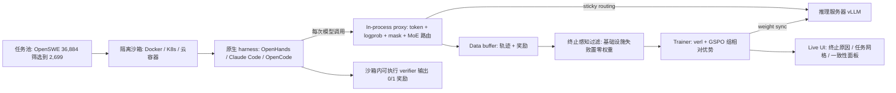

# LEGO-RL: Harness-Native Reinforcement Learning for Coding Agents

- arXiv: https://arxiv.org/abs/2608.17393
- Source: https://arxiv.org/abs/2608.17393
- Project: https://github.com/LegoX/Lego-RL
- Local PDF: `papers/rl/agentic-training/LEGO-RL_2608.17393.pdf`
- Year: 2026
- Category: rl
- Priority: high

## 一句话总结

LEGO-RL（LegoX 技术报告，华为 + 港中文，**无同行评审**）解决的是"原生 coding-agent harness 与策略梯度训练天生不对齐"的问题：harness 侧的上下文压缩与历史重写让重构出的轨迹不再是 rollout 时真正采样的 token 序列，环境崩溃与 reward hacking 污染结果信号，MoE 的 rollout 路由在训练时未被复现。它的三根支柱是——进程内 LLM 代理在 serving 边界捕获 token 与 log-prob（忠实优化）、带镜像缓存与分级防作弊的沙箱编排（可靠执行）、插件化校验 + Live UI（可观测训练）。用 GSPO 训 Qwen3.5-35B-A3B 稀疏 MoE，SWE-bench Verified 上 OpenHands SDK 64.0%→70.4%、Claude Code 62.4%→68.2%、OpenCode 57.2%→66.6%，rollout-training 概率相关性保持在 0.99 以上。

## 核心技术

1. **Harness-native 的定位**：把原生 harness $H$ 当作环境的一部分，只优化它调用的策略 $\pi_\theta$，不改其内部控制流。接入新 harness 只需一个轻量 adapter（启动 agent、接推理服务、回收交互数据），其余训练管线跨 agent 共享。论文 Table 1 对照 verl / slime / MOLT / SkyRL-Agent / AReaL / Agent Lightning / Polar / rLLM / OpenForgeRL / ALE(ROLL/ROCK) 八项能力，LEGO-RL 全部打勾；它的差异点是"harness-native + 策略梯度 + 沙箱执行 + 可执行验证 + 训练可观测"凑在一套里。
2. **进程内代理（faithful optimization）**：与 rollout 引擎同置，同时支持 OpenAI 兼容与 Anthropic API，在 serving 会话里直接记下 token ID、log-prob、response mask、生成元数据与 MoE 路由决策——而不是从最终 transcript 重构。历史重写下的对齐在消息粒度做：system/user/tool-result 必须完全匹配，tool call 通过稳定标识符与函数名关联（因此参数被重新序列化也不影响捕获的 policy token）；被重写或 harness 自己生成的内容只作为条件上下文，不进 $M(\tau)$；对不上的一律剔除而不是硬重构。子 agent 的调用被隔离到独立会话，避免其 token 混进父轨迹。
3. **R3（rollout routing replay）**：稀疏 MoE 策略下，复现同一 token 序列还不够——rollout 与训练必须选同一批专家。代理额外记录 rollout 时的路由决策，训练时重放，使训练侧概率计算走与行为策略相同的专家路由。
4. **沙箱执行与奖励完整性**：每个 trial 一个全新隔离沙箱（Docker / Kubernetes / 云容器服务）；Nydus lazy-pull snapshotter 按需流式拉取镜像块、避免全量复制；agent runtime 与评分工具链只读挂载而非逐 trial 安装；无预构建镜像的任务走 inline build（依赖钉死 + fail-fast，把环境失败与策略失败分开）。防作弊是分级防御：网络访问由 agent 改不动的特权 sidecar 控制、执行期间隐藏仓库历史（评分前恢复）、测试依赖打进任务镜像以摆脱外部网络状态。
5. **终止感知的轨迹准入**：以基础设施失败收尾的轨迹被排除出组相对优势估计与策略损失；到达 turn/token 上限但有效的轨迹保留其 verifier 结果；被 mask 的轨迹保留以维持 batch 一致性但优化权重置零。
6. **全异步 rollout 与部分轨迹恢复**：agentic rollout 时长重尾（最慢 10% 的轨迹占 24.5% 的总工作量），因此生成与优化解耦、前一批没跑完就开始新 rollout；跨权重同步的部分轨迹在捕获前缀精确时被恢复而非丢弃。
7. **闭环工作流与 Live UI**：五阶段——Data Preparation、Run Validation、Training Run、Live UI、Human Review；agent plugin 以可复用技能覆盖第 2-4 阶段（`/rl:check` 预检配置与资源、`/rl:run` 启动、`/rl:status` 跟踪与诊断、`/rl:dashboard` 观测）。Live UI 把 verifier 结果与终止原因、任务实例、agent 轨迹、工具使用、rollout-training 一致性串起来：终止原因分布、逐实例任务网格、一致性面板（Pearson、log-ratio 直方图、ESS 占比）、批内奖励分布、AI 辅助分析 pane。

## 底层原理与数学推导

训练基建的数据流如下——只有沙箱层是 harness 专属的，其余管线跨 agent 共享：

**问题形式化**。任务实例 $x = (q_x, R_x, V_x)$ 把问题陈述 $q_x$ 与初始化好的仓库环境 $R_x$ 配上一个任务专属可执行 verifier $V_x$。在第 $t$ 轮，harness 把交互与仓库状态映射为上下文：

$$c_t = H(s_t), \qquad a_t \sim \pi_\theta(\cdot \mid c_t), \qquad s_{t+1} = \text{harness 执行工具动作后}$$

一条 rollout 是在模型 API 上真实交换的 prompt-response 序列 $\tau = ((c_1,a_1),\ldots,(c_T,a_T))$，verifier 给出单一终止二值奖励 $r(x,\tau) = V_x(s_{T+1}) \in \{0,1\}$。只训练策略自己生成的 token：设 $M(\tau)$ 为 policy 生成 token 位置的集合，轨迹对数似然定义为

$$\log \pi_\theta(\tau) = \sum_{(t,j) \in M(\tau)} \log \pi_\theta\left(a_{t,j} \mid c_t,\ a_{t,<j}\right)$$

注意每个 turn 条件在 harness 提供的上下文 $c_t$ 上，而不是原始历史上——这正是"历史被重写后无法重构轨迹"这一节要处理的关键区分。

**目标与组相对优势**。最大化期望 verifier 奖励 $J(\theta) = \mathbb{E}_{x \sim D,\ \tau \sim H(\pi_\theta)}[r(x,\tau)]$，用组相对优势估计：每个任务采一组 $G$ 条轨迹，奖励 $r_i$，优势为

$$\hat{A}_i = \frac{r_i - \bar{r}}{\mathrm{std}(r_{1:G}) + \delta}, \qquad \delta = 10^{-6}$$

$\delta$ 防止组内奖励方差为零时除零。主实验用 GSPO 序列级代理目标：

$$J_{\text{GSPO}}(\theta) = \mathbb{E}\left[\frac{1}{G}\sum_{i=1}^{G} w(\tau_i)\, \min\left(\sigma_i(\theta)\hat{A}_i,\ \mathrm{clip}\left(\sigma_i(\theta),\ 1-\epsilon_{\text{low}},\ 1+\epsilon_{\text{high}}\right)\hat{A}_i\right)\right]$$

其中序列级比率是几何平均：

$$\sigma_i(\theta) = \left(\frac{\pi_\theta(\tau_i)}{\pi_{\theta_{k'}}(\tau_i)}\right)^{1/|M(\tau_i)|}$$

$\theta_{k'}$ 是生成该组的策略版本，$w(\tau_i) \in \{0,1\}$ 过滤基础设施或执行失败造成的无效轨迹。非对称边界 $\epsilon_{\text{low}} < \epsilon_{\text{high}}$（取值 $3\times 10^{-4}$ 与 $4\times 10^{-4}$，见附录 Table 10）允许序列级比率向上比向下移动更多。由此推出两条塑造整个系统的推论：一组奖励全相同时 $\hat{A}_i \equiv 0$、梯度为零，所以"策略相对的任务难度与池子构成"是一阶问题；$r$ 由执行代码产生，所以学习信号的可信度上限就是沙箱与 verifier 的可信度。

**忠实性条件**。轨迹对数似然只有在训练器看到精确的上下文、token 与 mask 时才有定义。设 $\ell^{\text{roll}}_{i,(t,j)}$ 是生成时记录的对数概率、$\ell^{\text{train}}_{i,(t,j)}(\theta)$ 是训练器重算的值，忠实优化要求

$$\ell^{\text{train}}_{i,(t,j)}(\theta_{k'}) \approx \ell^{\text{roll}}_{i,(t,j)} \quad \forall\, (t,j) \in M(\tau_i)$$

即在同一套权重 $\theta_{k'}$ 上、容许数值误差地一致。它成立当且仅当 token ID、response mask、策略权重三者在位，且对稀疏 MoE 还要求训练复用行为策略的专家路由。全异步训练下训练器版本 $\theta_k$ 领先行为版本 $\theta_{k'}$，这个被显式限定（staleness 最多 1）的陈旧性是 off-policyness、由 GSPO 的比率项修正，不算捕获误差；而上面任一条一致性的破坏才是。

## 物理直觉解释

**在 API 边界抓 token，像在收银机小票上记账，而不是事后让店员背出每笔交易。** coding-agent 的 harness 为了省上下文会压缩历史、重排消息、重新序列化工具调用参数——这些对聊天体验无害，但对策略梯度是致命的：重要性比率 $\sigma_i(\theta)$ 的分子分母必须指同一串 token。如果你从最终 transcript 反推"当时模型大概生成了这些"，哪怕只错一个 token ID，log-prob 重算就是错的，梯度方向也随之是错的。论文给出的数字说明这有多常见：Claude Code 生产轨迹里最常见的表面不匹配就是 tool-call 重新序列化，占 222 例；按序列化参数匹配会全部失败，按调用标识符匹配解决其中 207 例（93%）。同理，子 agent 与父会话混在一起会让 6.3% 的轨迹被污染，隔离成独立会话后在 27-trial 复查中降到 0%。

**MoE 的路由重放像复现一道菜时连火候都要一样。** 对稠密模型，token 一致就足够；对稀疏 MoE，同一个 token 在不同专家路由下算出的 log-prob 不同。如果训练时路由器自己重新选专家，训练侧概率和 rollout 侧概率就对不上——而且这种错配不会报错，系统看起来一切正常。论文的负对照非常说明问题：把重放整体错位一个位置后，Pearson 相关从 0.9993 掉到 0.7503，比完全关掉重放（0.9946）还差，而专家重合度只有 0.083。配套的另一个坑是静默的捕获不全：最初的缓冲区按一个对混合注意力模型低估约 4 倍的公式配的，越界守卫把多出来的决策记成零而不是报错，覆盖率随序列长度衰减到只剩 24%；改大缓冲区后两个生产 run 都超过 99.8%，且残余缺失走 fail-soft（无记录的 token 不受约束重放）而不是 fail-wrong。

**任务难度是策略相对的，池子会"被学空"。** 组相对优势的数学里藏着一个运营事实：一个任务如果 8 条 rollout 全对或全错，$\hat{A} \equiv 0$，不产生任何梯度。所以随着策略变强，固定任务池的信息量在衰退——OpenHands SDK run 里零方差组的占比从 44.7% 涨到 51.4%，因为"全对"组涨得比"全错"组跌得快；未筛选的原始池里 72.7% 的任务从未被解出、13.4% 总是被解出，能提供组内方差的任务只是一小部分。这就是为什么他们用"4 条 rollout 解出 1-3 次"这个难度带筛选出 2,699 个任务：不是在挑"好任务"，而是在挑"此刻对这套策略还有学习信号的任务"。难度筛选消融也验证了这一点——难度带全带与上半带 post-warmup 验证均值 0.671 与 0.670，下半带 0.640，未筛选池停在起点不动。

**Agent 执行占总时长 91.3%，意味着优化器不是瓶颈。** 3,699 个 OpenHands trial 的分解是：agent 执行均值 840.5 s（占 91.3%）、沙箱搭建 21.6 s（2.3%）、验证 35.9 s（3.9%），但后两者的尾延迟极大（p99 分别 275.2 s 与 928.5 s）。这个分布直接决定了两件事：超时要按阶段设而不是按 trial 设，调度必须异步——同步批处理会被最慢的轨迹拖死（离线同步筛查里出现 31 次 batch 边界停顿，中位 38.7 分钟、最长 135.9 分钟）。同配置直接对比下，同样 7.5 小时同步跑完 3 步、异步跑完 7 步；即使校正掉两组 GPU 优化吞吐差（同步每 token 优化时间 2.1 倍），同步步时仍约 1.9 小时对异步的 1.0 小时。同时 rollout 空闲槽位中位数为零、而 trainer 有 40.8%（OpenHands）到 66.1%（Claude Code）的时间在等 rollout——瓶颈在 rollout 生成而非优化，且轨迹越长越严重。

## 工程细节与实操指南

**复现配置清单**（附录 Table 10，三个生产 run 共享）：GSPO 序列级策略损失 + GRPO 优势估计器；序列级 clip $(3\times 10^{-4},\ 4\times 10^{-4})$；聚合方式 seq-mean-token-mean；KL 只进 loss 不进 reward（系数 $10^{-3}$，低方差估计器）；学习率 $1\times 10^{-6}$ 恒定、梯度裁剪 1.0；每批 64 prompts、每 prompt 8 rollouts、每 GPU micro-batch 1；rollout 温度 1.0 / top-p 1.0，验证温度 0.7、每实例 1 个样本；上下文预算 200k 是拆分限制——prompt 30k、response 170k 各自独立截断；staleness 阈值 1；部分轨迹恢复开；重要性采样校正关（因为实测保真度高，只在 log-prob 诊断显示漂移时才开）；2,699 任务、3 epochs（126 步）。重要采样校正"默认关"这一点值得注意：它把保真度从"靠修正救"变成"靠捕获保"。

**任务筛选流水线**（可复用的数据工程配方）：36,884 个 OpenSWE 候选 → 规则筛选（基础有效性、仓库多样性、粗粒度复杂度）到 22,806 → 构建 + verifier 校验到 21,681（抽检发现约 2.5% 的任务 verifier 会错误地应用 reference patch）→ 用 Qwen3.6-27B + OpenHands SDK 做 rollout 难度筛选，保留 4 条中解出 1-3 次的 → 2,699。任务集在仓库级与实例级都与 SWE-bench Verified 严格不相交。筛选只用了一个模型-scaffold 组合，但产出的池子在 Claude Code 和 OpenCode 上同样有效。

**奖励完整性的六类失败与防御**（附录 Table 6，发生率是部署防御前测得的）：agent 侧——读 git 历史 4.6%-20.5%（防御：agent 阶段把历史 rebase 到单 commit、评分前恢复）、下载 reference fix 1.9%（防御：特权分离 sidecar 里的分阶段出站防火墙）、改测试文件 2.4%-19.4%（防御：评分前扣住测试、回滚 test-path 编辑）；环境侧——grader 误用 reference patch 2.5%（防御：把受影响实例清出池子、线上发现退化奖励传播即打标）、grader 需要网络（防御：打包所有评分期依赖 + 确定性调用）、仓库构建不完整（防御：hermetic fail-fast 构建、显式报 setup 失败而不是记零奖励）。目录布局上，tests/（含 test.patch、config.json、评分脚本）只在 verifier 阶段上传进沙箱——这就是"评分前扣住测试"的实现。

**读效率数字要注意的三件事**：预构建任务镜像的中位配对加速 33.2 倍（p10-p90 为 17.9-67.5 倍）、挂载 agent runtime 15.4 倍，但打包评分工具链是 0.71 倍——反而更慢，保留它只是为了奖励可复现性，不是延迟；Nydus lazy pull 把中位冷启动 1.7 倍、最大延迟 23 倍（1.7 s vs 40 s），网络流量 21.6 GB→1.59 GB、磁盘写 65.6 GB→5.29 GB，代价是未命中缓存的容器内读吞吐下降（冷读 63 vs 339 MB/s）；同步-异步对比的两组 GPU 优化吞吐不同，论文给的校正值（1.9 h vs 1.0 h）才可比。待确认：三个生产 run 的 GPU 规模、总 GPU 时与训练成本全文未披露，只给出 2.1 倍的每 token 优化时间比；因此无法估算"每提升 1 个百分点的 SWE-bench Verified 成本"。

**Live UI 的监控判据**（附录 C 的崩溃 run 案例：Qwen3-30B-A3B + OpenHands + 449 任务池，29 步内训练奖励 0.351→0.050、验证 0.230→0.014）可直接搬走：每轨迹平均 turn 数趋近 1 是终态信号（该 run 在第 17 步后 turns 从 9.0 掉到 1.0 且不恢复，策略停止调用工具、把 shell 命令写进散文代码块）；rollout-training 一致性跌破 0.95（第 21 步）比人工终止早了 8 步；熵上升（t = +7.2）与奖励下降同向出现时是退化不是探索；批次内"无部分解决组"占比到 100% 也要报警。另一类诊断例子：验证奖励从 0.556 崩到 0.150 但只有 60/172 条轨迹到达验证阶段——终止分析定位到任务搭建而非策略退化；1,024 条轨迹全部单轮终止——轨迹检查发现工具调用 parser 不兼容。

## 消融实验与分析

**沙箱优化消融**（Table 5，配对比较）：

| 优化项 | 阶段 | 有优化中位延迟 | 无优化中位延迟 | 中位配对比 | p10-p90 | n |
|--------|------|--------------|--------------|-----------|---------|---|
| Lazy image pull | sandbox setup | 1.57 s | 2.66 s | 1.7x | — | 100 |
| 预构建任务镜像 | sandbox setup | 1.04 s | 36.2 s | 33.2x | 17.9-67.5x | 50 |
| 挂载 agent runtime | agent setup | 0.51 s | 7.82 s | 15.4x | 14.5-16.6x | 50 |
| 打包评分工具链 | verification | 3.81 s | 2.72 s | 0.71x | 0.67-0.73x | 50 |

**路由重放三配置对比**（Table 7，同一单机负载）：

| 路由重放配置 | Pearson r | 平均 |Δp| | 专家重合度 | top-1 一致率 |
|------------|-----------|-----------|-----------|------------|
| 关闭 | 0.9946 | 0.0062 | — | — |
| 开启但错位（负对照） | 0.7503 | 0.0954 | 0.083 | 0.026 |
| 开启且对齐 | 0.9993 | 0.0025 | 0.996 | 0.985 |

**难度筛选消融**（四个 951 任务池，其余配置对齐）：难度带全带与上半带的 post-warmup 验证均值为 0.671 与 0.670，下半带 0.640，未筛选随机池停在起始水平；未筛选池中 72.7% 任务从未被解出、13.4% 总是被解出。做这个消融时作者还修正了一个方法论缺陷：验证 rollout 因 harness 失败丢失的任务记 0 分且不重试，四个 arm 推理并发又不同，因此改报"实际执行了的任务"上的解率——这一修正使各 arm 移动 0.6-5.2 个百分点，也让四条初始 pass（同一 checkpoint）从相差 2.4 个百分点收敛到 0.8 个百分点以内。**轨迹准入比例**因 scaffold 而异：Claude Code 7.1%、OpenHands SDK 2.4%、OpenCode 6.4% 被排除出优化，且同一套沙箱栈在不同 harness 下终止谱不同（Claude Code 以 wall-clock 超时为主、OpenCode 以环境搭建失败为主）——失败来源在 harness 和基础设施之间分摊，不能只怪栈。

**核心结论：** 消融把系统收益拆成三层互相独立的贡献——(1) 执行层：预构建镜像（33.2x）与挂载 runtime（15.4x）解决的是"每个 trial 重建环境"这个被低估的开销，而 lazy pull 是锦上添花（1.7x），打包评分工具链则只为可复现性服务（0.71x，负收益保留）；(2) 保真层：路由重放对齐带来的增益（0.9946→0.9993）与错位重放带来的伤害（掉到 0.7503）证明 MoE 训练里"路由必须与 token 同源"，且这种错配只能靠把重放结果与模型在线选择直接比对才能发现；(3) 数据层：难度筛选决定组相对学习信号的密度，而不是任务"质量"——上半带与全带几乎持平说明难度带内部的位置不如"有组内方差"本身重要。三层共同支撑主结果：三个 harness 上 6.4 / 5.8 / 9.4 个百分点的提升，且相关性不跌破 0.998（逐 step 最低 0.989）。以上均为技术报告数据，无同行评审。

## 技术权衡（Trade-off）

| 优势 | 劣势与工程代价 |
|------|---------------|
| 不改 harness 内部控制流，接入只需轻量 adapter；模型 API、工具接口、prompt 构造、上下文管理策略全部保留 | 只支持终端二值奖励，无法给错误恢复这类中间行为分配信用 |
| 在 serving 边界捕获 token，把保真度从"事后修正"（重要性采样）变成"源头保证"（默认关闭校正） | 捕获机制自带静默失效模式：缓冲区低估 4 倍时覆盖率掉到 24% 且不报错，必须主动监控专家重合度 |
| 全异步 + 部分轨迹恢复吃掉重尾，rollout 槽位空闲中位数为零 | trainer 仍有 40.8%-66.1% 时间在等 rollout，瓶颈在 agent 执行（91.3%），无法靠优化器侧改进 |
| 防作弊是分级的（特权 sidecar、隐藏历史、扣住测试、hermetic 构建），明确针对六类已观察失败 | 作者自述这些防御只覆盖已观察到的作弊策略，不保证对所有 reward-exploiting 策略鲁棒 |
| 任务筛选产出 2,699 任务的高信号密度池，且与评测集严格不相交 | 筛选用单一模型-scaffold 组合，难度是策略相对的，池子随策略变强会逐渐"学空"（零方差组 44.7%→51.4%） |
| Live UI 把聚合指标接到轨迹级证据，能区分策略退化、任务搭建失败、工具 parser 不兼容 | 生产规模成本下每个主配置只跑一次，run-to-run 方差未量化；沙箱/镜像加速数字依赖具体部署环境 |

## 技术价值与演进定位

LEGO-RL 的价值在于把"harness-native RL"从一句口号落实成三个可独立检验的工程命题。第一个命题是**保真度必须在捕获层解决**：论文给出的等式链（token ID + response mask + 权重 + MoE 路由四者同时在位）把"训练-推理失配"这个常被归咎于数值误差的问题，重新定位为数据管线问题——因此重要性采样校正可以被默认关闭，这既是效率收益也是保真度的诚实度量。第二个命题是**难度是策略相对的**：36,884→2,699 的筛选漏斗与零方差组占比随训练上升的观察，说明 agentic RL 的数据工程不能像 SFT 那样一次性做完，而要随策略状态重新评估；这是把 GRPO 的"梯度为零即无信号"从数学性质变成了运营指标。第三个命题是**失败来源必须可归因**：同一沙箱栈在不同 harness 下终止谱不同（超时 vs 环境搭建失败）、崩溃 run 的分层诊断（策略停用工具 vs 任务搭建坏 vs parser 不兼容）说明"训练曲线掉了"这类聚合信号在 agentic RL 里几乎没有定位价值。局限也写得清楚：单一模型（Qwen3.5-35B-A3B）、每个 harness 单独训练、单次运行、二值奖励。值得注意的是 Table 2 里那个负例——KAT-Coder-V2.5-Dev 在其作者报告的 Claude Code 上 +3.4 分，在 OpenHands SDK 上 -0.4 分——它支撑了本文的隐含前提：在一个 agent 控制流里拿到的收益不必在另一个里存活。对本库而言，它与 HARBOR、AgenticRobotics 构成 harness 线的"训练基建"一环，也是把 coding-agent 侧的系统化经验回灌到 VLA 训练基建时最值得对照的参考。

## 与其他论文的关系

- **HARBOR（`notes/rl/harbor.md`）——仅重名，不是同一项目**：LEGO-RL 构建其上的是 "Harbor: A framework for evaluating and optimizing agents in containerized environments"（`harbor-framework/harbor`，任务以 Harbor task 目录形式存在：task.toml + instruction.md + Dockerfile + tests/），而库内 HARBOR 笔记对应的是 TU Darmstadt 的机器人 RL harness 框架（arXiv 2606.08610）。两篇都叫 Harbor、都做 agent 基建、互不引用，本库检索时务必区分。
- **AgenticRobotics（`notes/rl/agentic-robotics-loop.md`）**：同一 harness 线的外层循环视角。LEGO-RL 提供"工具怎么被忠实训练"的内层机制（token 捕获、R3 路由重放、奖励完整性防御），AgenticRobotics 提供"什么时候该相信并晋升一次改进"的外层统计门；两者对"工具会失败"这件事的态度一致——一个靠终止感知准入把基础设施失败从梯度里剔除，一个靠测量记录与 artifact 绑定让信任过期。
- **verl / slime / SkyRL-Agent / AReaL / Agent Lightning / Polar / rLLM / OpenForgeRL / ALE(ROLL/ROCK)**：Table 1 的对照系。LEGO-RL 走 model-API 路线（与 Polar、rLLM、OpenForgeRL 同路），差异在于它同时补齐了 rollout 路由重放（R3）、分级防作弊与轨迹级可观测；verl 是它的训练底座（继承 PPO/GRPO/GSPO、vLLM serving、rollout 调度）。
- **GSPO / GRPO / PPO（Zheng et al. 2025、Shao et al. 2024、Schulman et al. 2017）**：LEGO-RL 用 GSPO 序列级几何平均比率适配长轨迹多轮场景，token 级 PPO/GRPO 通过替换 $\sigma_i$ 即可支持；非对称 clip 与"全同奖励组零梯度"这两个细节直接来自序列级公式。
- **MoE RL 路由对齐（Ma et al. 2025，R3 的来源）**：训练-推论路由错配是稀疏模型特有的失配源，LEGO-RL 的贡献是把对齐机制接到 harness-native 的捕获管线上，并用负对照证明"重放开着但错位"比"关掉"更糟、且常规监控看不出来。
- **库内 VLA RL 后训练方向（`notes/rl/simplevla-rl.md`、`notes/rl/z-1.md`、`notes/rl/rl-token.md`、`notes/rl/rl-100.md`）**：这些工作解决"对 VLA 策略做 RL"的算法与任务侧问题，LEGO-RL 解决"RL 训练基建如何不撒谎"的系统侧问题。VLA 的 rollout 同样经过多轮工具/环境交互、同样有 MoE 与上下文管理，LEGO-RL 的四条保真度条件（token、mask、权重、路由）与"终止感知准入"可以直接映射到 VLA 训练基建的设计审查清单。
- **SWE-bench 生态（SWE-bench Pro、Multi-SWE-bench、SWE-rebench、SWE-Gym、R2E-Gym、SWE-Smith、OpenSWE、SWE-Universe）**：任务源与对照基准。LEGO-RL 刻意不引入新任务集，而是用"可扩展沙箱 + 可靠 verifier + 策略相对难度"三个标准做选择——这个立场与 HARBOR 用现成仿真器的做法一致。

## 精读问题

1. 零方差组占比从 44.7% 涨到 51.4% 说明固定任务池的信号密度随训练单调衰退，那么"随策略状态动态重筛任务"（例如每 epoch 重跑一次 rollout 难度筛选）的成本曲线和收益曲线在哪里交叉，论文的静态 2,699 任务池离这个拐点还有多远？
2. 重要性采样校正被默认关闭的前提是实测保真度足够高（Pearson 中位不低于 0.998）；当接入一个上下文管理更激进、历史重写更频繁的新 harness 时，保真度监控应该在哪个阈值触发自动开启校正，而不是人工发现？
3. KAT-Coder-V2.5-Dev 在 Claude Code 上 +3.4、在 OpenHands SDK 上 -0.4 的 harness 特异性现象，作者承认无法定位原因；要把它归因到工具集差异、prompt 构造差异还是上下文管理差异，需要一个什么样的受控实验？
4. 终止感知准入把 2.4%-7.1% 的轨迹 mask 掉，但这些被排除的轨迹往往正是"环境最难"的那部分；被 mask 的轨迹在组内缺失会不会系统性低估困难任务的优势，从而间接降低策略对困难任务的采样压力？
5. 二值奖励无法给"错误后恢复"这类中间行为分配信用，而附录 G 显示训练后恢复行为几乎没变（63.9%→66.8%）而自检行为大幅上升（73.6%→98.1%）；如果换成过程奖励或部分信用，这个不对称还会保持吗——它是奖励结构的产物还是策略自身的偏置？
