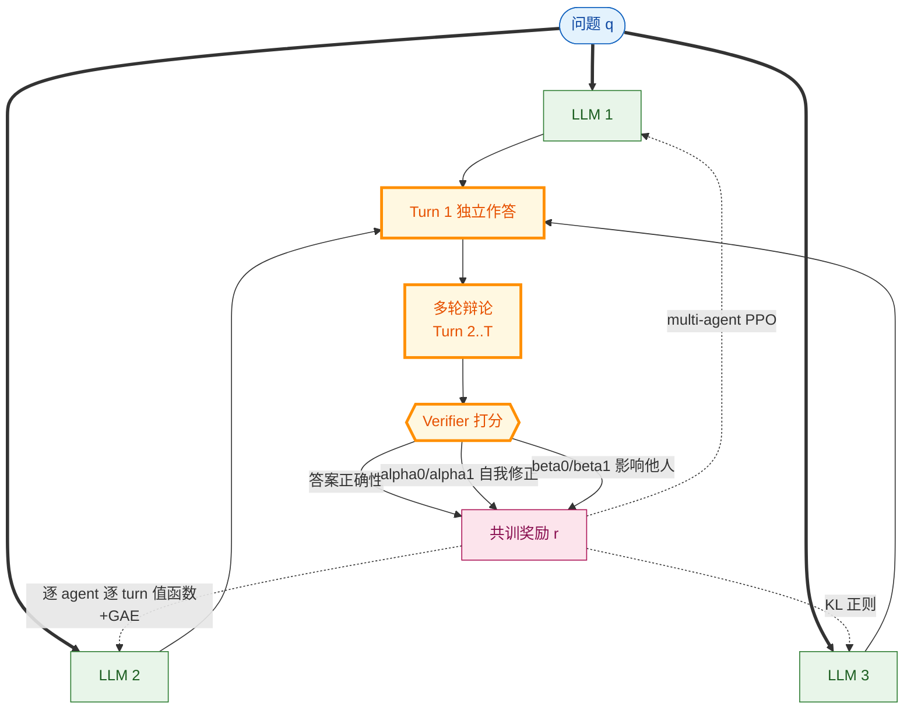

# MAPoRL: Multi-Agent Post-Co-Training for Collaborative LLMs with Reinforcement Learning

- arXiv: https://arxiv.org/abs/2502.18439
- Source: https://arxiv.org/abs/2502.18439
- Project: https://github.com/chanwoo-park-official/MAPoRL
- 本地 PDF：`papers/rl/agentic-training/MAPoRL_2502.18439.pdf`
- Year: 2025 (ACL 2025)
- Category: rl
- Priority: high

## 一句话总结

MIT + Stanford + Amazon + UMD（Chanwoo Park 一作，Ozdaglar/Zhang 挂名）提出多智能体后协同训练范式：多个 LLM 先独立作答、再多轮辩论，一个 verifier 同时给"答案正确性"与"讨论质量"打分，四类协作激励（α0/α1 自己改对/被说服，β0/β1 错而有用来影响/说服他人）塑形奖励后用 multi-agent PPO 联合共训——理论（T=2 矩阵博弈）与实验共同证明：**对固定对手的单智能体训练学不会合作，SFT 模仿高质量协作轨迹也学不会（反而 -11 分），只有联合 RL 共训才产生真协作**，且增益来自协作能力而非领域知识（solo 成绩不变），可泛化到未见域、可迁移到异构模型对（Phi3 3.4B + Llama3-8B）。ACL 2025 长文，多智能体 RL 后训练这条线的开山之作。

## 九问速览

1. **Problem**：多智能体工作流全靠 prompt 现成 LLM"假装合作"——辩论轮数增加并不稳定提升（Huang et al. 2024），LLM 从未为"合作"这个目标被训练过。
2. **Bottleneck**：合作是对手条件下的策略问题——对手不合作/非策略性时，单智能体最优响应是回避合作（Observation 1）；SFT 只模仿交互表面，学不到策略性让步与说服。
3. **Insight**：把协作行为变成 RL 的优化目标本身：verifier 对"讨论过程"打分（不只是答案），用奖励塑形把"被正确信息说服""错误但有用的发言"变成可学习信号。
4. **Method**：独立作答 → 多轮辩论 → verifier 打分（答案 + 四类讨论激励）→ multi-agent PPO（状态=交互历史拼接，逐 agent 逐 turn 值函数 + GAE，KL 正则）联合更新全部 LLM。
5. **Evidence**：GSM8K 上 off-the-shelf phi-3 辩论 3 轮净改善仅 1.15%（第 3 轮甚至 -4.95%），MAPoRL 训练后 12.03%；ANLI 4.01% vs 1.09%；训后模型随轮数单调上升而现成模型不升。
6. **Ablation**：α1=2 使"跟对多数"转移 +9.5%；β0=2（奖励"错而有用来"）使 Δ0 +17.2% 而 β1（正确时有说服力）反而 -1.32%——**有用性比正确性更该被奖励**；solo 成绩不变（0.609→0.611）证明增益非知识。
7. **Assumption**：verifier 打分与真实协作质量相关；小模型（3.8B）容量足以承载"协作策略"；奖励塑形的四参数网格 {0,1,2} 足够表达激励。
8. **Failure**：SFT 在 top-10% 高质量轨迹（1,280 条）上训练使 turn-2 掉到 0.578（Δ=-0.111）、turn-3 掉到 0.525——模仿协作表面反而伤害；异构共训受 GPU 显存限制只能 2-agent 2-turn。
9. **Opportunity**：verifier 本身不训练（固定 LLM 打分）；只有 3 turn 辩论一个工作流；未测工具调用/长 horizon 场景；与 Dr. MAS（agent-wise 归一化）正交可叠加。

| 维度 | 论文答案 |
|---|---|
| Perception | 每个 agent 看到：问题 + 全部历史发言（逐 turn 拼接） |
| Closed-loop | 多轮辩论即闭环：每轮基于他人上轮发言重新作答 |
| Correction | α 激励显式奖励"错→对"的自我修正与"被正确说服" |
| Deployment | 推理时即插即用：训后模型直接放进辩论工作流，无额外系统 |

## 核心技术

*架构速览：多智能体后协同训练——辩论工作流产生交互轨迹，verifier 对答案与讨论过程双重打分，四参数激励塑形后作为 multi-agent PPO 的共训奖励，逐 agent 逐 turn 学值函数*

1. **范式主张（co-training > solo training > prompting）**：把"多智能体协作"从 prompt 工程问题改造成训练问题。三个对照层次：(a) 现成 LLM 辩论——轮数不涨分；(b) 单智能体 RL 对固定对手——学到的是 best-response 回避合作；(c) SFT 高质量协作轨迹——反而掉分；只有 (d) 联合 RL 共训有效。
2. **协作博弈理论（T=2, C(q)=1）**：对手以 π(q) 概率合作时，agent 选择合作的条件是 (Rsyn−Rind)π(q) ≥ Rind−Rcol（Observation 1——对手不合作则我也不合作）；双方都带熵正则最大化各自累计奖励时，τ→0 下合作的条件变为 Rsyn > max(3Rcol−2Rind, 2Rind−Rcol)（Observation 2，借 Zhang & Hofbauer 2016 的矩阵博弈结果）——**共同优化天然把"协同奖金 Rsyn"放大成合作动机**，这是奖励塑形的理论依据。T=10/20 的玩具实验复现：固定对手 π=0.5-0.7 时单智能体策略回避合作，联合优化则稳定合作。
3. **multi-agent PPO 实现**：状态 = q ⊕ 历史全部发言 ⊕ 当前部分生成；每个 agent 每个 turn 有独立值函数 V(ix_ta; θ_vta)（期望累计 verifier 分，含未来轮次他人得分——这是"多智能体性"的来源：我的值函数依赖他人的未来行为）；GAE 估优势；PPO-clip 代理损失 + 值损失 + KL(参考模型) 正则。
4. **四参数激励塑形**：按 (答案权对错 t→t+1, 多数对错) 的 2×2 转移矩阵设计——α1：多数对时从错改对（被正确说服）；α0：多数错时坚持从对改错外提取有用信息（批判性坚持）；β1：自己对时成功说服他人；β0：自己错但发言让他人下轮变好（**错而有用来**）。
5. **异构模型共训**：Phi3-3.4B + Llama3-8B（弱模型）共训后协作增益超过各自 solo——不同基础模型的强弱互补在共训下被放大，说明学的是交互策略而非共享知识。

## 底层原理与数学推导

**多轮辩论的共训目标**。对 agent a 在 turn t 的第 x 个 token，值函数：

$$V^a_t(i^a_{tx}) = \mathbb{E}\left[\sum_{x'=x}^{\mathrm{len}(s^a_t)} r_\theta(q, s^a_{t,1:x'}) \;\middle|\; q, i^a_{tx}\right]$$

其中 per-token 奖励只在句末非零（1(x'=len)·R_θ(q,s_t^a)）减 KL 正则项 λ_KL·KL(π_ref ∥ π_θ)。**关键在输入定义**：i^a_tx = q ⊕ (⊕_{t'<t, j} s^j_{t'}) ⊕ s^a_{t,1:x}——agent a 的值函数显式条件于其他 agent 的历史动作，因此优势估计 A(ix;θ,θ_v) 捕捉的是"在这个协作局面下我的这步发言好坏"，梯度穿过对手策略生成的状态——标准的 MARL 非平稳性在这里被"对全组联合执行 PPO"吸收。

**Observation 2 的博弈论骨架**。T=2 两 agent 同时决定合作(a0)/独立(a1)，收益由 (Rcol, Rind, Rsyn) 与阈值 C(q) 构成。带熵正则 τ 的 logistic Q-learning 类动力学的平稳分布对应两点博弈的 quantal response 均衡；τ→0 时均衡趋向演化稳定策略，代入合作/偏离的收益差得 Rsyn 的阈值条件——所以塑形只需抬高 Rsyn（协同时的总奖励），无需手写协作规则。

**为什么 SFT 失败**。高质量轨迹是"结果好的交互"，但策略性合作的关键行为（暴露自己的不确定、给对手可用的部分信息、被说服后改口）在边际分布上与"单轮答对"的特征高度重叠，SFT 的 MLE 目标只会强化表面模式；而 RL 的优势信号直接作用于"这轮发言让下轮多数票变对了吗"的因果链上（β0 项），这是行为克隆给不了的信用分配。

## 物理直觉解释

把三个 LLM 想成三个只见过棋谱没下过双人配合牌的牌手：看过再多"好配合"的录像（SFT），上手还是各打各的——因为配合的收益要在"对手也配合"时才兑现，录像里学不到"我此刻喂信息给他，他下一手会接住"的因果闭环。MAPoRL 做的事是让三个牌手**在同一桌上真打**，而且只发一种奖励：你们这局配合出来的结果。打多了，"喂牌"这个动作因为经常导向赢局而被强化——哪怕喂牌者自己那手是亏的（β0）。这就是共训与模仿的分界：合作是两人条件策略的纳什解，只能在对局中收敛出来。

## 工程细节与实操指南

- 基座：Phi-3-mini-4k (3.8B) 为主；异构实验 Qwen2.5-3B、Llama3-8B；训练用 multi-agent PPO（作者仓库基于 TRL 改造，含多 agent 轨迹收集与逐 agent 值函数头）。
- 辩论工作流：3 agent × 3 turn，每轮回答带 600 token 上限（MAPoRL 训练时更紧）；verifier 用 LLM 打分器实现（也支持人工/神经网络）。
- 激励参数搜索空间小（α, β ∈ {0,1,2}），论文推荐 β0 与 α1 开启；先跑 (0,0) 基线再按转移矩阵诊断该加哪项。
- 数据量级：GSM8K 训练集直接用（12.8k 轨迹量级），SFT 对照用了 top-10% 共 1,280 条仍失败——不要试图用"更干净的协作数据 SFT"替代 RL。
- 复现入口：github.com/chanwoo-park-official/MAPoRL（ACL'25 版本）。

## 实验协议清单

- 任务：GSM8K（数学）、ANLI（自然语言推断）两个域；评 unseen 域泛化（ANLI 上训 GSM8K 模型之类未交叉报告，泛化结论来自 benchmark 间迁移叙述，需查附录）。
- 主对照：off-the-shelf 辩论 vs MAPoRL 训练（α/β=0/1/2 三档），指标 accuracy vs turn 数（1/2/3）。
- 知识 vs 协作控制：训后模型只给原始问题（无交互历史）测 solo——GSM8K 0.604/0.611 vs 0.609 baseline，差异在噪声内。
- 转移矩阵分析：Right→Right/Wrong→Right 等四象限比例随轮数变化，报 Net Improved。
- 异构共训：2-agent 2-turn（显存限制），Phi3+Qwen2.5-3B、Phi3+Llama3-8B 两组。
- SFT 对照：同量级数据、更宽 token 限制（600）、top-10% 三重过滤——排除"数据不够好"的解释。

## 消融实验与分析

- **激励分解**（Table 3/4）：α1=2 → Δ1 +9.5%（被正确说服有效）；α0=2 → Δ0 +2.57%（抵抗错误多数有限）；β1=2 → Δ1 −1.32%（"正确且有说服力"不该额外奖励——已是自然动机）；β0=2 → Δ0 +17.2%（**最大单项：奖励"错误但让他人变好"的发言**）。组合启示：协作系统该为"过程贡献"付费，不为"结果正确"重复付费。
- **轮数响应**（Figure 2）：off-the-shelf phi-3 在 GSM8K 3 轮内不涨（~0.61 平），MAPoRL 训后随轮数升到 ~0.75+；ANLI 同型（0.48→0.54）。这是"训出了协作能力"最直观的曲线形态证据。
- **SFT 反例**（Exp 5）：两档温度复测均稳定掉分（turn-2 -0.111 / turn-3 -0.114）。
- **异构协同**（Exp 4）：弱模型 Llama3-8B solo 更差，但共训组合超两个模型各自的组合基线。

## 技术权衡（Trade-off）

- **训练成本 vs 部署收益**：共训要同时载入/更新多个 LLM（论文被迫 2-agent 2-turn 做异构），推理时零额外开销；Dr. MAS 的统一 GPU 池框架正是解这一痛点的后续。
- **verifier 质量 = 天花板**：奖励完全由打分器定义，打分偏差直接变成协作策略偏差；论文用 LLM verifier 但未研究 reward hacking 边界。
- **辩论工作流单一**：结论绑定"同步多轮辩论"这一种拓扑；异步/工具调用/角色分工工作流（Dr. MAS 的 orchestration）是否同样成立待验证。
- **小模型容量**：3.8B 上成立，1.5B 级是否够装"对手建模"未测。

## 技术价值与演进定位

多智能体 LLM 研究从"prompt 出协作"（Debate/MetaGPT/ChatDev）到"训练出协作"的分水岭。演化线：More Agents（'24，采样-投票证明多 agent 有增益）→ MoA/GoA（'24-'26，推理时聚合架构）→ **MAPoRL（'25，RL 共训范式）** → Dr. MAS（'26，多智能体 RL 的稳定性理论+异构框架）。对本库主线（机器人 RL/VLA）的启示：机器人 fleet 共享奖励的联合 RL（multi-robot co-training）、VLA 主干+动作专家的共训目标设计，都能套用"过程激励塑形 + 逐 agent 值函数"的骨架。

## 与其他论文的关系

- **arlarena**（库内）：单智能体 RL 稳定性的系统研究；MAPoRL 把同一问题推到多智能体，Dr. MAS 补上理论。
- **dr-mas**（库内，同期拉取）：直接继承 MAPoRL 的共训设定，指出 GRPO 全局基线在异构 agent 上失稳并给出 agent-wise 归一化 + 多 LLM 训练框架。
- **goa / more-agents**（库内，同期拉取）：推理时多智能体路线——GoA 负责选谁参与怎么聚合，More Agents 证明最朴素的采样投票就有 scaling；与 MAPoRL 的训练路线正交：先 GoA 选出好组合，再 MAPoRL 共训。
- **tongyi-deepresearch**（库内）：单 agent 严格 on-policy GRPO + 环境工程；MAPoRL 相当于把它的 RL 配方换成多智能体版本（verifier 奖励→讨论激励奖励）。
- **SFT 与 RL 之争**：与库内 humanvid-selfimprove（SFT 自我模仿会放大误差）互证——交互行为的模仿学习有系统性失败模式。

## 精读问题

1. verifier 打分若对"表面礼貌的让步"系统性偏高，四参数激励各自会怎么被 hack？β0 与"废话激励"的边界在哪？
2. Observation 2 的阈值条件依赖 Rsyn 可设计——实际 verifier 给的分数是连续的，"协同奖金"如何从连续分数里分离出来（还是根本没有分离）？
3. 值函数条件于全部历史，3 turn 时上下文 ~4k；horizon 拉长后 per-agent per-turn 值函数的数量与 KV 复如何扩展（Dr. MAS 的 lifecycle 管理是否够）？
4. 异构共训时两个模型的 KL 参考不同、学习率不同——论文如何防止强模型把弱模型"带偏"成自己的复读机？
5. 把辩论换成"规划者-执行者-批评者"的角色拓扑，α/β 激励是否需要重新设计，还是转移矩阵框架直接适用？
