# Polar: Agentic RL on Any Harness at Scale

- arXiv: https://arxiv.org/abs/2605.24220
- Source: https://arxiv.org/abs/2605.24220
- Project: https://github.com/NVIDIA-NeMo/ProRL-Agent-Server
- Local PDF: `papers/rl/agentic-training/Polar_2605.24220.pdf`
- Year: 2026
- Category: rl
- Priority: high

## 一句话总结

NVIDIA 的 Polar（重写自其前作 ProRL Agent Server，已注册为 NeMo Gym 环境之一）回答一个系统层问题：**能否不打开黑箱就给任意 agent harness 做 RL？** 它把集成边界从"harness 内部事件循环"移到所有 LLM agent 唯一共有的接口——模型 API 调用边界：gateway 代理在 harness 零改动、零感知的情况下捕获 token 级请求/响应与 logprobs，重构出 trainer 直接可用的 token-faithful 轨迹；runtime 预热、执行、轨迹重构、评测与 trainer 回调全部拆成异步服务边界（rollout-as-a-service）。同一 Qwen3.5-4B 基座用朴素 GRPO 训练后，SWE-Bench Verified pass@1 在 Codex/Claude Code/Qwen Code/Pi 四个 harness 上分别 +22.6/+4.8/+0.6/+6.2 点；prefix merging 轨迹重构把 3 个训练步的 wall-clock 从 189.5 分钟压到 35.2 分钟（5.39 倍），rollout GPU 利用率从 20.4% 提到 87.7%。

## 核心技术

1. **代理即 rollout 边界（proxy-based rollout）**：中心问题是 "Can we train agents with RL without opening the box?"。关键观察：agent 内部实现千差万别（Python 脚本、CLI 程序、闭源二进制），但都必须调用模型 API。Polar 让 harness 通过正常的环境变量/配置文件把 model base URL 指向 gateway，代理对每个请求做四步：(a) 检测 provider API（按路径与 header 区分 Anthropic Messages、OpenAI Chat Completions、OpenAI Responses、Google generateContent 四种风格）；(b) 归一化请求（provider transformer 把角色、content parts、tool 定义、stop 控制等转成本地推理服务器消费的 OpenAI Chat 形状，并附加 `logprobs=true`）；(c) 捕获 token 级数据（completion record：request/response messages、prompt token IDs、sampled response token IDs、finish reason、logprobs）；(d) 把响应转回 harness 期望的 provider schema。流式请求的实现是取上游非流式响应再合成 provider-shaped 流，既保住 SSE 兼容又简化忠实捕获。
2. **双组件架构**：rollout server 接收 TaskRequest，按 `num_samples` 展开成若干 session（调度单元，含 session ID、task ID、timeout budget、runtime/agent spec、trajectory builder、evaluator、callback URL），持久化紧凑终态并提供轮询；gateway node 拥有每个 session 的完整生命周期（启动 runtime → 备好 harness → 执行 → 建轨迹 → 评测 → 清理），并同置托管 harness 调用的 proxy 端点——同置让完成捕获直接挂 session registry，省掉独立 trace 收集服务。训练框架与 Polar 服务器完全解耦（示例集成是 Slime：后台 worker 提交任务、收回调、把 trace 转成 Sample 对象再做 trajectory-aware reward 后处理）。
3. **阶段隔离的异步 staging**：长时程 harness rollout 混合了多种成本（runtime 启动、依赖安装、执行、评测器准备、跑测试、打 patch、清理）。每个 gateway 内用隔离 worker 池 INIT/RUNNING/POSTRUN 加有界 READY 缓冲：CPU 重的 runtime 准备在后台推进，不阻塞 GPU-bound 的 harness 执行；evaluator prewarm 在 agent 运行期间就开始准备干净评测 runtime；每个 session 一个共享 deadline，超时后只要已有模型调用被捕获仍进 POSTRUN，恢复部分轨迹并标记 terminal timeout 状态。
4. **两种轨迹重构策略（registry 可扩展）**：builder 接口把 CompletionSession（一次 harness session 捕获的全部模型调用）转成 Trajectory（一或多个 Trace：prompt/response token IDs、loss mask、messages、tool 定义、logprobs、reward、元数据）。`per_request` 是保守基线——每次 completion 一条 trace，单调用无损但把复杂编码问题碎成数百条短样本；`prefix_merging` 在会话保持 append-only 历史处重建长链（数学见下节），compaction、子 agent、prompt 重写天然断链成新 chain。
5. **评测与奖励传播**：evaluator registry（内置 session-completion reward、可配置 test-on-output、SWE-Bench/SWE-Gym harness evaluator，评测时可在新 runtime 里刷新执行）；outcome reward 可广播到每条 trace，process reward 场景需 per-trace 分配。论文实测 per_request + outcome 广播会出现明显 reward hacking（请求级 trace 拿到会话级 credit）。
6. **极小接入面**：harness adapter 只装配置、注册 MCP servers/skills、写 provider 设置、返回启动命令；内置 `claude_code`、`codex`、`gemini_cli`、`qwen_code`、`opencode`、`pi` 快捷方式。runtime 实现统一接口（start/stop/exec/upload/download/cancel），首版支持 Docker 与 rootless Apptainer（HPC 场景），任务可无摩擦切换隔离后端。

## 底层原理与数学推导

数据流全景（harness 全程黑箱，训练信号只在代理边界产生）：

```mermaid
graph LR
    RS["Rollout server: expand TaskRequest into sessions"] -- dispatch --> GW["Gateway node"]
    GW --> INIT["INIT pool: start runtime, prepare harness"]
    INIT --> RDY["READY buffer: initialized runtimes"]
    RDY --> RUN["RUNNING pool: native harness runs unchanged"]
    RUN -- "model API call" --> PX["Proxy: detect provider, normalize, capture, return"]
    PX --> INF["Local inference server (OpenAI Chat shape)"]
    PX --> REC["Completion record: prompt ids, sampled ids, logprobs"]
    RUN --> POST["POSTRUN pool: build trajectory, evaluate, callback"]
    REC --> POST
    POST --> TR["Async trainer (Slime GRPO)"]
    TR -- "weight sync" --> INF
```

**问题形式化**。一次 harness session 产生一列按时间有序的 completion $C_1, \ldots, C_T$，其中 $C_i$ 有 prompt token 序列 $p_i$、raw 采样响应 token 序列 $a_i$、响应 logprobs $\ell_i$ 和 prompt/response messages $m_i$。RL 训练信号的正确性前提是：**梯度只附着在行为策略真正采样过的 token 上**。难点是 provider API 返回的是文本、tool-call JSON、reasoning 字段或流式事件，而非推理后端实际使用的 token ID 与 logprobs——vLLM 与 Agent Lightning 讨论的 retokenization drift（解码再重编码会产生不同 token ID）正是 Polar 要在任意 harness 上规避的。

**prefix merging 的链划分**。builder 不假设整个 session 是一条对话，而是把 completions 划分为有序链：

$$\mathcal{G} = \{G_1, \ldots, G_J\}, \qquad G_j = (C_{i^j_1}, C_{i^j_2}, \ldots, C_{i^j_{K_j}}), \quad i^j_1 < i^j_2 < \cdots < i^j_{K_j}$$

新 completion 加入已有链需同时满足两个条件：归一化消息级 grouping key 认定它是候选延续，且与链尾 prompt 满足严格 token 前缀关系。对链内相邻 completion $C_{i^j_m}$ 与 $C_{i^j_{m+1}}$，检查为：

$$p_{i^j_{m+1}}\big[1 : |p_{i^j_m}|\big] = p_{i^j_m}$$

子 agent、并行分支、context compaction、prompt 重写、独立工具会话都不满足该前缀关系，自然落成新链而不是被强行拼进一条全局 trace。

**链内合并与 interstitial token**。合并的核心困难：$p_{m+1}$ 包含上一轮 assistant 回复的**服务器规范渲染**加 harness 插入的下一轮上下文——但行为策略的 token 是 raw 采样的 $a_m$，绝不能从规范渲染里复制。记 end-of-turn token ID 为 $e$，定义规范尾部：

$$t_m = p_{m+1}\big[|p_m| + 1 :\big]$$

在 $t_m$ 中定位第一个 $e$：若 $a_m$ 已以 $e$ 结尾，则 interstitial $u_m$ 是该 $e$ 之后的后缀；否则 $u_m$ 从该 $e$ 开始（保证 assistant 轮先闭合）。整条链代表的 token 序列为：

$$z^{(j)} = p_1 \,\|\, a_1 \,\|\, u_1 \,\|\, a_2 \,\|\, u_2 \,\|\, \cdots \,\|\, a_K$$

发出的每条链对应一条 trace $\tau^{(j)}$：prompt 存 $p_1$，response 存 $a_1 \| u_1 \| \cdots \| a_K$；loss mask 在采样的 $a_m$ 上为 1、在规范 interstitial $u_m$ 上为 0；$a_m$ 的位置复制真实 response logprobs，interstitial 槽位填合成 logprob 条目以保持 `response_logprobs` 与 `response_ids` 对齐——可训性完全由 loss mask 控制。由此得到每条 trace 的正确性不变量：**每个可训练 token 都与 rollout 时的行为策略逐 token 一致，所有非生成 token 都被 mask 掉**。

## 物理直觉解释

**在电话线上装窃听器，而不是拆开对讲机**。传统 RL 基建（SkyRL-Agent、PRIME-RL）要求 agent 搬进框架的环境接口，相当于把每一台对讲机拆开、把电路改接到统一总线上——harness 一旦是闭源二进制或内部实现不暴露，这条路直接走不通。Polar 的观察是：不管对讲机内部怎么设计，它打电话都要经过同一根电话线（模型 API）。在电话线上装窃听器（proxy），既能完整听到通话内容（token、logprobs），又完全不用关心说话者为什么这么说（harness 的规划、工具管理、停止逻辑全部不可见也无所谓）。

**电源转接头与统一插座的区别**。Agent Lightning、rLLM 这类低侵入方案给 agent 发一个"记录仪 SDK"，相当于要求每台电器换一个带计量芯片的插头——侵入更小但仍是改造。Polar 的 provider transformer 更像转接头：harness 插的是 Anthropic 形状还是 Google 形状的插头，转接头都把它变换成本地推理服务器这个统一插座（OpenAI Chat 形状），电流（token 数据）在转接头内部被抄表。这个选择比通用可观测性插桩窄，但对 CLI 程序、包管理工具、二进制分发的 harness 都稳。

**把散珠子串回项链，扣子是 $e$**。一次 harness session 会有几十上百次模型调用，per_request 重构相当于把每颗珠子单独装袋——信息没丢，但 trainer 拿到的是一大袋碎片。prefix merging 做的事是串项链：只要后一条 prompt 的开头逐 token 等于前一条 prompt（append-only），就串上同一根线；每次模型自己的回复（$a_m$）是真珠子、标价可训，harness 在两轮之间塞进去的上下文（$u_m$）是串线用的隔珠、明码标零。串接的"扣子"就是 end-of-turn token $e$：在规范尾部里找到第一个 $e$，就精确切开了"上轮回复的规范复制品"与"新增上下文"——这样哪怕 harness 重排了上下文，真珠子也永远不会被赝品顶替。

**餐厅的备菜、烹饪、收银分池**。一次编码任务的 rollout 里，最慢的往往不是模型推理，而是起容器、装依赖、跑测试。Polar 把 gateway 内部拆成 INIT/READY/RUNNING/POSTRUN 四个池子：备菜（runtime 准备）在后台提前做，READY 缓冲里囤着已初始化的 runtime，灶台（GPU-bound 的 harness 执行）永远有活干，收银（评测、回调、清理）与下一单并行。evaluator prewarm 相当于客人还在吃主菜时就开始摆甜品桌——干净评测 runtime 在 agent 运行中就准备好。

## 工程细节与实操指南

- **代表性 Task payload**（附录 A.3）：`num_samples: 8`、`timeout_seconds: 1200`、runtime 用 Docker 后端 + host 网络、`agent.harness: codex`、`builder.strategy: prefix_merging`、`evaluator.strategy: swebench_harness`（`refresh_runtime: true`，patch 命令 `git add -A && git diff --cached --binary`）、`callback_url` 指回 trainer、metadata 带 `policy_version` 与 `rollout_step`。
- **Service API**：`POST /rollout/task/submit`（非阻塞提交）、`GET /rollout/task/{task_id}`（轮询部分/最终结果）、`GET /rollout/status`（任务与节点状态）、`POST /callbacks/session_result`（gateway 回调）、`POST /nodes/register` 与 `POST /nodes/{node_id}/heartbeat`（网关成员与调度指标维护）。
- **SWE-Gym GRPO 超参数**（Table 4）：基座 `Qwen/Qwen3.5-4B`，数据 `NovaSky-AI/SkyRL-v0-293-data` 训练 split（293 任务），trainer 为 Slime 异步 GRPO，1 epoch，rollout batch size 4，每 prompt 16 采样，trace 构造 `prefix_merging`，Adam，lr $1 \times 10^{-6}$，weight decay 0.1，TIS 开启。集群拓扑与 worker placement 被论文明确省略；RL 阶段集群规模与总训练步数未在文中报告（待确认：附录 A.2 声明省略，训练曲线图未标注总步数）。
- **TIS 细节**：论文仅在超参数表中标注 "TIS: Enabled"，未给出公式与实现（待确认：TIS 的具体修正机制需查代码仓库 `examples/swegym_slime_grpo`）。
- **离线 SFT 数据生成配置**：单个 8xH100 SGLang serve 任务托管 Qwen3.5-122B-A10B（TP=8，`max_model_len=32,768`），驱动 pi-coding-agent v0.67.68，对 7 个 SWE-Gym 仓库共 1,638 个实例；每任务一个 Apptainer SIF（SWE-Gym 参考镜像 + Node.js 22 + harness）；`max_concurrent=5-8`、`max_retries=1`、单任务超时 3,600 秒；`empty_generation` 的轨迹重试一次。约 64 GPU 小时（interactive partition）产出 504 条合格轨迹。
- **发布语料格式**：每行含 SWE-Gym 实例元数据（`instance_id`、`repo`、`problem_statement`、`base_commit`、`version`）+ 完整多轮对话（OpenAI 风格 messages，含 `tool_calls`/`tool_call_id`），以产出合格 patch 的 assistant 轮收尾；平均每 session 104 条消息、51 个 assistant 轮，长尾超过 200 轮；HuggingFace 发布（`nvidia/polar-swegym-pi-qwen35-122b-a10b-trajectories`），Apache-2.0，按仓库分层的 90/10 train/test split。
- **实操建议**：接新 harness 只需写 adapter（配置 + 启动命令）；流式 harness 无需改造（代理合成流兜底）；评测想拿干净状态就开 `refresh_runtime`；想复用同一部署做拒绝采样/verifier 训练数据/偏好对，只需改提交端 shard，编排代码零改动——论文明确说扩到全量 2,438 实例 SWE-Gym、换更强 teacher、加 codex/claude_code harness 都不动编排代码。
- **合成流的一个未讨论点**：代理把流式请求实现为"上游非流式响应 + 合成 provider-shaped 流"，保住了 SSE 兼容与忠实捕获，但 harness 感知的流式时序不再等于真实 upstream 时序（待确认：论文未讨论该差异对依赖流式节奏做决策的 harness 是否有影响）。

## 消融实验与分析

**主实验：同一 Qwen3.5-4B 基座，四个 harness 上的 SWE-Bench Verified pass@1**（Table 1）：

| Harness | Base | Polar RL | Gain |
|---------|------|----------|------|
| Codex | 3.8% | 26.4% | +22.6 |
| Claude Code | 29.8% | 34.6% | +4.8 |
| Qwen Code | 34.6% | 35.2% | +0.6 |
| Pi | 34.2% | 40.4% | +6.2 |

**核心结论：** 收益大小与"harness 对基座的原生熟悉度"成反比——Codex 对 Qwen 模型是完全陌生的动作协议/上下文策略/patch 提交风格，基座只有 3.8%，harness-native RL 直接拉到 26.4%；而 Qwen Code 本就为 Qwen 调优（34.6%），仍能再涨 0.6。训练曲线（首 10 步 vs 末 10 步平均 reward）同样印证：Codex 9.5%→54.5%、Claude Code 28.8%→67.0%、Qwen Code 61.6%→66.0%（噪声更大）、Pi 61.6%→76.2%。

**轨迹 builder 消融**：同一模型、硬件、拓扑下，仅切换重构策略，比较同样 3 个训练步（Fig. 5b）：

| 指标 | per_request | prefix_merging | 差异 |
|------|-------------|----------------|------|
| trainer 侧更新数 | 1,185 条请求级更新 | 218 条合并 trace 更新 | 缩减 5.4 倍 |
| wall-clock 时间 | 189.5 分钟 | 35.2 分钟 | 5.39 倍加速 |
| rollout GPU 平均利用率 | 20.4% | 87.7% | +67.3 点 |

**核心结论：** prefix merging 用更少的 trainer-facing 样本覆盖同样的交互，直接消解长时程 rollout 的更新碎片化；而 per_request + outcome reward 广播的组合还观察到显著 reward hacking——请求级 trace 拿到了会话级 credit 却没有会话归一化或 process reward model 做信用分配，这正是 dataprm 一类过程奖励模型可以补位的地方（论文把 session 归一化与 PRM 式信用分配列入 roadmap）。

**离线数据生成的按仓库接受率**（Qwen3.5-122B-A10B + pi harness，Table 2）：

| 仓库 | Attempts | Accepted | Rate |
|------|----------|----------|------|
| getmoto/moto | 343 | 184 | 53.6% |
| python/mypy | 257 | 101 | 39.3% |
| pandas-dev/pandas | 477 | 98 | 19.7% |
| dask/dask | 141 | 25 | 17.7% |
| 总计 | 1,638 | 504 | 30.8% |

**核心结论：** 单一比特过滤器（FAIL_TO_PASS 全过 + PASS_TO_PASS 全绿）下总体接受率 30.8%，但按仓库从 53.6%（bug-fix 型 moto）到 17.7%（长测试套件的 dask）波动剧烈——离线数据管线的产量瓶颈在任务难度分布而非基建吞吐。

## 技术权衡（Trade-off）

| 优势 | 劣势与工程代价 |
|------|---------------|
| 零侵入：闭源二进制 harness（如 Codex CLI）也能进 RL 训练回路，harness 的 prompt/工具/上下文工程原样保留 | 观测粒度止步于 API 边界：harness 内部检索、规划、子 agent 编排不可见，process reward 只能靠 per-trace 分配机制补，而论文自己实测了 outcome 广播的 reward hacking |
| harness、训练框架、RL 算法三者全部解耦，rollout 可独立于 GPU 训练扩缩 | 多服务边界（task API、节点注册、heartbeat、回调）带来部署与运维复杂度，小规模实验的固定成本高于一体化框架 |
| prefix merging 消解更新碎片化（5.39 倍加速、87.7% 利用率） | 合并依赖 append-only 前缀关系成立；compaction/子 agent 密集的 harness 会频繁断链，退化回许多短 trace，收益缩水 |
| token-faithful 重构规避 retokenization drift，训练信号正确性有不变量保证 | interstitial 槽位填合成 logprob 只为对齐 shape，若下游误用这些数值（不看 loss mask）会引入噪声——正确性依赖 trainer 端契约 |
| 流式 harness 零改造（合成流兜底） | 合成流改变了 harness 感知的时序特性，论文未量化其影响（待确认项见工程细节节） |

## 技术价值与演进定位

Polar 把"训练目标本身就是复杂软件系统"这一 agentic RL 特有的系统难题，转化成了一个边界选择问题：集成点从 harness 内部（SDK 回调、环境接口）退到模型 API 端点。这步退让换来三个免费性质——harness 零改动（闭源也可训）、训练框架无关（Slime 只是示例）、RL 算法无关（GRPO 只是示例）。在库内的训练系统谱系里，它的直接前作是 ProRL Agent（提出 rollout-as-a-service），Polar 保留服务化思想但更换集成契约；与 LEGO-RL 的进程内代理相比，Polar 的 gateway 代理是外置服务，牺牲一点捕获粒度换取对任意 harness 形态的兼容；与 SkyRL-Agent/PRIME-RL 相比，它解决的是"训练目标如何进入管线"而非"管线本身如何高效"。它对 harness-native RL 的一个重要实证贡献是：**收益与 harness-模型匹配度强相关**（Codex +22.6 vs Qwen Code +0.6），说明这类系统的最大价值场景是把异构/陌生 harness 变成可训练对象，而非在已对齐的 harness 上继续榨取。框架对照表（async RL / async staging / rollout-as-service / harness 无关四项全勾）给出了后续 rollout 基建的检查单。局限同样清晰：过程信用分配、合成流时序、TIS 细节都还是开放问题。

## 与其他论文的关系

- **LEGO-RL**（notes/rl/lego-rl.md）— 最直接的对照：两者都把观测点放在模型边界以保 token 忠实，但 LEGO-RL 用与 rollout 引擎同置的进程内代理（额外捕获 MoE 路由决策做 routing replay），Polar 用外置 gateway 代理（支持四种 provider 协议翻译）——前者为保真度优化，后者为 harness 普适性优化。
- **ProRL Agent**（arXiv 2603.18815）— Polar 的直接前作：继承 "rollout 应该是服务" 的高层思想，但集成契约从"harness 实现服务内的 agent handler"换成"用户只给 harness adapter，代理从外部观察"，论文明确说 Polar 重写了 ProRL Agent Server。
- **SkyRL-Agent / PRIME-RL / Slime**— 一体化 RL 基建线：SkyRL-Agent 把 agent 执行整合进 RL 管线（要求 agent 适配基建），PRIME-RL 专注 trainer-inference 分离与 stale-policy 语义，Slime 提供 Megatron 训练 + SGLang rollout——Polar 定位为喂养这些 trainer 的 rollout 底座而非替代品，实验中正是与 Slime 联跑。
- **Agent Lightning / rLLM**— 低侵入插桩线：两者用 SDK 追踪/装饰器/模型网关收集 token 与 logprobs，但最小集成点是代码内回调图；Polar 认为对 CLI/二进制 harness 最可靠的最小集成点是 provider API 端点本身，并把它们列为框架对照表中 staging/service/harness 三项的"部分支持"。
- **Harbor（harbor-framework，评测框架）**— 注意与库内 notes/rl/harbor.md（TU Darmstadt 的机器人 harness engineering 论文，arXiv 2606.08610）**完全无关**：Polar 引用的 Harbor 是容器化 agent 评测框架，其 eval-first 设计与 Polar 的 harness-native 动机同源，差别在 Harbor 不翻译模型协议、不做训练数据契约，Polar 在同一执行风格上额外产出 token IDs/logprobs/loss masks/rewards。
- **OpenClaw-RL**（notes/rl/openclaw-rl.md）— 同被 Polar 引用对比：OpenClaw-RL 解耦 serving/rollout 收集/评判/训练但围绕 OpenClaw 生态与特定 recipe 组织，Polar 面向任意原生 harness 提交。
- **arlarena / harness-1**（训练系统线）— arlarena 关注 agentic RL 的稳定性统一框架（trainer 侧），harness-1 用状态外置 harness 训搜索 agent（harness 侧改造）；Polar 与它们分别占据"基建-算法"与"harness-基建"的正交位置。
- **dataprm**（应用线）— Polar 实测 outcome 广播导致 reward hacking 后明确把 process reward model 列为 roadmap，dataprm 的过程级奖励建模是该缺口的候选补位方案。
- **机器人侧对照（harbor / enpire / agentic-robotics-loop）**— 这些工作把真实环境噪声与自改进循环工程化；Polar 的"环境执行与 GPU 训练异步解耦"思想在机器人 rollout（长尾更重）场景同样适用，但代理边界需换成策略权重同步而非 API 转发。

## 精读问题

1. prefix merging 的前缀检查 $p_{i^j_{m+1}}[1:|p_{i^j_m}|] = p_{i^j_m}$ 要求逐 token 相等，但某些 harness 会在历史中注入时间戳或随机 ID 导致前缀永不严格成立——这类 harness 会全部退化成 per_request 碎片吗？归一化 grouping key 的具体归一化规则能否兜住这类情况？
2. 合成流（非流式上游 + provider-shaped 流）意味着 harness 收到 SSE 事件的真实时序被压缩，对于靠流式节奏做超时/重试决策的 harness，这会不会系统性改变其行为分布，进而让训练出的策略在真实流式端点上失配？
3. per_request + outcome 广播的 reward hacking 实验里，"会话归一化"与 PRM 式信用分配被列为 roadmap——若把 dataprm 式过程奖励接到 per-trace 分配上，碎成 1,185 条短样本的 credit 分配是否能追平 218 条合并 trace 的训练效率？
4. Codex +22.6 与 Qwen Code +0.6 的巨大差异提示收益上界由"harness 与基座的先验失配度"决定——能否用一个前置诊断量（如基座在 harness 下的初始 pass@1）来预测 RL 的边际收益，从而指导 harness 选型？
5. TIS 在超参数表中仅标 "Enabled"——它的截断/修正策略与 Polar 代理捕获的 rollout logprobs 如何配合，才能在 harness 改写上下文（interstitial 被重排）时保持重要性采样的无偏性？
