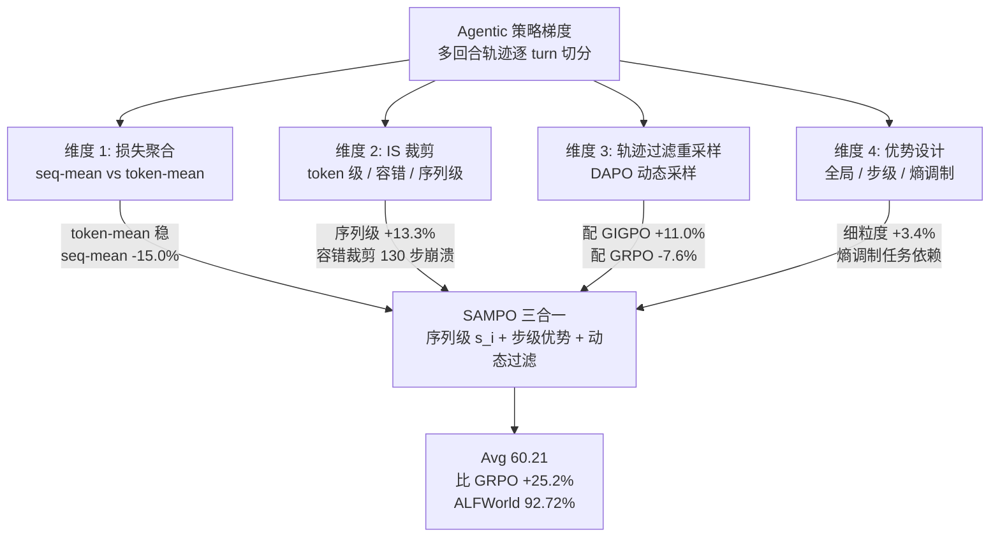

# ARLArena: A Unified Framework for Stable Agentic Reinforcement Learning

- arXiv: https://arxiv.org/abs/2602.21534
- Source: https://arxiv.org/abs/2602.21534
- Project: https://github.com/WillDreamer/ARL-Arena.git
- Local PDF: `/Users/luogu/physical_intelligence/papers/rl/ARLArena_2602.21534.pdf`
- Year: 2026（ICML 2026, PMLR 306）
- Category: rl
- Priority: high

## 一句话总结

ICML 2026 的 agentic RL 稳定性系统研究：先把多回合 ARL 训练拆成四个正交设计维度（损失聚合、IS 裁剪、轨迹过滤重采样、优势设计），在标准化测试床上逐一隔离评测，定位出崩溃主因——**容错裁剪带来短期收益但在 ~130 步后崩溃，序列级裁剪才稳定**——再把三个有效成分合成 SAMPO，四任务平均分比 GRPO 高 25.2%（ALFWorld 成功率 92.72%，反超 GPT-5.2 的 51.56%）。

## 核心技术

1. **标准化测试床（四层递进）**：行为克隆冷启动（Qwen3 自举高分轨迹做 SFT）→ 格式惩罚（强制 `<think>`/`<action>` 标签，违者扣分）→ k3 估计器的辅助 KL 正则 → 每个算法专属超参网格搜索（以最后 20% 训练步的成功率方差低于阈值为"稳定"判据）。
2. **策略梯度四维分解**：把 agentic 策略梯度（式 3）拆成 Loss Aggregation / IS Clipping / Trajectory Filtering / Advantage Design 四个正交轴，把 GRPO、GSPO、CISPO、SAPO、GIGPO、EMPG、DAPO 七个方法放进统一坐标系（Table 1 全公式对照）。
3. **崩溃根因诊断**：token 级（越界比率分解为上下界）+ 序列级（按优势符号 × IS 比率 × 熵分八组，画每组对 KL 的贡献）双层分析，锁定**负优势 + 低 IS 比率序列的累积**是崩溃驱动源。
4. **序列掩码修复**：直接 mask 掉负优势且 IS 比率低于 $1-\delta$ 的序列（GRPO^{SM}），把 CISPO 从崩溃边缘拉回 GSPO 水平。
5. **SAMPO**：序列级 IS 裁剪（$s_i$）+ 细粒度步级优势（$A'_i = A_i + \omega \cdot A^{step}$）+ 动态过滤三合一的统一 PO 方法。

## 底层原理与数学推导

**Agentic 策略梯度**。K 回合交互 $\tau$ 逐回合切开，得到式 (3)：

$$
\nabla_\theta \mathcal{L}(\theta) = \mathbb{E}_{\tau \sim \pi_{\theta_{old}}} \left[ \sum_{k=1}^{K} \sum_{t=0}^{T_k} \underbrace{w_t(y^{(k)})}_{\text{IS}} \underbrace{\nabla_\theta \log \pi_\theta\left(y^{(k)}_t | x^{(k)}, y^{(k)}_{<t}\right)}_{\text{log-prob}} \underbrace{A(x^{(k)}, y^{(k)})}_{\text{advantage}} \right]
$$

四个设计维度正是对这个公式四个因子的干预。

**序列级 IS 比率（GSPO/SAMPO 核心）**。token 级 $w_t$ 换成整条序列的几何平均：

$$
s_i(\theta) = \exp\left( \frac{1}{|T_i|} \sum_{t=0}^{|T_i|-1} \log \frac{\pi_\theta(y_t|x, y_{<t})}{\pi_{\theta_{old}}(y_t|x, y_{<t})} \right)
$$

长序列上单个 token 的极端比率被对数平均稀释——这是它比 token 级裁剪稳定的数学根源。**SAMPO 总目标**：

$$
\mathcal{L}(\theta) = \frac{1}{\sum_i T_i} \sum_i \sum_t \min\left(s_i A'_i,\ \mathrm{clip}(s_i, 1\pm\varepsilon) A'_i\right), \quad \text{s.t.}\ 0 < |\{y \mid \text{equiv}(a, y)\}| < G
$$

其中 $A'_{i,k} = A_i + \omega \cdot A^{step}(\hat{y}_{i,k})$ 融合全局结果优势与同状态分组的局部步级优势，约束项是 DAPO 式动态过滤（剔除全对/全错零梯度组）。

**损失聚合两种口径**：seq-mean-token-mean（$\frac{1}{N}\sum_i \frac{1}{T_i}\sum_t$，短轨迹每 token 权重大）vs token-mean（$\frac{1}{\sum T_i}\sum\sum$，全 batch 均权）。

**k3 KL 估计器**：$k_3(x) = \delta(x) - 1 - \log \delta(x)$，$\delta(x) = p/q$——控制变量法实现无偏低方差。

**序列掩码（GRPO^{SM}）**：$M_i = 1$ 当且仅当 $A_i \geq 0$ 或序列内平均 log-ratio 超过 $\delta$；否则整条 mask。

## 物理直觉解释

**为什么容错裁剪会崩**。CISPO（stop-gradient 保留越界 token 的梯度）和 SAPO（软衰减代替硬截断）的设计初衷都是"别浪费极端 token 的信息"。在多回合设定里这变成正反馈毒药：早期它们确实跑得快——梯度大、离开参考策略远、格式比率适应快；但**少数极端 token 的大更新让策略漂移，漂移让后续 rollouts 分布更歪，歪的分布里负优势样本的 IS 比率越压越低**，~130 步时梯度范数和 KL 双爆炸、格式比率崩塌、成功率跳水。像给油门很灵但没装限速器的车——市区起步快，上高速就解体。

**为什么序列级裁剪稳**。几何平均 $s_i$ 相当于把整条轨迹的漂移拿来投票：一个 token 想越界，会被其余几百个正常 token 的平均稀释掉。崩溃的种子（负优势 + 低 IS 比率）在 token 级裁剪下各自为政、在序列级下被绑成一束统一处理。序列掩码则更直接——论文证明这类序列是 KL 漂移的主要贡献者（八组分解图上其面积在崩溃期陡增），把它们整个 mask 掉等于**拔掉传染源而不是给每个病人限量服药**。

**动态过滤与格式学习的相互作用**（Finding 4 的微妙之处）。早期大量 rollout 组因格式错误全军覆没，格式惩罚放大后产生强隐式优势信号——模型靠**失败组**学会格式。DAPO 式过滤把这些全败组扔掉，GRPO 的优势信号多样性撑不住格式学习，性能反降（42.67）；GIGPO 天然有多样化优势信号，过滤后反而更稳（53.36）。**同一个技巧在不同优势结构下效果反转**——这是论文比"调参指南"深一层的地方。

**off-policy 陈旧度的量级**。多回合设定把 turn-wise 切分后的样本数放大，同一 rollout 阶段内后面的更新用的是更旧的策略数据。低陈旧度 87.34% vs 高陈旧度 74.99%（AIME pass@32）——在 agentic 任务里这个差距比单回合 RLVR 更陡。

## 工程细节与实操指南

- **框架与模型**：全部代码基于 verl；agentic-loop 架构协调 rollout 与环境交互，完整轨迹切段成单回合样本再优化。非数学任务用 SFT 版 Qwen3-4B，数学任务用 Qwen3-4B-base；一致性验证另跑了 Qwen3-8B（附录 C）。
- **任务套件**：ALFWorld、WebShop、Sokoban、TIR Math（AIME/AIME25，Pass@4）；硬件 H200/B200。
- **建测试床的增量顺序（ALFWorld，Table 2）**：先 BC（+20.71 成功率），再格式惩罚（+7.34），再 KL（+18.10），最后按算法搜超参——GSPO 的 $\varepsilon$ 从 e-2 收到 e-3 还有 +3.36，再收到 e-4 就反噬（−9.88）；SAPO 温度 1→2→3 全是负收益；DAPO max try 2→3 +22.15。**先修床再比武**是复现的关键。
- **崩溃诊断工具箱**（可直接搬到自己的 ARL 训练）：五联监控曲线（成功率 / off-policy KL / KL loss / 梯度范数 / 有效格式比率）+ 越界 token 比率的上下界分解 + 八组序列 KL 贡献分解。
- **开源**：github.com/WillDreamer/ARL-Arena.git（含训练配方）。
- 注意：论文图注称 SAMPO 平均分 59.55，而 Table 3 表体为 60.21——**内部数字不一致（待确认）**，本笔记引用以表体 60.21 为准；GRPO 的 46.16 为全任务平均，48.08 为前三任务平均。

## 消融实验与分析

**表 A｜四维主结果（Qwen3-4B-SFT，Avg 为论文 Table 3 平均分）**

| 维度 | 方法 | ALFWorld Succ | WebShop Score | Sokoban Succ | Avg | vs GRPO |
|------|------|--------------|---------------|--------------|-----|---------|
| 基线 | GRPO | 62.36 | 75.32 | 83.90 | 46.16 | — |
| 损失聚合 | GRPO^{ST} | 72.61 | 64.57 | 68.73 | 39.23 | −15.0% |
| IS-容错 | SAPO | 25.16 | 73.85 | 30.25 | 32.22 | −30.2% |
| IS-容错 | CISPO | 54.42 | 67.96 | 26.02 | 34.03 | −26.3% |
| IS-序列级 | GSPO | 78.61 | 85.29 | 82.22 | 52.28 | +13.3% |
| 优势设计 | GIGPO | 81.09 | 67.76 | 82.67 | 49.71 | +3.4% |
| 优势设计 | EMPG | 57.91 | 79.16 | 79.16 | 48.06 | −0.1% |
| 动态过滤 | DAPO_{GRPO} | 49.58 | 62.43 | 82.40 | 42.67 | −7.6% |
| 动态过滤 | DAPO_{GIGPO} | 60.55 | 88.10 | 86.20 | 53.36 | +11.0% |
| **三合一** | **SAMPO** | **92.72** | **88.37** | **88.86** | **60.21** | **+25.2%** |

**核心结论**：(1) 唯一稳定正增益的 IS 改动是序列级裁剪（GSPO +13.3%），两种容错裁剪都崩（−26~−30%）；(2) 细粒度环境优势（GIGPO）小而稳（+3.4%，ALFWorld 单项 +30.0%），熵调制（EMPG）任务依赖；(3) 动态过滤必须搭配多样化优势——配 GRPO 反而 −7.6%，配 GIGPO +11.0%；(4) SAMPO 把三个正交增益复合成 +25.2%，ALFWorld 成功率 92.72% 比 GRPO 高 48.7%。

**表 B｜容错裁剪的抢救实验（ALFWorld，Score/Success）**

| 方法 | 原始 | KL(0.05) | 大 batch(1024) | Seq-Mask |
|------|------|----------|---------------|----------|
| CISPO | 2.16 / 54.42 | 1.60 / 38.46 | 0.98 / 21.59 | **5.25 / 78.88** |
| SAPO | 0.80 / 25.16 | 2.40 / 48.05 | 3.82 / 64.30 | **4.88 / 76.92** |

**核心结论**：加重 KL 或加大更新 batch 都救不了（CISPO 下甚至更差）；序列掩码一举把两个崩溃方法拉回 GSPO 水平（78.88/76.92 vs GSPO 78.61）——证实崩溃源就是负优势低 IS 比率序列。

**表 C｜off-policy 陈旧度（成功率/pass@32）**

| 陈旧度 | ALFWorld Succ | AIME pass@32 | AIME25 pass@32 |
|--------|--------------|--------------|----------------|
| Low | **60.80** | **87.34** | **50.00** |
| Medium | 58.38 | 75.00 | 48.59 |
| High | 52.71 | 74.99 | 43.85 |

**核心结论**：陈旧度单调劣化所有指标（ALFWorld −8.09pp、AIME25 −6.15pp）——agentic 训练比单回合 RLVR 对 rollout batch 配置更敏感，值得为低陈旧度付基础设施成本。

**对闭源模型**：SAMPO 训练的 Qwen3-4B-RFT 在 ALFWorld 92.72% vs GPT-5.2（SLA）51.56%、o3 多智能体辩论 56.25%——4B 开源模型 + 稳定 RL 训练碾压大模型 + 推理时工程。

## 技术权衡（Trade-off）

| 优势 | 劣势与工程代价 |
|------|---------------|
| 四维正交分解给出可复用的算法坐标系 | 测试床构建本身要 4 步递进 + 网格搜索，复现成本高 |
| SAMPO 单方法拿下 +25.2%，配置不挑任务 | 序列级裁剪对长序列做两次遍历（log-ratio 平均），大 batch 下有额外开销 |
| 崩溃根因定位到可操作粒度（序列掩码一招回血） | 只覆盖策略梯度系 PO，非 PO 路线（如 EPO/离线蒸馏）不在坐标系内 |
| 低陈旧度结论直接指导 rollout 基础设施投资 | TIR Math 上 GIGPO 系"–"（不适用），四任务覆盖仍是文本 agent，无 GUI/SWE 实机 |
| 对闭源对比显示"训练 > 推理工程" | 平均分图注与表体数字不一致（59.55 vs 60.21），细节严谨性扣分 |

## 技术价值与演进定位

这是「Agentic RL 算法与稳定性」子线的**坐标系论文**：后续任何多回合 PO 改进都可以在它的四维框架里找到自己的位置，就像当年 PPO 系论文对照表之于单回合 RLVR。它和 RAGEN-2 构成互补诊断——RAGEN-2 给出崩溃的模式分类与训练前预测判据（Std(RV)/Mean(RV)），ARLArena 给出崩溃的梯度侧解剖（负优势低 IS 序列）与成药（序列级裁剪/掩码）；G2PO 则示范了"细粒度优势"维度上更激进的图结构设计。SAMPO 本身是保守组合而非新原理——它的价值在于证明**稳定性是多必要条件的合取，不存在单点灵药**。对机器人侧的迁移点：agentic 崩溃的"早期小偏差级联成分布漂移"机制与真机多阶段操作任务的误差累积同构，序列级裁剪思想（把一个 episode 的漂移打包投票而非逐 token 处理）对 chunk 级动作更新同样适用。

## 与其他论文的关系

- **vs RAGEN-2**：同一病灶的两侧解剖——RAGEN-2 从表征侧（MI proxy、entropy 异常）预测崩溃，本文从梯度侧（IS 比率 × 优势符号）解释并修复；两者结论可交叉验证。
- **vs G2PO**：本文 Finding 3 确认细粒度环境优势有效（GIGPO +3.4%），G2PO 把这一维度推到 group-graph + 三类优势，ALFWorld 95.0 vs 本文 SAMPO 92.72——直接可比的竞争数字。
- **vs GSPO/CISPO/SAPO**：本文是这三个方法的受控审判庭——GSPO 的序列级思想被 SAMPO 继承，CISPO/SAPO 被判"容错=慢性毒药"（但 Seq-Mask 可解毒）。
- **vs DAPO**：动态过滤在数学任务的正收益不能迁移到 ARL（−7.6%），除非优势信号足够多样——对"把 RLVR 技巧搬进 agent 训练"的普遍警告。
- **vs OpenClaw-RL**：OpenClaw-RL 的 overlap 选择从信号源头防止教师-学生错配，本文的序列掩码从更新侧拦截已形成的病态序列——同一失稳问题的上下游两道闸。
- **vs CoRL 系 robot RL（RL-100 等）**：RL-100 的三阶段流水线（IL→离线 RL→在线 RL）与本文测试床递进（BC→格式→KL→PO）同构——"先修床再优化"在 LLM agent 与机器人两边独立收敛。
- **vs Polar/LEGO-RL（训练系统线）**：它们优化 rollout/沙箱吞吐，本文结论（低陈旧度 +12pp 级收益）为这类基础设施投资提供了算法侧的定量依据。

## 精读问题

1. 序列级比率 $s_i$ 的几何平均天然偏向"整体温和漂移"，但正优势的极端 token 也同样被稀释——是否存在某类任务分布（如关键单步决策型 agent），其 token 级激进更新其实是必要的，序列级裁剪反而封顶了性能上限？
2. 序列掩码的判据是 $A_i \geq 0$ 或平均 log-ratio > δ：能否用 ARLArena 自己的八组 KL 分解在线学习阈值 δ，而不是固定超参？与 e-process 式序贯检验（agentic-robotics-loop）相比谁更适合非平稳环境？
3. Finding 4 表明动态过滤与优势结构的交互决定成败——能否把这个交互形式化（例如以组内优势方差为条件的过滤门控），使 DAPO 式过滤做到任务自适应开关？
4. 崩溃都发生在 ~130 步且先于成功率下跌的是格式比率——格式崩塌是崩溃的原因还是最早的可观测症状？把 `<action>` 标签语法换成 constrained decoding 从根上消除格式自由度后，容错裁剪还会崩吗？
5. 四任务全是文本环境：把序列级裁剪搬到 chunk 动作空间的 VLA 在线 RL（如 RL Token 的 chunked actor-critic）上，$s_i$ 应该按 chunk 还是按整条轨迹聚合？现有 ENPIRE/RL Token 都没有做这层消融。
