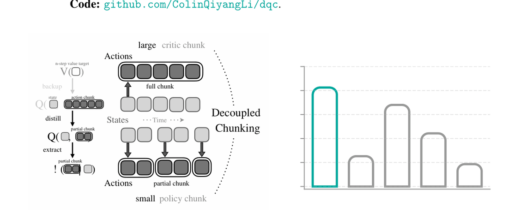
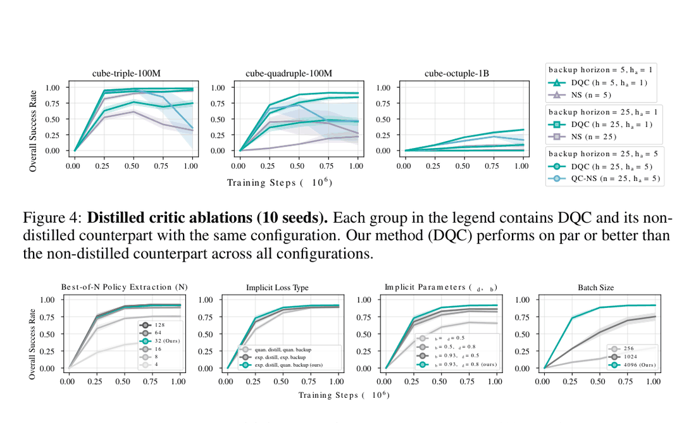
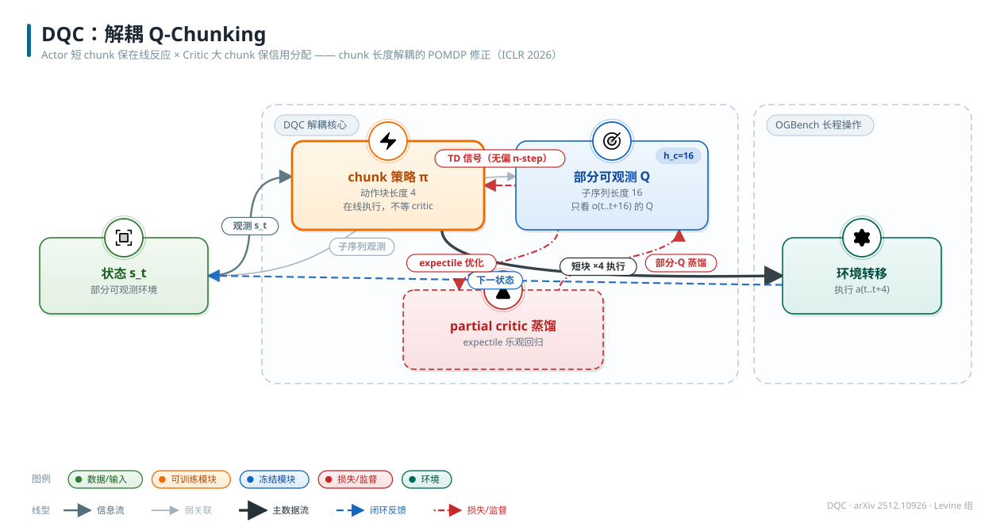

# Decoupled Q-Chunking (DQC)

- arXiv: https://arxiv.org/abs/2512.10926
- Source: ICLR 2026（Qiyang Li, Seohong Park, Sergey Levine；UC Berkeley）
- Project: https://github.com/ColinQiyangLi/dqc
- Local PDF: `papers/rl/core/DQC_2512.10926.pdf`
- Year: 2025
- Category: RL x action chunking (ICLR 2026)
- Priority: high

## 一句话总结

**Problem**：Q-chunking 证明 chunked critic 能加速值传播，但**从 chunked critic 提取策略必须让 actor 开环输出整段 chunk**——反应性差、且大 chunk 的策略分布复杂难学（Q-chunking 自己的 h=50 失败即此症状）；**Insight**：把 policy chunk 长 h_a 与 critic chunk 长 h 解耦——理论上（Thm 5）只要数据满足有界最优性变异（BOV），**闭环执行 chunked 策略的前缀（极端情况 h_a=1）也是近优的**；**Mechanism**：DQC 用一个"蒸馏的部分 critic"Q^P(s, a_{t:t+h_a}) 通过 expectile 乐观回归逼近"partial chunk 被最优补全后的最大值"，策略只需在短 chunk 上爬 Q^P 的坡（best-of-N 从 flow 行为策略采样）；**Evidence**：OGBench 最难 6 环境 aggregated 82 vs 同 backbone 的 QC 25、前 SOTA SHARSA 44；cube-quadruple 92 vs SHARSA 64、puzzle-4x5 96 vs SHARSA 1。

## 九问速览

1. **Problem**：action chunking Q-learning（chunked critic）如何提取策略——整 chunk 开环输出在反应性与可学性上都受限。
2. **Bottleneck**：chunk 越长，策略要拟合的联合分布越复杂；且 chunk 名义上要开环执行，与闭环部署需求冲突；理论上 chunked TD 的偏差（开环不一致）此前无人刻画。
3. **Insight**：**执行的开环长度（policy chunk）与值学习的跳步长度（critic chunk）是两个自由度**——闭环保留反应性，critic 保留传播速度，蒸馏把两者接起来。
4. **Method**：DQC = 大 chunk critic Q^θ（h=25）+ 蒸馏 partial critic Q^P_ψ（expectile κ_d≈0.8）+ quantile 值备份 V_ξ（κ_b）+ flow 行为策略 best-of-N（N=32）提取 h_a=1/5 的短 chunk。
5. **Evidence**：6 个最难 OGBench 环境（10 seeds）aggregated：DQC 82 vs QC 25、DQC-naïve 36、NS 68、SHARSA 44、HIQL 18、OS 14；逐环境 cube-triple 98、cube-quadruple 92、humanoidmaze-giant 92、puzzle-4x5 96。
6. **Ablation**：(h,h_a) 解耦扫描——manipulation 最优 (25,5)、humanoidmaze 最优 (25,1)；蒸馏 critic 必要（同配置 DQC 98 vs QC-NS 51 @ cube-triple）；无乐观（κ=0.5）大掉点；batch 4096 关键。
7. **Assumption**：数据近似强开环一致（OLC，Def 2）或满足局部/全局有界最优性变异（BOV，Def 4）；oracle goal representation；离线 GCRL 设定。
8. **Failure**：cube-octuple 仅 34%（1B 数据仍不够）；h、h_a 全局固定非状态自适应（作者自述局限）；理论保证依赖 OLC/BOV，真实数据上未度量。
9. **Opportunity**：状态自适应 chunk 尺寸；DQC 的在线 RL 版本（解耦思想 + 在线探索）；把 OLC/BOV 变成可估计量用于诊断数据。

| 维度 | 论文答案 |
|---|---|
| Perception | 低维状态 + **oracle goal representation** φ(s)（cube 各块 xyz / puzzle 按钮状态 / humanoidmaze (x,y)）；无图像 |
| Closed-loop | **核心战场：actor 短 chunk 保闭环**——h_a=1 即每步重规划（完全闭环），h_a=5 每 5 步；critic 仍用 h=25 的大 chunk 做值学习；名义值假设 chunk 开环执行，但 BOV 条件下闭环执行前缀近优（Thm 5） |
| Correction | 每步（或每 h_a 步）重观测即可纠错；策略只学"最优完整 chunk 的前缀"，分布简单因而学得动；无显式 retry |
| Deployment | 纯离线 goal-conditioned RL；策略提取全部在 test-time 用 best-of-N（N=32）从 flow 行为策略采样；无真机/无在线交互 |

## 核心技术

**信息流：离线数据 → 大 chunk critic（值学习）→ 蒸馏 partial critic（策略提取接口）→ 短 chunk 策略（闭环执行）。** 四个网络，全部联合训练、无 frozen：

*论文 Figure 1（p1）：Figure 1: Decoupled Q-chunking (DQC). Left: The key idea of our method is to ‘decouple’ the*

1. **Q^θ(s_t, a_{t:t+h})**：原版 chunked critic（h=25），chunk-skip Bellman 备份——但 target 不是 max 而是 quantile 值网络 V̄_ξ(s_{t+h})（κ_b 分位），避免昂贵的策略采样。
2. **Q^P_ψ(s_t, a_{t:t+h_a})**：**蒸馏 partial critic（本文核心发明）**——只吃长度 h_a 的短 chunk，用 expectile 隐式最大化 loss（κ_d）从 Q^θ 蒸馏，其最优解逼近 `max_{后缀} Q(s_t, [a_{t:t+h_a}, a_{t+h_a:t+h}])`，即"这个前缀被最优补全后能到多好"。
3. **V_ξ(s_t)**：quantile 值网络，为 Q^θ 的 TD target 提供 `V(s_t) ≈ Q^P(s_t, π(s_t))` 的乐观备份（best-of-N 的 Q 值是行为 Q 分布的 (N-1)/N 分位数的估计，故 κ_b 与 N 对应）。
4. **π_β**：flow-matching 行为策略（无条件 goal，非 goal-conditioned），策略提取 = test-time best-of-N：采 N 个 h_a 长 chunk，取 Q^P 最大者执行。

**为什么要蒸馏而不直接用 (s, a_{1:h_a}) 上跑 n-step？** 短 chunk 直接做 TD 会退化为小 n 的有偏 n-step（这就是 QC-NS 基线）；蒸馏把"长 chunk 的乐观上界"压进短 chunk 的输入签名里——**值学习的大 horizon 与策略输出的短 horizon 之间做了一次信息瓶颈式换算**。期望路线（IDQL 式隐式最大化）让 argmax 不需要显式求解。

**损失三件套（Algorithm 1）：** 采样轨迹段 (s_{t:t+h+1}, a_{t:t+h}, r_{t:t+h})：

- Q^θ：`L(φ) = (Q^θ(s_t, a_{t:t+h}) - Σ_k γ^k r_{t+k} - γ^h V̄_ξ(s_{t+h}))²`
- Q^P_ψ：`L(ψ) = f^{κ_d}_{expectile}(Q^θ(s_t, a_{t:t+h}) - Q^P_ψ(s_t, a_{t:t+h_a}))`（注意右边是 Q^θ 的**完整 chunk 值**对短 chunk 的乐观回归）
- V_ξ：`L(ξ) = f^{κ_b}_{quantile}(Q^P_ψ(s_t, a_{t:t+h_a}) - V_ξ(s_t))`
- π_β：标准 flow-matching（式 40）

## 底层原理与数学推导

**1. 开环一致性（OLC，Def 2）与 chunked 值学习的偏差（Thm 1/2）。** 数据分布 D 与"把 D 的动作开环重放"的分布 P^↺_D 之间的 TV 距离刻画开环一致性；弱 ε_h-OLC 只约束边际、强 ε_h-OLC 约束每个 chunk 的条件分布。弱 OLC 下行为值迭代解的名义值 V̂^ac 与真实值 V^ac 的偏差（γ∈[0,1)，H=1/(1-γ)，H̄=1/(1-γ^h)）：

$$
\big|V^{ac}(s_t) - \hat V^{ac}(s_t)\big| \;\le\; \frac{\gamma\epsilon_h}{(1-\gamma)(1-(1-\epsilon_h)\gamma^h)} \;\approx\; \epsilon_h H\bar H \quad(\text{Thm 1，且 Thm 2 证明该界紧})
$$

**2. Q-learning 的次优性（Thm 3/4 + Prop 1）。** 弱 OLC 不够：存在反例使 chunked Q-learning 收敛到任意差的策略——chunked Q(s,a_{1:h}) 无法区分"低概率走运的成功"与"闭环高概率的成功"（Prop 1）。强 OLC 下则：

$$
V^*(s_t) - V^+_{ac}(s_t) \;\le\; \frac{\epsilon_h\gamma}{1-\gamma}\Big(\frac{2}{1-(1-2\epsilon_h)\gamma^h} + \frac{1}{1-(1-\epsilon_h)\gamma^h}\Big) \;\lesssim\; 3\epsilon_h H\bar H
$$

**与 n-step 的对比（Prop 2）**：若 D 是 δ_n-次优（δ_n 度量 off-policy 轨迹与最优的差距），则 `V^+_{ac} - V̂^+_n ≳ δ_n/(1-γ^n) - 3ε_h H H̄`——**只要数据比 3ε_h H·H̄ 更次优，chunked Q-learning 就严格优于 n-step return**（n-step 的偏差随数据次优度增长，chunked 的不随）。

**3. 闭环执行的保证（Prop 3 + Thm 5，DQC 的理论许可证）。** 只执行 chunked 策略 π^+_ac 的第一个动作（π^•(s_t)=a^+_t）：强 OLC 下 `V^* - V^• ≲ 3ε_h H² H̄`（最多多付一个 H 因子）。更实用的是 **BOV 条件（Def 4）**：D 可分解为混合源，每个源内"给定 (s_t,a_t) 的 h 步最优性变异 ≤ ϑ^L_h"（局部）、全局给定 (s_t,a_{1:h}) 的变异 ≤ ϑ^G_h"，则：

$$
V^*(s_t) - V^{\bullet}(s_t) \;\le\; \frac{\vartheta^L_h}{1-\gamma} + \frac{\vartheta^G_h + \gamma^h\min(\vartheta^L_h,\vartheta^G_h)}{(1-\gamma)(1-\gamma^h)} \;\lesssim\; \vartheta^L_h H + 2\vartheta^G_h H\bar H
$$

**Thm 6 证明该界紧且两条件缺一不可**。直觉：局部条件管"第一步走对后结局差异不大"（人类/脚本行为可预测），全局条件管"整个 chunk 走完后名义值不虚高"。

**4. DQC 目标（式 32-36）。** 策略只输出 partial chunk，但目标定义在最优补全上：

$$
\mathcal{L}(\pi) := \mathbb{E}_{a_{t:t+h_a}\sim\pi(\cdot|s_t)}\big[-Q^\theta\big(s_t,\,[\mathbf{a}_{t:t+h_a},\,\mathbf{a}^*_{t+h_a:t+h}]\big)\big],\qquad \mathbf{a}^*_{t+h_a:t+h} := \arg\max_{\mathbf{a}_{t+h_a:t+h}} Q^\theta(s_t, [\mathbf{a}_{t:t+h_a},\mathbf{a}_{t+h_a:t+h}])
$$

直接优化它又要学长 chunk；于是用 Q^P 蒸馏替换内层 argmax（式 34-35）：

$$
Q^P_\psi(s_t,\mathbf{a}_{t:t+h_a}) \;\xrightarrow{\;f^{\kappa_d}_{expectile}\;}\; Q^\theta\big(s_t,[\mathbf{a}_{t:t+h_a},\mathbf{a}^*_{t+h_a:t+h}]\big) \;\;\Longrightarrow\;\; \mathcal{L}(\pi) = \mathbb{E}\big[-Q^P_\psi(s_t,\mathbf{a}_{t:t+h_a})\big]
$$

**5. chunked Bellman backup（式 5，与 Q-chunking 同构）**：`L^{QC}(φ) = E[(Q^θ(s_t,a_{t:t+h}) - R_{t:t+h} - γ^h Q^θ(s_{t+h}, a^*_{t+h:t+2h}))²]`——Q-chunking 的无偏 n-step 论证（chunk 独立于中间状态时无偏）在此被推广到任意 off-policy 数据 + OLC 条件的完整理论。

## 物理直觉解释

**解耦像"教练看全场录像、球员只决定下一步"。** Q-chunking 的困境是：评估一个 25 步计划需要教练（critic），执行计划却要求球员（actor）把 25 步一口气背下来开环做完——球员背错一步全盘皆输，而且 25 维联合动作的分布（先快后慢、先左后右的千百种组合）对一个小网络来说太复杂。DQC 的做法是教练继续看 25 步的全局录像（大 chunk critic 的值传播快），但只要求球员回答一个问题："**如果接下来 25 步由最优续写，你现在这一步（或这 5 步）应该怎么起手？**"——这个"最优前缀"的条件分布比完整计划简单几个量级（单步动作的分布），学得动；而它爬的坡（蒸馏出的 Q^P）已经把"后面会被最优补全"的乐观前景折算进当前短 chunk 的价值里。**长 horizon 的认知负担被留在 critic 侧，actor 只承担短 horizon 的运动负担。**

**蒸馏 partial critic 像"只学前缀的影分身"。** Q^P 的训练目标不是普通的回归而是 expectile 乐观回归（κ_d=0.8）：对同一个 (s, a_{1:5}) 前缀，数据里 Q^θ(s, a_{1:25}) 的值高低不一（取决于后缀好坏），expectile 让 Q^P 学的是**高端尾部**——即"这个前缀配上最好的后缀能到多好"。这精确对应式 32 的内层 max。物理上像跳水体操的"难度分"：前 5 步的入水姿态本身不决定分数，但裁判（Q^P）给的是"以这个起跳能完成的最高难度套路"的分。没有这层蒸馏（QC-NS 基线）就等于让短 chunk 的 TD target 直接吃 off-policy 的 n-step 奖励和——回到有偏 n-step 的老坑（cube-triple 51 vs 98 的差距大半来自这里）。

**开环一致性像"录像带在别的机器上重放会走样"。** 数据里的 (s_t, a_{t:t+h}, s_{t+h}) 是行为策略**闭环**走出来的——每个 a_{t+k} 都看着当时的 s_{t+k} 选；而 chunked Q-learning 的名义值假设这段 chunk 被**开环**重放。两套动力学在确定性强的系统里几乎重合（ε_h≈0），在"动作会改变后续可达状态分布"的场合（抓没抓住cube决定后面能不能放）就会分岔——这就是 ε_h。妙的是闭环执行（只取前缀、每步重选）反而自动规避了这个分岔：你从不真正开环重放任何长 chunk，等于**用执行的闭环性对冲了数据的开环不一致性**。BOV 条件则给了更实用的刻画：只要"行为者起步对了、结局就不会差太多"（人类操作员的典型模式），闭环执行的前缀策略就近优——**这解释了为什么同一套数据上 h_a=1 的 DQC 在 humanoidmaze（21 维连续控制、需要快速反馈）反而最好，而 manipulation 任务 h_a=5 够用**。

## 工程细节与实操指南

- **(h, h_a) 选择（Table 7 实测最优）**：cube-* manipulation 与 puzzle → (25, 5)；humanoidmaze → (25, 1)；cube-octuple → (25, 5)。经验：动态高维控制用 h_a=1（反应性优先），准静态操作用 h_a=5（行为先验里的连贯片段更长）。h 几乎总是 25（值传播想要大）。
- **乐观系数**：κ_d（蒸馏 expectile）∈{0.5, 0.8}，κ_b（backup quantile）∈{0.5-0.97}；**必须有乐观**（κ_b=κ_d=0.5 大掉点）；loss 类型（quantile vs expectile）不敏感，但"exp 蒸馏 + quan backup"组合默认最优（Figure 5）。κ_b 名义上应设 (N-1)/N≈0.97（对应 best-of-32），实践用更小值更稳。
- **通用超参（Table 5）**：batch **4096**（256 时崩溃性掉点，Figure 6）；γ=0.9；Adam lr 3e-4；target 更新率 5e-3；critic ensemble K=2（cube 用 min、puzzle/humanoid 用均值聚合）；网络 1024 宽 × 4 隐层；BCE 值损失；1M 训练步；flow 步数 10；best-of-N=32（N=128 无进一步收益）。
- **goal relabeling**：值学习的 goal 采样混合 (w_cur, w_geom, w_traj, w_rand)=(0.2, 0, 0.5, 0.3)；DQC/QC/NS/OS 的行为策略**不 goal-conditioned**（策略提取在 test-time 完成），SHARSA 的策略侧按原 paper。
- **数据**：cube-triple/quadruple 用 100M 数据集实际加载 10M；cube-octuple 与 puzzle-4x6 用全量 1B；humanoidmaze-giant 与 puzzle-4x5 用官方默认（4M/3M）——**大数据库是解题必要条件**（作者自述）。
- **实现参考**：IDQL（隐式最大化骨架）+ FQL（flow 行为策略）+ Q-chunking（chunked critic）；代码 github.com/ColinQiyangLi/dqc。

## 实验协议清单

| 项目 | 论文设置 | 来源与备注 |
|---|---|---|
| 观测 | 低维状态 + oracle goal representation φ（cube-triple: 3 块 xyz → R^9；cube-quadruple R^12；cube-octuple R^24；puzzle: 按钮二值状态 {0,1}^20/^24；humanoidmaze: (x,y)∈R^2）；无图像 | 附录 C、Table 6 |
| 动作空间 | manipulation 5 维（EE 位控）；humanoidmaze 21 维（关节） | §6、Table 4 |
| 控制频率 | 未报告（MuJoCo 默认） | — |
| 重规划频率 | 每 h_a 步重规划（h_a=1 即每步闭环；h_a=5 每 5 步）；策略提取为 test-time best-of-N（N=32） | §5、Table 7 |
| 动作 horizon | critic chunk h=25（扫描 {5,25}）；policy chunk h_a∈{1,5,25}；行为策略预测 h_a 长 chunk | Table 7/8/9 |
| 数据 | OGBench play（cube/puzzle）/ navigate（humanoidmaze）：cube-triple-100M 与 cube-quadruple-100M 各用 10M、cube-octuple-1B 全量、puzzle-4x6-1B 全量、humanoidmaze-giant 4M、puzzle-4x5 3M | 附录 B、Table 4 |
| 奖励 | 二值 goal-reaching r(s,g)=1[φ(s)=g] + 训练时 goal relabeling（四元混合分布，式 39） | 附录 C |
| Reset | OGBench 标准 reset（goal/初始构型采样） | 未详述 |
| 成功定义 | episode 内到达 goal 状态（overall success rate = 5 任务平均） | 附录 B |
| 评估次数 | 每环境 5 任务 × 50 trials（DQC 及消融）；先前基线（SHARSA/HIQL/IQL/FBC/HFBC）15 trials/任务 | 附录 B |
| 随机种子 | 10 seeds/方法/配置 | §6 |
| 扰动测试 | 无 | — |
| 真机 | 无（纯仿真离线 RL） | — |
| 算力 | 未报告 GPU 型号/时长（Berkeley Savio 集群；DARPA ANSR + ONR N00014-25-1-2060 资助） | 致谢 |
| 特权信息 | oracle goal representation（特权目标编码）；全观测低维状态 | Table 6 |

**附录陷阱自查**：
- privileged 信息：oracle goal representation φ 是特权（视觉 goal 达成判定未测试）；critic 无特权 state、无 asymmetric 结构
- reward shaping：无 dense shaping（二值 r(s,g)）；但 goal relabeling 混合分布（0.2/0/0.5/0.3）本身是强工程先验，沿用 SHARSA 调参
- reset 难度：标准；puzzle 组合任务初始/目标构型由 benchmark 固定
- eval budget：50 trials × 5 任务 × 10 seeds（自身充分）；注意与旧基线的 15 trials 差异（作者沿用 Park et al. 协议，非刻意压基线）
- 底层控制栈：MuJoCo EE 位置控制（manipulation）；控制频率未报告
- 数据优势：100M/1B 级数据集对**所有方法**开放（含 SHARSA，数字直接引用自原 paper）——公平；但"大数据 + oracle goal"意味着结论对少数据/视觉设定保守；env 数为 6 个最难环境（选择偏置：恰好是多步 backup 最关键的场景，作者选场对方法有利）

## 消融实验与分析

*论文 Table 2（p13）：Table 2: Comparisons with prior methods (10 seeds). Our method outperforms SHARSA (Park*

**主表（Table 2/3，OGBench 最难 6 环境，10 seeds，成功率）：**

| 方法（配置） | c3-100M | c4-100M | c8-1B | hg | p45 | p46-1B | aggregated |
|---|---|---|---|---|---|---|---|
| **DQC（最优配置）** | **98** [98,99] | **92** [90,93] | 34 [3x,35] | **92** [90,94] | **96** [95,97] | **83** [80,86] | **82** |
| NS（n-step，n=25） | 30 | 19 | 9 | **95** | 89 | **91** | 68 |
| SHARSA（前 SOTA） | 83 [81,85] | 64 [62,68] | **34** [31,36] | 19 [16,23] | 1 [1,2] | 64 [60,68] | 44 |
| QC（= Q-chunking，h=h_a） | 20 [7,36] | 35 [26,43] | 0 | 48 [45,52] | 20 [20,20] | 28 [27,30] | 25 |
| DQC-naïve（QC 预测整 chunk 只执行前缀） | 27 | 40 | 3 | 80 | 33 | 33 | 36 |
| OS（1-step TD） | 47 | 0 | 0 | 0 | 19 | 19 | 14 |
| HIQL / IQL / HFBC / FBC | 35/65/56/54 | 24/53/37/34 | 20/0/28/0 | 24/3/6/1 | 0/20/0/0 | 9/6/4/1 | 18/24/21/14 |

**解耦扫描（Table 3/8，DQC 在不同 (h, h_a) 下）：**

| 配置 | c3 | c4 | c8 | hg | p45 | p46 | 结论 |
|---|---|---|---|---|---|---|---|
| DQC (h=25, h_a=5) | **98** | **92** | **34** | 51 | **96** | 68 | manipulation/puzzle 最优 |
| DQC (h=25, h_a=1) | 76 | 45 | 10 | **92** | 91 | **83** | humanoidmaze/p46 最优（反馈密集） |
| DQC (h=5, h_a=1) | 95 | 84 | 0 | 19 | 90 | 44 | critic chunk 缩到 5 在 c8/hg 崩（值传播不够） |
| 对照 QC-NS (n=25, h_a=5)（无蒸馏） | 51 | 53 | 18 | 60 | 95 | 95 | 蒸馏贡献：c3 +47、c4 +39 |
| 对照 NS (n=25)（单步 critic） | 30 | 19 | 9 | 95 | 89 | 91 | chunked critic 贡献：c3 +68、c4 +73 |

**超参敏感性（Figure 5/6，cube-quadruple）：** N∈{8,16,32,64,128} 中 32 即饱和；隐式 loss 类型不敏感；κ_b=κ_d=0.5（无乐观）显著掉点；batch 256→1024→4096 单调大涨（4096 关键，256 在 c4/c8/p45/p46 上近乎失败）。

**核心结论**：增益三层分解——(1) **解耦本身**（DQC vs QC 同 backbone：82 vs 25，+57）；(2) **蒸馏 partial critic**（DQC vs QC-NS 同 (25,5)：蒸馏把"前缀+最优后缀"的乐观值注入短 chunk，c3 从 51 到 98）；(3) **chunked critic 的传播速度**（vs NS/OS）。最优 h_a 任务相关：反馈密集的 humanoidmaze 要 1，操作任务 5 即可。

## 技术权衡（Trade-off）

| 优势 | 劣势与工程代价 |
|------|---------------|
| 首篇 chunked Q-learning 的形式理论：OLC/BOV 条件下精确刻画偏差与次优性（上下界匹配） | 理论条件（强 OLC / BOV）在真实数据上未度量、不可验——实践者无法预判自己的数据是否满足 |
| actor/critic chunk 解耦：+57 aggregated（82 vs QC 25），兼得传播速度与反应性 | 训练四个网络（Q^θ、Q^P、V、π_β）+ test-time best-of-N×32，推理与训练开销大于 QC |
| h_a=1 选项使策略退化为单步闭环，天然适配动态任务（humanoidmaze 92） | h、h_a 仍是全局网格超参；状态自适应 chunk 是自认未解问题 |
| 蒸馏用 expectile 隐式 argmax，无需在连续 chunk 空间显式最大化 | cube-octuple 仅 34%——1B 数据 + 25 步 chunk 仍不够；对超长程组合任务天花板未破 |
| 离线 GCRL 上超 SHARSA（44→82），且消融基线（QC/NS/OS）同 backbone 干净 | 依赖 100M-1B 级数据集与 oracle goal representation；少数据/视觉设定未知；无真机、无在线阶段 |

## 技术价值与演进定位

DQC 是 Q-chunking 这条线的"理论补全 + 结构修正"之作，也是 chunked RL 的成熟形态。它做了两件事：(1) **理论补全**——首次给 action chunking Q-learning 建立形式分析，识别出被前作忽略的"开环一致性"偏差（数据的闭环生成 vs chunk 的开环重放），给出弱/强 OLC 与 BOV 三档条件下从值偏差到策略次优性的完整界，并证明 chunked backup 在数据次优度超过 3ε_h H H̄ 时严格优于 n-step return——把 Q-chunking 的经验优势变成可证命题；(2) **结构修正**——指出 Q-chunking 把"值学习 horizon"与"执行 horizon"绑死在同一个 h 上是过约束，解耦后（critic h=25 / actor h_a=1 或 5）在 OGBench 最难环境集上把同 backbone 的 QC 从 25 拉到 82、超 SHARSA 44→82。其"闭环执行 chunked 策略前缀近优"的理论（Thm 5）实际上给整个 VLA 社区"预测长 chunk、只执行前缀再重规划"的部署惯例补了 RL 侧的合法性证明。留下的开放问题（状态自适应 chunk、在线版 DQC）与真机异步执行的结合正是 SmoothRL 一类工作的空间。

## 与其他论文的关系

- **notes/rl/core/q-chunking.md（直接前作，同作者 Li/Levine）**：Q-chunking 提出 chunked critic + 无偏 n-step 论证但只在"数据由 chunk 策略生成"的假设下成立；DQC 诊断其局限（整 chunk 开环策略难学 + 牺牲反应性 + 理论缺口），把单一 h 拆成 (h, h_a)，并给出 OLC/BOV 理论。承接关系的数据锚点：同 backbone 下 QC 25 → DQC 82。
- **notes/architecture/why-chunking-works.md（chunking 理论）**：该文在 IL 侧证明"延迟条件预测 + 隐式集成"解释 chunking 收益、执行方式不重要；DQC 在 RL 侧给出镜像结论——**执行方式（开环整段 vs 闭环前缀）单独成为设计维度**，且闭环前缀在 BOV 下近优。两者合读：chunk 的"预测分布"与"执行调度"应当解耦研究。
- **notes/architecture/chunking-exploratory.md（chunking 理论）**：该文证明开环执行块的稳定效应只需对数长度；DQC 的 h=25 恰在 20Hz 级控制的对数舒适区内，而其理论（开环重放与数据分布的 TV 距离 ε_h）与该文的 EISS 收缩率 ρ 是同一现象的两种度量——都在问"松手多久系统不会走样"。
- **notes/data/mobile-aloha-act.md（ACT）**：ACT 的 receding-horizon 部署（预测 45 执行 k<45 步）正是 DQC 理论化的对象——"训练预测长 chunk、闭环只执行前缀"从 BC 工程惯例升级为有近优性保证的 RL 设计。
- **notes/architecture/diffusion-policy.md（Diffusion Policy）**：DP 的预测 16 执行 8 = DQC 的 (h, h_a)=(16,8) 特例；DQC 把这个 IL 惯例搬进 Q-learning 并证明其不损最优性（BOV 条件下），DP 的 latency-robust 消融（晚 4 步仍峰值）是 BOV 型条件成立的早期实证。
- **notes/briefs/action-chunking-brief.md（88 方法大纲卡）**：DQC 是分类轴 5（RL × chunk）的核心条目；其 (h, h_a) 解耦给分类轴 1（长度自适应）提供了新维度——自适应的对象应同时包括 critic 与 actor 两个长度；其闭环执行理论给分类轴 2（RTC 实时化）补了优化合法性。
- **notes/rl/core/flashsac.md（RL 高维控制）**：FlashSAC 走"1-step backup + 大模型低 UTD 稳定化"路线攻 sim-to-real 高维；DQC 走"多步 chunked backup + 隐式最大化"攻离线长程——两种对抗 bootstrapping bias 的正交路线，一个压更新误差、一个缩备份链；FlashSAC 的 50Hz 全闭环部署恰是 DQC h_a=1 的世界。
- **notes/rl/vla/smoothrl.md（真机后继）**：SmoothRL 引用 DQC（其 [14]）支撑"critic 条件的 action span 不必等于策略优化的 span"——DQC 的解耦思想在真机异步执行里变成 committed/execution/discarded 三区划分。
- **SHARSA（Horizon Reduction Makes RL Scalable，Park et al. 2025b，外部）**：被超越的前 SOTA（n-step + 双层层级策略）；DQC 用单层解耦设计在其引入的最难环境集上反超，并沿用其 goal relabeling 与数据协议。

## 精读问题

1. OLC/BOV 是可估计的吗？能否从离线数据本身估计 ε_h（如对比闭环重放与数据中 s_{t+h}|s_t,a_{t:t+h} 的经验分布距离），用于在训练前诊断"这份数据适合多大的 h"？
2. 最优 h_a 的任务依赖性（humanoidmaze 要 1、cube 要 5）能否在线自适应——例如按 Q^P 对 h_a 的敏感度或执行期值预测误差动态切换 h_a？这对应 chunking 理论中"决策边界处缩短块长"的直觉。
3. 蒸馏的乐观偏差：expectile κ_d=0.8 是固定折扣，能否随训练进度从乐观退火到校准（类似 Cal-QL 的 pessimism 校准），避免后期 Q^P 系统性高估？
4. DQC 的解耦能否搬到在线 RL——行为策略 π_β 在线更新后，Q^P 的蒸馏目标（Q^θ 的完整 chunk 值）与探索的短 chunk 执行如何交互？Q-chunking 的探索收益（时间连贯）在 h_a=1 时去哪了？
5. cube-octuple 的 34% 天花板是数据问题（1B 仍不够）还是 25 步 chunk 的传播极限？h=50/100 配合 h_a=5 会更差还是更好？理论上的 H̄=1/(1-γ^25)≈1.07 意味着 γ^h≈0.07——h 再大时 backup 几乎不 bootstrap，是否等效蒙特卡洛？
6. best-of-N 与 quantile κ_b 的对应关系（(N-1)/N 分位）在行为策略训练不充分时如何失效？能否用 ensemble Q^P 替代 quantile V 做备份？
7. DQC 的 partial critic 蒸馏与 VLA 的 residual 微调（RL Token/SmoothRL 的 attached actor）结构同构——能否把 DQC 的"h_a=1 保反应性"直接用作 VLA 在线 RL 的策略提取层，替代 TD3 式 actor？

*架构速览：Actor 用短 chunk（h=4）保在线反应速度，Critic 用大 chunk（h=16）的部分可观测 Q 保信用分配；expectile 乐观回归蒸馏 partial critic，TD 信号无偏回传策略。*
