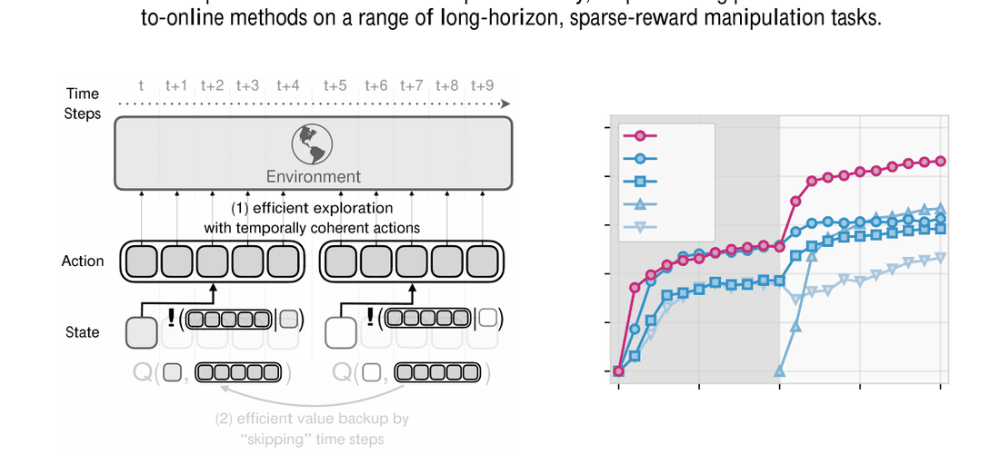
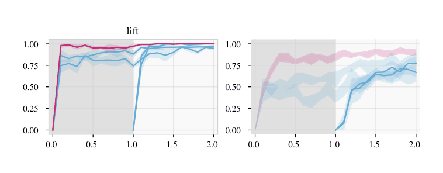

# Reinforcement Learning with Action Chunking (Q-chunking)

- arXiv: https://arxiv.org/abs/2507.07969
- Source: NeurIPS 2025（Qiyang Li, Zhiyuan Zhou, Sergey Levine；UC Berkeley）
- Project: https://github.com/ColinQiyangLi/qc
- Local PDF: `papers/rl/core/QChunking_2507.07969.pdf`
- Year: 2025
- Category: RL x action chunking (NeurIPS 2025)
- Priority: high

## 一句话总结

**Problem**：offline-to-online RL 在长程稀疏奖励任务上卡在两件事——1-step TD 值传播慢（有效 horizon H=1/(1-γ) 内每步只回传 1 格）+ 在线探索动作时间不连贯（离线数据里的时序结构没被利用）；**Insight**：IL 里的 action chunking 可以直接搬进 TD-based RL——把 Q-learning 整个搬到"chunked action space"上跑，critic 吃整段动作序列后，标准 TD loss 自动变成**无偏的 n-step backup**（n=chunk 长）；**Mechanism**：QC/QC-FQL 两个实例——flow-matching 行为策略 + chunked critic，行为约束（best-of-N 隐式 KL 或 FQL 式 W2 蒸馏）让策略在 chunk 空间贴着离线先验做时间连贯的探索；**Evidence**：OGBench 25 任务 overall 52→86（QC）、38→86（QC-FQL），碾压 FQL 37→58、n-step 版 FQL-n 27→57；最难的 cube-quadruple 上 4→74，而几乎所有基线在线 1M 步后仍为 0-12。

## 九问速览

1. **Problem**：offline-to-online RL：先离线预训练再在线微调，长程稀疏奖励下样本效率极差。
2. **Bottleneck**：1-step TD 值回传慢；naive n-step return 有 off-policy 偏差；单步动作探索碎片化、离不开初始状态。
3. **Insight**：让 critic 输入整段动作序列——TD backup 天然等于 n-step return，且因为 Q 的输入动作与产生 reward 的动作完全一致而**无偏**（Proposition A.1）。
4. **Method**：QC = flow 行为策略 best-of-N 选 chunk（隐式 KL≤log N）+ chunked critic TD；QC-FQL = FQL 的 TD3+BC 目标在 chunk 空间的直接推广（W2 行为约束）。
5. **Evidence**：OGBench 25 任务：QC 52→86、QC-FQL 38→86，vs FQL 37→58、BFN 51→63、FQL-n 27→57、RLPD 67、SUPE-GT 52（→ 为 offline→online 1M 步后）；cube-quadruple QC 4→74（CI [72,75]）。
6. **Ablation**：chunk 长 h∈{1,5,10,25,50}：涨到 h=10 后回落、h=50 全失败；h=1 即 FQL；critic ensemble K=10 更好（默认 K=2 为省钱）；UTD 提到 5 无增益。
7. **Assumption**：离线数据服从环境转移动力学（行为策略可非马尔可夫）；数据近似"开环一致"（后作 DQC 形式化，弱条件不够、需强条件）；全观测低维状态。
8. **Failure**：大 chunk 损害反应性且策略难学（h=50 成功率 0）；chunk 长度是任务级超参，无自动选择机制；高频率闭环反馈任务不适用（作者自述局限）。
9. **Opportunity**：自动 chunk 边界；更一般的非马尔可夫在线探索；actor/critic chunk 解耦（= 后作 DQC）；真机异步执行下的 chunked RL（= SmoothRL）。

| 维度 | 论文答案 |
|---|---|
| Perception | 纯低维 MuJoCo 状态（fully observable MDP，无图像）；OGBench 动作 5 维/状态数十维、robomimic 7 维动作 |
| Closed-loop | **chunk 执行期开环**：策略每 h=5 步观测一次，块内不重规划——反应性是 h 的直接代价，也是 DQC/SmoothRL 后续两篇要修的主战场 |
| Correction | 块边界重规划即纠错；行为约束（KL/W2）防止 chunk 采样跑出先验；无块内修正机制 |
| Deployment | 纯仿真（OGBench + robomimic）；单环境流式交互、每环境步 1 次梯度更新（UTD=1）；无真机验证 |

## 核心技术

**信息流：离线数据 D → 行为分布建模 → chunked critic 选 chunk → 开环执行 → 回流 buffer。** 与常规 actor-critic 的关键差异是三个网络全部活在扩展动作空间 A^h 上：

*论文 Figure 1（p1）：Figure 1: Q-chunking uses action chunking to enable fast value backups and effective exploration wit*

1. **f_β(s, m, u)**：flow-matching 行为策略（速度场网络），用标准 flow-matching loss 在 D 上训练，捕获离线数据的**非马尔可夫 chunk 分布**（脚本策略/人类遥操作的时序结构）——这是 Gaussian 策略做不到的（Figure 2：RLPD-AC 用 Gaussian + chunking 反而掉到 61）。
2. **Q_θ(s, a_{t:t+h})**：chunked critic（K 个 ensemble），输入状态 + h 个连续动作，输出整段 chunk 的价值；TD target 用 h 步后的下一个 chunk 的价值（γ^h 折扣）。
3. **策略 π_ψ**：QC **不显式参数化**——用 best-of-N 从 f_β 采 N 个 chunk、取 Q 最大者，既用于环境交互也用于 TD target（expected-max Q operator）；QC-FQL 显式参数化一个噪声条件一步策略 μ_ψ(s,z)→A^h，用 FQL 式蒸馏 loss（对 W2 距离的上界）拴在 f_β 上。

**训练/冻结关系：没有任何 frozen 组件**——行为策略、critic、（QC-FQL 的）actor 在离线和在线阶段用同一目标联合训练，区别只是在线阶段多了环境交互（这是相对 HRL 冻结技能路线的刻意设计）。RLPD 系基线无离线预训练阶段（0 步离线训练）。

**损失函数（QC-FQL 完整三件套，附录 C.1）：** 采样"高层转移" w=(s_t, a_{t:t+h-1}, s_{t+h}, R_t^h)，R_t^h=Σγ^{t'}r_{t+t'}：

- critic loss（ensemble 平均，K=2）：`L(θ_k,w) = (Q_k(s_t,a_{t:t+h-1}) - R_t^h - γ^h·(1/K)Σ_k' Q̄_k'(s_{t+h}, π(s_{t+h})))²`
- actor loss：`L(ψ,w) = -Q(s_t, μ_ψ(s_t,z_t)) + α·||μ_ψ(s_t,z_t) - a*_t||²`，其中 a* 是用 Euler ODE 从 f_β 积分出的行为 chunk（α 控行为约束强度，OGBench 100-300、robomimic 10000）
- flow loss：`L(ξ,w) = ||f_β(s_t, u·a_{t:t+h-1}+(1-u)z, u) - (a_{t:t+h-1}-z)||²`

## 底层原理与数学推导

**1. chunked MDP 上的 TD 目标（式 4）。** 在扩展动作空间上定义 Q_θ(s_t, a_{t:t+h})，TD 损失为：

$$
\mathcal{L}(\theta) = \mathbb{E}_{D}\Big[\Big(Q_\theta(s_t, \mathbf{a}_{t}) - \sum_{t'=0}^{h-1}\gamma^{t'} r_{t+t'} - \gamma^h Q_{\bar\theta}(s_{t+h}, \mathbf{a}_{t+h})\Big)^2\Big],\quad \mathbf{a}_{t+h}\sim\pi(\cdot|s_{t+h})
$$

注意它与式 3 的 uncorrected n-step return 形式相同，但 bootstrap 的 Q 吃的是**完整 chunk** 而非单动作。

**2. 三种 backup 的对照（式 5-7，全文核心）。** 写出 Bellman backup 方程：

$$
\underbrace{Q(s_t,a_t) \approx r_t + \gamma Q(s_{t+1}, a_{t+1})}_{\text{1-step TD：每次回传 1 步}}\qquad
\underbrace{Q(s_t,a_t) \approx \sum_{t'=t}^{t+h-1}\gamma^{t'-t}r_{t'} + \gamma^h Q(s_{t+h}, a_{t+h})}_{\text{n-step：回传快 } h \text{ 倍，但 } r_{t:t+h}\text{ 来自 off-policy 轨迹} \Rightarrow \textbf{有偏}}
$$

$$
\underbrace{Q(s_t, \mathbf{a}_{t:t+h}) \approx \sum_{t'=t}^{t+h-1}\gamma^{t'-t}r_{t'} + \gamma^h Q(s_{t+h}, \mathbf{a}_{t+h:t+2h})}_{\text{Q-chunking：回传快 } h \text{ 倍，且 Q 的输入 chunk = 产生 } r_{t:t+h}\text{ 的同一批动作} \Rightarrow \textbf{无偏}}
$$

**Proposition A.1（无偏性）**：若数据由（可非马尔可夫的）行为策略生成、V̂(s_{t+n}) 对 V^π(s_{t+n}) 无偏，则 n-step 估计 V̂^{n-step} 对 chunked 真值 Q^π(s_t, a_t,…,a_{t+n-1}) 无偏。证明只用了三行期望替换：Q^π(s_t,a_{t:n}) 本身就是"执行这段动作的奖励和 + 后继价值"的期望。而单动作 Q 配 n-step return 在 off-policy 数据下**不收敛到任何真值**。

**3. 行为约束的两种实现（式 8-14）。** 通用目标：

$$
\max_\psi \mathbb{E}_{\mathbf{a}\sim\pi_\psi(\cdot|s_t)}[Q_\theta(s_t,\mathbf{a})]\quad \text{s.t.}\quad D(\pi_\psi(\cdot|s_t),\, \pi_\beta(\cdot|s_t)) \le \epsilon
$$

QC 取 D=KL：best-of-N 采样有闭式上界（Hilton 2023）：

$$
D_{\mathrm{KL}}(a^* \| f_\beta) \le \log N - \frac{N-1}{N} \;\Rightarrow\; \text{调 } N \text{ 即调约束强度（实践 } N{=}16{-}64\text{）}
$$

QC-FQL 取 D=W2：FQL 证明 BC 蒸馏 loss 是 W2² 的上界，故 actor loss（式 13/14）满足 α·W2²(π_ψ, f_β) - Q 的权衡。**约束加在 chunk 空间而非动作空间**是关键——离线数据的非马尔可夫结构（人类停顿、脚本子任务）只有 chunk 级分布才装得下。

**4. 有效 horizon 的换算。** 1-step TD 的有效 horizon H=1/(1-γ)=10（γ=0.9）；chunked backup 每次传播 h 步，等效把备份链缩短 h 倍——h=5 时在线 1M 环境步等效 5M 步的值传播量，这正是 cube-triple/quadruple 上拉开差距的地方。

## 物理直觉解释

**chunked critic 像把"记账"从逐笔清账改成整本流水账一起核。** 1-step TD 是传话游戏：s_t 的价值问 s_{t+1}，s_{t+1} 问 s_{t+2}，每传一手加一层误差，长程稀疏奖励要传上千手才到得了起点。naive n-step return 想抄近路——直接把 s_t 到 s_{t+h} 的奖励加总再问 s_{t+h}——但这段奖励是**别人（行为策略）走出来的路**，你问的却是"我（当前策略）会怎么走"，账本对不上号，这就是 off-policy 偏差。Q-chunking 的解法极其朴素：让 Q 的问题本身变成"**如果我照着这 h 个动作走**，值多少"——问题里的动作序列和账本里的动作序列是同一份，账目天然对齐，偏着抄近路却不付偏差的代价。物理上像导航：与其每走一步问一次路（慢）、或拿别人的行程单当自己的（偏），不如把"接下来 h 步怎么走"整段作为一个方案来评估。

**时间连贯的探索像"成套的武术动作"而不是"每步掷一次骰子"。** 单步策略探索时每步独立撒噪声，末端执行器在初始状态附近抖成一团（Figure 5：BFN 的末端轨迹在抓取点附近有大而密的停顿簇），永远凑不出"先移动、再下探、再抓"这种需要持续几百步的连贯行为。离线 play 数据里恰好全是这种连贯片段——行为约束下的 chunk 策略等于把数据里的**技能骨架**整体搬进探索：每采一个 chunk 就是一段微型技能（朝某方向推、抬起、翻转），状态覆盖自然铺开。论文用末端位置相邻差分的 L2 范数量化了这一点：QC 的动作时间连贯性全程高于 BFN（同 backbone、只差 chunk 与否），且前 1000 步的状态覆盖明显更多样——**探索优势不是"更随机"而是"更有结构性"**。

**chunk 执行期的开环是本文埋下、由后作收割的代价。** h=5 时每 5 步才看一眼世界，块内世界变了策略不知道——对低频状态仿真的操作任务这无关痛痒，但论文自己的消融已经露出马脚：h 从 10 加到 25 学习反而变慢、h=50 彻底失败，作者归因于"反应性受损 + 长 chunk 分布难学"。这正对应库内 chunking-exploratory 的控制论结论：开环执行依赖系统自身的回正力矩（EE 位置控制 + 高频底层跟踪），且收益只需对数长度、贪长必翻车。**chunk 在这里扮演双重角色：对 critic 是值传播的"跳步器"（越大越快），对执行是反馈的"盲区"（越大越钝）**——两个角色对 h 的偏好方向相反，Q-chunking 把它们绑死在同一个 h 上，这就是 DQC（解耦 actor/critic chunk）与 SmoothRL（异步执行中执行窗口与生成 horizon 分离）直接的出发点。

## 工程细节与实操指南

- **chunk 长度 h**：默认 5（便宜且稳）；cube-triple 扫描显示 h=10 最优、h=25 早期快但终值低、h=50 全挂。经验法则：值传播需求高（稀疏+长程）就往 10 靠，反应性需求高就压到 1-5。**别贪长**。
- **通用超参（附录 Table 3）**：batch 256；γ=0.9（OGBench 惯例，操作任务短 horizon）；Adam lr 3e-4；target 网络 EMA τ=5e-3；网络 512 宽 × 4 隐层；flow 积分步数 T=10；UTD=1（每环境步 1 次更新）。
- **critic ensemble K=2**（省钱默认）；K=10 对 QC 和 BFN 都有提升（Figure 6 中），要冲分可开。
- **best-of-N 的 N**：{2,…,128} 扫描，cube-*/scene 用 32、puzzle 用 64、robomimic 用 16；N 同时是 KL 约束强度（上界 log N）。
- **QC-FQL 的 α**：FQL 默认值 ×{1/3,1,3} 三选（task2 上调）；robomimic 上要大几个量级（10^4）。
- **大数据集处理**：cube-quadruple-100M 装不下内存 → 每 1000 梯度步换载 1M 分块；在线微调时只保留固定 1M chunk + 新数据（剩余 9M 弃用）。
- **算力**：单张 RTX-A5000，单次 offline(1M 步)+online(1M 步) 4-7 小时；复现全部结果约 10350 GPU 时。QC 比 FQL 慢 ~50%（在线阶段要采 32 个 chunk 评估 Q），QC-FQL 与 FQL 同量级。
- **训练-执行节奏**：Algorithm 1——`if t mod h == 0` 才重新采样 chunk，然后开环执行 h 步，每步都往 buffer 写 (s_t, a*, s_{t+1}, r)（存的是单步转移，训练时再拼 chunk）。

## 实验协议清单

| 项目 | 论文设置 | 来源与备注 |
|---|---|---|
| 观测 | 低维 MuJoCo 状态（fully observable MDP；无图像）；OGBench 状态数十维（如 cube-triple 46 维，OGBench 官方规格） | §3、附录 B；OGBench 官方表 |
| 动作空间 | OGBench 5 维（EE x/y/z、gripper yaw、gripper opening）；robomimic 7 维（3 平移 + 3 旋转 + 夹爪） | 附录 Table 2 |
| 控制频率 | 未报告（MuJoCo 仿真默认） | — |
| 重规划频率 | 每 h=5 步观测一次并重采样 chunk（Algorithm 1：t mod h == 0） | 附录 C Algorithm 1/2 |
| 动作 horizon | h=5 默认；消融扫描 {1,5,10,25,50}（cube-triple 上 h∈{5,7,9} 稳定解 cube-quadruple-task4） | §5.5、附录 Figure 14/15 |
| 数据 | OGBench play 数据集：scene/puzzle/cube-double 1M、cube-triple 3M、cube-quadruple 用 100M 数据集（实际加载 10M 分块）；robomimic multi-human（6 操作员 × 300 条成功轨迹/任务） | §5.1、附录 B、Table 2 |
| 奖励 | 稀疏：scene/puzzle 为 −1（未完成）/0（完成）；cube-* 为 −n_wrong（摆错方块数）；robomimic 二值 −1/0 | 附录 B.1/B.2 |
| Reset | OGBench 标准重置（cube 位置等随机化）；episode 长度 scene 750 / puzzle 500 / cube-double 500 / cube-triple 1000 / cube-quadruple 1000（PDF 表格数字有末位 0 缺失，按 OGBench 官方规格校正） | 附录 Table 2 + OGBench 官方表交叉验证 |
| 成功定义 | 二值任务完成（全部方块到位/目标构型达成），episode 终止于完成 | 附录 B |
| 评估次数 | 每评估点 50 episodes；95% CI 用分层 bootstrap（5000 重采样） | 附录 D.2 |
| 随机种子 | OGBench 4 seeds/任务；robomimic 5 seeds/任务 | 附录 D.2 |
| 扰动测试 | 无 | — |
| 真机 | 无（纯仿真） | — |
| 算力 | RTX-A5000；单 run 4-7h（OGBench）/8-12h（robomimic）；复现全部约 10350 GPU 时 | 附录 D.1 |
| 特权信息 | 全观测真值状态（无观测噪声/无视觉） | §3 |

**附录陷阱自查**：
- privileged 信息：状态观测即真值（fully observable MDP）——结论向视觉部分可观测迁移未验证
- reward shaping：无 dense shaping，纯稀疏 −1/−n_wrong；但 reward 符号约定（负到 0）等效"完成即终止"，对 γ=0.9 的值估计友好
- reset 难度：标准 OGBench 随机化；无刻意难 reset
- eval budget：50 eps × 4 seeds × 多评估点 + bootstrap CI，足够区分 20+ 点差距
- 底层控制栈：MuJoCo EE 位置控制（开环稳定前提成立，见 chunking-exploratory）；控制频率未报告
- 数据优势：cube-quadruple 用 100M 大数据集（所有方法同数据，公平）；BFN/FQL-n/QC-* 等消融基线为作者自实现并按 task2 调参——基线强度依赖作者调参诚意（SUPE-GT 被改造为用真值奖励）

## 消融实验与分析

*论文 Table 1（p8）：Table 1: Summary table for OGBench offline-to-online RL results. For each cell, we report the offlin*

**主表（Table 1，OGBench 25 任务，offline→online 成功率）：**

| 方法 | overall (25 任务) | cube-triple | cube-quadruple | 关键对照含义 |
|---|---|---|---|---|
| QC（ours） | 52→**86** | 6→64 | 4→74 [72,75] | best-of-N + chunked critic |
| QC-FQL（ours） | 38→**86** [84,88] | 4→53 | 1→77 [76,77] | W2 约束 + chunked critic |
| FQL（= QC-FQL 取 h=1） | 37→58 | 0→3 | 0→3 | **chunking 本身的贡献** |
| FQL-n（n-step，无 chunked critic） | 27→57 | 0→1 | 7→36 | 同样 h 步传播、但有偏 |
| BFN（1-step + best-of-N，无 chunk） | 51→63 | 4→23 | 1→12 | chunked critic 的贡献 |
| RLPD（from scratch） | –→67 | –→41 | –→0 | 行为约束式离线预训练的价值 |
| RLPD-AC（RLPD + Gaussian chunking） | –→61 | –→11 | –→7 | Gaussian 策略装不下 chunk 分布 |
| SUPE-GT（技能先验 SOTA） | –→52 | –→0 | –→0 | 被 QC 大幅超越 |

**结构性消融（§5.4-5.5 + 附录 E）：**

| 消融轴 | 设置 | 结果 | 结论 |
|---|---|---|---|
| chunk 长度 h | h∈{1,5,10,25,50}，QC-FQL @ cube-triple（5 seeds） | 涨至 h=10 最优；h=25 早期快、终值低；h=50 成功率 0 | 值传播收益与反应性/可学性代价的拐点在 5-10；h=1 退化为 FQL |
| 无偏性 | QC vs BFN-n / QC-FQL vs FQL-n（同 n=h） | FQL-n 27→57、BFN-n 25→50 vs QC 52→86 | n-step 的 off-policy 偏差实打实掉分；cube-quadruple-task4 上 FQL-n 早期成功后**崩塌**，QC-FQL 稳定（h∈{5,7,9}） |
| 行为约束表达力 | RLPD-AC（Gaussian+chunk）vs QC-RLPD（+BC）vs QC（flow） | 61 / 63 / 86 | chunk 空间的行为分布需要 flow/diffusion 级表达力；Gaussian 不行（Figure 2） |
| critic ensemble | K=2 vs K=10 @ cube-triple-task3 | K=10 提升 QC 与 BFN | chunked critic 的过估计问题可被 ensemble 缓解 |
| UTD | 1 vs 5 @ cube-triple-task3 | 无提升 | QC 瓶颈不在更新量，在数据/传播结构 |
| 探索机制 | QC vs BFN 末端轨迹（前 1000 步）+ 相邻差分 L2 | QC 覆盖更广、连贯性更高（Figure 5） | 时间连贯探索假设的直接验证 |

**核心结论**：Q-chunking 的增益可分解为三块——(1) chunked critic 的**无偏 n-step 传播**（vs FQL/FQL-n）；(2) chunk 空间**行为约束下的时间连贯探索**（vs RLPD/BFN）；(3) 两者只在**策略有足够表达力**（flow）时同时兑现（vs RLPD-AC）。最难的 cube-triple/quadruple 上三块缺一不可。

## 技术权衡（Trade-off）

| 优势 | 劣势与工程代价 |
|------|---------------|
| 无偏 h 步值传播：长程稀疏任务样本效率大幅提升（cube-quadruple 4→74 vs 基线 0-36） | chunk 执行期开环：牺牲反应性，动态/高频接触任务风险大（作者自述） |
| 行为约束在 chunk 空间捕获非马尔可夫先验，探索结构化 | 策略分布建模必须上 flow/diffusion（Gaussian 反效），推理与训练成本高于 MLP 策略 |
| 配方通用：可叠加到 FQL/IFQL/RLPD（QC-FQL/QC-IFQL/QC-RLPD 均涨点） | chunk 长 h 是全局固定超参，需任务级扫描；无自适应边界机制 |
| QC 实现极简（一个 flow + 一个 chunked critic，无独立 actor） | best-of-N 采样成本：N=32 时在线开销比基线高约 50% |
| 无 frozen 组件，在线微调全参数灵活 | 纯仿真全观测状态验证；无视觉、无真机、无异步推理考量 |

## 技术价值与演进定位

这是 action chunking 从"IL 专属技巧"进入 RL 的奠基论文，也是"chunked action space 上跑 TD"这条线的起点。它的两个论断后来成为整个方向的公理：**chunked critic 的 TD backup = 无偏 n-step return**（被 DQC、SmoothRL、RL Token、SERNF 等后续工作直接继承为 chunk-skip Bellman 形式），以及**chunk 空间的行为约束 = 技能级探索先验**（HRL 的探索收益不带 HRL 的双层优化不稳定）。它同时暴露了自身设计的结构性矛盾——同一个 h 既当 critic 的传播步长（越大越好）又当执行器的开环长度（越小越好）——这个矛盾直接孵化了后作 DQC（actor 用短 chunk 保闭环、critic 用大 chunk 保传播，ICLR 2026）和在真机异步执行里把"生成 horizon"与"执行窗口"彻底分开的 SmoothRL。放在库内 chunking 理论坐标里：why-chunking-works 证明 IL 里 chunking 收益≈延迟预测+隐式集成、chunking-exploratory 证明开环执行块的稳定效应，本文则给出 RL 侧的第三种收益——值传播跳步——并把前两者的隐含前提（开环执行可行）变成了显式超参 h。

## 与其他论文的关系

- **notes/rl/core/dqc.md（直接后作，同作者 Li/Levine）**：DQC 把本文单一 h 拆成 critic chunk h（25）与 policy chunk h_a（1/5），诊断本文局限为"从 chunked critic 提取策略必须开环输出整段"；同 backbone 下 OGBench 最难 6 环境 82 vs 本文 QC 的 25。DQC 还补上了本文缺的理论（OLC 条件下 Q-chunking 的偏差界）。
- **notes/architecture/why-chunking-works.md（chunking 理论）**：该文证伪 IL 里"时序一致性"假设、把收益归因延迟预测+集成；本文在 RL 里却恰恰把**时间连贯性**当探索利器——不矛盾：IL 的收益在拟合分布，RL 的收益在主动探索覆盖，两者机制不同但共享"chunk 捕获非马尔可夫结构"的底座。该文的 RDE（每步用旧观测）与 DQC 的 h_a=1 闭环执行是同一思想的两个世界。
- **notes/architecture/chunking-exploratory.md（chunking 理论）**：该文的开环 EISS 稳定性理论精确解释本文 h 扫描的倒 U 形（执行块长只需对数级、贪长反噬）与"EE 位置控制+高频底层跟踪"的隐含前提；其噪声注入探索与本文行为约束探索互为数据侧/策略侧的解法。
- **notes/data/mobile-aloha-act.md（ACT）**：ACT 把 chunking 引入 BC（复合误差 O(T²ε) 动机）；本文把同一表示搬进 Q-learning 并发现全新收益（无偏 n-step backup）——chunking 三收益（BC 拟合、控制稳定、RL 传播）至此凑齐两块半。
- **notes/architecture/diffusion-policy.md（Diffusion Policy）**：DP 的 receding horizon（预测 16 执行 8）是 IL 侧"生成 horizon ≠ 执行 horizon"的先例；本文 RL 版本把两者绑死在 h，DQC/SmoothRL 才把 DP 的这个自由度带回 RL。
- **notes/briefs/action-chunking-brief.md（88 方法大纲卡）**：本文是分类轴 5（RL × chunk）的 QC 条目与该轴的事实起点之一；其 h 扫描结论（5-10 最优、50 崩）给分类轴 1（长度自适应）提供了 RL 侧的调参锚点。
- **notes/rl/core/flashsac.md（RL 高维控制）**：FlashSAC 用"大模型+大 batch+低 UTD+范数约束"攻高维 sim-to-real（1-step 路线），本文用 chunked backup 攻长程稀疏（多步路线）——两条互补的值学习加速路线；FlashSAC 的 Zeta 噪声重复（时间相关探索）与本文 chunk 行为约束（时间连贯探索）解决同一个探索碎片化问题。
- **notes/rl/vla/smoothrl.md（真机后继）**：SmoothRL 在真机异步执行里做在线 RL，其 chunk-skip Bellman（γ^H 折扣、critic 条件于整段 chunk）直接继承本文的无偏性论证，但把执行改成异步部分执行。

## 精读问题

1. h 的最优值由什么决定？能否从任务的有效 horizon（值传播需求）与系统开环稳定时间常数（反应性约束，对接 chunking-exploratory 的 EISS 参数）推出 h 的解析选择律，替代网格扫描？
2. chunked critic 的 h 步 backup 隐含"chunk 被开环执行"的名义假设，但行为数据可能是闭环收集的——数据开环不一致性（DQC 的 OLC 条件）在 OGBench play 数据上到底有多大？能否在线估计 ε_h 并据此自适应缩 h？
3. best-of-N 的 KL 上界 log N 与实际 KL 的 gap 在什么数据分布下爆炸？N=32 够用是否因为 play 数据的 chunk 分布近似单峰？多模态强先验（人类多风格示教）下 N 要多大？
4. 行为约束强度在线/离线两阶段共享（同一 N/α）——在线微调后期策略已优于行为先验时，约束是否反而封顶？学习退火（analog Cal-QL 的校准式 pessimism 调节）能否再涨点？
5. chunked critic 与 goal-conditioned relabeling（DQC/SHARSA 的设定）组合时，R^h 的 goal 折扣求和与 relabel 分布如何交互？直接把 QC 搬到 GCRL 为什么只有 25 分（DQC Table 3 的 QC 行）——是 h=25 策略学不动还是 backup 出偏？
6. QC 的 critic ensemble K=10 有提升——chunked Q 的过估计来源是"对未见 chunk 的外推"还是"reward 稀疏导致的方差"？分布回归（distributional chunked critic）是否更对症？
7. 从探索角度，chunk 行为约束与 HRL 技能空间、skill prior（SUPE）的本质区别是"连续技能空间 + 单目标优化"；能否量化：在同等先验数据下，连续 chunk 空间的探索覆盖效率何时优于离散技能库？

```mermaid
%%{init: {
  'theme':'base',
  'themeVariables':{
    'primaryColor':'#fafbfd','primaryBorderColor':'#4a5d7d','primaryTextColor':'#1f2937',
    'fontFamily':'"PingFang SC","Hiragino Sans GB","Microsoft YaHei",sans-serif',
    'fontSize':'14px','clusterBkg':'#fbfcfe','clusterBorder':'#b9c6d8','edgeLabelBackground':'#ffffff'
  },
  'flowchart':{'curve':'basis','nodeSpacing':26,'rankSpacing':42,'padding':10}
}}%%
flowchart LR
    D[("离线 play 数据集 D<br/>OGBench / robomimic")] --> FB["flow 行为策略 f_beta<br/>预测 h 步 chunk, 捕获非马尔可夫时序结构<br/>(QC: best-of-N 隐式提取 / QC-FQL: 显式 actor + W2 约束)"]
    D --> BUF[("回放缓冲 + 离线数据")]
    subgraph LOOP["在线交互回路 (每 h = 5 步重规划)"]
        ENV["环境 (MuJoCo)"] --> EXE(["开环执行 chunk<br/>每步仍写单步转移"])
        EXE --> ENV
    end
    FB ==>|"采样 N 个 chunk (N = 16-64)"| BON["best-of-N 选择<br/>a* = argmax Q, KL 上界 log N"]
    KEYQ["chunked critic Q_theta (核心)<br/>Q(s_t, a_t:t+h)<br/>TD backup = 无偏 n-step return"] ==>|"为 chunk 排序"| BON
    BON ==>|"选中的 chunk 块内开环执行"| EXE
    ENV ==>|"(s_t, a*_t, s_t+1, r_t)"| BUF
    BUF ==>|"高层转移 w = (s_t, a_t:t+h, s_t+h, R^h)"| KEYQ
    BUF -.->|"flow-matching 损失"| FB
    KEYQ -.->|"TD: Q <- R^h + gamma^h * Q_bar(s_t+h, 下一 chunk)"| KEYQ

    class D data
    class FB train
    class BUF mem
    class ENV env
    class EXE,BON act
    class KEYQ key
    class LOOP loop
    classDef data fill:#e8f5e9,stroke:#2e7d32,color:#1b5e20
    classDef train fill:#fff3e0,stroke:#ef6c00,stroke-width:2.5px,color:#e65100
    classDef mem fill:#fffde7,stroke:#f9a825,color:#f57f17
    classDef env fill:#e0f2f1,stroke:#00695c,color:#004d40
    classDef act fill:#f3e5f5,stroke:#6a1b9a,stroke-width:2.5px,color:#4a148c
    classDef key fill:#fff8e1,stroke:#ff8f00,stroke-width:3px,color:#e65100
    classDef loop fill:#eceff1,stroke:#546e7a,stroke-dasharray:4 3,color:#37474f
```

