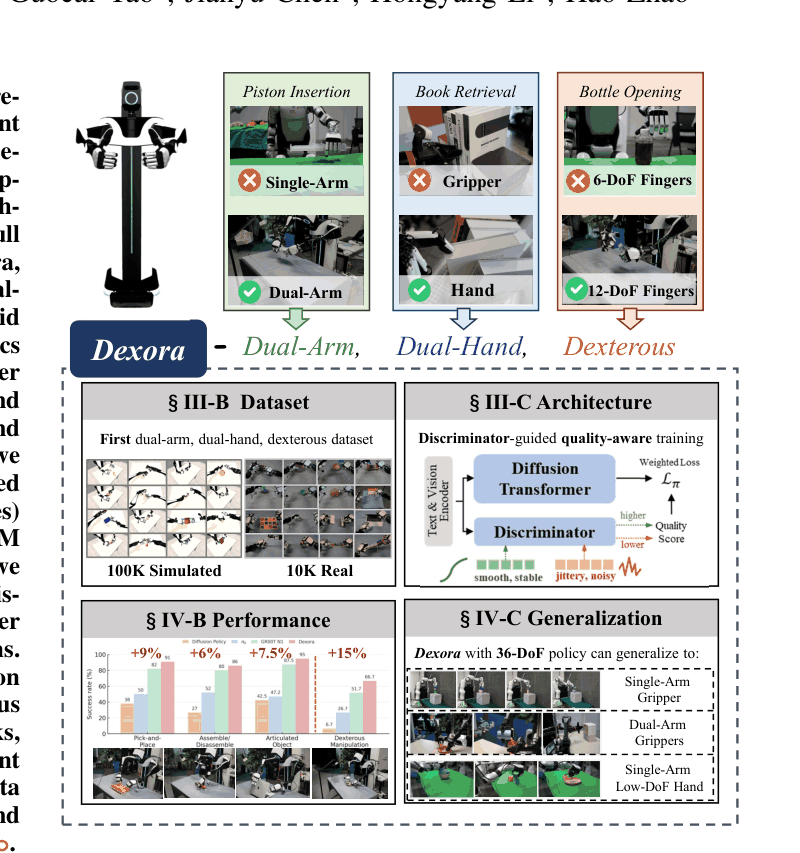
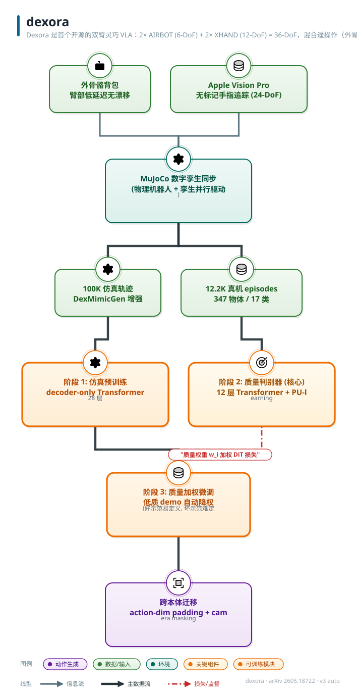

# Dexora: Open-Source VLA for High-DoF Bimanual Dexterity

- 本地 PDF：`papers/rl/dexterous/Dexora_2605.18722.pdf`
- arXiv：https://arxiv.org/abs/2605.18722
- 代码：https://github.com/flyingGH/Dexora-VLA
- 年份：2026 (ICRA 2026 Best Paper on Robot Manipulation)
- 团队：清华 + BAAI + 北大等 25 位作者
- 阶段：首个 36-DoF 双臂灵巧开源 VLA — 100K sim + 12.2K real demos

## 一句话总结

Dexora 是首个开源的双臂灵巧 VLA：2× AIRBOT (6-DoF) + 2× XHAND (12-DoF) = 36-DoF，混合遥操作（外骨骼背包 + Apple Vision Pro + MuJoCo 数字孪生）采集 12.2K 真实 episode（347 物体、17 类别）+ 100K 仿真数据，decoder-only Transformer (28 layers) + DiT action head。基础 12 任务 89.6%（vs GR00T N1 82.1%、π0 50.4%、DP 34.2%），灵巧 6 任务 66.7%（vs GR00T 51.7%、π0 26.7%、DP 6.7%）。discriminator-guided quality-aware 训练用 PU-learning 自动降权低质量遥操作数据。ICRA 2026 Best Manipulation Paper。

## 九问速览

1. **Problem**：双臂灵巧（36-DoF）缺开源 VLA——数据采集难、遥操作质量参差、跨本体迁移未验证。
2. **Bottleneck**：遥操作数据混入操作员疲劳期的低质轨迹，一视同仁训练被污染；人工逐条筛选上万条不现实。
3. **Insight**："好示范易定义、坏示范难定义"——PU-learning 只标少量正样本即可给全部数据打质量分。
4. **Method**：外骨骼+Vision Pro 混合遥操采数；DiT 动作头；12 层 discriminator 质量加权的三阶段训练。
5. **Evidence**：Basic 89.6%/Dexterous 66.7%（GR00T 82.1%/51.7%、π0 50.4%/26.7%、DP 34.2%/6.7%）。
6. **Ablation**：质量加权 Basic 85→95、Dexterous 55→80；真实数据比例 35% 处成功率跳升。
7. **Assumption**：100K sim+10K real episodes 的采集预算（外骨骼+VP 栈）；无触觉反馈。
8. **Failure**：twist-cap 等依赖力感的任务失败；灵巧任务 66.7% 远未饱和、最弱任务低。
9. **Opportunity**：触觉/力传感接入、PU 先验 π_P 的鲁棒性、12.2K→50K 数据的边际收益曲线。

| 维度 | 论文答案 |
|---|---|
| Perception | SigLIP 多视角 RGB+T5 语言+36-DoF 本体；无触觉 |
| Closed-loop | 闭环：DiT chunk 滚动推理执行 |
| Correction | 无执行层恢复机制 |
| Deployment | sim 预训练（DexMimicGen 100K）→ 真实数据质量加权微调 → 真机 zero-shot 评测；开源全栈 |

## 核心技术

*论文 Figure 1（p1）：Fig. 1*

1. **混合遥操作** — 外骨骼背包（臂部低延迟无漂移）+ Apple Vision Pro（手指 markerless tracking），物理机器人 + MuJoCo 数字孪生同步驱动；手部 24-DoF 的动作来自 vision pro 手指追踪，无手套/无标记
2. **Discriminator-Guided Quality-Aware Training** — 12 层 Transformer discriminator，PU-learning（正-未标注学习）objective 评分每条 demo，低质量数据自动降权：只标注少量高质量子集为正样本，其余按未标注处理，避免人工给全部 12.2K 条数据打分
3. **High-DoF→Low-DoF 迁移** — 36-DoF 策略通过 action-dim padding + camera masking 直接迁移到单臂夹爪/双臂夹爪/单臂低 DoF 手，一个模型覆盖多种本体配置
4. **三阶段训练** — Stage 1 sim pretrain（DexMimicGen 增强 100K 轨迹）→ Stage 2 在过滤后的真实数据上训 discriminator → Stage 3 quality-weighted 真实数据 fine-tune

## 底层原理与数学推导

*架构速览：Dexora 是首个开源的双臂灵巧 VLA：2× AIRBOT (6-DoF) + 2× XHAND (12-DoF) = 36-DoF，混合遥操作（外骨骼背包 + Apple Vision Pro + MuJoCo 数*

动作头为 DiT（diffusion Transformer），在动作 chunk 上做扩散去噪。训练损失为

$$L = \mathbb{E}_{t, x_0, \epsilon}\left[\, w_i \cdot \| \epsilon_\theta(x_t, c, t) - \epsilon \|^2 \,\right]$$

其中 $w_i$ 是第 $i$ 条 demo 的质量权重——由 discriminator 给出，低质量 demo 的权重趋近 0，高质量 demo 的权重趋近 1。Discriminator 用 PU-learning 训练：给定少量人工标注的高质量正样本 $P$ 与未标注集合 $U$（含正负），优化

$$L_{PU} = \mathbb{E}_{x \in P}\left[\log D_\phi(x)\right] + \mathbb{E}_{x \in U}\left[\log(1 - D_\phi(x))\right] - \pi_P \cdot \mathbb{E}_{x \in P}\left[\log(1 - D_\phi(x))\right]$$

其中 $\pi_P$ 是正样本先验比例——PU-learning 的关键性质：不需要负样本标注，只需正样本与先验 $\pi_P$，即可得到一致估计的判别器。三阶段中 sim pretrain 提供 backbone 能力，真实 fine-tune 在质量权重下收敛到"以好示范为主"的策略。

## 物理直觉解释

**36 个自由度同时动，是"双手弹钢琴"级别的协调问题**。每只手 12-DoF 的手指加上 6-DoF 手臂，两只手共 36 个维度——如果每个自由度独立建模，动作空间大到不可想象。物理上的关键约束是**手的自由度高度相关**：抓握时 4 根手指几乎同步弯曲，旋转手腕时手指不需要重新规划。DiT 扩散头学到的正是这个相关性结构：它生成的不是 36 个独立数值，而是"整体协调的抓握模式"。这也是 36-DoF 策略能通过 action-dim padding 迁移到低 DoF 本体的原因——高维训练让模型学会的是"手的意图"（抓、捏、拧），这个意图在 36 维和 6 维里是一样的。

**遥操作数据天然"质量参差"，因为采集者会疲劳**。外骨骼背包采集臂部动作、Vision Pro 追踪手指——操作员做 30 分钟双臂灵巧演示后，手指会抖、手臂会酸，后 10 分钟的轨迹和前 20 分钟不是一个质量水平。数据里"好示范"和"差示范"混在一起，如果一视同仁地训练，策略会被差示范污染——就像**学生抄的作业里混着错题**，老师必须知道哪些题是错的。人工逐条筛选 12.2K 条数据不现实，Dexora 的 discriminator 就是那个"自动批改作业的老师"：只让老师确认一小撮"好作业"（PU-learning 正样本），其余由判别器自动归类打分，差作业自动降权。

**为什么 PU-learning 而不是直接二分类？** 常规做法需要给每条数据标"好/坏"，但"坏数据"本身难以定义——一条 demo 可能是"手臂好、手指差"或"前半好、后半差"，人工标注坏样本的一致性极差。PU-learning 只要求"正样本明确、先验已知"，其余一律不标注——这符合物理直觉：**"好"容易定义（任务成功 + 动作自然），"坏"难以定义（失败的原因千奇百怪）**。只需标注少量成功示范，判别器就能从"与正样本的分布距离"推断质量——就像评委给选手打分不需要先定义"所有可能的失误"。

## 工程细节与实操指南

- 硬件：2× AIRBOT 6-DoF + 2× XHAND 12-DoF = 36 DoF；遥操作=外骨骼背包 + Apple Vision Pro
- Backbone：decoder-only Transformer 28 layers, hidden 1024, 16 heads
- Vision：SigLIP multi-view RGB；Language：T5
- Action：DiT action head, DPMSolver++ 采样
- Data：100K sim（DexMimicGen 增强）+ 12.2K real episodes（347 objects, 17 categories）
- 训练：三阶段——sim pretrain → discriminator（12L Transformer, PU-learning）→ quality-weighted fine-tune
- 迁移：action-dim padding + camera masking 支持单臂夹爪/双臂夹爪/单臂低 DoF 手

## 实验协议清单

| 项目 | 论文设置 | 来源与备注 |
|---|---|---|
| 观测 | 多视角 RGB（SigLIP）+语言（T5）+36-DoF 关节状态（遥操期 20 Hz 记录） | Sec III / IV-A |
| 动作空间 | 36 维连续关节命令（4 个物理组分解）；chunk 长度 L=32 | Sec IV-A |
| 控制频率 | 各方法统一控制频率（具体 Hz 未报告） | Sec IV-A |
| 重规划频率 | 每 chunk L=32 步 | Sec IV-A |
| 动作 horizon | chunk L=32 | Sec IV-A |
| 数据 | 100K 仿真轨迹（361 h，297 物体/30 类）+10K 真机 episodes（177.5 h，347 物体/17 类）——笔记正文记 12.2K，与 PDF v1 的 10K 有出入 | Sec III-B |
| 奖励 | 无 RL 奖励（IL 为主）；PU-learning discriminator 给出质量权重 w_i 加权 DiT 损失 | Sec III-D |
| Reset | 遥操作采集人工复位；评测期 reset 未报告 | |
| 成功定义 | 任务完成判定（表格报 20 rollouts 成功率） | Sec IV-A |
| 评估次数 | 20 rollouts/任务（基础 12+灵巧 6） | Sec IV-A / Table I |
| 随机种子 | 未报告 | |
| 扰动测试 | zero-shot 评测含未见组合；无系统性扰动报告 | |
| 真机 | 2×AIRBOT+2×XHAND 36-DoF 平台，18 个任务（12 基础+6 灵巧） | Sec IV |
| 算力 | 预训练 100K 步：8×A100、batch 64；discriminator 10K 步；baseline 微调 50K 步：4×L20 LoRA；推理单卡 RTX 4090 | Sec IV-A |
| 特权信息 | 无（IL 训练无 oracle；MuJoCo 数字孪生仅采集期同步使用） | |

**附录陷阱自查**：
- privileged 信息：无 teacher-student/oracle
- reward shaping：无 RL 奖励；PU 质量加权相当于数据级 reweighting（正样本先验 π_P 决定筛选强度，笔记记保留约 18% episodes）
- reset 难度：人工采集复位
- eval budget：20 rollouts/任务，中等
- 底层控制栈：36 维关节命令，PD 细节未报告
- 数据优势：基座独占 100K sim+10K real 预训练（baseline 只给 100 demos/任务+50K 步微调）——预训练数据差是主要比较口径差

## 消融实验与分析

主结果（12 基础任务 / 6 灵巧任务，论文 Table）：

| 方法 | Basic (%) | Dexterous (%) |
|------|----------|--------------|
| **Dexora** | **89.6** | **66.7** |
| GR00T N1 | 82.1 | 51.7 |
| π0 | 50.4 | 26.7 |
| Diffusion Policy | 34.2 | 6.7 |

数据与质量相关的消融（论文实验图，待确认：细粒度拆分需读全文）：

| 消融配置 | 结果 |
|---------|------|
| Discriminator 质量加权（Basic） | 成功率 85 → 95（待确认：具体任务集） |
| Discriminator 质量加权（Dexterous） | 成功率 55 → 80（待确认：具体任务集） |
| 数据组合消融（真实数据比例 0→35→65） | 成功率随之上升，35% 处跳升明显 |
| 数据组合消融（比例 10→60→85 的另一组任务） | 成功率持续上升 |

**核心结论**：(1) 双臂灵巧的增量价值在"灵巧任务"上最大——Dexora 66.7% vs π0 26.7%（+40pp）、vs DP 6.7%（+60pp），基础任务差距（89.6 vs π0 50.4）主要由动作空间表达力（DiT）贡献；(2) 数据质量加权是真实收益来源——仅加 discriminator 加权，Basic 85→95、Dexterous 55→80，说明 12.2K 真实数据里混入的低质量遥操作轨迹如果不加权会显著拖累策略；(3) 真实数据比例的消融（35% 处跳升）说明"少量高质量真实数据"是灵巧任务的必要成分——纯 sim pretrain 无法覆盖真实手指接触的物理；(4) 对 GR00T 的 7.5pp（Basic）与 15pp（Dexterous）优势说明"更高自由度 + 质量加权训练"比"同量级数据的通用训练配方"更适合双臂灵巧。

## 技术权衡（Trade-off）

| 优势 | 劣势 |
|------|------|
| 首个开源 36-DoF 双臂灵巧 VLA（硬件+数据+模型全栈） | 36-DoF 硬件成本高，外骨骼+Vision Pro 遥操作栈复杂 |
| Discriminator 自动质量过滤，无需人工逐条标注 | 无触觉反馈导致 twist-cap 等依赖力感的任务失败 |
| High→Low-DoF 迁移：一个模型覆盖多种本体 | 100K sim + 12.2K real 的训练规模对社区复现仍有门槛 |
| ICRA 2026 Best Manipulation Paper | 灵巧任务 66.7% 仍远未饱和，最弱任务成功率低 |

## 技术价值与演进定位

Dexora 的价值是**把"双臂灵巧"从闭源 demo 变成可复现的开源栈**：硬件设计、遥操作采集、数据、模型、代码全开源，首次让 36-DoF 灵巧操作有了社区基线。它的工程创新（外骨骼背包 + Vision Pro 手指追踪 + 数字孪生同步）回答了"灵巧数据怎么采"的问题——不需要昂贵的动捕房，一个背包一副眼镜就能在普通实验室采集 24-DoF 手部数据。质量感知训练则回答了"遥操作数据怎么筛"的问题——PU-learning 判别器把人工标注成本降到"只标少量正样本"。方法论上，它是"数据质量作为一等公民"的代表作：与 Dexora 相比，绝大多数 VLA 工作把数据当同质资源，Dexora 证明了"谁教的"和"教了多少"同样重要。

## 与其他论文的关系

- GR00T N1：最强开源对照（82.1%/51.7%），Dexora 以 36-DoF 动作空间和更细的指部数据在其上 +7.5/+15pp——对比核心是"自由度覆盖"vs"通用配方"。
- π0（Physical Intelligence）：π0 的 flow matching 动作头被 Dexora 的 DiT 动作头继承与放大，π0 只有夹爪级自由度，无法表达指部抓握——50.4%/26.7% 的成绩差距部分来自动作空间本身。
- AlohaMini2：低成本双臂入门（6-DoF/手），与 Dexora 互补——一个追求普及率，一个追求灵巧上限。
- 与 DexMimicGen 等仿真增强：Dexora 的 100K sim 数据由其生成，验证了"真实遥操作 + 仿真重放"的混合数据范式在灵巧任务上可行。

## 精读问题

1. **PU-learning 的稳定性**：正样本先验 $\pi_P$ 的估计误差如何影响判别器质量？当真实数据里低质量比例很高（操作员新手）时，PU 判别器是否会退化？
2. **质量权重与过拟合**：$w_i$ 把低质量 demo 的权重压到接近 0，等价于丢弃数据——被丢弃的轨迹里是否包含"失败边界"信息（知道什么会失败），对鲁棒性是否有隐性损失？
3. **36→low-DoF 迁移的信息损失**：action-dim padding 把低 DoF 动作补零到 36 维——补零位置是否让模型产生"幻觉自由度"？camera masking 在单臂配置下的观测裁剪是否丢失双手机器人共享的上下文？
4. **无触觉的极限**：twist-cap 类任务失败的具体模式（滑脱？用力不足？）——接入触觉/力传感后灵巧任务能提升多少，是否 66.7% 的瓶颈在感知而非动作？
5. **外骨骼 + Vision Pro 的采集偏差**：手指追踪的 markerless 误差有多大？操作员疲劳导致的轨迹质量随时间分布如何变化——discriminator 学到的"质量"是否包含"操作员风格"的混淆？
6. **数据规模的边际收益**：12.2K → 50K 真实数据的成功率提升曲线是否饱和？灵巧任务 66.7% 与基础任务 89.6% 的差距主要来自数据量还是任务本身的物理难度？
