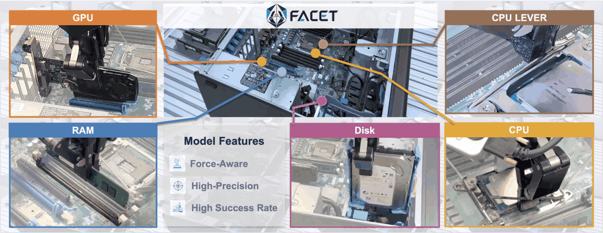
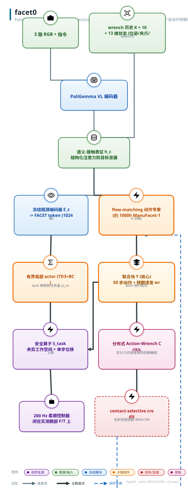
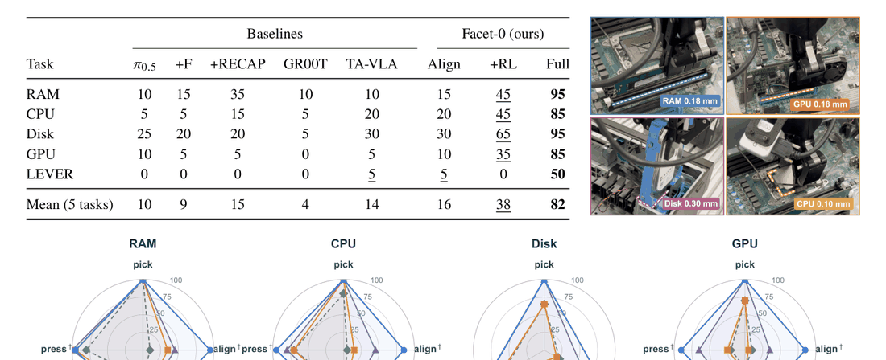

# Facet-0: 面向接触富集精确操作的机器人基础模型

- arXiv: https://arxiv.org/abs/2609.01596
- Source: https://arxiv.org/abs/2609.01596
- Project: https://pine-lab-ntu.github.io/facet-0/
- 本地 PDF：`/Users/luogu/physical_intelligence/papers/rl/dexterous/Facet-0_2609.01596.pdf`
- Year: 2026
- Category: rl
- Priority: high

## 一句话总结

PaliGemma 视觉-语言骨干 + flow-matching 动作专家联合生成 50 步 Cartesian 动作块与"该动作预期诱发的腕部 wrench"（$Y\in\mathbb{R}^{50\times13}$，只有动作被执行、wrench 始终是预测量），把接触从"事后观测"变成"被预测、被估值的动作后果"；用 1000 小时力同步语料 ManuFacet-1K 做语义-接触对齐，再用分布式 Action-Wrench Critic 做 contact-selective 后训练，最后用只更新 6.6% 参数的有界局部 actor 适配新零件。五个亚毫米级电脑装配任务平均 82% 成功（最强基线 π0.5+RECAP-style 15%，5.5 倍），0.5 mm 定位精度、50 ms 指令延迟，比专家遥操作快 40%。

## 九问速览

1. **Problem**：亚毫米级电脑装配（0.10-0.30 mm 间隙）上 VLA 成功率极低（π0.5 仅 10%）。
2. **Bottleneck**：接触后果不可见——把 wrench 塞进输入（π0.5+F 反而 9%）不改变行为；接触信号从未被估值。
3. **Insight**：wrench 应作为"被预测的动作后果"进入生成目标与 critic 估值——预报对了才算理解接触。
4. **Method**：action-wrench 联合 flow matching+分布式 Action-Wrench Critic+contact-selective credit+有界局部 actor 适配。
5. **Evidence**：五任务平均 82%（最强基线 15%，5.5×）；0.5 mm 定位、50 ms 延迟、比专家遥操作快 40%。
6. **Ablation**：16%→38%（值引导 +22）→82%（局部适配 +44）；去全部接触角色 45% 且峰值离轴力升 5 倍。
7. **Assumption**：腕部六轴 F/T 硬件+约 1000 小时 ManuFacet-1K 语料；200 Hz 柔顺控制兜底。
8. **Failure**：LEVER 任务 +RL 反退到 0%；单角色消融 20 试次统计力不足；依赖腕部力传感。
9. **Opportunity**：无腕部 F/T 的力条件化蒸馏、critic 蒸回 actor 减推理栈、盒宽自适应。

| 维度 | 论文答案 |
|---|---|
| Perception | 3 路 RGB+13 维状态（EE 位姿 6+夹爪 1+wrench 6）+K=10 wrench 历史；部署保留实测腕部 F/T |
| Closed-loop | 闭环：粗专家 5-10 Hz→精化专家 20 Hz→200 Hz 柔顺控制闭在实测力上 |
| Correction | 干预成功片段作 BC 锚+恢复帧保留正 credit（恢复率 44%→81%）；replay 存安全过滤后命令 |
| Deployment | 约 1000 h 真机数据训练；评测底盘随机+自动送料器；新零件适配仅 10 demos+3 h（更新 6.6% 参数） |

## 核心技术

*论文 Figure 1（p2）：Figure 1. Qualitative overview of Facet-0 in precision computer assembly. The center shows the robot*

1. **语义-接触表征（joint action-wrench flow matching）**：观测 = 三路 RGB + 指令 + 13 维状态（末端位姿 $x_t\in\mathbb{R}^6$、夹爪开度 $g_t\in\mathbb{R}$、wrench $w_t\in\mathbb{R}^6$），$K=10$ 帧因果 wrench 历史与视觉-语言语义、运动学状态融合为 $h^c_t$；解码目标是动作与"下一步测得 wrench"按行配对的联合块（第 $k$ 行把 $a_{t+k}$ 与 $\hat w_{t+k+1}$ 配对，一步错位是刻意的因果约定）。结构化注意力让 action-wrench 路径与因果 VQA 路径共享视觉-语言前缀、互不可见对方目标 token，防泄漏。
2. **Action-Wrench Critic（分布式）**：$Z_\psi(h^c_t,Y_t)$ 对"动作+其预期 wrench"的联合提案打分，能区分几何进度相同但接触结局不同的两条运动（干净插入 vs 卡死）；四个辅助头（近未来 wrench、接触强度、接触内进度、成功排序）专门拉开"进度一致但接触状态不一致"的观测。
3. **Contact-selective credit**：用无折扣短视野 credit $\delta^{(N)}_t$（$N<H$）而非全局回报排序帧，按接触 regime（contact/free）分桶取 top 分位做正标签，以 $(1+\lambda c_t)$ 加权 flow-matching 损失精调生成策略；正标签以短 tag 追加到指令尾部，推理时 classifier-free-guidance 式组合，$s=0$ 精确退化为无条件策略。
4. **有界局部适配（FACET token + TD3+BC）**：冻结瓶颈编码器 $E_z$ 把 $h^c_t$ 压成 FACET token，局部 actor 输入 $e_t\in\mathbb{R}^{1024}$（四个 $\mathbb{R}^{256}$ 模态拼接），tanh 映射到任务盒 $[a_{\min},a_{\max}]$ 的绝对 Cartesian 目标（不是残差）；辅助 wrench 头只做监督预测、绝不做力命令，200 Hz 柔顺控制仍闭环绕实测腕部 F/T。
5. **ManuFacet-1K 数据集**：约 1000 小时力同步演示+闭环 rollout，三种具身、两类机箱、多制造单元，0.5 mm 动作分辨率，七阶段技能相位标注（align/insert/press/seat/fasten 五个接触相位为关键相位），VLM 生成子任务/指令对，异常轨迹与修正轨迹成对保留（数据飞轮）。
6. **三层执行层级 + 安全算子**：粗专家 5–10 Hz 约 5 mm 分辨率 → 精化专家 20 Hz 约 0.5 mm → 200 Hz 柔顺控制；$S^{task}$ 夹剪工作空间与单步位移上限，replay 里存的是安全过滤后的实际命令，保证 critic 回归目标与被观测动力学一致。

系统全貌（动作被执行，wrench 保持预测性）：

*架构速览：PaliGemma 视觉-语言骨干 + flow-matching 动作专家联合生成 50 步 Cartesian 动作块与"该动作预期诱发的腕部 wrench"（$Y\in\mathbb{R}^{50\times13}*

## 底层原理与数学推导

每帧 13 维状态 $s_t=[x_t, g_t, w_t]$，编码融合为 $h^c_t = F_{\text{fuse}}(h^{VL}_t, E_s(s^{kin}_t), E_w(W_{t-K+1:t}))$。条件 flow matching 以线性插值 $X_\tau=(1-\tau)Y^{data}_t+\tau\epsilon$、目标速度 $U_\tau=\epsilon-Y^{data}_t$ 训练联合去噪场，动作列与 wrench 列分别归一化：

$$\mathcal{L}_{AW}(\theta)=\mathbb{E}\Big[\big\|v^a_\theta(X_\tau,\tau\mid h^c_t)-U^a_\tau\big\|_2^2\Big]+\lambda_{pre}\,\mathbb{E}\Big[\big\|v^w_\theta(X_\tau,\tau\mid h^c_t)-U^w_\tau\big\|_2^2\Big],\quad \lambda_{pre}=0.1$$

其中 $\tau\sim\mathrm{Beta}(1.5,1)$。wrench 误差只有当模型表征了"提议运动如何改变接触"时才能下降——这是把力从输入变成解码目标的核心学习信号。语义目标 $\mathcal{L}_{VQA}$ 是答案 token 交叉熵，与 $\mathcal{L}_{AW}$ 用两个独立优化器按 4:1 交替（一次运行 32K 动作分支更新对 8K VQA 更新），因为 flow-matching MSE 与 token 交叉熵量纲不同、直接加权求和会让有效权重成为尺度伪影。

部署 rollout 上，VLM judge $\Omega$ 切分子目标并标相位，单步奖励把进度与接触质量压进一个标量：

$$r_t=\Omega_t\Big(1+\beta\big(1-\tfrac{\Delta_t}{T_{\max}}\big)\Big)+\big(-\alpha(\|w_t\|_{\varphi_t}-1)\big)^+$$

即完成子目标得分、提前完成加分、按相位包络归一的越界用力扣分（$\alpha,\beta\ge 0$ 为交换率，具体取值未披露）。critic 做分布式 TD：$\mathcal{L}_Q(\psi)=\mathbb{E}\big[\mathcal{D}_{dist}\big(Z_\psi(h^c_t,Y_t),\,r_t+\gamma(1-d_t)\bar Z_\psi(h^c_{t+1},Y_{t+1})\big)\big]$。帧级 credit 是刻意无折扣、短视野的：

$$\delta^{(N)}_t=\sum_{j=0}^{N-1}r_{t+j}+V_\psi(h^c_{t+N})-V_\psi(h^c_t),\qquad N<H$$

论文的论证：进度校准的 $V_\psi$ 近似是归一化进度的仿射函数，若用全视野折扣 bootstrap，$\delta$ 会变成 $V_\psi(h^c_t)$ 自身的仿射——成功轨迹的早期自由空间帧会仅因"早"而高分，正标签预算被策略本来就擅长的接近段吃掉。截断到 $N$ 且去折扣后，$\delta$ 度量的是帧对"该轨迹自身校准进度率"的局部偏离。后训练损失 $\mathcal{L}_{post}(\theta)=\mathbb{E}_t[(1+\lambda c_t)\mathcal{L}_{FM}(\theta;Y^{data}_t,h^c_t,b_t)]$，其中接触 regime 内阈值 $q_{\rho_t}$ 保证正样本不被自由空间帧垄断。

局部适配的 actor 目标（TD3 双 critic + 成功过滤的干预锚 + 辅助 wrench 预测）：

$$\mathcal{L}_{actor}(\eta)=-\mathbb{E}\big[Q_{\xi_1}(e_t,a_t)\big]+\lambda_{BC}\mathcal{L}_a(a_t,a^{human}_t)+\lambda_{pred}\mathcal{L}_w(\hat w_{t+1},w_{t+1})$$

有界化 $a_t=a_{\min}+\tfrac{1}{2}(\tanh u^a_t+1)\odot(a_{\max}-a_{\min})$，twin critic 只吃 7 维可执行动作。单步绝对命令（非 chunk）让每个环境步都产出转移、credit 视野保持短——这是样本效率的两个直接来源。

## 物理直觉解释

**老装配工的"手感预报"**。想象一个装配工在插 CPU：眼睛只能看到引脚接近插槽前的最后一毫米之前，之后的成败全凭指尖传来的是"顺滑滑入"还是"越压越紧的顶抗"。Facet-0 让策略在出手之前就把"这一下压下去指头上会感到什么"作为生成对象的一部分——wrench 不是它读到的事后记录，而是它必须在动作生效前就报出的预报。这就像跳水运动员起跳前已经在脑中预演了入水时水花的大小：预报错了，说明它根本没理解自己将要做的动作和接触面的关系。$\pi_0.5{+}F$ 把 wrench 塞进输入 token 却只拿到 9%（比不加还低 1 个点），正说明"知道刚才受了多大的力"和"知道这一下会受多大的力"是两种完全不同的能力，后者才改变行为。

**保险精算师给运动组合定价**。两条运动在相机看来一模一样：末端都以相同速度下压到相同深度。但一条对准了、wrench 平稳；另一条歪了 0.1 mm、wrench 斜向分量持续爬升直到卡死。几何进度打分的 critic 无法区分它们——就像只看行驶里程的保险公司分不出谨慎司机和路怒司机。Action-Wrench Critic 把"预期 wrench"与动作一起送进估值，相当于给每条提议运动附上事故率报表：干净对齐的报价高，硬怼的报价低，哪怕两者最终都"完成"。分布式回进一步保住成功率分布的双峰结构（成功/卡死两个真实结局），避免被均值抹平成一个没有任何帧真正达到的中间值。奖励里"越早完成加分、越界用力扣分"则像既奖励准时送达又惩罚超速罚款的快递考核。

**限位盒里的学徒与残差补丁的区别**。换了一个更重、卡扣更硬的新内存条时，Facet-0 不动师傅（冻结骨干），只训练一个被关在任务盒 $[a_{\min},a_{\max}]$ 里的学徒：学徒可以提出盒内任意远的目标——比如撞到插槽边缘后撤回、横移、再进入——但永远出不了盒，出门还有 $S^{task}$ 的限速带拦着。对比残差式修补：残差的安全性来自"修正量很小"，可正是这个小量限制了它偏离一个本来就需要被修正的基线——论文称之为"残差的小既是安全也是天花板"。所以 10 条演示加 3 小时训练能把新模块从 5% 拉到 45%：演示预算全部花在"零件变掉的那部分动力学"上，而槽位几何、接近动作、指令语义这些没变的东西一点不用重学。

## 工程细节与实操指南

- **骨干与规模**：PaliGemma 视觉-语言骨干 + flow-matching 动作专家（$\pi_0$ 系风格）；全模型参数量未披露，仅给出局部适配只更新 6.6% 的参数（约十五分之一）；局部 actor 接口为四个 $\mathbb{R}^{256}$ 模态嵌入拼接成 $e_t\in\mathbb{R}^{1024}$，共享 MLP actor 双头输出 $u^a_t\in\mathbb{R}^7$ 与 $\hat w_{t+1}\in\mathbb{R}^6$。
- **关键超参**：$K=10$（wrench 历史），$H=50$（chunk 视野），$\lambda_{pre}=0.1$，$\tau\sim\mathrm{Beta}(1.5,1)$，优化器交替比例 4:1（32K/8K 更新）。奖励交换率 $\alpha,\beta$、折扣 $\gamma$、credit 视野 $N$、$\lambda$、$\lambda_{BC}$、$\lambda_{pred}$、CFG 引导尺度 $s$ 的默认值均未给出（待确认：论文附录未列常数表）。
- **数据**：ManuFacet-1K 约 1000 小时；任务占比 CPU 37.3% / RAM 21.9% / Disk 23.4% / GPU 17.3%；0.5 mm 动作分辨率；15 Hz 训练时间线（硬件时间戳共享时钟），200 Hz 控制器保留高频率流；episode 数与三种具身各自时长占比未披露（待确认）。
- **硬件**：每个单元 = 力矩控制机械臂 + 平行夹爪 + 腕部六轴 F/T + 三 RGB 相机 + 关节本体感知；演示用带力反馈的 kinesthetic 遥操作；评测时底盘位姿随机、零件由自动送料器供给、每格 20 试次预声明协议不重跑。
- **延迟与精度**：指令延迟 50 ms（$\pi_0.5$ 为 150 ms，差 3 倍，这是 20 Hz 精化专家能开起来的前提）；定位精度 0.5 mm（$\pi_0.5$ 约 5 mm）；任务完成比专家遥操作快 40%。
- **评测套件**：五任务 23 子目标、七动词词汇表，9 个自由空间 + 14 个接触关键子目标；间隙 0.10–0.30 mm；相位安全限 $F_{\max}$：RAM 70 N、CPU 8 N（针阵）/35 N（ZIF 座）、Disk 20 N、GPU 55 N、LEVER 60 N。
- **适配实操**：10 条演示 + 3 小时单机训练；安全过滤后的命令存入 replay 保证 critic 一致性；干预锚只保留"事后确认成功"的片段且确认键不进入观测（防策略学会读键）；训练硬件配置未披露（待确认）。
- **分布式 critic 参数化**：论文自述"具体分布式参数化与回归距离是实现相关的"，方法只要求均值为 $Q_\psi$（待确认：复现需自选 QR-DQN/QR-C51 类实现）。

## 实验协议清单

| 项目 | 论文设置 | 来源与备注 |
|---|---|---|
| 观测 | 3 路 RGB+13 维状态（x_t∈R^6+g_t+w_t∈R^6）+K=10 因果 wrench 历史；15 Hz 训练时间线（共享硬件时钟） | Sec 3 / 附录 A |
| 动作空间 | H=50 步×7 维 Cartesian 动作块（局部适配为单步绝对目标，tanh 映射到任务盒 [a_min,a_max]） | Sec 3/5 |
| 控制频率 | 粗专家 5-10 Hz（约 5 mm）→精化专家 20 Hz（0.5 mm）→200 Hz 柔顺控制器；指令延迟 50 ms | Sec 5 |
| 重规划频率 | 精化专家 20 Hz 持续更新 | Sec 5 |
| 动作 horizon | H=50 chunk；credit 视野 N<H（刻意无折扣短视野） | Sec 4 |
| 数据 | ManuFacet-1K 约 1000 h（CPU 37.3%/RAM 21.9%/Disk 23.4%/GPU 17.3%）；episode 数与具身占比未披露；适配 10 demos+3 h | Sec 3 / 附录 |
| 奖励 | VLM judge 子目标进度+提前完成加分+相位包络归一的越界用力扣分（α,β 未披露）；分布式 TD critic | Sec 4 |
| Reset | 自动送料器供零件+底盘位姿逐 trial 随机；适配早期靠 S_task 兜底 | Sec 6.1 / 附录 A |
| 成功定义 | 23 子目标任务链全达成；同时报告 violation/intervention/recovery/峰值离轴力 | Sec 6.1 |
| 评估次数 | 每格 20 trials（预声明协议不重跑） | Sec 6.1 |
| 随机种子 | 未报告（20 试次/格） | |
| 扰动测试 | 底盘位姿随机+送料器供件；未见零件 10 demos 迁移 45%（9×最强基线） | Sec 6.4 |
| 真机 | 5 任务×8 方法（20 trials/格）；适配范式对照（2 h 窗口、30 min 检查点） | Sec 6 |
| 算力 | 训练硬件配置未披露；仅局部适配更新 6.6% 参数（约 1/15） | 附录 |
| 特权信息 | 无 oracle state；干预确认键不进观测（防策略读键）；VLM judge 切分奖励属模型级监督 | Sec 3/5 |

**附录陷阱自查**：
- privileged 信息：无 oracle；但奖励由 VLM judge 生成（模型级监督）+replay 存安全过滤后命令（critic 与 actor 有已知错位）
- reward shaping：dense 进度+接触包络力扣分+提前完成加分（交换率 α,β 与 credit 视野 N 均未披露——复现缺口）
- reset 难度：自动化（送料器）
- eval budget：20 trials/格，单格分辨率 5pp（论文自认 contact-role 消融排序不可分辨）
- 底层控制栈：有：200 Hz 柔顺控制器+S_task 安全算子（单步位移上限+工作空间剪裁）
- 数据优势：约 1000 h 独占语料；baseline 同预算训练（对齐协议），但语料本身是自家资产

## 消融实验与分析

*论文 Table 2（p11）：Table 2. Task-level success rate (%) on the assembly suite, 20 trials per cell. Left: all eight meth*

主表：五任务平均成功率（20 试次/格），受控变体剥离三个组件的贡献：

| 方法 | RAM | CPU | Disk | GPU | LEVER | 平均 |
|---|---|---|---|---|---|---|
| $\pi_0.5$ | 10 | 5 | 25 | 10 | 0 | 10 |
| $\pi_0.5{+}F$（wrench 作输入 token） | 15 | 5 | 20 | 5 | 0 | 9 |
| $\pi_0.5{+}$RECAP-style | 35 | 15 | 20 | 5 | 0 | 15 |
| GR00T N1.7 | 10 | 5 | 5 | 0 | 0 | 4 |
| TA-VLA | 10 | 20 | 30 | 5 | 5 | 14 |
| Facet-0 Align（仅对齐） | 15 | 20 | 30 | 10 | 5 | 16 |
| Facet-0 +RL（加值引导） | 45 | 45 | 65 | 35 | 0 | 38 |
| Facet-0 Full（加局部适配） | 95 | 85 | 95 | 85 | 50 | 82 |

**核心结论：**
1. **组件贡献干净可加**：16% → 38% → 82% 的阶梯中，值引导 RL 贡献 +22 平均点（集中在四个插入任务 +25 到 +35 点），局部适配再贡献 +44 平均点（RAM/Disk/GPU/LEVER 各 +50、CPU +40）；每格仅 20 试次，单格分辨率 5 个点。
2. **"摸到力"不等于"对力行动"**：$\pi_0.5{+}F$（9%）与 TA-VLA（14%）都拿到接触反馈，却与没有 wrench 的 $\pi_0.5$（10%）和 Align（16%）挤在同一带内，比全系统低 5–9 倍——接触信号必须以"被估值的动作后果"形式进入，才有行为层面的差别。
3. **失败集中在接触段**：全系统 13 个报告接触子目标均值 87%，端到端 82% 的差额来自链式判据（每步都要成功）；所有方法的 pick 行 60–100% 而 align/place 塌陷（$\pi_0.5$ 在 RAM/GPU align 仅 10%/5%，Facet-0 达 95%/85%）。
4. **LEVER 是结构性难点**：唯一无自由空间子目标的任务（两次连续按压），+RL 变体在此反而从 Align 的 5% 掉到 0%（1 个试次的差，20 试次下不构成显著排序，但方向值得注意），只有加局部适配才到 50%。

接触角色消融（RAM 插入，峰值离轴力归一到无力变体 = 1.0 倍）：

| 变体 | 成功率 | 峰值离轴力 |
|---|---|---|
| 完整配方 | 95 | 0.2 |
| 去预测 wrench | 90 | 0.2 |
| 去 critic wrench | 85 | 0.5 |
| 去适配 wrench | 85 | 0.4 |
| 去全部接触角色 | 45 | 1.0 |

单独移除各角色只差 1–2 个试次（20 试次下排序不可分辨），但接触质量模式一致：预测 wrench 的移除保住 0.2 倍峰值，而去 critic/适配 wrench 分别升到 0.5/0.4 倍——估值与适配承担"温柔度"，预测承担表征。论文明确承认此对比的统计局限。

部署侧对照（Disk 任务、同数据同预算）：匹配 AWR 后训练 20% 成功 / 47% 干预 / 44% 恢复 → Facet-0 后训练 65% / 24% / 81%（+45 成功点、-23 干预点、+37 恢复点）；机理是 AWR 用标量优势全局重加权，会滤掉演示中稀缺的接触恢复帧，而 regime 内排序把它们留在正样本集。适配范式对照（两小时窗口、30 分钟检查点）：DSRL 到 90% 未达成（30 分钟 10%、违规 90%）、位置残差 off-policy 35.1 分钟（80%、20%）、Facet-0 局部适配 10.5 分钟（95%、5%）。少样本迁移（10 演示 + 3 小时）：$\pi_0.5$/$\pi_0.5{+}F$/TA-VLA 各 5%、GR00T 0%、Facet-0 45%（参数量 6.6% 对 100%），9 倍于最强基线。

## 技术权衡（Trade-off）

| 优势 | 劣势 |
|---|---|
| 接触信号以"预测+估值+适配"三角色全生命周期进入，82% vs 15% 的差距远超任何单点改进 | 依赖腕部六轴 F/T 硬件；无腕部力传感的单元需力条件化蒸馏（论文自列的未来工作） |
| wrench 始终是预测量而非力命令，200 Hz 柔顺控制与安全算子的契约不被学习系统破坏 | 安全算子只给运动学限界（单步位移、工作空间），论文明确不主张能量罐式的无源性/硬力界限 |
| 局部适配只动 6.6% 参数 + 有界盒，回归安全（不会遗忘骨干语义）与操作安全（命令恒可接纳）双保险 | 有界绝对参数化放弃残差的小步先验，早期适配回合依赖 $S^{task}$ 兜底；适配期间 critic 学安全过滤后命令、actor 提升未过滤提案，两者存在已知错位 |
| 分布式 critic 保住成功/失败双峰，恢复帧保留正 credit，干预率减半（47%→24%） | contact-role 消融每格 20 试次，单角色排序不可分辨；LEVER 上 +RL 出现 0% 的反常回退未解释 |
| 50 ms 延迟 + 0.5 mm 精度达到产线级；数据飞轮保留失败-修正对 | 评测限于腕部传感、平行夹爪、共享底盘夹具的电子装配；其他末端执行器/接触几何未验证 |

## 技术价值与演进定位

这篇论文把"force-aware VLA"从输入侧增强（ForceVLA/TA-VLA 的 MoE 融合、辅助预测）推进到**生成目标+估值对象+适配锚**的三重身份，是接触信号生命周期管理的完整提案。它与 RECAP/$\pi^\star$0.6 式"经验后训练"同频，但价值函数换成动作-wrench 联合分布式的打分，干预率被当作部署指标而非仅训练成本。有界局部适配线（对比 DSRL 潜噪声转向、残差 off-policy）给出第三条路：绝对目标盒而非小修正。ManuFacet-1K 补上了操纵语料库矩阵中"同步 F/T + 接触相位标注"的空格（OXE 1.4M 轨迹无同步 F/T、FMB 约 31 h、REASSEMBLE 约 13 h）。局限同样清晰：受控评测域窄、单角色消融统计力不足、力传感依赖。

## 与其他论文的关系

1. `notes/rl/dexterous/torl-vla.md` — TORL-VLA 同样让 VLA 预测动作+wrench 序列并用在线 RL 精调（coffee 30/30、egg 30/30），但其 wrench 反馈用于驱动在线 actor-critic 且有 intervention-censored critic；Facet-0 的 critic 改为对"联合提案"离线分布式估值，并把干预成功片段做成 BC 锚（恢复率 44%→81% 对 TORL 的干预删置零处理是两种归因纪律）。两者在"wrench 是预测目标"上同源，在"谁来消费 wrench"上分叉。
2. `notes/rl/vla/rl-token.md` — RL Token 把冻结 VLA 最终层 embedding 压成 1×2048 读出 token 供小 actor-critic（螺丝 20%→65%，15 分钟到 5 小时真机数据）；FACET token $z_t=E_z(h^c_t)$ 是同构设计，差异在于 Facet-0 的瓶颈喂的是"语义-接触"融合表征而非纯 VL embedding，且适配目标是绝对盒而非参考锚定 chunk（10 演示 + 3 h → 45% vs 5%）。
3. `notes/architecture/pi05.md` — $\pi_0.5$ 是本文骨干谱系与主基线：均值 10%、$\pi_0.5{+}F$ 9%，150 ms 延迟对 50 ms、约 5 mm 对 0.5 mm 精度；RECAP-style 复现到 15% 说明纯优势条件化后训练吃不掉接触缺口。
4. `notes/rl/vla/rove.md` — ROVE（小鹏）从不完美人类干预数据中用 OVE 抽高价值行为做人形 VLA 迭代 RL；Facet-0 同样把干预当训练资源（成功过滤锚定 + 异常 reflow 保留失败-修正对），但把干预率本身作为报告指标并降到 24%——两条线在"干预数据的价值重估"上互补。
5. `notes/rl/core/rl-100.md` — RL-100 用 IL→离线 RL→短在线 RL 链式达到部署级可靠性；Facet-0 的 Align→值引导→局部适配是同构的三级链（16%→38%→82%），但每一级都显式绑定接触相位结构而非通用任务奖励。
6. `notes/rl/dexterous/hapticvla.md` — HapticVLA 训练时用触觉、推理时纯视觉（蒸馏掉传感依赖）；Facet-0 走相反方向——部署时也保留腕部 F/T 并让 200 Hz 柔顺环闭在实测力上，理由是精确装配的最后一毫米不可观测。两者共同证明接触信号在训练表征中的价值，分歧在部署期是否付费保留硬件。
7. `notes/architecture/flow-matching.md` — 动作专家即本文 Eq.(3) 的基础范式；Facet-0 的贡献是把 flow matching 的目标从动作块扩展成动作-wrench 联合块，并用逐列掩码归一处理接触帧稀疏问题。
8. `notes/rl/agentic-robot/enpire.md` — 同组的干预数据线（UniIntervene/E2HiL 引用即本文作者前作）：把人工接管 agentic 化或按策略熵剪枝；Facet-0 的 47%→24% 干预率下降可与该线的干预成本优化互相印证。

## 精读问题

1. wrench 预测头的 held-out 校准曲线如何——预测峰值力是否系统性低于实测（安全系数），能否用校准后的 $\hat w$ 提前触发 $F_{\max}$ 保护而不牺牲速度？
2. contact regime 分桶阈值 $q_\rho$ 与总体正样本预算的联合敏感度是什么——若把正率从当前匹配值砍半，contact 帧的占比会怎么移动，后训练收益是否塌陷？
3. LEVER 上 +RL 从 5% 回退到 0% 的机理是什么——是值引导在纯接触链上放大了某个坏模式，还是 20 试次噪声？需要多大试次量才能分辨？
4. replay 存"安全过滤后命令"而 actor 提升未过滤提案的错位，在适配早期剪辑率高时会不会让 critic 低估 actor 提议的价值——能否报告每回合被 $S^{task}$ 剪辑的比例随训练的衰减曲线？
5. ManuFacet-1K 三种具身的数据占比是否主导了相位包络 $\|\cdot\|_{\varphi_t}$ 的标定——换一个占比重新标定，Action-Wrench Critic 的排序一致性（如 Kendall tau）会怎么变？
6. 能否把 Action-Wrench Critic 蒸馏回生成策略（actor-only 部署），在保留 82% 成功的前提下把推理栈减掉一个 critic 前向？
7. 有界盒 $[a_{\min},a_{\max}]$ 的宽度是任务级手设的吗——盒宽与残差式基线的安全-天花板权衡能否在同一天平上定量比较（例如扫描盒宽画成功-违规曲线）？
