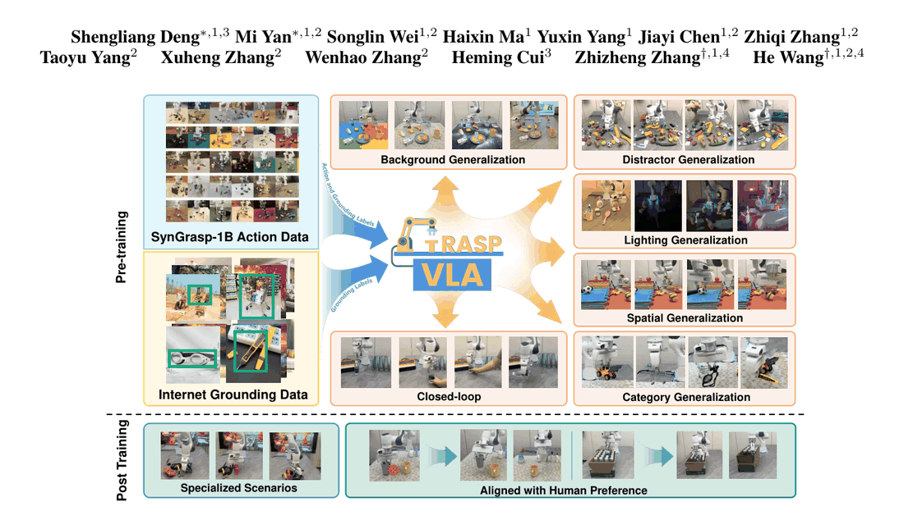
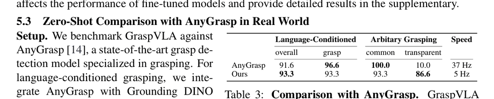
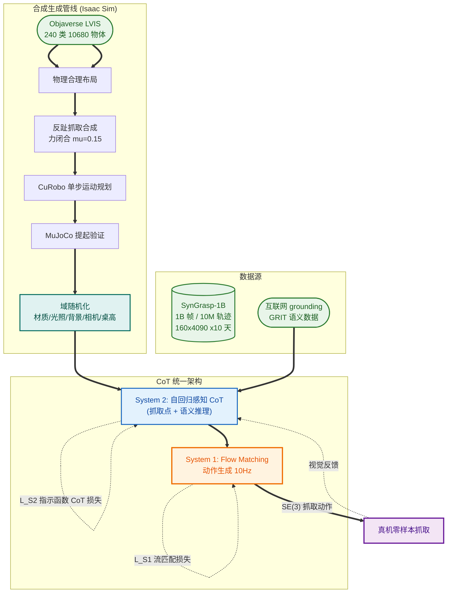

# GraspVLA: a Grasping Foundation Model Pre-trained on Billion-scale Synthetic Action Data

- arXiv: https://arxiv.org/abs/2505.03233
- Source: arXiv v3（2025-08-27；会议归属未标注）
- Project: https://pku-epic.github.io/GraspVLA-web
- Local PDF: `papers/rl/dexterous/GraspVLA_2505.03233.pdf`
- Year: 2025
- Category: company grasping foundation (Galbot)
- Priority: high

## 一句话总结

VLA 全押真机数据、采集又贵又慢（Problem：单个操作员一天只能采 ~1000 条轨迹），而合成数据的潜力从未被系统验证（Bottleneck）；GraspVLA 用「全合成动作数据 + 互联网语义数据」双源共训打通这条路（Insight）：在 Objaverse LVIS 子集 240 类 10,680 个物体上，用抗对抓取合成 + CuRobo 规划 + MuJoCo 验证 + Isaac Sim 光追渲染造出 1B 帧 / 10M 轨迹的 SynGrasp-1B（160×4090×10 天，宣称约 $5,000），并以 Progressive Action Generation 把「bbox 预测（互联网数据可监督）→ 3D 抓取位姿 → 流匹配动作 chunk（合成数据监督）串成 CoT」（Mechanism）；证据：零样本真机抓取合成类/网页类物体均 93.3%（π0 同数据微调仅 80.0/40.0），透明物体 86.6% 碾压 AnyGrasp 的 10.0%，LIBERO 零样本 82.0-94.1% 超过微调后的 π0/OpenVLA（Evidence）。

## 九问速览

1. **Problem**：VLA 预训练依赖昂贵真机遥操作数据；合成数据训练 VLA 的可行性无人系统验证。
2. **Bottleneck**：真机采集 1 人日≈1000 条；sim2real 有外观与物理动力学两道鸿沟。
3. **Insight**：抓取可全合成：合成数据给几何/动作，互联网 grounding 数据给语义，CoT 式共训互补。
4. **Method**：SynGrasp-1B + PAG：VLM 先出自回归 bbox token，再出抓取位姿，流匹配专家出动作 chunk。
5. **Evidence**：1B 帧/10M 轨迹；零样本 syn/web 类均 93.3% vs π0 80.0/40.0；透明物体 86.6 vs 10.0。
6. **Ablation**：PAG-2D 使 web 类 53.3→76.7，PAG-3D 再到 93.3；单视角掉至 60.0/56.6。
7. **Assumption**：力闭合抓取标签覆盖刚体抓取；RGB 双视角可替代深度；模仿学习可消化规划器轨迹。
8. **Failure**：歧义指令 31%、杂乱误识别 27%、光滑面滑落 21%、遮挡 14%（专设杂乱测试集）。
9. **Opportunity**：新臂/相机 5k 合成轨迹（1 卡 1 天）即适配；bbox-only 后训练（无动作标注）即达 90%。

| 维度 | 论文答案 |
|---|---|
| Perception | 前向（D435）+ 侧向（D415i）双 RGB，无深度；DINOv2+SigLIP（冻结）融合编码 + 可训练投影层（OpenVLA 式） |
| Closed-loop | 闭环抓取策略：每 trial 允许至多 3 次尝试（每次以夹爪闭合计）；推理 ~200ms/chunk（L40s + Torch Compile） |
| Correction | 无显式纠错模块；纠正依赖重试机制 + 闭环视觉反馈；失败分析显示歧义指令是最大失败源 |
| Deployment | Franka Panda（指尖加长 2cm，仿真与真机一致）；Galbot+北大自采自评；数据与权重「将」开源（v3 仍将来时）；仅桌面抓取 |

## 核心技术

信息流（Fig. 3，Progressive Action Generation）：双视角图像 + 指令 → VLM（InternLM2 1.8B 可训练 LLM + 冻结 DINO-v2/SigLIP 视觉编码器 + 可训练投影）自回归先生成 **2D bbox token**（互联网 grounding 数据 GRIT 与合成数据统一格式共同监督）→（仅合成数据）继续生成 **3D 抓取位姿 token**（机器人基座系下，生成前注入最近两步本体状态 token 以助 3D 感知）→ **流匹配动作专家**（π0 式 conditional flow matching）条件于 VLM 的 KV cache（含输入与中间推理 token）生成末端 delta 动作 chunk。

*论文 Figure 1（p1）：Figure 1: GraspVLA is a grasping foundation model pre-trained exclusively on billion-scale syn-*

- **训练/冻结**：LLM（InternLM2 1.8B）与投影层、动作专家可训练；DINO-v2、SigLIP 冻结。互联网图像复制成双视角并独立做随机缩放/裁剪/水平翻转/颜色抖动以对齐双相机设置；两套数据共享同一文本 prompt 模板（bbox token 在最前）。
- **双源监督分工**：GRIT（互联网 grounding）只监督 bbox 预测（CoT 前段）；SynGrasp-1B 监督 bbox + 抓取位姿 + 动作（完整 CoT）。**每 batch 随机混合采样**，总损失 = L_S2 + L_S1 简单相加。
- **PAG-3D 监督细节**：夹爪闭合前的步骤用该轨迹的开环抓取位姿作监督；闭合后用下一步末端位姿作监督（附录 E）——位姿标签是「阶段相关的目标」。
- **Sim2real 三招**（附录 J）：简化控制（位置控制 + 离散开合夹爪，绕开动力学建模）；稳定性过滤（只保留低摩擦系数 0.15 下仍力闭合的抓取）；几何驱动规划（基于 mesh 的抓取位相而非依赖动力学）。加上预训练视觉编码器 + 光追渲染 + 大规模域随机化压外观差距。

## 底层原理与数学推导

**(1) VLM 的 CoT 自回归损失**（论文原式 L_S2）：

$$
\mathcal{L}_{S2} = -\sum_{n=1}^{N_{\mathrm{bbox}}} \log P_\theta\!\left(y^{\mathrm{bbox},n} \mid x,\, y^{\mathrm{bbox},<n}\right) \;-\; \mathbb{1}_{\mathrm{synthetic}} \cdot \sum_{n=1}^{N_{\mathrm{grasp}}} \log P_\theta\!\left(y^{\mathrm{grasp},n} \mid x,\, y^{\mathrm{bbox}},\, y^{\mathrm{grasp},<n}\right)
$$

指示函数 $\mathbb{1}_{\mathrm{synthetic}}$ 是关键：**互联网数据只点亮 CoT 前半段（bbox），合成数据点亮全程**。语义知识经共享的 bbox 步骤「渗入」动作生成——这是把「无动作标注的开放世界语义」接进「有动作标注的封闭仿真」的管道。

**(2) 动作专家的流匹配损失**（论文原式 L_S1，作用在 chunk 化末端 delta 动作上）：

$$
\mathcal{L}_{S1} = \left\| v_t\!\left(A_t,\, x,\, y^{\mathrm{bbox}},\, y^{\mathrm{grasp}}\right) - u_t\!\left(A_t \mid A_0\right) \right\|_2^2
$$

$t \in [0,1]$ 为流匹配时间步，$A_t$ 为加噪动作，$v_t(\cdot)$ 是模型预测的向量场，$u_t(A_t|A_0)$ 是真值向量场。动作专家以 bbox 与抓取位姿 token（经 KV cache）为条件——**流匹配头只在 CoT 收尾处接棒，把离散推理结论连续化**。

**(3) SPL（成功加权路径长度）评测指标**（论文给出）：

$$
\mathrm{SPL} = \frac{1}{N}\sum_{i=1}^{N} S_i \frac{l_i}{\max(p_i,\, l_i)}
$$

$S_i$ 为二值成功、$l_i$ 为该 trial 所有方法中最少动作步数（最短路径）、$p_i$ 为本模型步数；数据以 10 Hz 存动作、所有方法同数据训练，故步数跨方法可比。**SPL 专治「犹豫」**：π0 系 SPL（42.3-51.8）远低于成功率（66.6-80.0），GraspVLA 87.2/84.7 与成功率几乎持平——路径直、不徘徊。

三式合起来的因果链：$\mathcal{L}_{S2}$ 让「看懂物体在哪（语义）+ 该从哪抓（几何）」成为显式中间变量，$\mathcal{L}_{S1}$ 只需解决「怎么平滑到达」——难度被 CoT 分层摊薄。

## 物理直觉解释

**PAG 是「先指认、再定抓法、最后动手」的口语化拆解**。人被要求「把充电器拿给我」时，大脑先扫视锁定充电器（bbox），再无意识地选定一个捏得住的部位和角度（抓取位姿），手才开始运动（动作 chunk）。GraspVLA 把这三步强制写成自回归序列——妙处在于**前两步可以由互联网图片教会**（互联网有海量「指认」标注 GRIT），只有第三步必须由合成动作数据教。于是 10 亿帧仿真动作「只负责它擅长的几何与运动」，而开放世界的语义泛化（充电器、毛巾、泳镜这类合成集没有的长尾类）由互联网数据免费供给——消融里 web 类从 53.3%（vanilla 共训）→ 76.7%（PAG-2D）→ 93.3%（PAG-3D），就是这条语义管道逐步打通的直接证据。**这相当于给动作模型装了一个「先查字典再动笔」的习惯**，而不是端到端地死记硬背。

**SynGrasp-1B 的域随机化是「把考场搬进教室」**。光追渲染 + 材质/灯光（点光/方向光/穹顶光）/背景（~1000 桌面纹理 + ~1200 墙地纹理、1M 独立场景）/相机（15 cm 球内随机 + ±5° 旋转）/桌面高度（−0.1~+0.2 m）全维度随机，让真机环境几乎必然落在训练分布之内——**像考前把所有可能考题都刷过一遍**。而对抗 sim2real 的物理鸿沟则用「绕开」而非「建模」：位置控制 + 离散夹爪避开了接触动力学建模，力闭合（低摩擦 0.15 下仍稳定）过滤只留下「怎么抓都不会掉」的保守抓取，mesh 几何驱动规划不依赖摩擦系数的精确性——三招全是**把物理不确定性从策略的职责范围内裁掉**。

**bbox-only 后训练是「只教认脸、不教握手」**。Task 1（稀有工业件）只给 100 条 bbox 标注、零动作标注，GraspVLA 达 90%（超过用全量动作数据训练的 π0 的 60%）。机理：预训练已把「bbox→抓取位姿→动作」的因果链焊死，新物体只需接入链条第一环——语义锚点；几何与运动技能自动继承。**这是基础模型「少样本对齐」在机器人上的最小样本形态**：人类标注 100 个框的成本约等于标注 100 条轨迹的几十分之一。同样逻辑支撑 5k 合成轨迹（1 卡 1 天）适配新臂/新相机（UR5e+Robotiq 仿真 76.6%、腕相机真机 82.1%）。

## 工程细节与实操指南

- **SynGrasp-1B 生成配方**（Sec 3 + 附录 B/C）：Objaverse LVIS 子集筛除武器等不适用类 → 240 类 / 10,680 实例；逐类手工定尺寸上下限（真机尺度对齐，2cm-35cm 狗都能抓）；ACVD 网格简化提速仿真；随机缩放后以各种位姿丢落桌面生成物理合理的杂乱布局（杯类等手工定义合法位姿如直立）；抗对抓取合成 [64] → CuRobo 无碰轨迹规划（**单步规划优先平滑而非成功率**，避免两段式 pregrasp 造成的策略犹豫）→ MuJoCo 逐条验证真能提起；Isaac Sim 光追渲染出双视角 RGB + 全套真值标注（相机标定、bbox、物体/夹爪 3D 位姿，可扩展深度图/分割）；桌面高度随机 −0.1~+0.2 m；初始机器人位姿随机化。
- **数据工程**：160×RTX 4090×10 天产 10M 轨迹×~100 帧；缓存机制免重复加载 mesh；异步写盘（改造 DeepMind EnvLogger + TFDS，UUID 子文件夹分组）；数据损坏三类异常（NotFound/DataLoss/FailedPrecondition）显式处理，缺失率 <1%。
- **训练配置**（附录 E/Table 9）：GraspVLA batch 384、lr 1.6e-4；所有方法 action chunk = 4（OpenVLA 除外，不支持 chunking）；仿真自动评测选 checkpoint，~120k 步收敛。
- **真机硬件**：Franka Panda + 指尖 3D 打印加长 2cm（合成与真机一致，否则夹不住凸形物体）；RealSense D435（前）/ D415i（侧），置于随机化范围中心；工作区 40×50×20 cm；控制层为笛卡尔阻抗控制器（改自 Franka ROS + SERL），三阶串联一阶 Butterworth 滤波平滑阶跃，位置插值而非时间插值，receding-horizon 执行 chunk；**正式评测用阻塞控制**（非阻塞仅用于录 demo）。
- **推理延迟拆解**（L40s，附录 K）：视觉编码 9ms + bbox 8 token 72ms + 抓取位姿 6 token 50ms + 流匹配 64ms ≈ 200ms；PAG 的 14 个额外 token 占 ~63% 延迟——快不起来的代价源自 CoT 本身。

## 实验协议清单

| 项目 | 论文设置 | 来源与备注 |
|---|---|---|
| 观测 | 双视角 RGB（前 D435 + 侧 D415i），无深度输入；本体状态最近两步 token 化注入 | Sec 5.1 / 附录 H |
| 动作空间 | 末端 delta 动作 chunk（位置控制 + 离散开/合夹爪）；具体维度未报告 | Sec 4 / 附录 J |
| 控制频率 | 数据以 10 Hz 存储；推理 ~200ms/推断（≈5 Hz）；底层笛卡尔阻抗控制 | Sec 5.1 / 附录 E/K |
| 重规划频率 | 每 chunk 4 步重规划 | 附录 E |
| 动作 horizon | chunk = 4 步 | 附录 E |
| 数据 | SynGrasp-1B：10M 轨迹 / 1B 帧 / 240 类 / 10,680 物体 / 1M 场景；共训 GRIT 互联网 grounding 数据 | Sec 1/3 / 附录 B |
| 奖励 | 无（模仿学习 + 流匹配）；专家数据由力闭合过滤 + MuJoCo 验证保证质量 | Sec 3 / 附录 J |
| Reset | **Trial 内不重置**：物体被碰掉/碰倒也不复位 | 附录 E |
| 成功定义 | 真机：3 次尝试内抓住指定物体并提升 ≥15cm；LIBERO：抓住并提升 ≥10cm 且同类别即算成功（放宽） | Sec 5.1 / 附录 G |
| 评估次数 | 真机零样本 300 trials（15 物体×2 试×5 设置×2 组）；LIBERO 每任务 50 随机初始化（350-500/suite）；任意抓 30+30 trials；后训练每任务 10 trials | Sec 5.1/5.2 / 附录 H |
| 随机种子 | 未报告 | — |
| 扰动测试 | 灯光（disco 灯）/ 背景（3 种桌布轮换）/ 干扰物（随机加 5 物体）/ 高度（台面 +10cm） | Sec 5.1 |
| 真机 | Franka Panda（+2cm 指）；UR5e+Robotiq 2F-85 仅仿真（无真机硬件）；Galbot+北大自评，无第三方 | Sec 5.1 / 附录 D |
| 算力 | 数据生成 160×4090×10 天（宣称总成本约 $5,000，口径待确认）；训练 bs 384/lr 1.6e-4/~120k 步（训练卡型未报告）；推理 L40s ~200ms | Sec 3 / 附录 B/E/K |
| 特权信息 | 训练数据自带仿真真值（相机标定/bbox/3D 位姿，可扩展深度/分割）；推理纯 RGB 无深度、无真值；仿真自动评测用于基线 checkpoint 选择 | 附录 B / Sec 4 / 附录 E |

**附录陷阱自查**：
- privileged 信息：合成数据标注免费获得全套真值（相对真机数据的「仿真特权」，但推理不依赖）；LIBERO 评测为 GraspVLA 专属调整了相机位姿、删遮挡篮筐、加长夹指（基线用原始配置）、同类别放宽判成功——四处修改均单向有利于 GraspVLA（附录 G 自述）
- reward shaping：不适用（BC）；但「3 次尝试内成功」+ 部分任务只按 grasp 成功率汇报会抬高绝对数字
- reset 难度：trial 内不重置（更难），这点诚实；但每 trial 初始机器人/物体状态固定（Sec 5.1），降低方差也降低难度
- eval budget：真机 300 trials 规模中等；后训练任务每任务仅 10 trials（样本极小）；无置信区间
- 底层控制栈：报告充分（阻抗控制 + 滤波 + 插值 + chunk 执行），是同类论文中少见的透明度
- 数据优势：**方向相反的陷阱**——所有 VLA 基线都被放到 SynGrasp-1B 上微调（公平），但评测物体类别一半来自自家合成类别（域内）；LIBERO 基线用官方微调 checkpoint 且测试指令被简化而微调集未简化（Table 13 自证基线因此大跌）；AnyGrasp 为深度点云方法，透明物体对比是模态优势而非纯算法优势；$5,000 成本对 160 卡×10 天的口径（电费？折旧？租用？）未说明，按市价租卡远超此数

（事实优先从 PDF 附录提取；查不到写「未报告」，严禁编造）

## 消融实验与分析

*论文 Table 2（p7）：Table 2: Comparisons with baselines in*

| 消融 | 设置 | Synthetic SR/SPL | Web SR/SPL | 结论 |
|---|---|---|---|---|
| PAG 组件（Table 5，basic 集） | vanilla 共训（无 PAG） | 66.6 / 39.3 | 53.3 / 27.7 | 无中间推理时语义迁移最弱 |
| 同上 | + PAG-2D（bbox 中间步） | 80.0 / 59.2 | 76.7 / 48.9 | bbox 是语义→动作的主管道 |
| 同上 | + PAG-3D（再加抓取位姿） | **93.3 / 90.2** | **93.3 / 91.7** | 位姿步消除犹豫，SPL 跃升（轨迹短且直） |
| 视角数（Table 14） | 单视角 vs 双视角 | 60.0 vs 93.3 | 56.6 vs 93.3 | 双视角贡献 ~33 个百分点；单视角仍超 OpenVLA（20.0/3.3）40 点 |
| 后训练数据量（Table 4，Task 1 稀有件） | 仅 bbox 标注 vs 全动作标注 vs 从零训 | 90/100 vs 90/100 vs 10/30（overall/grasp） | — | bbox-only 即可迁移新物体；预训练是前提 |
| LIBERO 指令格式（Table 13） | 原格式 vs 简化「pick up {object}」 | π0 微调 88.7→62.7（Long）；OpenVLA 70.9→33.7 | GraspVLA 零样本 82.0（Long） | 微调基线对指令格式极敏感，零样本模型反而稳健 |
| Scaling（Fig 5/10，附录 F） | 训练帧数/类别数/每类实例数 | 帧数↑持续涨，web 类涨得慢；类别数↑主要利 web 类；每类实例数↑两类都涨 | — | 类别覆盖决定跨类泛化，实例覆盖决定类内泛化 |

核心结论：**性能来自「CoT 分层 + 双源互补」而非单一 tricks**——去掉任何一段 PAG 或退化到单视角都损失巨大；同时暴露 π0 系基线「成功率高但路径效率低（犹豫）」的通病（SPL 42-52 vs 87-92）。

## 技术权衡（Trade-off）

| 优势 | 劣势与工程代价 |
|------|---------------|
| 全合成预训练：~$5,000（宣称）+ 10 天产出 1B 帧，成本数量级低于真机采集 | 数据只覆盖桌面抓取单一任务族；扩展到放置/推/非抓取需重造专家管线（自认 future work） |
| PAG 让互联网语义免费接入，长尾类零样本泛化（web 类 93.3%） | CoT 的 14 个额外 token 占 ~63% 推理延迟（~200ms），动态场景不够快；5 Hz 输出远慢于 AnyGrasp 37 Hz |
| 纯 RGB 绕开深度痛点，透明物体 86.6% vs AnyGrasp 10.0% | 无深度/触觉：光滑面滑落失败占 21%，深抓取接触判断无反馈 |
| bbox-only 后训练（100 框、零动作标注）达 90% | 力闭合标签忽略可变形物体（自认局限）；歧义指令（"pick up food"）仍失败 |
| 评测协议透明（超参/滤波器/控制器全公开，trial 内不 reset） | LIBERO 评测四处单向修改（相机/篮筐/夹指/判据）削弱与基线的可比性 |
| 新本体适配轻量：5k 合成轨迹 / 1 卡 / 1 天 | 跨本体验证薄弱：UR5e 仅仿真无真机；仅 Franka 真机验证 |

## 技术价值与演进定位

GraspVLA 是「合成数据优先」路线在 VLA 时代的第一个大规模正面验证：此前合成数据只用于域随机化抓取检测（Dex-Net/ACRONYM 一脉）或演示增广（MimicGen 系），本文首次以 1B 帧纯合成动作数据预训练 VLA 并给出 sim-to-real 零样本证据。方法论上最有生命力的两件事：①PAG 证明了「动作 CoT」可以作为异构数据（有动作/无动作）的统一训练接口——bbox 是互联网与机器人数据天然共享的中间语言；②「bbox-only 后训练」展示了基础模型式少样本对齐的最便宜形态。其定位是「单技能基础模型」（grasping foundation）而非通用操作基础模型——与 Galbot 的商业路线（语言引导抓取零售场景）高度一致。后续方向（作者自列）：扩展任务族、软体仿真、强化学习后训练、蒸馏量化提速。

## 与其他论文的关系

| 库内笔记 | 关系 |
|---|---|
| `notes/rl/dexterous/dexora.md` | 灵巧 VLA 的数据配方对照：Dexora 100K 仿真 + 12.2K 真机混合；GraspVLA 1B 帧纯合成 + 互联网语义——「混合数据」vs「全合成」两条路线，后者把真机需求压到后训练 100 条 bbox |
| `notes/rl/dexterous/torl-vla.md` | 失败模式互补：GraspVLA 21% 失败来自光滑面滑落（无触觉）、抓取后无力反馈；TORL-VLA 用 wrench 预测 + 在线 RL 补接触 rich 场景——正是本文自认缺的触觉一环 |
| `notes/rl/dexterous/hapticvla.md` | 同样「推理时纯视觉」哲学：HapticVLA 训练时蒸馏触觉、推理免触觉；GraspVLA 用 RGB 绕开深度——两者都把难传感模态限制在训练侧 |
| `notes/rl/sim2real/viserdex.md` | 域随机化配方对照：ViserDex 用 3DGS 渲染 + 课程 RL + 师生蒸馏做灵巧手 sim2real；GraspVLA 用光追渲染 + 力闭合过滤 + 简化控制做平行夹爪 sim2real——同是「渲染质量换物理建模」 |
| `notes/rl/sim2real/phys2real.md` | sim2real 的两个极端：Phys2Real 花力气估物理参数（VLM 先验 + 不确定性在线适应）让 RL 策略迁真机；GraspVLA 干脆把物理不确定性从任务里裁掉（位置控制 + 保守抓取）——「建模现实」vs「绕开现实」 |
| `notes/architecture/pi0.md` | 结构近亲与最强基线：动作专家直接沿用 π0 的 conditional flow matching；Table 1 中 π0（同数据微调、去跨本体预训练 80.0）是最强对手，但 SPL 暴露其犹豫问题；另发现 π0 带原预训练反降（66.6）——跨本体预训练未必正迁移 |
| `notes/data/open-x-embodiment.md` | 数据范式对手：OXE/DROID 靠聚合/众包真机数据（贵、慢、场景有限）；SynGrasp-1B 论证合成可把规模推到 1B 帧且场景/标注免费——附录 B 直接对比（OXE 1.4M 轨迹但无 bbox/3D 位姿标注） |

## 精读问题

1. 开放产物缺什么：截至 v3（2025-08）SynGrasp-1B 与权重仍是「will release」——数据（尤其 1B 帧的存储/分发方案，~100TB 级？）和 PAG 训练代码实际放出了吗？互联网 grounding 数据子集的规模/许可？
2. $5,000 总成本的核算口径是什么？160×4090×10 天按市价租用约数千至一万美元以上，电费口径还是自有硬件折旧口径？若需自购 160 卡，真实门槛是什么？
3. LIBERO 评测为 GraspVLA 改了相机/删了篮筐/加了夹指/放宽判据，而基线保持原设置——若把基线也放到同样的相机与夹指配置下，82.0-94.1% 的零样本优势还剩多少？
4. PAG 的 14 个 CoT token 与 OpenVLA 的 token 化动作相反（一个加中间步、一个省 token）——CoT 长度与动作精度/延迟的帕累托前沿在哪？bbox 8 token + 位姿 6 token 是否过定？
5. π0 去掉跨本体预训练反而更强（80.0 vs 66.6）——这与其跨本体表征主张矛盾：是 SynGrasp 单本体窄域数据的特例，还是通用现象？对 π0.5 式开放世界路线意味着什么？
6. 抓取位姿标签是开环目标（闭合前用规划位姿、闭合后用下一步位姿），闭环执行时位姿步的语义是什么——计划还是状态估计？策略闭环修正与开环标签之间的分布偏移如何消化？
7. 3 次尝试内成功 + trial 内不重置的协议下，93.3% 的绝对数字对单次尝试成功率意味着什么（重试挽救了多少失败）？论文未报告首试成功率——是否被 3-attempt 口径美化？

