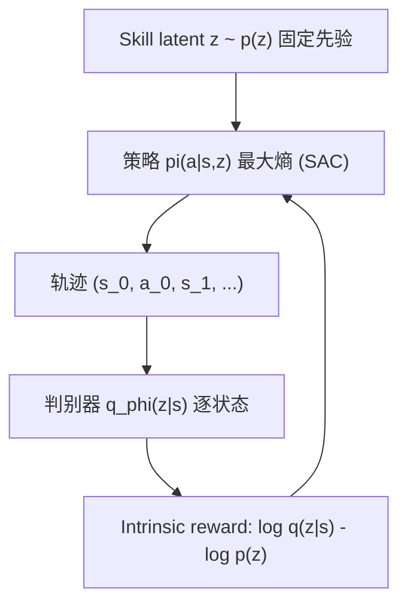

# DIAYN: Diversity Is All You Need — Learning Skills without a Reward Function

- 本地 PDF：`papers/rl/DIAYN_1802.06070.pdf`
- arXiv：https://arxiv.org/abs/1802.06070
- 年份：2018 (ICLR 2019)
- 团队：CMU + Google Brain（Benjamin Eysenbach, Abhishek Gupta, Julian Ibarz, Sergey Levine）
- 阶段：无监督技能发现 —— 最大熵 RL + 互信息目标

## 一句话总结

DIAYN 提出在**完全没有奖励函数**的情况下学习多样化的可复用技能：定义技能为条件于隐变量 z 的策略，最大化"技能与访问状态之间的互信息"（信息论目标），用最大熵策略（SAC）+ 判别器（推断哪条轨迹来自哪个技能）实现。无奖励信号下自动涌现行走、跳跃等技能；技能可用于分层 RL（meta-controller 选技能）、模仿学习和预训练初始化，在稀疏奖励任务上超越 TRPO/SAC/VIME。

## 核心技术

1. **无奖励技能学习** — 目标函数不包含任务奖励，只最大化技能-状态互信息 $I(S; Z)$
2. **三个关键设计**（相对早期 VIC 工作的改进）：
   - 最大熵策略 → 技能集合整体最大熵，强制多样性
   - 固定技能分布 $p(z)$ 而非学习它 → 防止坍塌到少量技能
   - 判别器看**每一步状态**而非仅终止状态 → 更密集的学习信号
3. **技能-条件策略** — $\pi(a|s,z)$，z 从固定分布采样；技能彼此可区分

## 底层原理与数学推导

DIAYN 最大化互信息目标：

$$I(S; Z) = H(Z) - H(Z|S)$$

其中 $H(Z)$ 固定（先验 $p(z)$ 均匀），最大化等价于最小化条件熵 $H(Z|S)$——即"从访问的状态能推断出是哪个技能"。加最大熵项后的完整目标：

$$\mathcal{F}(\theta) = I(S; Z) + H(A|S, Z) \ge H(A|S,Z) - H(Z|S)$$

用判别器 $q_\phi(z|s)$ 作为 $H(Z|S)$ 的变分近似：

$$I(S; Z) \ge \mathbb{E}_{z \sim p(z), s \sim \pi(\cdot|z)}[\log q_\phi(z|s) - \log p(z)]$$

SAC 的 reward 替换为 intrinsic reward：$r_z(s, a) = \log q_\phi(z|s) - \log p(z)$。

**与 VIC (Gregor et al. 2016) 的三个区别**：最大熵策略（多样性）、固定 $p(z)$（防坍塌）、逐状态判别（密集信号）。

## 物理直觉解释

DIAYN 的直觉可以类比为**"让孩子自己在房间里玩出花样"**——不告诉孩子"应该怎么玩"（没有奖励），只要求"每次玩的方式要不一样，而且你能说清自己在玩什么"（互信息）。孩子自然涌现出各种玩法：走路、跳、翻跟头——每个"玩法"就是 DIAYN 的一个 skill。

互信息目标的直觉：$I(S;Z)$ 大 = "看到状态就知道在玩哪个花样"。如果你玩"走路"和玩"跳跃"访问的状态完全不同，这个互信息就高；如果两个花样访问的状态一模一样，就分不清了。最大熵保证每个花样内部的动作也足够随机——防止"两个花样都是站在原地抖腿"。

## 工程细节与实操指南

- **判别器** $q_\phi(z|s)$：MLP，输入状态输出技能分布；与策略联合训练
- **固定先验** $p(z)$：均匀分布（z 为 one-hot），防止技能坍塌
- **条件化技巧**：判别器只条件于状态子集（如质心位置）→ 引导发现特定类型技能
- **训练循环**：采样 z → 用 SAC + intrinsic reward 学 $\pi(a|s,z)$ → 判别器更新 → 循环
- **分层使用**：meta-controller 在技能间切换（顶层 RL），低层技能执行

## 消融实验与分析

| 消融/对比 | 结论 |
|---------|------|
| vs VIC (Gregor 2016) | 最大熵 + 固定 p(z) + 逐状态判别三个改动缺一不可 |
| 技能坍塌检查 | 固定 $p(z)$ 防止只学到少量技能 |
| 判别器状态条件化 | 只看质心 → 偏向发现移动类技能 |
| vs TRPO / SAC / VIME (分层任务) | 稀疏奖励的 ant navigation / cheetah hurdle 上超越 |
| 模仿学习 | 找到与示范最匹配的技能 → 直接模仿 |

## 技术权衡（Trade-off）

| 优势 | 劣势与工程代价 |
|------|----------------|
| 完全无奖励，省去 reward engineering | 技能质量依赖环境的探索自由度——受限环境学不到有用技能 |
| 技能可复用：分层/模仿/预训练三用 | 互信息目标可能学到"可区分但无用"的技能 |
| 无监督 → 数据采集成本极低 | 判别器+策略联合训练的双网络复杂度 |
| 稀疏奖励任务上超越强基线 | 需要最大熵 RL (SAC) 作为底层算法 |

## 技术价值与演进定位

DIAYN 开创了"无监督技能发现"这一 RL 子方向，其"互信息 + 最大熵"范式成为后续 VISR、APS、DIAYN 系列的基础。在 2026 年语境下回看：它和"数据多样性"研究（Is Diversity All You Need for Scalable Manipulation）形成呼应——DIAYN 证明**行为多样性可以在无奖励下涌现**，而 2025 年那篇证明**数据多样性需要结构化设计**。两者都指向"多样性是学习的关键原料"这一主题，只是分别在策略侧和数据侧。

## 与其他论文的关系

- **VIC (Gregor et al. 2016)** — 前身，DIAYN 的三个改进使其可扩展到复杂任务
- **SAC (Haarnoja 2018)** — DIAYN 的底层最大熵 RL 算法
- **APS / VISR** — 后续技能发现工作，基于 DIAYN 范式
- **Is Diversity All You Need (2025)** — 同名主题的数据侧研究：任务/具身/专家三维度多样性分析
- **FlashSAC (RSS 2026 Best)** — 技能发现可作 RL 预训练；FlashSAC 的低 UTD 训练可加速 DIAYN

## 精读问题

1. 互信息目标的"技能坍塌"——固定 $p(z)$ 在多大程度上解决了这个问题？技能数增加时判别器精度如何变化？
2. 无奖励技能在真实机器人（非仿真）上的适用性——探索成本和安全约束如何影响？
3. 与 2025 年"专家多样性有害"的结论的关系——DIAYN 的多样化技能 vs 模仿学习中专家速度多模态，是否矛盾？
4. DIAYN 技能能否作为 VLA 的动作先验（如动作 tokenizer 的初始化）？
