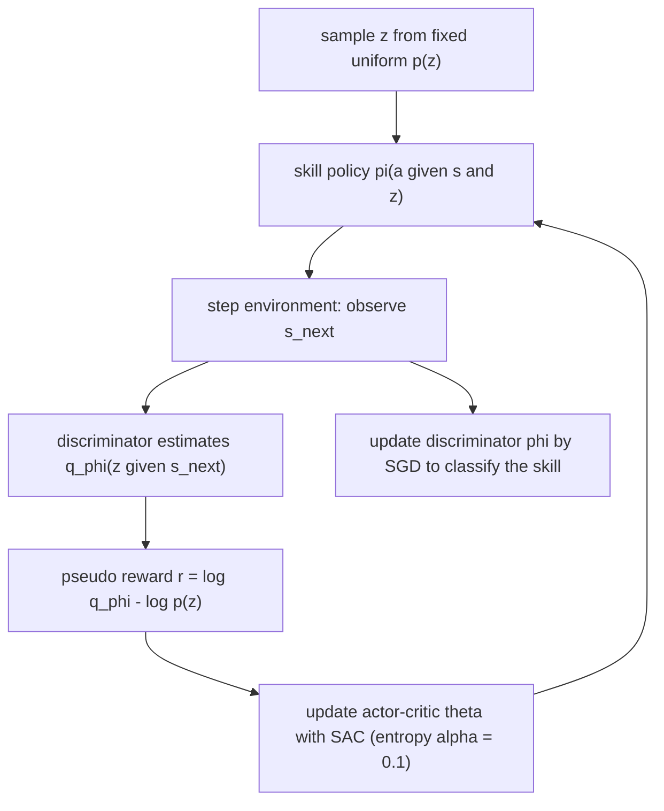

# DIAYN: Diversity Is All You Need — Learning Skills Without a Reward Function

- 本地 PDF：`papers/rl/DIAYN_1802.06070.pdf`
- arXiv：https://arxiv.org/abs/1802.06070 （v6, 2018-10；会议版为 ICLR 2019）
- 年份：2018 (ICLR 2019)
- 团队：UC Berkeley（Sergey Levine 组）+ Google Brain + CMU（Ben Eysenbach，Google AI Residency 期间完成）
- 阶段：无奖励技能发现（unsupervised skill discovery）的奠基工作——把"学一坨可区分的技能"写成一个互信息下界，是后续 skill prior / hierarchical RL / options 类方法绕不开的参照系

## 一句话总结

不给出任何任务奖励，只用一个信息论目标——最大化技能与状态的互信息 $I(S;Z)$、同时压低给定状态下技能与动作的互信息 $I(A;Z|S)$、再加上最大熵正则——就能让 SAC 训出一套"从状态能反推出是哪个技能"的多样化运动技能（奔跑、跳跃、后空翻），并且这些技能可直接用于策略初始化加速、层级 RL 拼接和模仿学习。

## 核心技术

1. **判别性目标（discriminability objective）**：每个技能 $z$ 走过的状态必须能让一个判别器认出来；技能之间因此被互相"推开"，覆盖不同状态区域。
2. **状态判别而非动作判别**：用状态而不是动作区分技能——不影响环境的动作对外部观察者不可见（机械臂抓杯子时施加多大的力，杯子不动就无从判断），故显式最小化 $I(A;Z|S)$。
3. **最大熵技能**：单个技能内动作尽可能随机（SAC 的熵正则，系数 $\alpha = 0.1$），高熵且仍可判别的技能必须远离其他技能的领地，从而顺带完成探索。
4. **固定先验 $p(z)$**：每回合开始采样一次 $z \sim p(z)$（categorical 均匀分布），整个回合沿用。论文证明这是与 VIC 的关键差别——学习 $p(z)$ 会引发 "Matthew Effect"，只反复采样少数几个好技能。
5. **伪奖励驱动**：把上面三项拧成一个逐时刻标量奖励 $r_z(s,a) = \log q_\phi(z|s) - \log p(z)$，于是无监督问题退化为一次普通的 off-policy RL 训练（SAC），判别器与策略交替更新、构成合作博弈而非对抗鞍点。
6. **三种下游用法**：(a) 取最优技能做权重初始化再微调；(b) 元控制器每 $k$ 步选一个技能做层级 RL（cheetah hurdle 用 $k=10$、ant 导航用 $k=100$）；(c) 遍历 $z$ 选 $\prod_{s_t} q_\phi(z|s_t)$ 最大者复现专家轨迹（模仿学习）。

## 底层原理与数学推导

### 1. 目标函数及其拆解

三个随机变量：状态 $S$、动作 $A$、技能潜变量 $Z \sim p(z)$。DIAYN 要最大化的原始目标是：

$$
F(\theta) \triangleq I(S;Z) + H[A|S] - I(A;Z|S)
$$

利用互信息的熵展开 $I(S;Z) = H[Z] - H[Z|S]$ 与链式关系 $I(A;Z|S) = H[A|S] - H[A|S,Z]$，得到等价形式：

$$
F(\theta) = H[Z] - H[Z|S] + H[A|S,Z]
$$

三项各管一件事：
- $H[Z]$：先验覆盖的技能种类要多——论文直接把 $p(z)$ 固定为均匀分布，这一项恒为常数上界；
- $-H[Z|S]$：给定当前状态要容易反推出技能（"状态即签名"）；对确定性策略连续动作空间有 $I(A;Z|S)=H[A|S]$，此时式 (2) 退化成纯粹最大化 $I(S;Z)$；
- $H[A|S,Z]$：每个技能内部动作尽量随机（最大熵 RL 的熵项，由 SAC 以系数 $\alpha$ 加权处理）。

### 2. 变分下界（ELBO 式近似）

$p(z|s)$ 无法精确积分得到，引入判别器近似 $q_\phi(z|s)$。由于 $\log p(z|s) \ge \log q_\phi(z|s)$ 在期望意义下成立（Jensen 不等式 / 变分推断标准操作），得到可优化的下界：

$$
F(\theta) = H[A|S,Z] + \mathbb{E}_{z\sim p(z),\, s\sim\pi(z)}[\log p(z|s)] - \mathbb{E}_{z\sim p(z)}[\log p(z)] \\
\ge H[A|S,Z] + \mathbb{E}_{z\sim p(z),\, s\sim\pi(z)}[\log q_\phi(z|s) - \log p(z)] \triangleq G(\theta,\phi)
$$

这正是变分方法里熟悉的 ELBO 结构：真实目标 $F$ 与可优化下界 $G$ 之间的 gap 恰为 $\mathbb{E}_s[\mathrm{KL}(p(z|s)\,\|\,q_\phi(z|s))] \ge 0$，判别器越准，下界越紧。注意 $\mathbb{E}[\log q_\phi(z|s) - \log p(z)] = I(S;Z)$ 的采样估计，所以整个训练就是在打这个互信息项的最大值。

### 3. 伪奖励：让任何 RL 算法直接吃下这个目标

取下界中依赖轨迹的项作为逐时刻内在奖励：

$$
r_z(s,a) \triangleq \log q_\phi(z|s) - \log p(z)
$$

`- log p(z)` 不是可有可无的基线（附录 A）：若判别器优于瞎猜则 $q_\phi(z|s) \ge p(z)$，该基线保证奖励非负、鼓励智能体"活着"；反之最优策略会想尽快结束回合。另外当所有技能都掉进同一吸收态时判别器只能输出 $\log(1/N)$，减去该基线等价于假设吸收后继续按此拿奖励。

### 4. 网格世界的解析最优解（为什么技能会把状态空间切开）

$N\times N$ 网格世界中两技能的最优稳态分布是把棋盘均分成两半：

$$
\rho_{\pi_1}(x,y) = \frac{2}{N^2}\delta(y \le N/2), \qquad \rho_{\pi_2}(x,y) = \frac{2}{N^2}\delta(y > N/2)
$$

此时可以完美反推技能：$H[Z|S]=0$，且 $H[Z]=\log 2$ 已封顶，故无熵正则（$\alpha=0$）时该分割就是全局最优。加上熵正则后，$H[A|S,Z] = \log(4)(1 - 1/2N)$，距最优差 $O(1/N)$。边界上的格子必须在"多探索"与"保持可判别"之间折衷，这解释了两个结构性偏好：技能边界越短越好、倾向经由 bottleneck 状态切换领地。

### 5. 下游三用的数学形态

层级 RL：元控制器观测同样的 $s$，每 $k$ 步输出一次技能选择。模仿学习：给定仅含状态的专家轨迹 $\tau^*=\{(s_i)\}$，按 M-projection 检索技能：

$$
\hat{z} = \arg\max_z \prod_{s_t \in \tau^*} q_\phi(z|s_t) \;\Longleftrightarrow\; \arg\min_{p_z \in \mathcal{P}} D(p^*\,\|\,p_z)
$$

选用 M-projection（而非 I-projection）保证检索到的技能覆盖专家访问的全部状态。

训练循环里两条腿各自爬升：策略想让 $\log q_\phi(z|s)$ 变大，判别器想把分类做对，合力使互信息估计单调上升；训练曲线显示熵正则项很快平台化而判别项持续增长（图 12）。

## 物理直觉解释

**两个舞者与一位考官的合作博弈。** 把判别器想象成坐在观众席的考官：他看一段舞蹈（状态序列的每一帧，不看你肌肉怎么发力）猜这是哪位舞者的保留节目。每一位舞者为了不被认错，就必须跳出和别人明显不同的套路——有人专攻后空翻，有人只会向前冲刺。关键在于这不是对抗：考官希望猜得更准，舞者也希望自己更"像自己"，两边目标同向，所以训练稳定，不像 GAN 那样在鞍点附近震荡。而"不许从动作猜、只许从效果猜"这条规则极其精妙——它把"技能"定义成对世界产生的可见改变，而不是某种内部抖动，这就是机器人语境下"会做事"的最朴素定义。

**国界线与关隘。** 多个技能同时扩张时，它们会在状态空间里划分势力范围。网格世界的解析结果说明：最优解就是把棋盘切成整块的两大半，因为这样"看到状态就知道是谁的领地"零成本，且边界最短。更有意思的是边界的代价结构——每多一米边境线，就要牺牲一点动作熵去维持"进入敌境就会被认出"的压力，于是目标函数天然偏好短边界、偏好通过关隘（bottleneck）相连的版图。这解释了一个乍看玄学的现象：为什么无监督学出来的 ant 技能多是走弧线和跳跃，而不是笔直冲线——弧线是在"少付边界税"的前提下扩大领地的方式。

**电台频道间的串扰。** 单个技能内部又被要求动作尽量随机（最大熵），就像一个广播电台故意让播音员即兴发挥。如果信号内容太随机又不离开自己的频道，随便乱播就可能闯进别人的频段，立刻被考官判定混淆；所以唯一安全的做法是把自己的播报范围挪到离所有其他频道足够远的地方。换句话说，"高熵"+"仍可判别"两个条件合起来，自动制造了向未知区域的推进力——探索不是额外加的 bonus，而是这个博弈的均衡解本身。这也解释了图 15 里看似矛盾的观察：很多没见过任务奖励的 hopper 技能得分不低于 1000——它们的频段恰好落在了"前进"这个位置。

## 工程细节与实操指南

1. **底座是 SAC**：off-policy、带熵正则，$\alpha=0.1$ 是经验最优点；过小技能跑得远但不覆盖，过大判别器分不开。
2. **网络容量要加**：Q/V/policy 全部用 300 个隐层单元（原 SAC 论文是 128）。作者明确说加大容量是学到多样技能的必要条件。
3. **技能向量注入方式极简**：$z$ 直接 concat 到状态后面喂给 policy / Q / V，不需要特殊融合结构。
4. **节奏**：一个 epoch = 1000 episodes，episode 最长 1000 步（hopper 摔倒提前终止），全程至多 100 万步；每个 episode 开始采一次 $z$、整条 episode 固定。
5. **环境改造参数**：cheetah hurdle 每 3 m 放一个 $0.25\text{m} \times 0.1\text{m} \times 1.0\text{m}$ 的箱子；ant navigation 把关节 gear ratio 降到 30 提升稳定性，5 个路点 $(\pm2, \pm2)$ 每个半径 0.5 m 内得 +1、上限 +5。
6. **先验知识的廉价入口**："DIAYN+prior" 让判别器只看观测的子集或任意函数 $f(s)$（如 ant 的质心），就能偏置技能类型；全套实验只有 ant 导航用了这个 trick，其余全部纯无监督。
7. **模仿时的风险指标**：$q_\phi(\hat z | \tau^*)$ 本身可以作为"这次模仿会成功吗"的前置置信度，安全关键场景可以在执行前放弃低分任务——这个设计在后来的 skills-as-options 文献里常被引用但很少被真正实现。

## 消融实验与分析

本文没有传统意义上的超参扫描表，定量结论分散在正文问题式小节与附录中，逐条摘录原文数字：

| 实验 | 对照组 | 关键数字 |
| --- | --- | --- |
| 学 $p(z)$ vs 固定 $p(z)$（VIC 病灶） | 固定时有效技能数 $e^{H[Z]}$ 恒等于技能总数 | 学习 $p(z)$ 后有效技能数下降约 10 倍（half cheetah / inverted pendulum / mountain car，3 seeds）；固定 $p(z)$ 时 $H[Z]=\log(50)\approx 3.9$ nats |
| 任务奖励分布（从未见过 reward） | 标准 model-free 直接训任务的收敛分数 | hopper 1000-3000、half cheetah 1000-5000、ant 700-2000；DIAYN 部分 hopper 技能奖励达到至少 1000，ant 无单一技能超过 1000 |
| 模仿学习 | low entropy / learned p(z) / few skills(5) 对比 full 50 skills | 600 个模仿任务聚合，本方法在所有 discriminator score 区间 L2 轨迹距离最低；few skills 基线显著更远 |
| 熵正则系数 $\alpha$ 扫描（2D point mass） | $\alpha = 0.01$ / $1$ / $10$ | 0.01 时技能位移大但不铺开探索，增大后状态覆盖更广，继续增大则技能难以判别（定性，图 14） |
| 层级 RL 设置 | TRPO / SAC / VIME（非层级） | cheetah hurdle 元控制器每 10 步换技能、ant 导航每 100 步换；ant 导航稀疏奖励上限 +5、命中半径 0.5 m，25 个目标全覆盖评估、5 seeds |

补一条解析结果支撑第一行：网格世界里固定 $p(z)$ 的均分分割方案中 $H[Z|S]=0$、$H[A|S,Z]=\log(4)(1-1/2N)$，距理论最优只差 $O(1/N)$；VIC 一侧则是学习到的 $p(z) \propto e^{\ell_t(z)}$ 指数放大强者（Matthew Effect）。

**核心结论**：互信息目标的三个成分缺一处即塌方——学习 $p(z)$ 让有效技能数量缩水约 10 倍并收束到少数几招（正文的 Matthew Effect 曲线），去掉最大熵项（low entropy 基线）在 600 个模仿任务上全面落后，削减技能数（5 vs 50）直接拉大模仿轨迹距离；而这套零奖励练出的技能池里确实长出了能直接接住 benchmark 的个体（部分 hopper 技能 ≥ 1000 分，触及标准 model-free 算法的收敛区间 1000-3000）。

## 技术权衡（Trade-off）

- **可判别 ≠ 有用**：略微不同的状态差异即可让两个技能可区分，却未必语义上有价值（作者自己点名 random dithering 风险）；最大熵只是缓解而非根治，DIAYN 仍可能学会"翻跟头摔地上"这类判别性强但对下游无益的技能。
- **判别性与动作熵在边界上正面冲突**：网格世界分析显示 border states 必须用掉部分动作熵维持身份，产生短边界/bottleneck 偏好——代价是学到的运动模式（如 ant 只会走弧线）未必与人类关心的任务方向一致，ant 上没有任何技能直线快跑拿到超过 1000 的任务奖励。
- **技能数量的隐含诅咒**：可学技能的有效空间随观测维度指数增长，111 维 ant 已接近该方法舒适区的上限；"DIAYN+prior" 是逃生门，但每次使用都要人工指定 $f(s)$，回到半监督。
- **合作博弈换稳定性、丢对抗张力**：不像 Sukhbaatar 等的自博弈方法存在鞍点不稳定，但也意味着双方可以在"都可判别但都不太多样"的次优点偃旗息鼓——$\alpha$ 扫描那一行就是这个权衡的手动旋钮。
- **无收敛保证**：只有网格世界有解析最优（附录 B）与随机种子鲁棒性的经验证据（图 13，5 seeds）；函数逼近下的理论保证缺失，作者自己承认这在现代 RL 中并不罕见。
- **环境交互免费、评估昂贵的场景才划算**：预训练步骤在 Figure 5 中被刻意省略（假设可摊销到多个任务），样本效率收益只在"交互便宜、reward 标注贵"的前提下成立。

## 技术价值与演进定位

DIAYN 把"无监督学一堆有用的运动原语"从愿望压缩成一行可以交给现成 RL 算法的信息论目标，且附带了当时罕见的完整证据链：解析最优（网格世界）、失效模式的病因诊断（VIC 的 Matthew Effect 及 $p(z) \propto e^{\ell_t(z)}$ 推导）、以及三条截然不同的下游出口（初始化微调、层级 RL 拼装稀疏奖励任务、state-only 模仿）。后续 skill discovery / unsupervised RL 方向的工作几乎都要在这一目标上做增量——改判别器输入（时序特征）、改先验（连续 $z$）、或者把熵项换成更强约束。对 VLA 研究者而言它的价值更多是概念框架：潜变量条件化的策略族、"用下游可控的表示代替手工奖励"、以及预训练-微调范式在控制域的最早完整演示之一；这些正是后来语言条件化 / goal 条件化操作策略沿用的骨架。

## 与其他论文的关系

- **VIC（Gregor et al., 2016）** — 最近的前驱。同为判别性目标，但 VIC 学习 $p(z)$，触发 Matthew Effect：有效技能数缩水约 10 倍、只剩少数几个被反复采样。DIAYN 固定先验 + 判别器看每个时刻的状态（VIC 只看末态）+ 最大熵，这三点被认为是它能 scale 到 half cheetah 这类复杂环境的全部原因。
- **VIME（Houthooft et al., 2016）** — 纯探索 bonus 训出单一策略的代表。ant 导航等任务上即便 VIME 最好的 seed 也明显落后于 DIAYN 层级方案；机制差别在于 VIME 优化"一个策略见多识广"，DIAYN 优化"一群策略瓜分状态空间"。
- **SAC（Haarnoja et al., 2018）** — 本文的训练引擎与公式来源（熵正则系数 $\alpha$ 即引自此文），同时又是层级实验里的平坦 RL 基线；超参完全沿用 SAC 默认值、只把隐藏单元 128 加宽到 300。
- **Hausman et al. 2018 / Florensa et al. 2017** — 同期已指出"判别性目标等价于最大化 $z$ 与轨迹某方面的互信息"，但分别在多任务奖励与单任务设定下讨论；DIAYN 的贡献是把该思想做成零奖励、固定先验、SAC 即插即用的版本。
- **TRPO（Schulman et al., 2015a）** — on-policy SOTA 基线，在 cheetah hurdle / ant 导航这类稀疏奖励长程任务上表现糟糕，是论证"层级化 + 无监督技能对抗探索困难"的反面参照。
- **Pathak et al. 2017（ICM curiosity）/ Bellemare et al. 2016** — 内在动机单策略路线；文中引用其与 VIME 共同说明"单策略探索 vs 策略集合探索"的结构差别，DIAYN 的多技能池在 running/jumping/moving 三种自然奖励上都各有高手（图 16）。
- **《Diversity is All You Need》数据多样性论文（2025 操作数据缩放，本库另一篇笔记）** — 仅标题呼应同名短语，主题完全不同：那边研究的是 task/embodiment/expert 三维数据多样性对策略性能的缩放律，不是无奖励技能发现。检索时注意不要混入对方的引文。

## 精读问题

1. **为什么用状态而不是动作来判别技能？** 若允许 $I(A;Z|S)$ 存在，策略可以用不影响环境结果的内部动作波动换取可判别性，外部观察者无法验证；写出从 $F(\theta)$ 到伪奖励 $r_z(s,a)$ 的推导路径，并解释哪一项负责杀掉这种作弊空间？
2. **变分下界的松紧由什么决定？** 从 $G(\theta,\phi)-F(\theta) = -\mathbb{E}_s[\mathrm{KL}(p(z|s)\|q_\phi(z|s))]$ 出发，讨论判别器容量（300 隐层单元的选择）如何同时影响下界紧致度与技能多样性，是否存在"判别器过强导致策略学不到东西"的理论风险？
3. **固定 $p(z)$ 是否限制了技能质量的上限？** 附录 E 证明学习 $p(z)$ 的最优解是 $p(z) \propto e^{\ell_t(z)}$ 且会导致技能坍缩，那么有没有介于"完全固定"与"自由学习"之间的调度（如温度退火）能让强者多得资源而不触发 Matthew Effect？论文给出了哪些证据支持或反对这种改进？
4. **解析最优 telling us what?** 网格世界里 $\log(4)(1-1/2N)$ 这个 gap 表明熵正则在 $N\to\infty$ 时不构成实质约束，那么在高维连续任务（111 维 ant）上边界效应是否会主导学习信号？能否据此预测 DIAYN 学出的技能几何形态（弧线而非直线）？
5. **两条下游路线哪个更能对接今天的 VLA？** 初始化微调与层级拼装在论文中的证据强度分别如何（Figure 5 省略了预训练开销的假设是否致命）？如果把技能潜变量换成语言指令嵌入，$I(S;Z)$ 目标还剩多少仍然成立？

</content>
</invoke>
