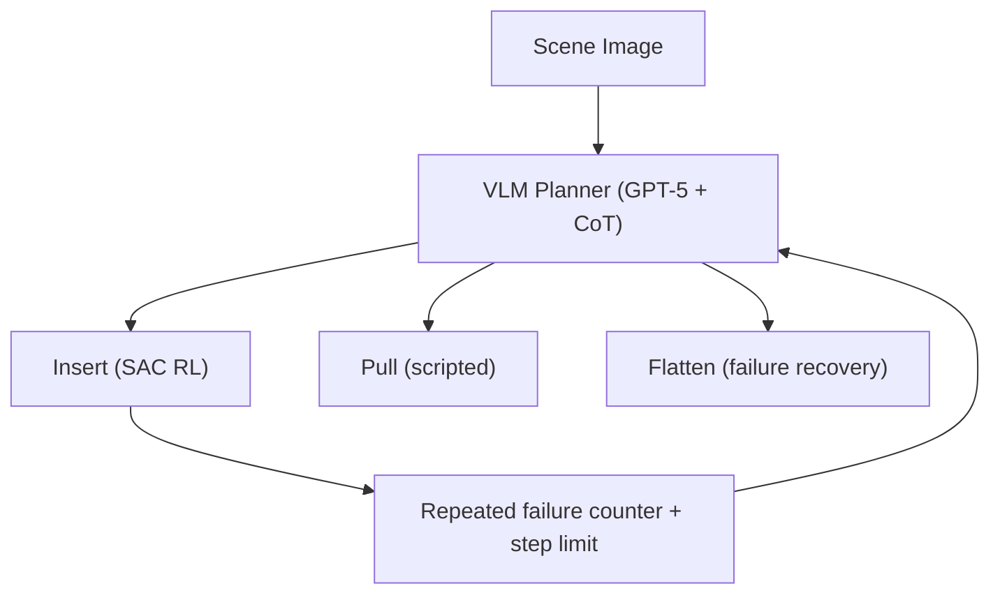

# Hierarchical DLO Routing with RL and In-Context VLMs

- 本地 PDF：`papers/rl/DLO-Routing_2510.19268.pdf`
- arXiv：https://arxiv.org/abs/2510.19268
- 年份：2025 (ICRA 2026 Best Paper Finalist on Robot Learning)
- 团队：University of Minnesota + Princeton (Mingen Li, Houjian Yu, Yixuan Huang, Changhyun Choi 等)
- 阶段：VLM+RL 分层——高层 VLM 规划 + 低层 SAC RL 执行 + 自动故障恢复

## 一句话总结

提出分层框架处理可变形线性物体（线缆/绳子）的多夹点路由：高层 VLM (GPT-5, CoT prompting) 做任务进度推理和技能选择，低层 SAC RL 执行 Insert/Pull/Flatten 三种技能。关键创新是自动故障恢复——VLM 检测重复插入失败后自动触发 Flatten 技能重新整理线缆。仿真长时序路由总体成功率 80-100%（4/5-clip 场景 100%），真实世界 62.5%，超 fixed-order baseline 25 个百分点。ICRA 2026 Best Robot Learning Finalist。

## 核心技术

1. **VLM 高层规划** — GPT-5 + CoT prompting，接收全场景俯视图与当前 clip 的 zoom-in 视图，做任务进度推理 + 技能选择 + 目标 clip 选择 + 完成判定；通过 in-context examples 提供 Insert/Pull/Flatten 的技能定义与反例（何时不应调用）。
2. **SAC RL 低层执行** — Insert 技能是参数化运动原语（7 参数：2 个 via point 的 2D 位置+1D 旋转、1 个抓取点索引），由 SAC 在 IsaacSim/GarmentLab 中训练，观测为粒子化 DLO 状态 + clip 位姿 + rope_in 指示；Pull/Flatten 用预定义运动原语。
3. **自动故障恢复** — 维护连续插入失败计数器并喂给 planner，配合 step limit 约束；VLM 检测 repeated insertion failure → 推理原因 → 触发 Flatten 技能 → 重新 attempt，全程无人工干预。
4. **课程学习** — clip 尺寸从 1.0-2.2 scale（开口最宽 4.84cm）退火到 0.9-1.5，逐步增加难度；观测与动作统一变换到 clip local frame 以消除位姿变化带来的策略混淆。

## 底层原理与数学推导

低层插入任务建模为 MDP $(S, A, r, \gamma)$：状态 $S$ 由 clip 位姿与 DLO 的 $n$ 个粒子位置 $p_{1:n}$ 组成，动作空间 $A$ 为抓手的 3D 笛卡尔运动 $p^t_g$ 与 1D 旋转 $q^t_g$。SAC 的奖励函数设计是本文低层性能的关键：

$$r = 0.5(\mathrm{rope_{in}} + \mathrm{rope_{out}}) + \beta \cdot \mathrm{collide} + \gamma \cdot r_{hor} + r_{dist} + \eta \cdot r_{flat}$$

其中 $\mathrm{rope_{in}}$ 与 $\mathrm{rope_{out}}$ 是"穿过一半/完全穿过"的二元指示；$\mathrm{collide}$ 惩罚与 clip 的碰撞；$r_{hor}$ 惩罚过长回合。分段距离奖励 $r_{dist}$ 引导线缆头到达 clip 开口：

$$r_{dist} = \begin{cases} 10 \cdot d_{floor} & \text{if } \mathrm{rope_{in}} \text{ and not } \mathrm{rope_{out}} \\ 20 \cdot d_{ceil} & \text{if } \mathrm{rope_{out}} \\ 1_R(p_1) / (4 + 80 \cdot d_{floor}) & \text{otherwise} \end{cases}$$

平直度奖励 $r_{flat}$ 鼓励线缆前端在 clip 前保持直线，使插入保持在简单状态（$p_i$ 为粒子位置，仅取 y 轴偏差）：

$$r_{flat} = \frac{1}{1 + \frac{1000}{33} \sum_{i=0}^{32} \|p_{i+3} - p_i\|_y}$$

超参数为 $\beta = -2$，$\gamma = -0.001$，$\eta = 0.5$。整个系统是标准的策略熵最大化目标 $J(\pi) = \sum_t \mathbb{E}[\sum_k \gamma^k r_{t+k} + \alpha \mathcal{H}(\pi(\cdot|s_t))]$，由 SAC 以 6.2k 步训练完成。高层 VLM 不参与梯度训练，完全靠 in-context learning 提供领域知识。

## 物理直觉解释

可变形线缆的插入本质上是一个**过约束对齐问题**：线缆作为一维连续体拥有无限自由度，但 clip 开口只提供一个狭窄的几何通道（开口仅 2.2cm）。这就像**穿针引线**——针孔只给一个自由度，而线头却有无穷多种弯折方式，成功概率取决于"线头在开口平面上的投影恰好落在孔内且方向一致"。更贴切的类比是**把一根煮软的意大利面塞进吸管**：面条的弯曲曲率半径一旦小于某个阈值就会在入口处卡住，而抓取点越靠前，可控制的曲率范围越短，越容易失败。RL 策略在奖励函数中同时惩罚碰撞、奖励前进距离与前端平直度，本质是在这个高维构型空间里学习一条"不触壁"的可行走廊。

为什么需要 Flatten 故障恢复？这对应一个日常经验：**缠绕的电话线或打结的耳机线**。线缆在多次 pull 之后，其前端往往积累了扭转与弯曲（曲率集中在某个局部区域），如同耳机线在口袋里翻腾后打结——此时无论怎么推都进不了孔，因为存储的弯曲弹性能量会把线头弹向错误方向。Flatten 技能的作用相当于**把打结的线拎起来抖直**：它把 DLO 重新初始化到低曲率、头部与 clip 开口大致对齐的构型，释放弯曲势能，从而把"不可能插入"恢复成"可插入"。这正是物理直觉：不是用力更大，而是先把构型流形上的"能量势垒"消掉。

为什么 Insert 用 RL 而 Pull/Flatten 用脚本？插入发生在 clip 附近的接触敏感区，是"倒车入库"式的高精度受限运动——抓手的可达空间仅 0.16m x 0.16m，稍微偏离就会撞上 clip 边缘，且误差会在多次尝试中累积放大。而 Pull/Flatten 是把线缆从环境约束中移开（远离 clip），处于自由空间，相当于**空旷停车场直线倒车**，几何上无碰撞风险，脚本原语即可胜任。这个分工的物理依据是任务所处的"约束密度"不同：约束越密，越需要闭环感知与自适应，即 RL 的价值越大。

## 工程细节与实操指南

- 仿真训练：IsaacSim + GarmentLab，SAC + MLP actor/critic，训练 6.2k 步；DLO 位姿随机化在 10cm x 5cm 矩形内、角度 -10deg 到 10deg，摩擦系数 0.5。
- 课程学习：clip 原始开口 2.2cm；前 1600 步 clip scale 随机化 1.0-2.2（开口最宽 4.84cm），之后聚焦 0.9-1.5。
- 奖励超参：beta=-2, gamma=-0.001, eta=0.5；一次插入原语 7 参数（2 via point x (2D 位置 + 1D 旋转) + 1 个抓取点索引）。
- 评测：低层策略 100 个随机场景；长时序每策略 15 次 trial；成功判定为线缆头从 clip 另一侧伸出且端点距离 > +2cm。
- 真实系统：Franka Emika Panda，腕装 Intel RealSense D415（1280x720 俯视图），MoveIt 规划，ROS，SAM2 分割（NVIDIA 5090 GPU），RL 策略零微调直接 sim-to-real。
- 高层：GPT-5 low reasoning effort + CoT，prompt 含场景描述、DLO 头部追踪指令、技能定义与反例、插入成功标准。

## 消融实验与分析

低层插入技能（100 个随机场景，Table I）：

| 指标 | Heuristic 策略 | SAC RL 策略 (Ours) |
|------|---------------|-------------------|
| 插入成功率 (%) | 45 | 87 |
| 平均端点距离 (cm) | 1.24 | 2.59 |
| 回合长度 (step) | 2.0 | 3.86 |

长时序路由成功率 SR(%)（每配置 15 trials，Table II）：

| 高层规划 / 低层执行 | Implicit | Fixed Spatial | Fixed Attr | 4/5-Clip |
|--------------------|----------|---------------|------------|----------|
| VLM+故障恢复 + RL (本文) | 80 | 93 | 93 | 100 |
| VLM 无故障恢复 + RL | 47 | 7 | 7 | 47 |
| Fixed Order + RL | 53 | 13 | 13 | 60 |
| Symbolic Planner + RL | 68 | 53 | 53 | 100 |
| VLM+故障恢复 + Heuristic | 13 | 7 | 0 | 7 |

真实世界路由（8 种 clip 配置，Table III）：

| 指标 | Fixed Order + RL | 本文方法 |
|------|-----------------|---------|
| 成功率 (%) | 37.5 | 62.5 |
| 平均插入夹数 | 1.75 | 2.625 |

**核心结论**：(1) 故障恢复是高层的最大增益来源——去掉 failure reasoning 后，Fixed Spatial/Attr 场景成功率从 93% 暴跌至 7%，因为这两个场景 clip 间转角超过 90 度，无恢复时插入必然失败；(2) 低层 RL 是规模化前提——同样的 VLM 高层配上 heuristic 低层，4/5-Clip 场景只有 7% 成功率，而配 RL 达到 100%，说明高层推理无法弥补低层执行对环境缺乏感知的缺陷；(3) 分层框架可扩展——4/5-clip 的 100% 成功率证明技能库+规划器架构随任务长度扩展而不退化；(4) 真实世界 62.5% vs 仿真 80-100% 的差距来自标定误差、感知噪声与 sim-to-real 迁移，但相对 fixed-order baseline 的 37.5% 仍有 25 个百分点的绝对优势。

## 技术权衡（Trade-off）

| 优势 | 劣势 |
|------|------|
| VLM 可解释故障恢复：恢复决策是可读的文本推理，不是 latent 黑盒 | 高层依赖闭源 GPT-5 API，每一步决策有 token 成本与网络延迟 |
| RL 插入策略适应 DLO 非线性动力学，87% vs heuristic 45% | 插入策略仅在 2D 平面 + 1D 旋转空间训练，6DoF 空间路由未覆盖 |
| 4/5-clip 长时序泛化 100%，技能库架构可扩展 | 真实世界仍只有 62.5%，sim-to-real 差距明显，需 SAM2 分割等感知栈支撑 |
| Pull/Flatten 用脚本原语，零训练成本 | 故障恢复有误触发风险：线缆已插入时执行 flatten 会抓取失败并碰撞 clip (Fig. 6b) |

## 技术价值与演进定位

本文把"故障恢复"从失败后的补救提升为框架的一等公民：VLM 不再只是生成计划的规划器，而是带状态跟踪与恢复决策的执行期监督者。相比端到端 VLA 把所有逻辑压进 latent space，本文证明了"高层可解释决策 + 低层强化技能"的分层组合在长时序、高接触风险的 DLO 任务上是当前更可靠的范式。其价值在于给出了一个可迁移的分层模板：任何"规划难 + 执行精"的任务都可以套用 VLM 规划器 + RL 技能库 + 恢复机制的结构。未来方向（论文自身指出）是让 VLM 自动集成新技能——把技能使用示例作为 prompt 的一部分，实现技能库的规模化扩展。这一思路与 robotics foundation model 的"技能库 + 组合规划"路线一致，是 DLO 领域的落地验证点。

## 与其他论文的关系

- Luo et al., "Multistage cable routing through hierarchical imitation learning" (T-RO 2024)：最接近的前作——同样做分层线缆穿夹，但高层控制器用模仿学习训练，依赖有限演示，扩展到 4-clip 场景时性能显著下降；本文用 VLM in-context learning 取代 IL 高层，4/5-clip 达到 100% 成功率。
- VLM-PC (Chen et al., ICRA 2025)："VLM 高层推理 + 低层控制器"架构的先行者，但对象是腿式机器人穿越非结构化地形，低层是运动控制器，动作失误不损坏对象；本文面对接触敏感的可变形物体，低层需要 RL 来保证安全与精度。
- Li & Choi 的 DLO 插入系列 (ICRA 2024/2025)：本文的 rope_in/rope_out 指示奖励与 d_floor/d_ceil 分段距离奖励设计沿用自该系列，新意在于加入 r_flat 平直度奖励与故障恢复层，并把单次插入扩展到多夹长时序任务。
- 仿真平台对比：SoftGym 提供粒子类 DLO 动力学但缺高质量渲染，DexGarmentLab 支持服装/布料；本文选 IsaacSim+GarmentLab，说明 DLO 训练对接触仿真保真度的强依赖。
- 与端到端 VLA（RT-2、π0 等）：端到端模型直接输出动作，失败恢复逻辑不可解释且难调试；本文把"何时恢复、如何恢复"交给 VLM 显式推理，可解释性更强，代价是每次决策多一次 VLM 推理延迟。

## 精读问题

1. **Flatten 误触发问题（Fig. 6b）**：线缆已插入 clip 却执行 flatten，导致抓取失败并碰撞 clip——VLM 如何区分"插入完成"与"未完成"？zoom-in 视图中被 clip 遮挡的 DLO 段不可见是否根本性原因？
2. **4/5-clip 的 100% 是否部分来自提前终止**：Fig. 6a 显示 planner 在最后一夹未完全插入时就判定完成——成功率指标是否高估了任务真实完成度？
3. **7 参数运动原语的动作空间压缩**：2D 平面 + 1D 旋转的原语（2 个 via point + 1 个抓取索引）把动作空间压得多小？扩展到 6DoF 空间路由（如汽车线束沿车身布线）时，SAC 的 6.2k 步训练量是否仍然足够？
4. **clip 尺寸课程的影响**：低层策略在 clip local frame 训练、clip 尺寸从 1.0-2.2 退火到 0.9-1.5——尺寸分布如何影响插入成功率？87% 成功率下的失误集中在哪些构型（前端偏离、倾角过大）？
5. **prompt 工程对恢复决策的影响**：VLM prompt 中技能反例（counter-examples）的数量与 zoom-in 视图分辨率如何影响恢复决策质量？GPT-5 低推理预算下，每次失败恢复的额外 token 成本是多少？
6. **sim-to-real 差距的归因**：真实世界 62.5% vs 仿真 80-100% 的差距主要来自 SAM2 分割噪声、相机标定误差还是 DLO 物理属性差异？state-based 的 RL 策略换成视觉观测输入后 sim-to-real 差距会如何变化？
