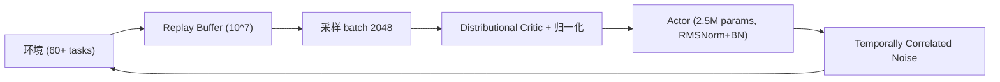

# FlashSAC: Fast and Stable Off-Policy Reinforcement Learning for High-Dimensional Robot Control

- 本地 PDF：`papers/rl/FlashSAC_2604.04539.pdf`
- arXiv：https://arxiv.org/abs/2604.04539
- 年份：2026 (RSS 2026 Best Paper)
- 团队：KAIST, Holiday Robotics, KRAFTON, TU Darmstadt, KTH, DFKI
- 阶段：新一代 off-policy RL 算法 —— 大模型 + 低更新率 + 稳定化技术

## 一句话总结

FlashSAC 将 scaling law 引入 off-policy RL：用更大模型（2.5M）配合极低更新频率（2 次梯度更新/1024 步数据）、大 batch（2048）和大 replay buffer（10^7），加 RMSNorm + 预激活 BN + 权重归一化防止 bootstrapping 崩溃。60+ 任务 10 个仿真器全面超越 PPO/SAC/TD3/REDQ，人形机器人在 Unitree G1 上 sim-to-real <20 分钟。RSS 2026 Best Paper。

## 核心技术

1. **Low UTD Ratio** — 每 1024 步仅做 2 次梯度更新（vs REDQ 的 20 次），大幅降低 overfitting 风险
2. **Large Model Scaling** — 2.5M 参数、6 层网络（vs 通常 SAC 0.2-0.5M、2-3 层），更大的模型容量配合更少的更新步
3. **三重范数约束** — 权重归一化（权向量投影到单位球面）+ RMSNorm/预激活 BN（特征范数）+ 梯度范数约束，显式约束 critic 更新动力学、防止 bootstrapping 误差累积
4. **Distributional Critic** — 分类分布价值函数（101 bins，支撑区间 [-5,5]）+ 自适应奖励缩放，处理高维任务中奖励量级的巨大差异
5. **Noise Repetition** — 噪声向量按 Zeta 分布（P(k) ∝ k^-s, s=2，最长重复 16 步）保持 k 步不变，近乎零开销地产生时间相关探索，替代需逐环境状态、开销高昂的 OU/pink noise

## 底层原理与数学推导

与传统 SAC 的核心差异——更新频率：

$$\text{UTD} = 2/1024 \text{ (FlashSAC)} \quad \text{vs} \quad \text{UTD} = 1 \text{ (SAC)} \quad \text{vs} \quad \text{UTD} = 20 \text{ (REDQ)}$$

低 UTD 的直觉：大 batch + 大模型 + 少更新 = 每次更新的梯度估计更准确，减少了 bootstrapping 误差累积。

**自适应奖励缩放**：为保证分布价值函数固定支撑内的回报不越界，论文按运行折扣回报方差 σ² 与最大量级 G_max 归一化奖励：

$$
\bar{r}_t = \frac{r_t}{\max\left(\sqrt{\sigma^2_{t,G} + \epsilon},\; G_{t,\max}/G_{\max}\right)}
$$

**统一熵目标**：为免去按任务调熵目标，用固定动作标准差 σ_tgt 参数化目标熵，随动作维度 |A| 线性缩放：

$$
\bar{H} = \frac{1}{2}|A| \log\left(2\pi e\, \sigma_{\text{tgt}}^2\right), \quad \sigma_{\text{tgt}} = 0.15
$$

**Noise Repetition 探索噪声**：每间隔采样一个噪声向量 ε ~ N(0, I)，保持 k 步不变，k 从 Zeta 分布 P(k) ∝ k^{-s} 抽取（s=2，最长 16 步）——短重复为主、偶尔长重复，以极小局部状态产生时间相关的连贯动作序列。

## 物理直觉解释

**低 UTD + 大模型像"批量精读"而不是"逐题对答案"**。SAC 就像一个学生每做一道题就看一遍答案——学得快但容易过拟合，而且"看答案"本身有误差时，错误会像谣言一样在传话中逐轮放大（bootstrapping 误差累积）。FlashSAC 反过来——做 1024 道题才看两遍答案，但题目量足够大（replay buffer 10M，是常规 1M 的 10 倍）、每次批改的样本足够多（batch 2048，几乎打满 GPU）、模型容量足够大（2.5M 参数 6 层），学到的是真正通用的"解题规律"而不是"背题答案"。Figure 8 的 scaling 曲线验证了这一点：batch 从 0.5K 增到 8K、宽度从 64 增到 1024、UTD 从 8/1024 降到 0.5/1024，收敛全部加速——这正是 LLM 时代"大模型 + 大批量 + 低更新率"的 scaling law 在 RL 上的复现。

**三重范数约束像给"传话游戏"每一环加录音校验**。critic 的 Bellman 目标依赖它自己的预测，高维空间里误差沿时间戳递归放大——模型越大越容易发散。FlashSAC 从三个层面掐断误差放大：权重归一化把每个权向量投影到单位球面（信息只存"方向"不存"幅度"，防止权重无限增长推高 Q 值方差）、RMSNorm + 预激活 BN 把特征范数钉在有限范围（防止死 ReLU 和激活饱和）、梯度范数约束限制单步更新幅度。Figure 9 的逐级消融（MLP → +Residual → +BatchNorm → +RMSNorm → +Dist. Critic → +Weight Norm）显示每一步都在压低 critic 的条件数（condition number）——条件数就像走钢丝时绳子的抖动幅度，越小越稳，每一步添加都让训练曲线从发散边缘拉回稳定收敛。

**Noise Repetition 像"连贯笔触"而不是"像素点抖动"**。高维动作空间里，每步独立采样的噪声让机器人像在抖动中画点——动作前后矛盾、探索轨迹支离破碎。FlashSAC 让一个噪声向量连用 k 步（Zeta 分布偶尔抽到长重复），动作轨迹变成连贯的笔触，探索效率大增，且几乎零开销——不需要像 OU 噪声那样为 1024 个并行环境各维护一个相关噪声过程。这套配方的总效果在 sim-to-real 上体现得最直观：29-DoF Unitree G1 平地行走训练约 20 分钟（PPO 需约 3 小时）、15cm 台阶楼梯约 4 小时（PPO 需近 20 小时），整体把 sim-to-real 训练时间压低了近一个数量级。

## 消融实验与分析

消融与分析均在四个 IsaacLab 环境上进行（Allegro/Shadow Hand 方块重定向 + G1 平地/崎岖地形行走）：

| 消融因子 | 设置对比 | 关键结果 |
|---------|---------|---------|
| Replay buffer 容量 | 0.1M / 1M / 10M / 50M | 10M 最优；50M 反而在稳定性与效率上变差 |
| Batch size | 0.5K / 1K / 2K / 4K / 8K | batch 越大（2K 起近乎打满 GPU）收敛越快 |
| 网络宽度 | 64 / 128 / 256 / 512 / 1024 | 容量增大加速收敛（低 UTD 下不再发散） |
| 网络深度 | 1 / 2 / 3 / 4 层 | 更深网络 + 低 UTD 收敛更快 |
| UTD 比例 | 0.5/1024 / 1/1024 / 2/1024 / 4/1024 / 8/1024 | 降低 UTD 与增容量协同加速收敛 |
| 架构逐级叠加 | MLP → +Residual → +BatchNorm → +RMSNorm → +Dist. Critic → +Weight Norm (FlashSAC) | 每一步都约束权重/特征/梯度范数并降低 critic 条件数（log 尺度 10→18 区间），训练稳定化 |
| 数据覆盖 | off-policy replay buffer vs 1M 步 on-policy rollout（Shadow Hand） | off-policy 数据在状态-动作空间覆盖显著更广（密度图对比） |
| sim-to-real 平地 | FlashSAC ~20 min vs PPO ~3 h | 29-DoF G1 盲走，支持前后/侧向全向行走 |
| sim-to-real 楼梯 | FlashSAC ~4 h vs PPO ~20 h | 15cm 台阶（训练时未见的尺寸）稳定攀爬 |

**核心结论**：消融把 FlashSAC 的收益分解为三层——(1) scaling 维度（buffer 0.1M→10M 最优、batch 与宽度/深度单调增大、UTD 降低）证明"大模型 + 大 batch + 低更新率"的监督学习式 scaling 配方在高维 RL 中同样加速收敛，但 buffer 过大会反噬（50M 变慢）；(2) 架构维度 MLP→+Residual→+BatchNorm→+RMSNorm→+Dist. Critic→+Weight Norm 逐级叠加，机制统一为"约束范数 + 降低 critic 条件数"；(3) 探索维度 Noise Repetition 以 Zeta 分布长尾重复实现近乎零开销的时间相关噪声。综合结果体现在 sim-to-real：平地 20 min vs PPO 3 h、楼梯 4 h vs PPO 20 h，训练时间压低近一个数量级。

## 技术权衡（Trade-off）

| 优势 | 劣势与工程代价 |
|------|----------------|
| Sim-to-real Unitree G1: ~20min 平地（PPO ~3h）、~4h 楼梯（PPO ~20h） | 大 replay buffer (10M) 需要大量内存，且 50M 规模反而变慢 |
| 低 UTD 降低 overfitting，训练更稳定 | 对仿真器吞吐量要求高（需要 1024 并行环境快速生成大量数据）|
| 三重范数约束防止训练崩溃 | 复杂的归一化组合增加了调参维度 |
| 通用性极强（60+ 任务，10 个仿真器，单套超参数） | sim-to-real 仍需要手工设计 reward 与 domain randomization |

## 技术价值与演进定位

FlashSAC 获得 RSS 2026 Best Paper 的原因：它不是修修补补的改进，而是**对 off-policy RL 训练范式的重新思考**——把 LLM 时代的 scaling law 直觉（大模型 + 大批量 + 低更新率）首次系统性地引入机器人 RL：2.5M 参数模型配 2/1024 的更新率，并用"约束权重/特征/梯度范数"解决了大模型在 bootstrapping 下的发散问题。对机器人领域而言，它的意义在于把 off-policy RL 从"样本高效但缓慢不稳定"的定位里解放出来——60+ 任务、10 个仿真器、单套超参数全面超越 PPO/SAC/TD3/REDQ，且把 sim-to-real 人形训练的墙钟时间从小时级压到分钟级（约 20 分钟平地行走 vs PPO 约 3 小时），这是 off-policy RL 首次在 sim-to-real 高维系统上反超 on-policy 主流范式。它直接影响了 VLA 的 RL 后训练路线（RL Token、ROVE 等）：当仿真吞吐不再是瓶颈、稳定化技术可复用，RL 在高维机器人控制上就真正达到了实用级别，为"先大规模预训练、后 RL 微调"的通用智能体路线提供了可靠的底层算法。

## 工程细节与实操指南

- **网络**：2.5M 参数、6 层 actor 与 critic，倒置残差块（inverted residual）+ ReLU，RMSNorm + 预激活 BN
- **Critic**：Distributional categorical（101 bins，支撑区间 [-5,5]）+ 自适应 reward scaling（按运行方差 σ² 与最大量级 G_max 归一化）
- **Replay Buffer**：10M transitions（常规配置 1M 的 10 倍），batch 2048，UTD 2/1024
- **超参数（GPU 仿真）**：1024 并行环境，n-step 1，actor 2 blocks hidden 128（update delay 2），critic 2 blocks hidden 256，target momentum 0.01，2 critics，Adam lr 3e-4 → 1.5e-4 cosine decay
- **探索**：Noise Repetition（Zeta 分布 s=2，最长重复 16 步）+ 统一熵目标 σ_tgt=0.15
- **工程优化**：PyTorch JIT 编译 + 全流程混合精度（省 5-10% wall-clock）
- **硬件**：sim-to-real 在 4096 并行环境中约 4h 完成训练（单张 A100），策略直接部署、无微调；50 Hz 输出目标关节位置，低层 PD 控制器 200 Hz

## 与其他论文的关系

- **SAC / TD3 / REDQ** — 被超越的 baseline
- **RL Token (PI, 2026)** — VLA + online RL，FlashSAC 提供了更好的 RL 底层算法
- **ROVE (XPeng, 2026)** — 人形机器人的人机协同 RL 后训练，可直接受益于 FlashSAC
- **SimDist (RSS 2026)** — 仿真蒸馏加速 RL，和 FlashSAC 互补

## 精读问题

1. 论文正文写 UTD=2/1024（每 1024 步 2 次更新）而超参数表写 2/2048——同一设置为何两处记法不同？哪个是实际生效值？
2. UTD=2/1024 是否对所有任务类型都是最优的？低 UTD 在奖励稠密 vs 稀疏任务中的表现差异？
3. Replay buffer 从 10M 增到 50M 反而变慢的机制是什么——是陈旧数据占比、采样效率还是内存带宽？最优 buffer 容量与任务规模的 scaling 关系？
4. 三重范数约束是否可能过度约束 critic 的表达能力？条件数降到多低才"够用"，是否存在收益拐点？
5. Noise Repetition 的 Zeta 指数 s=2 与最长重复 16 步如何选择？与 OU 噪声在探索统计上的等价性如何量化？
6. Distributional critic 的 101 bins 与支撑区间 [-5,5] 如何与自适应 reward scaling 交互？G_max 估计误差对价值头的影响边界？
7. Sim-to-real 的 ~20 分钟（平地）在接触-rich 操作任务（如灵巧手拧螺丝）中是否仍然成立？范数约束是否天然有利于 sim-to-real 的领域随机化？
