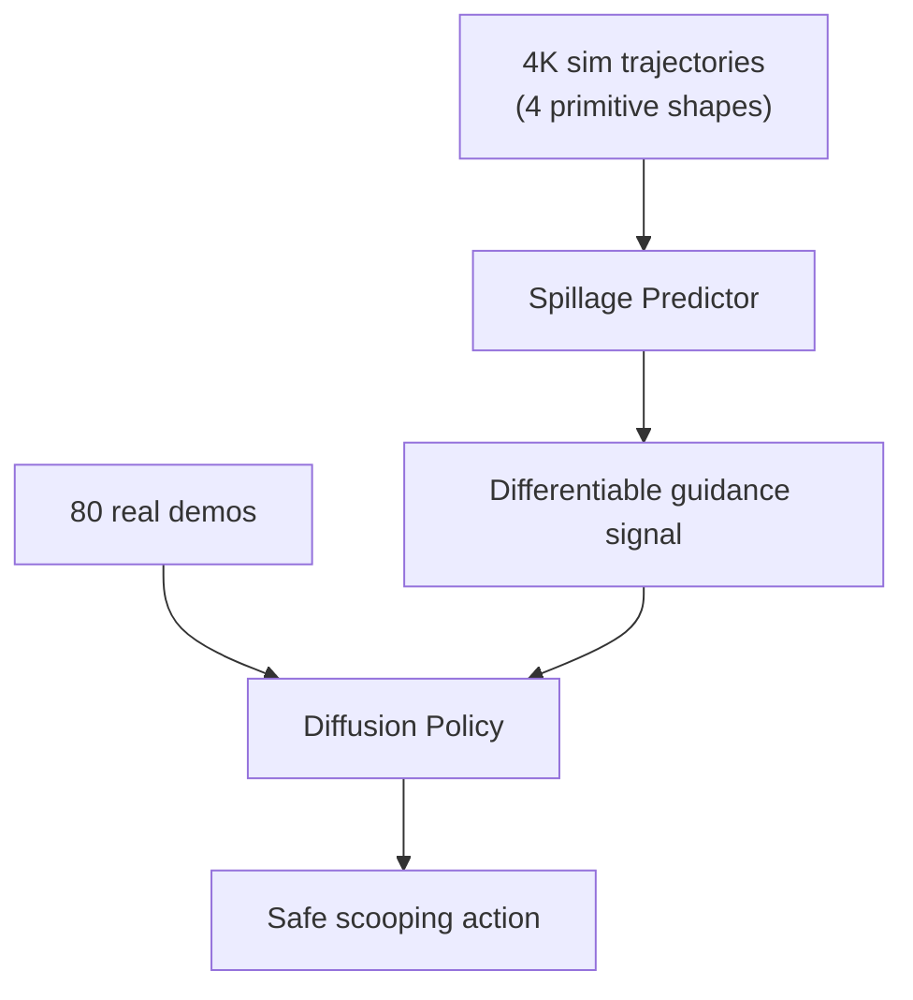

# GRITS: Spillage-Aware Guided Diffusion Policy for Robot Food Scooping

- 本地 PDF：`papers/rl/GRITS_2510.00573.pdf`
- arXiv：https://arxiv.org/abs/2510.00573
- 年份：2025 (ICRA 2026 Best Paper Finalist on Robot Learning)
- 团队：NYCU + XYZ Robotics + NVIDIA
- 阶段：可微分引导扩散策略 — 溅洒预测器做 diffusion guidance

## 一句话总结

GRITS 提出溅洒感知的引导扩散策略：先训练 spillage predictor（4K 仿真轨迹 + 4 种 primitive shapes 生成、随机物理参数），再在 diffusion denoising 时用其可微分输出做 guidance（ρ=2.5、延迟 30 步后激活），把轨迹在去噪后期"推离"溅洒区域。仅 80 条真机 demo、6 类食物训练，10 类 unseen 食物测试。82% 成功率、4% 溅洒率——比无引导的 Diffusion Policy (70%/15%) 溅洒率降低 73% 以上，比带后处理的 DP (52%/8%) 成功率提高 30pp。

## 核心技术

1. **Spillage Predictor** — 在 Isaac Lab 中用 4K 轨迹训练（球/立方/锥/圆柱 4 种 primitive shapes、随机物理参数），从点云预测溅洒概率 $p_{spill}$；训练数据全部仿真生成，与策略的真机 demo 数据解耦
2. **Guided Diffusion** — predictor 输出可微分 guidance 信号，在 denoising 后期（30 步之后）引导轨迹远离溅洒区域；guidance 强度 ρ=2.5
3. **Segmented Point Cloud Input** — food（深度图 + SAM2 分割）+ spoon（CAD）+ bowl（CAD），DP3-style PointNet++ 编码，输入模态是点云而非像素

## 底层原理与数学推导

扩散策略的 denoising 过程从噪声动作 $x_T$ 出发、迭代 $T$ 步还原出动作 $x_0$。标准 DDPM 更新为

$$x_{t-1} = \mu_\theta(x_t, c, t) + \sigma_t \cdot \epsilon$$

GRITS 的关键修改是在更新中加入 predictor 的梯度项：

$$x_{t-1} = \mu_\theta(x_t, c, t) + \sigma_t \cdot \epsilon - \rho \cdot \nabla_{x_t} \log(1 - p_{spill}(x_t, c))$$

其中 $p_{spill}(x_t, c)$ 是溅洒预测器对当前去噪中间动作 $x_t$ 的溅洒概率，$\rho = 2.5$ 是引导强度。梯度项把轨迹推向"预测溅洒概率低"的区域——这是 classifier guidance 的精确类比：预测器扮演 classifier，去噪过程扮演生成器。延迟激活（前 30 步不施加 guidance）的物理含义是：去噪早期轨迹还远未成型，过早引导会把轨迹压向 predictor 的 bias；后期轨迹接近最终动作，此时引导才精准有效。由于 predictor 是标准网络，梯度 $\nabla_{x_t} \log(1 - p_{spill})$ 可直接反向传播，整个引导过程完全可微分、零额外推理成本。

## 物理直觉解释

**"往杯子里倒啤酒"式的最后收手**。倒啤酒时，前半程可以大胆倒——液面离杯口还远，怎么倒都不会溢出；只有接近杯口时，酒保才开始小心翼翼地收流量，因为此时"流速"直接决定"是否溢出"。GRITS 的延迟 guidance 就是这个直觉的机械实现：去噪前 30 步（相当于液面还低的时候）不加引导，让策略自由发挥；30 步之后（相当于接近杯口），溅洒 predictor 的梯度开始把轨迹推向"不洒"的方向。ρ=2.5 就是"收手的灵敏度"——太大动作僵硬、太小收不住。这是"约束只在临界区生效"的物理直觉在轨迹空间的重现。

**溅洒预测器是"洒过无数次的人"**。策略只见过 80 条成功 demo——它知道怎么舀，但不知道"什么动作会洒"。而 predictor 在仿真里用 4000 条随机轨迹见过无数种"洒法"：球形的会滚、立方的会卡、锥形的会倾、圆柱的会滑，摩擦变了洒的角度也变。这就像**让一个从没打翻过汤的人掌勺 vs 让一个打翻过一千次汤的人掌勺**——后者不是更会舀，而是对"哪种姿势会洒"有条件反射。predictor 的"失败经验"（仿真数据）和策略的"成功经验"（真机 demo）互补：成功经验告诉它目标在哪，失败经验告诉它别往哪走。

**为什么"引导"比"后处理"强？** 后处理（DP + post-processing）是策略输出动作后再检查修正——相当于**先开过去再倒车**：动作已经成型，修正空间有限，52% 成功率/8% 溅洒率说明修正本身引入了新问题。而 diffusion guidance 是在动作**生成过程中**就避开溅洒区域——相当于**导航时提前绕开堵车路段**，而不是到了路口再掉头。去噪过程每走一步都知道"前方洒不洒"，轨迹自然落在安全区域。这个差别是 82% vs 52% 的根源：约束参与生成 vs 约束事后补救。

## 工程细节与实操指南

- 仿真：Isaac Lab，4K 轨迹、4 种 primitive shapes（球/立方/锥/圆柱）、随机物理参数训练 predictor
- Guidance: ρ=2.5, 去噪前 30 步不激活（delayed activation）
- 输入: 分割点云 — food (深度 + SAM2), spoon (CAD), bowl (CAD), DP3-style PointNet++
- 数据: 80 条真机 demo, 6 类食物训练（brown rice, soybeans, chocolate balls, dates 等）
- 测试: 10 类 unseen 食物（sago, red beans, marshmallows, gummies, macaroni, mixed nuts, milk tea 等）
- 指标: 成功率 + 溅洒率双指标（成功但溅洒被单独计为溅洒）

## 消融实验与分析

10 类 unseen 食物测试集上的成功率与溅洒率（论文 Table）：

| 方法 | 成功率 (%) | 溅洒率 (%) |
|------|-----------|-----------|
| **GRITS（引导扩散）** | **82.0%** | **4.0%** |
| Diffusion Policy（无引导） | 70.0% | 15.0% |
| DP + post-processing（后处理修正） | 52.0% | 8.0% |
| SCONE（对比方法） | 65.0% | 20.0% |
| BC（行为克隆） | 45.0% | 45.0% |

**核心结论**：(1) guidance 的直接收益是溅洒率 15%→4%（相对降低 73%+），成功率 70%→82%（+12pp）——同一扩散策略，仅加一个可微分引导信号就同时改善了双指标；(2) 后处理路线（52%/8%）证明"事后修正"不仅救不回成功率（-18pp vs 无引导 DP），溅洒率也只压到 8%——约束必须参与生成过程而非叠加在输出上；(3) 行为克隆 45%/45% 说明无强化/无引导的纯模仿在"安全约束"维度基本无效——安全不是从成功 demo 里自动学到的；(4) unseen 食物上的结果（10 类未见过的形状/质地）说明 predictor 的 primitive-shape 泛化足以覆盖未见食物类别——"洒"的物理（堆积角、滚动、滑动）比"食物类别"更通用。

## 技术权衡（Trade-off）

| 优势 | 劣势 |
|------|------|
| 不修改架构：diffusion policy 原生支持可微分 guidance | predictor 的仿真-真实 gap：仿真训练的"洒"模型在真实摩擦/刚度下可能偏差 |
| 失败预测器与策略数据解耦（仿真 vs 真机） | 延迟激活（30 步）与 ρ 需要调参，对任务敏感 |
| 仅 80 条真机 demo 即可训练 | 只验证了食物舀取任务，接触几何更复杂时 predictor 需要重训 |
| 任何"可预测的失败模式"都可套用（溢出/碰撞/倾覆） | 引导依赖 point cloud 输入的完整性，遮挡时 predictor 置信度下降 |

## 技术价值与演进定位

GRITS 的通用性在于它把"安全约束"变成了**扩散过程的即插即用信号**：任何"能预测失败"的模块（溅洒、碰撞、溢出、缠绕）都可以用同一套 guidance 公式接入去噪过程，无需重训策略、无需改架构。这与 classifier guidance 在图像生成中的角色完全同构——图像领域用它控制风格，机器人领域用它控制安全。它的意义还在于验证了"仿真训练失败预测器 + 真机训练策略"的混合数据范式：失败经验（负面数据）从仿真廉价获得，成功经验（正面数据）由真机 demo 提供，两种数据各得其所。与 HapticVLA（触觉蒸馏）相比，GRITS 蒸馏的是"失败知识"而非"传感器能力"；与 RL-100（三阶段 RL）相比，GRITS 用引导替代了部分在线 RL 的作用——这是"约束式安全"对"探索式安全"的一次低成本替代。

## 与其他论文的关系

- 与 Diffusion Policy 家族（DP、DP3）：GRITS 直接建立在 DP/DP3 之上，贡献是 guidance 层——DP3 的点云编码被保留，新增的只是 predictor 及其梯度注入。
- 与 classifier guidance（图像生成）：公式 $\nabla_{x_t}\log(1-p_{spill})$ 与 classifier guidance 同构，GRITS 是其在机器人动作轨迹空间的迁移，延迟激活是轨迹特有的工程适配。
- 与 HapticVLA（触觉蒸馏）：都使用"训练期信号 → 部署期轻量"的迁移结构——HapticVLA 迁移触觉能力，GRITS 迁移失败预测；HapticVLA 蒸馏到网络参数里，GRITS 保持为显式 guidance。
- 与 RL-100 / Z-1（RL 后训练）：RL 用探索修正策略，GRITS 用引导修正生成——GRITS 的路线不需要在线交互，适合"失败模式已知、交互成本高"的任务。

## 精读问题

1. **predictor 的泛化边界**：4 种 primitive shapes 训练出的"洒"模型，在什么形状/材质组合下失效？predictor 的分布偏移如何量化并影响 guidance 质量？
2. **延迟激活与 ρ 的联合敏感性**：30 步延迟与 ρ=2.5 是否是网格搜索的最优？当任务变快（勺子移动更急）时，最优 (delay, ρ) 如何移动？
3. **guidance 与去噪退火**：引导梯度与 DDPM 噪声项在晚期去噪的相互作用——ρ 过大是否造成轨迹"卡在 predictor 的盲区"？
4. **失败模式的可预测性假设**：如果溅洒 predictor 对某类食物（如吸附性强的粘稠物）误判为零概率，GRITS 是否退化为无引导 DP？误判概率多高时引导开始有害？
5. **点云完整性的依赖**：SAM2 分割错误（food 与 spoon 粘连）时 predictor 的输入被污染——输入污染对 guidance 信号的影响是"随机噪声"还是"系统性偏差"？
6. **扩展到其他安全约束**：同一 guidance 框架接入碰撞预测器/倾覆预测器时，多个 guidance 项的加权策略是什么？梯度方向冲突时如何仲裁？
