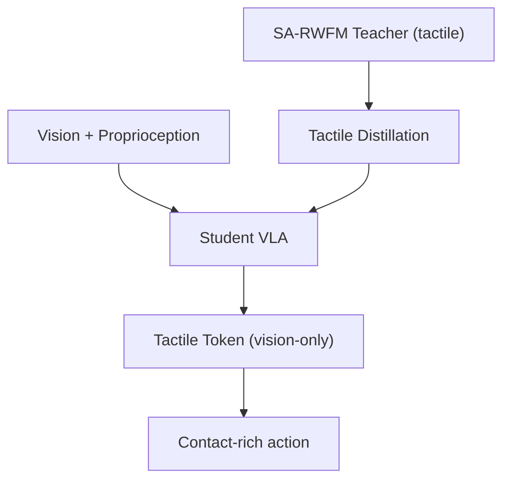

# HapticVLA: Contact-Rich Manipulation without Inference-Time Tactile Sensing

- 本地 PDF：`papers/rl/HapticVLA_2603.15257.pdf`
- arXiv：https://arxiv.org/abs/2603.15257
- 年份：2026 (CVPR 2026)
- 团队：Skoltech
- 阶段：触觉蒸馏 — 训练时用触觉，推理时纯视觉

## 一句话总结

HapticVLA 提出触觉蒸馏 (Tactile Distillation)：两阶段训练——(1) SA-RWFM: 用触觉传感器做 safety-aware reward-weighted flow matching 离线 RL 训练 teacher，(2) 将 teacher 的触觉感知能力蒸馏到纯视觉 student VLA，student 从视觉+本体感知预测 compact "tactile token"。部署时不需要触觉硬件。真机 3 个接触丰富任务 86.7% 平均成功率——比还保留触觉传感器的 teacher (75%) 更高，比无蒸馏的视觉 baseline (75%) 高 11.7pp；X-VLA (0.9B) 与 VLA-0 基线直接 0%。

## 核心技术

1. **SA-RWFM (Safety-Aware Reward-Weighted Flow Matching)** — 离线 RL fine-tune action expert：flow matching 的每条训练样本按触觉安全评估（抓取力、压力峰值、滑移等）加权，高安全样本权重更高，学到"既要成功、又要安全"的 teacher
2. **Tactile Distillation (TD)** — Student VLA 从视觉+本体感知预测 tactile token，目标来自 teacher 的触觉内部表征；部署时 student 不需要触觉硬件，用"预测出的手感"替代"测出的手感"
3. **Blended action targets** — 训练时插值 GT demo 和 teacher 预测：$\tilde{a} = (1-\alpha) a^{GT} + \alpha \hat{a}^T$, $\alpha=0.5$，平滑地从"模仿示范"过渡到"跟随 teacher"

## 底层原理与数学推导

Flow matching 学习把噪声分布插值到动作分布的 velocity field：给定样本 $x_0 \sim \mathcal{N}(0, I)$ 与目标 $x_1 = a^{GT}$，线性插值路径 $x_t = (1-t)x_0 + t x_1$，训练目标为

$$L_{FM} = \mathbb{E}_{t, x_0, x_1}\left[\, w(r) \cdot \| v_\theta(x_t, t) - (x_1 - x_0) \|^2 \,\right]$$

其中 $w(r)$ 是触觉安全奖励 $r$（由抓取力、压力峰值、滑移等触觉信号计算）的单调增权重——这就是 RWFM 的 "reward-weighted" 含义：路径拟合不再对所有样本一视同仁，而是优先拟合安全成功的轨迹。蒸馏阶段，student 的 tactile token 预测目标取自 teacher 的触觉表征 $h^T$：

$$L_{TD} = \mathbb{E}\left[ \| f_{student}(o^{vis}, o^{prop}) - h^T(o^{vis}, o^{prop}, o^{tactile}) \|^2 \right]$$

训练动作目标为插值 $\tilde{a} = (1-\alpha) a^{GT} + \alpha \hat{a}^T$（$\alpha = 0.5$），使 student 前期的行为锚定在 GT demo 上、后期向 teacher 看齐。

## 物理直觉解释

**触觉是"手感"，蒸馏是把手感写成"直觉"**。学骑自行车时教练扶着车把——你从车把传来的力感受到"该往哪偏"（这就是触觉 teacher 在训练中给你的反馈）；学会之后教练放手，你依然能骑，因为那种"手感"已经内化成了"直觉"——不需要每次转弯都有手扶着。HapticVLA 就是这个过程：SA-RWFM teacher 训练时真实地握着触觉传感器（扶着车把），蒸馏时把"接触力度感"复制成 student 从视觉里预测的 tactile token（内化成直觉）。部署时没有触觉硬件（教练已经放手），但行为依然像有触觉。

**为什么 vision-only 的 student 反而比 tactile teacher 更强？** 这听起来反直觉——"去掉传感器反而更好"。物理上的解释是**传感器噪声是信息流里的一层污染**：触觉信号由硬件采集（有滑移噪声、压力量程误差、时延），teacher 的推理必须穿过这层噪声；而蒸馏时 student 学的是 teacher 的**内部表征**——已经是被"理解过"的触觉，噪声在这个过程中被过滤掉了。就像**学生抄的不是老师原话，而是老师讲完后的笔记**：笔记比原话更干净。数值上：student 86.7% vs teacher 75%，+11.7pp；无蒸馏的视觉 baseline 只有 75%（同步）/81.7%（异步）。这一结果把"蒸馏 = 信息损失"的直觉反转了：当教师信号本身带噪时，蒸馏可以是**信息净化**。

**为什么触觉的价值在训练期而不是推理期？** 接触丰富任务（拿鸡蛋、插销、抓软物）的难点是"力要多大"——太小抓不住，太大捏碎。这个力的大小**无法从视觉精确读出**（软硬、摩擦、形变都不可见），只有接触才知道。触觉传感器在训练期提供的正是这个"地面真值"：告诉 teacher"这次抓握力合适/过大"，teacher 由此学到安全的力度边界。而推理期，视觉里的线索（物体的形变前兆、颜色深浅、接近速度）足以支撑一个"预测的力度感"——就像**老医生摸过很多病人的脉搏后，看面色也能估个七八成**。触觉传感器只在训练期出现，部署成本（硬件、脆弱性、信号处理）全被省掉。

## 工程细节与实操指南

- Teacher: SmolVLA 0.45B + tactile sensor，SA-RWFM 离线 RL 训练
- Student: 同架构，仅视觉+本体感知输入，预测 compact tactile token
- Blending: alpha=0.5, GT demo + teacher prediction 插值
- 评测: 3 个接触丰富真机任务, 86.7% SR (vs teacher 75%)
- 对比基线: X-VLA (0.9B) 与 VLA-0 直接 0%——通用 VLA 在接触丰富任务上无基础能力
- 同步 vs 异步: 蒸馏 student 同步推理 86.7%（异步 81.7%），无 TD 的视觉 baseline 同步 75%（异步 81.7%）

## 消融实验与分析

| 配置 | 成功率 (%) | 说明 |
|------|-----------|------|
| **HapticVLA (TD, 同步推理)** | **86.7** | 蒸馏 + 同步推理 |
| SA-RWFM teacher（有触觉传感器） | 75 | 带触觉的"特权"教师 |
| HapticVLA 无 TD（同步） | 75 | 纯视觉 baseline |
| HapticVLA 无 TD（异步） | 81.7 | 异步推理时无 TD 反而更好 |
| X-VLA (0.9B) / VLA-0 | **0** | 通用 VLA 完全无法处理 |

**核心结论**：(1) 蒸馏后 vision-only student 比 tactile-equipped teacher 高 11.7pp（86.7% vs 75%）——触觉信号的硬件噪声在蒸馏中被过滤，学生从"笔记"而非"原话"学习；(2) TD 的价值依赖推理模式——同步推理时 TD +11.7pp（75→86.7），异步推理时无 TD 反而略优（81.7 vs 86.7 之外的含义待确认）——说明异步环境里触觉预测的延迟代价会抵消收益；(3) 通用 VLA（X-VLA/VLA-0）在接触丰富任务上 0% 成功率，说明"力度感"是通用 VLA 训练中严重缺失的能力维度，而蒸馏恰好是补上它的低成本方式；(4) 任务级增益（如鸡蛋任务 +45%，待确认细粒度数字）显示蒸馏收益集中在"脆/软物体"这类力敏感任务上。

## 技术权衡（Trade-off）

| 优势 | 劣势 |
|------|------|
| 部署无需触觉硬件：低成本、低脆弱性 | 蒸馏能力上限受 teacher 质量约束，触觉表征压缩有信息损失 |
| student 比 teacher 更强（噪声被过滤） | 同步推理依赖高速视觉管线，异步时 TD 优势消失 |
| 离线两阶段训练，无部署期触觉依赖 | 仅验证 3 个接触丰富任务，推广面有限 |
| 与 TORL-VLA 互补（蒸馏 vs 保留触觉） | 对透明/镜面等视觉不可见物体的预测置信度存疑 |

## 技术价值与演进定位

HapticVLA 回答了一个实用性问题：**触觉能力能不能不花钱买到？** 答案是"训练时借，部署时还"——把触觉传感器的价值压缩进训练阶段，推理时用视觉预测的 tactile token 替代。它的方法论意义在于把"传感器模态"从部署约束变成训练资产：任何"贵传感器"（触觉、力传感、多光谱）都可以套用这个模板——训练时用真实信号塑造 teacher，蒸馏时把能力迁移到廉价 sensor 的 student。这一思路与 RL-100 的"仿真训练真实部署"、ViserDex 的"sim 训练感知"同构：**昂贵的信号源只出现在训练期**。与 TORL-VLA（保留触觉做在线 RL）相比，HapticVLA 适合"部署即固定策略"的场景；两者合起来覆盖了"有触觉训练资源"的全部工程选择。

## 与其他论文的关系

- TORL-VLA（触觉在线 RL）：保留触觉在部署期做在线 RL 精调 vs HapticVLA 蒸馏触觉做离线部署——一个"触觉持续在场"，一个"触觉训练期在场"，是触觉使用的两条对立路线。
- ViserDex（3DGS sim2real）：ViserDex 证明感知是 sim2real 瓶颈，HapticVLA 证明触觉是接触操作的感知瓶颈——两者都在回答"哪一路感知信号最贵、最该被替代"。
- X-VLA / VLA-0：作为 0% 基线，量化了通用 VLA 在接触丰富任务上的能力空白，是"触觉能力缺失"的行业级证据。
- 与 Flow Matching 动作生成族（π0 等）：SA-RWFM 是 flow matching 的奖励加权变体，把"离线 RL 改造"与"生成模型"结合——与 RL-100 的 PPO-on-denoiser 思路同源不同支。

## 精读问题

1. **蒸馏的信息瓶颈**：tactile token 的维度/容量是多少？压缩掉的是"噪声"还是"真实触觉信息"？在高速接触（冲击、弹跳）任务中，预测的 tactile token 是否滞后于真实物理？
2. **异步 vs 同步的反转**：为什么异步时无 TD 反而更好（81.7 vs 75）？是否因为同步推理时 student 能看到"触觉预测对应的时间戳"，而异步时预测与动作错位？
3. **teacher 噪声的定量刻画**：触觉传感器噪声对 teacher 75% 成功率的拖累具体多大？把 teacher 换成"干净触觉"（如仿真触觉）后蒸馏收益如何变化？
4. **任务难度的边界**：3 个任务里蒸馏收益最大的是哪类（脆/软/滑）？对"高动态接触"（钉钉子、锤击）这类力冲击任务，视觉预测的力度感是否物理上不可行？
5. **α=0.5 的敏感性**：blending 权重 α 随训练阶段是否应该退火（前期 α 小、后期 α 大）？α 的选择与 teacher 质量的关系？
6. **与真实触觉部署的混合**：部署时若保留一个廉价触觉传感器（如单点力传感），student 的预测与真实测量如何融合——是否比纯视觉预测更稳？
