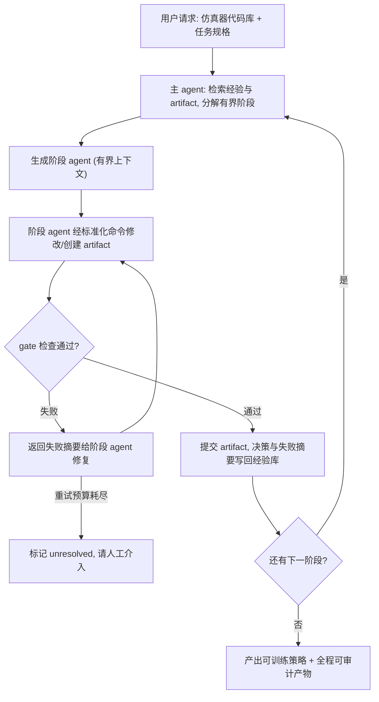

# HARBOR: A Harness Framework for Agentic Robot Reinforcement Learning

- arXiv: https://arxiv.org/abs/2606.08610
- Source: https://arxiv.org/abs/2606.08610
- Project: 
- Local PDF: `/Users/luogu/physical_intelligence/papers/rl/HARBOR_2606.08610.pdf`
- Year: 2026
- Category: rl
- Priority: high

## 一句话总结

HARBOR 把机器人 RL 的"周边工程"（装依赖、建任务、写奖励、配 DR、接算法、调超参）整体当作一个 harness engineering 问题：主 agent 把自然语言请求分解成有界阶段，专职 agent 通过标准化命令修改持久化 artifact，每个阶段必须通过可执行 gate 才能推进，失败模式在传播前被转成可观测的 gate 失败。在 6 个 benchmark、16 个任务上端到端跑通仿真 RL 并实机迁移；算法调参在 12 个任务-算法组合中的 11 个追平或超过默认配置；Push-Cube 消融里全 harness 以 48/50 的可靠性同时成为成本最低的配置（$70.90 vs Vanilla $182.15）。

## 核心技术

1. **Harness 五元组抽象** $H_{RL} = (H_A, C, M, G, K)$ — agents（上下文隔离的子进程，各管一个有界阶段）、commands（从 `rl-sweep` 原语到 `tune-reward` 组合环的可复现操作）、mutable artifacts（持久可检查文件，作为 agent 间通信基底）、verifiable gates（硬接口检查 + 软语义检查，如 import、rollout、渲染）、reusable knowledge（模板、参考、脚本、人类启发式、历史经验）。
2. **六阶段 artifact-centric 工作流**：Dependency setup → Task generation → Reward generation → RL integration → Domain randomization → RL tuning，每阶段由"agent + 命令对"实现、以 artifact 记录、由 gate 验证（论文 Table 1）。用户可只指定 simulator/task/算法/预算/调参目标的任意子集，缺省项由框架经验与代码库模板推断。
3. **Gate-checked execution protocol**：主 agent 取回相关知识与 artifact → 生成有界上下文的阶段 agent → agent 通过标准命令改产物 → gate 评估输出。gate 通过则提交 artifact，并把日志、指标、视频、决策与失败摘要写回可复用知识；gate 失败则把失败摘要（失败检查项、错误信息、观测值）回传给阶段 agent 修复；重试预算耗尽后阶段标记 unresolved 并请人工介入。关键定位：HARBOR 不保证最终策略的语义正确性，而是把常见 RL 工程失败转化为下游传播前的可观测 gate 失败。
4. **CCDE（centralized control, decentralized execution）并行调参**：主 agent 只保存调参历史并做聚合决策，把每次 reward/DR/超参尝试派发给在隔离 trial 目录里运行的并行子 agent；完整 rollout 视频、奖励代码、日志都留在各自目录，trial 可异步运行、不互相覆盖共享产物、可调度到计算集群。
5. **Experience learning**：每轮调参后主 agent 把跨 trial 的重复模式蒸馏成短要点（有效奖励项、不稳定参数区间、常见失败模式），新轮次前按 simulator/task/算法标签检索阶段匹配的经验，阶段结束后再追加回经验记忆——跨 run 复用成功模式、避开已知失败。
6. **Plugin 化与可干预性**：命令、artifact、gate 都以结构化自然语言写成而非不透明代码，用户可以看每个阶段做什么、每个 gate 查什么，并直接编辑定义；每个阶段在 gate 处暂停并落盘，因此可以从最后一个 gate 通过的状态恢复。
7. **实机迁移栈**：系统辨识 + 域随机化——用用户提供的真实轨迹搜索最匹配的仿真物理参数，按人类反馈调整物体质量、初始位姿等随机化范围；感知用单目外部 ZED2 RGB-D + FoundationPose（tracking-first）+ SAM2.1 分割，2 FPS 的轻量位姿质量评估检测跟踪丢失。

整条工作流可以用一张图概括——每个阶段都在 gate 处停下，失败就地修复而不是向下游传播：

## 底层原理与数学推导

RL 的形式化是 MDP：

$$M = (S, A, P, r, \rho_0, \gamma, T)$$

其中 $S$、$A$ 是状态与动作空间，$P$ 是转移动力学，$r$ 是奖励，$\rho_0$ 是初始状态分布，$\gamma$ 是折扣因子，$T$ 是终止条件。论文的出发点是：这个紧凑形式**隐藏了**在机器人上实例化它所需的工程复杂度——$S$/$A$ 必须对齐仿真器观测与机器人控制接口，$P$ 由资产、控制频率、物理参数决定，之外还需要算法集成、配置、日志、评测、部署接口。因此 robot RL 不只是"在固定 MDP 上做策略优化"，而是"构建、验证、迭代修正 MDP 及其周边流水线"。这就是把 RL 自动化归为 harness 问题的根据。

HARBOR 把通用 agent harness 模式特化为 RL harness 五元组：

$$H_{RL} = (H_A, C, M, G, K)$$

$H_A$ 是 agents、$C$ 是 commands、$M$ 是 mutable artifacts、$G$ 是 verifiable gates、$K$ 是 reusable knowledge。执行语义是：知识与 artifact 为 agent 提供上下文，agent 调用命令变换 artifact，gate 用可执行的 RL 证据校验工作流状态，通过/失败的结果再被摘要回知识。

Gate 推进可以写成带重试预算 $B$ 的受控转移。设阶段 agent 在第 $n$ 次尝试产出候选 artifact $a_n$，gate 为布尔判定 $g(a_n) \in \{\text{pass}, \text{fail}\}$：

$$
x_{n+1} = \begin{cases}
\text{commit}(a_n) & g(a_n) = \text{pass} \\
\text{repair}(x_n, e_n) & g(a_n) = \text{fail},\ n < B \\
\text{escalate} & g(a_n) = \text{fail},\ n \ge B
\end{cases}
$$

其中 $e_n$ 是 gate 输出的结构化失败摘要。这个设计的实质是把"错误是否可见"变成显式状态：gate 不证明语义正确，但把"渲染路径静默失效"这类原本要等到训练曲线不动才发现的问题，提前到阶段边界暴露。

RL 之所以适合这种 gate 化，是因为 MDP 暴露了稳定接口 + 可执行反馈的组合：接口检查能抓住非法 reset、非法观测与动作（例如 delta 末端位姿控制器的动作 gate 检查"随机动作产生的目标位姿指令是否符合预期、指令位姿是否等于实际位姿"，从而暴露控制器/动力学/逆运动学错误）；诊断状态与短训练能暴露奖励或优化失败；渲染出的 rollout 能揭示标量回报掩盖的行为错误。论文强调这些检查不是完备保证，而是"让 agent 能验证产物并从失败中恢复"的实用基底。

实机部署侧的两个数学细节。位姿置信度用渲染-观测一致性度量：

$$
c = \exp\left(-\frac{\frac{1}{P}\sum_i M(i)\,\lVert I_{\text{obs}}(i) - I_{\text{rend}}(i)\rVert}{1 + \lambda \sum_i \lVert D_{\text{obs}}(i) - D_{\text{rend}}(i)\rVert}\right)
$$

$M(i)$ 是 SAM2.1 给出的前景掩码，$I$ 与 $D$ 分别是 RGB 与深度，$\lambda$ 平衡颜色与深度贡献；当 $c < 0.5$ 判定目标丢失，重新跑 FoundationPose 的 registration 而不依赖时序先验。动作平滑用 EMA：

$$a^{\text{cmd}}_{t+1} = a^{\text{cmd}}_{t} + \eta \cdot \text{EMA}(a_t)$$

$\eta$ 为缩放因子，用于抑制 sim-to-real 执行中的高频动作噪声。

## 物理直觉解释

**Gate 像流水线上每个工位之间的质检卡口，而不是最后的出厂检验。** 传统 RL 工程的失败是"延迟爆炸"型：任务实现里一个 reset 边界写错，要到奖励不涨时才被注意到，而那时你分不清是奖励写错、动力学配错还是任务本身建错——三种可能横跨三个文件和两周排错。HARBOR 在每个阶段边界放一个便宜的检查（import 过不过、随机动作产生的指令位姿对不对、渲染出的 MP4 帧间有没有差异），让错误在"离案发现场最近"的地方被拦截。消融里最能说明问题的是那个被标 $^\dagger$ 的 render-path 缺陷：w/o gate 配置的进程以退出码 0 正常结束、静态检查全部通过，但渲染出 0 帧视频——没有渲染 smoke 这个 gate，它会静默传播到训练阶段，让人去查一个根本不在训练里的问题。

**Mutable artifact 像实验室的实验记录本，而不是对话里的口头约定。** 通用编码 agent 的最大隐患是工作状态活在上下文窗口里：换一个子 agent、上下文一压缩，"这个控制频率是 20Hz、这个奖励项权重是 1.5"就从世界里消失了，只剩 LLM 的一段模糊记忆。HARBOR 把 MDP 状态和调参历史全部外化成持久文件（task spec、reward code、history.md、metrics.json、rollout.mp4），agent 之间只通过这些文件交接。消融里的 context tax 指标量化了这件事的代价：没有子 agent 隔离时，单个窗口的 cache-read token 随流水线长度超线性增长，全文合计 65.30M token；隔离后压到 28.07M——省下的不是钱，是"上下文越长、后期编辑越容易被污染"的可靠性。

**CCDE 像一台主刀医生带多张并行手术台。** 奖励设计和超参调优本质上是"试几个方案、看哪些挂了、决定下一步改哪"的搜索过程。如果主 agent 亲自串行跑 4 个 trial，它的上下文会被 4 份完整训练日志塞满，而 wall-clock 是 4 倍。HARBOR 的做法是主 agent 只保留调参历史与决策权（它读的是每个 trial 的 analysis.md 与 metrics 摘要，不是原始日志），4 个子 agent 各自在隔离目录里独立训练、自监控学习曲线与奖励统计。结果是把迭代密集的两阶段（奖励生成 + RL tuning）从 w/o CCDE 的 49.5 分钟压到 7.9 分钟（约 6.3 倍），同时 trial 可以上集群异步跑——这是"中央计划、分布执行"在 agent 系统里的直接移植。

**Experience 像老工程师的笔记本，让第二次做同类任务不再从零开始。** 最直观的证据是复现实验：同一个 stack-cube 任务，带既有经验重跑奖励设计从 4 小时降到 30 分钟（8 倍加速）。机制上是检索式的——新任务开始前按 simulator/task/算法标签取回"这类任务用 staged reward 有效""这组 DR 参数区间会震荡"这样的要点。它不是 fine-tune 也不是 RAG 全文检索，而是把跨 trial 蒸馏出的短要点结构化存储，所以能跨 run 复用、也能被人类直接阅读和编辑。

## 工程细节与实操指南

**阶段-命令-产物-门对照**（来自论文 Table 1 与附录 C，接插件命令均带 `/harbor:` 前缀）：

| 阶段 | Agent / 命令 | 产物 | Gate 检查 |
|------|-------------|------|-----------|
| Dependency setup | Dependency-generator; probe-env | install log、env file | import、device |
| Task generation | Task-generator; probe-task, rl-render | task spec、env code | reset/step、obs/act shape、render |
| Reward generation | Reward-generator; tune-reward, rl-run, rl-sweep, rl-render | reward code、iteration log | diagnostics、rollout、video |
| RL integration | Integration-generator; add-trick, add-log, rl-run | train script、config | short train、logging、checkpoint |
| Domain randomization | DR-generator; tune-dr, rl-run, rl-sweep | DR ranges、transfer report | env check、render |
| RL tuning | rl-tune, rl-sweep, rl-render | tuned config、curves | rollout、cluster sample job |

**每个 agent 的 gate 都是具体断言而非"看起来对"**。例如 Reward-generator 的门是：rollout 上奖励有限且符合预期；composer 对逐项值的聚合（求和或求积）在每一步都等于环境奖励；调参时策略成功率到达目标阈值。DR-generator 的门是：每个有效项的值等于默认值加上已知采样值的修正、reset 后随机化正确重放、观测噪声项与配对无噪声 rollout 在配置幅度上发散。RL-tuning-agent 的停止条件是"连续固定次数迭代未打破当前最优"，同时输出收敛图。

**调参的工程约束**：并行 trial 数默认 $N = 4$；被选中的配置要求训练时长不超过对应默认配置的 2 倍；通用稳定化技巧（观测与奖励归一化）先上，再用检索到的启发式与历史经验调算法专属超参。PPO 默认取自 IsaacLab，SAC/TD3 默认取自 PQL。

**实机栈复现要点**：两个平台——双 7-DoF Franka（14-DoF + 2 夹爪通道）与 6-DoF xArm UF850 + 16-DoF Allegro Hand V4；单目外部 ZED2 RGB-D（1080p/30FPS，ultra 模式保 Z 轴精度），无腕部相机。策略均 20Hz，Franka 输出末端 delta-pose，xArm-Allegro 输出 delta 关节位置（低层 120Hz）。FoundationPose 走 tracking-first：只在轨迹开始或跟踪失败时跑 registration，平时用 SAM2.1 掩码质心 + 掩码深度均值给出粗位姿先验供 refiner 更新；2 FPS 的渲染-观测置信度检查发现 $c < 0.5$ 即重初始化。位姿流经 SLERP（旋转）+ 线性插值（平移）+ EMA，稳定在 15 FPS 供策略消费。

**读成本数字的方式**：消融里的 Ctx 是"每轮重读的 cache-read token"，是"携带累积上下文代价"的代理；美元成本是单块 ManiSkill 切片、混合模型定价下的估计值，论文明确说应读作比率而非绝对值。w/o CCDE 和 Vanilla 因无子代理并行，reward/RL-tuning 两个阶段的时间与成本按 4 倍缩放计入。

**复现入口**：论文说 HARBOR 以"documented and accessible LLM-agent plugin"实现，命令以 `/harbor:` 前缀暴露，但正文与附录均未给出代码仓库链接。待确认：plugin 的开源地址与安装方式，论文未披露（本文 DOI 页与附录 C 均只列命令规范）。

## 消融实验与分析

论文 Table 3（ManiSkill Push-Cube 流水线，5 阶段 × 每配置 10 次重复，Opus 4.7，$N=4$；S.R. 为 10 次成功数，Time 单位分钟）：

| 阶段 | Vanilla (S.R. / Time / $) | HARBOR (S.R. / Time / $) | w/o CCDE | w/o gate | w/o experience |
|------|--------------------------|--------------------------|----------|----------|----------------|
| Dependency setup | 10/10 / 21.86 / $17.91 | 10/10 / 11.2 / $8.20 | 10/10 / 12.4 / $15.35 | 10/10 / 13.1 / $12.74 | 10/10 / 10.6 / $3.52 |
| RL integration | 3/10 / 29.73 / $31.42 | 10/10 / 17.1 / $9.12 | 10/10 / 17.6 / $24.64 | 10/10† / 4.1 / $3.52 | 8/10 / 14.8 / $13.81 |
| Task generation | 8/10 / 13.78 / $12.77 | 10/10 / 7.9 / $8.38 | 10/10 / 3.9 / $8.09 | 9/10 / 5.2 / $4.04 | 8/10 / 10.5 / $6.54 |
| Reward generation | 3/10 / 49.20 / $48.10 | 9/10 / 4.2 / $31.00 | 8/10 / 24.0 / $44.45 | 6/10 / 2.9 / $17.90 | 2/10 / 6.0 / $29.05 |
| RL tuning | 5/10 / 71.05 / $71.95 | 9/10 / 3.7 / $14.20 | 8/10 / 25.5 / $38.15 | 6/10 / 7.6 / $41.50 | 4/10 / 11.6 / $67.35 |
| **Total** | 29/50 / 185.62 / $182.15 | **48/50 / 44.1 / $70.90** | 46/50 / 83.4 / $130.68 | 41/50† / 32.9 / $79.70 | 32/50 / 53.5 / $120.27 |

（$^\dagger$ 标记该阶段报告成功但隐藏了渲染路径缺陷。）

算法调参侧（附录 D.4，5 seeds，三个 benchmark）：IsaacLab 平均 AUC 提升 1.3K%、到达阈值快 18.6%；Loco-MuJoCo 平均 AUC 提升 238%、$T_\tau$ 快 60.4%；Bi-DexHands 平均 AUC 提升 12.3%、$T_\tau$ 快 42.2%，12 个任务-算法组合里只有 SAC 在 ShadowHandDoorCloseIn 上落后（-1.7%）。奖励设计对比（同 Opus 骨干、同 wall-clock 预算、同一份固定任务实现）：stack-cube 上 HARBOR 0.885 vs Eureka 0.0 vs REvolve 0.0；带经验重跑从 4 小时降到 30 分钟。

**核心结论：** 三个支柱的贡献方向不同，不能互相替代——(1) 子代理隔离与并行（CCDE）主要作用于迭代密集阶段的时间与上下文：reward + tuning 合计 7.9 min vs 49.5 min（约 6.3 倍），全文 Ctx 从 65.30M 压到 28.07M，且去掉隔离后后期编辑被超长上下文污染、成功率降到 8/10；(2) gate 的价值不在提速而在拦截静默失败：w/o gate 是第二快的配置（32.9 min），但 render-path 缺陷（进程退出码 0、渲染 0 帧）静默通过，reward/tuning 各只有 6/10；(3) experience 作用于生成型阶段：去掉模板、参考与启发式后 reward generation 掉到 2/10、RL tuning 4/10、RL integration 8/10，是最不可靠的配置之一。总排序上 HARBOR 同时是可靠度最高（48/50）和成本最低（约 $71，排序 HARBOR < w/o gate ~$80 < w/o experience ~$120 < w/o CCDE ~$131 < Vanilla ~$182）的配置，在可靠度-成本平面上是 Pareto 最优。换弱模型（Sonnet 4.6）时 HARBOR 总分不变（48/50）而 Vanilla 崩到 18/50，差距从 19 分扩到约 30 分——harness 的相对价值随底座模型变弱而上升。

## 技术权衡（Trade-off）

| 优势 | 劣势与工程代价 |
|------|---------------|
| 端到端覆盖：从装依赖到训练一条自然语言请求跑通，避免 Eureka/Dr.Eureka/AutoRL 各管一段后仍需人工缝合 | 能力被暴露给 agent 的工具集封顶：对没有任何先验知识的新任务可能需要大量 scaffold-and-repair 迭代，甚至直接失败 |
| Gate 把静默失败前置为可观测错误，产物全部落盘可审计、可人工介入后从最后通过点恢复 | Gate 只验证局部接口行为，不保证最终策略语义正确；$^\dagger$ 案例说明 gate 自身也有覆盖盲区（工具层缺陷与模型能力无关） |
| CCDE 并行 + 经验复用让迭代阶段越用越快（stack-cube 4h → 30min） | 经验库初始为空，价值依赖累积；论文指出共享知识库需要更多用户使用来蒸馏扩充 |
| 仿真侧自动化程度高，6 个 benchmark / 16 个任务覆盖操作、运动、双臂灵巧 | Sim-to-real 边界仍在人工侧：机器人接口与人类反馈环节未自动化；目前只支持较简单的策略架构，VLA 与基于世界模型的策略尚未纳入（作者称抽象上可加性扩展） |
| 作为 LLM-agent plugin 分发，命令与 gate 用自然语言写成，可读可改 | 成本与时间为单一 ManiSkill 切片上的估算，跨任务/跨集群的外推性未验证 |

## 技术价值与演进定位

HARBOR 的定位是一次"问题重述"而非新算法：它把"如何自动做 robot RL"从"生成一个好奖励函数"（Eureka、Text2Reward、REvolve 的目标）改成"构建一条可验证、可恢复、可复用的工作流"。重述的依据是结构性的——MDP 天然暴露稳定接口（状态、动作、奖励、动力学、终止），仿真训练天然产生可执行反馈（学习曲线、rollout 视频），这正是 harness engineering（OpenAI 2026 年 2 月、Anthropic 2026 年 3 月工程博客推广的实践）需要的"可校验接口 + 可执行反馈"组合。在这个视角下，它的三个可迁移结论是：artifact 应该而非对话上下文承载工作流状态；gate 应放在阶段粒度并利用领域固有的可执行信号；迭代型阶段应"中央计划、分布执行"并把每次尝试蒸馏为可检索经验。对手方向的边界也划得清楚：对 AutoRL/HPO（Ray Tune、Optuna、Hyperband、PBT）是补充——那些系统假设环境、日志、评测脚本与搜索空间已由人写好，HARBOR 自动化的正是这层周边；对 Nautilus（其承认的最近并发工作，自动化 IL/VLA 的策略评测与基准测试）是任务面上的对偶，一个管评测一个管训练工作流。对这个研究库的意义在于：它把"RL 训练基础设施"从被当作给定的黑箱，变成了可以像软件工程一样被 agent 审计和迭代的对象，这也是它和 harness 线另外两篇（AgenticRobotics 的控制面、LEGO-RL 的训练基建）共同的母题。

## 与其他论文的关系

- **Eureka / REvolve（奖励生成基线）** — 同一 Opus 骨干、同 wall-clock 预算、同一份固定任务实现下，stack-cube 上 HARBOR 0.885 vs 两者 0.0、insert-drawer 上 0.939 vs 0.0 / 0.363；论文归因于两点：HARBOR 用渲染 rollout 诊断"物体抬升不足、撞抽屉"这类失败（Eureka 无法诊断并卡死），以及用人类启发式构造分阶段奖励（每阶段在前一阶段完成后才激活），而两个基线从零搜索。
- **Nautilus（Jin et al., 2026，承认的最近并发工作）** — 自动化模仿学习策略评测与基准测试（尤其面向 VLA），HARBOR 则针对 RL 工作流：仿真器集成、MDP 规格、奖励与 DR 设计、策略训练。二者合起来覆盖"评测侧 + 训练侧"的自动化。
- **AutoRL 与 HPO（Ray Tune、Optuna、Hyperband、PBT）** — 互补关系但分工明确：经典 HPO 假设训练环境、日志、评测脚本、搜索空间已由人类定义，HARBOR 自动化这层前置工程，同时可以调用这些系统做搜索。
- **库内 `notes/rl/enpire.md`（ENPIRE）** — ENPIRE 让 agent 在真实世界编排自改进 trial（数据收集 → 训练 → 评测的运行侧自动化），HARBOR 自动化的是"把一个任务在仿真里建成可训练环境"的构建侧；两篇合读能看到 agentic robotics 在"建环境"与"跑实验"两段的分工。
- **库内 `notes/rl/rl-100.md`、`notes/rl/flashsac.md`** — 这两篇在算法层做 scaling（RL-100 打 sim-to-real 成功率、FlashSAC 打大模型低 UTD），HARBOR 在工程层做 scaling（把每个新任务的人工周压到小时级）；HARBOR 调的也正是 PPO/SAC/TD3 这类算法的超参。
- **库内 `notes/rl/simplevla-rl.md`、`notes/rl/z-1.md`** — VLA 的 RL 后训练路线，其瓶颈之一就是为每个任务构造可训练的仿真环境与奖励；HARBOR 明确把"扩展到 VLA / 世界模型策略"列为未来方向，并声称其抽象使扩展是加法式的。
- **OpenAI "Harness engineering"（2026-02）与 Anthropic "Harness design for long-running apps"（2026-03）博客** — HARBOR 的概念来源：把人的工作从"手动执行每一步"转为"设计 agent 可读、带可验证接口的工作流"；论文附录 B 把这套组件（指令/工具/环境/状态/反馈五层）逐层映射到 RL 场景。
- **harness 线同库笔记** — `notes/rl/agentic-robotics-loop.md` 把同样的"主 agent + 工具边界 + 证据门"架构搬到外层研究循环并给出统计保证，`notes/rl/lego-rl.md`（LEGO-RL，注意其依赖的 Harbor 框架是 containerized-agent 评测框架 `harbor-framework/harbor`，与本篇 HARBOR 无关，仅重名）则在 coding-agent 侧解决"原生 harness 与策略梯度训练对齐"的问题——三篇共同构成 harness 作为一等公民的三条证据线。

## 精读问题

1. Gate 只在阶段边界做局部接口检查，那么"奖励项权重设计合理但梯度尺度导致训练后期崩溃"这类跨阶段、时间维度上的失败，现有 gate 集合是否完全无法提前暴露？RL tuning 阶段的 rollout gate 能覆盖多少？
2. Experience learning 按 simulator/task/算法标签检索短要点，标签体系和检索粒度由谁定义？当经验库规模增长到数千条时，"阶段匹配"这个过滤条件会不会变成新的瓶颈，是否需要学习式的检索？
3. 消融中 HARBOR 同时是最可靠与最便宜的配置，但这是在单一 ManiSkill 切片上、且 w/o CCDE 与 Vanilla 的时间按 4 倍缩放计入的条件下得到的；如果把并行度 $N$ 从 4 提到 16 或 32，Pareto 最优性是否还成立？
4. 论文把"扩展到 VLA 与世界模型策略"说成加法式扩展，但 VLA rollout 的评测信号（长 horizon 操作成功率）远比 PPO 学习曲线稀疏昂贵，阶段 gate 的"可执行反馈"前提在 VLA 上还剩多少？
5. 实机迁移依赖用户提供的真实轨迹做系统辨识，这部分的人工量与"从零手写 RL 工程"相比到底省了多少——论文没有量化 sim-to-real 阶段的人工工时，这条管线的净收益要如何度量？
