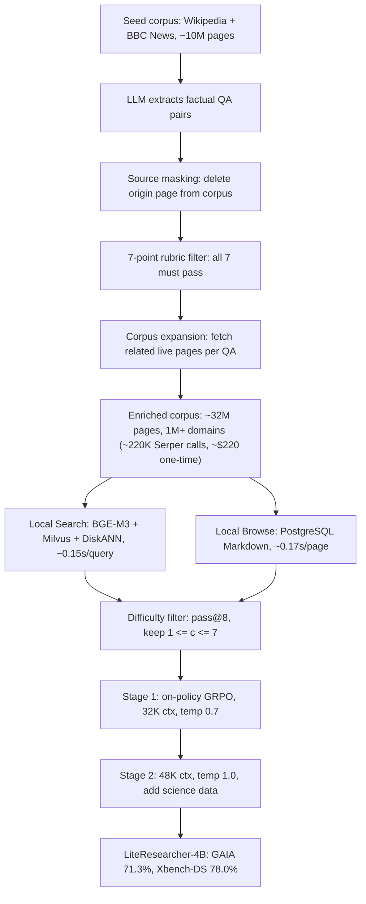

# LiteResearcher: A Scalable Agentic RL Training Framework for Deep Research Agent

- arXiv: https://arxiv.org/abs/2604.17931
- Source: https://arxiv.org/abs/2604.17931
- Project: https://github.com/simplexai-labs/LiteResearcher
- Local PDF: `/Users/luogu/physical_intelligence/papers/rl/LiteResearcher_2604.17931.pdf`
- Year: 2026
- Category: rl
- Priority: high

## 一句话总结

浙江大学 + Simplex AI + 香港理工的 LiteResearcher 论证：deep research 的 agentic RL 扩不动，瓶颈不在 RL 范式本身，而在"手工合成数据引不出真实搜索能力 + 真实联网训练又贵又抖"这一对耦合难题。它构建一个**镜像真实网络结构、执行上完全隔离**的 lite virtual world——约 3,200 万页真实网页语料、本地搜索引擎（约 0.15 s/query）与本地浏览工具（约 0.17 s/page）——配合难度感知课程 RL，让 Qwen3-4B-Thinking 基座在 73.2M 次本地工具调用（线上等价成本 $59K-$243K，本地零边际成本）上稳定训练 700+ 步：LiteResearcher-4B 在 GAIA 71.3%、Xbench-DS 78.0%，均为开源 SOTA，超过 8 倍大的 Tongyi DeepResearch 30B（70.9%/75.0%）与 Claude-4.5-Sonnet（71.2%/66.0%），Xbench 上甚至压过 GPT-5-high（77.8%）。

## 核心技术

1. **原子搜索能力分解**：论文把复杂 deep research 轨迹分解为五种原子能力——Direct Information（直接查到）、Aggregation（多属性定位交集）、Enumeration（枚举计数并集）、Cross-verification（跨源三角验证）、Statistics（数值计算提取指标）——作为数据合成的覆盖目标（Table 1 逐项给了合成样例与 golden path）。
2. **数据与语料共进化管线**：不是先造数据再造环境，而是两者一起长大。从 Seed Corpus（Wikipedia + BBC News，约 1,000 万页）出发，LLM 从网页抽取事实性 QA 对作为种子任务；**Information Source Masking**——把 QA 原始出处页从本地语料中删掉，逼 agent 只能在扩张后的语料里走非平凡搜索路径（自然逼出上述五种原子能力）；每个 QA 过 7 项 LLM 评分规则（独立性、答案具体可验证、无歧义、可回答、非开放题、非过于简单、时间具体性）全过硬才保留；再以每个合格 QA 的 question 为 query 去真实互联网抓相关网页入语料，两轮迭代后语料达约 3,200 万页、100 万+ 域名，只花约 220K 次 Serper API 调用（约 $220，一次性）。
3. **稳定本地工具环境**：页级索引（每页一个向量：标题+摘要）而非 RAG 式 chunk 索引，索引体积缩小约 10 倍，才支撑得起数百并发 rollout。本地搜索引擎用 BGE-M3 单次前向产出 dense（1024 维）+ learned sparse 双信号，Milvus v2.6.0 查询时 RRF 融合，DiskANN + mmap 全磁盘存储，约 0.15 s/query（比在线搜索引擎快约 10 倍）；本地浏览工具把全页 Markdown 存 PostgreSQL（按 URL 键，1,000 并发连接），约 0.17 s/page（比 Jina Reader 快约 46 倍）。
4. **难度感知课程 RL**：对抗训练饱和——每个 RL 阶段前对每条 query 采 $K=8$ 个 rollout（pass@8），只保留正确数 $c$ 满足 $1 \le c \le 7$ 的任务（$c=8$ 平凡无梯度、$c=0$ 不可能或噪声过大，均丢弃）；两阶段课程同步扩难度与上下文长度（Stage 1: 32K 响应上限、温度 0.7；Stage 2: 48K、温度 1.0、混入 science 数据），Stage 2 从 Stage 1 的 ckpt-220 热启动。
5. **严格 on-policy GRPO**：目标函数剥掉 KL 与 entropy 项，只留非对称 clip 的 surrogate loss；每个 rollout batch 只做一次更新即丢弃（对照实现是 256 样本拆 4 个 mini-batch 复用的 off-policy 变体）。rollout 引擎 SGLang（BF16）与训练引擎 FSDP（FP32）之间的分布失配由 TIS（Trajectory Importance Sampling）修正：IS 阈值上/下 2.0/0.5（自动）、token 级聚合、截断模式、veto 阈值 $1 \times 10^{-4}$；框架为 VERL + Ray 编排。
6. **SFT 冷启动**：68,231 条轨迹，主体是自合成数据（52.8%）+ 开源 QA 蒸馏（MiroRL-GenQA/ASearcher/TaskCraft，40.2%）+ 多跳 QA（7.1%）；全部轨迹由 Tongyi DeepResearch 当 teacher 在线上工具下重跑生成（只取开源数据集的 QA 对，不用其原始轨迹），过 7 条过滤规则（答案正确、同工具调用不超 3 次、至少 2 次工具调用、禁 PythonInterpreter、禁编码伪影/`\boxed{}`、工具错误不超 2 次、工具调用前必须有 `<think>`）与 4 步清洗。SFT 后 GAIA 55.58%——离 teacher 自己的 70.9% 还差 15.3 点，为 RL 留出超越空间。

## 底层原理与数学推导

**问题形式化（ReAct 框架）**。深度研究建模为序贯决策：给定初始用户 query $q$，历史为

$$H_t = (q,\ \tau_1,\ a_1,\ o_1,\ \ldots,\ \tau_t,\ a_t,\ o_t)$$

其中 $\tau_i, a_i, o_i$ 分别是第 $i$ 步的思考、动作与观察。每步先采样思考、再在其条件下采样动作：

$$\tau_t \sim \pi_\theta(\cdot \mid H_{t-1}), \qquad a_t \sim \pi_\theta(\cdot \mid H_{t-1},\ \tau_t)$$

动作空间 $\mathcal{A}$ 只有两个原语：`Search(q')` 返回排序的摘要片段与 URL 列表，`Browse(u, q')` 返回页面内容针对 $q'$ 的条件摘要；信息足够后终止交互并给出最终回答。奖励是二值的最终答案正确性（LLM judge 用 Qwen3-30B-A3B-Instruct 做语义等价判定，答案须落在 `<answer>` 标签内）。

**无 KL、无熵正则的 GRPO 目标**。对 query $q$ 采样 $\{o_1, \ldots, o_K\}$，优势 $A_i$ 由组内奖励的均值/标准差归一化得到，目标严格为 clip surrogate loss：

$$J_{\mathrm{GRPO}}(\theta) = \mathbb{E}_{q \sim P(Q),\ \{o_i\}_{i=1}^K \sim \pi_{\theta_{\mathrm{old}}}} \left[ \frac{1}{K} \sum_{i=1}^{K} \min\left( r_i(\theta)\, A_i,\ \mathrm{clip}\big( r_i(\theta),\ 1 - \epsilon_{\mathrm{low}},\ 1 + \epsilon_{\mathrm{high}} \big)\, A_i \right) \right]$$

其中概率比定义在**训练引擎与 rollout 引擎**之间：

$$r_i(\theta) = \frac{\pi_\theta(o_i \mid q)}{\pi_{\theta_{\mathrm{rollout}}}(o_i \mid q)}$$

这个比值有两个失配来源：其一是策略更新本身（由 clip 窗口约束，配合严格 on-policy——batch 用一次就丢，把策略滞后压到最小）；其二是工程性的——SGLang rollout 引擎算 BF16 概率、FSDP 训练引擎算 FP32 概率，TIS 用阈值 $[0.5, 2.0]$ 自动截断 token 级重要性权重（超阈值即截断、超过 veto 阈值 $1 \times 10^{-4}$ 直接否决该样本），把引擎间数值失配从梯度里滤掉。

**难度过滤的学习信号论证**。保留条件 $1 \le c \le 7$ 是对组相对优势方差的结构性保证：$c=8$ 时组内奖励全为同一值，$A_i$ 全零、梯度为零；$c=0$ 时要么任务不可解要么信号被噪声主导。配合"语料每扩一轮、QA 重新过滤一轮"的数据引擎，可解题池随策略增长而持续补充——这是两阶段课程能突破单阶段平台（64.7% → 68.3%）的数据侧前提。

**训练全景数据流**：

## 物理直觉解释

**先修一座镜像城市，再在里面练车**。直接在真实互联网上做 RL（DeepResearcher、WebExplorer-RL 一类 online RL）相当于让新手直接上真实街道练车：红绿灯会突然坏（网页改版/反爬）、路况随机（搜索结果非确定）、油钱惊人（每次 search 都要真金白银）。LiteResearcher 的"twin architecture"是先按真实城市的结构修一座镜像城——页还是那些真实网页（结构镜像），但执行完全隔离可控（信号灯自己控制）。论文的赌注是：只要镜像城的**结构**够像（语料多样性、搜索动态一致），城里练出的车技就能迁移到真路——评测时全部换回线上 Serper + Jina API，GAIA 71.3% 就是迁移考试的成绩单。

**养殖场与远洋捕捞的经济学**。一次完整 RL 要 45.8M 次 search + 27.4M 次 browse，按线上定价是 $45,802（Serper）到 $229,012（SerpAPI）加 $13,709（Jina Reader），总计 $59K-$243K——这笔钱不是一次性投入而是随训练步数线性增长，等于"每学一条鱼都要出海"。本地环境的养殖场模式前期只花 $220 捞 2,200 万页苗种入塘，之后每条鱼边际成本为零，且 10-46 倍的延迟优势直接换算成 rollout 吞吐——论文强调这不是优化项而是 on-policy agentic RL 的**前提条件**：没有这个吞吐，每 query 8 rollouts x 全局 batch 128 的采样强度根本跑不起来。

**隔离培养皿为什么让训练曲线变直**。AgentCPM-Explore-4B（同期在线训练的 4B 对照）在 GAIA 上 RL 相对 SFT 只涨 3.8 点，原因是线上环境的奖励噪声：同一 query 今天能查到明天查不到，梯度信号被环境随机性淹没。LiteResearcher 的本地环境是确定性的——同一 query 永远返回同一结果——于是奖励曲线纯粹反映策略变化，723 步训练单调上升，没有环境噪声制造的假梯度。这和 coding agent 社区用隔离沙箱滤掉基建噪声是同一个原理：**RL 要的不是环境"真实"，而是环境"可信"**——真实感由数据侧（真实网页、真实分布）提供，可信性由执行侧（隔离、确定性）提供。

**爬楼梯课程：只踩一步能够到的台阶**。单阶段 RL 的饱和不是 RL 失效，而是解题池耗尽：模型会的题全对（零梯度）、不会的题全错（也无有效梯度），卡在中间平台。LiteResearcher 的难度过滤是每阶段把台阶重新校准到"跳一跳够得着"：pass@8 落在 1-7 之间的题保留，模型每爬升一层，重新过滤出的题池就整体上移一层。Stage 1 在 64.7% 平台化后换入 Stage 2 数据（加 science、扩上下文、升温度），立刻续涨到 68.3%——平台是数据的属性，不是算法的属性。

## 工程细节与实操指南

- **语料扩张账本**（Table 6）：初始约 1,000 万页（Wikipedia + 缓存网页，零 API 成本）→ 迭代 1 后约 2,100 万页（+约 1,100 万，约 110K Serper 调用）→ 迭代 2 后约 3,200 万页（再 +约 1,100 万，约 110K 调用）；总计约 220K 次调用约 $220。每页过 URL 级 + content-hash 去重、HTML 转 Markdown、最短 1,000 字符过滤；抓到的页同步进 Milvus 索引与 PostgreSQL，立即对 rollout 和下一轮 QA 合成可用。最终语料 18 个域名类目、100 万+ 域名（学术 16.2%、区域 13.4%、百科 12.6% 为前三）。
- **本地检索基建参数**（Table 12）：Milvus v2.6.0 standalone（MinIO + etcd），DiskANN 的 MaxDegree=64、SearchListSize=128，搜索缓存预算比 0.9（约 200 GB 主机内存做 search cache）；PostgreSQL 端 `max_connections=1000`、`shared_buffers=1GB`、`effective_cache_size=4GB`、`work_mem=4MB`（为 1K 并发封顶）、NFS-backed NAS + URL B-tree 索引。
- **RL 配置**（Table 11）：GRPO 严格 on-policy（mini-batch = 全局 batch = 128 queries），每 query 8 rollouts，lr $1 \times 10^{-6}$ 恒定，无 KL/无熵项，loss 聚合 token-mean 与 sequence-mean；max prompt 1,024；max response 32K（Stage 1）→ 48K（Stage 2）；温度 0.7 → 1.0，top-p 0.95；最大 assistant 轮数 40 → 60；TIS：IS 阈值 2.0/0.5（自动）、token 级/截断、veto $1 \times 10^{-4}$。RL 阶段 GPU 数量与训练时长未在论文中报告（待确认：仅 SFT 阶段注明 8xH100，RL 硬件配置需查开源代码）。
- **SFT 配置**：LLaMA-Factory 全参数微调，Qwen3 thinking 模板（`enable_thinking=true`），最大序列 64K（覆盖 100% 样本：均值 12.4K、中位 10.2K token，轮数均值 8.7、中位 7），lr $2 \times 10^{-5}$ cosine + 10% warmup，1 epoch，8xH100 + DeepSpeed ZeRO-2 + Flash Attention 2 + Liger Kernel，有效 batch $2 \times 8 \times 8 = 128$。
- **RL 数据配比**（Table 10，难度过滤后）：Stage 1 共 10,398 条 = 自合成 7,634（73.4%）+ 多跳 2,764（26.6%）；Stage 2 共 16,199 条 = 自合成 11,101（68.6%）+ 多跳 3,298（20.3%）+ science 1,800（11.1%）。
- **多跳 QA 合成**（附录 A.3）：从种子实体建知识图（$N_{\max}=8$ 节点，每实体 $K_{\mathrm{feat}}=2$ 个事实特征、扩展 $K_{\mathrm{ent}}=2$ 个新实体，排除通用概念与媒体源），BFS 采 6 节点连通子图（加 Uniform(0, 0.5) 扰动），反向生成约束式问题（边转含糊指称，如 "a late antique writer"），产出需 3-5 跳推理的信息极小问题。
- **评测协议**：8 个基准（GAIA-Text、BrowseComp、BrowseComp-ZH、HLE、Frames、WebWalker、Seal-0、Xbench-DeepSearch-2505），评测用线上 API（Serper 搜索 + Jina 浏览），与 prior work 同工具配置；BrowseComp 随机抽 400 例。128K 上下文为默认配置；带 `*` 的结果（BrowseComp 27.5%、Browse-ZH 32.5%）用 64K 上下文 + 记忆机制（到顶后调摘要模型把每个历史工具交互压成一句）。
- **实操要点**：GAIA-Text 是论文使用的列名，与完整 GAIA 基准（含多模态样本）的关系文中未明确说明（待确认：是否为纯文本子集需对照 benchmark 官方定义）；Fig. 4 图内标注 +3.5% 而正文写 +3.6%（68.3 - 64.7 = 3.6），引用时以正文为准。

## 消融实验与分析

**主结果**（Table 2，默认 128K 上下文；LiteResearcher 全部 8 项超过同期 4B 在线训练对照 AgentCPM-Explore）：

| 模型（规模） | GAIA-Text | Xbench-DS | BrowseComp | HLE | Frames |
|------|------|------|------|------|------|
| LiteResearcher-4B | 71.3% | 78.0% | 27.5%* | 22.0% | 83.1% |
| Tongyi DeepResearch 30B | 70.9% | 75.0% | 43.4% | 32.9% | 90.6% |
| Claude-4.5-Sonnet | 71.2% | 66.0% | 19.6% | 24.5% | 85.0% |
| AgentCPM-Explore-4B | 63.9% | 70.0% | 24.1% | 19.1% | 82.7% |
| GPT-5-high | 76.4% | 77.8% | 54.9% | 35.2% | - |

**核心结论：** 4B 模型在 GAIA-Text 追平 Claude-4.5-Sonnet、在 Xbench-DS 超过 GPT-5-high，而在 BrowseComp/HLE 这类需要超深浏览链或纯参数推理的基准上仍与 30B 级和闭源旗舰有明显差距——数据-环境瓶颈能换来的提升有边界，长上下文利用是小模型的关键短板（BrowseComp 无记忆机制只有 20.3%，加 64K + 记忆机制才到 27.5%）。

**训练配方消融**（除主表外论文给出的四组对照，基准为 GAIA / Xbench-DS）：

| 消融维度 | 配置 A | 配置 B | 差值 |
|------|------|------|------|
| on-policy vs off-policy | 严格 on-policy：GAIA 68.9% | 256 拆 4 mini-batch 复用：66.8% | +2.1 |
| 自合成数据 | 自合成 + 多跳：66.8% / 71.0% | 仅多跳：58.7% / 66.3% | +8.1 / +4.7 |
| 两阶段课程 | Stage 1 平台：64.7% | 加 Stage 2：68.3% | +3.6 |
| RL 相对 SFT | SFT 后：55.58%（差 teacher 15.3） | RL 后：71.3%（超 teacher 0.4） | +15.7 |

**核心结论：** 四组消融分别支撑四个设计决策——长时程 agentic 轨迹对 off-policy 更新特别敏感（同批数据多次更新积累策略滞后，reward 先升后崩）、自合成数据的多样性收益大于手工多跳逻辑的精细度、训练饱和靠换数据分布突破而不是换算法、性能主驱动是 RL 框架而非 teacher 蒸馏（SFT 单独用连 teacher 都追不上）。

**RL 行为修正曲线**（Figure 8，420 步，无任何长度/重复惩罚）：

| 指标 | 训练前（约） | 训练后（约） | 变化 |
|------|------|------|------|
| Mean reward | 0.42 | 0.70 | +0.28 |
| 平均响应长度 | 18K token | 12K token | -33% |
| 平均交互轮数 | 30 | 24 | -6 轮 |
| 长度截断比例 | 0.28 | 0.02 | -0.26 |

**核心结论：** SFT 阶段的主导失败模式（同一 query 反复重搜、重复访问同一 URL）被纯 outcome 奖励 + GRPO clip 自然消除——响应变短、轮数变少、截断率坍缩，模型把 token 预算从无效重复转移到更多页面阅读（browse 调用近线性增长）与更高搜索并发（每次批量发多 query）上；训练 rollout 与 held-out GAIA 评测四项行为曲线全程 lock-step，说明学到的是可迁移能力而非对本地环境的过拟合。

## 技术权衡（Trade-off）

| 优势 | 劣势与工程代价 |
|------|---------------|
| 零边际成本 + 确定性环境让 on-policy RL 能以每 query 8 rollouts 的强度稳定跑 700+ 步 | 镜像世界的泛化性依赖"结构镜像"假设：评测仍需线上 API，训练分布被 32M 页语料的覆盖面框死，语料外的搜索动态（如实时性强的新闻检索）无法练 |
| 页级索引（每页 1 向量）支撑数百并发、约 0.15 s/query | 检索保真度让位于吞吐：chunk 级语义细节被压缩进标题+摘要，错误定位只能靠 Browse 全文兜底 |
| 二值 outcome 奖励 + 确定性判定 = 无噪声梯度，无需 PRM | 无过程信号：多跳题答对但路径低效时没有奖励区分，credit assignment 粒度止步于最终答案（对照 dataprm 一类过程奖励方向） |
| SFT 冷启动借 teacher 轨迹快速学会工具使用 | 行为先验被 Tongyi DeepResearch 框定，RL 的起点不是白纸；重复动作等 SFT 缺陷需要 RL 额外修正（约 0.28 → 0.02 的截断率就是补课成本） |
| 4B 模型训练与部署成本低 | 128K 上下文在 BrowseComp 级深度浏览（常超 20 页/query）下不够用，要外挂记忆机制补，且仍显著落后 30B 级（27.5% vs 43.4%） |
| 课程数据无限（合成引擎可持续产新 QA） | QA 质量靠 7 项 LLM 规则过滤，规则自身的偏差（LLM judge 用 Qwen3-30B-A3B 判奖励）构成隐性的奖励模型上界 |

## 技术价值与演进定位

LiteResearcher 最大的贡献不是那个 4B SOTA 数字，而是一个归因反转：它把此前 deep research agentic RL 的"训练饱和"从算法问题重新定性为环境问题——prior work 的奖励曲线走平，是因为高方差的真实环境或过窄的本地语料切断了学习梯度，而不是 RL 范式的能力上限。它给出的解法是一套可复用的配方：**真实数据供分布、隔离执行供稳定性、课程过滤供梯度**，三者缺一不可。这个配方与 coding agent 社区的沙箱实践（LEGO-RL 一类）在结构上同构，但把"沙箱"从代码执行环境换成了检索环境——说明"镜像真实 + 隔离执行"正在成为 agentic RL 各应用域的共同基础设施模式。对库内研究谱系而言，它还是"teacher 恭候、RL 超越"的干净案例：SFT 后距 teacher 15.3 点，RL 后反超 0.4 点，为"蒸馏封顶、RL 破顶"提供了 4B 尺度的证据。局限在于它的确定性环境本质上把非平稳性排除在训练之外，而真实 deep research 恰恰要面对信息过期、来源消失——虚拟世界里学到的策略对非平稳性的鲁棒性仍靠评测侧间接检验；此外 BrowseComp 27.5% 与 30B 级 43.4% 的差距提示小模型 + 本地环境的路线在超长程任务上还有硬骨头。

## 与其他论文的关系

- **Tongyi DeepResearch**（notes/rl/tongyi-deepresearch.md）— 双重关系：既是 LiteResearcher 的 SFT teacher（68,231 条轨迹全部由它在在线工具下重跑生成），又是主要开源对手（4B 对 30B：GAIA 71.3% vs 70.9%、Xbench 78.0% vs 75.0%）——"用你冷启动、再在成绩单上超过你"。
- **LEGO-RL**（notes/rl/lego-rl.md）— 配方同构的跨域对照：coding agent 用沙箱镜像生产环境滤基建噪声，LiteResearcher 用 32M 页本地语料镜像真实网络滤环境噪声，两者共同确立"确定性执行 + 真实分布"的 agentic RL 训练前提。
- **AgentCPM-Explore**（arXiv 2602.06485，同期工作）— 环境路线的直接反例：同为 4B 且在线联网训练，RL 相对 SFT 只涨 3.8 点且全 8 项基准落后 LiteResearcher（GAIA 63.9% vs 71.3%），论文用它论证在线环境的奖励噪声不可接受。
- **ZeroSearch**（arXiv 2505.04578 引用关系见原文参考文献）— 环境模拟的另一极：用 LLM 生成搜索引擎输出，牺牲页级保真度；LiteResearcher 选择真实网页本地化，保真度与确定性的折中点不同。
- **ragen-2**（算法线，notes/rl/ragen-2.md）— 互补视角：ragen-2 从算法侧研究 agentic RL 的推理崩塌，LiteResearcher 从环境侧论证饱和根源在数据与环境，两者合起来才构成"为什么 agentic RL 训不稳"的完整答案。
- **harness-1 / arlarena**（训练系统线）— harness-1 的状态外置 harness 与 arlarena 的稳定性框架都在系统层为 agentic RL 降噪；LiteResearcher 表明降噪可以在环境层一次性完成，三者是同一目标的不同实现高度。
- **g2po / reasoning-to-agentic**（算法线）— 它们处理长时程 credit assignment 的算法改进；本文用严格 on-policy + TIS 截断把失配压到最小，是同一问题（策略滞后）的工程化处理。
- **dataprm**（应用线）— 本文的二值 outcome 奖励刻意保持信号干净，多跳路径的效率无奖励区分；dataprm 的过程级奖励建模是给本地确定性环境加过程信号的自然下一步。
- **tool-r0 / openclaw-rl**（应用线）— tool-r0 的自进化工具学习与 OpenClaw-RL 的真实 agentic 场景训练都依赖可控环境供给训练信号，LiteResearcher 的"数据-语料共进化"引擎为它们提供了数据侧的参照实现。

## 精读问题

1. "结构镜像"假设的适用边界在哪里：本地语料的搜索动态（排序、覆盖、快照时效）与真实引擎的偏差，会在哪类任务上系统性放大——是实时性强的任务、还是需要枚举长尾来源的任务？评测端 8 项基准是否恰好避开了语料覆盖最弱的区域？
2. 严格 on-policy（batch 用一次即弃）比 off-policy 高 2.1 点，但每条 rollout 只贡献一次梯度——若把 replay 与 TIS 截断结合（如 off-policy 但对所有过期 token 加权），是否存在介于两者之间的最优更新次数？论文的 4 mini-batch 设定是否本身过于激进？
3. 难度过滤条件 $1 \le c \le 7$ 用 pass@8 的绝对正确数校准难度，但它无法区分"7/8 靠蒙对"与"4/8 稳定部分掌握"——按组内方差或答案一致性加权筛选，课程效率还能再提升多少？
4. 二值奖励下模型自发消除了重复动作（截断率 0.28 → 0.02），这一修正的驱动力是 GRPO 的组内比较还是 clip 机制——若换成不做组归一化的 REINFORCE 变体，重复抑制是否依然出现？
5. SFT teacher（Tongyi DeepResearch）的轨迹先验与 RL 后策略的关系值得量化：RL +15.7 点的增益中，有多少来自在 teacher 行为流形内的强化、有多少来自探索出 teacher 从未展示过的搜索模式（如 BrowseComp 案例里第 113 轮"改抓最罕见线索"的 pivot 策略）？
