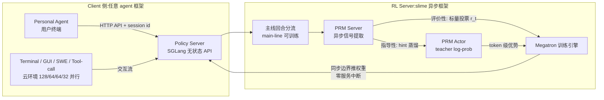

# OpenClaw-RL: Train Any Agent Simply by Talking

- arXiv: https://arxiv.org/abs/2603.10165
- Source: https://arxiv.org/abs/2603.10165
- Project: https://github.com/Gen-Verse/OpenClaw-RL
- Local PDF: `/Users/luogu/physical_intelligence/papers/rl/OpenClawRL_2603.10165.pdf`
- Year: 2026
- Category: rl
- Priority: high

## 一句话总结

把 agent 每次交互自然产生的**下一状态信号**（next-state signal：用户回复、工具输出、终端或 GUI 状态变化）就地转化为两类互补训练信号——评价性（标量 PRM 投票）与指导性（token 级 hint 蒸馏）——通过 server-client 异步架构实现**部署中在线学习**：agent 被使用就在变强，联合优化下约 10.3 个会话即可对齐用户偏好。

## 核心技术

1. **Server-Client 架构**：RL server 把策略挂在一个无状态 completion API 后面；用户终端（个人设备或云环境）通过 HTTP 查询并把交互数据流回。任何能发 API 请求的 agent 框架都是数据源，框架可以随时换、工具可以随时变，server 无需重配。
2. **主线/侧线分流（main-line vs side turn）**：每个 API 请求被分类为主线回合（可训练样本：主响应 + 工具执行结果）或侧线回合（记忆整理、辅助查询，只转发不训练）；session id 支持多用户并发流的解复用。
3. **四组件完全解耦异步**：policy serving、environment hosting、PRM judging、policy training 四个环各自独立跑——PRM 可以用更强的模型、可以多次投票，都不影响用户侧延迟；权重在明确的同步边界推给 serving 引擎，**零服务中断**。
4. **双信号提取**：给定 $(a_t, s_{t+1})$，PRM 产出（a）评价性信号 $r_t \in \{+1,-1,0\}$（m 次多数投票）；（b）当下一状态含有可提取的修正时，蒸馏成 `[HINT_START]...[HINT_END]` 包裹的 hint——"你应该先检查那个文件"这种话既是"错了"也是"该怎么改"。
5. **混合 RL 目标**：$\mathcal{L}^{hybrid}_i = w_{RL}\mathcal{L}^{GRPO}_i + w_{OPD}\mathcal{L}^{OPD}_i$，标量优势与 token 级蒸馏梯度进同一次更新。
6. **Overlap 引导的 hint 选择 + log-prob 差裁剪**：在 M 个候选 hint 里选使 teacher top-k 与 student top-k 重叠最大的那个，再加 $\Delta_v$ 裁剪，把 off-policy 比率锁在 1 附近。
7. **长程步级奖励**：通用 agent 设定下用 $o + \sum_i r_i/m$ 把结果奖励与步级 PRM 奖励相加，同 step index 的动作分组标准化。

## 底层原理与数学推导

**多回合策略梯度分解**。K 回合轨迹 $\tau$ 被切成单回合样本，每回合内仍是标准 PPO 式代理目标，但蒸馏分支替换了奖励来源：

$$
\mathcal{L}^{OPD}_i = \sum_{v \in S_i} \max\left(-A_v \rho_v,\; -A_v \, \mathrm{clip}(\rho_v, 1-\varepsilon_{lo}, 1+\varepsilon_{hi})\right)
$$

其中每个 vocabulary 项 $v$ 的优势由 teacher-student 的 log-prob 差构造：

$$
A_v = \Delta_v \cdot w_v, \quad \Delta_v = \mathrm{clip}\left(\ell_{T,h^\star}(v) - \ell_{old}(v), -C, +C\right), \quad w_v = \mathrm{softmax}_{v \in S_i}\left(\ell_{old}(v)\right)
$$

$\rho_v = \exp(\ell_{cur}(v) - \ell_{old}(v))$ 是逐步重要性比率。直觉拆解：$\Delta_v$ 给方向（teacher 比 student 更信 $v$ 多少），$w_v$ 把梯度集中到 student 本来就可能采样的 token 上，clip 截断尾部。

**Overlap 选择准则**。定义学生第 $i$ 位的 top-k 词表 $S^q_i = \mathrm{top}\text{-}k\{\pi_{old}(\cdot|s_t, y_{<i})\}$ 与 hint 条件下教师的 $S^p_{i,h}$，重叠信号 $O[h,i] = |S^q_i \cap S^p_{i,h}|$。序列级选 $\arg\max_h \sum_i O[h,i]$，token 级选 $\arg\max_h O[h,i]$。**为什么 overlap 有效**：OPD 损失在数学上恰是 token 级 KL（附录 C 证明 $\mathcal{L}^{OPD} = \sum_i \mathrm{KL}[\pi_T(\cdot|x_h, y_{<i}) \| \pi_\theta(\cdot|x, y_{<i})]$，固定前缀逐位监督），所以 hint 的作用是移动每个位置的下一 token 分布——**选择 hint 就应该按它引起的分布位移在学生的高密度区是否平滑来选**，而不是看 hint 长度或教师置信度这类表面启发式。

**评价性分支**在单样本实时场景退化为 $A^{grpo}_t = r_t$（每个 prompt 只有一条响应，无组可比），PRM 输出 $\{+1,-1,0\}$。

**步级奖励整合**：第 $t$ 步奖励取 $o + \frac{1}{m}\sum_{i=1}^m r_i$，不同任务同一 step index 的动作分到一组做标准化——真实环境（如终端）状态不易聚类，按 step index 直接分组是有效近似。

## 物理直觉解释

**下一状态是免费的裁判**。传统 RLHF 需要专门造标注或训 reward model；这篇的洞察是交互流里**每个动作后面天然跟着一个反应**——用户重新提问就是"不满意"，通过的测试就是"成功"，报错的 traceback 就是"失败且错在 37 行"。这像餐厅不需要顾客填问卷：顾客是否把菜吃完、是否要求重做，本身就是评分。评价性信号是"打分"，指导性信号是"顾客顺手教你做法"——一句话 hint 让教师（同一模型 + hint 条件）在 token 级上指出"该往哪改"。

**为什么混合两者**。评价性信号**密**（每回合都有分）但**薄**（一整个回合压成一个标量）；指导性信号**厚**（$|S_i|$ 个 log-prob 差）但**稀**（不是每个下一状态都带修正）。单独用 GRPO 是拿稠密但低信息量的信号慢爬，单独用 OPD 是拿高信息量信号但大部分回合没得学。混合目标让两类信号在同一条轨迹上互补填洞——这解释了消融里 OPD 单独用要 29.7 个会话而混合只要 10.3。

**Overlap 选择像"换教练"而不是"换学科"**。蒸馏崩坏的根源是 teacher-student 分布错配：教师把概率质量放在学生近乎零密度的 token 上，重要性比率爆炸。同一个模型加不同 hint 就能得到不同教师——选 overlap 最大的 hint 等于**挑一个"跟你想法最接近但恰好知道正确方向"的教练**，学生始终在自己的高密度区内被推向教师，而不是被拽去陌生词表。$\Delta$ clip 则是给每次纠正的力度封顶：论文实测同一响应在有无 hint 条件下的逐 token log-prob 差可以极端到 ±16（symlog 图上离群点密布），不封顶就是让最尖锐的那次纠正主导整个 batch。

**在线学习 vs 记忆外挂**。Mem0/Cognee 这类记忆/技能演化方法把经验存成上下文，推理时背越来越多 token；OpenClaw-RL 只改权重，边际成本为零。类比：一个是随身携带越写越厚的笔记本，一个是把经验练进肌肉记忆。

## 工程细节与实操指南

- **硬件配比（个人 agent 场景，8 GPU）**：policy actor 4 卡（Megatron 训练）、policy server 2 卡（SGLang 推理）、PRM actor 1 卡（教师 log-prob 计算）、PRM server 1 卡（信号提取）。
- **个人 RL 超参**：Qwen3-4B-Thinking-2507 做 policy 与 reward；lr $1\times10^{-5}$，$C=1$，$k=4$，每样本生成 3 个候选 hint，攒 16 个样本触发一次异步训练；Adam。
- **通用 agent RL 超参**：lr $1\times10^{-6}$ 常数衰减，KL 系数 0.01（k3 估计器），clip $\varepsilon/\varepsilon_{hi}=0.2/0.28$（非对称 PPO），max response 8192，max context 16384；batch 8（GUI/SWE）、16（terminal）、32（tool-call），每任务 8 rollouts；最大交互步 30/20/10（GUI/SWE/terminal）。
- **并行环境规模**：terminal 128、GUI/SWE 64、tool-call 32 个云托管环境；通用 RL 扩展里 $C=2$、hint 预算 3、AIME 评估 20 次独立运行取平均。
- **PRM 提示词设计要点**（附录 A.7 全文给出）：评价性 prompt 明确"修改请求就是负反馈，不要当成中性新指令"；hint 提取 prompt 强制"hint 不得引用/复述下一状态内容、不得包含答案数字、单句、抽象"——防泄漏是硬约束，违规宁可不输出 hint。
- **复现入口**：基于 slime 异步框架（THUDM），开源在 Gen-Verse/OpenClaw-RL。
- **评测协议**：三个模拟用户（student/TA/teacher，Qwen3-32B 扮演，GSM8K 任务，session 上限 72）；判定"已对齐"= 首条硬编码消息（不含偏好信息）的响应连续 3 个会话满足偏好。

## 消融实验与分析

**表 A｜个人 agent 优化效率（达到对齐所需最少会话数，5 次试验均值，越低越好）**

| 方法 | Student | TA | Teacher | 平均（joint） | 平均（separate） |
|------|---------|-----|---------|--------------|-----------------|
| Hybrid RL（本文） | 11.6 | 8.2 | 11.4 | **10.3** | **15.0** |
| GRPO | 15.4 | 12.0 | 14.8 | 14.1 | 21.1 |
| OPD | 30.8 | 34.0 | 24.4 | 29.7 | 29.4 |
| Mem0 | 13.6 | 15.8 | 14.2 | 14.5 | 15.1 |
| Cognee | 14.6 | 15.4 | 14.8 | 14.9 | 15.1 |

**核心结论**：(1) 混合目标比单独 GRPO 快 27%（10.3 vs 14.1），OPD 单独用最慢（29.7）——稀疏的指导信号撑不起独立训练；(2) 记忆/技能演化基线（Mem0/Cognee）与 GRPO 相当但推理时带上下文开销；(3) joint 优化下混合 RL 从 15.0 提到 10.3，而 Mem0/Cognee 几乎不受益——三类用户偏好对策略模型是内在耦合的。

**表 B｜hint 选择策略（Qwen3-32B，joint，会话数）**

| 策略 | Student | TA | Teacher | 平均 |
|------|---------|-----|---------|------|
| sequence-optimal | 14.0 | 9.6 | 13.8 | **12.5** |
| token-optimal | 13.8 | 10.0 | 13.4 | 12.4 |
| random | 18.6 | 12.6 | 17.0 | 16.1 |
| GRPO（无 hint） | 17.2 | 12.0 | 18.2 | 15.8 |
| OPD（随机 hint） | 34.4 | 29.8 | 25.6 | 29.9 |

**核心结论**：随机选 hint 比不选（纯 GRPO）还差的方向性证据在 OPD 行——低质量 hint 把教师拉离学生，训练更不稳定；两种 overlap 最优选法性能相当，sequence 级在大 batch 下更稳。

**表 C｜top-k 宽度与支撑集（joint，会话数）**

| 支撑集 | k=2 | k=4 | k=8 | k=20 |
|--------|-----|-----|-----|------|
| $S_i=S^q_i$（student top-k） | 20.2 | **10.3** | 10.1 | 9.8 |
| $S_i=S^q_i\cap S^p_{i,h^\star}$（overlap） | 31.0 | 21.3 | — | — |

**核心结论**：k≤4 时增大 k 提升明显，k≥4 后饱和（10.3→10.1→9.8）；用 overlap 做支撑集省算力但性能下降（21.3 vs 10.3）；token 级 OPD（k=1 退化情形）大幅劣化。

**其他定量结果**：步级奖励整合在 tool-call/GUI 上 0.25/0.33 vs outcome-only 0.19/0.31；裁剪 vs 不裁剪的截断率 0.2 vs 0.5（不裁剪时自蒸馏激进更新导致响应长度持续膨胀）；PRM 用 Qwen3-8B 替换 4B-Thinking 性能几乎不变（12.3 vs 12.5）。

## 技术权衡（Trade-off）

| 优势 | 劣势与工程代价 |
|------|---------------|
| 部署数据直接变训练信号，无采集阶段 | PRM 本身的质量决定上限——坏裁判会把模型带偏 |
| 零服务中断，四组件异步解耦 | 四服务（actor/server/PRM actor/PRM server）运维复杂度 |
| 混合目标同时吃稠密标量与稀疏 token 级信号 | 每回合 3 个候选 hint × M 次教师前向，蒸馏分支计算翻倍 |
| 权重更新边际成本为零（对比记忆外挂） | 在线更新带来安全面：恶意/误导性用户反馈可直接污染权重（论文自认挑战一） |
| 统一 terminal/GUI/SWE/tool-call 四类环境 | 个性化模型记忆用户隐私，成为攻击目标（论文自认挑战二） |
| overlap 选择 + 双重 clip 保证稳定 | 序列级 hint 选择需要全轨迹教师前向，长轨迹开销不小 |

## 技术价值与演进定位

在「agentic RL 训练系统」子线里，OpenClaw-RL 占据一个此前空缺的位置：**从 live 部署流学习**。Polar/LiteResearcher/ARLArena 都还在"云端 batch rollout + 训练"的离线范式内，OpenClaw-RL 是第一个把 RL server 做成 API 背后的常驻服务、让个人终端的日常使用直接产生梯度的开源框架。方法层面它的贡献是把 on-policy distillation 从固定数据集搬到在线流，并用 overlap-guided hint 选择解决了教师-学生错配这个已知的失稳根源——这个准则对任何 hint 条件蒸馏场景通用。对机器人侧的启示是直接的：机器人每天部署产生的下一状态信号（人机协作中的纠错、任务成败的环境反馈）同样是免费裁判，ENPIRE 的 reset-execute-verify-refine 闭环本质上是这个思路的 LLM-agent 版本。局限也要看清：所有实验的策略模型 ≤8B，偏好对齐任务较浅（风格/格式层面），对抗性反馈的过滤只以"未来工作"形式承认。

## 与其他论文的关系

- **vs Mem0/Cognee（记忆与技能演化）**：同目标（从使用中改进 agent）不同层面——它们把经验外挂为上下文，推理开销随经验增长；OpenClaw-RL 内化为权重。效率上混合 RL 10.3 vs 14.5 会话。
- **vs Buening et al. 2026（用户交互对齐，concurrent）**：同样利用下一状态，但对方把纠正信息隐式留在 prompt 里，本文显式抽成 token 级训练信号。
- **vs G2PO/GiGPO（多回合信用分配）**：正交——那两篇改优势估计的分组结构，本文改信号来源（标量+token 级）与在线性；OpenClaw-RL 的按 step-index 分组标准化是 GIGPO 状态聚类的廉价替代。
- **vs ARLArena/SAMPO（稳定性）**：ARLArena 发现崩溃主因是低 IS 比率的负优势序列，OpenClaw-RL 的 overlap 选择从源头（选不会拉爆比率的 hint）预防同一问题，$\Delta$ clip 与其 sequence masking 是同一病灶的两种药。
- **vs RAGEN-2（崩溃分析）**：RAGEN-2 用 MI proxy 判 collapse 前兆，本文用 log-prob 差分布（±16 的极端值）直接论证 clip 必要性——诊断手段互补。
- **vs RLAnything**：步级 PRM 信号整合（$o+\sum r_i/m$）直接沿用其结论，本文把它扩展到在线异构流。
- **vs ENPIRE（机器人侧对应物）**：ENPIRE 在真机闭环里用人类干预当信号，OpenClaw-RL 在纯软件 agent 里用用户回复当信号——"next state 是免费监督"这一范式在两个世界的平行出现值得对比阅读。

## 精读问题

1. overlap 选择准则依赖"同一模型 + hint 即教师"这个设定（自蒸馏）；换一个异构强教师时，top-k overlap 是否仍是正确的选择信号，还是应该改为分布距离（如 token 级 KL 本身）？
2. 评价性信号的 PRM 投票在单响应场景退化为 $r_t$ 直接当优势，方差极大——引入跨 session 的组基线（同任务历史响应分组）能否进一步加速对齐，会不会引入非平稳性？
3. 论文承认恶意反馈可污染权重：能否把 ARLArena 的 e-process/sequence masking 思想搬来做在线反馈的统计过滤，在不伤学习信号的前提下拦截对抗样本？
4. hint 泄漏约束全靠 prompt 硬规则（"不得包含答案数字"），RLVR 设定里 PRM 看得到 ground truth——这个约束在多轮优化下会不会被逐步侵蚀，需不需要形式化的信息论检验？
5. 机器人迁移：把"用户重新提问"换成"人扶了一下机械臂"，这套 evaluative+directive 双信号框架在 contact-rich 操作里的最小改造是什么，ENPIRE 的干预数据能否直接喂进 OPD 分支？
