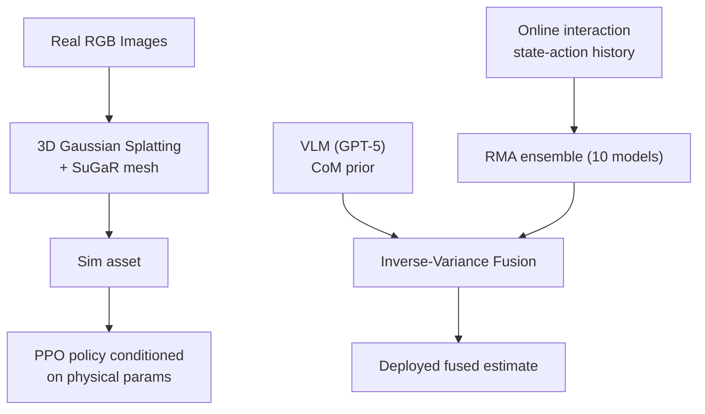

# Phys2Real: VLM Priors + Uncertainty-Aware Sim2Real

- 本地 PDF：`papers/rl/Phys2Real_2602.09485.pdf`（**注意：该 PDF 内容不匹配本论文**，实为 XMCC 多模态 CoT 压缩论文，属下载错配；待确认：正确 PDF 需从 arXiv 2510.11689 重新获取）
- arXiv：https://arxiv.org/abs/2510.11689
- 年份：2025 (ICRA 2026)
- 团队：Stanford MSL (Maggie Wang, Stephen Tian, Aiden Swann, Ola Shorinwa, Jiajun Wu, Mac Schwager)
- 阶段：VLM 估计物理参数 → RL 策略条件化 → 在线适应（real-to-sim-to-real）

## 一句话总结

Phys2Real 提出 Real-to-Sim-to-Real 三阶段管道：3D Gaussian Splatting 重建真实场景，VLM 从 RGB 图像估计物理参数先验（如质心 CoM），RL 策略以物理参数为条件训练（PPO），部署时用逆方差加权融合 VLM 先验与交互式在线估计。在最具挑战的 top-weighted T-block 任务上 57.14% vs domain randomization 23%，消融显示 VLM-only 仅 4.76%、RMA-only 仅 14.29%，两者缺一不可。核心公式：$\hat{\theta} = (\theta_{vlm}/\sigma_{vlm}^2 + \theta_{rma}/\sigma_{rma}^2) / (1/\sigma_{vlm}^2 + 1/\sigma_{rma}^2)$。

## 核心技术

1. **VLM 物理参数先验** — GPT-5 对每个视角每张图查询 M 次，聚合均值作为 $\theta_{vlm}$，模型自报不确定度的均值作为 $\sigma_{vlm}$（经验上自报不确定度比估计值标准差更可靠，因为 VLM 可能"自信地错"）
2. **以可解释物理参数为条件的 RL 策略** — 与标准 RMA 学 latent 向量不同，策略直接条件化在 CoM 等物理参数上（PPO + asymmetric actor-critic + IsaacLab），三阶段训练：Phase 1 用 GT 参数、Phase 1.5 用带噪参数微调（高斯噪声 σ=1.5cm）增强鲁棒性、Phase 2 冻结策略训练 10 个 adaptation model 的 ensemble
3. **不确定性感知融合** — 逆方差加权：接触开始时交互估计不确定度下降、融合值收敛到真值；接触结束不确定度回升、系统回退到 VLM 先验
4. **Real-to-Sim 重建** — SAM-2 分割 + 3D Gaussian Splatting + SuGaR 网格提取，生成仿真可用资产

## 底层原理与数学推导

不确定性分解：ensemble 方差捕获**认知不确定性（epistemic）**，各成员用 Gaussian NLL 训练输出均值/方差捕获**偶然不确定性（aleatoric）**。融合公式为逆方差加权（即两个独立无偏估计下的最优线性无偏估计 BLUE）：

$$\hat{\theta} = \frac{\theta_{vlm}/\sigma_{vlm}^2 + \theta_{rma}/\sigma_{rma}^2}{1/\sigma_{vlm}^2 + 1/\sigma_{rma}^2}$$

其推导来自最小化加权均方误差 $\min_{\alpha} \mathbb{E}[(\alpha \theta_{vlm} + (1-\alpha)\theta_{rma} - \theta^*)^2]$，最优权重与方差成反比。当接触进行时 $\sigma_{rma} \to 0$，融合估计 $\hat{\theta} \to \theta_{rma}$；当接触结束 $\sigma_{rma} \to \infty$，$\hat{\theta} \to \theta_{vlm}$——这正是"接触时信数据、接触外信先验"的自动切换。策略优化目标为标准 PPO clipped surrogate：$L^{PPO} = \mathbb{E}[\min(r_t A_t, \mathrm{clip}(r_t, 1-\epsilon, 1+\epsilon) A_t)]$，其中 $r_t = \pi_\theta(a_t|s_t)/\pi_{\theta_{old}}(a_t|s_t)$。

## 物理直觉解释

**质心是"看不见"的物理量**：从一张 RGB 图像你无法判断一个物体的重量分布——两个外形完全相同的 T-block，一个在顶部藏了 143g 金属块（CoM 在几何中心上方 6.1cm），一个在底部（CoM 仅偏 0.7cm），推起来的行为截然不同。这就像**猜行李箱的重量**：看着两个同款箱子无法分辨哪个装满书，只有拎起来（交互）才知道。VLM 的作用是给一个"猜"——它从外观先验估计 CoM 约为 4.0cm，而真值是 6.0cm，偏差 2cm。纯 VLM 策略（4.76% 成功率）失败正是因为拿着这个偏了 2cm 的估计去推，推力作用线偏离质心产生意外力矩，推歪了。

**为什么交互数据能修正视觉盲区？**推一个物体时，物体的响应是动力学方程的直接解——接触点、摩擦、质心共同决定运动。这如同**闭着眼睛推购物车**：推歪了，你能从手上的反馈感觉到质心偏了，从而修正下一次用力方向。RMA ensemble 从 state-action 历史中反推物理参数，接触刚开始时估计方差很大（约在 6.0cm 附近大幅波动），随着接触持续（约 40 秒）方差收缩、估计收敛到真值；接触一结束（约 55 秒），没有新的动力学信息进来，方差再次上升。逆方差加权相当于**在两个专家意见之间自动选择更可信的一个**——GPS 信号差时听里程计，里程计漂移时听 GPS，这正是卡尔曼滤波的直觉。

**为什么两路信息缺一不可？**top-weighted 配置下，VLM-only 有约 2cm 的初始偏差且永远无法修正（无交互），RMA-only 初始估计落在训练均值附近、需要时间适应，早期推击就处于 OOD 状态导致失败。只有融合才能在"起步时有先验撑着、接触后有数据修正"。类比：**新手司机在陌生路段开车**——VLM 先验是地图（可能有偏差但给出大致方向），交互数据是实时路况（只有开过才知道）。地图单独用会迷路，路况单独用在第一个路口就不知所措，两者结合才能安全到达。

## 工程细节与实操指南

- 重建：SAM-2 分割 + 3DGS + SuGaR 网格提取；镜像式 meshing 管道可能扭曲非对称物体（论文自述局限）
- VLM：GPT-5，每张图每视角查询 M 次取均值；Phase 1.5 噪声 σ=1.5cm
- RMA：10 个 adaptation model 的 ensemble；策略 PPO + asymmetric actor-critic，IsaacLab
- 任务设定：T-block 顶部加重（CoM 6.1cm，挑战配置）与底部加重（CoM 0.7cm，简单配置），143g 金属块；成功标准为位置误差 <3cm 且朝向误差 <20°
- 锤子推动任务：两者成功率均 100%，但 Phys2Real 完成时间 77.79s vs DR 90.65s（快 14.2%）

## 消融实验与分析

T-block 推动任务成功率（top-weighted 挑战配置 vs bottom-weighted 简单配置）：

| 方法 | Top-weighted (%) | Bottom-weighted (%) |
|------|-----------------|--------------------|
| Privileged oracle（GT 参数条件化） | 90.48 | — |
| **Phys2Real（VLM 先验 + 在线融合）** | **57.14** | **100** |
| Domain Randomization (DR) | 23.00 | 79.17 |
| RMA-only（交互适应，无 VLM） | 14.29 | 79.17 |
| VLM-only（无在线适应） | 4.76 | — |
| Diffusion policy | 最差（误差长尾） | 50.00 |

锤子推动任务（时间效率对比）：

| 方法 | 成功率 (%) | 平均完成时间 (s) |
|------|-----------|-----------------|
| Phys2Real | 100 | 77.79 |
| Domain Randomization | 100 | 90.65 |

**核心结论**：(1) 融合是必要的——top-weighted 下 VLM-only 4.76% 与 RMA-only 14.29% 双双惨败，而两者融合达 57.14%，接近 privileged oracle 90.48% 的 63%；(2) 物理参数偏差约 2cm 就足以让纯 VLM 策略崩溃（VLM 估计 4.0cm vs 真值 6.0cm），说明外观先验的精度不足以支撑接触丰富的操作；(3) 不确定性感知融合对"自信地错"的 VLM 估计鲁棒——与 naive Phase 1.5 条件化相比，后者在 VLM 误差增大时性能随之退化；(4) 简单配置下 100% vs DR 79.17% 说明即使任务简单，参数条件化仍然带来收益；锤子任务则显示融合的主要增益在效率（-14.2% 时间）而非成功率。

## 技术权衡（Trade-off）

| 优势 | 劣势 |
|------|------|
| 物理参数可解释、可融合——不是 latent 黑盒 | 依赖高质量 3D 重建，镜像 meshing 会扭曲非对称物体 |
| 融合机制自动切换"信数据/信先验" | VLM 先验可能"自信地错"，自报不确定度校准不可控 |
| 消融证明两路信息缺一不可、对 VLM 误差鲁棒 | 仅验证了操纵类任务（T-block、锤子），推广面有限 |
| 部署无需真值参数，真实机器人零真值可用 | 需要接触交互才能修正先验，纯视觉阶段仍有 2cm 级偏差 |

## 技术价值与演进定位

本文把 VLM 的应用从"高层规划/命名"推进到**低层物理参数估计**——VLM 不再只是说"这是什么"，而是说"这个东西有多重、重心在哪"，并且这些估计能以带不确定度的形式进入闭环控制。与 RMA 这类学习隐向量 latent 的域自适应不同，显式物理参数条件化让先验知识与交互数据能在同一个坐标系（物理量）里做最优融合，这是"知识注入 + 数据驱动"结合的一个干净范例。论文自述依赖高质量 3D 重建、评测限于操作任务——这两点是后续工作的自然扩展点。它与"Foundation model 做物理推理"的大趋势一致，是 manipulation 领域把 VLM 从 planner 升级为"物理先验源"的代表作。

## 与其他论文的关系

- RMA（Rapid Motor Adaptation, Kumar et al.）：本文的三阶段训练（GT 参数 → 带噪微调 → 冻结策略训练 adaptation ensemble）直接继承 RMA 范式，但把 latent 条件替换为可解释物理参数，从而允许与 VLM 先验做解析融合——这是本文相对 RMA 的关键差异。
- 3DGS 重建类工作（SplatSim、RL-GSBridge 等）：共享"高斯场景提升 sim-to-real 视觉保真度"的思路，但本文的重建是 real-to-sim 方向，且重建出的资产用于物理仿真而非直接渲染观测。
- 与端到端 sim-to-real RL：domain randomization 是本文最强的基线（top 23% vs 57.14%），本文证明了"物理参数估计 + 条件化"比"外观随机化"更直接地解决动力学 gap。
- 与 VLM-based 机器人工作（VLM-PC 等）：VLM-PC 用 VLM 做高层故障恢复决策，本文让 VLM 输出连续物理参数并参与低层控制回路，是 VLM 参与深度的下探。

## 精读问题

1. **VLM 先验的系统性偏差**：VLM 估计 CoM 有约 2cm 的固定偏差（4.0 vs 6.0cm）——这种偏差是否随物体类别/材质系统变化？能否用少量标注数据对 VLM 先验做在线校准（prior calibration）？
2. **自报不确定度的可靠性**：论文发现 VLM 自报不确定度比估计值标准差更可靠——自报不确定度与真实误差的相关性有多高？在什么情况下会失效（如对称物体、镜面材质）？
3. **融合的收敛动力学**：接触 40 秒时融合值才收敛到真值——如果任务本身只有 10 秒的接触窗口，融合是否还来得及修正？收敛速度是否与接触力/摩擦大小相关？
4. **物理参数的完备性**：CoM 之外，摩擦系数、转动惯量、刚度等参数是否同样可被 VLM 估计并融合？参数维度增加后逆方差加权是否仍然是最优融合？
5. **重建质量对策略的影响**：3DGS+SuGaR 重建误差（镜像扭曲、几何缺失）如何定量影响下游策略成功率？重建误差与物理参数估计误差哪个是更大瓶颈？
6. **训练数据预算**：Phase 1.5 的噪声幅度 σ=1.5cm 与真实 VLM 偏差 2cm 并不匹配——噪声幅度与真实先验误差分布不匹配时，条件化策略的鲁棒性如何变化？
