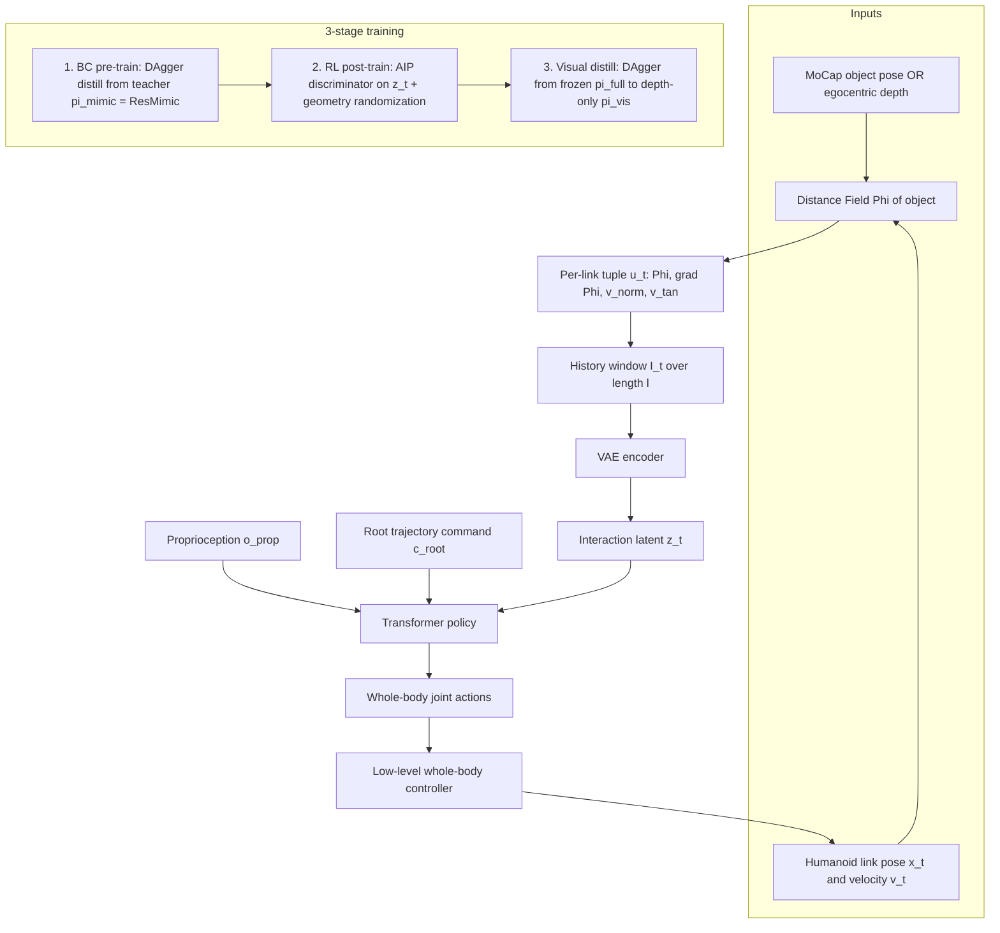
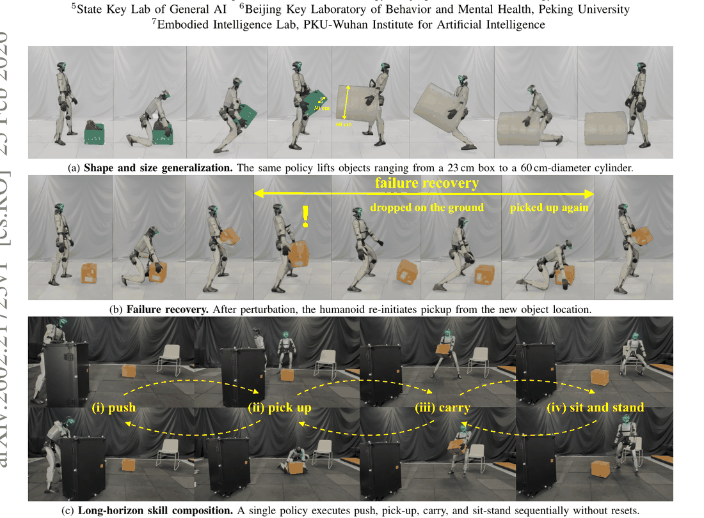

# LessMimic: Long-Horizon Humanoid Interaction with Unified Distance Field Representations

- arXiv: https://arxiv.org/abs/2602.21723
- Source: https://arxiv.org/abs/2602.21723
- Project: https://lessmimic.github.io
- Local PDF: `/Users/luogu/physical_intelligence/papers/rl/planning/LessMimic_2602.21723.pdf`
- Year: 2026
- Category: humanoid whole-body / distance field RL
- Priority: high

## 一句话总结

**问题**：人形长程物体交互策略被示范轨迹耦合到特定几何——参考基方法换形状/尺度即崩且偏离参考即判失败，免参考方法又逐任务手写奖励、策略互相孤立；**洞察**：局部距离场（DF）结构——表面距离、梯度、速度的法向/切向分解——对物体形状与尺度近似不变，是跨几何通用的"交互签名"；**机制**：逐 link DF 特征经 VAE 压成 latent z_t，单策略三阶段训练（DAgger 行为克隆 → AIP 对抗交互先验 RL + 几何随机化 → 深度视觉蒸馏），推理仅需根轨迹命令 + 当前 DF 观测；**证据**：0.4×–1.6× 尺度 PickUp/SitStand 保持 80–100% 成功（基线在极端尺度近零），5 任务随机序列 62.1% 成功，40 任务序列仍有 2.1%，真机 8–10/10。

## 九问速览

1. **Problem**：人形长程交互要单策略同时做到跨几何泛化、免参考推理、技能组合，现有两阵营各缺一角
2. **Bottleneck**：表征层——参考轨迹把交互逻辑绑死特定运动模板；免参考方法缺统一交互信号只能逐任务设计
3. **Insight**：抓握/接触处的局部 DF（距离+梯度+速度分解）对物体尺寸和接近方向近似不变
4. **Method**：DF 特征 VAE 编码为 z_t，BC(DAgger)→AIP-RL+几何随机化→视觉蒸馏三阶段，推理只输入根命令
5. **Evidence**：0.4×–1.6× 尺度 PickUp/SitStand 80–100%；5 任务 62.1%；40 任务 2.1%；真机 10/10（22cm³ 拾取）
6. **Ablation**：去几何随机化/Transformer 后 PickUp 跨尺度全零；去 RL 仅 BC 只剩 31.7%；消融版长程全崩（N=5 仅 1.7–22.1%）
7. **Assumption**：无穿透交互下无符号 DF+局部梯度足够描述几何；根轨迹命令由外部给定；教师(ResMimic)能产出物理有效轨迹
8. **Failure**：最小箱体（15 cm³/0.4×）所有方法都难；视觉版 SitStand 背侧接触不可观测未评测；视觉版长程 N≥15 归零
9. **Opportunity**：关节体/可变形物 DF 表征；部分可观测鲁棒性；DF 窗口长度 l 与 link 集合的自动选择；与高层 VLM 规划器结合

| 维度 | 论文答案 |
|---|---|
| Perception | MoCap 版：外部动捕物体几何→解析 DF（逐 link 距离/梯度/速度分解）；Vision 版：自我中心深度历史 S_t→CNN 编码器 E_φ 隐式恢复 DF 线索 |
| Closed-loop | 逐时步连续几何反馈闭环：无 reset 单策略连续执行 push→pick→carry→sit；扰动后物体掉地可从新位置重新拾起（Fig.1b） |
| Correction | 无显式重规划器：全身偏离不被当作跟踪失败惩罚（仅根轨迹软命令 −‖x_root−c_root‖²），策略可自适应偏离"参考"姿态 |
| Deployment | 真机人形平台（型号未报告）；MoCap 版依赖动捕设施，Vision 版仅需机载深度相机；真机每条件 10 次重复执行 |

## 核心技术

*论文 Figure 1（p1）：Fig. 1: Generalizable long-horizon humanoid interaction via LESSMIMIC. A single DF-conditioned polic*

信息流拆解（以"谁看什么"为轴）：

1. **几何通道**：物体几何（MoCap 网格或深度图）→ DF Φ: R³→R → 逐任务相关 link 的四元组 u_t=[Φ(x_t), ∇Φ(x_t), v_norm, v_tan] → 时间窗 I_t={u_{t−l+1},…,u_t} → VAE（MLP+ReLU，reparameterization）→ 平滑 latent z_t。整条通道不含全局坐标，天然位姿/尺度不变。
2. **指令通道**：唯一任务输入是稀疏根轨迹命令 c_root（想去哪），不含任何全身参考姿态——这是与 HDMI/ResMimic 的本质区别。
3. **策略**：Transformer 骨干（消融证明 MLP 容量不足以建模多技能时序依赖），输入 [o_prop, c_root, z_t] 拼接，输出全身关节动作；三阶段共享同一架构、只换目标函数与环境配置。
4. **预训练/冻结关系**：教师 π_mimic=ResMimic（残差修正的动作-物体共跟踪，直接复用已发表方法，仅作数据生成器）；π_base 由 DAgger BC 学得；π_full 经 AIP-RL 微调；蒸馏阶段 π_full 全冻结，只训练视觉编码器 E_φ（CNN）+ 同款控制头得到 π_vis。
5. **Loss 具体形式**：L_BC 与 L_distill 均为动作 MSE（见下节）；AIP 判别器为 LSGAN 目标；RL 复合奖励 = 根跟踪 + λ_i·AIP 交互风格 + λ_s·AMP 动作风格 + 物体跟踪 + 三项正则（Tab. A2）。

## 底层原理与数学推导

**DF 作为动力学局部坐标系**。DF 定义 Φ: R³→R，给出任意点到最近物体表面的距离；其梯度 ∇Φ(x_t)（取 x_t 在零水平集投影处的梯度）即局部表面法向。位置不足以刻画交互，论文把 link 线速度 v_t 沿法向/切向正交分解（Eq.1）：

$$v_t^{norm} = (v_t \cdot \nabla\Phi(x_t))\,\nabla\Phi(x_t), \qquad v_t^{tan} = v_t - v_t^{norm}$$

法向分量捕获"接近/施力强度"，切向分量捕获"表面滑移/遍历"，从而把全局速度投影到物体表面定义的局部坐标系。逐 link 四元组与时间窗构成交互表征（Eq.2）：

$$u_t = [\Phi(x_t),\ \nabla\Phi(x_t),\ v_t^{norm},\ v_t^{tan}], \qquad I_t = \{u_{t-l+1}, \ldots, u_t\}$$

**尺度/形状不变性论证**（定性）：I_t 完全由"机器人相对 DF 的关系"定义，不含物体全局位姿与绝对尺寸；手掌握持处的局部 DF 结构（距离梯度场+接触速度模式）对物体放大缩小和接近方向近似不变——不同尺寸物体上的同类交互呈现相似几何结构，故策略学的是交互几何而非绝对轨迹（论文未给形式化不变性证明，待确认）。

**AIP（Adversarial Interaction Prior）**：判别器只吃 z_t（几何签名）而不吃全身状态，用 LSGAN 目标（Eq.4）把"参考交互缓冲 B_ref"（预训练期收集）与策略在新物体上产生的 latent 区分开：

$$L_D = \mathbb{E}_{z \sim B_{ref}}\left[(D(z) - 1)^2\right] + \mathbb{E}_{z \sim \pi}\left[(D(z) + 1)^2\right]$$

$$r_t = r_{task} + \lambda_i\, r_{interact} + \lambda_s\, r_{style}, \quad r_{interact}(z_t) = \max\left(0,\ 1 - 0.25\,(D(z_t) - 1)^2\right), \quad r_{task} = -\lVert x_t^{root} - c_t^{root} \rVert_2$$

关键 novelty 在判别条件的选择：AMP 式判别器若作用在关节状态上会强制复刻运动模板；作用在 DF latent 上则只约束"接近-接触-释放"的几何节奏，允许为未见几何合成全新姿态。r_style 则保留一个作用在全身状态 s_t 上的标准 AMP 判别器（max(0, 1−0.25(D_AMP(s_t)−1)²)）正则步态自然度，两者互补。

**蒸馏目标**：学生(π_base/π_vis)在自身 rollout 分布上查询教师标签，最小化动作 MSE（Eq.3/8）：

$$\mathcal{L}_{BC} = \mathbb{E}_{s \sim \pi_{base}}\left[ \lVert \pi_{base}(o_{base}) - \pi_{mimic}(o_{mimic}) \rVert_2^2 \right], \qquad \mathcal{L}_{distill} = \mathbb{E}_{s \sim \pi_{vis}}\left[ \lVert \pi_{vis}(o_{vis}) - \pi_{full}(o_{base}) \rVert_2^2 \right]$$

其中 o_mimic 含特权全身参考（仅教师可见），o_base=[o_prop, c_root, z_t] 与推理观测严格一致——刻意的不对称信息设计，强迫学生把行为完全锚定在 DF latent 上。

## 物理直觉解释

**DF 是"盲人摸盲文"的触觉刻度**。人在黑暗中拿起一个杯子时，并不需要知道杯子的 CAD 模型或它在房间里的坐标；手只需要连续感知三件事——离表面多远（Φ）、表面朝哪个方向（∇Φ）、我是在压向它还是滑过它（v_norm vs v_tan）。距离场把这三件事变成了可以在任意 link 上廉价查询的连续场，所以 23 cm 的箱子换成 60 cm 直径的圆柱、甚至换成训练中从未见过的足球时，手掌附近的局部 DF 结构几乎一样，策略"摸"到的盲文没有变。这就是形状/尺度泛化的物理来源：**表征只保留了接触发生处的局部几何，而局部几何恰恰是交互中最不变的部分**。点云/体素丢失梯度、隐式神经场查询太慢进不了高频控制环，DF 是唯一同时满足"连续、可微、O(1) 查询"三个条件的选项。

**AIP 是"只看笔锋不看手腕的书法老师"**。传统 motion tracking 老师盯着你的每个关节角，偏离示范一毫米就打板子——结果是学生只会写老师写过的字（几何专家化），遇到新字体（新物体）就傻眼。AMP 已经放松了一步：只看整幅"字"的自然度，不管关节角逐帧对齐；但 AMP 的判别对象仍是机器人自身状态，隐含着对特定运动模板的偏好。AIP 更进一步：老师只看"笔锋在纸上的几何痕迹"（z_t 里的人-物距离/梯度/速度模式），即"起笔要贴近、行笔要顺表面滑、收笔要干净离开"这类接触节奏，至于你用悬腕还是枕腕、手指怎么摆，一概不管。于是同一份"交互有效性"的标准可以迁移到任何形状的"纸"上——这正是消融中去掉 AIP 后 PickUp 0.4× 尺度从 63.0% 掉到 0.0% 的原因：没有几何先验，BC 阶段记住的 kinematic 模板在新几何上直接失效。

**长程组合是"不换司机的连续驾驶"**。把 push→pick→carry→sit 串起来执行，通常做法是高层规划器加显式技能切换器，像换司机一样在每个任务边界交接——每次交接都是误差放大器（几何误差跨时步累积复合）。LessMimic 的统一 DF 表征让技能边界消失：对策略而言，"推柜子"和"抱箱子"不过是同一几何观测量（DF 距离在变大变小、法向在转、接触速度在换挡）的不同段落，任务切换被消化为连续几何上下文的自然漂移，就像老司机从倒车入库到上路巡航不需要重启大脑。失败恢复同理：箱子被扰动掉到地上，DF 场随物体新位置即时更新，"重新接近-接触-抱起"的几何节奏重新上演一遍即可——Fig.1b 的重拾演示就是这一机制的自然结果，而非专门训练的"恢复技能"。

## 工程细节与实操指南

三阶段训练配置（Tab. A1，策略架构三阶段共用）：

| 阶段 | 学习率 | Batch/环境 | 迭代/步数 | 其他 |
|---|---|---|---|---|
| ① BC 预训练（DAgger） | 1e-3（Adam） | 4096×8 | 24,000 iters | 无任务奖励，纯动作 MSE |
| ② AIP-RL 后训练 | 策略 1e-3 / 判别器 2e-4 | 4096×8 并行环境 | 240,000 steps | γ=0.99，奖励权重 λ=1.5，熵系数 5e-4 |
| ③ 视觉蒸馏（DAgger） | 1e-3 | 2048×8 | 120,000 iters | 教师 π_full 冻结 |

RL 奖励各项与权重（Tab. A2）：根跟踪 −‖x_root−c_root‖²（1.0）；交互风格 AIP-on-z_t（2.0）；动作风格 AMP-on-state（1.0）；物体跟踪 exp(−‖x_obj−x̃_obj‖²/σ²)（1.0）；动作正则 ‖Δa‖²（5.0）；早终止常数（−10.0）；软关节限位 n_exceed（−5.0）。注意 Tab. A1 的"λ=1.5"与 Tab. A2 各项权重的关系未明说（待确认：λ_i/λ_s 与表中 2.0/1.0 的对应）。

域随机化 6 维（附录 B-A）：物体几何（逐维独立采样尺度、盒/柱形状切换、各向异性微形变、朝向位置扰动）；物理属性（质量/摩擦/恢复系数逐回合独立）；初始条件（本体与物体小位移/旋转偏移，关节绕名义站姿随机并保持平衡）；命令扰动（根命令位置/朝向注入有界噪声）；执行噪声（动作输出加零均值高斯，模拟电机差异与控制器延迟）；感知随机化（相机外参抖动、深度量化/随机 dropout/加性噪声）。

部署要点：(1) MoCap 变体需外部动捕获取物体几何建 DF——真机 R_acc 也靠外部 MoCap 测量（仅评测用）；Vision 变体仅靠机载深度历史 S_t，SitStand 因背侧接触自我中心不可观测而未评测；(2) 真机评测条件：PickUp 22 cm³/60 cm³、SitStand 椅高 12 cm/46 cm，每条件 10 次重复；(3) 真机长程演示（Fig.6）：推柜子到位→捡箱→按命令轨迹搬运，全程无 reset；(4) 复现最大缺口：simulator 名称、控制频率、底层全身控制器与观测维度均未报告。

## 实验协议清单

| 项目 | 论文设置 | 来源与备注 |
|---|---|---|
| 观测 | o_base=[o_prop(关节 DoF 位置/速度), c_root(稀疏根轨迹命令), z_t(DF latent)]；o_vis=[o_prop, c_t, S_t(自我中心深度历史)]，CNN 编码器 E_φ 输出 latent；与推理严格同构、无参考动作 | Sec. III-B/A1、Fig.3；具体维度未报告 |
| 动作空间 | 全身关节动作（输出至底层全身控制器）；无动作 chunk | Sec. III、Fig.2；维度未报告 |
| 控制频率 | 未报告（仅说明所有基线用同一 simulator/控制频率/底层全身控制器） | 附录 B-C |
| 重规划频率 | 不适用：无显式重规划，根命令是唯一高层输入，单策略逐时步连续执行、长程无 reset | Sec. III、Tab. III |
| 动作 horizon | 逐步输出（无 chunking）；长程评测最长 40 个连续任务实例 | Sec. IV-C |
| 数据 | 人类 MoCap 交互动作重定向（粗交互动作）→ ResMimic 教师在全物理仿真中合成物理有效状态-动作轨迹（"synthetic physicalization"） | Sec. III-B；MoCap 来源与规模未报告 |
| 奖励 | Tab. A2 七项：根跟踪 1.0 / 交互风格(AIP) 2.0 / 动作风格(AMP) 1.0 / 物体跟踪 1.0 / 动作正则 5.0 / 终止 −10.0 / 关节限位 −5.0；无任何动作跟踪项 | Tab. A2、Eq.5-7 |
| Reset | 初始条件随机化：本体/物体小位移旋转偏移、关节绕名义站姿随机（保持平衡约束）；长程评测无环境 reset | 附录 B-A |
| 成功定义 | PickUp：箱升高 >0.3 m 且稳定持握 ≥3 s；SitStand：骨盆稳定接触且根高 ∈[0.3,0.6] m；Carry：全程偏差 ≤0.6 m；Push：手接触率 R_cont（身体接触视为失败）；长程逐步容差 0.6 m；真机 R_acc=根距命令 ≤0.6 m 的时间步占比 | 附录 B-D |
| 评估次数 | 仿真 3 seeds（mean±std，每设置 episode 数未报告）；真机每条件 10 次重复 | Tab. II/III/IV |
| 随机种子 | 3 个（结果报 mean±std） | Tab. II 标注 |
| 扰动测试 | 域随机化 6 维（几何/物理/初始/命令/执行/感知）；Fig.1b 扰动后失败恢复（掉地重拾）；真机尺度 22→60 cm³、椅高 12→46 cm、未见足球/圆柱 | 附录 B-A、Fig.1/5、Tab. IV |
| 真机 | 物理人形平台（型号未报告）：MoCap 版 PickUp 22cm³ 10/10(R_acc 94.44%)、60cm³ 8/10(81.39%)、SitStand 12cm 8/10(84.89%)、46cm 10/10(91.88%)；Vision 版 PickUp 8/10(89.15%)、7/10(75.24%)；真机长程 push+carry 序列 | Tab. IV、Fig.6 |
| 算力 | 未报告（GPU 型号/数量/训练时长均未披露；仅知 RL 用 4096×8 并行环境） | Tab. A1 |
| 特权信息 | 教师 o_mimic 含全身参考动作（仅训练期）；AIP/AMP 判别器用仿真真值状态与参考交互缓冲 B_ref；部署期无特权信息（MoCap 版仍需外部动捕物体几何） | Sec. III-B/C |

**附录陷阱自查**：
- privileged 信息：教师刻意持特权参考（不对称设计是卖点）；但 MoCap 部署变体仍依赖动捕设施给物体全局几何，只有 Vision 版真正摆脱贫穷假设
- reward shaping：号称无任务特定奖励，实际仍有 7 项手工项（动作正则权重高达 5.0、终止 −10）；AIP 是把 shaping 从"人写"转移到"几何域数据驱动"，不是消除 shaping
- reset 难度：初始扰动幅度小且保平衡约束，训练起点偏易；但长程评测零 reset 是实打实的难设定
- eval budget：仿真 3 seeds 但每设置 episode 数未报告；真机每条件仅 10 次——8/10 与 10/10 的差距在 n=10 下不显著
- 底层控制栈：simulator、控制频率、全身控制器实现、PD 增益全部未报告——复现最大盲区（论文自述"细节见附录 B"，附录实际未给）
- 数据优势：教师合成物理有效数据是隐性数据优势（消融 −Syn 证明物理可行性对 Carry 类持续接触任务最关键）；基线 HDMI/ResMimic 为自复现（˚标注），VisualMimic/PhysHSI 用官方 checkpoint

## 消融实验与分析

仿真主表（Tab. II，3 seeds，训练尺度 1.0×）与长程表（Tab. III）关键数据：

| 变体 | PickUp 0.4× | PickUp 1.0× | PickUp 1.6× | Carry 1.0× | 长程 N=5 | 长程 N=40 |
|---|---|---|---|---|---|---|
| **Ours (Mocap) 完整版** | **63.0±5.0** | **100.0** | **94.0±1.6** | **82.9±1.4** | **61.7±1.7** | **2.1±0.2** |
| Ours (Vision) | 63.7±3.1 | 91.0±3.3 | 93.0±1.6 | 35.8±2.7 | 15.9±0.6 | 0.0 |
| − AIP（去对抗交互先验） | 0.0 | 23.3±5.0 | 64.0±2.9 | 0.0 | 5.2±0.2 | 0.0 |
| − Syn.（教师数据换原始 MoCap） | 34.0±6.7 | 99.3±0.9 | 99.7±0.5 | 66.5±2.0 | 22.1±0.8 | 0.0 |
| − Rand.（去几何随机化） | 0.0 | 0.0 | 0.0 | 0.0 | 1.9±0.1 | 0.0 |
| − RL（只 BC 不后训练） | 0.0 | 31.7±2.6 | 9.7±1.7 | 5.3±1.5 | 3.2±0.2 | 0.0 |
| − Trans.（MLP 换骨干） | 0.0 | 0.0 | 0.0 | 0.0 | 1.7±0.1 | 0.0 |
| HDMI（参考基，自复现） | 0.0 | 100.0 | 1.7±1.2 | 27.4±0.3 | — | — |
| ResMimic（参考基，自复现） | 0.0 | 100.0 | 63.0±10.2 | 32.9±1.5 | — | — |
| PhysHSI（免参考基线） | 23.1±2.4 | 100.0 | 39.9±2.8 | 81.6±1.9 | — | — |

**核心结论**：(1) 几何随机化与 Transformer 骨干是 PickUp 跨尺度泛化的生死项（去掉即 0.0，含训练尺度 1.0×——Rand 消融把 1.0× 也打到 0 说明随机化同时防过拟合）；(2) AIP 主要护住极端尺度（0.4× 从 63.0→0.0）与跨几何迁移（Carry 82.9→0.0），是"几何规则 vs 运动记忆"的分水岭；(3) BC 单独不够（1.0× 仅 31.7%），RL 后训练是把记忆转化为规则的关键一步；(4) 教师数据物理可行性对持续接触任务最关键（Carry 82.9→66.5）而单步抓取影响小；(5) 长程组合没有任何单一组件能独撑——五个消融全部在 N=5 就掉到 1.7–22.1%，N≥15 归零，说明表征统一性+数据质量+优化方式三者缺一不可；(6) 视觉蒸馏带来一致的精度折损（PickUp 100→91、Carry 82.9→35.8），但在基线近零的尺度区间（0.4×/1.4×）仍有 63.7–99.7%，说明折损来自感知不确定性而非表征失效。

## 技术权衡（Trade-off）

| 优势 | 劣势与工程代价 |
|------|---------------|
| 单策略四任务（PickUp/SitStand/Push/Carry）+ 尺度 0.4×–1.6× 泛化，无需重训练 | 依赖 DF 表征的获取：MoCap 版需动捕设施；Vision 版显著掉点（Carry 82.9→35.8）且 SitStand 背侧接触盲区 |
| 推理零参考：只需根轨迹命令，无 MoCap/规划器/任务奖励 | 根轨迹命令仍需外部供给——长程自主的上游（谁给命令）未解决 |
| AIP 把奖励设计成本换成一份几何 latent 参考缓冲，跨几何可迁移 | 仍保留 7 项手工奖励项（动作正则 5.0 等）与 AMP 判别器；对抗训练本身引入不稳定性（LSGAN 缓解） |
| 长程 40 任务无 reset 连续执行 + 扰动失败自恢复 | 绝对成功率随 N 衰减快（N=25 仅 9.0%），实用性止步于"可行"而非"可靠" |
| 无符号 DF 查询 O(1)，满足高频控制；对无穿透交互是充分几何描述 | DF 假设刚体+无穿透：关节体/可变形物体（结论自认的 future work）、铰接家具不适用 |
| 三阶段复用同一 Transformer 架构，工程管线清晰 | 三阶段串行训练成本高（24k BC + 240k RL + 120k 蒸馏迭代）；训练算力未披露 |

## 技术价值与演进定位

这篇论文的真正贡献是给出了"交互表征层"的一个候选答案：在 reference-based（高保真但几何专家化）与 reference-free（灵活但任务孤立）的两难之间，证明**局部几何场可以同时买回泛化、组合与自主性**三项此前互斥的性质。方法论上它完成了两次解耦：用 DF 把"交互逻辑"从"运动模板"中解耦（AIP 判别 z_t 而非关节状态），用根命令把"任务意图"从"全身实现"中解耦（策略自适应填空）。这在演进谱系上处于"数据驱动运动模仿 → 几何驱动交互生成"的转折点：DeepMimic/HDMI/ResMimic 一脉把示范当监督信号，LessMimic 把示范降格为"几何签名的采样源"（教师只负责产出 B_ref 与 BC 初始数据），推理期彻底切断对示范的依赖。对更广的人形社区，它指出的方向是：与其积累更多全身示范，不如投资跨几何不变的表征——这与库内 OmniRetarget 在数据生成侧"保持相对拓扑而非关节角"的结论遥相呼应，两条线（数据侧 mesh、策略侧 DF）共同构成"几何相对主义"路线。局限同样清晰：刚体假设、根命令依赖、视觉变体的部分可观测短板，以及 40 任务 2.1% 的长程可靠性，都标注了下一步的作业。

## 与其他论文的关系

| 论文（库内路径） | 关系 |
|---|---|
| OmniRetarget（`notes/rl/planning/omniretarget.md`，ICRA 2026 最佳论文，姊妹篇） | 同一"交互语义在相对几何而非绝对运动"命题的两侧落地：OmniRetarget 用 interaction mesh 在**数据生成**侧保持人-物-环境相对拓扑（一次示范→多本体 8+h 数据），LessMimic 用 DF 在**策略观测**侧统一交互表征（推理免参考）。LessMimic 正文将 OmniRetarget（引文 [54]）归入 reference-based 数据源阵营引用；两者互补——mesh 重定向的产物天然适合喂给 DF 表征（重定向保几何语义、DF 消费几何语义） |
| Human-as-Humanoid（`notes/reasoning/human-as-humanoid.md`） | 都在削减机器人示范依赖：HaH 用 ego-exo 人类视频 + 类人比例硬件实现零样本动作迁移（解决"数据从哪来"），LessMimic 用几何表征实现免参考推理（解决"策略怎么泛化"）。HaH 的零样本动作可否直接作为 LessMimic 教师 π_mimic 的替代数据源，是自然的组合实验 |
| ResMimic [62] | 直接的上下游关系：作为教师 π_mimic（残差修正的动作-物体共跟踪）为 LessMimic 生成物理有效轨迹；LessMimic 站在其上，把"跟踪参考"替换为"DF latent 条件化"，等于把 ResMimic 的能力蒸馏进一个免参考学生 |
| AMP（Peng et al., SIGGRAPH 2021 [39]） | 方法源头：AMP 判别器作用在全身状态上正则运动自然度；AIP 的 novelty 是把判别对象从状态换成 DF latent z_t，从"动作像不像示范"变为"交互几何是否有效"——一字之差换来跨几何可迁移性（消融：−AIP 后 0.4× 尺度 63.0→0.0） |
| HDMI [51] / VisualMimic [56] / PhysHSI [50] | 三类对照基线：HDMI（参考基，自复现，极端尺度 0.0/1.7%）、VisualMimic（视觉+参考，官方 checkpoint）、PhysHSI（免参考但任务专用观测/奖励，无法直接做长程组合）——Tab. I 的三轴对比（任务统一观测/推理无动作/长程组合）中只有 Ours 全勾 |
| CLONE [26]（同组共著：Yixuan Li / Yutang Lin / Jieming Cui / Siyuan Huang） | 同组前作的人机遥操作路线（closed-loop teleop for long-horizon）；LessMimic 可视为去掉"人在环"的自主化对偶——CLONE 用人的实时纠错补表征缺陷，LessMimic 用更好的表征省掉人 |
| DF / level-set 源头（Osher & Sethian 1988 [35]） | 表征工具的理论出处：水平集方法定义的距离场被从数值分析借来当交互观测空间，是"老工具新用途"的典型 |

## 精读问题

1. 尺度不变性目前只有定性论证：能否给出 I_t 在物体相似变换（尺度 α、旋转 R）下的形式化不变性/等变性与失效界（例如 0.4× 处 PickUp 从 63.0% 掉到 0.0 的 −AIP 消融说明不变性主要靠 AIP 逼出来，表征本身是否真正 scale-invariant）？
2. 根轨迹命令 c_root 是唯一任务接口：谁生成它？若上游接一个 VLM 规划器（如 π0.5 类）输出根命令，端到端长程成功率会怎样衰减——62.1%（N=5）里有多少余量留给命令误差？
3. AIP 判别器以 B_ref（固定物体几何上收集的交互 latent）为正样本：参考缓冲的几何分布与测试几何分布差距多大时会失效？可否用程序化生成的"合成有效交互"扩充 B_ref 来替代真实教师数据（−Syn 消融暗示物理可行性重要，但来源是否必须是人类 MoCap）？
4. 视觉变体在 SitStand 上因背侧接触不可观测而缺席、长程 N≥15 归零：深度历史 S_t 的视野限制是表征问题还是传感器配置问题？加一颗后向相机或分布式压力感知（接触觉）能否补上，还是必须引入记忆（recurrent state beyond window l）？
5. DF 限定刚体无穿透：对铰接物体（柜门/抽屉）用 part-level DF、对可变形物体用 deformation-aware DF 的推广路径是什么？交互 latent z_t 的 VAE 瓶颈是否会成为接触模式多样性的上限？
6. 40 任务 2.1% 的失败模式是什么——误差累积（跟踪漂移）还是技能切换处的瞬态失稳？把长程评测按"任务边界 vs 任务内部"分解失败，能判断该修表征还是修命令接口。
