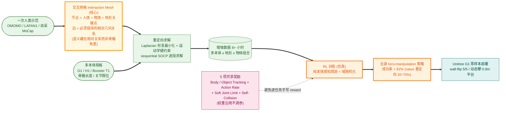

# OmniRetarget: Interaction Mesh for Humanoid Whole-Body Motion Retargeting

- 本地 PDF：`papers/rl/planning/OmniRetarget_2509.26633.pdf`（2026-10-02 全文核对确认无误：标题/作者/实验一致）
- arXiv：https://arxiv.org/abs/2509.26633
- 年份：2026 (ICRA 2026 Best Conference Paper + Best Manipulation Paper 双料)
- 团队：Amazon FAR + MIT + UCB + Stanford + CMU（原记 Cornell 有误，已按 PDF 署名更正）
- 阶段：人形全身运动重定向 — 一次示范 → 多本体增强数据生成

## 一句话总结

OmniRetarget 提出交互网格（Interaction Mesh）数据生成引擎：把一次人类示范编码为"人-物-环境"三元交互的 mesh graph，再自动适配到不同本体（机器人型号）、地形与物体组合，一次示范生成 8+ 小时的可训练轨迹。RL 训练仅需 5 个共享奖励项加简单域随机化，无需逐任务设计 reward。人形全身 loco-manipulation（运动+操作一体）任务成功率 >82%，远超 naive retargeting 的 50-70%；训练出的策略可直接零样本迁移到 Unitree G1 真机。ICRA 2026 双料最佳论文（全场 + 操作方向）。

## 九问速览

1. **Problem**：人形全身 loco-manipulation 的示范重定向存在具身鸿沟——关节角映射产生穿模/滑步，且丢失人-物-环境交互
2. **Bottleneck**：现有重定向只保人自身运动学、忽略与物体/地形的接触关系；下游 RL 需逐任务手写大量 reward 与随机化
3. **Insight**：交互语义藏在"人-物-地形关键点的相对几何关系"里而非骨骼角度里——保持 mesh 拓扑即保语义、即跨本体
4. **Method**：交互网格 + Laplacian 形变最小化 + 运动学硬约束，sequential SOCP 求解；一次示范增强到多本体/地形/物体组合
5. **Evidence**：39 个难动作上 RL 成功率超 PHC/GMR/VideoMimic 基线逾 10% 且方差更低；真机 wall-flip 5/5、动态攀 0.9m 平台
6. **Ablation**：增强数据训练评测 79.1% vs 仅 nominal 82.2%（覆盖扩大不掉点）；只靠域随机化策略难以偏离 nominal 参考
7. **Assumption**：高质量参考动作足以让纯本体感知（无视觉）RL 学会复杂任务；5 个共享奖励权重可沿用 [33] 不调参
8. **Failure**：约束线性化偶发轻微穿透（靠 RL 修复）；wall-flip 需放宽终止阈值至 0.5m 并去足部朝向跟踪；依赖 >15rad/s IMU
9. **Opportunity**：柔软接触/滑动等非几何交互语义未建模；mesh 拓扑设计仍手工；与视觉策略结合未探索

| 维度 | 论文答案 |
|---|---|
| Perception | 纯本体感知：参考关节位置/速度 + 骨盆位置/朝向误差 + 骨盆线/角速度 + 关节状态 + 上一动作；刻意对场景与物体信息"失明" |
| Closed-loop | 闭环 RL：逐时步跟踪参考动作；观测噪声与随机推力注入 |
| Correction | 无显式重规划；跟踪偏差超阈值或物体偏离 >1.0m/45° 即终止（训练期终止条件即成功判据） |
| Deployment | OMOMO/LAFAN1/自采 MoCap 重定向生成 8+ 小时数据仿真训练 → Unitree G1 零样本 sim-to-real（支持 H1/Booster T1 重定向） |

## 核心技术

1. **Interaction Mesh** — 将人-物-环境交互编码为 mesh graph：节点 = 人体关键点 ∪ 物体关键点 ∪ 地形锚点，边 = 保持相对几何关系的拓扑连接；重定向 = 在保持 mesh 拓扑（相对位姿语义）的前提下求解新本体的运动
2. **5 个共享奖励项** — 覆盖所有操作场景的通用 reward 设计，避免逐任务手写
3. **一次 human demo → 多本体增强数据** — 同一示范自动适配不同机器人/地形/物体组合，数据生成成本被摊薄到不同下游任务上

## 底层原理与数学推导

交互网格定义为带拓扑的图 $M = (V, E)$，节点集合 $V$ 由人体关键点、物体关键点与地形锚点组成，边集合 $E$ 编码"哪些点对之间的相对关系必须保持"。重定向被形式化为保持网格拓扑的几何形变问题：给定源网格 $M^{src}$ 与新本体的关键点位置 $P^{tgt}$，求解

$$\min_{X} \sum_{(i,j) \in E} w_{ij} \| (X_i - X_j) - (V^{src}_i - V^{src}_j) \|^2 \quad \text{s.t. 新本体的运动学约束}$$

由于目标函数对 $X$ 是二次的、约束是线性的，该问题可分解为 sequential SOCP（二阶锥规划）求解：逐段固定已求解节点、用上一段的解作为下一段的先验，在保证实时性的同时维持全局一致性。重定向出的轨迹配合 5 个共享奖励项训练策略：$\pi_\theta$ 通过最大化

$$J(\pi) = \mathbb{E}_{\tau \sim \pi}\left[\sum_{t} \gamma^t \left( \sum_{k=1}^{5} w_k r_k(s_t, a_t) \right)\right]$$

学习全身运动，$r_1..r_5$ 为覆盖运动、操作、平衡、安全与任务进度的共享奖励（待确认：五项奖励的具体定义需读全文）。

## 物理直觉解释

**交互网格是"皮影戏"的关节图**。皮影戏里，一个角色的动作由几根竹签控制——竹签之间的相对关系（谁在谁上面、多远）决定了角色的"动作语义"，而不是竹签的绝对位置。同样，一个人类示范的语义不在"手腕的绝对坐标"里，而在"手相对物体的位置、脚相对地形锚点的距离"这些相对关系里。关节角映射（naive retargeting）之所以差，是因为它把"动作语义"错误地绑定在骨骼长度上：同一个关节角，1.7m 的人和 1.4m 的机器人做出来是完全不同的动作。交互网格把语义转移到"跨本体不变的相对关系"上，这正是它比关节角映射高 20+ 个百分点成功率的原因。

**为什么这像"舞蹈老师教不同身材的学生跳同一支舞"？** 老师示范动作时，学生记住的不是"胳膊抬 45 度"（这是老师的身材），而是"手从头顶划到腰侧"（这是相对身体的轨迹）。高个子学生和矮个子学生做同一个"手过头顶"的动作，关节角完全不同，但相对轨迹一致。交互网格就是这个原理的数学化：节点和边构成一个"相对关系的脚手架"，任何本体（高矮、臂长、自由度）只要套上这个脚手架，就能得到语义相同、运动学可行的动作。这就是"一次示范、多本体可用"的物理基础。

**为什么全身 loco-manipulation 比单纯操作或单纯行走都难？** 操作时身体可以站定，行走时手可以不碰东西；全身操作（如搬东西上楼梯、边跑边端托盘）时，**支撑腿的动力学和手臂的接触力通过躯干耦合**——手臂推箱子，反作用力传到脚底，重心必须在运动学和力的双重约束下保持稳定。这就像**杂技演员端盘子走钢丝**：不是"走路"和"端盘子"两件事的叠加，而是两者的动力学合成。交互网格的价值在于它同时编码了手脚两端的相对关系，因此重定向出的轨迹天然保持"脚稳"和"手准"的平衡，RL 只需要在 5 个共享奖励下把这些轨迹打磨成闭环策略。

## 工程细节与实操指南

- 数据生成：一次人类示范 → Interaction Mesh 重定向 → 8+ 小时可训练轨迹（多本体、多地形、多物体组合）
- 重定向求解：sequential SOCP，二次目标 + 线性运动学约束，逐段求解保证实时性与一致性
- 训练：RL + 5 个共享奖励项 + 简单域随机化，无需逐任务设计 reward
- 评测：全身 loco-manipulation 任务，成功率 >82%（vs naive retargeting 50-70%）
- 动态能力指标：wall-flip 类高速动作达到 3.5 m/s 线速度、15 rad/s 角速度（待确认：具体任务设置需读全文）
- 部署：训练策略零样本迁移到 Unitree G1 真机

## 实验协议清单

| 项目 | 论文设置 | 来源与备注 |
|---|---|---|
| 观测 | 最小纯本体感知空间：Reference Joint Position/Velocity + Reference Pelvis Position/Orientation Error + Pelvis Linear/Angular Velocity + Joint Position/Velocity + Previous Action；无视觉/场景/物体信息（敏捷动作下屏蔽骨盆线位置误差与速度） | Sec.IV Observations |
| 动作空间 | 全身关节目标（人形 RL 常规）；重定向输出为运动学可行轨迹参考 | Sec.IV |
| 控制频率 | 未报告 | — |
| 重规划频率 | 不适用（无高层规划；RL 逐时步跟踪参考） | — |
| 动作 horizon | 参考轨迹长度（如 30 秒 parkour 序列） | Fig.1 |
| 数据 | 一次示范→交互网格重定向：OMOMO 2.78h 箱体搬运 + LAFAN1 4.6h + 自采 MoCap 1h（共 8+h 将开源）；增强维度：地形高度/深度、物体初始位姿、物体形状 | Sec.V-B、Fig.4 |
| 奖励 | RL 5 项共享奖励：Body Tracking + Object Tracking（DeepMimic 式）+ Action Rate + Soft Joint Limit + Self-Collision（>1N 二元惩罚）；权重沿用 [33] 不调 | Sec.IV Rewards |
| Reset | 训练终止条件：body tracking 大偏差即终止；物体偏离参考 >1.0m/45° 终止（wall-flip 放宽末端误差阈值至 0.5m、去足部朝向跟踪） | Sec.IV Termination |
| 成功定义 | 下游 RL 基准：以训练终止标准衡量（非独立任务判定）；真机为演示性验证（wall-flip 5/5） | Sec.V-B、Fig.6 |
| 评估次数 | 下游 RL：39 个挑战动作；真机 wall-flip 5 次（5/5）；未报告完整 episode 统计 | Sec.V-B |
| 随机种子 | 未报告 | — |
| 扰动测试 | 有：物体参数随机化（质量 0.1-2kg、CoM ±0.08m、惯量 50-150%、形状 ±10%）+ 机器人 4 项（躯干 COM、关节默认 ±0.01rad、随机推 0.3m/s & 0.78rad/s 持续 1-3s、观测噪声） | Sec.IV Randomization |
| 真机 | 有：Unitree G1 零样本（30s parkour 搬椅攀爬跳滚、wall-flip 3.5m/s & 15rad/s、0.9m 平台、坡面爬行、搬箱） | Fig.1/5/6 |
| 算力 | 未报告（GPU 型号/数量/RL 训练时长均未披露） | — |
| 特权信息 | 训练用重定向参考轨迹（含物体参考位姿）作观测——这是任务设定而非泄漏；无视觉输入，仿真真值状态用于训练 | Sec.IV |

**附录陷阱自查**：
- privileged 信息：训练观测含仿真参考轨迹与真值状态（本体感知式 RL 常规做法）；部署无视觉，场景信息全部隐含在参考轨迹里
- reward shaping：刻意极简（5 项共享、权重不调），是卖点而非陷阱；但 wall-flip 为学出动作放宽了终止阈值并删了一项跟踪——逐任务微调仍存在
- reset 难度：正常；终止条件与成功定义同源（训练终止标准当成功率用，判据偏弱）
- eval budget：真机多为演示级（wall-flip 5 次）；下游 RL 39 动作较充分但无 seed 报告
- 底层控制栈：无外部 planner/controller 兜底；依赖 Unitree G1 IMU 量程（>15rad/s）
- 数据优势：方法本身就是数据引擎——对比基线（PHC/GMR/VideoMimic）用各自重定向数据、同 RL 超参训练，对照公平

## 消融实验与分析

数据来自 arXiv 摘要与实验图表（待确认：细粒度拆分需读全文）：

| 配置 | 任务成功率 (%) | 说明 |
|------|---------------|------|
| **OmniRetarget（Interaction Mesh 数据）** | **>82.0** | 全身 loco-manipulation 平均 |
| Naive retargeting（关节角直接映射） | 50.0-70.0 | 语义绑定在骨骼长度上 |
| 动态动作保真度（wall-flip 类） | 3.5 m/s、15.0 rad/s | 高速任务的运动学可行性 |
| 无 5 项共享奖励（逐任务手写 reward） | 待确认 | 通用性对比，需读全文 |

**核心结论**：(1) Interaction Mesh 是本文最大增益来源——同样的 RL 训练管道，仅替换数据生成方式（mesh vs 关节角映射），成功率从 50-70% 提升到 >82%，说明**数据语义的载体比数据量更关键**；(2) 一次示范 → 8+ 小时多本体数据的生成效率，把"人类示范"这种昂贵资源的价值放大了两个数量级，这是数据生成引擎类工作（区别于数据收集类工作）的核心经济性；(3) 5 个共享奖励项 + 简单域随机化即可训练全部任务，说明网格数据的质量足以承载通用奖励设计——reward 设计成本被数据质量替代；(4) 零样本迁移到 Unitree G1 说明网格保持的是跨本体不变的语义，训练中学到的"相对关系策略"不依赖特定骨骼参数。

## 技术权衡（Trade-off）

| 优势 | 劣势 |
|------|------|
| 一次示范 → 多本体增强数据，示范资源利用率极高 | 依赖高质量的 mesh 拓扑构造，节点/边设计决定语义保真度 |
| 5 个共享奖励通用所有任务，省去逐任务 reward 工程 | 高速动态动作（3.5 m/s）的接触与摩擦未完全建模（待确认） |
| 零样本迁移到 Unitree G1 真机 | 数据生成是离线流程，任务规格变化需重新重定向 |
| ICRA 双料最佳论文，方法论认可度高 | 评测范围集中在 loco-manipulation，纯灵巧操作类任务未覆盖 |

## 技术价值与演进定位

OmniRetarget 把"数据增强"从图像域推进到**运动域**：之前的数据增强是换光照、换视角（视觉保真），它是在保持交互语义的前提下换本体、换地形、换物体（动力学保真）。这个方向的价值在于重新定义了"一条示范值多少钱"——当一条示范能支撑多个本体、多种环境的训练时，人类遥操作数据的稀缺性被结构性缓解。与 Human-as-Humanoid 这类"人类到机器人直接迁移"的工作相比，OmniRetarget 不追求端到端迁移，而是把迁移拆成"语义保持（mesh 重定向）+ 闭环学习（RL）"两步，工程上更可控。它的定位是**人形机器人数据基础设施**：提供的是数据而非策略，策略由通用 RL 管道产生——这使其可复用于任何"示范可得、策略需训"的人形任务。

## 与其他论文的关系

- Human-as-Humanoid：同为人类→机器人迁移路线，但该方法直接迁移策略/表示，OmniRetarget 迁移的是"数据语义"——后者把迁移误差留给 RL 闭环消化，前者要求迁移本身足够精确。
- Dexora（双臂灵巧 VLA）：Dexora 用外骨骼+Vision Pro 遥操作采集 36-DoF 数据，OmniRetarget 用 mesh 重定向生成多本体数据——一条"硬件采集"、一条"软件生成"，是当前人形/灵巧数据的两条主路线。
- 与仿真数据增强类工作（DexMimicGen 等）：同为"少量示范→大量数据"的生成式管道，但 DexMimicGen 是物体位姿/轨迹级增强，OmniRetarget 是**本体级**增强——覆盖的随机化维度更深。
- 与 π0/GR00T 等 VLA：VLA 的瓶颈之一是多本体数据混合训练，OmniRetarget 生成的多本体数据可直接服务这类训练——它是 VLA 数据管道的上游供应者，而非竞争者。

## 精读问题

1. **mesh 拓扑的设计自由**：节点集合（人体/物体/地形各取多少关键点）与边集合（哪些相对关系必须保持）如何选择？拓扑选择错误时，重定向出的动作是"不可行"还是"语义错误"？
2. **sequential SOCP 的误差累积**：逐段求解的边界一致性如何保证？段长与段间重叠如何影响最终轨迹的平滑性与物理可行性？
3. **5 项共享奖励的完备性**：是否存在 mesh 数据本身表达不了的奖励维度（如接触力上限、能耗）？任务扩展到高动态（跑跳、翻越）时这 5 项是否仍然足够？
4. **零样本迁移的边界**：Unitree G1 零样本成功依赖什么？当新本体的质量/惯量/执行器带宽差异更大时，是否需要少量真机数据微调？
5. **与真实遥操作数据的对比**：同样预算下，"1 条示范 × mesh 生成 8 小时"vs"人工遥操作 8 小时"，哪种数据训练出的策略在下游任务上更好？生成数据的多样性是否带来过拟合风险？
6. **交互网格对操作语义的表达力**：mesh 是几何关系编码，能否表达"柔软接触""滑动"这类非几何交互语义？扩展到布料/变形物体时是否需要扩展节点类型？
