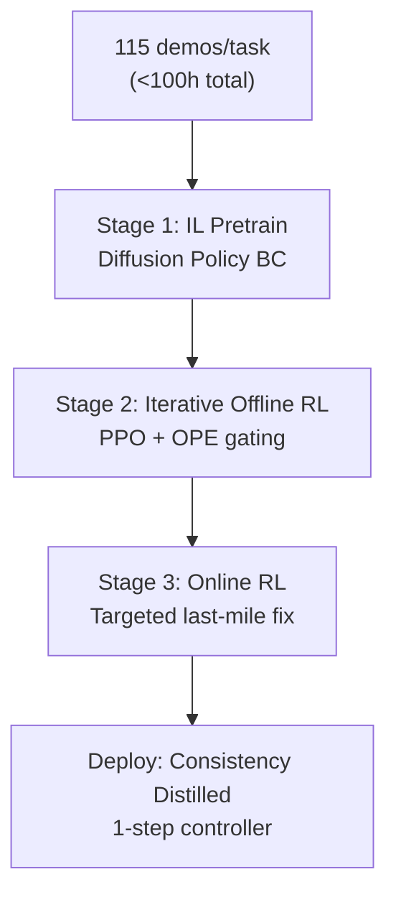

# RL-100: Performant Robotic Manipulation with Real-World Reinforcement Learning

- 本地 PDF：`papers/rl/RL-100_2510.14830.pdf`
- arXiv：https://arxiv.org/abs/2510.14830
- 年份：2026
- 发表：Science Robotics (2026.07)
- 团队：上海期智研究院 + 上海交大 + 港大 + 清华 + UNC + CMU + 中科院（Kun Lei, Huazhe Xu 等）
- 阶段：真实世界 RL 达到部署级可靠性 — IL+离线 RL+在线 RL 三阶段

## 一句话总结

RL-100 提出三阶段真实世界 RL 框架：(1) 模仿学习预训练（~115 demos/任务、总预算 <100 小时），(2) 迭代离线 RL（PPO 风格更新 + offline policy evaluation 门控），(3) 在线 RL 精调（<50 episodes/任务，消灭最后残余失败模式）。统一 clipped PPO surrogate 目标直接优化扩散去噪过程；轻量一致性蒸馏把多步扩散压缩为单步控制器。8 个真实任务（push-T、保龄球、倒水、叠毛巾、拧瓶盖、榨汁、叠盒子等）全部 1000/1000 成功率（含 250/250 连续 trial），榨汁机器人在商场连续 7 小时零故障服务，零样本环境迁移 ~90%、抗人为干扰 ~96%。Science Robotics 2026。

## 核心技术

1. **三阶段统一框架** — IL pretrain → 迭代离线 RL → 在线 RL，全部复用同一组演示数据（总预算 <100 小时）；每个阶段解决不同的失败模式：IL 解决"大体正确"，离线 RL 解决"系统性偏差"，在线 RL 解决"最后 1% 的 corner case"
2. **扩散感知的 PPO** — 统一 clipped PPO surrogate 目标直接作用于扩散去噪的每一步（PPO-on-denoiser），不额外修改架构：去噪过程的每步输出都是 PPO 的一个"动作步"
3. **Offline Policy Evaluation (OPE) 门控** — 每次离线 RL 更新后用 OPE 评估是否接受更新（conservative Q estimate），拒绝会降低真实性能的策略更新，防止 offline RL 的 distribution shift 崩溃
4. **一致性蒸馏** — 将多步 DDIM 去噪压缩为单步前向控制器，延迟降低一个数量级，精度无损

## 底层原理与数学推导

三阶段共享同一组演示数据。扩散策略的生成过程被展开为 PPO 的决策链：从噪声 $x_T$ 逐级去噪到动作 $x_0$，每步去噪 $x_{t} \to x_{t-1}$ 视为一个"动作步"。统一的 clipped surrogate 直接作用于去噪过程：

$$L^{PPO} = \mathbb{E}_t\left[\min\left(\frac{\pi_\theta(x_{t-1}|x_t, c)}{\pi_{\theta_{old}}(x_{t-1}|x_t, c)} A_t,\; \mathrm{clip}\left(\frac{\pi_\theta(x_{t-1}|x_t, c)}{\pi_{\theta_{old}}(x_{t-1}|x_t, c)}, 1-\epsilon, 1+\epsilon\right) A_t\right)\right]$$

与标准 PPO 的差异：策略比率为**去噪条件分布**的比率，而非单步动作分布——这是 diffusion policy 上 PPO 的自然推广（同族的 π0-RL 思路）。OPE 门控的形式为：每次离线更新后计算 conservative Q estimate $\hat{Q}$，仅当

$$\hat{Q}(\pi_{new}) \ge \hat{Q}(\pi_{old}) + \delta_{ope}$$

时才接受新策略。一致性蒸馏把 DDIM 的多步迭代 $x_T \to x_0$ 压缩为一步映射 $x_0 = h_\theta(x_T, c)$，通过约束 $h_\theta$ 与多步解的一致收敛：$L_{CD} = \mathbb{E}\left[ d(h_\theta(x_T, c), x_0^{DDIM}) \right]$。

## 物理直觉解释

**三阶段是"跟师学艺 → 题库刷题 → 考场实战"的完整闭环**。IL 预训练 = 跟老师学基本功：看 115 条演示，学会"大体正确的动作"——像学徒学会了基本刀工但不知道火候。离线 RL = 在题库上反复刷题但不出题范围：用同一批演示数据做 PPO 更新，策略在"见过的情形"里自我改进——像考生刷题，但刷的题都是见过的，容易形成"会做的越会做、不会的永远不会"。在线 RL = 少量实战：真机跑 <50 episodes，专门针对"模拟题覆盖不到"的 corner cases 修正——像考前最后一周做真题，专攻自己的薄弱题型。每个阶段的失败模式不同，所以缺一不可：IL-only 有系统性偏差（45.3-67.8%），加离线 RL 到 91.8%，但 8% 的残余失败只有真机实战才暴露。

**OPE 门控是"每次改作业前先自己估分"**。离线 RL 最大的风险是 distribution shift 崩溃：策略更新后，新策略访问的状态分布偏离了训练数据覆盖区，性能不升反降——就像**改卷前觉得这次考得很好，发下来发现全班退步**。OPE 门控在每次更新后先用 conservative Q estimate 预评估"这次改动值不值得"：估分低于阈值就拒绝更新。物理直觉是**工程上的"先模拟后动手"**——试错成本高（真机、时间）的场合，先用便宜模型预测后果再决定是否采纳。它把"每次更新可能崩"的风险变成了"更新被 OPE 拒绝"的可控事件，这是 1000/1000 背后最重要的保险丝。

**为什么"在线 RL 只花 <50 episodes 就够了"？** 因为前两阶段已经把策略推到 91.8%，残余失败模式是少数且具体的：某一角度会滑脱、某一步骤顺序错、某种光照下识别错。在线 RL 不需要从头探索——它只需要**在失败发生的瞬间学习**：失败轨迹 + 成功轨迹的对比就是最好的样本。这像**短跑运动员最后冲刺的微调**：不需要重新练起跑、摆臂、呼吸，只需要针对"最后 30 米掉速"这一个问题练几十次。50 episodes 恰好覆盖"每个残余失败模式至少遇到几次"的最小预算——这是三阶段框架样本效率的核心：探索预算只花在"已知不足"的地方，而不是均匀撒在整个任务空间。

## 工程细节与实操指南

- 演示数据：~115 demos/任务，总预算 <100 小时
- PPO update：clipped surrogate, epsilon=0.2，作用于扩散去噪每一步
- OPE：conservative Q-estimate，阈值 $\delta_{ope}$ 基于验证集设定
- 在线 RL：<50 episodes/任务，只针对残余失败模式
- 蒸馏：multi-step DDIM → 1-step forward，延迟降低 ~10×
- 硬件：UR5/Franka/xArm/LeapHand/Robotiq 等异构本体
- 部署验证：榨汁机器人商场连续 7 小时零故障；push-T 比人类遥操作专家快 18%

## 消融实验与分析

8 个真实任务的成功率（论文实验图，各阶段逐步累加）：

| 训练配置 | 成功率 (%) | 说明 |
|---------|-----------|------|
| DP-2D (2D 观测 IL) | 45.3 | 感知模态受限的 IL 基线 |
| DP3 (3D 点云 IL) | 67.8 | 3D 感知的 IL 基线 |
| + 迭代离线 RL (PPO + OPE 门控) | 91.8 | 离线 RL 解决系统性偏差 |
| **+ 在线 RL（三阶段完整）** | **100.0** | 消灭最后残余失败模式 |
| 零样本环境迁移 | ~90.0 | 新环境无微调 |
| 少量样本迁移（few-shot） | ~86.7 | 少量新环境数据 |
| 人为干扰条件下 | ~96.0 | 抗外部扰动 |
| 商场连续部署 | 7.0 小时 | 零故障服务 |

**核心结论**：(1) 三个阶段的边际贡献清晰——观测模态（2D→3D 点云）+22.5pp、离线 RL +24pp、在线 RL +8.2pp，每一层都解决不同层面的失败（感知 → 策略 → corner case）；(2) 在线 RL 的 8.2pp 虽然最小但最贵也最关键——它把 91.8% 推到 100%，是"demo 级"与"部署级"的分界线（250/250 连续 trial 零失败）；(3) OPE 门控的必要性体现在"离线 RL 不崩"——没有门控时离线更新可能在真实分布上退化（待确认：论文中门控的定量消融）；(4) 鲁棒性指标（零样本 ~90%、干扰下 ~96%、商场 7 小时）说明 1000/1000 不是在固定条件刷出来的——策略在分布偏移下仍保持高成功率，这是"部署级"的真正含义。

## 技术权衡（Trade-off）

| 优势 | 劣势 |
|------|------|
| 1000/1000 部署级可靠性（250/250 连续） | 三阶段训练时间长（总预算 <100 小时/任务），需 OPE 调参 |
| 统一 PPO surrogate 无需架构修改 | 在线 RL 仍有小概率不安全探索，需要人值守 |
| 一致性蒸馏 10× 延迟降低、精度无损 | 蒸馏在更复杂接触任务上的精度保持需进一步验证 |
| 异构本体（UR5/Franka/xArm 等）通用 | 每任务需 ~115 demos，任务数扩展到百级时数据成本线性增长 |

## 技术价值与演进定位

RL-100 标志着真实世界 RL 从"demo 级"跨入"部署级"：在此之前 RL for manipulation 的成功多是实验室录视频，RL-100 的 1000/1000（含 250/250 连续 trial）与商场 7 小时零故障把标准提到了"商用验收"的高度。它的方法论贡献是把三个成熟组件（BC、offline RL、online RL）串成带门控的管道，每一步都回答了"为什么不直接做下一步"——OPE 门控解决了离线 RL 的崩溃风险，在线 RL 的 <50 episodes 预算解决了探索成本。与"端到端在线 RL 从零学"的路线（样本效率低、安全风险高）相比，RL-100 证明了**安全可靠的路径是"预训练 + 受控改进"而非"自由探索"**。它和 TORL-VLA（部署期在线 RL）、Z-1（仿真 RL 后训练）共同构成"RL 后训练"谱系的三个端点：真实三阶段、真实在线、仿真后训练。

## 与其他论文的关系

- FlashSAC (RSS 2026 Best)：RL 底层算法，RL-100 的 PPO 变体可替换为 FlashSAC——本文关注管道架构而非基础算法创新。
- RL Token (Physical Intelligence 2026)：VLA + 轻量 RL 模块后训练，RL-100 的 IL+offline+online 三阶段更完整但依赖 <100h 数据预算——两者代表"模块级 RL"与"管道级 RL"两种粒度。
- SimDist (RSS 2026)：仿真蒸馏加速，与 RL-100 的一致性蒸馏互补——一个在 sim 内加速，一个在部署端加速。
- Z-1（任务级 GRPO）：同为 RL 后训练，Z-1 在仿真 RoboCasa 中按任务分治，RL-100 在真机上按阶段分治——"按任务"与"按阶段"的两种拆解方式，可组合。
- π0 / diffusion policy 家族：RL-100 的 PPO-on-denoiser 与 π0-RL 同族，是"扩散策略 + RL"路线的独立验证。

## 精读问题

1. **OPE 门控的 false positive/negative**：接受坏更新的概率与拒绝好更新的概率如何权衡？$\delta_{ope}$ 阈值在任务间的迁移性——是否每个任务都要单独调？
2. **在线 RL 的安全性**：<50 episodes 的在线探索如何保证安全？探索动作的边界（力/速度限制）如何设定，是否有人值守协议？
3. **一致性蒸馏的精度-速度曲线**：蒸馏到 1-step 后，与 10-step/50-step 的 DDIM 相比成功率差多少？蒸馏损失的选择对接触任务（力峰值）的影响？
4. **三阶段能否压缩**：跳过离线 RL 直接从 IL 到在线 RL（两阶段）的性能差多少？离线 RL 的 24pp 里有多少是"OPE 门控"本身而非"离线更新"贡献的？
5. **数据预算的扩展性**：~115 demos/任务在任务规模扩大到 100 个时是否线性扩展？离线 RL 能否用仿真数据替代部分真实 demo（对比 Z-1 的纯仿真路线）？
6. **鲁棒性的边界**：零样本 ~90% 与干扰下 ~96% 的失败样本集中在什么场景（光照、遮挡、物体变体）？这些失败模式是否与"训练分布外的物理"（新摩擦、新刚度）有关？
