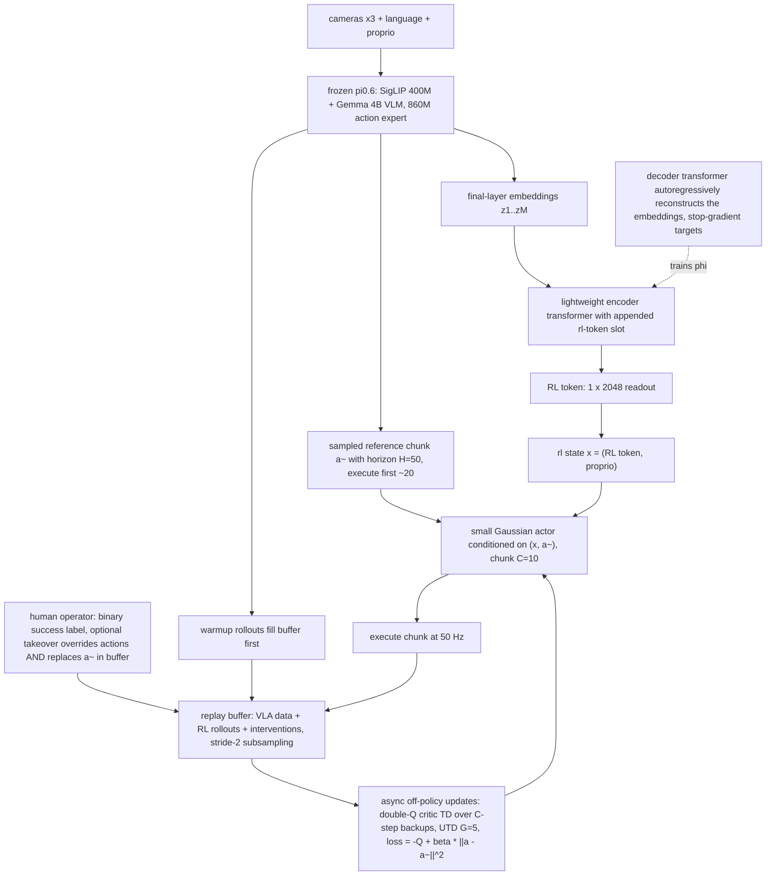

# RL Token：用冻结 VLA 引导在线 RL 自举的轻量微调接口（RLT）

- 本地 PDF：`papers/rl/RL_Token_2604.23073.pdf`
- arXiv：https://arxiv.org/abs/2604.23073
- 年份：2026（arXiv v2 2026-04-30，IEEE 会议模板，venue 未注明，待确认）
- 团队：Physical Intelligence（Charles Xu、Jost Tobias Springenberg、Sergey Levine、Liyiming Ke 等）；项目页 https://pi.website/research/rlt
- 阶段：real-world 在线 RL 微调层——不改 VLA 权重，为它装一个可被小 actor-critic 快速学习的"读出接口"

## 一句话总结

在冻结的 π0.6 上训一个 encoder-decoder transformer，把 VLA 最终层的海量 embedding 压成单个 1×2048 的 RL Token 作为小 actor-critic 的状态输入；actor 以 VLA 参考动作 chunk 为条件并被 β 正则锚在其附近，配合 reference dropout 防止照抄——四个毫米级精度真机任务上只用 15 分钟到 5 小时机器人数据，把最难的螺丝安装成功率从 20% 拉到 65%，关键阶段提速最高 3×，Ethernet 中位完成时长甚至反超专家遥操作（66 步 vs 146 步，Fig 9）。

## 核心技术

1. **RL Token 读出模块（Sec IV-A）**：给预训练 VLA 外挂一个小 encoder-decoder transformer。把学到的 `<rl>` 占位 embedding 追加到 VLA 最终层 token 序列末尾，encoder 输出在占位位置的向量即 RL Token $\mathbf{z}_{rl}$；decoder 只凭这个 bottleneck 向量自回归重建原始 embedding，重建目标全部施加 stop-gradient——因此压缩是有损但信息保真的：能被还原的特征才是策略真正需要的特征。
2. **VLA 三重角色**：冻结后同时充当 (a) 感知表征来源（token 从它里面蒸出来）、(b) 行为先验（每步采样参考动作块 ã）、(c) 探索锚点（正则把 actor 拴在参考附近）。
3. **chunk 对齐的 TD3 式 actor-critic（Sec III/IV-B）**：VLA 出 $H=50$ 步（1 秒）的块、执行期只开环执行前约 20 步；RL actor 直接输出 $C=10$ 步的更短块（50 Hz 下 14 维单步 → 140 维块），$C<H$ 让策略更 reactive。critic 是 TD3 式双 Q 取 min 的集成，TD 备份按 C 步块级展开；off-policy 更新使 VLA warmup 数据、RL rollout、人工接管数据可以共用一个 replay buffer。
4. **Reference action dropout**：训练时以 50% 概率把输入中的参考块置零，迫使 actor 保有一条独立生成路径，避免"critic 还没学会时就只会复读"；推理时参考永远提供。
5. **关键阶段局部化（Sec V）**：RL 只负责每个任务中精度最高、base VLA 最常失败的 5–20 秒片段，其余段落仍由 base VLA 执行；交接时机由操作员在采集时手工指定，训练结束时再对 VLA 微调一个 handover 预测器（用人工干预作标签），测试时自动触发切换。
6. **数据与系统工程**：replay 聚合三类来源（warmup、autonomous rollout、human takeover 且接管时替换参考动作存入 buffer）；按 stride 2 子采样中间步骤成多条块转移（每秒数据 ≈25 条样本）；rollout 与学习异步执行。

## 底层原理与数学推导

设 VLA 对状态 $s$ 与指令 $\ell$ 输出的最终层 embedding 为 $\mathbf{z}=f(s,\ell;\theta_{vla})$，其逐 token 分解为 $\mathbf{z}_{1:M}$。追加可学习占位向量并过轻量 encoder：

$$\mathbf{z}_{rl}=g_\phi\big([\mathbf{z}_{1:M},\ e_{rl}]\big)_{M+1}$$

训练目标是让这个小向量独自撑起整个序列的自回归重建（$\bar{\mathbf{z}}_i=\mathrm{sg}(\mathbf{z}_i)$ 表示 stop-gradient）：

$$\mathcal{L}_{ro}=\mathbb{E}_{\mathcal{D}}\Big[\sum_{i=1}^{M}\big\|h_\phi\big(d_\phi([\mathbf{z}_{rl},\ \bar{\mathbf{z}}_{1:i-1}])\big)-\bar{\mathbf{z}}_i\big\|^2\Big]$$

联合微调阶段同时优化 $\phi$ 与 $\theta_{vla}$（Algorithm 1：$\arg\min\ \mathcal{L}_{ro}+\alpha\mathcal{L}_{vla}$），随后两者一起冻结进入在线 RL。

critic 学的是块级价值。对状态输入 $x=(\mathbf{z}_{rl}, s_p)$ 与动作块 $a_{1:C}$ 做 TD 学习，backup 目标把 C 步稀疏回报折现加一块 bootstrapping：

$$\hat Q=\sum_{t'=1}^{C}\gamma^{\,t'-1}r_{t'}+\gamma^{C}\,\mathbb{E}_{a'\sim\pi_\theta}\big[Q_{\psi'}(x',a')\big]$$

actor 是条件高斯，均值网络同时吃状态和 VLA 参考块（这正是 RLT 与残差方法的分水岭——参考不是加法项而是条件输入）：

$$\pi_\theta\big(a_{1:C}\mid x,\tilde a_{1:C}\big)=\mathcal{N}\big(\mu_\theta(x,\tilde a_{1:C}),\ \sigma^2 I\big)$$

优化目标由两部分拉锯：提高 critic 估值 + 保持在参考块附近（系数 β 控制）：

$$\mathcal{L}_\pi(\theta)=\mathbb{E}\big[-Q_\psi(x,a_{1:C})+\beta\,\|a_{1:C}-\tilde a_{1:C}\|^2_2\big],\qquad \tilde a_{1:C}\sim\pi_{vla}(\cdot\mid s,\ell)$$

三条设计的量化动机：
- **为什么必须 chunk 化**：全任务 30–120 s（50 Hz 下 1500–6000 控制步），人工给的稀疏二值奖励只出现在结尾；若 actor 逐步输出（C=1），credit assignment 要跨越上千步的折扣链，几乎不可能在几百个 episode 内传播。块级 backup 把有效决策时域直接除以 C=10，且正好嵌入 VLA 原生接口。
- **为什么参考要 dropout**：条件输入与正则项都在鼓励"贴近参考"，早期 critic 无信号时两条力叠加会把 actor 退化成拷贝器；随机抹掉一半样本的参考等于强制保留一条不依赖参考的策略分支，待 critic 变得 informative 后自然分化出偏离行为。
- **β 正则与 KL-regularized RL 的关系**：论文自述"in spirit similar"于 MPO/AWR 一族的最大后验策略优化（引 [20][37-40]）；区别在于惩罚项落在动作空间而非分布层面，形式上是平滑的行为克隆约束而不是严格的 KL 散度。

## 物理直觉解释

**第一段｜老师傅与调校学徒**。π0.6 就像一个**见过十万小时工活的老师傅**：整体流程烂熟于心，该走哪条路径、往哪个方向使劲都有判断，但到了最后一毫米就手抖——放慢、试探、缩回来再试（论文称之为 "probing"）。RLT 给他配了一个学徒：学徒只盯最难的那一段工序，手很笨（两层 MLP）但重复一万次也不烦（off-policy 重放）。学徒开工前必须先看师傅的手势建议（参考块作输入），出厂要求是"成品不能离师傅的做法太远"（β 约束）。于是改进的动力不来自学徒的天赋，而来自师傅提供的先验起点足够好——好到只需局部修正就能显著加速。

**第二段｜仪表盘而不是发动机舱图**。为什么不直接拿 VLA 内部几千维 embedding 当 RL 状态？因为那相当于把整个发动机舱的五千根线拍在学徒面前——线性探针实验早已表明这些层里有大量与当前任务无关的信息。RL Token 相当于在驾驶舱里装了一块**12 个指示灯的仪表盘**：训练 decoder 强行要求这盏灯亮灭组合足以"讲清楚"舱内发生了什么，所以剩下的都是任务相关的浓缩信号；尺寸（1×2048）又小到两层 MLP 的小网就能消化。Ablation 中换成 ImageNet 预训练 ResNet-10 吞吐立刻减半，恰恰证明这块仪表盘的价值来自 VLA 的任务知识，而不只是"有个视觉编码器"。

**第三段｜参考 dropout 是防止抄作业**。条件化输入和 β 正则都是从同一方向使劲——拉住actor别跑远。这在生命早期是保护（critic 还没学问，乱动必死），在中期却是天花板（最省力的解就是原样复读参考块，探索停止）。dropout 的作用像老师在练习册上**隔几题就不给例题**：强迫学生自己至少会写一遍答案，例题恢复了再对照订正。论文的观察与此完全吻合——去掉 pass-through 后 Ethernet 任务最终也能追平性能，但学习更慢、过程中失败明显更多。

**第四段｜为什么在真实机器人上几小时就够**。三个乘数效应叠在一起：VLA warmup 让初始数据分布已经是"接近成功"的轨迹（不再从零摸索）；稀疏奖励通过 C 步块级 TD 少跳了 9 成的信用传导距离；UTD=5 加 stride-2 子采样把每一秒的真实经验重复榨取约 25 份梯度样本。真实机器人的瓶颈从来是墙钟时间而不是 GPU 时间，这套设计把所有昂贵的事（感知、表征、粗规划）都挪进了冻结模型，留给在线学习的只有一小段修正量——这是它能用 15 分钟数据起步的本质原因，也解释了为什么再往上抬 UTD 会成为下一个值得动的旋钮。

## 工程细节与实操指南

- **基座模型**：π0.6（SigLIP 400M 视觉塔 + Gemma 4B 语言骨干 + 860M 扩散 action expert），$H=50$ 步动作块对应 1 s 控制；控制频率 50 Hz，单步动作 14 维 → actor 输出 140 维块。
- **适配流程**：每任务采 1–10 小时遥操作 demo → 同时做 VLA 微调与 RL Token 训练 2000–10000 梯度步（是否联训 VLA 由权重 α 决定）→ 冻结两者 → warmup 用纯 VLA rollout 预填 buffer → 异步在线 RL。
- **网络规模**：zip tie / Ethernet / charger 用两层 MLP（hidden 256），screw 安装加大到三层 512；critic 按 TD3 用双 Q 集成取 min 作 target；每次 actor 更新配两次 critic 更新，全局 UTD G=5。
- **奖励与人机接口**：稀疏二值（人工判定 episode 终点成功/失败）；接触密集或危险段允许人工遥操接管，接管指令会替换 buffer 里存的参考动作从而使 off-policy 学习覆盖人工示范数据。
- **关键段协议**：critical-phase 评测从任务中途、随机化的阶段前初态开始（如 zip tie 任务开始时已握住两端），每 agent 测 50 episodes，以此隔离高精度段；full-task 评测从 home 位置起跑、经 base VLA 过渡进关键段，考验跨段鲁棒性。screw 与 zip tie 两难任务先只在 critical-phase 训练再加小随机化过渡到 full-task。
- **训练预算**：每任务 400–1000 episodes，实际机器人交互 15 分钟–5 小时（不含 reset 与开销）；screw 与 zip tie 两难任务先只在 critical-phase 训练、再过渡到 full-task 两阶段训练，其最终报告的性能对应约 5 小时累计数据；RM token 之外的全部可学习参数不到百万级（两个小 MLP + tokenizer），待确认：paper 未给出 RL Token 训练的具体参数量与单步推理延迟。
- **自主化收尾**：训练结束后用人工干预记录当标签微调 VLA 的 handover 预测器，部署时自动在正确时刻把控制权交给 RL 策略——不需要测试期再有人在旁边按键。

## 消融实验与分析

**组件消融（Fig 7/Fig 8 + Sec VI-C Q3 文字，均基于 Ethernet 关键阶段）**

| 消融变体 | 关键量化结论 |
|---|---|
| RLT 完整 | 仅 5 分钟数据即超过全部替代方案（总实验约 40 分钟），吞吐最高 |
| w/o RL Token（换 ImageNet 预训练 ResNet-10） | 吞吐下降 50% |
| w/o Chunk（C=1 单步 + 被迫换 ResNet 编码器） | 无法稳定达到 base policy 性能，credit assignment 链路被拉长至失效 |
| w/o BC Regularizer（β=0，仅靠 Q 梯度探索全动作空间） | 所有单项中跌幅最大 |
| w/o Pass-Through（去掉参考块输入，仅状态生成） | 最终能追平 RLT，但学习显著变慢、训练过程失败更多、偶发退化行为 |

**核心结论**：四个组件全部有正向贡献且重要性排序大致为 BC 正则 > 块结构 ≥ RL Token 表征 > 参考输入通路。前两项决定"能不能在小时内学到东西"，后两项决定"学习过程有多平稳"。特别值得注意的是 β=0 的后果——actor 必须在整个 140 维动作空间里靠 critic 梯度盲搜，说明参考锚定才是这个方法在真实低数据环境中生存的前提，而不是锦上添花的稳定技巧。

**执行速度：Ethernet 关键阶段的 episode 时长分布（Fig 9，单位：timesteps，50 Hz）**

| 执行者 | 中位 episode 时长 | 相对解读 |
|---|---|---|
| 专家遥操作演示 | median = 146 | 人类上限参照 |
| Base VLA policy | median = 228 | 比专家慢约 56% |
| RLT 训练后的策略 | median = 66 | 比专家快 2.2×，比 base 快约 3.45× |

**核心结论**：加速不是来自"少失败"而是出现了质变的策略形态——base 策略反复靠近-回退-重试地 probing，RLT 则一气呵成插入，首次尝试失败时会施压并轻微晃动连接器利用柔性间隙，这种利用 compliance 的行为在演示数据中不存在、纯粹由在线探索涌现。文中称整个任务集的关键阶段最高提速 3×，Ethernet 这一档实测中位数已达 3.45×。

**与替代 RL 方法的对比（Fig 6，Ethernet 任务，50 episodes/agent）**

| 方法 | 成功率表现 | 吞吐表现 | 失败原因分析 |
|---|---|---|---|
| Base Policy | 高 | 基准线 | probing 导致慢 |
| DAgger（用干预数据继续 SFT） | 与 RLT 相当 | 明显低于 RLT | 上限即人类演示速度 |
| HIL-SERL（ResNet + 小网 off-policy） | 学习失败 | 极低 | 原 10 Hz 设计搬到 50 Hz + 缺少动作空间 bounding box |
| PLD（单步残差 + Cal-QL critic 预训练） | 学习失败 | 极低 | 单步 + 长时域 credit assignment 崩溃 |
| DSRL（扩散噪声空间的潜变量 RL） | 与 RLT 相当 | 显著落后 | 探索被强约束在 VLA 可生成的模式集内，改善空间封顶 |
| RLT | 与 base 同级且高 | 最高（较 base 平均步数降 2×） | – |

**核心结论**：单步方法（HIL-SERL、PLD）在这种数百步、稀疏奖励的任务上直接不可学——它们都是为短时域任务设计的；DSRL 与 DAgger 能保成功率但都触到各自的天花板（探索范围 / 人类速度）。RLT 的独特点是同时守住成功率与拉开速度差距：成功率来源于向 VLA 锚定，速度来源于 chunk 化带来的宽松探索间隔。

**主结果汇总（Abstract + Sec VI-C）**

| 指标 | 数值 |
|---|---|
| 最难螺丝安装任务成功率 | 20% → 65% |
| 关键阶段最大提速 | 最高 3×（Ethernet 实测 3.45×） |
| Full-task 成功率相对提升 | 螺丝 +40%、zip tie +60% |
| 数据效率 | 15 分钟–5 小时真实机器人数据 |

**核心结论**：收益集中在两轴——可靠性（成功率的绝对跃升，尤其是原本几乎不可用的精度段）与节奏（throughput 的数倍放大）。full-task 提升小于 critical-phase 提升的原因论文归因于前段 grasping/transport 引入的状态方差会复利放大，这也划定了该方法当前的适用边界。

## 技术权衡（Trade-off）

- **人机监督仍在闭环里**：稀疏二值奖励靠人工判、切换点靠人工标、修正靠接管——与 Fully autonomous 的 RL-100 目标相比仍差一步。作者给出的自动化路线是 reward model + 进度预测，但这会把评测负担转移为一个可能更好也可能引入偏差的学习问题。
- **冻结 VLA 决定了改进上界是"局部修正"**：RLT 只修关键阶段，前面抓取搬运段完全依赖 base 质量；full-task 数字被 compounding error 拖累正是代价的直接体现。它不会教系统全新的任务级策略，只会更快更好地完成已有雏形的那个段。
- **表征瓶颈的双刃剑**：1×2048 的压缩保住了轻量学习，但也意味着 critic/actor 只能看到 VLA 选择讲述的那部分世界；如果某个精度线索在最终层 embedding 里表达得很弱（例如某些力反馈相关量），RL 将无法恢复它。作者没有提供 token 信息保留度的直接度量（待确认：无 probed-information 分析）。
- **C=10 与 H=50 的失配间隙**：RL 块比 VLA 块短意味着每秒要在 VLA 只计划一次的窗口里做出多个块级决策，参考块只能覆盖其中一部分时段；reactive 性换来的这一截未覆盖区间如何处理（复用最后一段参考？重新调用 VLA？）论文未明说。
- **β 的静态设定**：固定 β 在后期可能锁死超出 VLA 流形的大幅改进（DSRL 反思过的那类保守性也部分存在于这里），训练中期之前则是安全带；没有任何关于 β 扫描或退火调度的实验披露。

## 技术价值与演进定位

这篇工作的定位卡在两条成熟路线之间找到了第三条缝：全模型 RL（RECAP 的 offline RL 优势提取、各类 PPO on-policy 变体、SimpleVLA-RL）威力大但要花大量算力与数据，难以塞进"几小时真机时间"预算；而 SERL/HIL-SERL/RL-100 一派的轻量真机 RL 已经证明了速度与样本效率，代价是从头训练小模型、浪费掉现代 VLA 的通用先验。RLT 的贡献是把这两者的交换成本降到近似零：VLA 完全不动，只多付一个 tokenizer 级 adapter 的训练费，换来一个天然携带任务语义的低维状态和一个高质量行为先验。它的三个具体技术选择都针对 real-world 低样本场景立论——chunk 对齐原生接口（缩短 credit assignment 路径）、参考动作作为条件而非残差（显式保模态信息，单峰高斯头才能吃到 VLA 的多峰分布）、BC 锚定（把在线搜索限制在局部精修域）。从 Physical Intelligence 内部谱系看，它与 RECAP 分别覆盖"长时程家务吞吐"与"毫米级精密段"两个互补 regime，也与库内 FlashSAC、SimpleVLA-RL 共同构成 "RL for VLA" 主线的三张面孔：改接口、改权重、改优化稳定性。

## 与其他论文的关系

- **FlashSAC（库内 `notes/rl/flashsac.md`，RSS 2026 Best Paper）— UTD 与表征的分工**：FlashSAC 解决的是"off-policy 高 update-to-data 下怎么不崩"，RLT 用的是相当温和的 UTD=5（TD3 双 Q + 目标网络的老配置），把样本效率主要押注在状态表征质量与行为先验上。两条工作合读自然提出的问题：RLT 若直接换用 FlashSAC 式的高 UTD 稳定机制，五分钟数据的优势还能再压多少。
- **SimpleVLA-RL（库内 `notes/rl/simplevla-rl.md`）— 全参 vs 接口**：SimpleVLA-RL 更新整个 VLA 权重以放大 exploration 多样性，适合仿真/大规模算力条件；RLT 冻结主干换取真机小时级的可行性。两者的奖励利用方式也不同：前者 typically dense/verifiable 训练信号，后者只用人工终局标签。
- **RECAP（π*0.6, [3]）— 同门分治**：同属 PI 的"VLA 学会从经验进步"路线，RECAP 用 distributional value function + advantage-conditioned extraction 端到端更新全模型，面向 espresso/叠衣/装箱类长时程任务；RLT 则拒绝更新模型、深耕精密段的在线精修。官方叙事下二者覆盖不同需求，工程团队选型时应按任务长度与精度敏感度分流。
- **HIL-SERL（[4]）— 前一代范式与直接 baseline**：干预机制、replay 组织、稀疏人工奖励整套真人协作管线都被 RLT 继承，差异只在感知编码器（ResNet-10 vs RL Token）与动作参数化（逐步 vs chunk）；它在 50 Hz + 高维动作下彻底失败的细节（频率不匹配 + 缺 bounding box）是对"旧配方搬到新设置不行"的最直白注脚。
- **PLD（Probe-Learn-Distill, [30]）— 残差思想的近亲**：同样在冻结 VLA 上挂小模块，但 PLD 输出单步残差、依赖 Cal-QL 预热 critic，本实验中学不会 Ethernet；差别在于 RLT 不做加法残差、不做蒸馏收尾、用块级 TD 直接取代离线预训练。
- **DSRL（[32]）— 两种约束策略的对照实验**：DSRL 在扩散噪声空间里挑 noise 以保持动作总在 VLA 支持集内——探索自由度受支持集大小限制；RLT 的参考锚定是软惩罚而非硬支持集，因此能看到超越 VLA 分布的策略涌现（wiggle/compliance 行为）。Ethernet 上两者成功率同级、吞吐差距显著正是这一理论差异的实证。
- **GR-RL（[2]）— 扩散噪声空间的另一端**：先 filtered BC 再在线学 noise predictor 来驾驭长程系鞋带任务；同为"局部参数改造"，GR-RL 作用于去噪链内部，RLT 作用于策略外部输入输出端，选择取决于想改造的是动作的纹理还是任务的节律。
- **ConRFT（[28]）/ Policy Decorator（[29]）— 轻量路线的同代者**：ConRFT 用 consistency objective 微调动作头但限单步短程任务；Policy Decorator 的带超参残差只在仿真验证、需百万步量级样本。RLT 把"不改大模型"推到了真机小样本这个此前无人站稳的位置。

## 精读问题

1. **β 是否应该随训练退火**：固定 β 在后期会不会把策略永久锁在 VLA 流形邻域，从而错过类似"wiggle 利用柔性"这类远离示教的策略？对比 DSRL 已显示硬约束损害上限——一个 κ→0 或随 critic 误差自适应衰减的调度能否既保早期稳定又不封顶？
2. **RL Token 的信息保真度审计**：decoder 重建 MSE 收敛意味着什么级别的信息保留（像素级姿态？物体位姿？接触状态）？做一个 linear probe / 信息瓶颈分解，比较 token、最终层平均池化、以及视觉编码器 CLS 三种读出的下游 RL 效率，能否给出"多大维度才够"的定量边界？
3. **C 与 H 的失配区间的处理**：C=10 而 H=50 且只执行前 20 步——块尾那几步的参考已经不可信，策略此刻是在外推吗？块边界处 state discontinuity 与 VLA re-plan 频率的相互作用有没有更优的组合（例如异步预取下一块参考）？
4. **切换点的可学习性**：现在 handover 由人在回路标注、事后蒸馏为预测器；如果把"进入关键段"本身建模为 option/hierarchical RL 里的终止函数，用已学的 critic 值梯度（value 进入快速上升段的拐点）自动发现切换时机，能否去掉全程的人工在场？
5. **奖励外的崩溃信号**：人工只给成功/失败二值，那么鲁棒性指标（接近碰撞、过度用力、非预期接触）完全不可见；是否能廉价地把 intervention flag 或操作员连续按压时长作为辅助 shaping，而不破坏稀疏奖励的可信性？
6. **跨任务迁移与 Token 复用**：四个任务各训一套 token 还是共享？encoder-decoder 若做多任务联训，$\mathbf{z}_{rl}$ 是否会出现任务混淆；反向问题——新任务冷启动时，旧 token 作为初始化值多少个梯度步（对照现在从头 2000–10000 步的预算）？
