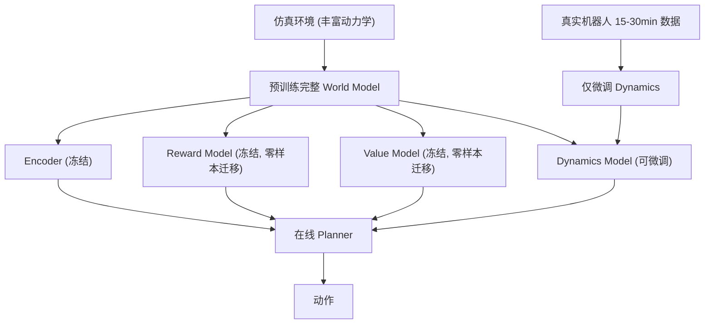

# SimDist: Simulation Distillation — Pretraining World Models in Simulation for Rapid Real-World Adaptation

- 本地 PDF：`papers/architecture/SimDist_2603.15759.pdf`
- arXiv：https://arxiv.org/abs/2603.15759
- 代码：https://github.com/CLeARoboticsLab/simdist
- 年份：2026 (RSS 2026)
- 团队：UT Austin, UW Seattle, FieldAI
- 阶段：仿真蒸馏世界模型 —— 在仿真中预训练，15-30 分钟真实数据快速适应

## 一句话总结

SimDist 提出仿真蒸馏框架：在仿真中预训练完整世界模型管线（编码器 + 动力学 + 奖励 + 价值），将结构化先验蒸馏到 latent world model。真实部署时仅用 15-30 分钟数据微调 latent dynamics（监督式系统辨识），编码器与 reward/value 模型零样本迁移。仿真消融中 Peg Insertion 成功率 0.90（数据减半即跌至 0.72、10% 数据仅 0.06），真实任务中成功/分钟吞吐相对 zero-shot 提升约 1.5-2×。RSS 2026。

## 核心技术

1. **仿真蒸馏** — 在仿真中预训练完整的 world model pipeline（encoder + dynamics + reward + value），蒸馏结构化先验
2. **仅微调 dynamics** — 真实世界适应只做短视程监督学习（system identification），reward 和 value 模型零样本迁移
3. **在线规划** — 用微调后的 world model 做 counterfactual reasoning，通过 planner 在线规划动作
4. **避免长视程信用分配** — 将真实世界 RL 问题降为短视程动力学监督学习

## 底层原理与数学推导

核心洞察：真实世界适应的瓶颈是动力学建模（仿真和物理的 gap），不是奖励设计或价值估计。只需在真实数据上做短视程系统辨识，无需端到端 RL。真实适应阶段的优化目标即为最小化真实数据上的 latent 预测误差：

$$
\min_{\phi} \; \mathbb{E}_{(o_t, a_t, o_{t+1}) \sim \mathcal{D}_{\text{real}}} \left[ \left\| f_\phi(z_t, a_t) - z_{t+1} \right\|_2^2 \right], \quad z_t = E_\psi(o_t) \quad (\text{仅微调 } \phi, \text{编码器 } \psi \text{ 冻结})
$$

在线规划用 MPPI 在微调后的世界模型中做 counterfactual reasoning——采样候选动作序列并用冻结的 reward/value 模型评分：

$$
a^* = \arg\max_{a_{t:t+H}} \sum_{k=0}^{H} \gamma^k \, \hat{r}(\hat{z}_{t+k}) + \hat{V}(\hat{z}_{t+H})
$$

## 物理直觉解释

**SimDist 的逻辑：仿真器里的物理不够真，但它提供的"什么是好状态"和"什么是好动作"的判断是通用的**。就像你学了汽车仿真器驾驶，虽然仿真器的物理不完全准确，但你知道"不撞车=好"这个判断在真实世界也成立。你在真车上只需要适应刹车的力度和方向盘的灵敏度（动力学），不需要重新学交通规则（奖励函数）。SimDist 把世界模型模块化正是为了这个分工：encoder（怎么看世界）、reward（什么好）、value（前景如何）从仿真中蒸馏而来并冻结，只有 dynamics（世界如何响应动作）在真实数据上微调——真实适应从"端到端 RL 的长视程信用分配"降维成"短视程监督学习"。

**为什么端到端微调会崩而"只调动力学"不会？** 端到端策略微调把任务表征、奖励/价值估计、动力学、动作选择全部纠缠在一起更新，真实数据一进来就整体重学，长视程信用分配问题（哪个动作该为 10 秒后的成功负责）让更新极其脆弱——论文明确指出 RLPD/IQL/SGFT 等方法在在线微调中"collapse 或无法取得实质进展"。而 SimDist 只更新"动作 → 下一个状态"这一小段映射，其余决策结构原样保留，再用 MPPI 规划器做大量**反事实推演**（想象机器人没走过的轨迹），把每次真实交互的信息利用到极致。仿真消融给出了量化证据：数据量减半（50% data）Peg Insertion 从 0.90 跌到 0.72，减到 10% 只剩 0.06——数据量对"从头学"是致命的，但对"只校准动力学"是充裕的。

**"重构损失反而有害"是 SimDist 最反直觉的发现**。给训练目标加上像素重构损失（很多 MBRL 的标配）后，四足任务略升（23.34 vs 22.78）但操作任务暴跌（Peg Insertion 0.32 vs 0.90）——因为像素重构会逼迫 latent 编码与任务无关的细节（光照、纹理），稀释掉"评估候选动作"所需的结构信息。这说明世界模型的 latent 表示应当"为规划而生"而非"为重建而生"，与 WEAVER/JEPA 一系的表示设计哲学一致。

## 消融实验与分析

仿真消融（TABLE I）报告操作任务成功率（SR）与四足任务每 episode 平均奖励：

| 消融因子 | Peg Insertion (SR) | Table Leg (SR) | Quadruped (Reward) |
|---------|-------------------|----------------|-------------------|
| SimDist 完整 | 0.90 | 0.85 | 22.78 |
| 数据量 50% | 0.72 | 0.61 | 22.73 |
| 数据量 10% | 0.06 | 0.02 | 19.38 |
| 仅专家数据（无次优 rollout） | 0.10 | 0.05 | 16.68 |
| MLP reward+value 模型（无轨迹级结构） | 0.82 | 0.60 | 19.47 |
| 加像素重构损失 | 0.32 | 0.21 | 23.34 |

真实任务补充验证：

| 对比维度 | 设置对比 | 关键结果 |
|---------|---------|---------|
| 真实适应数据量 | 15-30 分钟真实数据 vs 端到端 RL 基线（RLPD/IQL/SGFT-SAC） | 基线在线微调中崩溃或无实质进展；SimDist 单调提升 |
| 训练吞吐 | 成功/分钟 vs zero-shot | 单调提升约 1.5-2× |
| 示教数据融合 | SimDist vs SimDist+BC（+20 条遥操作示教） | 提供示教只增不减，能自然吸收混合质量数据 |
| 初始条件分布 | 窄分布 vs 宽分布（Peg Wide→Hard） | 任务越难差距越大，凸显广域仿真预训练先验的价值 |
| 策略基线 | Diffusion Policy / π0.5（100 条真实示教） | SimDist 以少得多（20 次 episode 级）的数据在 Peg Hard 上鲁棒性更优 |

**核心结论**：消融链条给出三个明确信号——(1) **数据量是"从头学"的生死线**：50% 数据 Peg Insertion 已跌至 0.72，10% 数据崩到 0.06，而 SimDist 只靠"校准动力学"就在 15-30 分钟真实数据下稳定提升；(2) **轨迹级结构不可替代**：MLP reward+value（逐步模型）比完整 SimDist 低 0.08-0.25，因为规划需要评估整条候选轨迹而非单步；(3) **重构损失是负资产**：像素重构使操作任务 SR 从 0.90 暴跌至 0.32（四足仅微升），证明 latent 表示应服务规划而非重建。三者共同解释了"为什么模块化世界模型 + 仿真蒸馏"能同时获得样本效率与稳定性。

## 工程细节与实操指南

- **仿真预训练**：多样化仿真环境（不同摩擦力、质量、几何），训练 encoder + dynamics + reward + value；专家策略 + 次优 rollout + 动作扰动生成数据
- **真实适应**：仅 15-30 分钟真实数据，监督学习微调 dynamics model（每 20 个真实 episode 更新一次）；编码器、reward、value 全部冻结
- **在线规划**：MPPI (Model Predictive Path Integral，TD-MPC 实现) 在世界模型中做 counterfactual reasoning
- **任务**：Peg Insertion (Wide/Hard)、Table Leg 插装 + Slippery Slope（3.0°/5.7° PTFE 面板，1.82m）、Foam（5cm 记忆海绵，3.00m，仿真未建模的柔顺动力学）
- **Baseline**：RLPD、IQL、SGFT-SAC（均给 20 条示教）、Diffusion Policy、π0.5（100 条示教）

## 精读问题

1. 仿真和真实之间的 dynamics gap 在哪些维度最大（摩擦、刚度、延迟）？只微调动力学能否覆盖所有维度，还是某些维度需要重训 encoder？
2. Reward model 如果和真实任务目标不一致怎么办？论文承认冻结 reward/value 会在价值函数饱和时封顶性能——何时该解冻、如何检测？
3. 15-30 分钟数据量是否对所有任务类型都足够？Foam 这类仿真完全未建模的柔顺动力学是否逼近了"仅微调动力学"的边界？
4. MPPI 的采样数与规划视界如何与模型误差权衡？世界模型误差在长视界规划中如何累积？
5. 重构损失对四足有益（23.34 vs 22.78）却对操作有害（0.32 vs 0.90）——这个任务依赖的反差机制是什么？是否存在"部分重构"的折中方案？

## 技术权衡（Trade-off）

| 优势 | 劣势与工程代价 |
|------|----------------|
| 15-30min 数据即可适应，样本效率极高（吞吐 +1.5-2×） | 需要一个较好的仿真器用于预训练（数据减半性能即明显下滑） |
| 世界模型中的 planner 保证在线安全 | 冻结 reward/value 可能在价值函数饱和时封顶性能（论文自认） |
| 避免端到端 RL 的不稳定性（基线在线微调崩溃） | 仅微调 dynamics 可能不足以处理仿真中完全未覆盖的物理现象（如 Foam 柔顺动力学） |

## 技术价值与演进定位

SimDist 代表了 "world model + sim-to-real" 路线的最佳实践——证明了仿真预训练的价值可以被**结构化地蒸馏**到世界模型中：不是蒸馏策略本身（策略会在 sim-to-real 中崩溃，图 1 的 zero-shot failures），而是蒸馏"评估决策"所需的三件套（encoder/reward/value），把最脆弱的动力学留给真实数据校准。这一分工的深层意义在于重新定义了 sim-to-real 适应的复杂度：传统端到端 RL 微调要同时解决任务表征、信用分配、动力学辨识三个纠缠的问题，SimDist 证明其中两个可以提前在仿真中解决（数据减半实验 0.90→0.72 的平缓退化即是证据），剩下的系统辨识是监督学习级别的任务。与 RISE（想象中 RL）和 DayDreamer（真实世界在线学习）形成三条互补路线：SimDist 从仿真出发，RISE 从想象出发，DayDreamer 从真实出发——三者的交汇点是"世界模型作为策略改进的媒介"，而 SimDist 提供了其中最省真实数据的一条。

## 与其他论文的关系

- **DayDreamer** — 纯在线真实世界学习，SimDist 用仿真预训练加速
- **RISE (RSS 2026)** — 想象中自我改进，SimDist 用仿真知识增强 imagination quality
- **Dreamer v3** — 世界模型 RL 基线，SimDist 将 sim-to-real 融入 world model pipeline
- **RLPD / IQL** — offline-to-online RL baseline，SimDist 在数据效率维度上显著超越（基线在线微调崩溃或无实质进展）
- **SGFT-SAC** — 仅迁移仿真价值函数的模型无关基线，验证"完整世界模型适应 > 纯价值迁移"
- **TD-MPC** — SimDist 直接复用其 MPPI 实现做在线规划，属基础设施层依赖
