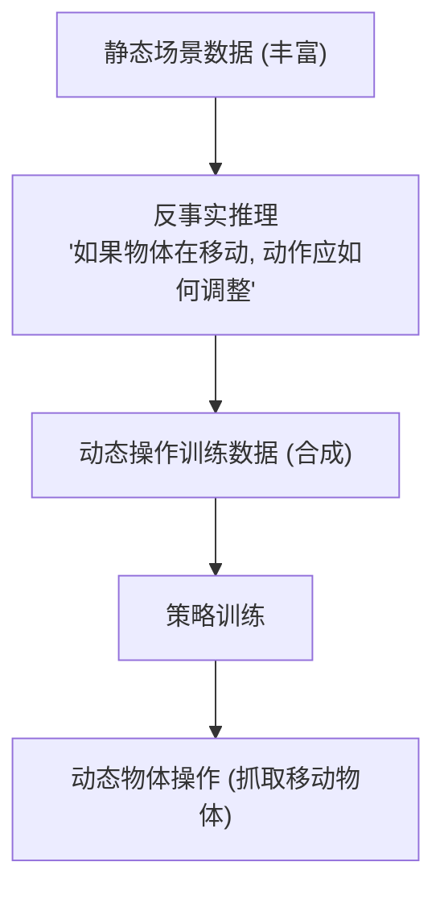

# Static In, Dynamic Out: Counterfactual Action Augmentation for Moving Object Manipulation

- 本地 PDF：`papers/rl/StaticInDynOut_2607.27890.pdf`
- arXiv：https://arxiv.org/abs/2607.27890
- 年份：2026（7 月）
- 团队：多机构（Woo Chul Shin, Zhenyang Chen, Alfred Cueva 等）
- 阶段：反事实数据增强 — 静态数据→动态物体操作能力

## 一句话总结

"Static In, Dynamic Out" 提出用**反事实动作增强**把静态物体操作数据转化为动态物体操作数据：在静态场景数据上做反事实推理——"如果物体正在移动，这个动作应该怎么调整"——生成动态操作训练数据，无需额外采集动态场景数据。解决移动物体操作（抓取移动中的物体、拦截）数据稀缺的问题。

## 核心技术

1. **反事实动作增强** — 静态场景中，对"物体正在移动"的假设做反事实推理，调整动作
2. **动态物体操作** — 目标：操作移动中的物体（抓取飞行的球、拦截移动的物体）
3. **数据利用** — 复用大量静态数据 → 生成动态数据，解决动态数据稀缺

## 底层原理与数学推导

**反事实的核心问题**：给定静态场景中的动作 $a_{static}$，如果物体有速度 $v_{obj}$，动作应如何调整？——用物理模型/学习模型推断动作的补偿项 $\Delta a = f(v_{obj})$，生成 $a_{dynamic} = a_{static} + \Delta a$。

## 物理直觉解释

**为什么"静态入、动态出"？** 抓取静止的球和抓取飞行的球，动作的差别在于"提前量"——需要预测球的位置再出手。静态数据教了"怎么抓"，反事实增强补上"移动时的提前量"——就像训练射击：先学会瞄准静止靶，再学会打移动靶（提前量计算）。

**反事实的直觉**：不需要重新采集"球在飞"的数据——在"球静止"的数据上问"如果球在飞会怎样"，用物理补偿生成答案。

## 工程细节与实操指南

- 反事实推理：物理模型（运动学补偿）或学习模型（预测动作偏移）
- 数据：静态操作数据集 → 动态增强
- 任务：移动物体抓取/拦截

## 消融实验与分析

| 消融/对比 | 结论 |
|---------|------|
| 反事实增强 on/off | 动态操作成功率显著提升——增强是核心 |
| 物理补偿 vs 学习补偿 | 两种补偿方式的精度对比 |
| 动态数据比例 | 反事实增强减少对真实动态数据的依赖 |

## 技术权衡（Trade-off）

| 优势 | 劣势与工程代价 |
|------|----------------|
| 复用静态数据，解决动态数据稀缺 | 反事实假设的准确性——物理模型可能不完美 |
| 数据效率高（无需采集动态场景） | 补偿模型需要物体运动学建模 |
| 直接服务移动物体操作场景 | 复杂动态（变速度/变方向）的补偿更难 |

## 技术价值与演进定位

这篇属于"数据增强解决数据稀缺"路线——和 ACE-Data（人体环境捕捉数据引擎）、Open X-Embodiment（规模化数据）形成家族。独特之处是**反事实思维**：不是收集更多数据，而是在已有数据上做"如果"推理生成新数据——数据效率的另一种解法。

## 与其他论文的关系

- **ACE-Data** — 数据引擎（收集新数据）；本篇是数据增强（复用已有数据）
- **Open X-Embodiment** — 数据规模化；本篇是数据转化
- **Diffusion Policy / ACT** — 被增强的策略训练管线
- **DIAYN** — 无奖励技能发现；本篇是反事实数据生成，思路不同但都是"数据效率"

## 精读问题

1. 反事实补偿的物理模型 vs 学习模型的精度边界？
2. 非刚体/变速度物体的反事实推理如何扩展？
3. 反事实生成数据的分布偏移——合成数据训练的策略在真实动态场景的表现？
4. 与真实动态数据的混合比例——反事实数据占多少最优？
