# Tool-R0: Self-Evolving LLM Agents for Tool-Learning from Zero Data

- arXiv: https://arxiv.org/abs/2602.21320
- Source: https://arxiv.org/abs/2602.21320
- Project:
- Local PDF: `/Users/luogu/physical_intelligence/papers/rl/ToolR0_2602.21320.pdf`
- Year: 2026
- Category: rl
- Priority: high

## 一句话总结

Tool-R0 用 zero-data self-play RL 把同一个 instruction-tuned 基座初始化成 Generator（合成"问题 + 工具菜单 + gold tool-call"三件套的可验证任务）与 Solver（学习执行真实工具调用）两个角色，靠互补奖励 co-evolve——Generator 按 Solver 的能力边界领奖励、Solver 按结果正确性领奖励；在 Qwen2.5-1.5B 上平均准确率从 24.85 提到 47.84（相对提升 92.52%），零人工数据下超过用 4k–210k 条人工数据训出的全部监督基线（最强者 ToolRL 46.06）。

## 核心技术

**双角色迭代结构**。训练跑 $K=3$ 个 self-play iteration，每轮三段：(1) 冻结 Solver，用 GRPO 训 Generator 50 步（2,000 个自生成样本）；(2) 冻结 Generator，采样 10,000 个候选任务，经去重、Solver cross-verification、难度分桶后筛到 2,000 条；(3) Solver 在这批课程数据上训 50 步，进入下一轮。Solver 的成功率统计反过来决定 Generator 的难度奖励，闭环由此咬合。

```mermaid
flowchart LR
    A["Base LLM"] --> B["Generator pi_theta"]
    A --> C["frozen Solver pi_phi"]
    S["task spec s = (domain, context, menu size, num calls)"] --> B
    B --> T["task = question + tool menu + gold calls"]
    C -->|"K=8 Monte Carlo probes"| D["r_diff: band-pass on p_succ"]
    T --> D
    T --> E["r_fmt + r_valid checks"]
    D --> F["Generator reward = r_fmt + r_valid + r_curr"]
    E --> F
    F --> G["GRPO update Generator"]
    G --> H["freeze Generator, sample 10,000 candidates"]
    H --> I["dedup -> cross-verify -> easy/medium/hard buckets"]
    I --> J["2,000-task curriculum, easy to hard"]
    J --> K["Solver GRPO: r_fmt + r_acc"]
    K --> L["updated Solver"]
    L -->|"next iteration: new difficulty anchor"| C
```

**Grounded Task Specification（防 mode collapse）**。直接让 Generator 自由发挥会塌缩到少数高似然模板，所以每条任务都绑定规格 $s = (d, c, m, n)$：任务域 $d$ 从 32 个类别（finance、healthcare、scheduling、web_search 等）按均匀权重 0.03125 采样；交互形态 $c$ 以 0.9 概率 single-turn、0.1 概率 multi-turn；gold 调用数 $n$ 在 single-turn 下以 0.8 概率取 1、0.2 概率取 2（multi-turn 固定 $n=1$）；菜单规模 $m$ 按 $n$ 分桶（$n>1$ 时取 {3,4,5}，$n=1$ 时取 2–4 或 5–8 工具）。规格作为 meta-prompt 注入，得到条件化分布 $q \sim \pi_\theta(\cdot \mid s)$，同时保证每个生成实例都能自动验证。

**Generator 三重奖励**：
- $r_{fmt}$：要求输出恰好四个 tag 块（`<think>` / `<question>` / `<available tools>` / `<tool call answer>`），且工具菜单与 gold call 都能解析为 JSON——保证输出可执行、防畸形输出刷奖励。
- $r_{valid}$：三项一致性检查（见下节公式），拦住"调用菜单里不存在的工具""漏 schema 必需参数""参数值在问题里无出处"三类幻觉。
- $r_{curr} = r_{diff} + r_{sem}$：难度项用冻结 Solver 的 8 次蒙特卡洛探测做带通滤波，语义项由 Solver 以 1–5 分给问题质量打分后归一化。

**Solver 数据构建三段过滤**：canonical signature（question–tool–call 组合签名）去重 → Solver 多次采样与 gold call 交叉验证、只保留解一致的样本（可复现的答案更可能是可靠监督）→ pass@K 估计难度、分 easy/medium/hard 三桶，按 batch 级 easy 到 hard 的课程排布。

**Solver 训练（TIR 接口）**：模型在 `<think>` 里推理后在 `<tool call answer>` 里给出调用列表；奖励 = 格式奖励（tag/parse/normalize 加权 0.3/0.3/0.4）+ 稠密 accuracy 奖励。accuracy 把每个 gold call 贪心匹配到最优未用预测，pair 分解为 tool name（0.2）、参数 key 集合 F1（0.3）、参数 value 匹配率（0.5）三子分，再乘多余调用惩罚。Solver 变强后，同样的探测让 Generator 的难度奖励自动上移，self-play 循环闭合。

## 底层原理与数学推导

**Validity reward**。设 $T$ 为解析出的工具菜单，$c^{*} = (n^{*}, a^{*})$ 为归一化 gold call（工具名 $n^{*}$、扁平参数表 $a^{*}$），$q$ 为生成的 question：

$$
r_{valid}(x) = \lambda_{Menu}\, I[n^{*} \in T] + \lambda_{Gold}\, I[req(n^{*}) \subseteq keys(a^{*})] + \lambda_{Value}\, I[vals(a^{*}) \to q]
$$

三项权重 $(\lambda_{Menu}, \lambda_{Gold}, \lambda_{Value}) = (0.4, 0.4, 0.2)$：gold 工具必须存在于菜单、schema 必需参数必须齐全、每个非平凡参数值（排除布尔与 null）必须在 question 中以词边界形式出现。第三项是语义锚——它把 gold answer 拴回任务文本，压制"参数无出处"的解题幻觉，作者称之为 compiler-like gate。

**Solver 校准的难度估计**。对候选任务，用当前 Solver 以温度 0.7 独立解码 $K=8$ 次，统计与 gold call 完全一致的比例：

$$
\hat{p}_{succ} = \frac{1}{K} \sum_{k=1}^{K} I[\hat{c}^{(k)} = c^{*}]
$$

**带通难度奖励**（Fig. 3 的形状来源）：

$$
r_{diff}(x) = \begin{cases} 1 & \hat{p}_{succ} \in [P_{low},\, P_{high}] \\\\ \exp\!\left(-\dfrac{(\hat{p}_{succ} - P_{low})^2}{2\sigma^2}\right) & \hat{p}_{succ} < P_{low} \\\\ \exp\!\left(-\dfrac{(\hat{p}_{succ} - P_{high})^2}{2\sigma^2}\right) & \hat{p}_{succ} > P_{high} \\\\ 0 & \hat{p}_{succ} < 1/K \end{cases}
$$

取 $[P_{low}, P_{high}] = [0.25, 0.75]$、$\sigma = 0.12$。设计上有三个刻意的点：(1) $\hat{p}_{succ} < 1/K$（8 次探测零命中）直接归零——这类样本大概率是病态、歧义或不可解任务，对 Solver 无学习信号；(2) 目标不是单一峰值而是一段平台（$\hat{p}_{succ} \approx 0.5$ 附近），平台宽度吸收蒙特卡洛估计的方差，避免真在边界上的任务因采样噪声被错罚；(3) 平台外用高斯平滑衰减而非硬截断，让 Generator 拿到"偏离多远就修多少"的比例信号。注意最后一支（$1/K$ 门控）在语义上优先于高斯衰减支——零命中即归零。

**Solver 稠密 accuracy 奖励与多余调用惩罚**。匹配对 $(\hat{c}, c^{*})$ 的子分为：

$$
s(\hat{c}, c^{*}) = \lambda_{name}\, s_{name} + \lambda_{key}\, s_{key} + \lambda_{val}\, s_{val}, \qquad r_{acc} = \bar{s} \cdot \frac{1}{1 + \alpha \cdot \max(0,\, |\hat{C}| - |C^{*}|)}
$$

其中 $s_{name} \in \{0,1\}$ 为工具名精确匹配，$s_{key} \in [0,1]$ 为参数 key 集合的 F1，$s_{val} \in [0,1]$ 为交集 key 上 value 的匹配率（数值强制转换 + 空白不敏感字符串比较），权重 $(0.2, 0.3, 0.5)$；$\bar{s}$ 是对全部 gold call 取平均的基础分，$\alpha = 0.25$ 的乘法惩罚让多吐调用的补全按超出数量递减，正确长度的预测不受影响。

**奖励的学习层级**（训练动力学，Fig. 7）：Generator 总奖励第 2 个 iteration 即到约 0.98，Solver 稳定在约 0.90——合成可验证任务比解任务容易，这个不对称是角色分工的收益来源。Generator 内部顺序为 format 一轮内饱和 → validity 两轮内爬升 → curriculum 增长最陡；其中难度分量从 0.1 快速升到 0.4 以上后平台化（Generator 学会把任务推到 Solver 能力天花板），语义分量始终稳定在 0.5（加难度不牺牲任务有效性），总 curriculum 奖励收敛在 0.9 附近。

## 物理直觉解释

**挑训练重量要落在"能举三到七次"的区间**。Generator 的难度奖励本质上是健身教练的配重逻辑：重量太轻（Solver 八次全对）长不了肌肉，太重（八次全错）只会受伤，且极重的那档根本不该出现在课表里（零命中直接归零，因为大概率是动作本身不成立而非学员不行）。[0.25, 0.75] 的平台就是"能举三到七次"的区间，高斯衰减告诉教练"往回减一点重量"而不是直接判零分——若用矩形硬窗，教练只能得到"越界了"的二元信息，训练在边界附近震荡。消融中去掉整个 $r_{diff}$ 掉 4.30 pp、换成矩形窗掉 3.74 pp，正是"配重要挑"与"调整要平滑"两件事各自的代价。

**下棋要找略强于自己的对手，且对手也要成长**。静态数据集像一个固定棋力的陪练：你变强之后它还在教开局入门。Tool-R0 的 Generator 是一个会跟着你涨棋的陪练——定性对比（Fig. 13/14）显示，第 1 个 iteration 的任务还是"订一张伦敦到巴黎的机票"（1 个工具 2 个参数 1 次调用），到第 3 个 iteration 已经是"订纽约-巴黎往返商务舱机票并订巴黎市中心酒店"（2 个工具 11 个参数、2 次带跨任务依赖的协调调用：航班到达日必须先于酒店入住日）。这就是"自适应课程胜过静态人工监督"的微观机制：课程难度被 Solver 的实时能力锚定，而不是被标注者几个月前的判断锚定。

**教练和运动员不能共用一具身体**。在围棋或德州扑克里，自我博弈双方目标对称、共享参数没问题；但工具调用是开放式高熵动作空间，Generator 要探索无界的任务分布，Solver 要在固定 API 语义下精确执行，两个角色的奖励函数异质。共享权重时，探索驱动的梯度和执行驱动的梯度在同一套参数上互相打架，表现为中心 17.42 pp 的塌陷和灾难性遗忘——就像让同一个人在一场比赛里同时当进攻方和防守方，两套战术肌肉记忆互相覆盖。参数分离不是优化技巧，而是这类非对称 self-play 的成立前提。

**开卷考试的答案必须能在卷面上找到依据**。value grounding（参数值必须在 question 里逐字出现）看似苛刻，实则是零数据环境里最便宜的反幻觉装置：没有任何外部数据可以校验"3 月 5 日"是不是用户真说过，唯一的锚就是让 Generator 自己把依据写进题目。它把任务分布约束在"参数有出处"的封闭世界上，换来的是 gold label 100% 可机检——这是执行式反馈（execution-based feedback）能替代人工审查的前提。

## 工程细节与实操指南

| 超参数 | Generator | Solver |
|---|---|---|
| 每迭代数据量 | 2,000（自生成） | 2,000（10,000 候选过滤后） |
| 全局 batch | 24（每卡 2 x 累积 4） | 32（每卡 2 x 累积 5） |
| Optimizer | AdamW, lr 1e-6, weight decay 1e-2 | 同左 |
| KL 惩罚系数 | 1e-2 | 1e-2 |
| GRPO 组内 rollout | 4 条/prompt, 温度 1.0 | 4 条/prompt, 温度 1.0 |
| 最大序列长度 | 4096 | 4096 |
| 精度 / 框架 | bf16, TRL + DeepSpeed ZeRO-3, 3 GPU | 同左 |

- **两个温度要分清**：难度估计专用温度 0.7（Solver 探测 $r_{diff}$ 时，max 2048 tokens），训练 rollout 是温度 1.0——前者要的是稳定的成功率统计，后者要的是组内多样性。
- **解析器按"超宽松"实现**：Solver 输出接受 strict JSON、Python 字面量（单引号 dict）、code-fenced JSON 三种形态；`"..."` 与 `[...]` 类占位符判非法并给零奖励；支持 OpenAI 风格 `function` 包装、单 dict 自动转长度 1 的列表；参数出现在 `arguments` 字段之外时回退扁平 map。
- **数值比较的保守化**：长数字串当作 identifier 走归一化字符串比较而非转 float，避免精度伪差异；数值强转与空白归一化都失败时回退 canonical JSON 比较。
- **有效 epoch 的算术**：50 步 x 全局 batch 24 = 1,200 < 2,000，即 Generator 每个迭代不足一个 epoch（推算自 Table 4 配置）；Solver 同理（50 x 32 = 1,600 < 2,000）。复现时不要默认跑满 epoch。
- **过滤管线的代价**：每迭代 10,000 候选最终只留 2,000（20% 存活率），且 cross-verify 阶段还要对每条候选跑多次 Solver 推理——这还没算 Generator 训练时每样本 8 次的难度探测，零数据的代价是推理侧的。
- **当作 mid-training 用**：把每个 self-play iteration 的 checkpoint 拿去做 SFT（ToolACE 数据），第 1 个 iteration 起就超过纯 SFT 基线，3 个 iteration 后同时超过纯 SFT 与纯 Tool-R0——self-play 可以当作强化后续监督的"continued pre-training"阶段。
- **规模相关的饱和行为**：延长到 5 个 iteration 的实验里，0.5B/1.5B 约在第 3 个 iteration 见顶甚至微降（早期收敛到 Nash-like equilibrium / 知识边界），3B 持续上升无饱和——小模型早收敛、大模型慢爬坡，对应小模型初始增益反而更大的主表模式。
- **失败模式的迁移**（Fig. 8）：基座以 structural errors（选错工具、调用数错、多/漏参数）为主，Tool-R0 把这类近乎砍半；semantic errors 同步下降但成为剩余主要瓶颈；format errors 基线本就少、训练后近乎清零。待确认：Fig. 8 仅以图形式给出三类失败的数量，正文与表格均无精确数值，"近乎砍半"只能按图读取。

## 消融实验与分析

| 变体 | 平均准确率 | 绝对降幅 | 相对降幅 |
|---|---|---|---|
| Tool-R0 完整版 | 47.84 | – | – |
| Generator/Solver 共享权重 | 30.42 | -17.42 pp | ↓36.41% |
| 冻结 Generator（只用提示生成，不训练） | 41.65 | -6.19 pp | ↓12.94% |
| 去掉难度奖励 $r_{diff}$ | 43.54 | -4.30 pp | ↓8.99% |
| 高斯衰减换成矩形硬截断 | 44.10 | -3.74 pp | ↓7.82% |

与监督基线的对照（同一 Qwen2.5-1.5B-Instruct、各自官方数据与训练法重训）：

| 训练数据来源 | 数据量 | 平均准确率 |
|---|---|---|
| xLAM | 60k | 43.60 |
| Hammer | 210k | 43.74 |
| ToolACE | 12k | 44.71 |
| ToolRL | 4k | 46.06 |
| Tool-R0（零数据） | 0 | 47.84 |

**核心结论：** 四个消融的降幅排出了一个依赖序——角色分离（-17.42 pp）远大于 Generator 持续学习（-6.19 pp）大于难度校准（-4.30 pp）大于平滑衰减（-3.74 pp），说明零数据 self-play 的成败首先取决于双角色架构是否成立，其次才是课程信号的质量。零数据方案（47.84）压过 4k–210k 全部人工数据集（43.60–46.06），且 Fig. 4 的嵌入相似度分析显示 self-play 课程在不接触任何测试数据的情况下取得了对五个基准最高且最均匀的覆盖——赢的机制是分布覆盖而非数据量。主结果侧的量级：1.5B 平均 +22.99（92.52%），0.5B +15.62（101.03%，SNIPS 单项 +810.19%），3B +4.53（10.30%），Llama-3.2-3B +4.35（12.04%），增益随基座变强而递减。

## 技术权衡（Trade-off）

| 优势 | 劣势与工程代价 |
|---|---|
| 零人工数据：新领域只需改 domain 配置的采样权重，无需收集任务集 | 任务保真度受 grounding 约束压低：参数值必须在问题里逐字出现，排除需要推导隐含参数的任务 |
| 课程自适应锚定模型能力边界，自动避开过易/过难样本 | 难度探测 + cross-verify 的推理开销大：每候选任务 8 次 Solver 解码，10,000 选 2,000 的过滤率意味着 80% 生成算力被丢弃 |
| 全 JSON 可验证奖励，执行式反馈无 reward-model 偏差 | 只覆盖扁平原始类型参数的工具调用（显式禁止嵌套对象/列表），离真实复杂 API 有距离 |
| 小模型提升显著（0.5B +101.03%），可下探端侧 | 小模型早期饱和：约 3 个 iteration 后见顶，且小模型的指令遵循缺陷偶发 reward hacking（通过可验证检查但产出低质监督） |
| 角色分离带来稳定 co-evolution | 两套参数的训练与显存成本；Generator 与 Solver 需各自超参维护 |
| 可作 mid-training 放大后续 SFT（3 iteration 后超两条纯基线） | 无多 run 标准误分析（作者自认受算力限制，仅初步重复显示低方差） |

## 技术价值与演进定位

Tool-R0 站在 self-play LLM 演化线的第三级：Absolute Zero 把零数据 self-play 限定在代码可验证的数学/编程域，R-Zero 证明纯文本 QA 的 self-play 增益有限且会退化，Agent0 与 Dr. Zero 各自只覆盖单类工具（Python / 搜索）。Tool-R0 的推进有三层：其一，把 zero-data 假设推广到跨 32 个域的异构工具菜单，且 gold label 全程执行式可验证；其二，给出该路线的第一批机制性负结果——共享权重塌 17.42 pp 说明对称 self-play 的经验不能直接搬到非对称 agentic 任务，这对后续所有 Generator/Solver 式工作都是设计红线；其三，mid-training 实验把 self-play 从"替代监督"改写为"放大监督"的预处理阶段，为它在工业 post-training 流水线里找到了一个不与人工数据对抗的位置。局限同样清晰：single-turn 占 0.9、multi-turn 固定单调用、工具菜单是合成 JSON 而非真实 API 生态、证据止步于 3B 规模——它证明了"从零自演化工具能力"的原则可行性，离真实部署工具生态还有一整层环境工程。

## 与其他论文的关系

- **Absolute Zero / R-Zero / Agent0 / Dr. Zero**——zero-data self-play 的直接前序：分别限码域、纯文本 QA、单一 Python 工具、搜索问答；Tool-R0 推广到跨域工具调用，并补上"角色必须参数分离"与"难度奖励需平滑带通"两条机制性结论。
- **ToolRL（Qian et al., 2025）**——Solver 的稠密 accuracy 奖励（name/key/value 分解 + 多余调用乘法惩罚）直接沿用其设计；ToolRL 同时是被对比的最强监督基线（46.06 vs 47.84），说明奖励设计相同时数据来源（自生成课程 vs 4k 人工混合）决定上限。
- **xLAM / Hammer / ToolACE（监督数据线）**——被同基座重训的对照数据集；Fig. 4 显示 self-play 课程对测试基准的嵌入相似度均值最高、覆盖最均匀，为"静态人工分布有偏"提供了数据侧证据而不只是分数证据。
- **notes/rl/tongyi-deepresearch.md（应用线）**：同属 agent 自获取能力的应用子线，但 Tongyi DeepResearch 面向真实检索生态的 deep research agent，Tool-R0 的工具菜单是合成封闭 JSON 接口——分别代表工具学习的"开放生态"与"可控沙箱"两端，后者的可验证性换掉了前者的真实性。
- **notes/rl/lego-rl.md、notes/rl/polar.md、notes/rl/harness-1.md（训练系统线）**——Tool-R0 关心数据从零来，这一线关心 rollout 与训练之间的一致性；两者正交可组合，例如把 self-play 课程接到忠实 harness 上训练 MoE agent。
- **notes/rl/coskill.md**：同为 self-improvement，Coskill 让 meta-agent 编辑外部技能库（上下文侧、不重训），Tool-R0 直接改权重（参数侧）；两者的课程信号（编辑改进量 Delta-skill vs Solver 一致性难度）都是"以被改进者的反馈为准"的自锚定信号。
- **notes/rl/ragen-2.md、notes/rl/g2po.md（算法线）**——RAGEN-2 研究多轮 RL 的 collapse 与自演化稳定性，Tool-R0 的"Generator-Solver 收敛到 Nash-like equilibrium 后饱和"是同一现象在数据生成侧的表现；G2PO 的细粒度 credit assignment 与本工作的课程粒度选择（batch 级 easy 到 hard）分别处理轨迹内与数据集级的难度问题。
- **notes/rl/harbor.md、notes/rl/enpire.md、notes/rl/agentic-robotics-loop.md（机器人侧对照）**：三条机器人 harness 都把任务来源外包给环境或人类；Tool-R0 证明纯自生成课程在文本可验证任务上可行，但机器人侧缺少 AST-matching 这类廉价全自动化验证器，是该方法迁移的主要缺口。
- **notes/architecture/art-vla-agent.md（VLA 侧对照）**——ART 用工具 token 注入把 VLA 的动作解空间缩到"何时调用哪个工具"；Tool-R0 从训练数据侧做同构压缩——schema 约束的菜单 + 扁平参数把高熵语言动作变成可验证的结构化选择，两个社区在"结构化接口降低动作熵"上汇合。

## 精读问题

1. 难度带 [0.25, 0.75] 与 σ=0.12 全部在 Qwen2.5-0.5B–3B 上标定，而论文自己的延长实验显示 3B 五个 iteration 不饱和——对 7B 以上基座，带通应该随能力上移收窄还是放宽？带通参数与模型规模之间是否存在可标定的标度关系？
2. value grounding 要求所有非平凡参数值在 question 中逐字出现，等于禁止"需要推导隐含参数"的任务（如从"下周五"推具体日期、从预算约束算可行舱位）；这种 grounding 是否系统性把任务分布压向"参数抄写型"，从而低估可学到的工具推理深度？
3. 共享权重掉 17.42 pp 被归因于两类角色的梯度冲突，但论文没有给出两种角色梯度范数或参数漂移的直接测量；"梯度干扰"是已验证的机制，还是对现象的事后命名？
4. 语义奖励由当前 Solver 自己打 1–5 分（Solver-as-judge），数据质量评估者与被训者是同一个模型；当 Solver 对某类任务形成系统性误判时，这个回路是自纠偏还是自我强化？叠加 rdiff 探测同样依赖 Solver，偏见是否被双倍放大？
5. 10,000 候选过滤到 2,000 的管线中，去重、cross-verify、课程分桶三段各自丢弃多少？过滤率随基座规模如何变化？（待确认：论文只报告 10,000 到 2,000 的总量，未分解三段各自的过滤量，无法核验瓶颈在哪一段。）
