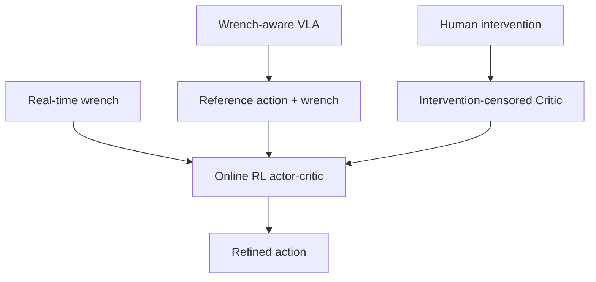

# TORL-VLA: Tactile Guided Online Reinforcement Learning for Contact-Rich Manipulation

- 本地 PDF：`papers/rl/TORL-VLA_2606.09337.pdf`
- arXiv：https://arxiv.org/abs/2606.09337
- 年份：2026（6 月）
- 团队：北航 + 矿大 + 华东师大 + 美团
- 阶段：触觉引导在线 RL — VLA + wrench 预测 + 在线 RL 精调

## 一句话总结

TORL-VLA 提出触觉引导在线 RL 框架：VLA 同时预测参考动作和未来 wrench（力+力矩）序列，轻量在线 RL 模块用实时 wrench 反馈精调动作，intervention-censored critic 防止误将人类干预后的成功归功于策略。真实机器人 3 个接触丰富任务：coffee cup 30/30、latch 29/30、egg 30/30、全任务 28/30（vs π0.5 12/30），平均完成时间 165.5s（vs π0.5 199.7s，快 17%）。wrench 预测 + MoE 融合 + physical bypass 三管齐下。

## 核心技术

1. **Wrench-aware VLA** — VLA 同时预测 action chunk 和 future wrench 序列，提供语义+物理双重先验：语义先验（动作该怎么做）来自预训练，物理先验（接触会受多大力）来自 wrench 预测头
2. **轻量在线 RL 精调** — 部署时用实时 wrench 反馈在线更新轻量 actor-critic，参考动作被当作先验约束、实时 wrench 偏差作为修正信号
3. **Intervention-censored critic** — 人类在失败后干预→成功后，critic 不会把成功归功于策略生成的失败动作；干预前的策略动作被 mask 掉，避免"错误动作被奖励"污染价值估计

## 底层原理与数学推导

VLA 的预测头同时输出动作 chunk 与 wrench 序列：$(\hat{a}_{t:t+H}, \hat{w}_{t:t+H}) = f_\theta(o_t, L)$。参考动作 $\hat{a}$ 提供先验分布，在线 RL 学的是修正量 $\delta_t$：

$$a_t = \hat{a}_t + \delta_t, \qquad \delta_t \sim \pi_{\phi}(\cdot \mid s_t, \hat{a}_t, w_t^{real})$$

其中 $w_t^{real}$ 是实时 wrench 测量。在线 critic 的价值目标经过 intervention censoring：设干预时刻为 $\tau_{int}$，则

$$Q^\pi(s_t, a_t) = \begin{cases} 0 & \text{if } t \le \tau_{int} \text{（干预前策略动作）} \\ \sum_{k \ge t} \gamma^k r_k & \text{otherwise} \end{cases}$$

物理含义：干预前策略生成的失败动作在回报中记 0，干预后人类的成功修正动作才获得奖励——"功劳归谁"被显式切分。MoE 融合则把 VLA 参考动作、wrench 预测、RL 修正量按专家门控加权：$a = \sum_e g_e(s_t) \cdot a^{(e)}$（待确认：门控的具体输入与专家分工需读全文）。

## 物理直觉解释

**wrench 预测是"预判会被推多大力"，而不是"测量到了多大力"**。接触丰富任务（倒咖啡、掰开关、捏鸡蛋）里，动作的后果由接触力决定：倒咖啡时杯子拿太紧会挤变形、太松会滑落；掰 latch 时发力方向差几度就会卡死。实时 wrench 是"事后"信号——已经推过去了才知道力多大，而预测 wrench 是"事前"信号——动作还没做就知道"这个动作会遭遇多大的反力"。这就像**盲人用探路杖**：探路杖的意义不是"撞到了才知道有墙"，而是"敲击声提前告诉你前面有什么"——wrench 预测头就是这个"探路杖"，让策略在接触前就知道动作的力后果。

**Intervention-censored critic 是"教练纠正后，成绩不记在学生头上"**。在线 RL 里最常见的陷阱：策略动作失败 → 人类介入纠正 → 任务成功 → critic 把"成功"记给了策略——策略学到的是"失败动作 + 有人救 = 成功"，于是它学会故意失败等救援。物理直觉类比：**学生考试时老师走过来替他写了答案，得了满分，学生却以为是自己的功劳**。censoring 把干预前后的轨迹切分：干预前的动作回报记为 0（不是负，避免惩罚过度保守，而是"无功劳"），干预后的修正动作才获得回报——学生清楚地知道"满分不是我的"。这个设计的必要性被消融证实：去掉 censoring 后成功率从 30/30 掉到 27/26/28。

**为什么"在线 RL 精调"比"端到端 VLA 直接部署"更适合接触任务？** 接触任务的失败模式是"差一点"——方向差 2 度、力度差 3 牛，静态策略无法在线修正，因为部署时没有梯度。TORL-VLA 的轻量 RL 模块只在部署期在线更新，等于**让运动员在比赛中微调动作**：VLA 是教练给的战术（参考动作），实时 wrench 是身体反馈（接触力），RL 模块是"下一球该怎么调整"的快速决策。它不需要重训 7B 模型，只需要更新一个轻量 actor-critic——因为需要修正的不是"理解力"（VLA 已足够），而是"这一拍的动作偏差"（小参数即可表达）。

## 工程细节与实操指南

- VLA: wrench-aware 头，同时输出 action chunk + future wrench 序列
- RL: 轻量 actor-critic，实时 wrench 反馈在线更新
- Intervention-censored: 干预前的策略动作回报置 0，干预后的修正动作正常计奖
- MoE 融合: 参考动作 / wrench 预测 / RL 修正按专家门控加权（待确认：门控细节）
- 任务: coffee cup 30/30, latch 29/30, egg 30/30, 全任务平均 28/30
- 时间效率: 平均完成 165.5s（vs π0.5 199.7s, -17%）

## 消融实验与分析

3 个真实机器人接触任务（每任务 30 trials，论文 Table）：

| 方法 | Coffee | Latch | Egg | 全任务 SR | 平均时间 |
|------|--------|-------|-----|----------|---------|
| **TORL-VLA** | **30/30** | **29/30** | **30/30** | **28/30** | **165.5s** |
| TORL-VLA 无 intervention-censoring | 27/30 | 26/30 | 28/30 | — | — |
| TORL-VLA 无 MoE 融合 | 18/30 | 17/30 | 19/30 | — | — |
| TORL-VLA (无在线 RL) | 25/30 | 23/30 | 25/30 | 21/30 | 191.9s |
| ForceVLA | 21/30 | 20/30 | 22/30 | 15/30 | 195.3s |
| π0.5 | 18/30 | 15/30 | 20/30 | 12/30 | 199.7s |

**核心结论**：(1) 在线 RL 是最大增益来源——无 RL 时 21/30，加 RL 后 28/30（+7/30），且平均时间 -14%（191.9→165.5s），说明实时 wrench 反馈精调同时提升成功率与效率；(2) MoE 融合是关键架构——去掉后掉到 18/17/19（-11 项），比无 RL 还差，说明"参考动作/wrench/修正"三路信号的混合方式比"是否有 RL"更敏感；(3) intervention censoring 提供 +2~3 项（27/26/28 → 30/29/30），验证了"功劳归属"切分的必要性——无 censoring 时策略会把失败动作和人工修正混为一谈；(4) 对 π0.5 的全任务差距（28/30 vs 12/30）中约一半来自 wrench 感知本身（无 RL 也达 21/30 vs π0.5 12/30），另一半来自在线精调——wrench 先验与在线修正各贡献一半。

## 技术权衡（Trade-off）

| 优势 | 劣势 |
|------|------|
| 部署期在线 RL，无需重训大模型 | 需要实时 wrench 传感器（力/力矩传感），硬件要求高 |
| 触觉信号直接参与修正，接触任务精度高 | 在线更新的稳定性依赖参考动作质量，VLA 出错时 RL 会放大错误 |
| Intervention censoring 解决"功劳归谁"问题 | 人类干预阈值与频率需要人值守，自动化程度有限 |
| 时间效率提升 17%（165.5s vs 199.7s） | 仅验证 3 个任务，每任务 30 trials 的统计量有限 |

## 技术价值与演进定位

TORL-VLA 代表了"触觉参与 RL"的一种务实路线：不让触觉进 VLA 的输入（改架构、改训练数据成本高），而是让触觉做**部署期的反馈信号**——用轻量在线 RL 模块把"预测 wrench"和"实测 wrench"的差距转化为动作修正。这与 HapticVLA 形成镜像：HapticVLA 把触觉蒸馏掉（部署期无触觉），TORL-VLA 把触觉留在部署期（在线精调）——两条路线分别适合"策略固定部署"与"任务多轮交互"的场景。它的方法论贡献是 intervention-censored critic：把"人类介入"从 RL 的噪声变成可用的训练信号，这在"人在环"真实机器人 RL 里具有普遍适用性（任何带人工干预的在线学习都可套用）。与 RL Token、VLAC 等"RL 成为 VLA 标准步骤"的趋势一致，TORL-VLA 是其中"物理量 reward + 在线更新"的代表。

## 与其他论文的关系

- HapticVLA（触觉蒸馏）：镜像路线——HapticVLA 蒸馏触觉到纯视觉部署，TORL-VLA 保留触觉做在线精调；一个是"训练期借用、部署期归还"，一个是"触觉全程在场"。
- π0.5（Physical Intelligence）：作为最强对照（12/30），TORL-VLA 的 +16/30 全部来自 wrench 感知与在线 RL 两个增量，量化了"触觉 + 在线修正"对纯预训练 VLA 的边际价值。
- VLAC（统一 actor-critic）：VLAC 用预训练 critic 提供视觉 progress reward，TORL-VLA 用实时 wrench 提供物理修正——"语义奖励"vs"物理奖励"，一个适合通用任务、一个适合接触任务。
- ForceVLA：同为力感知 VLA 路线，TORL-VLA 在三个任务上全面超越（28/30 vs 15/30）——差异在在线 RL 精调与 MoE 融合（ForceVLA 无在线更新）。

## 精读问题

1. **wrench 预测的精度边界**：预测 wrench 与实际 wrench 的误差多大时，在线 RL 的修正信号开始失真？对高动态接触（冲击、弹跳），预测头是否完全失效？
2. **censoring 的 false positive**：干预时刻 $\tau_{int}$ 的判定是否可能错误地 censor 掉好的自主探索（策略自己快成功了，人被误判干预）？误判代价与干预判定标准的关系？
3. **MoE 门控的输入**：门控 $g_e(s_t)$ 具体以什么为输入（wrench 偏差？状态？）？三路专家的权重在任务过程中如何演化——是否出现"初期信参考、后期信修正"的规律？
4. **在线 RL 的稳定性**：轻量 actor-critic 在线更新 30 trials 内是否收敛？参考动作先验质量差（VLA 在 OOD 场景）时，RL 是修正还是放大偏差？
5. **触觉硬件依赖的替代**：实时 wrench 若换成功率估计/视觉接触估计，性能掉多少？能否把 TORL-VLA 的架构与 HapticVLA 的蒸馏结合（在线阶段也用预测 wrench）？
6. **任务规模与统计力**：每任务 30 trials 的置信区间多大？全任务 28/30 与无 RL 21/30 的差异在更大样本下是否稳健？
