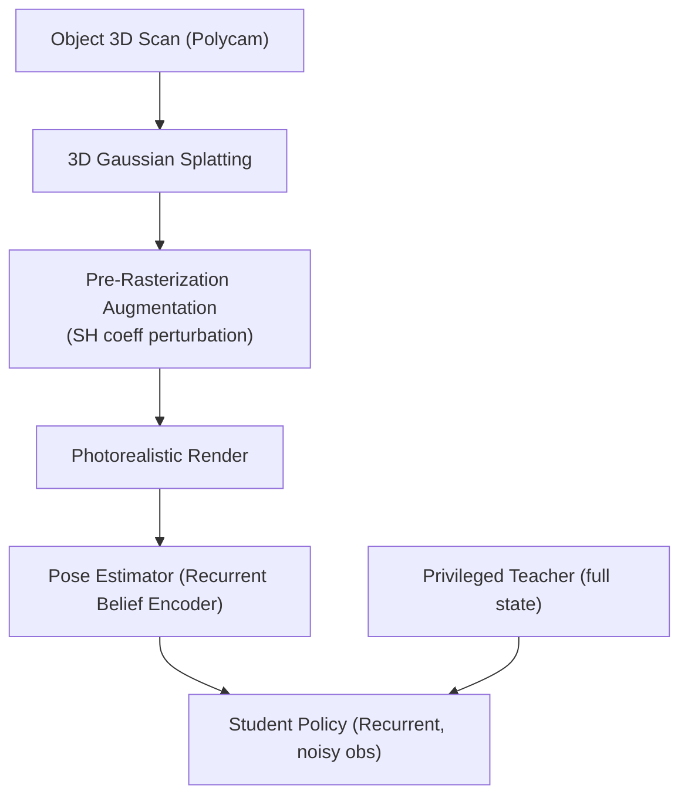

# ViserDex: Visual Sim-to-Real for Robust Dexterous In-hand Reorientation

- 本地 PDF：`papers/rl/ViserDex_2604.11138.pdf`
- arXiv：https://arxiv.org/abs/2604.11138
- 年份：2026 (RSS 2026)
- 团队：ETH Zurich RSL (Marco Hutter 组)
- 阶段：纯单目 RGB 灵巧手 Sim2Real — 3DGS 渲染 + 课程 RL + 师生蒸馏

## 一句话总结

ViserDex 实现仅用单目 RGB（无深度、无物体 pose 真值）的灵巧手在操作零样本 Sim2Real。核心创新：3DGS 渲染替代昂贵光线追踪，在 Gaussian 空间做物理一致的 pre-rasterization augmentation（扰动 SH 系数模拟光照变化）——比 2D post-processing 更真实。16-DoF Allegro 手、5 种物体，平均 25+ 连续成功 reorientation（Cube 上 35.4 次，vs 最强视觉基线 DeXtreme 27.8）。渲染 1.6× faster、仅 12GB VRAM（vs Isaac Lab 34GB）。旗舰发现：**Sim2Real 的瓶颈不在控制（RL 已能解决），在感知**。

## 核心技术

1. **3DGS Pre-Rasterization Augmentation** — 在渲染前直接扰动 3D Gaussian 的 SH coefficient（空间/颜色/全局 cluster），生成物理一致的光照变化——比 2D post-processing 更真实，且零额外渲染成本
2. **Recurrent Belief Encoder** — 时序滤波的 pose estimator，拒掉灾难性失败（如 180° 翻转），对遮挡鲁棒；pose 估计精度 65.4%（常规光照）/ 56.3%（对抗光照），远超 Domain Randomization 的 55.6%/47.2%
3. **课程 RL + 师生蒸馏** — Privileged teacher（全状态）→ Recurrent student（仅 RGB noise observation），student 在部署时无需 pose 真值
4. **单 RTX 4090 训练** — Teacher 26h + Student 16h

## 底层原理与数学推导

3DGS 中每个 Gaussian blob 携带球谐（SH）系数，决定其颜色与亮度：$c(\mathbf{d}) = \sum_{l} c_l \cdot SH_l(\mathbf{d})$（$c_l$ 为第 $l$ 阶系数，$\mathbf{d}$ 为观察方向）。pre-rasterization augmentation 在渲染管线前对系数做扰动 $\tilde{c}_l = c_l + \delta_l$，$\delta_l$ 按空间簇/全局簇采样——这等价于**在光源层面**改变场景，而不是在图像层面改像素。扰动后渲染的图像 $I' = R(\tilde{c})$ 与扰动前 $I = R(c)$ 的关系是物理一致的：同一光源变化下，阴影方向、强度、反射全部联动变化。

蒸馏阶段，privileged teacher 以全状态 $s_t^{full}$ 为输入、用标准 RL（PPO）训练；student 以单目 RGB 序列 $o_{1:t}$ 为输入、通过 recurrent belief encoder 估计隐信念 $b_t$：

$$b_t = \mathrm{GRU}(f(o_t), b_{t-1}), \qquad \hat{\theta}_t = g(b_t)$$

student 的 loss 为行为克隆 teacher + 状态重建的组合（待确认：两项权重的具体取值需读全文）：

$$L_{student} = \mathbb{E}\left[ \| \pi_{student}(o_{1:t}) - \pi_{teacher}(s_t) \|^2 + \lambda \| \hat{\theta}_t - \theta_t^{GT} \|^2 \right]$$

## 物理直觉解释

**每个 Gaussian blob 自带"物理含义"：SH 系数编码它"看起来多亮"**。3DGS 把场景表示成一团发光的小椭球，每个椭球的亮度由球谐系数决定——这些系数是**光的参数化**，不是像素。扰动 SH 系数 = 移动光源/改变阴影，因为渲染方程会在物理上正确地联动所有 blob 的明暗关系。对比之下，2D post-processing（调对比度、加噪点）改的是"画面"，不改"光"——它产生的"新光照"在物理上不可能存在（阴影方向和亮度变化可以互相矛盾），模型学到的光照不变性在真实场景里会被打破。这就是"在 Gaussian 空间做 augmentation = 物理上对的，在 2D 空间做 = 物理上随机的"：**augmentation 应该作用在生成图像的物理参数上，而不是图像的像素上**。

**Sim2Real 的瓶颈在感知不在控制——这是本工作的旗舰洞察**。RL 策略在仿真里可以训练到完美：给定全状态（物体 pose、手关节角、接触），控制问题已经被解决了 20 年。但部署时策略只能看到 RGB 图像——它需要先"猜"物体在哪、朝向哪，再决定动作。猜错一点点，手指就会戳到错误的位置；猜错 180°（翻转），整个抓握模式完全错误。这就像**蒙着眼打球**：你的挥拍动作练得再好，球的位置猜错了就全白费。消融数据支持这个判断：把 pose estimator 换成 4Hz 的 FoundationPose，策略直接崩溃（连续成功从 25+ 掉到 0.4）——不是控制不行，是感知喂不饱控制。

**为什么 "fidelity without diversity = useless"？** 3DGS 渲染保真度极高（和真机几乎一样的画面），但如果不做 augmentation，所有训练图像都来自同一个"光照设置"——模型学到的光照不变性只对那一个设置有效，部署时的真实光照一偏移就失效（pose 精度 36.5%）。反过来，Domain Randomization 有多样性但保真度低——随机化出来的画面和真实世界差异太大（55.6%）。两者的结合点恰恰是 3DGS + SH 扰动：**保真度的基座（3DGS 渲染）+ 物理一致的多样性（SH 扰动）**——这像用同一套真实家具的照片在不同色温下打光拍摄，而不是把家具摆进随机生成的抽象场景。移除全局光照扰动后精度掉到 23.6%，说明"全局光照"这个维度占了多样性收益的最大份额。

## 工程细节与实操指南

- 硬件：16-DoF Allegro Hand + wrist RealSense D435i (RGB only，无深度)
- 渲染：3DGS，12GB VRAM vs Isaac Lab 34GB，渲染 1.6× faster
- 训练：单 RTX 4090，teacher 26h + student 16h
- 物体数字化：Polycam 手机扫描 + SAM2 fine-tune 分割
- 部署：零样本 sim-to-real，无深度、无 pose 真值、无 domain adaptation
- 评价：reorientation 连续成功次数（Cube 35.4 vs DeXtreme 27.8）；部署平均 25+ 连续成功，最高配置 37.6

## 消融实验与分析

pose 估计精度（对抗光照下）与部署性能（论文实验图）：

| 配置 | Pose Acc (%) | 连续成功 CS |
|------|-------------|------------|
| **Full 3DGS augmentation（对抗光照）** | **56.3** | **37.6 / 25.4**（部署） |
| Full 3DGS augmentation（常规光照） | 65.4 | — |
| Domain Randomization 基线 | 55.6 / 47.2（常规/对抗） | — |
| Naive 3DGS（无 augmentation） | 36.5 | — |
| 移除全局光照扰动 | 23.6 | — |
| 替换为 FoundationPose（4Hz） | — | **0.4** |
| DeXtreme（视觉基线，Cube） | — | 27.8 |

**核心结论**：(1) 3DGS 保真度 + SH 扰动的组合是必要的——naive 3DGS（36.5%）说明"只有保真度没有多样性"的渲染等价于过拟合单一光照；(2) 全局光照扰动是最大单一增益——移除后从 56.3% 掉到 23.6%，说明物体 reorientation 的感知核心是"光照不变性"而非"纹理不变性"；(3) 感知质量直接决定部署成败——4Hz 的 FoundationPose 让连续成功从 25+ 崩到 0.4，证明 18Hz+ 的视觉频率与遮挡鲁棒是灵巧手 reorientation 的硬需求；(4) 对 DeXtreme 的超越（Cube 35.4 vs 27.8）说明"高质量渲染 + 课程 RL"路线优于"大规模真实数据 + 通用感知"路线——数据质量与训练效率可以同时赢。

## 技术权衡（Trade-off）

| 优势 | 劣势 |
|------|------|
| 单 GPU 训练灵巧手 Sim2Real（12GB VRAM、42h） | 未建模的摩擦导致某些物体（软/粘性）性能退化 |
| 仅单目 RGB：无深度、无 pose 真值、零样本部署 | 仍需 per-object onboarding（Polycam 扫描 + SAM2 微调） |
| Perception-is-bottleneck 洞察对方向有校准作用 | 3DGS 对透明/镜面物体重建不完整 |
| 渲染 1.6× faster、显存 3× 省 | 仅验证 5 种物体，物体类别扩展成本线性 |

## 技术价值与演进定位

ViserDex 把 Sim2Real 的讨论从"怎么训练策略"重新定向到"怎么训练感知"：控制已经在仿真里被 RL 解决，真正卡住部署的是视觉——而视觉恰恰是最需要"仿真保真"的模块。它给出了一个可复制的配方：3DGS 提供保真度的基座、SH 扰动提供物理一致的多样性、recurrent encoder 提供时序滤波的鲁棒性、teacher-student 蒸馏让策略在噪声感知下保持性能。这条路线对"以感知为瓶颈"的后续工作（灵巧操作、双手协调、动态操作）都有直接参考价值：任何"相机看得见、仿真建得模"的任务都可以套用这个渲染 + 蒸馏管道。与 Dexora（36-DoF 双臂 VLA）相比，ViserDex 证明小规模专用 RL 策略 + 高质量感知在单一技能上仍可赢过大规模通用 VLA——"通用性"与"鲁棒性"当前仍是两个方向。

## 与其他论文的关系

- DeXtreme：唯一的 vision-based hardware baseline，ViserDex 在 Cube 上超越（35.4 vs 27.8）——差距来自渲染质量与课程 RL 而非模型规模。
- Dexora（36-DoF 双臂灵巧 VLA）：双臂灵巧 VLA vs 单技能专用 RL——ViserDex 在单任务鲁棒性上胜出，Dexora 在任务泛化上胜出，代表"专用 vs 通用"的当前分水岭。
- FoundationPose：作为 4Hz 通用 pose 估计器被替换测试（0.4 连续成功）——证明"通用但慢"的感知无法支撑灵巧手的实时反馈，感知频率是硬约束。
- 与 3DGS 重建类 sim2real 工作（SplatSim、RL-GSBridge 等）：共享"高斯场景提升视觉保真度"的思路，ViserDex 的独特点是 pre-rasterization augmentation——在 Gaussian 参数空间做扰动而非在渲染后做图像增强。

## 精读问题

1. **非刚体物体的 3DGS 建模**：布料、果冻、液体这类变形物体无法用静态 3DGS 表示——动态 Gaussian（随时间变形的 blob）能否维持 SH 扰动的物理一致性？
2. **感知瓶颈的普遍性**：其他灵巧操作任务（插拔、旋拧、双手协作）中，感知 vs 控制的瓶颈比例是否与 reorientation 相同？哪些任务控制会重新成为瓶颈？
3. **SH 扰动的物理边界**：扰动幅度多大时渲染会"物理上不可能"（光源与阴影矛盾）？augmentation 幅度与 student 鲁棒性之间是否存在最优区间？
4. **recurrent encoder 的失败模式**：180° 翻转这类灾难性错误被拒掉的机制是什么？是否存在持续多帧的"可信但错误"的信念（如慢速旋转中的 90° 偏置）？
5. **未建模摩擦的影响**：哪些物体因为摩擦退化？把摩擦参数（静/动摩擦、粘滞）加入域随机化后能否补齐——控制与感知之外，接触物理是否是第三瓶颈？
6. **per-object onboarding 的规模化**：每个新物体都要 Polycam 扫描 + SAM2 微调——扩展到 100 物体时，onboarding 成本是否可用"扫描即部署"的自动化流程摊薄？与 Dexora 的跨物体泛化相比哪条路线更可扩展？
