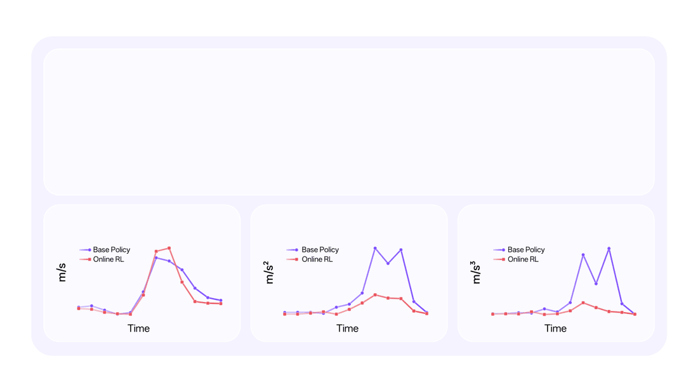
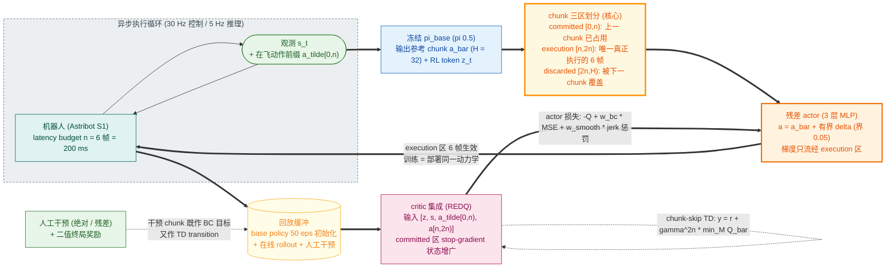

# SmoothRL: Online Reinforcement Learning During Asynchronous Execution

- arXiv: https://arxiv.org/abs/2608.29768
- Source: Astribot（Guang Gao*, Yuxuan Nong*, Baifu Huang；Project Lead Jianan Wang）
- Project: https://www.astribot.com/research/SmoothRL
- Local PDF: `papers/rl/vla/SmoothRL_2608.29768.pdf`
- Year: 2026
- Category: online RL x async chunk execution
- Priority: high

（注：本地 PDF 第 17-21 页内容流损坏、渲染为空白；实验数字取自 arXiv HTML v1 交叉核对。）

## 一句话总结

**Problem**：VLA/WAM 推理延迟高 → 部署标配是"异步推理 + action chunk"（推理与执行重叠），但现有在线 RL 全部假设同步执行——训练目标与部署动力学错配，值梯度会流过从未被执行的动作；**Insight**：把异步执行本身建模为优化约束：latency budget n 把每个 chunk 按帧号钉成三区——committed [0,n)（已被上一 chunk 占用）/ execution [n,2n)（真正执行）/ discarded [2n,H)（将被下一 chunk 覆盖）；**Mechanism**：SmoothRL 在异步推理循环内在线微调——critic 条件于"已执行前缀+新 chunk"（committed 区作 state augmentation 保 chunk-skip backup 无偏），∇_a Q 只经 execution 区回传（梯度截断），训练 rollout 就跑异步 loop（"Reinforce in Deployment"）；**Evidence**：真机三任务 250 episodes 内成功率 抛投 39%→94%、笔帽 8%→83%、开箱 30%→90%；右末端加速度 RMS −52%、jerk −47%。

## 九问速览

1. **Problem**：预训练策略的可靠化（在线 RL 微调）与实时平滑执行（异步 chunk 推理）必须同时满足，此前无人同时做。
2. **Bottleneck**：异步执行下每个 chunk 只被部分执行——值梯度若流过未执行（superseded）动作，策略更新被"污染"且无法靠执行调度规避，只能写进目标函数。
3. **Insight**：两条硬要求——**agreement**（Q 的求值动作 = 机器人实际执行的动作）与 **differentiability**（该动作到策略参数有梯度路径）；按帧号划分三区 + 梯度截断即可同时满足。
4. **Method**：RL Token 骨架（frozen π0.5 + RL token z_t + residual actor 输出 bounded 修正）+ chunk 三区划分 + TD3/REDQ critic 吃 [z,s,ã[0,n),a[n,2n)] + 人工干预（绝对/残差）直接进 buffer。
5. **Evidence**：抛投 39%→94%（150/200/250 集时 72/83/94）、笔帽 8%→83%、开箱 30%→90%（前 150 集曾跌至 20%）；加速度/jerk RMS −52%/−47%（真实抛投 rollout）。
6. **Ablation**：**无正式消融**（梯度截断/committed 输入/同步训练对照缺失）；仅有干预模式对比：远桶抛投 VR 绝对遥操作 ~30% vs 残差干预 ~80%；示教遥操作本身只 ~50% 成功。
7. **Assumption**：推理延迟有上界（budget n 守得住，TT-RTC 调度器）；base policy 表征与参考 chunk 足够好（改进限于其局部邻域，修正界 0.05）；有人工干预与末端二值奖励判定。
8. **Failure**：开箱前 150 集掉到 20%（探索代价）；改进受 bounded residual 表达力封顶（作者自述限制 2）；延迟超预算则计划性交接失稳（限制 1）。
9. **Opportunity**：全生成策略端到端微调（QAM 式 adjoint 终端条件 ∇_aQ）；把 blending 混合算子写进目标；更大分布偏移下的适配极限测试。

| 维度 | 论文答案 |
|---|---|
| Perception | π0.5：3 相机 224×224（头 + 左右腕）+ 本体感知；RL 模块吃压缩 RL token z_t + s_t + 参考动作 chunk（不重复编码图像） |
| Closed-loop | **核心战场：异步执行中的在线修正**——30Hz 控制、5Hz chunk 更新（n=6 帧 = 200ms 预算），execution 窗 [n,2n) 每次实际生效 6 帧后即被新 chunk 接管；块内开环但 5Hz 滚动重规划，推理延迟被完全隐藏、无 chunk 边界停顿 |
| Correction | 人工干预即时纠错（绝对=替换 chunk / 残差=叠加修正），干预动作与策略输出同处原始动作空间——直接作 BC 回归目标 + TD transition 进 buffer，无需 latent 逆映射 |
| Deployment | Astribot S1 真机（25-DoF 双臂移动平台）；frozen π0.5（每任务微调版）+ 轻量 attached 网络；异步 loop 训练期即运行（训练=部署同动力学） |

## 核心技术

**信息流：frozen π_base(s_t, ã[0,n)) → (参考 chunk ā, RL token z_t) → residual actor 输出修正 chunk → 只执行 [n,2n) → 异步 loop 记录 transition → off-policy 更新。**

*论文 Figure 1（p2）：Figure 1 | Top: SmoothRL enables online RL fine-tuning of pretrained robot policies under asynchrono*

1. **π_base + 编码器 E（frozen）**：π0.5 每任务微调后冻结；每次前向产出参考 chunk ā_{t:t+2n} 与内部表征压缩成的 RL token z_t=E(π_base)；TT-RTC 调度器保证时序承诺。
2. **actor π_θ（全部可学习参数所在）**：3 层 512 宽 MLP，输入 [z_t, s_t, ā_{t:t+2n}]，输出对参考 chunk 的 **bounded 修正**（界 0.05）→ 最终 chunk a=ā+Δ；只修改 20 个臂动作维（躯干/头/夹爪原样）。
3. **critic Q_φ（REDQ 式 ensemble，N 个独立 critic）**：3 层 512 宽 MLP + 每隐层 LayerNorm，输入 **[z_t, s_t, ã[0,n), a[n,2n)]**——committed 区以 stop-gradient 进入（状态增广：异步执行是并发决策过程，在飞动作是状态的一部分）；TD3 式 target（target actor 加 clipped 高斯噪声）+ 随机子集 M 上取 min。
4. **三区划分（§3.1）**：latency budget n 使 d_k=c_k=n 对每个 chunk 成立：committed [0,n)（推理期间流逝、由上一 chunk 供动作）、execution [n,2n)（本 chunk 真正被执行的 6 帧）、discarded [2n,H)（H=32 中剩余 20 帧，被下一 chunk 覆盖、从不触达环境）。实际延迟低于预算的部分转化为等待（而非换取更新鲜的观测）。
5. **梯度截断（§3.3）**：∇_a Q 只对 a[n,2n) 计算；committed 区对 actor 只是条件输入（衔接处的连续性），对 critic 是状态增广；discarded 区完全出目标。
6. **人工干预（§3.4）**：绝对（VR 遥操作，适合高精度）与残差（手柄增量，保速度轮廓、适合动态任务）两种模式；干预期间 base/actor 照常推理、只替换 issued action；issued action 记入 ã[0,n)，intervened chunk 的 BC target = issued action（否则为参考 chunk）。
7. **训练循环（Algorithm 1，双进程共享 buffer）**：Process 1 异步 rollout（每 n 帧一个决策步，transition 在 t+2n 才补全 reward/next state）；Process 2 每追加一条轨迹做 G=5 次 critic 迭代（batch 256），每 D=5 次迭代做一次 actor 更新 + soft target 更新。buffer 以 frozen base policy 的 50 条 rollout 初始化（保证 transition 全部符合目标的时间语义）。

## 底层原理与数学推导

**1. chunk-skip Bellman backup（式 3，chunked MDP）。** 把长度 H 的 chunk 当原子动作：

$$
Q(s_t, \mathbf{a}_{t:t+H}) \leftarrow r_t + \gamma^{H} Q\big(s_{t+H},\, \pi(s_{t+H})\big)
$$

无偏性来源与 Q-chunking/DQC 相同：critic 条件于**产生该区间奖励的那段动作序列**。本文引用 DQC 支撑"critic 条件的 span 不必等于策略优化的 span"。

**2. 异步执行下的策略目标（式 4，本文核心）。** 目标 span 限制在前 2n 帧，执行约束写成可执行集 E：

$$
\max_\theta \;\mathbb{E}\Big[Q\big(s,\;\tilde a_{[0,n)},\;\pi_\theta(s)_{[n,2n)}\big)\Big]\qquad \text{s.t.}\quad (\tilde a_{[0,n)},\, \pi_\theta(s)_{[n,2n)}) \in \mathcal{E}
$$

其中 ã[0,n) 是上一 chunk 实际发出的动作（对当前策略为常量）；E 是 [0,2n) 上物理可执行且跨 n 帧边界连续的 chunk 集合——**可执行性是整个 chunk span 的属性而非仅 execution 区**。chunk-skip backup 同步截到 [0,2n)：reward 累计 2n 帧、bootstrap 于 s_{t+2n}、折扣指数 2n。

**3. actor 损失（式 5）。** 三项：Q 最大化（经 stop-gradient 的 committed 前缀）+ TD3+BC 式锚定（对 target 动作而非数据动作）+ 平滑正则（可执行集 E 的惩罚松弛——对速度/加速度/jerk 的逐帧界）：

$$
\mathcal{L}_{\text{actor}} = -Q\big(z, s, \mathrm{sg}[\tilde a_{[0,n)}],\, a_{[n,2n)}\big) + w_{bc}\,\|a - a_{\text{target}}\|^2_{[0,2n)} + w_{\text{smooth}} \sum_{k=1}^{3} w_k \,\|\Delta^k a\|^2_{[0,2n)}
$$

a_target：committed 区恒为参考动作；execution 区在干预 chunk 上为实际发出的动作、否则为参考动作。sg[·] 只作用于梯度路径——critic 仍吃完整 chunk。

**4. critic TD target（Algorithm 1）。** target actor 加 clipped 噪声，REDQ 子集最小化：

$$
y = r + \gamma^{2n}\min_{i\in M} Q_{\bar\phi_i}\big(z', s', \tilde a'_{[0,n)},\, a'_{[n,2n)}\big),\qquad a' = \pi_{\bar\theta}(z', s', \bar a') + \epsilon
$$

**5. 并发决策的状态增广。** execution 区不是从 s_t 而是从 s_{t+n} 开始起作用，中间帧由在飞 chunk 控制——off-policy 下这会在 buffer 里混合旧策略行为；并发决策理论（Xiao et al. 2020）要求增广"在飞动作 + 剩余时间"。budget n 把后者固定为常数，chunk 生成时的 committed 前缀**免费且精确地**提供了前者——这是"critic 必须吃 committed 区"的第二个理由（第一个是无偏性）。

## 物理直觉解释

**三区划分像"接力赛的交接棒区间"。** 一个 H=32 帧的 chunk 生下来就注定只有中间 6 帧真正落地：前 6 帧（committed）是它还在推理时、上一棒已经在跑的路——它预测得再好也改不了已经发出的动作；中间 6 帧（execution）是它亲自跑的赛段；后 20 帧（discarded）是它白练的部分——下一棒（由更新观测算出的 chunk）会直接顶掉。同步 RL 的错误在于把整根接力棒都当成"自己的成绩"来优化：你为一个从没跑过的赛段调整了挥棒节奏，真正跑的那 6 帧反而没优化到位。SmoothRL 的梯度截断就是把训练信号对齐到真实赛段——**只为真正打出去的球调整挥棒**。而 critic 吃完整前缀的原因也很物理：你这 6 帧能跑多快，取决于上一棒交给你时的速度（committed 区），它是环境状态的一部分，不是你的选择。

**latency budget 像"地铁按时刻表发车而不是按到站时间发车"。** 真实推理延迟是随机抖动的——这会让三区边界变成随机变量，而 chunk 生成时根本不知道自己将来会在哪一帧被接管。与其建模这个随机性，SmoothRL 直接把它消灭：估计延迟上界 n，每 chunk 提前 n 步请求，早算完就等着。代价是"新鲜度换确定性"——明明可以早 50ms 拿到更新观测，却宁可等；换来的是三区边界变成纯帧号函数，训练目标在整个数据集上语义一致。这个取舍在 RL 里比在 IL 里重要得多：IL 只需要动作平滑（blending 就能兜底），RL 还需要 **Q 的求值点和梯度回传点逐帧对齐**——blending 的动作在两个 chunk 都能算出来之后才定，没有单一策略参数的梯度路径，天然违反 differentiability 要求。这就是为什么本文选"直接输出 + 约束优化"而非轨迹混合。

**"Reinforce in Deployment"像"在真实路况里学开车，而不是在驾校模拟器里学完再上路"。** 大多数在线 RL 方法在同步执行（训练）下学策略、部署时却换异步执行——动力学变了（每个决策基于 200ms 前的旧观测、动作被部分覆盖），学到的 Q 与 π 的匹配关系悄悄失效。SmoothRL 让训练 rollout 就跑部署用的那个异步 loop：buffer 里记录的是"机器人真正执行的动作 + 真实时序"，策略从未在它部署时不会遇到的动力学下被优化。人工干预也长在同一条逻辑上：人的动作和策略输出同在原始动作空间，一段示范既是 BC 的回归目标（学人怎么修）又是 critic 的 transition（人修的动作值多少）——**人类干预不是训练管道的例外路径，而是目标函数的天然组成部分**。这套设计的直接物理收益就是开头那组数字：抛掷动作的加速度 RMS 降 52%、jerk 降 47%——平滑不再靠后处理缝合，而是优化目标本身（E 约束）+ 异步执行（无边界停顿）共同保证的。

## 工程细节与实操指南

- **时序参数（最要紧的一组）**：控制 30Hz；推理 5Hz（chunk 间隔 200ms）→ n=6 帧；H=32（base policy 输出）；有效优化 span 2n=12 帧（committed 6 + execution 6），discarded 20 帧。**设 n = ⌈推理延迟上界 × 控制频率⌉**，且 H≥2n。
- **动作空间**：31 维（左右臂/躯干 EE 各 9 维 delta 位姿 + 2 夹爪 + 2 头关节）；RL 只改 20 个臂维，修正幅度有界 0.05（残差模式）。
- **网络**：actor/critic 均 3 层 MLP × 512 隐层；critic 每层 LayerNorm + REDQ ensemble（N 个独立 critic、随机子集 M 取 min——N/M 数值未报告）；batch 256。
- **更新节奏**：每条新轨迹 G=5 次 critic 迭代；actor 与 target 网络每 D=5 次迭代更新一次（TD3 式延迟）；γ、τ、学习率数值未报告。
- **buffer 初始化**：frozen base policy 空 rollout 50 episodes（不用遥操作示教初始化——保证时间语义一致）。
- **奖励**：稀疏二值、episode 末由操作员目视判定（无 shaping、无中间奖励）。
- **干预设备选择**：动态任务用残差干预（手柄，保速度轮廓）；高精度任务用绝对干预（VR，全控 chunk）。
- **平滑约束**：E 用速度/加速度/jerk 的逐帧界刻画，松弛为惩罚项（w_smooth 与各阶 w_k 数值未报告）——超参跨任务共用（除文中列出者）。
- **评估**：抛投 18 episodes（3 物位 × 6 桶位）、笔帽 12（4 手态 × 3 位置）、开箱 10；在 150/200/250 累计 episodes 检查点评估。

## 实验协议清单

| 项目 | 论文设置 | 来源与备注 |
|---|---|---|
| 观测 | π0.5：3 相机 224×224（头/左腕/右腕）+ 本体感知关节状态；RL 模块输入 (z_t, s_t, ā_{t:t+2n})，z_t 为 VLA 内部表征压缩 token | §4.1、§3.4 |
| 动作空间 | 31 维 @30Hz（3×9 维 EE delta + 2 夹爪 + 2 头）；RL 只修正 20 个臂维，残差界 0.05 | §4.1、§4.3 |
| 控制频率 | 30 Hz（控制进程永远执行最新可用动作，不等推理） | §3.1、§4.1 |
| 重规划频率 | 5 Hz（每 200ms / n=6 帧一个新 chunk，异步交接） | §4.1 |
| 动作 horizon | base policy H=32 帧；RL 目标 span 2n=12 帧（execution 区 6 帧实际执行、20 帧弃置） | §3.3、§4.1 |
| 数据 | π0.5 每任务微调示教：开箱 1500 / 笔帽 1500 / 抛投 500 条遥操作（示教者抛投成功率仅 ~50%）；buffer 以 50 条 base policy rollout 初始化；在线数据 + 人工干预持续追加 | §4.3-4.5（arXiv HTML） |
| 奖励 | 稀疏二值，episode 末操作员判定成功（无 shaping） | §3.4 |
| Reset | 未报告（真机任务间重置细节） | — |
| 成功定义 | 抛投：物体入随机放置桶（桶口约 7×12cm、物体约 6×7cm）；笔帽：双臂合笔帽；开箱：割开封箱胶带并翻开箱盖 | §4.2 |
| 评估次数 | 抛投 18 eps（3 物位×6 桶位）、笔帽 12 eps（4 手态×3 位置）、开箱 10 eps；在 150/200/250 episode 检查点 | §4.4-4.5（arXiv HTML） |
| 随机种子 | 未报告（真机单配置运行） | — |
| 扰动测试 | 任务内随机化（物体/桶位置随机放置）；无显式外扰实验 | §4.2 |
| 真机 | Astribot S1：25-DoF 移动双臂（2×7 臂 + 平行夹爪、4-DoF 躯干、2-DoF 头、3-DoF 轮式底盘）；三任务（动态抛投 / 双臂笔帽 / 开箱） | §4.1-4.2 |
| 算力 | 未报告（attached 网络为 3 层 512 MLP，单步更新成本远低于 base policy 前向） | §3.4、§4.3 |
| 特权信息 | 无（图像 + 本体感知，无 oracle critic / 真值状态） | §3-4 |

**附录陷阱自查**：
- privileged 信息：无 oracle/特权 state；但 base policy π0.5 每任务微调（500-1500 条示教）——起点不是通用零样本模型，绝对成功率部分来自预训练红利
- reward shaping：无 shaping；但**人工判定成功**引入主观性（非自动判据，数值可能有操作员偏差）
- reset 难度：未报告；真机 reset 的标准化程度不明
- eval budget：每检查点 10-18 episodes——真机尺度合理但偏小，20% 级别差异可能落进噪声（如开箱 150 集的 20% vs 基线 30%）
- 底层控制栈：30Hz 控制 + 5Hz 异步推理 + TT-RTC 调度器（训练时序=部署时序是核心贡献，也是复现门槛）
- 数据优势：在线 RL 数据 250 episodes/任务量级 + 人工干预；**无任何消融**（梯度截断、committed 输入、异步 vs 同步训练的对照缺失）——方法各组件的必要性只有理论论证、无实验隔离；基线仅 frozen base policy（无 GR-RL/RLT/EXPO-FT 等同类方法对比）

## 消融实验与分析

**本文无正式消融实验**（梯度截断、committed 区 critic 输入、同步 vs 异步训练均无对照）——理论必要性的实验验证是本文最大留白。可用的定量数据如下：

**训练进程（Table 1，累计 rollout episodes 下的成功率 %）：**

| 任务 | Base（0） | 150 eps | 200 eps | 250 eps | 备注 |
|---|---|---|---|---|---|
| 动态抛投 | 39 | 72 | 83 | **94** | 对异步执行最敏感（chunk 边界停顿 = 甩投速度归零） |
| 笔帽（双臂） | 8 | 67 | 75 | **83** | 高精度双臂协调 |
| 开箱（割胶带+翻盖） | 30 | 20 | 40 | **90** | 前 150 集跌破基线（探索代价），后段大幅反超 |

**平滑度（Figure 1，右末端 XYZ 在每 chunk 上的 RMS，真实抛投 rollout）：**

| 指标 | Base policy vs Online RL | 来源 |
|---|---|---|
| 加速度 RMS | **−52%** | Figure 1 下 |
| jerk RMS | **−47%** | Figure 1 下 |

**干预模式对比（§4.3，远桶位抛投，准消融）：**

| 设置 | 成功率（约） | 含义 |
|---|---|---|
| VR 绝对遥操作（远桶） | ~30% | 纯人直接接管 |
| 残差干预修正 base chunk（远桶） | ~80% | **策略参考 + 人的增量 > 人独走**——BC 锚 + 干预数据的组合收益 |
| 示教者抛投成功率（采数时） | ~50% | 示教本身次优，RL 后 94% 已超过示教水平 |

**核心结论**：真机证据链是"训练前→训练后 + 平滑度"三点式（39→94、8→83、30→90；−52%/−47%），加上"残差干预 > 绝对遥操作"的间接证据；**方法内部机制的因果隔离完全缺失**，读者无法从实验区分：收益来自梯度截断、committed 增广、异步训练语义、还是 residual+BC 锚本身（RLT/EXPO-FT 已验证过最后一项）。

## 技术权衡（Trade-off）

| 优势 | 劣势与工程代价 |
|------|---------------|
| 首次在异步推理 loop 内做值梯度在线 RL：训练=部署动力学，无"执行模式迁移"错配 | latency budget 是硬约束：推理延迟超预算即调度失稳（模型越大越危险）；早算完只能干等，牺牲观测新鲜度 |
| 梯度截断 + committed 增广保证 agreement/differentiability，理论上无梯度污染 | 无消融、无同类方法（GR-RL/RLT/EXPO-FT）对比；收益归因不清 |
| 人工干预在原始动作空间：同一份数据同时是 BC 目标与 TD transition，无需 latent 逆映射 | 改进封顶于 base policy 局部邻域（bounded 0.05 残差）；分布偏移大时需换更强参数化（作者自述） |
| 动态任务（抛投）直接受益：无 chunk 边界停顿 + 显式平滑约束（−52%/−47%） | 稀疏人工判定奖励 + 小评估预算（10-18 eps）；关键超参（γ、τ、N/M、w_smooth）未报告，复现靠代码 |
| attached 小网络使梯度步成本远低于 base 前向，更新率受 rollout 吞吐限制而非算力 | 训练要人值守（干预+奖励判定），250 episodes 的墙钟与人力成本未报告 |

## 技术价值与演进定位

SmoothRL 补上了"chunk 执行三步曲"的最后一块：Q-chunking 让 RL 在 chunked action space 里学（但假设同步整段执行）、DQC 让 actor 短 chunk 保闭环（但在离线数据上）、SmoothRL 让**在线 RL 直接生活在部署时的异步执行循环里**。它的真正贡献不是某个新网络，而是把"哪些帧真正被执行"这个系统工程事实升格为优化目标的显式结构（三区划分 + 梯度截断 + 并发状态增广），并给出两条可检验的设计公理（agreement + differentiability）——这两条公理直接否决了轨迹混合（blending）家族在在线 RL 里的合法性，也解释了为什么 chunk-stitching 一致性约束（执行前修改 chunk 但保持策略输出=执行动作）与值梯度范式兼容。对 VLA 工程的意义：当模型大到推理必然异步时，"RL 后训练"不必退回 offline 轮次（χ0/RECAP/CO-RFT 路线）或 latent 空间受限优化（GR-RL 路线），可以在原始动作空间闭环完成。弱点同样清晰：全部机制证据是理论性的，且表达力被残差界锁死——与 QAM 式全策略 adjoint 微分的结合是它自己指出的出路。

## 与其他论文的关系

- **notes/rl/core/q-chunking.md**：Q-chunking 建立 chunked MDP 的无偏 chunk-skip backup（critic 条件于整段动作），SmoothRL 的式 3 直接继承该形式；但 Q-chunking 同步执行整段 chunk，SmoothRL 把执行改为异步部分执行并处理由此产生的梯度污染——从"chunked RL 是否可行"推进到"chunked RL 在真实部署节奏下是否可行"。
- **notes/rl/core/dqc.md（被本文直接引用为其 [14]）**：DQC 证明"critic 条件的 action span 不必等于策略优化的 span"（解耦 + 闭环执行前缀）；SmoothRL 是同一原理在真机异步设定的实例化——critic span=2n 帧的执行窗口、actor 梯度只走 [n,2n)，且多了 DQC 没有的"在飞动作状态增广"（并发决策）。
- **notes/rl/vla/rl-token.md（RLT，本文骨架）**：SmoothRL 直接采用 RLT 的 frozen VLA + RL token + chunk 级 actor + TD3+BC 骨架，区别有三：chunk 三区显式划分（帧号级梯度截断可表达）、chunk-skip backup、REDQ ensemble——即"RLT + 异步执行语义"。
- **notes/architecture/why-chunking-works.md（chunking 理论）**：该文的"推理暂停是真机隐形税、chunking 是免税额度"与"延迟容忍=异步化空间"正是 SmoothRL 的动机句；但其 RDE/延迟部署在 IL（无 Q 梯度），SmoothRL 进一步指出 blending 类平滑手段违反 differentiability——两文合读可见 IL 与 RL 对"执行平滑"的要求不同构。
- **notes/architecture/chunking-exploratory.md（chunking 理论）**：该文的开环稳定性分析适用于 chunk 内执行（6 帧开环窗口靠底层控制回正）；SmoothRL 的平滑约束（速度/加速度/jerk 惩罚）是可执行集 E 的显式化——把该文隐含的"系统能容忍多长的开环"变成目标函数里的软界。
- **notes/data/mobile-aloha-act.md（ACT）**：ACT 的 temporal ensemble 是最早的 chunk 边界平滑手段（事后加权平均）；SmoothRL 证明该族（blending）与值梯度在线 RL 不兼容（混合动作无单一策略梯度路径），必须换成一致性约束/直接输出——是 ACT 部署惯例在 RL 时代的修正。
- **notes/architecture/diffusion-policy.md（Diffusion Policy）**：DP 的 receding horizon（预测 16 执行 8）假设推理可同步完成；SmoothRL 面向推理延迟 > chunk 生效窗口的现代 VLA 尺度，预测 H=32、有效执行 6——"预测远长于执行"的极端化，同时把执行节奏写进训练目标。
- **notes/briefs/action-chunking-brief.md（88 方法大纲卡）**：SmoothRL 是分类轴 2（RTC 实时/异步推理）与分类轴 5（RL × chunk）的交点条目——此前两轴各自发展（轴 2 无 RL、轴 5 假设同步），本文是首个把两轴焊起来的方法；其对 blending 的 differentiability 批判为轴 4（边界噪声）方法划出了在 RL 设定下的适用边界。
- **notes/rl/core/flashsac.md（RL 高维控制）**：FlashSAC 代表"仿真高吞吐 + sim-to-real 零微调"路线（50Hz 全闭环、无 chunk）；SmoothRL 代表"真机低吞吐 + 在线适配异步 chunk"路线——两者是现实机器人 RL 的两个极端部署形态，前者吃仿真红利、后者吃预训练先验红利。
- **GR-RL / χ0 / RECAP / CO-RFT（外部，Related Work 分类的三类"牺牲者"）**：分别牺牲"参数空间直接优化/在线性/值梯度"来回避异步污染；SmoothRL 的三要求框架（Online + Asynchronous + Value-gradient）把这四篇精确定位在牺牲象限里。

## 精读问题

1. 梯度截断的因果贡献到底多大？缺一个"∇_a Q 流过全 chunk [0,2n)"的对照——被 committed 区污染的梯度会高估策略对已定帧的控制力，掉多少分、以何种方式失效（发散 or 次优）？这是全文最该补的消融。
2. latency budget 的"新鲜度换确定性"在延迟分布长尾（偶尔 >200ms）时如何退化？预算 n 自适应（如按延迟分位数动态调 n 并重对齐区域定义）是否可行，还是必然破坏帧号语义？
3. 与 blending 的组合真不可行吗？作者自答"可以但需额外 actor 前向 + 混合算子处的连续性约束"——若把 blending 权重也当可微算子（每 chunk 只差分一次、区段不重叠），代价与收益的定量边界在哪？
4. 残差界 0.05 是什么单位/如何标定？分布偏移超过界时（base 从没见过的任务变体）性能是软退化还是硬失败？逐步放松参考约束（课程式放大残差界）能否突破表达力封顶？
5. 稀疏人工奖励 + REDQ 的组合在 250 episodes 尺度上依赖多强的 critic 先验（buffer 以 base policy 50 episodes 初始化）？把奖励自动化（视觉判据）会引入多大的标签噪声代价？
6. 决策周期 5Hz、transition 跨 2n=12 帧且相邻 transition 在 committed 区重叠 6 帧——这种重叠 bootstrap 的偏差/方差性质与 DQC 的 h=25 非重叠 chunk 有何本质差别？γ^{2n} 的有效 horizon 缩短对更长程任务的极限在哪？
7. 并发状态增广只用了"在飞动作"（剩余时间被 budget 常数化）——若放宽 budget 固定假设（问题 2），增广需要补时间维度，Q 的输入维度与时序对齐如何设计？

