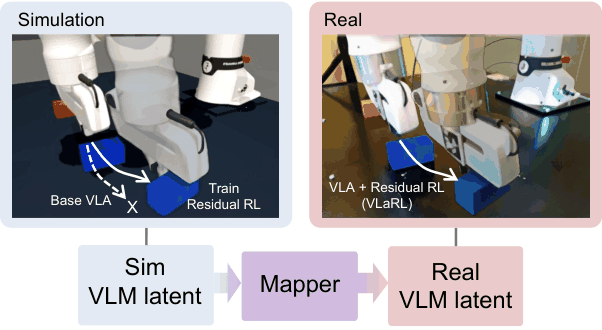
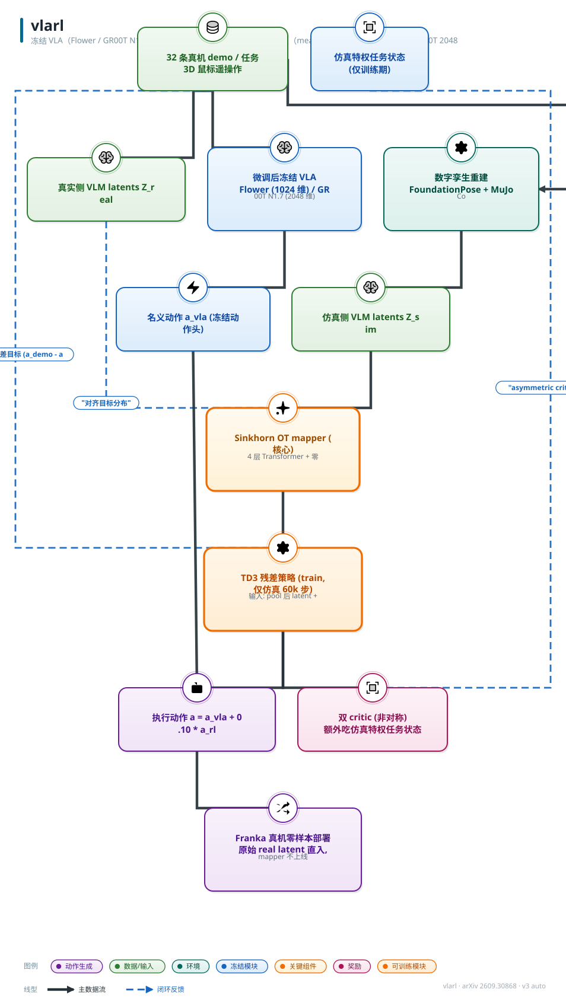

# VLaRL: 用仿真训练的潜条件残差 RL 增强 VLA

- arXiv: https://arxiv.org/abs/2609.30868
- Source: https://arxiv.org/abs/2609.30868
- Project:
- 本地 PDF：`/Users/luogu/physical_intelligence/papers/rl/vla/VLaRL_2609.30868.pdf`
- Year: 2026
- Category: rl
- Priority: high

（待确认：论文只提供视频 https://youtu.be/fCkMXTdt1gk ，未给项目页/GitHub；微软亚洲研究院（东京）+ KAIST + 东京大学。）

## 一句话总结

冻结 VLA（Flower / GR00T N1.7 两个骨干），把其内部 VLM token 表征（mean-pool 后 Flower 1024 维、GR00T 2048 维）同时作为残差策略的输入和 sim-to-real 接口：先用同一批真机演示微调并冻结 VLA、用 FoundationPose 重建 MuJoCo 数字孪生，再用 Sinkhorn 最优传输训练一个零初始化残差连接的 4 层 Transformer mapper 把仿真侧 latent 拉向真实分布，TD3 残差策略（$a_t=a^{VLA}_t+\alpha a^{RL}_t$，$\alpha=0.10$）完全在仿真里训 60,000 步、真机零 RL 零在线适应直接部署。四个接触任务 × 两个骨干共 8 组真机全部提升（Flower 按钮 67.5%→100%、推块 22.5%→50%；GR00T 杯叠 17.5%→45%）；去掉 mapper 后推块/叠杯真机 40 试全败（0.0%），去掉 VLM latent 后四任务平均掉约 25 个点。

## 九问速览

1. **Problem**：VLA 的最后毫米接触精度不足；真机 RL 贵且危险，仿真训练的策略直接迁移吃感知 gap。
2. **Bottleneck**：残差 RL 要么真机训练（贵/危险），要么仿真训练但 latent 表征分布与真实不匹配。
3. **Insight**：VLM 内部 latent 可作 sim-to-real 的传输介质——对齐表征分布比桥接像素或位姿便宜。
4. **Method**：冻结 VLA；Sinkhorn OT mapper（零初始化残差）对齐 sim-real latent；TD3 残差(α=0.10)纯仿真训练直部署。
5. **Evidence**：8/8 组合真机全升：Flower 按钮 67.5→100%、GR00T 杯叠 17.5→45%；零真机 RL、零在线适应。
6. **Ablation**：去 mapper 推块/叠杯 40 试全败（0.0%）；去 VLM latent 平均 −24.4pp；latent 归因 72-91%。
7. **Assumption**：每任务 32 条 demo+FoundationPose 数字孪生可建；gap 主要在感知表征而非接触动力学。
8. **Failure**：不治动力学/摩擦差异（杯叠仿真 +38.9 vs 真机 +5.0）；α=0.10 固定限制深接触任务上限。
9. **Opportunity**：跨骨干/跨技能共享残差、接触参数随机化、按接触深度自适应 α。

| 维度 | 论文答案 |
|---|---|
| Perception | VLM token 表征（mean-pool 1024/2048 维）+名义动作+本体+3 维腕部 Cartesian 力；真机部署不用 mapper |
| Closed-loop | 闭环：残差策略在线逐 step 修正名义动作 |
| Correction | 无重试机制；残差即时修正即全部反馈 |
| Deployment | MuJoCo 数字孪生训练 60k 步 → Franka 真机零样本部署；全部模型部署期冻结 |

## 核心技术

*论文 Figure 1（p1）：Fig. 1*

1. **VLM latent 作为残差接口**：把冻结 VLA 拆成视觉-语言模块 $E_{VLM}$（输出 token 矩阵 $Z_t\in\mathbb{R}^{S\times D}$）与动作头 $\pi_{act}$；残差策略吃 mean-pool 后的 $z_t\in\mathbb{R}^D$ 加名义动作 $a^{VLA}_t$、本体状态 $s_t$、腕部 Cartesian 力 $f_t$，输出修正项，执行 $a_t=a^{VLA}_t+\alpha a^{RL}_t$。latent 暴露"动作从哪个视觉-指令语境生成"的信息，而名义动作本身不携带——同一场景下不同指令目标需要不同修正时（红杯进白杯 vs 白杯进红杯），latent 可分辨、动作不可分辨。
2. **OT-based latent mapper**：数字孪生只给"近似对应"而非帧级对齐，所以用分布对齐而非逐样本回归——mapper $M_\theta$ 作用在 pool 前的 token 矩阵上，传输代价加轨迹进度正则（$\lambda_\tau=0.5$），熵正则 OT 用 Sinkhorn 迭代（$\varepsilon=0.05$、50 次迭代）求解；可学习残差连接缩放零初始化，mapper 从恒等出发。
3. **仿真内非对称 actor-critic + demo 残差目标**：critic 额外吃仿真特权任务状态、actor 只吃真机可得的观测；演示构造残差目标 $a^{RL,demo}_t=(a^{demo}_t-a^{VLA}_t)/\alpha$ 作辅助正则，把 RL 探索锚在演示行为附近；训练期 VLA 与 mapper 全冻结，只优化残差策略。
4. **部署即插即用**：真机侧 VLA 产出名义动作与真实 token 表征，真实 latent 直接 mean-pool 喂残差策略——mapper 不上线、无真机 RL、无在线适应；所有模型部署时全冻结。
5. **归因验证**：集成梯度显示 VLM latent 对残差动作范数的归因在 Flower 上 72.1–89.7%、GR00T 上 84.0–90.9%，且物理输入贡献随任务切换（推块力归因升、叠杯本体归因升）——残差策略确实在按任务需要组合语义与物理信号。

*架构速览：冻结 VLA（Flower / GR00T N1.7 两个骨干），把其内部 VLM token 表征（mean-pool 后 Flower 1024 维、GR00T 2048 维）同时作为残差策略的输入和 sim-to-*

## 底层原理与数学推导

冻结 VLA 的动作生成 $Z_t=E_{VLM}(o_t,\ell)$，$a^{VLA}_t\sim\pi_{act}(\cdot\mid Z_t)$；残差策略与执行动作为

$$a^{RL}_t=\pi^{RL}\big(z_t,\,a^{VLA}_t,\,s_t,\,f_t\big),\qquad a_t=a^{VLA}_t+\alpha\,a^{RL}_t$$

其中 $z_t=\mathrm{MeanPool}(Z_t)\in\mathbb{R}^D$（Flower $D=1024$、GR00T $D=2048$），$\alpha=0.10$ 为跨任务共享的固定残差缩放。mapper 在 pool 前作用于 token 矩阵 $\tilde Z^s_t=M_\theta(Z^s_t)$，训练目标是分布级的：仿真样本 $i$ 与真实样本 $j$ 之间的传输代价

$$C_{ij}=\frac{\big\|M_\theta(Z^s_i)-Z^r_j\big\|^2_F}{SD}+\lambda_\tau\big|\tau^s_i-\tau^r_j\big|^2$$

以轨迹进度 $\tau\in[0,1]$ 为软对应信号（$\lambda_\tau=0.5$），经熵正则 OT（Sinkhorn）优化——这绕开了数字孪生帧级错位的问题：不需要知道仿真第 $k$ 帧对应真机第几帧，只需要两个分布在进度加权的意义下重叠。mapped 后 pool：$\tilde z^s_t=\mathrm{MeanPool}(\tilde Z^s_t)$，mapper 在 RL 阶段冻结。残差学习的演示锚为

$$a^{RL,demo}_t=\frac{a^{demo}_t-a^{VLA}_t}{\alpha}$$

即把"演示比 VLA 好的那部分"除以缩放因子还原成残差空间的目标——RL 在这个先验附近做任务奖励驱动的探索。部署时真实侧 $z^r_t=\mathrm{MeanPool}(Z^r_t)$ 直接进策略：因为训练分布已经被拉向真实分布，策略输入的边缘分布近似对齐；残余差异（接触动力学、VLA 动作分布）不归 mapper 管，论文用 Flower 杯叠真机基线（65.0%）高于仿真基线（9.4%）的"反常"明确承认了这一点。

## 物理直觉解释

**导航员与副驾上的微调旋钮**。VLA 像一个方向感极好但手糙的导航员：知道"按红色按钮"是哪个钮、该从哪个方向接近（语言-视觉语义满分），但按下前的最后一毫米总是偏——差之毫厘就滑走或按不响。残差 RL 不换导航员，而是在副驾装一圈微调旋钮：名义航向由 VLA 锁定，旋钮只在 $\alpha=0.10$ 的幅度内做接触修正。Flower 按钮从 67.5% 到 100% 说明这最后一毫米完全是可以被修正量覆盖的；而残差策略知道自己"正在修正哪个语义对象"——靠的就是 VLM latent：归因显示 72–91% 的修正量由 latent 驱动，本体状态和腕力只做物理闭环的补丁。

**翻译官只正音，不改意思**。仿真侧的 VLM latent 像带口音的普通话：数字孪生的渲染差异让同一任务状态的 token 分布整体偏移，语义（"这是杯子、要叠进白杯"）没错，但口音重到残差策略这个"下游听众"听岔。mapper 是个翻译官：用最优传输把仿真口音的分布拉到标准音的分布上，进度正则保证"教学进度"也对齐（不会把起句对到收句）。零初始化残差连接意味着翻译官上岗第一天一句不改（恒等映射），只在该改的地方逐渐加重口音修正——这避免了 mapper 训练早期破坏表征。去掉翻译官的后果是灾难性的：推块和叠杯真机 40 试全败，因为残差策略听到的训练分布与部署分布根本是两种语言。

**仿真驾校，真机路考免考**。传统残差 RL 要么在真机上练（贵、危险，如 ResFiT），要么把仿真练的视觉策略硬迁（吃像素 gap）。VLaRL 的做法相当于在驾校模拟器里练科二，但练的时候戴着一副"真机视角眼镜"——所有观测先经 VLM 编码再经 mapper 校音，策略从第一天起学的就是真实 latent 分布上的修正；路考（部署）时摘掉驾校设备直接上车，眼镜（mapper）留在驾校。这条路能走通的前提是 sim-to-real 的残差主要卡在感知表征差而非动力学差——论文的边界条件也在这里：接触动力学、摩擦、柔顺的差异不被 mapper 覆盖，需要靠真机评估里那些"仿真提升大真机提升小"的落差来暴露。

## 工程细节与实操指南

- **硬件**：Franka Research 3（真机 + MuJoCo 仿真）；每任务 32 条真机演示（3D 鼠标遥操作）；数字孪生用 FoundationPose 重建物体位置与环境；同一批演示复用于 VLA 微调、sim-real latent 映射、演示残差目标三处。
- **两个骨干**：Flower（Florence-2 系视觉-语言模块，语言条件 token，pool 后 1024 维）；GR00T N1.7（语言条件 image token，2048 维）；动作接口均为归一化 7 维 Cartesian（3 平移 + 3 旋转 + 1 夹爪）。
- **mapper**：4 层 Transformer encoder、16 注意力头、FF 维 = 2× token 维；Sinkhorn $\lambda_\tau=0.5$、$\varepsilon=0.05$、50 次迭代；可学习残差缩放零初始化。mapper 训练用的 sim-real 轨迹对数量未披露（待确认）。
- **残差 RL**：TD3；60,000 环境步；actor 与 twin critic 均为 4 层 ReLU MLP、隐宽 1024；actor 出 7 维 tanh 残差、近零初始化；batch 256、$\gamma=0.99$、Polyak $\tau=0.005$、$\alpha=0.10$；奖励 = 任务进度 + 终端成功奖金（按钮：目标接触；推块：持续位移限旋转；叠杯：接近并对齐指令杯；抽屉：减小开度）；非对称 critic 吃仿真特权任务状态。
- **任务与判据**：按钮（蜂鸣+亮灯）、推块（位移 >10 cm）、叠杯（重叠 >4 cm）、关抽屉（开度 <1 cm）；随机化 ±3 cm 位置、±15 度朝向（抽屉开度 ±3 cm）。
- **评估规模**：仿真 3 种子；真机每条件 40 试次；部署全程冻结、无真机 RL、无在线适应。仿真报告 3 种子方差，真机未报置信区间（待确认：40 试次的区间与显著性检验未给）。
- **训练时长**：RL 训练墙钟时间、mapper 训练时长、真机推理延迟均未披露（待确认：论文无延迟分解）。未见物体迁移：推块换星形/三角形物体 40.0%（16/40）→57.5%（23/40）；叠杯换天蓝/绿色杯 55.0%（22/40）→62.5%（25/40），零额外训练。

## 实验协议清单

| 项目 | 论文设置 | 来源与备注 |
|---|---|---|
| 观测 | pool 后 latent z（Flower 1024/GR00T 2048 维）+名义 VLA 动作+EE 位姿/RPY+夹爪+3 维 Cartesian 力 | Sec III / 附录 B |
| 动作空间 | 7 维 tanh 残差（3 平移+3 旋转+1 夹爪），执行 a=a_vla+0.10·a_rl；近零初始化 | 附录 B |
| 控制频率 | 未报告 Hz | |
| 重规划频率 | 每 step 残差修正（单步策略） | 附录 B |
| 动作 horizon | 单步残差；TD3 训练 60,000 环境步 | 附录 B |
| 数据 | 32 条真机 demo/任务（3D 鼠标遥操）；demo 复用于 VLA 微调/latent 映射/残差正则三处；mapper 训练轨迹对数量未披露 | 附录 B |
| 奖励 | 任务进度项+终端成功奖金（按钮接触/推块持续位移限旋转/叠杯对齐/抽屉减小开度）；系数未披露 | 附录 B |
| Reset | 仿真自动；物体位置 ±3 cm、朝向 ±15°（抽屉开度 ±3 cm）随机化 | 附录 C |
| 成功定义 | 按钮（蜂鸣+亮灯）/推块位移 >10 cm/叠杯重叠 >4 cm/抽屉开度 <1 cm | 附录 C |
| 评估次数 | 真机 40 trials/条件；仿真 3 seeds | 附录 C |
| 随机种子 | 仿真 3 seeds；真机未报置信区间/显著性 | 附录 C |
| 扰动测试 | 物体位置/朝向随机化；未见物体（星形/三角/换色）零训练迁移 40.0→57.5%、55.0→62.5% | 附录 C |
| 真机 | 4 任务×2 骨干=8 组合，40 trials/格，部署全程冻结 | Table I / 附录 C |
| 算力 | 未报告（TD3 4 层 MLP×1024 宽、batch 256、γ=0.99、Polyak 0.005；训练时长未披露） | 附录 B |
| 特权信息 | 有：非对称 AC——仿真 critic 吃特权任务状态，actor 只用真机可得观测；部署无 critic | 附录 B |

**附录陷阱自查**：
- privileged 信息：有（asymmetric actor-critic：critic 额外吃仿真特权任务状态；笔记正文已提，附录 B 确认）
- reward shaping：dense 任务进度项+终端奖金（各任务系数未披露）
- reset 难度：正常（仿真自动+随机化）
- eval budget：40 trials/条件，中等；无显著性检验
- 底层控制栈：归一化 7 维 Cartesian 名义+残差命令；未见 PD
- 数据优势：与冻结基线共享同一批 demo；mapper 额外用了 sim-real 轨迹对（数量未披露）

## 消融实验与分析

主表：真机成功率（40 试次/格），冻结基线对 VLaRL：

| 任务 | Flower 基线 | Flower+VLaRL | GR00T 基线 | GR00T+VLaRL |
|---|---|---|---|---|
| 按钮按压 | 67.5 | **100.0** | 87.5 | **95.0** |
| 方块推挤 | 22.5 | **50.0** | 45.0 | **52.5** |
| 杯子叠放 | 65.0 | **70.0** | 17.5 | **45.0** |
| 抽屉关闭 | 65.0 | **87.5** | 45.0 | **55.0** |

**核心结论：**
1. **8/8 组合全部提升**，增益分布 +5.0 到 +32.5 个点：最大增益出现在基线最弱的组合（GR00T 杯叠 17.5%→45.0% 即 +27.5、Flower 推块 22.5%→50.0% 即 +27.5），基线已强的组合增益收窄（GR00T 按钮 +7.5）——残差 RL 的价值与名义策略的执行缺口成正比。
2. **仿真趋势不完全外推**：Flower 杯叠仿真基线仅 9.4%（真机 65.0%），残差仿真 +38.9 点而真机只 +5.0 点；latent 对齐消除表征 gap，但不消除接触动力学与 VLA 动作分布差异——仿真数字不能当真机收益的预测器。
3. **mapper 是迁移的生死线**（Flower 真机消融）：w/o Mapper 推块 0.0%（VLaRL 50.0%）、叠杯 0.0%（70.0%）——40 试全败；按钮 90.0%、抽屉 60.0% 相对温和，说明目标可见性强的任务对未对齐 latent 的容忍度更高。
4. **latent 不是摆设**：w/o VLM latent（保留名义动作+本体+力）四任务 70.0/20.0/45.0/57.5%（对 100.0/50.0/70.0/87.5%），平均 -24.4 点——名义动作+物理反馈不足以替代语义语境。

组件消融与归因（Flower，真机 40 试）：

| 变体 | 按钮 | 推块 | 叠杯 | 抽屉 |
|---|---|---|---|---|
| VLaRL（完整） | 100.0 | 50.0 | 70.0 | 87.5 |
| w/o VLM latent | 70.0 | 20.0 | 45.0 | 57.5 |
| w/o Mapper | 90.0 | 0.0 | 0.0 | 60.0 |
| VLaRL（仿真侧） | 99.7 | 67.5 | 48.3 | 100.0 |
| w/o Mapper（仿真侧） | 100.0 | 30.2 | 10.3 | 84.7 |

集成梯度归因（归一化到 100%，latent/reference 动作/本体/力）：按钮 Flower 72.4/16.3/3.2/3.3、GR00T 89.8/8.2/3.9/3.0；推块 77.2/7.2/10.4/4.2（力归因升）；叠杯 72.1/11.8/7.2/4.0 与 GR00T 84.0/14.3/1.8/4.8（本体归因相对升）；抽屉 89.7/6.0/2.3/3.6、90.9/2.0/2.4/3.1。仿真侧增益同样分层：Flower 推块基线 32.5% → +mapper 42.5% → +残差 67.5%（mapper 单独就值 +10.0 点——它在仿真里顺带修复了"真数据微调的 VLA 面对仿真观测的表征漂移"）。

## 技术权衡（Trade-off）

| 优势 | 劣势 |
|---|---|
| 零真机 RL、零在线适应：安全与成本风险全部留在仿真（60,000 步仿真交互） | 依赖任务特定的数字孪生重建（FoundationPose + 近似对应轨迹）；配对构造只在训练期做但仍是每任务一次性工程 |
| latent 接口绕开像素级 sim-to-real：不学视觉表征、不装物体位姿估计器 | mapper 是每骨干一份、残差是每任务一份——不跨骨干共享、不跨技能共享（论文自列局限） |
| 冻结 VLA 保住指令条件行为与开放世界泛化（未见物体 40.0→57.5、55.0→62.5 仍提升） | 只校准表征 gap，不处理动力学/摩擦/柔顺差异——仿真-真机趋势可背离（杯叠 +38.9 仿真 vs +5.0 真机） |
| 残差幅度由 $\alpha=0.10$ 硬顶，名义行为不会被大改；近零初始化保证训练起点无害 | $\alpha$ 固定不随任务自适应；接触更深时 0.10 的预算可能不够（抽屉 GR00T 只到 55.0%） |
| 两骨干（flow 系 Flower、自回归系 GR00T）均验证 8/8 提升，接口设计对架构不敏感 | 每条件 40 试、无区间/显著性检验；w/o Mapper 的全败在推块/叠杯上样本量外的任务未复查 |

## 技术价值与演进定位

VLaRL 在"VLA 精度增强"谱系里占据了此前空着的一格：把 **VLM 内部表征当作 sim-to-real 的传输介质**。此前残差 RL 的接口要么是图像（直接吃视觉 gap，TRANSIC 一系靠真机纠正数据补偿）、要么是 6-DoF 物体位姿（需要独立感知管线与任务特定的状态定义，即同组的 object-centric residual RL）；RL Token 把 VLM 表征用作真机在线 RL 的状态接口，但训练发生在真机。VLaRL 的组合——OT latent 对齐 + 仿真内残差 + 部署直用真实 latent——让"仿真里练修正、真机上免调"第一次在两个异构骨干上成立。它的边界同样清楚：每任务的孪生与残差、动力学 gap 不治、未见物体只测了两类。演进方向论文自己指了：跨骨干的 latent 对齐、跨技能的共享残差。更深一层，这个"内部表征作为域桥"的思路对任何 frozen-model + 外挂控制器的架构都通用。

## 与其他论文的关系

1. `notes/rl/vla/rl-token.md` — RL Token 同样冻结 VLA 并用其内部表征（1×2048 读出 token）喂小 actor-critic，但训练在真机在线进行（螺丝 20%→65%，15 分钟到 5 小时真机数据）；VLaRL 把同一接口搬进仿真并用 latent 对齐免去真机交互（按钮到 100%，0 真机 RL）——两者分别是"表征读出 + 真机 RL"与"表征读出 + 仿真 RL + 分布对齐"的双路径。
2. `notes/rl/vla/simplevla-rl.md` — SimpleVLA-RL 在仿真里对 VLA 做 RL 精调（解耦双系统）；VLaRL 同为仿真 RL 路线但不改 VLA 权重、只训残差，把"改谁"从整个策略缩小到修正项——对 VLA 泛化能力的保护更保守。
3. `notes/rl/vla/z-1.md` — Z-1 用任务级 GRPO 对 π0.5 做 RL 后训练（模块化更新）；VLaRL 的对照面是"更新颗粒度"：GRPO 动策略权重 vs 残差 RL 完全冻结主干，两者在部署安全与知识遗忘上的取舍相反。
4. `notes/architecture/flower.md` — Flower 是本文双骨干之一（Florence-2 系 VLM、flow 动作头、pool 后 1024 维 latent）；VLaRL 的结果等于给 Flower 补了一个"接触精度外挂"：按钮 67.5→100、推块 22.5→50。
5. `notes/rl/sim2real/viserdex.md` — ViserDex 用 3DGS 渲染 + 域随机化在像素空间弥合 sim-to-real（灵巧手重定向）；VLaRL 的对照主张是：与其桥接像素，不如桥接预训练表征的 latent 分布——OT mapper 替代大规模渲染工程。
6. `notes/rl/sim2real/phys2real.md` — Phys2Real 用 VLM 估计物理参数再条件化 RL（real-to-sim-to-real 的物理轴）；VLaRL 明确不治物理轴（摩擦/柔顺差异留给残余 gap），两者是 sim-to-real 两个正交轴（感知轴 vs 动力学轴）上的分工。
7. `notes/rl/dexterous/torl-vla.md` — TORL-VLA 的在线 RL 也以实时力反馈修正动作（wrench 驱动 actor-critic）；VLaRL 的残差输入含 3 维 Cartesian 力 $f_t$ 且归因显示推块任务力贡献升——力作为残差输入的用法同源，但 VLaRL 无真机在线更新。
8. `notes/rl/dexterous/facet0.md` — Facet-0 的局部适配更新 6.6% 参数（FACET token + 有界 actor，绝对目标盒）；VLaRL 更激进地 0% 更新 VLA、只训独立残差 MLP——"冻结多少"谱系上的相邻两点，且都用冻结骨干的瓶颈表征做小策略的输入。
9. `notes/rl/vla/vlac.md` — VLAC 把 actor 与 critic 统一进 VLA 主干做真机 RL；VLaRL 的 critic 是独立 MLP 且只在仿真期存在（部署不需要 critic）——部署时计算栈的轻重是现实分野。

## 精读问题

1. mapper 的对齐质量与真机迁移增益之间有没有可测的代理指标——Sinkhorn 距离（对齐前后的 latent 分布距离）能否预测 w/o Mapper 的退化幅度（推块/叠杯全败 vs 按钮 90.0% 的差异）？
2. $\alpha=0.10$ 是全任务共享的，抽屉（GR00T 只到 55.0%）这类深接触任务会不会需要更大预算——按接触深度自适应调度 $\alpha$ 会不会同时守住安全与提升上限？
3. 残差策略对 latent 的 72–91% 归因是否部分是"latent 维度碾压物理输入"（1024/2048 维对 7+7+3 维）的维度偏置——用维度匹配的投影 latent 对照，归因结构还稳吗？
4. 演示残差目标 $(a^{demo}-a^{VLA})/\alpha$ 在 $\alpha=0.10$ 下放大 10 倍，会不会让正则在残差空间过强、压制任务奖励的探索——扫 $\lambda_{aux}$ 权重能找到什么形状的权衡曲线？
5. 数字孪生只需"近似对应"是 OT 的卖点，但近似到什么程度会失效——给进度标注加噪声（模拟孪生错位）做受控退化，Sinkhorn 对齐的鲁棒下界在哪里？
6. mapper 每骨干一份、残差每任务一份的成本结构能否打破——在两个骨干的 latent 上学共享的残差（跨 latent 的 adapter），Flower/GR00T 的残差增益能保留几成？
7. 未见物体迁移只测了形状（星/三角）与颜色（天蓝/绿）两类浅变化——换接触物理特性显著不同的未见物体（软杯、重块），残差修正的泛化边界在哪里？
8. 仿真与真机趋势背离（杯叠 +38.9 仿真 vs +5.0 真机）提示动力学 gap 主导该任务——若给孪生加接触参数随机化，真机增益能否被推起来，还是必须回到真机 RL？
