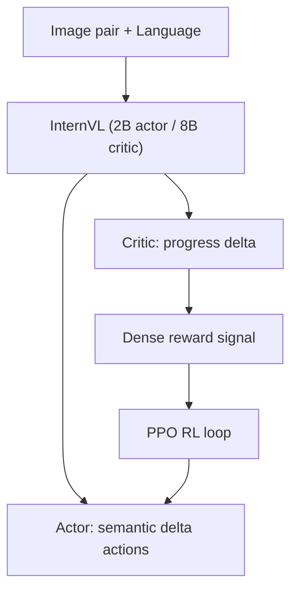

# VLAC: A Vision-Language-Action-Critic Model for Real-World Reinforcement Learning

- 本地 PDF：`papers/rl/VLAC_2509.15937.pdf`
- arXiv：https://arxiv.org/abs/2509.15937
- 年份：2025 (ICML 2026)
- 团队：上海 AI Lab (Shaopeng Zhai, Jiangmiao Pang 等)
- 阶段：统一 actor-critic 自回归 — 单模型同时生成动作和评估进度
- 注意：文中"8 机器人异步 RL"使用的本体是 AGILE PiPER 双臂机器人，非 Franka（Franka 在本论文正文中出现次数为 0）

## 一句话总结

VLAC 提出统一 actor-critic 自回归架构：基于 InternVL 多模态模型，通过 pair-wise progress understanding 输入两张观测图+语言指令，同时输出动作 (actor) 和 dense progress delta (critic)。40M 训练样本。真实世界 RL 中从 ~30% 提升到 ~90%（200 episodes），one-shot in-context 迁移到 unseen 任务。8 台 AGILE PiPER 机器人异步 RL（PPO），每台仅需 64 episodes 到 80% 成功率。核心洞察：**真实世界 RL 的瓶颈是 reward——不是算法。**

## 核心技术

1. **Pair-wise Progress Understanding** — 输入当前帧+历史帧 pair → 输出连续 progress delta 信号（正=前进，负=倒退），替代稀疏 handcrafted reward；critic 在成功轨迹上的 VOC-F1 达 0.89，失败轨迹上仅 0.44——说明 critic 学到的是"进展"而非"模式匹配"
2. **统一架构** — 同一 InternVL 模型，prompt 切换 actor/critic 模式：critic 输出 reward token，actor 输出 semantic delta EE pose；2B 参数做 actor、8B 参数做 critic（尺寸不对称：评估比执行更需要容量）
3. **One-shot in-context 迁移** — 给一个新任务的一张参考图，critic 能判断该任务的 task progress——不需 fine-tune；跨数据集泛化验证：unseen RT1 数据上 VOC-F1 达 0.95
4. **异步分布式 RL** — 8 台 AGILE PiPER 机器人, ZeroMQ+Ray, PPO, VLA 推理 <0.1s

## 底层原理与数学推导

统一自回归模型在同一序列上建模两类 token：动作 token 与进度 token。给定观测对 $(o_t, o_{t-\tau})$ 与语言指令 $L$，critic 输出进度 delta：

$$r_t = g(o_t, o_{t-\tau}, L) \in [-1, 1]$$

正值为"朝目标前进"，负值为"倒退"。这套 dense reward 替代了二元的 sparse success signal，使 PPO 每一步都能获得学习信号。策略侧沿用标准 clipped surrogate：

$$L^{PPO} = \mathbb{E}\left[\min\left(\frac{\pi_\theta(a|s)}{\pi_{\theta_{old}}(a|s)} A_t,\; \mathrm{clip}\left(\frac{\pi_\theta(a|s)}{\pi_{\theta_{old}}(a|s)}, 1-\epsilon, 1+\epsilon\right) A_t\right)\right]$$

其中 advantage $A_t$ 由 critic 的 progress delta 累积得到：$A_t = \sum_{k \geq 0} \gamma^k r_{t+k} - V(s_t)$，而 $V(s_t)$ 由同一 critic 的期望进度提供——actor 与 critic 共享多模态表示，但任务不同（生成动作 vs 评估进度），这正是"统一模型、双模式"的架构含义。

## 物理直觉解释

**Actor 是运动员，Critic 是裁判——但裁判给的是"连续分"而不是"进/不进"**。传统稀疏奖励的 RL 像一位只看终点的裁判：选手在场上怎么挣扎都是零分，只有最后 0/1 判决。这让运动员（策略）在大部分时间里没有任何反馈，只能随机摸索。VLAC 的 critic 是**盯每一拍的裁判**：它看两帧照片就能判断"这半秒你是接近了还是远离了"——像体操裁判从每个动作的幅度、角度、稳定性里给分，而不是只宣布"成功/失败"。连续进度信号让每一步都变成可学习的一小步，这就是 ~30% → ~90%（200 episodes）的收敛速度来源。

**为什么"看两帧"比"看一帧"更有信息量？** 单帧图像只能告诉你"现在在哪"（位置），两帧才能告诉你"在往哪去"（方向+速度）。进度评估本质上是个运动学问题：**同一张图可能是"刚推了一半"也可能是"推过头了"**——就像看一张停在跑道中间的照片，你无法判断运动员是加速还是减速，必须看两帧连拍。Pair-wise 输入把"方向感"编码进 critic，它才能输出正负分明的 delta。而"失败轨迹上 VOC-F1 只有 0.44"恰恰说明 critic 学到的是真实进展：失败的尝试在视觉上看起来"有动静"，但没有进展——区分这两者需要的是对任务因果的理解，而不是图像匹配。

**为什么 critic 用 8B、actor 用 2B？** 评估一个动作"算不算进展"比生成这个动作更难：生成只需要在当前分布里采样，评估需要对"什么才算接近成功"有全局理解，而且评估结果要被 8 台机器人共享使用。这就像**教练（8B）比运动员（2B）经验丰富**——运动员只需要执行，教练需要看穿所有运动员的表现。参数量不对称是"评估更贵、生成更便宜"这一物理直觉的直接工程化。

## 工程细节与实操指南

- Architecture: InternVL-2B (actor) + InternVL-8B (critic)，同一模型族、prompt 切换模式
- Reward: pair-wise progress delta, continuous signal, critic 输出 reward token
- RL: PPO, 8 台 AGILE PiPER 机器人异步采样, ZeroMQ+Ray
- 数据: 40M 训练样本 (VQA + Ego4D + robot datasets)
- 推理: VLA 推理 <0.1s，满足真实机器人控制频率
- 真实 RL: ~30% → ~90% (200 episodes)；每台机器人 64 episodes 到 80% 成功率
- 人类干预（HGE）辅助: 最终成功率 98% vs 无干预 88%

## 消融实验与分析

| 配置 | 指标 | 数值 |
|------|------|------|
| Critic VOC-F1（成功轨迹） | 进展识别精度 | 0.89 |
| Critic VOC-F1（失败轨迹） | 进展识别精度 | 0.44 |
| Critic 跨数据集泛化（unseen RT1） | 进展识别精度 | 0.95 |
| **Actor 5 任务平均初始成功率** | 零样本 | **~75%** |
| π0 对照（同任务） | 初始成功率 | 27% |
| 真实世界 RL（200 episodes） | 成功率 | ~30% → ~90% |
| 8 机器人异步 RL | 每台 episodes 数 → 成功率 | 64 → 80% |
| 有/无人类引导探索（HGE） | 最终成功率 | 98% vs 88% |

**核心结论**：(1) critic 的进展理解能力是奖励质量的决定因素——成功轨迹 0.89 vs 失败轨迹 0.44 的落差说明它区分"推进"与"徒劳"，而 0.95 的跨数据集泛化证明这种理解是任务级而非数据级；(2) 统一的预训练模型让 actor 零样本初始成功率（75%）远超 π0（27%）——VLA 预训练质量直接决定 RL 起点；(3) RL 的价值体现在 200 episodes 内 ~30%→~90% 的爬升，以及 64 episodes/机器人即可达到 80%——异步多机器人采样把真实 RL 的样本效率推进到"天级"；(4) 人类引导探索（HGE）提供 +10pp 的终局提升（98% vs 88%），说明"自动 reward + 人工引导探索"的组合优于任何单一策略——干预本身不污染 reward 是因为 critic 是独立的进度评估器。

## 技术权衡（Trade-off）

| 优势 | 劣势 |
|------|------|
| Dense progress reward 替代稀疏 handcrafted reward，RL 收敛快 | critic 需要 8B 模型推理，异步采样需额外 GPU 预算 |
| 统一模型双模式，actor/critic 共享表示、无需两套训练 | progress delta 的语义在长程任务（无明确子任务边界）上精度存疑 |
| One-shot ICL 迁移 + 跨数据集 0.95 泛化 | 未覆盖接触丰富的力控任务，critic 依赖视觉进展（无触觉） |
| 8 机器人异步 RL，64 episodes/机器人达 80% | 40M 样本预训练成本高，小团队复现门槛大 |

## 技术价值与演进定位

VLAC 的核心洞察是**真实世界 RL 的瓶颈是 reward，不是算法**：PPO 本身二十年没大变，但 reward 一直靠人工设计——稀疏的 0/1 信号让真实机器人 RL 的样本效率低到不可用。VLAC 用预训练 critic 把 reward 函数本身变成一个可学习、可迁移的组件，且 critic 的评估能力来自通用数据（VQA + Ego4D + robot），不依赖任务专用标注。这把 RL 的规模化路径从"每任务设计 reward"变成"一个通用 critic 服务所有任务"。与 RL Token（Physical Intelligence）互补：RL Token 用轻量 head 改造策略，VLAC 用大模型 critic 提供 reward——前者解决"策略怎么学"，后者解决"拿什么学"。

## 与其他论文的关系

- 与 π0/π0.5（Physical Intelligence）：本文 actor 的对照基线就是 π0 系列（27% 初始成功率），VLA 预训练 + 统一 critic 的组合证明了"基础模型质量 + 可学习 reward"的双轮驱动。
- 与 RL Token（Physical Intelligence）：RL Token 在 π0.5 上加轻量 RL 模块后训练，VLAC 在训练前就用统一模型预训练 critic——一个是后训练补丁，一个是预训练设计，两条路线都指向"RL 成为 VLA 标准步骤"。
- 与 WCM（世界批判模型）：WCM 用世界模型输出"成功概率 + 未来状态"做策略条件，VLAC 用 critic 输出"进度 delta"做 RL reward——前者条件化策略、后者引导学习，是"价值信号"的两种消费方式。
- 与 TORL-VLA（触觉在线 RL）：TORL-VLA 用实时 wrench 反馈精调动作（物理量 reward），VLAC 用视觉进展评估（语义量 reward）——物理量在接触任务上更直接，语义量在多样性任务上更通用。

## 精读问题

1. **Progress delta 在连续长程任务中的精度**：无明确子任务边界的任务（如整理桌面、多步骤组装）里，两帧图之间的"进展"定义是什么？critic 是否会学到"视觉变化即进展"的捷径？
2. **One-shot ICL 迁移的 failure mode**：什么类型的任务 critic 无法仅凭一张参考图泛化（对称物体？语义歧义？）？参考图的质量对迁移成功率的影响曲线？
3. **参数量不对称的边界**：critic 8B / actor 2B 的比例是经验值还是最优解？actor 增大到 8B 或 critic 缩小到 2B 时，真实 RL 收敛速度如何变化？
4. **progress delta 与物理反馈的融合**：critic 纯视觉，接触任务（力控、插拔）里视觉进展滞后于物理进展——融合 wrench/触觉信号后的 critic 是否更强（对比 TORL-VLA）？
5. **异步 RL 的通信开销与异质性**：8 台机器人异步采样时，机器人间的状态分布偏移（一台坏传感器）如何影响共享 critic 的进度判断？ZeroMQ+Ray 架构的吞吐瓶颈在哪？
6. **HGE 的干预粒度**：人类引导探索具体引导什么（初始状态、动作建议、还是目标重置）？干预频率与最终成功率的关系如何，是否会掩盖 critic 的不足？
