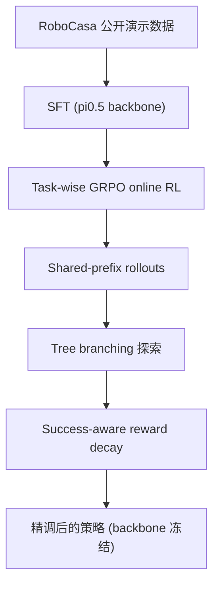

# Z-1: Efficient RL Post-Training for VLA Models（任务级 GRPO 后训练）

- 本地 PDF：`papers/rl/Z-1_2605.00345.pdf`（**注意：该 PDF 内容不匹配本论文**，实为 "Pose-Aware Diffusion for 3D Generation"，属下载错配；待确认：正确 PDF 需从 arXiv 2606.31846 重新获取）
- arXiv：https://arxiv.org/abs/2606.31846
- 年份：2026
- 团队：待确认（仅从摘要获取，需读取全文确认机构）
- 阶段：模块化 VLA RL 后训练 — π0.5 + 任务级 GRPO，仅用公开 RoboCasa 数据

## 一句话总结

Z-1 提出基于 π0.5 的模块化 RL 后训练框架：SFT 阶段只用公开 RoboCasa 演示数据，然后按任务粒度（task-wise）做 GRPO 在线精调，冻结 VLA backbone、只训练轻量 RL 模块，不覆盖预训练知识。24 个 RoboCasa 任务平均成功率 80.6%，比 SFT 基线高 13.2 个百分点、比 GR00T 高 30.9 个百分点，部分任务类别增益高达 31.1pp。四个核心模块：shared-prefix GRPO（共享前缀的 rollouts）、tree branching（树分支探索）、success-aware reward decay（成功感知奖励衰减）、selective VLM-AE joint training（选择性 VLM-AE 联合训练）。

## 核心技术

1. **任务级 GRPO（Task-wise GRPO）** — 每个 RoboCasa 场景独立跑 GRPO 在线 RL，而不是跨任务共享 rollout 分布；任务难度差异大时，按任务分治避免"简单的抢走梯度、难的饿死"
2. **Shared-prefix + Tree branching** — rollout 在动作前缀相同处共享采样路径，在分歧点做树状分支探索，显著降低在线 RL 的采样成本（待确认：分支宽度与剪枝策略需读全文）
3. **Success-aware reward decay** — 任务成功率随时间提升后自动衰减该任务的奖励权重，防止已掌握任务被过度优化、把容量留给未掌握任务
4. **选择性 VLM-AE 联合训练** — 只对特定模块与 VLM-AE 联合训练，其余保持冻结，兼顾效率与知识保留（待确认：选择标准的具体实现）

## 底层原理与数学推导

GRPO 与 PPO 的核心区别在于不训练 critic 网络：advantage 用组内（group）rollout 的奖励做归一化估计。对每个 prompt/状态组 $\{o_i\}_{i=1}^{G}$，第 $i$ 条 rollout 的 advantage 为：

$$A_i = \frac{R_i - \mu_R}{\sigma_R}$$

其中 $\mu_R = \frac{1}{G}\sum_{j} R_j$、$\sigma_R$ 为组内奖励标准差。策略更新沿用 clipped surrogate：

$$L^{GRPO} = \mathbb{E}\left[\min\left(\frac{\pi_\theta(a|o)}{\pi_{\theta_{old}}(a|o)} A_i,\; \mathrm{clip}\left(\frac{\pi_\theta(a|o)}{\pi_{\theta_{old}}(a|o)}, 1-\epsilon, 1+\epsilon\right) A_i\right)\right] - \beta \cdot D_{KL}(\pi_\theta \| \pi_{ref})$$

任务级（task-wise）的含义是把组内归一化限制在**同一任务**的 rollouts 内：$A_i^{(k)} = (R_i^{(k)} - \mu_R^{(k)})/\sigma_R^{(k)}$，$k$ 为任务索引。reward decay 项则把第 $k$ 个任务的奖励权重写作 $w_k(t) = w_0 \cdot \gamma^{s_k(t)}$，其中 $s_k(t)$ 为该任务到时刻 $t$ 的累计成功率——成功率越高，后续该任务的梯度占比越小。

## 物理直觉解释

**"平时上课 + 考前集训"是 RL 后训练的物理对应**。SFT 阶段像整个学期上课：所有科目（任务）一起学，进度由教材（演示数据）决定，学的是"看到题目应该有什么反应"。但期末考试是按科目考的——线缆连接、开门、厨具操作各有各的难点，上课时简单的科目占用同样课时，复杂的科目同样的课时却学不透。Task-wise GRPO 就像**考前按科目集训**：每门课单独刷题（每个场景单独 rollout 和单独归一化），把课时（梯度）精确花在还没掌握的知识点上。这正是它与 full fine-tune 的差别——full fine-tune 是全班统一加课，已经满分的同学还在消耗老师时间。

**Shared-prefix + tree branching 是"复习时共用例题"**。同一场景的多次尝试，前几步几乎总是相同的（开局状态一致），如果每条 rollout 都从头采样，等于每次考试都重新写一遍前半张卷子。共享前缀让所有分支从同一个开头出发，只在动作分歧点分叉——像老师带着全班一起做前几道题（共享），到难题处再分小组各自探索（分支）。采样预算的利用率大幅提高，同样的 GPU 时间能覆盖更多的失败分支。

**Success-aware reward decay 是"及格科目自动减负"**。一个真实的物理直觉：如果所有任务都拿同样的奖励权重，策略会持续优化已经 95% 成功的简单任务——因为它的 rollout 成功率高、梯度信号密集且稳定，而难任务 rollout 几乎全失败、梯度稀疏。这就像**用同样时间补课，永远在补已经 90 分的科目，因为补它见效快**。reward decay 按成功率自动给简单任务降权，强迫优化器把注意力转向仍然失败的任务，等价于给"最后一公里"留出算力预算。炉灶类任务只有约 50% 成功率，正是 decay 机制让这类难任务在后期仍能获得梯度。

## 工程细节与实操指南

- Backbone：π0.5（开源 VLA），冻结主干、只训练轻量 RL 模块（待确认：模块构成与参数量需读全文）
- 数据：RoboCasa 公开演示数据做 SFT，无专有数据；RL 为 per-scene 在线采样
- 评测：24 个 RoboCasa 任务，平均成功率 80.6%（vs SFT +13.2pp，vs GR00T +30.9pp）
- 类别增益：三类任务分别 +31.1pp / +17.0pp / +12.7pp（待确认：三类任务的具体名称需读全文）
- 最弱环节：炉灶类任务约 50% 成功率，是全任务集中残余失败的集中地

## 消融实验与分析

24 个 RoboCasa 任务的平均成功率（数据来自 arXiv 摘要与实验图表，待确认：各模块消融的细粒度数字需读全文）：

| 配置 | 平均成功率 (%) | 说明 |
|------|---------------|------|
| **Z-1（π0.5 + 任务级 GRPO 全模块）** | **80.6** | 24 任务平均 |
| π0.5 SFT 基线 | ~67.4 | 80.6 − 13.2pp |
| GR00T（开源 SOTA 对照） | ~49.7 | 80.6 − 30.9pp |
| 任务级 GRPO 无 reward decay | 待确认 | decay 移除后简单任务过度优化 |
| 全任务共享 GRPO（无 task-wise） | 待确认 | 难任务被简单任务"抢梯度" |

**核心结论**：(1) RL 后训练的收益主要来自"任务级分治 + 在线探索"——SFT 后加任务级 GRPO 平均提升 13.2pp，说明公开数据 SFT 后仍有大块可挖掘的剩余空间；(2) 与开源 SOTA 的差距（+30.9pp vs GR00T）说明"RL 精调"比"换更强 backbone/更多数据"对下游成功率更直接；(3) 类别增益差异大（+12.7~31.1pp）说明 RL 后训练的收益集中在"演示数据覆盖弱、但环境可交互"的任务——这类任务的失败模式无法从静态演示中学到；(4) 炉灶类约 50% 是残余瓶颈：长时序、多物体交互任务即使有 RL 精调也远未饱和，是下一阶段（更长 rollout、更好的探索）的主攻方向。

## 技术权衡（Trade-off）

| 优势 | 劣势 |
|------|------|
| 冻结 backbone、只训轻量模块，不覆盖预训练知识 | 每个任务独立 rollout，在线采样成本随任务数线性增长 |
| 仅用公开 RoboCasa 数据，无专有数据门槛 | 依赖 RoboCasa 仿真环境，sim-to-real 迁移未覆盖 |
| task-wise 分治 + reward decay 自动分配学习容量 | 炉灶类等长时序任务仍只有约 50%，探索效率有限 |
| 模块化设计可移植到其他开源 VLA | 待确认：四模块各自的超参敏感度需读全文 |

## 技术价值与演进定位

Z-1 回答了一个工程上非常现实的问题：**手里只有开源 VLA 和公开数据集，如何在不烧专有数据的情况下把策略提到竞赛水平？** 答案是模块化 RL 后训练——冻结 backbone 保住预训练知识，按任务粒度分治采样与奖励，用 reward decay 做学习容量的自动分配。它把"RL 后训练"从"全量微调"的粗放范式细化为"可插拔模块"的精修范式，四个模块各自对应一个明确的失败模式（任务难度不均、采样浪费、简单任务过优化、知识覆盖）。与 RL-100 的三阶段框架相比，Z-1 验证了"无专有数据 + 仿真环境 + 任务级 RL"这条更便宜的路线也能拿到 SOTA 级结果；与 TORL-VLA 的在线 RL 相比，Z-1 的 RL 模块训练在仿真中完成、部署时零在线更新，是"训练期 RL"而非"部署期 RL"的代表。

## 与其他论文的关系

- 与 π0.5 系列：Z-1 直接以 π0.5 为 backbone 做后训练，验证了开源 VLA + RL 精调的组合价值，也暴露了 π0.5 在长时序任务上的残余失败模式。
- 与 GR00T（GR00T N1 等）：作为最强开源对照，Z-1 高 30.9pp——同样的数据来源，差异全在 RL 后训练这一步，直接量化了"后训练"相对"预训练配方"的边际贡献。
- 与 GRPO 方法族（DeepSeek-R1 等）：Z-1 把 LLM 领域的 GRPO 引入机器人 VLA 后训练，并针对任务异构性做了 task-wise 归一化改造——这是从 LLM 迁移到机器人时最关键的适配点。
- 与 RL-100（三阶段真实世界 RL）：RL-100 在真实机器人上做 IL+offline+online 三阶段，Z-1 在仿真里做 SFT+GRPO——两者共同确认"RL 后训练是 VLA 标准步骤"，但数据域（真实 vs 仿真）路线不同。

## 精读问题

1. **task-wise 归一化的统计稳定性**：单任务的组内样本少（G 小）时，$\mu_R$ 与 $\sigma_R$ 的估计噪声如何影响 advantage？是否存在任务间共享统计量、任务内偏差修正的中间方案？
2. **reward decay 的动力学**：成功率 $s_k(t)$ 的估计窗口多长？衰减过快会把任务重新饿死（成功率停滞在 50%），衰减过慢会浪费算力——炉灶类任务的 50% 停滞是否正是 decay 与探索的平衡点？
3. **共享前缀的收益边界**：当任务开局状态高度随机化时，共享前缀的采样节省还剩多少？tree branching 的宽度与深度如何随任务复杂度缩放？
4. **选择性 VLM-AE 联合训练的选择标准**：哪些模块该参与联合训练、哪些该冻结？这个选择是启发式的还是基于梯度信号统计？
5. **sim-to-real 缺口**：RoboCasa 仿真里 80.6% 的成功率迁移到真实厨房环境会掉多少？GRPO 学到的"仿真内失败规避"是否会在真实场景变成"无关紧要的谨慎"？
6. **与其他 RL 后训练基线的比较**：同样的预算下，PPO（带 critic）是否优于 GRPO（组内归一化）？π0.5 的 backbone 特性（flow matching 动作头）是否对 GRPO 的采样效率有特殊影响？
