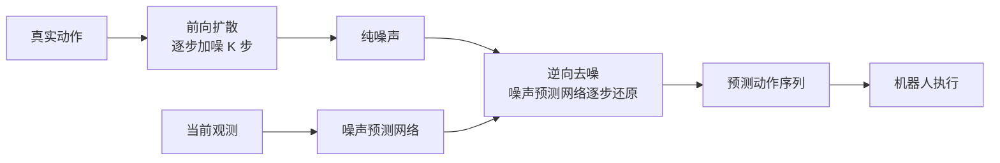

# Diffusion Policy: Visuomotor Policy Learning via Action Diffusion

- 本地 PDF：`papers/vla-architecture/Diffusion_Policy_2303.04137.pdf`
- arXiv：https://arxiv.org/abs/2303.04137
- 年份：2023
- 阶段：连续动作生成范式——扩散模型引入机器人策略学习

## 一句话总结

Diffusion Policy 将扩散模型（DDPM）引入机器人视觉运动策略学习，将动作生成建模为条件去噪扩散过程，通过预测动作序列的梯度场而非直接回归，完美解决了多模态动作分布问题和训练不稳定性，在 15 个任务上平均提升 46.9%。

## 核心技术

1. **条件去噪扩散概率模型（Conditional DDPM）** — 将机器人动作生成建模为以观测为条件的去噪扩散过程，从高斯噪声逐步细化为动作序列
2. **闭环动作序列预测 + 滚动时域控制** — 一次性预测 $T_a$ 步未来动作，执行前 $T_p$ 步后重新规划，兼顾长程一致性与实时响应
3. **时间序列扩散 Transformer（Time-series Diffusion Transformer）** — 基于 minGPT 架构的新型扩散网络，解决 CNN 低频偏置导致的过度平滑问题

## 底层原理与数学推导

Diffusion Policy 的核心洞察是：传统回归方法（MSE Loss）在处理机器人多模态动作分布时，倾向于预测无效的"平均动作"；而显式的概率建模方法（如 Mixture of Gaussians 或 Energy-Based Models）要么难以表达复杂分布，要么训练不稳定。扩散模型通过学习**动作分布的梯度（Score Function）**，绕过了归一化常数的计算，实现了稳定训练与复杂多模态分布表达的统一。

### 1. DDPM 数学推导

#### 前向扩散过程（加噪）

给定干净数据样本 $x_0 \sim q(x_0)$（即真实动作），前向过程逐步添加高斯噪声，经过 $K$ 步将其破坏为纯噪声：

$$q(x^k | x^{k-1}) = \mathcal{N}(x^k; \sqrt{1-\beta_k} x^{k-1}, \beta_k I)$$

其中 $\beta_k$ 为预先定义的噪声方差调度（noise schedule），满足 $0 < \beta_1 < \beta_2 < ... < \beta_K < 1$。通过重参数化技巧，可以直接从 $x_0$ 一步采样任意 $x^k$：

$$x^k = \sqrt{\bar{\alpha}_k} x_0 + \sqrt{1 - \bar{\alpha}_k} \epsilon, \quad \epsilon \sim \mathcal{N}(0, I)$$

其中 $\alpha_k = 1 - \beta_k$，$\bar{\alpha}_k = \prod_{i=1}^{k} \alpha_i$。当 $K$ 足够大时，$\bar{\alpha}_K \to 0$，$x^K \to \mathcal{N}(0, I)$，完全丢失原始数据信息。

#### 重参数化技巧

重参数化技巧是 DDPM 能够高效训练的关键。它将采样过程 $x^k \sim \mathcal{N}(\sqrt{\bar{\alpha}_k} x_0, (1-\bar{\alpha}_k)I)$ 重写为确定性变换加噪声：

$$x^k = \sqrt{\bar{\alpha}_k} x_0 + \sqrt{1 - \bar{\alpha}_k} \epsilon, \quad \epsilon \sim \mathcal{N}(0, I)$$

这样做的意义：
- 梯度可以自由传播通过采样操作（因为随机性被隔离到 $\epsilon$ 中）
- 训练时无需逐步执行 $K$ 步加噪，一步即可从 $x_0$ 跳到任意 $x^k$
- 损失函数可以直接在 $\epsilon$ 空间定义，即预测添加的噪声

#### 逆向去噪过程（生成）

逆向过程学习从一个步骤预测噪声并去除：

$$p_\theta(x^{k-1} | x^k) = \mathcal{N}(x^{k-1}; \mu_\theta(x^k, k), \Sigma_\theta(x^k, k))$$

训练时，噪声预测网络 $\epsilon_\theta$ 学习预测添加到 $x_0$ 上的噪声 $\epsilon$：

$$L = \text{MSE}(\epsilon, \epsilon_\theta(x_0 + \epsilon_k, k))$$

其中 $x_0 + \epsilon_k$ 即重参数化后的 $x^k$。Ho et al. (2020) 证明了最小化此损失等价于最小化数据分布 $p(x_0)$ 与 DDPM 生成分布 $q(x_0)$ 之间的 KL 散度的变分下界。

推理时，从纯高斯噪声 $x^K \sim \mathcal{N}(0, I)$ 开始，通过 $K$ 步迭代去噪：

$$x^{k-1} = \frac{1}{\sqrt{\alpha_k}} \left( x^k - \frac{\beta_k}{\sqrt{1-\bar{\alpha}_k}} \epsilon_\theta(x^k, k) \right) + \sigma_k z, \quad z \sim \mathcal{N}(0, I)$$

#### 噪声调度（Noise Schedule）

Diffusion Policy 在实践中采用 DDIM（Denoising Diffusion Implicit Models）以在推理时减少去噪步数。DDIM 将去噪过程改为确定性过程：

$$x^{k-1} = \sqrt{\bar{\alpha}_{k-1}} \left( \frac{x^k - \sqrt{1-\bar{\alpha}_k} \epsilon_\theta(x^k, k)}{\sqrt{\bar{\alpha}_k}} \right) + \sqrt{1-\bar{\alpha}_{k-1}} \epsilon_\theta(x^k, k)$$

这使得训练时可以使用全部 $K=100$ 步，但推理时仅需 $K'=16$ 步子采样，大幅加速推理。在 Diffusion Policy 的实验中，训练时设 100 步去噪迭代，推理时可降至 16 步（如表 7、表 8 的 `D-Iters Eval` 列所示）。

### 2. 为什么扩散模型解决了多模态动作分布问题

**传统方法的困境：**
- **显式策略（Explicit Policy）**：如 Mixture of Gaussians，需要预先指定模态数量 $K$，在多模态分布中 $K$ 未知时难以拟合
- **隐式策略（Implicit Policy）**：如 Energy-Based Models (IBC)，学习能量函数 $E_\theta(o, a)$，但训练需要负采样来估计归一化常数 $Z(o, \theta)$，导致训练不稳定

**扩散模型的优势：**
扩散模型实际上是学习**动作分布的 Score Function**（分数函数/梯度场）：

$$\nabla_a \log p(a|o) = -\nabla_a E_\theta(a, o) - \underbrace{\nabla_a \log Z(o, \theta)}_{=0} \approx -\epsilon_\theta(a, o)$$

噪声预测网络 $\epsilon_\theta(a, o)$ 近似等于负的分数函数 $-\nabla_a \log p(a|o)$，而分数函数**天然独立于归一化常数** $Z(o, \theta)$。因此：
- 训练时无需负采样，避免了 IBC 的不稳定性（见图 6：IBC 的 Loss 虽平滑下降但验证成功率剧烈震荡）
- 推理时通过 Langevin 动力学逐步优化，可以从多个模式中选择一个合理动作，而非"平均"多个模式

### 3. 与 Energy-Based Model 的等价性分析

Diffusion Policy 与 IBC 共享隐式策略的本质，区别在于训练方式。IBC 直接建模能量函数 $E_\theta(o, a)$，训练使用 InfoNCE 损失：

$$L_{\text{infoNCE}} = -\log\left( \frac{e^{-E_\theta(o, a)}}{e^{-E_\theta(o, a)} + \sum_{j=1}^{N_{\text{neg}}} e^{-E_\theta(o, \tilde{a}_j)}} \right)$$

负样本质量直接影响训练稳定性。扩散模型建模的是能量函数的梯度 $\nabla_a E_\theta$，避免了归一化常数的估计，从根本上保证了训练稳定性。

### 4. 与控制理论的联系（线性情形退化为 LQR）

当任务足够简单（线性动态系统 + 线性反馈策略）时，Diffusion Policy 存在解析解。考虑线性系统：

$$s_{t+1} = A s_t + B a_t + w_t, \quad w_t \sim \mathcal{N}(0, \Sigma_w)$$

演示数据来自线性反馈策略 $a_t = -K s_t$。当预测步长 $T_p = 1$ 时，最优去噪器为：

$$\epsilon_\theta(s, a, k) = \frac{1}{\sigma_k} [a + K s]$$

推理时 DDIM 采样收敛到全局最优 $a = -K s$。当 $T_p > 1$ 时，预测未来动作等价于隐式学习一个任务相关的动力学模型。

## 物理直觉解释

Diffusion Policy 就像一个经验丰富的工匠在雕刻——他不是一次性决定所有的刀法，而是一步一步地精修，每次修正一点，最终从一块粗糙的石头（噪声）中雕刻出精美的雕塑（动作序列）。

- **传统回归**：就像试图用一支笔画完美的直线，如果动作是多模态的，笔就会画在两条可能路径的中间，结果是一条歪歪扭扭的"平均线"
- **混合高斯模型（GMM）**：就像预先决定用几根线条来拟合，但如果真实动作的"路径数"不确定，就无法准确表达
- **能量模型（IBC）**：就像在动作空间中画一张"地形图"，山谷对应好的动作。但训练时需要在所有可能的动作中采负数样本，就像在没有地图的荒野中找路，极其不稳定
- **扩散模型**：就像一块粗糙的石头（噪声）在被不断地雕琢（去噪），每一步都去除一点点不确定性，最终呈现出清晰的形状

**为什么扩散模型更适合机器人动作生成？**
- 机器人动作天然是多模态的：同一任务可以用左手或右手抓，可以从上方或侧方接近
- 动作序列必须保持时序一致性：如果每一步都独立采样，动作会在不同模态之间抖动
- 扩散模型通过预测整个动作序列的梯度场，同时解决了多模态表达和时序一致性问题

## 工程细节与实操指南

### 架构设计

**CNN 版 Diffusion Policy：**
- 采用 1D 卷积的 U-Net 结构，观测特征通过 FiLM（Feature-wise Linear Modulation）逐通道调制卷积层
- 从高斯噪声 $A_t^K$ 开始，经 $K$ 次噪声预测与减法迭代，得到去噪动作序列 $A_t^0$
- 优点：超参数鲁棒性强，开箱即用效果好
- 缺点：CNN 的时域卷积归纳偏置偏向低频信号，对高频动作变化的拟合能力不足

**Transformer 版 Diffusion Policy（Time-series Diffusion Transformer）：**
- 基于 minGPT 架构，每个动作 embedding 仅关注自身及之前的动作 embedding（因果注意力掩码）
- 观测 $O_t$ 经共享 MLP 编码为观测 embedding 序列，通过交叉注意力输入 Transformer Decoder
- 去噪迭代 $k$ 的正弦位置编码作为首个 Token 输入
- 优点：高频动作变化拟合能力强
- 缺点：超参数敏感，注意力的 dropout rate 和 weight decay 需针对不同任务精细调优

### 归一化处理

动作数据的归一化对 Diffusion Policy 的性能至关重要：
- 将每个动作维度独立缩放到 $[-1, 1]$ 范围，适配 DDPM 的 $[-1, 1]$ 裁剪操作
- 当数据方差较小时（如接近常数值），先平移至零均值但不缩放，避免数值问题
- 旋转表示（如四元数）保持不变

### 视觉编码器

- 标准 ResNet-18（无预训练），但做以下修改：
  1. 全局平均池化替换为 spatial softmax pooling，保留空间信息
  2. BatchNorm 替换为 GroupNorm，配合 Exponential Moving Average 实现稳定训练
- 不同视角使用独立编码器，每帧图像独立编码后拼接形成 $O_t$
- 视觉表示仅提取一次，独立于去噪迭代次数，大幅降低推理计算量
- 消融实验显示：端到端训练的 ResNet-18 优于固定特征的 R3M 和 ImageNet 预训练模型

### 闭环动作序列预测（核心创新）

- 时间步 $t$ 取最近 $T_o$ 步观测 $O_t$ 作为输入，预测 $T_a$ 步动作
- 仅执行前 $T_p$ 步动作（$T_p < T_a$），然后重新规划剩余步骤
- 默认配置（Push-T 任务）：$T_o=2$, $T_a=8$, $T_p=16$，训练 100 去噪步，推理 16 步（DDIM）

### 核心超参数

| 超参数 | CNN 版 | Transformer 版 |
|--------|--------|----------------|
| 观测历史 $T_o$ | 2 | 2 |
| 动作步长 $T_a$ | 8 | 8 |
| 预测步长 $T_p$ | 16 | 16 |
| 扩散网络参数量 | 6.7M | 9M |
| 视觉编码器参数量 | 22M | 22M |
| 学习率 | 1e-4 | 1e-4 |
| 训练去噪迭代步数 | 100 | 100 |
| 推理去噪迭代步数(DDIM) | 16 | 16 |

### 落地实操标准步骤

1. **动作空间选择**：优先使用位置控制（Position Control），避免速度控制（Velocity Control）。扩散模型在位置控制下性能提升显著（+32%~213%），而基线方法更适合速度控制
2. **数据归一化**：各维度独立缩放到 $[-1, 1]$
3. **观测编码**：端到端训练 ResNet-18（spatial softmax + GroupNorm）
4. **滚动时域控制**：$T_o=2$, $T_a=8$, $T_p=16$ 作为默认起点
5. **DDIM 加速**：训练 100 步，推理 16 步，平衡质量与速度

## 消融实验与分析

| 消融因子 | 变化 | 结论 |
|---------|------|------|
| 扩散推理步数 | 100 vs 16 vs 4 | 16 步推理在精度和速度间最优 |
| 动作预测 horizon | 16 vs 8 vs 4 步 | 更长 horizon 提升时序一致性 |
| 观测 horizon | 2 vs 1 帧 | 2 帧历史显著优于单帧 |
| 扩散架构 | CNN vs Transformer (DiT) | DiT 在大规模数据上表现更好 |

**核心结论**：动作 horizon 和推理步数是 Diffusion Policy 的两个关键权衡——长 horizon 改善时序一致性，少步数降低延迟。

## 技术权衡（Trade-off）

| 优势 | 劣势与工程代价 |
|------|----------------|
| 天然支持多模态动作分布，无需预设模态数量，表达能力远超 GMM | 100 步迭代去噪推理延迟较高，需借助 DDIM 降至 16 步才能实时运行 |
| 训练稳定性远超 IBC（能量模型），无需负采样，Loss 平滑下降 | 动作数据归一化要求严格 —— 缩放范围 $[-1,1]$，不适应不同幅度的动作变化时需精细处理 |
| 高维动作空间扩展性好，可联合预测长动作序列（8-16 步），保证时序一致性 | Transformer 变体超参数敏感，dropout 率和 weight decay 在不同任务间差异大，需逐任务调优 |
| 支持 CNN 和 Transformer 双架构，CNN 开箱即用，Transformer 提供高频拟合上限 | 3D 旋转表示（轴角/6D 表示）需要特殊处理，且对旋转精度敏感 |
| 在 15 个任务上平均提升 46.9%，显著跨任务泛化 | 图像观测的视角数量有限制，过多视角会导致观测拼接后维度爆炸 |

## 技术价值与演进定位

Diffusion Policy 是连续动作生成范式的里程碑。它首次证明了扩散模型在机器人策略学习中的巨大潜力，彻底改变了 VLA 领域的动作表示范式：

- 超越了 RT-1 等离散 Token 化方法的精度瓶颈，实现了连续、平滑的动作生成
- 解决了 IBC 等隐式策略训练不稳定的核心缺陷
- 其"预测高维动作序列 + 滚动时域控制"的设计被后续 Octo、Diffusion Transformer 等工作继承
- 为 Flow Matching（Pi-Zero 等）进一步优化生成质量和推理速度奠定了理论和实践基础

基准对比（视觉策略，最高分）：

| 任务 | LSTM-GMM | IBC | BET | DiffusionPolicy-C | DiffusionPolicy-T |
|------|----------|-----|-----|-------------------|-------------------|
| Lift | 1.00 | 0.94 | 1.00 | 1.00 | 1.00 |
| Can | 1.00 | 0.39 | 1.00 | 1.00 | 1.00 |
| Square | 1.00 | 0.08 | 1.00 | 1.00 | 1.00 |
| Transport | 0.98 | 0.00 | 1.00 | 1.00 | 1.00 |
| ToolHang | 0.82 | 0.03 | 0.76 | 0.98 | 1.00 |
| Push-T | 0.69 | 0.75 | 0.79 | 0.91 | 0.78 |

## 与其他论文的关系

- RT-1 采用离散动作 Token，精度受限；Diffusion Policy 采用连续扩散生成，精度大幅提升
- Octo 继承 Diffusion Policy 的连续生成范式，并扩展到多机器人多任务的大规模训练
- Pi-Zero / Flow Matching 进一步用流匹配替代扩散模型，将推理步数从 16 步降至 10 步，并引入 RK4 积分提升精度
- DiT（Diffusion Transformer）将 U-Net 骨干替换为纯 Transformer，与 Diffusion Policy 中的 Time-series Diffusion Transformer 思路一致

## 精读问题

1. 扩散模型在动作空间中的 Score Function 学习与图像生成中的 Score Matching 有何本质差异？
2. 为什么位置控制（Position Control）比速度控制（Velocity Control）更适合 Diffusion Policy？
3. DDIM 降步从 100 降至 16，性能损失来自哪里？能否进一步降至 4 步？
4. CNN 版本的 FiLM 条件注入与 Transformer 版本的交叉注意力，各自的优劣根因是什么？
5. 扩散模型"从多模态中选择一个模式"的机制是什么？是随机种子决定的，还是观测决定的？
