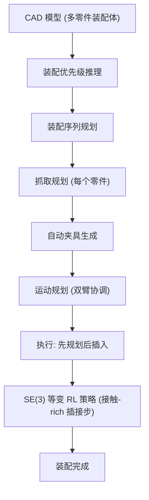

# Fabrica: Dual-Arm Assembly of General Multi-Part Objects via Integrated Planning and Learning

- 本地 PDF：`papers/vla-architecture/Fabrica_2506.05168.pdf`
- arXiv：https://arxiv.org/abs/2506.05168
- 项目页：https://fabrica.csail.mit.edu/
- 年份：2025 (CoRL 2025 Best Paper)
- 团队：MIT CSAIL, ETH Zurich, Autodesk Research, Texas A&M
- 阶段：双臂自主装配 —— 无需人类演示，从 CAD 模型到真实装配

## 一句话总结

Fabrica 是一个端到端双臂装配系统：从 CAD 模型出发，通过层级规划（装配顺序→抓取→运动规划+自动夹具生成）+ 轻量 SE(3) 等变 RL 策略完成接触-rich 插接步，零样本 sim-to-real 迁移，7 种装配件 81-95% 累计成功率。CoRL 2025 Best Paper。

## 核心技术

1. **层级规划栈** — 优先级图→装配序列→抓取规划→运动规划 + 自动夹具生成，全自动从 CAD 到执行
2. **SE(3) 等变 RL 策略** — 轻量 RL 策略处理高精度插接步，SE(3) 等变网络结构保证零样本 sim-to-real 迁移
3. **自动夹具生成** — 从零件几何自动设计夹具和固定装置，无需人工设计
4. **零人类演示** — 不需要遥操作数据，仿真是唯一的训练数据源

## 底层原理与数学推导

层级规划的每一层解耦不同时间尺度的决策——从宏观（装配顺序）到微观（插入动作的力控）。

## 物理直觉解释

装配一个凳子需要拧螺丝、对齐榫卯、压入连接件——每一步的精度要求完全不同。Fabrica 的核心洞察：**不要用 RL 解决所有问题**。宏观层面（先装哪块板、从哪个角度抓）用经典规划就够了，微观层面（螺丝对准洞口那一毫米）用 RL 因为这是最需要"手感"的部分。这种分工让系统既计划性强又灵活适应。

## 实验

| 装配体 | 零件数 | 累计成功率 | 人工干预 |
|--------|--------|-----------|---------|
| 凳子 | 5 | 95% | 1-2 次 |
| 管道连接件 | 4 | 81% | 1-2 次 |
| 游戏手柄 | 6 | — | — |
| 总计 7 种 | 4-7 | **step-level ~80%** | — |

## 工程细节与实操指南

- **硬件**：双 Franka Panda 7-DoF 机械臂 + 标准平行夹爪
- **规划栈**：优先级推理→装配序列→抓取规划→运动规划→夹具生成，全自动
- **RL 策略**：轻量网络（~2M 参数），SE(3) 等变架构，仅在仿真中训练
- **仿真**：Isaac Gym，domain randomization（摩擦力、质量、视觉纹理）
- **夹具**：从零件 CAD 几何自动生成 3D 打印固定装置
- **Benchmark**：7 种装配体（凳子、管道、游戏手柄、冷却歧管等），4-7 零件/个

## 消融实验与分析

| 消融因子 | 结论 |
|---------|------|
| SE(3) 等变 vs 普通 MLP | SE(3) 等变是零样本 sim-to-real 的关键 |
| RL vs 纯规划 | RL 在接触-rich 步显著优于纯运动规划 |
| 有/无自动夹具 | 自动夹具对多零件装配的必要性 |
| 有/无层级规划 | 层级解耦对复杂装配体的 scalability |

**核心结论**：SE(3) 等变 RL 和层级规划是 Fabrica 成功的关键支柱——前者保证 sim-to-real 迁移，后者保证复杂装配体的可行性。

## 技术权衡（Trade-off）

| 优势 | 劣势与工程代价 |
|------|----------------|
| 零人类演示，全自动从 CAD 到执行 | CAD 模型需要准确——现实物体的 CAD 可能有偏差 |
| 层级解耦使各模块独立可替换 | 多模块串联有累积误差 |
| SE(3) 等变 RL 零样本 sim-to-real | 仅覆盖插接步，不覆盖全任务序列 |

## 技术价值与演进定位

Fabrica 代表了 manipulation 的一个独立路线：**planning + RL 的层级混合**。不是端到端 VLA（π0 路线），也不是纯 RL（Dreamer 路线），而是把经典机器人的规划能力和现代 RL 的接触适应性结合起来。对制造/装配场景有直接实用价值。

## 与其他论文的关系

- **π0 / π0.5** — 端到端 VLA imitation learning，Fabrica 用 planning+RL 不用人类 demo
- **SymSkill (ICRA 2026 Best Paper)** — 同为层级符号规划+技能，Fabrica 偏制造装配，SymSkill 偏家庭操作
- **RL Token** — 也做接触-rich 精调，Fabrica 从仿真训练而非 online RL

## 精读问题

1. 自动夹具生成的泛化性——对非标准几何形状（如曲面、柔性件）的表现？
2. CAD 到真实物体的几何偏差对插接成功率的影响？
3. 层级规划中某一步失败后的恢复机制？
