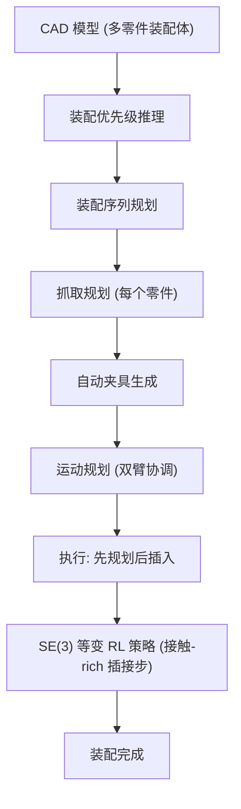

# Fabrica: Dual-Arm Assembly of General Multi-Part Objects via Integrated Planning and Learning

- 本地 PDF：`papers/vla-architecture/Fabrica_2506.05168.pdf`
- arXiv：https://arxiv.org/abs/2506.05168
- 项目页：https://fabrica.csail.mit.edu/
- 年份：2025 (CoRL 2025 Best Paper)
- 团队：MIT CSAIL, ETH Zurich, Autodesk Research, Texas A&M
- 阶段：双臂自主装配 —— 无需人类演示，从 CAD 模型到真实装配

## 一句话总结

Fabrica 是一个端到端双臂装配系统：从 CAD 模型出发，通过层级规划（装配顺序→抓取→运动规划+自动夹具生成）+ 轻量 SE(3) 等变 RL 策略完成接触-rich 插接步，零样本 sim-to-real 迁移，7 种装配件 81-95% 累计成功率。CoRL 2025 Best Paper。

## 核心技术

1. **层级规划栈** — 优先级图→装配序列→抓取规划→运动规划 + 自动夹具生成，全自动从 CAD 到执行
2. **SE(3) 等变 RL 策略** — 轻量 RL 策略处理高精度插接步，SE(3) 等变网络结构保证零样本 sim-to-real 迁移
3. **自动夹具生成** — 从零件几何自动设计夹具和固定装置，无需人工设计
4. **零人类演示** — 不需要遥操作数据，仿真是唯一的训练数据源

## 底层原理与数学推导

```mermaid
graph TD
    CAD["CAD 模型 (多零件装配体)"] --> PRECEDENCE["装配优先级推理"]
    PRECEDENCE --> SEQUENCE["装配序列规划"]
    SEQUENCE --> GRASP["抓取规划 (每个零件)"]
    GRASP --> FIXTURE["自动夹具生成"]
    FIXTURE --> MOTION["运动规划 (双臂协调)"]
    MOTION --> EXECUTE["执行: 先规划后插入"]
    EXECUTE --> RL_POLICY["SE(3) 等变 RL 策略 (接触-rich 插接步)"]
    RL_POLICY --> ASSEMBLED["装配完成"]
```

层级规划的每一层解耦不同时间尺度的决策——从宏观（装配顺序）到微观（插入动作的力控）。

**1. 装配-保持序列规划**：规划被形式化为对序列 $\sigma$、抓取 $\gamma$ 与机器人运动 $\pi$ 的联合优化

$$
\min_{\phi, \sigma, \gamma, \pi} \mathbb{E}\left[ \sum_{i=1}^{n} \tilde{f}(\sigma_{1:i}; \gamma_{i-1:i}; \pi_i) \right] \quad \text{s.t.} \quad C_{prec}(\sigma) \le 0, \; C_{kin}(\sigma, \gamma, \pi) = 0, \; C_{col}(\sigma, \gamma, \pi) \le 0
$$

其中 $C_{prec}$ 为装配优先级约束（如先装底板才能装侧板），$C_{kin}$ 为运动学可行性（双臂可达），$C_{col}$ 为碰撞约束。序列 $\sigma = [o_{a,1}, o_{h,2}, o_{a,2}, \ldots]$ 交替排列"被装配零件"与"被扶持零件"（双臂一臂装配、一臂扶持子装配体）。

**2. 残差动作 RL**：策略只输出开环规划动作之上的修正量 $a_t = a_t^{openloop} + \pi_\theta(o_t)$，将粗装配方向先验注入学习，加快收敛并提升最终精度；插接奖励极简——当前零件位置与目标位置的负 L2 距离 $r = -\|p - p^*\|_2$，稠密且足以学出稳定的插入行为。

**3. SE(3) 等变性**：策略网络对 SE(3) 群等变，几何变换下输出随输入一致变换，这是零样本 sim-to-real 与跨任务泛化的结构保证（同一边权被所有位姿共享）。

## 物理直觉解释

**Fabrica 的核心洞察：不要用 RL 解决所有问题。** 装配一个凳子需要拧螺丝、对齐榫卯、压入连接件——每一步的决策尺度完全不同。宏观层面（先装哪块板、从哪个角度抓取、双臂谁扶谁装）是离散组合问题，用经典规划（优先级约束 $C_{prec}$ + 运动学 + 碰撞）即可精确求解；微观层面（螺丝对准洞口那一毫米、插入时如何顺着接触力修正）才是连续控制问题，最需要"手感"，交给 RL。这就像盖房子：施工顺序和图纸由工程师规划，砌墙时砖缝对齐靠瓦匠的手感——两者缺一不可。

**为什么 RL 只做"残差"？** 若让 RL 从零学整个装配动作，等于要求瓦匠不看图纸徒手砌墙。Fabrica 的策略输出的是开环规划轨迹之上的**修正量**（residual action）：规划给出粗方向，RL 只负责"纠偏"，相当于新手司机在导航给出的路线上做微调，而非从零认路。这带来更快的收敛和更稳的 sim-to-real 迁移（真实世界 80% 无干预步骤成功率，纯开环跟踪仅 23%）。

**SE(3) 等变是一把"旋转不变的手"**：同一个装配动作，把整个场景旋转 30 度再放下来，网络输出必须跟着旋转而不是重新学一遍。等变网络让策略在数学结构上保证旋转对称性，因此仿真里学到的插入技能可以零样本迁移到真实世界、并泛化到未见的装配体（AG 通用策略在 OOD 装配体上达到与专用策略相当的 80% 成功率）。

| 装配体 | 零件数 | 累计成功率 | 人工干预 |
|--------|--------|-----------|---------|
| 凳子 | 5 | 95% | 1-2 次 |
| 管道连接件 | 4 | 81% | 1-2 次 |
| 游戏手柄 | 6 | — | — |
| 总计 7 种 | 4-7 | **step-level ~80%** | — |

## 工程细节与实操指南

- **硬件**：双 Franka Panda 7-DoF 机械臂 + 标准平行夹爪
- **规划栈**：优先级推理→装配序列→抓取规划→运动规划→夹具生成，全自动
- **RL 策略**：轻量网络（~2M 参数），SE(3) 等变架构，仅在仿真中训练
- **仿真**：Isaac Gym，domain randomization（摩擦力、质量、视觉纹理）
- **夹具**：从零件 CAD 几何自动生成 3D 打印固定装置
- **Benchmark**：7 种装配体（凳子、管道、游戏手柄、冷却歧管等），4-7 零件/个

## 消融实验与分析

真实世界无干预步骤成功率（7 种装配体 Overall）：

| 方法/消融因子 | 无干预步骤成功率 | 0/1/2 次干预累计成功率 |
|---------|----------------|----------------------|
| Ours（Assembly Specialist） | 80% | 15% / 81% / 95% |
| AG（通用策略，OOD 装配体） | 80% | 10% / 81% / 100% |
| ASAP（单臂规划 + 本文 RL 适配基线） | 55% | 0% / 5% / 57% |
| Open-Loop 跟踪（纯规划无闭环） | 23% | 0% / 0% / 14% |
| w/o 零件序列优化 | 71% | 10% / 48% / 81% |
| w/o 抓取优化 | 64% | 5% / 14% / 81% |
| w/o 路径中心变换 | 61% | 5% / 43% / 67% |

**核心结论**：三组消融定量揭示了各支柱的贡献层次——(1) 闭环 RL 远胜纯开环规划（80% vs 23%，差距来自接触-rich 步的顺应性修正）；(2) 零件序列优化与抓取优化的缺失分别导致 71%/64% 的成功率下滑，且 w/o 抓取优化时 0 干预成功率从 15% 暴跌到 5%，说明劣质抓取直接引发零件滑落；(3) SE(3) 等变通用策略（AG）在未见装配体上追平专用策略（AS），证明等变性是零样本 sim-to-real 与跨装配体泛化的结构基础。

## 技术权衡（Trade-off）

| 优势 | 劣势与工程代价 |
|------|----------------|
| 零人类演示，全自动从 CAD 到执行 | CAD 模型需要准确——现实物体的 CAD 可能有偏差 |
| 层级解耦使各模块独立可替换 | 多模块串联有累积误差 |
| SE(3) 等变 RL 零样本 sim-to-real | 仅覆盖插接步，不覆盖全任务序列 |

## 技术价值与演进定位

Fabrica 代表了 manipulation 的一个独立路线：**planning + RL 的层级混合**。不是端到端 VLA（π0 路线），也不是纯 RL（Dreamer 路线），而是把经典机器人的规划能力和现代 RL 的接触适应性结合起来。对制造/装配场景有直接实用价值。

## 与其他论文的关系

- **π0 / π0.5** — 端到端 VLA imitation learning 路线：依赖人类示教数据，Fabrica 用 planning+RL 且零人类演示，是"无数据泛化"的对照路线
- **SymSkill (ICRA 2026 Best Paper)** — 同为层级符号规划+技能学习，Fabrica 偏制造装配（CAD→执行），SymSkill 偏家庭操作
- **RL Token** — 也做接触-rich 精调：RL Token 从在线 RL 中学习，Fabrica 从仿真训练 + 残差动作，探索安全性更高
- **Seo et al. (SE(3) 等变增益调度)** — 论文在 related work 中明确对比：已有等变工作不改变抓取与几何，Fabrica 首次把等变策略推广到多变位姿、多几何的完整多零件装配
- **IKEA 椅 / LEGO 装配系工作** — 领域专用装配系统的代表：依赖特定零件几何与专用夹具，Fabrica 用自动夹具生成 + 通用规划栈打破领域限定

## 精读问题

1. 自动夹具生成的泛化性——对非标准几何形状（如曲面、柔性件）的表现？
2. CAD 到真实物体的几何偏差对插接成功率的影响？偏差超过多少毫米导致 RL 策略失效？
3. 层级规划中某一步失败后的恢复机制？规划层与 RL 层之间的失败检测与重规划协议如何设计？
4. 残差动作的幅度上限——开环规划误差过大时，RL 修正量饱和会如何影响插入成功率？
5. SE(3) 等变性是否可扩展到包含物体形变（柔性件）的非等变场景？此时如何放松等变假设？
6. 0/1/2 干预曲线中"0 干预成功率 15%→2 干预 95%"的跳跃——哪些步骤的系统性失败可以通过强化扶持策略消除？
