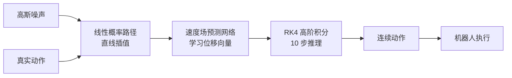

# Flow Matching for Generative Modeling

- 本地 PDF：`papers/vla-architecture/Flow_Matching_for_Generative_Modeling_2210.02747.pdf`
- arXiv：https://arxiv.org/abs/2210.02747
- 年份：2022
- 阶段：连续动作生成范式——流匹配替代扩散模型

## 一句话总结

Flow Matching 提出了一种无需模拟（simulation-free）的连续归一化流（CNF）训练框架，通过直接回归条件概率路径的速度场，避免了传统 CNF 的昂贵 ODE 数值模拟，同时以最优传输（OT）路径替代扩散路径，实现了更直的训练轨迹、更快的采样速度和更好的泛化性能。

## 核心技术

1. **流匹配（Flow Matching, FM）** — 直接回归目标速度场的 CNF 训练目标，无需昂贵的 ODE 模拟
2. **条件流匹配（Conditional Flow Matching, CFM）** — 通过条件概率路径分解不可解的边缘速度场，转化为可解的单样本回归问题
3. **最优传输（Optimal Transport, OT）概率路径** — 线性插值路径使得粒子沿直线匀速运动，训练和采样效率远超扩散路径

## 底层原理与数学推导

### 1. 流匹配核心思想的三大定理

#### 预备知识：连续归一化流（CNF）

定义概率密度路径 $p: [0,1] \times \mathbb{R}^d \to \mathbb{R}_{>0}$ 和时间依赖向量场 $v: [0,1] \times \mathbb{R}^d \to \mathbb{R}^d$。向量场 $v_t$ 通过常微分方程（ODE）定义了一个微分同胚映射 $\phi: [0,1] \times \mathbb{R}^d \to \mathbb{R}^d$：

$$
\frac{d}{dt} \phi_t(x) = v_t(\phi_t(x)), \quad \phi_0(x) = x
$$

概率密度通过 push-forward 方程演变：$p_t = [\phi_t]_* p_0$。

#### 定理 1：FM 目标（公式 5）

给定目标概率密度路径 $p_t(x)$ 和生成它的向量场 $u_t(x)$，Flow Matching 目标为：

$$L_{\text{FM}}(\theta) = \mathbb{E}_{t, p_t(x)} \| v_t(x) - u_t(x) \|^2$$

其中 $t \sim U[0,1]$，$x \sim p_t(x)$。该损失直接回归 $u_t$，达到零损失时 CNF 模型将精确生成 $p_t$。

然而，$p_t$ 和 $u_t$ 均未知。

#### 定理 2：边缘向量场等于条件向量场的期望（公式 6, 8）

通过引入条件概率路径 $p_t(x|x_1)$（以数据样本 $x_1$ 为条件），边缘概率路径为：

$$p_t(x) = \int p_t(x|x_1) q(x_1) dx_1$$

边缘向量场由条件向量场的加权平均给出：

$$u_t(x) = \int \frac{u_t(x|x_1) p_t(x|x_1) q(x_1)}{p_t(x)} dx_1$$

**关键洞察**：上述边缘向量场 $u_t$ 生成边缘概率路径 $p_t$。这提供了条件 VF（易于定义）与边缘 VF（希望生成）之间的桥梁。

#### 定理 3：FM 与 CFM 梯度等价

条件流匹配（CFM）目标为：

$$L_{\text{CFM}}(\theta) = \mathbb{E}_{t, q(x_1), p_t(x|x_1)} \| v_t(x) - u_t(x|x_1) \|^2$$

**定理 2**：假设 $p_t(x) > 0$ 对所有 $x \in \mathbb{R}^d$ 和 $t \in [0,1]$ 成立，则 $L_{\text{FM}}$ 与 $L_{\text{CFM}}$ 相差一个与 $\theta$ 无关的常数，故 $\nabla_\theta L_{\text{FM}}(\theta) = \nabla_\theta L_{\text{CFM}}(\theta)$。

这彻底解决了 CNF 训练的困境：只需设计可解的条件概率路径 $p_t(x|x_1)$ 和条件向量场 $u_t(x|x_1)$，优化 CFM 等价于优化 FM。

### 2. 条件概率路径与向量场的一般形式

考虑高斯条件概率路径：

$$p_t(x|x_1) = \mathcal{N}(x \mid \mu_t(x_1), \sigma_t(x_1)^2 I)$$

边界条件：在 $t=0$ 时 $\mu_0(x_1)=0, \sigma_0(x_1)=1$ 汇聚到标准高斯噪声；在 $t=1$ 时 $\mu_1(x_1)=x_1, \sigma_1(x_1)=\sigma_{\text{min}}$ 汇聚到数据点。

**定理 4**：生成上述高斯路径的唯一向量场为：

$$u_t(x|x_1) = \frac{\sigma_t'(x_1)}{\sigma_t(x_1)} (x - \mu_t(x_1)) + \mu_t'(x_1)$$

### 3. 扩散路径 vs OT 路径

#### 扩散条件 VF（VP 扩散）

VP 扩散路径：

$$p_t(x|x_1) = \mathcal{N}(x \mid \alpha_{1-t} x_1, (1 - \alpha_{1-t}^2) I), \quad \alpha_t = e^{-\frac{1}{2} T(t)}, \quad T(t) = \int_0^t \beta(s) ds$$

代入定理 3 得到的向量场：

$$u_t(x|x_1) = -\frac{T'(1-t)}{2} \left[ \frac{e^{-T(1-t)} x - e^{-\frac{1}{2} T(1-t)} x_1}{1 - e^{-T(1-t)}} \right]$$

该路径在 $t=1$ 时并不严格到达纯噪声（$p_0$ 仅为近似高斯），且路径弯曲（粒子先走远再折返）。

#### OT 条件 VF（最优传输路径）

定义均值和标准差随时间线性变化：

$$\mu_t(x_1) = t x_1, \quad \sigma_t(x_1) = 1 - (1 - \sigma_{\text{min}}) t$$

线性插值路径：

$$x_t = t x_1 + (1-t) x_0$$

代入定理 3 得到极其简洁的向量场：

$$u_t(x|x_1) = \frac{x_1 - (1 - \sigma_{\text{min}}) x_0}{1 - (1 - \sigma_{\text{min}}) t}$$

其时间独立形式（忽略 $\sigma_{\text{min}}$）：

$$u_t(x|x_1) = \frac{d x_t}{d t} = x_1 - x_0$$

条件流映射（即 OT 位移映射）：

$$\psi_t(x) = (1 - (1 - \sigma_{\text{min}}) t) x + t x_1$$

CFM 损失的具体形式为：

$$L_{\text{CFM}}(\theta) = \mathbb{E}_{t, q(x_1), p(x_0)} \left\| v_t(\psi_t(x_0)) - [x_1 - (1 - \sigma_{\text{min}}) x_0] \right\|^2$$

**OT 路径性质：**
- 粒子始终沿直线匀速运动，无"过冲"和折返
- 向量场随时间方向恒定：$u_t(x|x_1) = g(t) \cdot h(x|x_1)$，大幅简化回归任务
- 路径定义在 $t \in [0,1]$ 上均有效，无需近似

### 4. 流匹配在 VLA 中的应用（Pi-Zero 实现）

Pi-Zero 将流匹配应用于机器人 VLA 模型的动作生成。给定含噪动作 $x_t$，模型预测速度场 $v_\theta(x_t, t)$，训练目标是：

$$\min_\theta \mathbb{E}_{t, x_0, x_1} \left[ \left\| v_\theta(x_t, t) - (x_1 - x_0) \right\|^2 \right]$$

线性概率路径：

$$x_t = t x_1 + (1-t) x_0$$

其中 $x_1 \sim p_1$ 为真实动作数据，$x_0 \sim p_0$ 为高斯噪声。

#### RK4 高阶数值积分（推理阶段）

推理时，从噪声 $x_0$ 出发，沿模型预测的速度场积分得到动作 $x_1$。Pi-Zero 弃用欧拉法（截断误差 $O(\Delta t)$），采用四阶 Runge-Kutta（RK4，截断误差 $O(\Delta t^4)$），在极少的积分步数下即可达到高精度：

$$
\begin{aligned}
k_1 &= \Delta t \cdot v_\theta(x_t, t) \\
k_2 &= \Delta t \cdot v_\theta(x_t + k_1/2, t + \Delta t/2) \\
k_3 &= \Delta t \cdot v_\theta(x_t + k_2/2, t + \Delta t/2) \\
k_4 &= \Delta t \cdot v_\theta(x_t + k_3, t + \Delta t) \\
x_{t+\Delta t} &= x_t + \frac{1}{6}(k_1 + 2k_2 + 2k_3 + k_4)
\end{aligned}
$$

Pi-Zero 将时间步 $t$ 仅切分为 10 步，相比扩散模型的 100 步，推理速度提升 10 倍。

## 物理直觉解释

Flow Matching 像给机器人的动作规划了一条"平滑的高速公路"，模型学习的是每个点在这条路上的行驶速度，从起点（噪声）到终点（目标动作），全程连续平滑，没有任何台阶和跳跃。

- **离散分箱**：就像走楼梯，只能在台阶之间跳，动作不平滑，有固有误差
- **扩散模型**：就像开车走盘山公路，需要绕很多圈（100 步去噪）才能到终点。路径弯曲——粒子先被推向远离目标的方向再折返回来，速度慢，过程复杂
- **流匹配（OT 路径）**：就像开车走直线高速公路，只需要 10 步就能到终点，速度快，路径平滑，精度极高

**OT 路径的"直觉魔力"**：
扩散路径通过随机微分方程（SDE）定义，每个粒子的轨迹像布朗运动一样随机游走，最终虽然能到终点但走的是弯路。OT 路径通过最优传输理论保证，在条件概率路径中，粒子沿直线从起点匀速运动到终点。可以理解为：扩散路径是"盲人摸路"，摸着石头过河；OT 路径是"开导航"，预知最优路径直达终点。

**为什么 OT 路径更易学习？** 扩散路径的条件向量场随时间变化方向和大小都会改变——如图 2 所示，早期阶段向量指向一个方向，后期阶段完全反向。神经网络相当于要学习一个时变的复杂映射。OT 路径的向量场方向恒定，仅大小随时间线性变化，回归任务简单得多。

## 工程细节与实操指南

### 关键发现

**训练稳定性：** Flow Matching 即使使用扩散路径训练，也比 Score Matching 更稳定更鲁棒。原因在于 FM 直接回归向量场，而 Score Matching 需要回归分数函数 $\nabla \log p_t(x)$，后者在高维空间中数值不稳定。

**采样效率（OT 路径）：** 达到相同数值精度，OT 路径仅需扩散路径约 60% 的函数评估次数（NFE）。在 ImageNet 32x32 数据集上，OT 路径在使用 Midpoint 求解器、10 NFE 时即可达到可用的 FID 分数，而扩散路径需要 20+ NFE。

### 核心超参数（ImageNet 实验）

| 超参数 | CIFAR-10 | ImageNet-32 | ImageNet-64 | ImageNet-128 |
|--------|----------|-------------|-------------|--------------|
| Channels | 256 | 256 | 192 | 256 |
| Depth | 2 | 3 | 3 | 3 |
| Batch Size | 256 | 1024 | 2048 | 1536 |
| GPUs | 2 | 4 | 16 | 32 |
| Epochs | 1000 | 200 | 250 | 571 |
| Iterations | 391k | 250k | 157k | 500k |
| Learning Rate | 5e-4 | 1e-4 | 1e-4 | 1e-4 |

### Pi-Zero 工程细节（VLA 应用落地）

- **动作控制频率**：推高至 50Hz，远超 RT-2 的 10Hz
- **骨干网络**：DiT（Diffusion Transformer），时间步 $t$ 仅切分为 10 步
- **低频滤波**：流匹配生成的极短时切片中可能存在散粒噪声，RK4 积分输出后必须串接二阶巴特沃斯低通滤波器（10Hz 截止频率），平滑最终指令，避免机械臂高频抖动
- **平滑性**：彻底消除 RT-1/RT-2 的离散化抖动，机械臂动作具备极强的"生物感"

### 落地实操标准步骤

1. **路径选择**：默认使用 OT 条件路径（线性插值），性能优于扩散路径
2. **CFM 训练**：采样 $t \sim U[0,1]$，采样 $x_1 \sim q(x_1)$（训练数据），采样 $x_0 \sim \mathcal{N}(0, I)$，计算 $x_t = t x_1 + (1-t) x_0$，最小化 $\|v_\theta(x_t, t) - (x_1 - x_0)\|^2$
3. **推理采样**：从 $x_0 \sim \mathcal{N}(0, I)$ 开始，使用 RK4 或 Midpoint 积分求解 ODE，推荐 10-20 步
4. **后处理**（机器人场景）：串接低通滤波器消除散粒噪声

## 技术权衡（Trade-off）

| 优势 | 劣势与工程代价 |
|------|----------------|
| 训练稳定性远超扩散模型，损失函数形式极简，无复杂的加噪去噪过程，无模式坍塌风险 | 对训练数据质量要求极高，低质量示教数据会导致速度场学习混乱，动作稳定性下降 |
| 推理速度极快，10 步积分即可达到扩散模型 100 步的精度，适配 50Hz 高频实时控制 | 推理阶段的数值积分对步长敏感，步长过大会导致积分误差累积，过小则降低推理帧率 |
| OT 路径粒子沿直线匀速运动，无"过冲"折返，回归目标极其简单，训练收敛更快 | 条件 OT 路径的"最优性"仅对条件分布保证，边缘速度场并非最优传输解 |
| 彻底消除了离散化的阶梯效应，实现工业级高精度高平滑度的连续动作生成 | 语义推理能力弱于大参数量 VLM 架构（如 OpenVLA），复杂指令零样本泛化能力不足 |
| 统一了扩散路径和 OT 路径的框架，兼容现有一切高斯概率路径 | 需要针对不同任务选择合适的概率路径（扩散 vs OT），路径选择本身是一个超参数 |

## 技术价值与演进定位

Flow Matching 从数学上统一了扩散模型和 CNF 的视角，证明了 CNF 可以通过简单的回归目标高效训练，无需昂贵的 ODE 模拟。其提出的 OT 路径将采样步数从扩散模型的数百步降至十步级别，效率提升一个数量级。

在 VLA 领域，Flow Matching 通过 Pi-Zero 等工作彻底终结了离散分箱范式。它使机器人动作生成从"能做"走向了"做得精准、做得丝滑"，为 VLA 模型在工业场景的规模化落地扫清了核心精度障碍。

定量性能对比（ImageNet 32x32）：

| 方法 | NLL (BPD) | FID | NFE |
|------|-----------|-----|-----|
| DDPM | 3.54 | 6.99 | 262 |
| Score Matching | 3.56 | 5.68 | 178 |
| ScoreFlow | 3.55 | 14.14 | 195 |
| FM w/ Diffusion | 3.54 | 6.37 | 193 |
| **FM w/ OT** | **3.53** | **5.02** | **122** |

## 与其他论文的关系

- Diffusion Policy 证明了扩散模型可用于机器人策略，但推理需 16+ 步去噪；Flow Matching 将此降至 10 步
- Rectified Flow（Liu et al., 2022）与 Flow Matching 同期独立提出，核心思想类似（学习直线路径的速度场）
- Pi-Zero 将 Flow Matching 的 OT 路径与 DiT 骨干结合，并引入 RK4 积分和低通滤波，实现了 50Hz 高精度控制
- Flow Matching 的训练稳定性优势使它在 VLA 模型中逐渐取代 DDPM 成为新一代动作生成标准

## 精读问题

1. 为什么 FM 与 CFM 的梯度等价而 Score Matching 与 Denoising Score Matching 也等价？这两种等价性的数学结构有何异同？
2. OT 条件路径的直线性如何保证边缘速度场的简单性？是否存在边缘速度场也接近线性的理论保证？
3. RK4 相比欧拉法的精度提升在低步数场景下是否仍然显著？10 步 RK4 与 20 步欧拉法对比如何？
4. 低通滤波器的截止频率如何选择？是否与动作频率、噪声分布有关？
5. Flow Matching 能否与 FAST Tokenizer 结合 —— 在频域中做流匹配？
