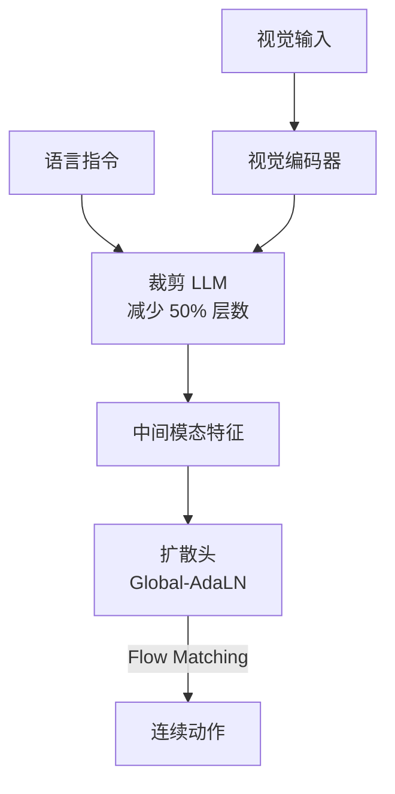

# FLOWER: Democratizing Generalist Robot Policies with Efficient VLA Flow Policies

- Local PDF: `papers/vla-architecture/FLOWER_2509.04996.pdf`
- arXiv: https://arxiv.org/abs/2509.04996
- Project: https://intuitive-robots.github.io/flower_vla/
- 年份：2025
- 阶段：高效 VLA

## 一句话总结

FLOWER 是一个仅 950M 参数的视觉-语言-动作 flow policy，通过中间模态融合（裁剪 50% LLM 层）和动作特定全局自适应层归一化（削减 20% 扩散头参数），预训练仅需 200 H100 GPU 小时，在 190 个任务上达到数十亿参数模型的性能水平，CALVIN ABC benchmark 取得新 SOTA 4.53。

## 核心技术

1. **中间模态融合（Intermediate-Modality Fusion）** — 裁剪预训练 VLM（Florence-2）最后 30%-50% 的 Transformer 层，将压缩节省的模型容量重新分配给扩散动作头
2. **动作特定全局自适应层归一化（Action-Specific Global-AdaLN）** — 在所有层之间共享扩散调制信号，同时为不同动作维度设置特定的归一化层，削减 20% 扩散头参数
3. **交叉动作空间流匹配（Cross-Action Space Flow Matching）** — 用共享 Transformer 主干配合动作特定的编解码模块处理异质动作空间
4. **极致训练效率** — 预训练 200 H100 GPU 小时，微调在 4 张 GPU 上仅需 4 小时
5. **CALVIN ABC→D SOTA 4.53** — 以 1/7 以下参数量超越此前的最佳方法

## 底层原理与数学推导

### 中间模态融合的理论动机

预训练的视觉语言模型（如 Florence-2、LLaVA）通常包含数十层 Transformer，其深层专精于高级语义推理。然而，在机器人动作预测任务中，大量的语义推理层并非必要——机器人需要在理解场景语义后快速生成动作，而非进行多轮推理。FLOWER 的核心洞察是：**模型参数是有限的预算，应重新分配从"过度推理"到"精确动作生成"**。

设一个标准 Vision-Language Model 有 $L$ 层 Transformer，输入图像 $x_v$ 和语言指令 $x_l$ 通过前 $k$ 层后得到的中间表征为：

$$h^{(k)} = f_{\text{VLM}}^{(1:k)}(x_v, x_l), \quad h^{(k)} \in \mathbb{R}^{d}$$

传统方法将全部 $L$ 层输出 $h^{(L)}$ 送入动作头，而 FLOWER 的中间模态融合选取中间层输出 $h^{(k)}$（$k < L$），将其直接作为策略头的输入：

$$a = \pi_{\theta}(h^{(k)})$$

这意味着可以移除后 $L - k$ 层。设 $L=40$（常见 LLM 层数），$k=20$，则裁剪比例为 $50\%$。设每层参数量约为 $12d^2$（标准 Transformer），则节省的参数量为：

$$\Delta_{\text{params}} = (L - k) \times 12d^2 = 20 \times 12d^2$$

这些节省的参数量被重新分配到扩散动作头（Flow Head）中，使其拥有更充裕的模型容量来学习动作生成分布：

$$\text{HeadCapacity} = \text{HeadCapacity}_{\text{orig}} + \eta \times \Delta_{\text{params}}$$

其中 $\eta \in (0,1)$ 是容量再分配比例。

### 动作特定全局自适应层归一化（Global-AdaLN）

标准的自适应层归一化（AdaLN）在扩散模型中用于注入时间步条件 $t$：

$$\text{AdaLN}(x, t) = \gamma(t) \odot \text{LN}(x) + \beta(t)$$

其中 $\gamma(t), \beta(t)$ 是由时间步 $t$ 调制的小型 MLP 网络输出，每个 Transformer 块有独立的 $\gamma, \beta$ 预测网络。假设有 $N$ 个 Transformer 块，每个调制网络有 $M_{\text{mod}}$ 个参数，则归一化总参数量为 $N \times M_{\text{mod}}$。

FLOWER 的 Global-AdaLN 将所有层的调制信号共享，使用单一全局调制预测网络：

$$\gamma_{\text{global}}(t), \beta_{\text{global}}(t) = f_{\text{mod}}(t)$$

然后广播到所有 $N$ 个块：

$$\text{Global-AdaLN}_i(x_i, t) = \gamma_{\text{global}}(t) \odot \text{LN}(x_i) + \beta_{\text{global}}(t), \quad \forall i \in \{1,...,N\}$$

参数量从 $N \times M_{\text{mod}}$ 压缩为 $M_{\text{mod}}$，即削减了约 $1 - 1/N$（当 $N$ 较大时接近 $100\%$）。但完全共享会损失不同层对不同动作维度的适应性。FLOWER 进一步引入**动作特定（Action-Specific）**设计：为每个动作维度 $a_j$ 保留一个轻量级残差调制：

$$\gamma_i^{(j)}(t) = \gamma_{\text{global}}(t) + \Delta\gamma_i^{(j)}, \quad \beta_i^{(j)}(t) = \beta_{\text{global}}(t) + \Delta\beta_i^{(j)}$$

其中 $\Delta\gamma_i^{(j)}$ 和 $\Delta\beta_i^{(j)}$ 是每个块-动作维度对的可学习嵌入向量，维度远小于全局调制网络。设 $d_{\text{emb}}$ 为嵌入维度，则额外参数为 $2 \times N \times d_{\text{action}} \times d_{\text{emb}}$，相比 $N \times M_{\text{mod}}$ 大幅减小。论文报告该设计整体削减了 $20\%$ 的扩散头参数。

### 流匹配（Flow Matching）动作生成

FLOWER 基于 flow matching 生成连续动作。设动作分布为 $q(a)$，学习一个时间相关的向量场 $v_t(a)$ 将初始分布（标准高斯）映射到目标动作分布：

$$\frac{d\phi_t(a)}{dt} = v_t(\phi_t(a), t), \quad \phi_0(a) = a_0 \sim \mathcal{N}(0, I)$$

训练目标为最小化向量场与目标条件概率路径的差异：

$$\mathcal{L}_{\text{FM}} = \mathbb{E}_{t, a_0, a_1} \left[ \| v_t(\phi_t(a), t) - u_t(a_1 \mid a_0) \|^2 \right]$$

其中 $a_1$ 为真实动作，$u_t$ 为条件概率路径。在推理时，从标准高斯采样 $a_0$，通过积分向量场 $v_t$ 逐步变换为动作 $a_1$。

## 物理直觉解释

FLOWER 的核心思想是**「好钢用在刀刃上」**——把每一分参数都花在最需要的地方。

- **为什么裁剪 50% LLM 层**：想象一个翻译员，用户只用他翻译一句话，但他有 40 层思考层——前 20 层理解句子意思，后 20 层反复纠结用词。对于机器人来说，理解场景后就要立刻行动，不需要在脑海里反复排练。FLOWER 砍掉了后 20 层，把省下的"算力预算"投入到动作生成模块。
- **Global-AdaLN 的原理**：就像公司只需要一个 HR 部门制定统一的考勤和薪资制度（全局调制），而不是每个部门都有一个独立的 HR。但对于动作控制这种需要精细调节的任务，又允许每个「部门」（不同动作维度）保留一些「个性化规定」（残差调制），在效率和灵活性间取得平衡。
- **950M 参数的意义**：一个 7B 的 VLA 模型需要 8 张 A100 训练一周，FLOWER 只需要 200 H100 小时（约 1-2 天）。这就像 F1 赛车和家用车的区别——都跑高速，但一个烧的是专业团队的天量预算，一个烧的是普通人的日常油费。

## 工程细节与实操指南

### 系统配置与训练超参

**模型架构：**
- VLM 基座：Florence-2（裁剪最后 30%-50% 层）
- 视觉编码器：Florence-2 内置视觉编码器
- 动作头：Cross-Action Space Flow Transformer
- 位置编码：RoPE（Rotary Position Embedding）
- 归一化：RMSNorm，Q-Normalization（训练稳定）
- 激活函数：SwiGLU
- 轻量适配：LoRA adapters 用于动作维度高效微调

**训练成本：**
- 预训练：仅 200 H100 GPU 小时
- 微调：4 GPU × 4 小时
- 总参数量：950M（sub-billion）
- 训练数据：190 个任务，10 个仿真和真机基准

**主要 Benchmark 结果：**
- CALVIN ABC→D：**4.53**（SOTA），首个任务成功率 99.3%/99.4%
- CALVIN ABCD→D：4.67；D→D：4.35
- LIBERO-Long：94.9%
- LIBERO 平均：96.9%
- SIMPLER Bridge 平均：45%（远超 RT-1-X 1.1%、OpenVLA 1.0%）
- 真实世界泛化：平均超 OpenVLA 28%

### 落地实操标准步骤

1. **选择裁剪比例**：从 30% 裁剪开始实验（经验法则：40 层 LLM -> 保留 20-28 层），层数过多的收益递减
2. **Global-AdaLN 配置**：设置单全局调制网络 + 动作特定残差嵌入，嵌入维度一般取 16-32
3. **LoRA adapter 适配**：不同动作维度（如 6-DoF 位姿 + 夹爪）需要独立的 LoRA adapter
4. **流匹配扩散步数**：推荐推理步数 10-20 步，步数越多动作越平滑但延迟增加
5. **资源规划**：4 GPU 即可完成微调，适合个人实验室或小团队部署

### 关键参数调优

- **裁剪层数 $k$**：保留层数过少（<30%）语义理解崩溃；过多（>70%）收益递减。推荐 50%
- **动作特定残差嵌入维度 $d_{\text{emb}}$**：8-16 即可捕获动作差异，过大浪费参数
- **流匹配步数**：快速原型用 10 步，精度敏感任务用 20 步
- **LoRA rank**：推荐 16-32，rank 过高时过拟合风险增大

## 技术权衡（Trade-off）

| 优势 | 劣势与工程代价 |
|------|---------------|
| 仅 950M 参数，训练成本极低（200 H100 小时） | 裁剪 LLM 层限制了深度语义推理能力 |
| 在 CALVIN/LIBERO/SIMPLER 上达到甚至超越更大模型 | 对需要多轮推理的复杂任务可能不足 |
| 微调仅需 4 GPU 4 小时，适合小团队 | Flow matching 推理需要多步采样，延迟高于单步方法 |
| 支持多异质动作空间（Cross-Action Space） | 裁剪比例需要针对每个 VLM 基座重新调优 |
| 在 190 个任务上广泛验证，泛化可信 | 与多模态大模型的端到端训练相比，架构稍显复杂 |

## 技术价值与演进定位

FLOWER 是**高效 VLA 路线的重要里程碑**。它证明了「更大 ≠ 更好」——精心设计的 sub-billion 模型可以在关键 benchmark 上超越数十亿参数的同类方法：

- 打破了 VLA 领域「参数量竞赛」的趋势，为资源受限的研究场景提供了可行方案
- 中间模态融合为 VLM 在机器人领域的应用提供了新的效率视角：LLM 的深层语义推理并非机器人操作的必要组件
- Global-AdaLN 为扩散模型的效率优化提供了新的归一化范式，对非机器人领域的流匹配模型也有借鉴意义
- 200 H100 GPU 小时的训练门槛，使得更多中小型实验室能够开展 VLA 研究

演进定位：
- 与 OpenVLA（7B）对比：FLOWER 以 1/7 参数实现 competitive 性能
- 继承 Flow Matching 连续动作生成范式（vs. RT-1 的离散动作 token）
- 与 Octo（sub-billion）同属「轻量级 VLA」，但架构设计和效率更优
- 从「更大模型、更多数据」转向「更高效设计、更低门槛」

## 与其他论文的关系

- **RT-1 / RT-2**：FLOWER 用 Flow Matching 连续动作替代离散动作 token，摒弃了量化误差
- **OpenVLA（7B）**：直接对比对象——1/7 参数量，更低的训练成本，接近或超越的性能
- **Octo**：也是 sub-billion VLA，但 FLOWER 的 LLM 裁剪和 Global-AdaLN 更加系统化
- **π0.5**：FLOWER 以 1/10+ 参数量和极小预训练算力匹配其性能
- **Diffusion Policy / Flow Matching**：FLOWER 继承了连续动作生成范式，并在归一化方面做了效率创新

## 精读问题

1. 中间模态融合中，裁剪层数的选择依据是什么？不同层级的中间表征在语义上有何特性差异？
2. Global-AdaLN 的参数量缩减公式如何精确推导？动作特定残差嵌入的维度选择是否已经过系统 ablation？
3. Flow matching 的推理步数如何与动作精度和延迟进行 trade-off？是否有自适应步数策略？
4. 在 SIMPLER Google Robot 基准上低于 RT-1-X（31.9% vs 42.4%）的原因是什么？是数据分布还是架构限制？
5. 裁剪后的中间模态表征是否丢失了重要的视觉-语言对齐信息？如何评估？
6. FLOWER 在真实世界的 28% 提升（超 OpenVLA）是否在统计上显著？实验覆盖了哪些具体场景？
