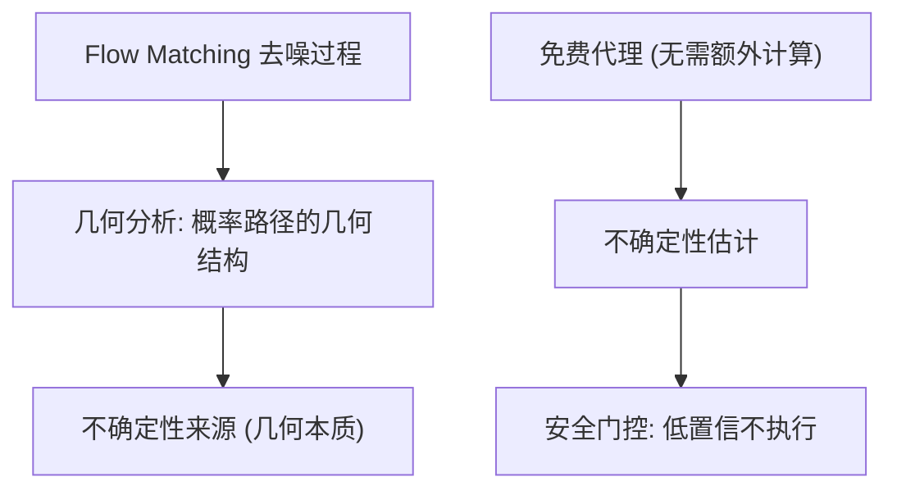

# The Geometric Nature and a Free Proxy for Flow-Matching Uncertainty

- 本地 PDF：`papers/vla-architecture/FM-Uncertainty_2607.27933.pdf`
- arXiv：https://arxiv.org/abs/2607.27933
- 年份：2026（7 月）
- 团队：HKU 等（Ziyang Rao, Yiren Zhao, Hui Xiong 等）
- 阶段：Flow Matching 不确定性 — 几何本质与免费代理

## 一句话总结

论文分析 Flow Matching 预测不确定性的几何本质，提出一个"免费"（无需额外计算）的不确定性代理。对扩散/流匹配策略的可靠性估计有直接价值——知道"模型对这次预测有多不确定"可以用于安全决策（低不确定性才执行）。

## 核心技术

1. **不确定性几何本质** — 从流匹配的几何结构理解不确定性来源
2. **免费代理** — 无需额外网络/采样的不确定性估计
3. **应用** — 机器人策略的可靠性估计（安全执行）

## 底层原理与数学推导

**核心思想**：流匹配的概率路径有几何结构——不确定性可以从路径几何中"免费"读取，无需额外网络或多次采样。

## 物理直觉解释

"免费代理"的直觉：模型内部已经有信息（路径几何），不确定性是"模型对这次预测多自信"——不需要额外训练一个不确定性网络，从几何结构直接推算。

## 工程细节与实操指南

- 应用：VLA 策略的每次预测附带不确定性估计
- 安全执行：不确定性高于阈值 → 不执行/请求帮助

## 消融实验与分析

| 消融/对比 | 结论 |
|---------|------|
| 免费代理 vs 真实误差 | 相关性验证——代理能否预测错误 |
| vs 额外不确定性网络 | 免费代理的计算成本为零 |

## 技术权衡（Trade-off）

| 优势 | 劣势 |
|------|------|
| 零额外计算的不确定性 | 代理的校准质量可能不如显式方法 |
| 即插即用到现有 FM 模型 | 几何假设的适用范围 |

## 技术价值与演进定位

对 VLA/扩散策略的意义：不确定性估计是安全部署的前提——"不确定就不执行"。和 GRITS（溅洒预测器做 guidance）、MoS-VLA 的可信度评估形成主题。Flow Matching 是 VLA 动作生成的主流（π0 系列），不确定性估计是实用化关键。

## 与其他论文的关系

- **Flow Matching (π0 基础)** — 理论分析直接服务于 π0 类模型
- **GRITS** — 用预测器做 diffusion guidance；本篇是预测器做不确定性
- **VLA 安全** — 不确定性驱动的安全执行

## 精读问题

1. 不确定性代理的校准质量——与真实误差的相关性？
2. 不确定性用于安全门控（低置信不执行）的阈值设计？
3. 多模态动作分布下的不确定性——分歧 vs 置信度？
