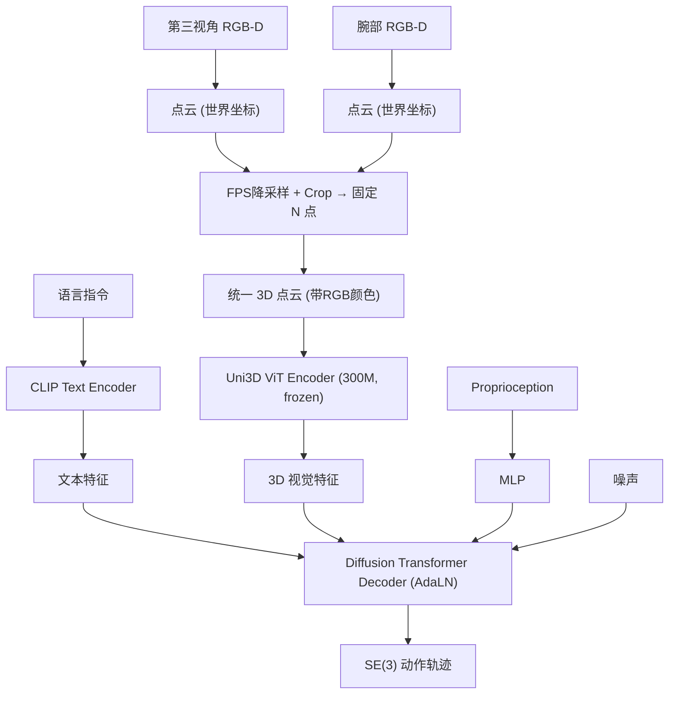

# FP3: A 3D Foundation Policy for Robotic Manipulation

- 本地 PDF：`papers/vla-architecture/FP3_2503.08950.pdf`
- arXiv：https://arxiv.org/abs/2503.08950
- 代码：https://github.com/flyingGH/3d-foundation-policy
- 年份：2025 (ICRA 2026 Best Paper Award Finalist on Robot Learning)
- 团队：清华 IIIS 高阳团队 + 上海 AI Lab + 上海期智研究院
- 阶段：首个 3D 点云操作基础策略模型 —— 1.3B, 60K 轨迹预训练, 80 demos 微调

## 一句话总结

FP3 是首个面向机器人操作的 3D 基础策略模型：将视觉输入从 2D 图像推进到 3D 点云空间，用预训练 Uni3D ViT (300M) 编码点云 + DiT (1.3B total) 解码动作，在 60K DROID 轨迹上预训练后仅需 80 demos LoRA 微调，零样本 82.5% 成功率，同域 95%。ICRA 2026 机器人学习方向 Best Paper Finalist。

## 核心技术

1. **3D 点云观测替代 2D 图像** — 将双相机点云变换到统一世界坐标系，通过 FPS 降采样到固定点数，消除视角变化对策略的影响
2. **Uni3D ViT 3D 编码器** — 300M 参数的点云 ViT 预训练模型，提取几何+语义特征，冻结在预训练阶段
3. **DiT 动作解码器** — Diffusion Transformer，AdaLN 条件调制，1.3B total，LoRA fine-tune 仅需单 GPU 约 2 小时
4. **大规模预训练 + 高效微调** — DROID 数据集 60K 轨迹/86 任务/564 场景预训练 → 目标任务 80 demos LoRA fine-tune

## 底层原理与数学推导

### 架构

### 为什么 3D 是关键

2D 图像将 3D 空间关系压缩到像素值中，迫使模型从数据中学习视角不变性。FP3 用世界坐标系的点云——直接提供物体的 3D 位置和几何形状，视角变化不影响输入表示。

**消融证据**：
- 同域微调：3D (95%) vs 2D (55%) — 去掉 3D 编码器直接降 40pp
- 无预训练：3D (1.25%) — 大规模预训练是大模型泛化的必要条件

### 训练策略

**预训练**：DROID 数据集，模仿学习 loss（action MSE），冻结 Uni3D encoder，训练 DiT decoder。

**微调**：目标任务上 LoRA fine-tune（仅 DiT decoder 的 attention 层），单 A800/3090 GPU，约 2 小时。语言指令来自固定 CLIP embedding（非微调）。

## 物理直觉解释

为什么 3D 这么重要？想象你教一个机器人"把杯子放到桌子上"。用 2D 图像训练，模型需要从几千张不同角度的照片中硬学出"杯子和桌子的 3D 位置关系"。换一个相机角度，模型就"不认识"了——因为它学的不是空间关系，而是像素模式。

FP3 直接给模型点云——就是 3D 坐标 + 颜色。杯子在 (0.3, 0.1, 0.5) 这个位置，无论你从哪个角度看，这个坐标不变。模型不需要学视角不变性——3D 输入天然就是视角不变的。这就是为什么零样本从 55%（2D）跳到 82.5%（3D）——信息没丢失。

## 工程细节与实操指南

- **点云生成**：两个 RealSense D435 RGB-D 相机（第三视角 + 腕部），RGB-D → 点云 → 变换到世界坐标系 → FPS 降采样到固定 1024 点 → Crop 手臂工作空间
- **Uni3D ViT**：预训练的 3D ViT（类似 DINO for point clouds），300M 参数，提取逐点特征后全局池化
- **DiT decoder**：约 1B 参数，AdaLN 条件调制（文本+视觉+proprioception），扩散步数 100（推理可降至 10-20 步 DDIM）
- **动作空间**：SE(3) 末端位姿 + 夹爪开合，预测 16 步 action chunk
- **预训练数据**：DROID 数据集的单臂操作轨迹子集（去除了双臂和移动操作部分）
- **微调数据**：80 demos = 8 个场景 × 10 条示教/场景
- **LoRA**：rank=16，仅微调 DiT decoder 的 attention Q/K/V 投影层
- **推理**：10-20 步 DDIM 采样，2-4Hz 有效控制频率

## 消融实验与分析

| 消融因子 | 零样本成功率 | 同域成功率 | 结论 |
|---------|------------|-----------|------|
| FP3 (full, 3D+预训练) | **82.5%** | **95.0%** | — |
| 去掉 3D（2D image only） | ~55% | ~55% | **3D 是最关键的增益**——视角不变性来自 3D 表示 |
| 去掉预训练（from scratch） | **1.25%** | — | 大规模预训练是泛化的必要条件 |
| 去掉 LoRA fine-tune | — | 显著下降 | LoRA 提供高效的 task-specific 适配 |
| 单相机 vs 双相机 | — | 双相机更优 | 腕部相机提供精细操作视角 |

**核心结论**：3D 表示和预训练是两个独立且互补的核心——3D 提供空间不变性（+30-40pp），预训练提供语义泛化（from 1% to 82%）。

## 技术权衡（Trade-off）

| 优势 | 劣势与工程代价 |
|------|----------------|
| 3D 视角不变性，零样本泛化远超 2D | 需要 RGB-D 相机 + 外参标定，部署门槛比纯 2D 高 |
| 80 demos 微调，数据效率高 | 点云的稀疏性和遮挡问题在精细操作中影响精度 |
| 1.3B, LoRA on 单 GPU ~2h | DROID 预训练数据以单臂为主，双臂/灵巧手覆盖不足 |
| 点云比 2D 图像计算量可控 | CLIP 语言编码对复杂指令的 grounding 不足 |

## 技术价值与演进定位

FP3 是 VLA 从"2D 图像时代"向"3D 空间时代"过渡的标志性工作。它证明了 3D 不是锦上添花，而是本质性的升级——几十个百分点的泛化提升。与 3D Foresight（辅助 3D 任务）和 WholeBodyVLA（全身 3D VLA）形成 3D VLA 的技术矩阵。

对申请方向的意义：如果你认同 VLA 必须走向 3D，那么丁方的 4D radar 提供了一个独特的 3D 感知模态——点云 + Doppler 速度 + 全天候鲁棒性——这是 camera-based 3D（FP3 的方案）无法覆盖的。

## 与其他论文的关系

- **OpenVLA / π0** — 2D VLA 代表，FP3 用 3D 超越
- **DP3** — 3D 扩散策略，FP3 在 DP3 基础上扩展到 foundation scale（1.3B + 60K pretrain）
- **3D Foresight** — 2D+3D 辅助任务，FP3 直接用 3D 作为主输入
- **RDT** — 另一个扩散 foundation policy，FP3 加入了 3D
- **WholeBodyVLA** — 将 3D VLA 扩展到全身人形机器人

## 精读问题

1. 点云的质量依赖 RGB-D 相机和外参标定精度——在真实部署中的鲁棒性？相机碰撞后的自动重标定？
2. Uni3D encoder 在 DROID 上冻结是否最优？对机器人操作场景的 3D 特征是否需要 fine-tune？
3. 1.3B DiT 对动作生成的推理延迟（10-20 步 DDIM）在 10Hz+ 控制频率下的实际表现？
4. 点云对透明/镜面/黑色物体的失败模式？是否可以通过 radar 或其他 3D 模态补充？
