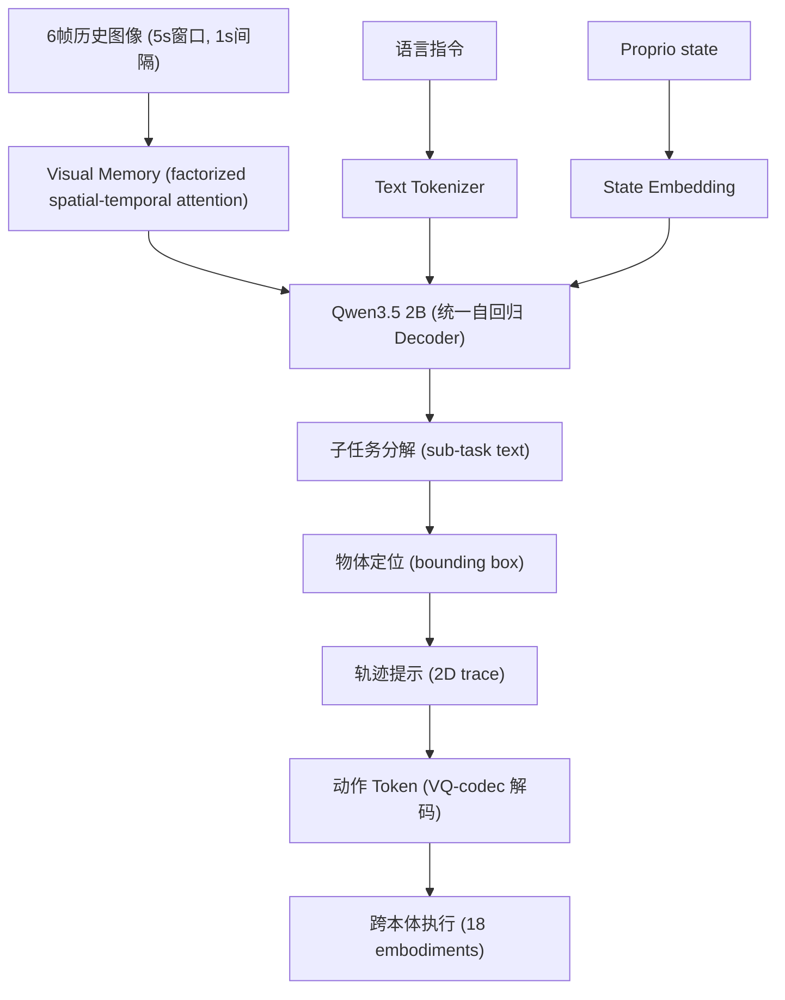

# Galaxea G0.5: 统一自回归 VLA 基础模型

- 本地 PDF：`papers/vla-architecture/G0.5_tech_report.pdf`
- 技术报告：https://opengalaxea.github.io/G05/Galaxea_G0_5.pdf
- 项目主页：https://opengalaxea.github.io/G05/
- GitHub：https://github.com/OpenGalaxea/GalaxeaVLA
- 年份：2026（6 月发布）
- arXiv：未上传 arxiv.org（公司技术报告，未经同行评议）
- 团队：星海图 (Galaxea AI)，清华 / 自动驾驶背景
- 阶段：统一自回归 VLA —— 摒弃 VLM + Action Expert 范式，推理与动作 token 同序列生成

## 一句话总结

G0.5 摒弃"VLM 编码器 + 独立动作专家"主流范式（π0/π0.5/GR00T-N1 路线），采用统一自回归 Transformer（Qwen3.5 2B 初始化），在同一 token 序列中同时生成推理 token（子任务分解、物体框、轨迹提示）和动作 token。通过 VQ-based ActionCodec 将 18 种异构机器人动作压缩为共享离散词表，配合活跃自由度自适应 token 布局，实现"边思考边行动"。7 大评测基准全面 SOTA，DROID 零样本 82.5%（π0.5 仅 57.5%），真实世界 R1 系列 76.7%（π0.5 53.3%）。

## 核心技术

1. **统一自回归建模（VLM-as-Actor）** — 同一 Transformer decoder、同一权重、同一 next-token prediction 目标，自回归 token 序列整合推理 + 动作，不分离规划与执行。与 RT-2 的离散动作 token 思路一脉相承但将"思维链"纳入生成流。

2. **ActionCodec（跨本体 VQ 动作分词器）** — 学习式 VQ tokenizer，将连续动作序列压缩为离散 code。区别于 FAST 的固定 DCT pipeline（按本体分别处理），G0.5 的 codec 端到端学习、天然跨本体共享词表。18 种具身形态映射到统一 27 维空间。

3. **活跃自由度自适应 token 布局** — 不做固定维度的 action token 生成，而是按时间步只生成正在运动的本体部分的 token 组。空闲关节直接从 token 流中丢弃，无 padding 浪费。

4. **Native CoT（原生思维链）** — 从粗到细：子任务分解 → 目标物体 bounding box → 2D 轨迹提示 → 动作 token，全部在同一 autoregressive stream 中生成。CoT 不是后加模块，而是与动作共享权重的原生能力。

5. **时空视觉记忆** — factorized spatial-temporal attention，注入 6 帧历史视觉信息（1s 间隔采样，5s 窗口），训练时 30% 随机 dropout 防止过拟合。支持遮挡和长程上下文。

## 底层原理与数学推导

### 统一自回归流

G0.5 核心公式 —— 所有 token 在同一个自回归解码器中生成：

$$\{\text{think}_1, ..., \text{think}_k, \text{act}_1, ..., \text{act}_m\} = \text{LLM}(\text{images}_{t-5:t}, \text{proprio}_t, \text{lang})$$

think tokens 为中间推理（子任务、bbox、轨迹），act tokens 为动作（27D 跨本体空间 + 活跃 mask）。

### ActionCodec 设计

27 维统一动作空间，按本体部位分组：

| Token 组 | 维度 | 内容 |
|----------|------|------|
| `<left_control>` | 9 | SE(3) 位姿 + 关节角度（左臂） |
| `<left_gripper>` | 1 | 左夹爪开合 |
| `<right_control>` | 9 | SE(3) 位姿 + 关节角度（右臂） |
| `<right_gripper>` | 1 | 右夹爪开合 |
| `<lower_body>` | 7 | 移动底盘控制 |

稀疏预测：每步只生成活跃部位的 token 组。例：step01 双臂配合 → `<left_control>` + `<right_control>` + `<left_gripper>`；step02 右臂空闲 → 仅 `<left_control>` + `<left_gripper>`。

与 FAST 的关键区别：FAST 是固定 DCT pipeline 按本体分别处理（post-hoc 压缩），G0.5 ActionCodec 是端到端 VQ 学习（learned compression），天然跨本体共享词表。

### 训练目标

单一交叉熵损失，仅在生成段（reasoning + action tokens）计算：

$$\mathcal{L} = -\sum_{t \in \text{gen}} \log p_\theta(x_t | x_{<t}, \text{images}, \text{proprio}, \text{lang})$$

输入段（images, proprio, lang）不计算 loss。整个模型用同一个 next-token prediction 目标训练，无额外的 action regression loss。

### CoT 格式采样

8 种 CoT 格式通过加权随机采样选择，训练时每条轨迹随机一种：

| CoT 格式 | 权重倾向 |
|----------|---------|
| Baseline（无 CoT） | 低 |
| Atomic task | 中 |
| High-level task text | 中 |
| Sub-task text | **高** |
| Sub-task + action hint | 中 |
| 2D trajectory traces | 中 |
| Bounding box (物体框) | 低 |
| Bounding box + trace 组合 | 低 |

## 训练配方

| 参数 | 值 |
|------|-----|
| 基座模型 | Qwen3.5 2B |
| 优化器 | AdamW (β=0.9, 0.95, weight decay=1e-2) |
| 峰值学习率 | 1e-5 |
| LR 调度 | 4000步 linear warmup → constant 到 92% → cosine decay 到峰值的 30% |
| 总训练步数 | ~120K steps |
| 视觉输入 | 6 帧 @ 1s 间隔（5s 窗口），训练时 30% 随机 dropout |
| 损失函数 | 单一 CE loss（next-token prediction），仅计算生成段 |
| VQA:Action 比例 | 1:4 |

### 预训练数据

| 数据源 | 规模 |
|--------|------|
| Web VQA | ~50M 样本 |
| Embodied VQA | ~50M 样本 |
| Internal VQA（自动标注） | ~5M 样本 |
| 机器人具身形态 | 18 种（单臂、双臂、移动操作、人形等） |

## 评测结果

| Benchmark | G0.5 | 对比 |
|-----------|------|------|
| LIBERO | **98.9%** Avg.SR | - |
| RoboTwin 2.0 | **93.3%** | Fast-WAM 91.8% |
| SimplerEnv-Bridge | **87.3%** | 先前 SOTA 79.2% |
| DROID 零样本 (10 任务) | **82.5%** | π0.5 57.5% |
| R1-Lite/R1-Pro 真实微调 | **76.7%** | π0.5 53.3%, GR00T-N1.7 24.4% |
| BEHAVIOR-1K (50 长程任务) | **0.2904** (1 epoch) | π0.5 0.2626 (4 epochs) |
| Language Pick-and-Place | **SOTA** | - |

## 物理直觉解释

G0.5 的思路可以类比为"让 VLM 直接说话控制机器人"。传统 VLM + Action Expert 路线（π0/π0.5）就像——VLM 看懂了场景，但只能用内部表征悄悄告诉一个专门的动作生成器，由后者"翻译"成动作。G0.5 的做法是让 VLM 自己开口说动作语言——先说完"我要把毛巾放进水槽"（推理），接着说"左手移动到(x,y,z)，夹爪闭合"（动作），整个思考到执行是一气呵成的对话。

ActionCodec 像是给 VLM 发了一本动作字典——把连续复杂的机器人动作翻译成 VLM 天生会处理的离散 token。活跃自由度自适应则像是"不废话"原则——不动的关节就不生成 token，像说话时跳过不需要的词。

## 工程细节与实操指南

- **推理闭环**：action chunk 执行后从新观测重规划，不是开环执行
- **系统提示指定本体**：在 system prompt 中声明目标机器人形态，模型自动适配 token 布局
- **Prompt 直接控制行为**：无需额外训练即可通过 prompt 调节动作粒度、任务 horizon、分布外场景处理策略
- **开源状态**：代码仓库 OpenGalaxea/GalaxeaVLA 已公开，模型权重宣布"coming soon"（截至 2026.06）
- **边缘部署**：此前发布过 G0Tiny (250M) 用于边缘设备

## 技术权衡（Trade-off）

| 优势 | 劣势与工程代价 |
|------|----------------|
| 统一权重使 VLM 的推理能力直接传导到动作，不经过压缩瓶颈 | 自回归逐 token 生成，推理延迟高于 flow matching 的并行解码 |
| ActionCodec 跨本体学习，不需为每种机器人单独设计 tokenizer | VQ codec 本身的训练质量和码本大小对性能影响关键 |
| Native CoT 可在推理时零样本调整行为，无需额外训练 | CoT token 增加总序列长度，进一步拖慢自回归生成 |
| 单一 CE loss 简洁优雅，无多目标调权问题 | 仅靠 next-token prediction 能否学到最优动作表征存疑 |
| 基于 Qwen3.5 2B，开源生态友好 | 自 VLM 初始化的 VLA 仍有固有推理延迟，且 VLM 能力上限是瓶颈 |

## 技术价值与演进定位

G0.5 代表了 VLA 架构从 **VLM-as-Encoder** 向 **VLM-as-Actor** 的范式回摆。这不是简单的复古——它解决了早期自回归 VLA（RT-2）的核心瓶颈（动作 token 过多导致效率低下），通过 ActionCodec 压缩 + 活跃自由度自适应做到了"自回归但高效"。

在 VLA 架构谱系中的位置：
- **RT-2** — 离散动作 token，自回归但效率低
- **π0 / π0.5** — VLM-as-Encoder + Flow Matching Action Expert
- **G0.5** — VLM-as-Actor + VQ ActionCodec + Native CoT

如果 G0.5 开源模型权重并经受住社区复现检验，这条路线可能重新定义 VLA 的默认架构选择。

## 与其他论文的关系

- **π0.5** — VLM + Action Expert（flow matching）路线，G0.5 的直接对标。G0.5 在 7/7 基准上超越
- **RT-2** — 最早的自回归 VLA，用离散动作 token。G0.5 继承了自回归思路，但用 ActionCodec 解决了 RT-2 的效率瓶颈
- **FAST** — 固定 DCT 动作分词器，按本体分别处理。G0.5 ActionCodec 是学习式 VQ 替代方案
- **GR00T-N1.7** — NVIDIA 对标模型，G0.5 在真实世界微调场景大幅超越（76.7% vs 24.4%）
- **OpenVLA** — VLM 回归动作范式，无 CoT 推理

## 团队背景

- 星海图 (Galaxea AI)：2023 年 9 月成立，清华 + 自动驾驶核心团队
- 2026 年 B+ 轮 20 亿融资，估值 200 亿+
- 2026 年 6 月发布首款全尺寸双足人形机器人行客 Kengo
- 强调全栈自研（模型 + 硬件）
- 此前发布过 G0、G0Plus、G0Tiny 等模型

## 精读问题

1. ActionCodec 的 VQ 码本大小？不同本体间的码本共享程度——是完全共享、部分共享还是本体特定 codebook？
2. Native CoT 的标注来源——子任务分解和 bounding box 是真值标注还是自动生成？标注成本？
3. 自回归生成 vs Flow Matching 并行解码的推理延迟量化对比？在实际 10-20Hz 控制频率下是否满足实时性？
4. 18 种本体在预训练中的分布是否均衡？是否存在"大本体主导、小本体遗忘"的问题？
5. ~1 亿 VQA 样本对动作生成质量的实际贡献——VQA token 和 action token 在 CE loss 中的互干扰程度？
6. 模型权重开源前的独立复现验证——社区是否有条件独立评测这些 SOTA 声明？
